# package.json

```json
{
  "dependencies": {
    "ai-digest": "^1.0.4"
  }
}

```

# README.md

```md
# A Large-scale Data Set and an Empirical Study of Docker Images Hosted on Docker Hub
Artifact repository for the ICSME'20 paper "A Large-scale Data Set and an Empirical Study of Docker Images Hosted on Docker Hub." This reproducible repository includes the data set and its description, source code of the implemented miners, and all analysis scripts and results in the paper.
## Overview of the methods for data collection and overview of the empirical study
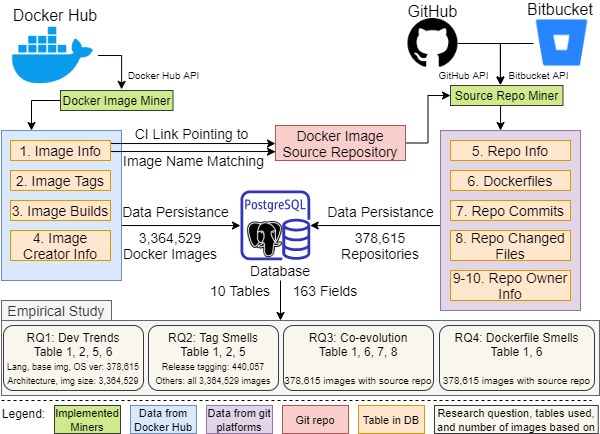
* We create, to the best of our knowledge, the largest available Docker data set collected from both real-world Docker images hosted on Docker Hub, and their source repositories from both GitHub and Bitbucket. 
    * 3,364,529 Docker images
    * 378,615 corresponding git repositories
    * Covering 98.38% of Docker images hosted on Docker Hub as of May 3, 2020.
* Using this new and more comprehensive data set, we reproduce the phenomenon studied by previous work and compare our results.
* We investigate new evolution trends to understand the changes in the Docker ecosystem as well as how Dockerfiles co-evolve with other source code.
* Given the new data from Docker Hub, we study Docker image tagging practices as well as the evolution of image sizes and architectures.

## Citation
The preprint is available [here](https://github.com/pacslab/publications/raw/master/pdf/lin2020docker.pdf).

BibTeX
\`\`\`
@inproceedings{LinICSME20,
author={Changyuan Lin and Sarah Nadi and Hamzeh Khazaei},
title={A Large-scale Data Set and an Empirical Study of Docker Images Hosted on Docker Hub},
booktitle={Proceedings of the 36th IEEE International Conference on Software Maintenance and Evolution (ICSME)},
year={2020},
url_Paper={https://www.dropbox.com/s/3bktcmdr7rlw1ic/LinICSME20.pdf}
}
\`\`\`

## Artifacts
### A Large-scale Data Set of Docker Images Hosted on Docker Hub (Section IV)
* [Link to the Data Set](https://zenodo.org/record/3862987)
* Data Set Schema and Fields Description (See the data set section below)
* [Distribution of the Pull Count for Docker Images Using CI / not Using CI](./Docs/dataset/dataset.ipynb)
* [Facts about the Data Set](./Docs/dataset/dataset.ipynb)
* [Implemented Miners](./Miners)
    * [Docker Image Miner](./Miners/DockerImageMiner)
    * [Source Repo Miner](./Miners/SourceRepoMiner)
    * [Web Application for Coordinating Miners and Data Storage](./Miners/webapp)

### A Large-scale Empirical Study of Docker Images Hosted on Docker Hub (Section V)
* [RQ1: What is the current state of Docker image development and how did it evolve over time?](./RQs/RQ1/RQ1.ipynb)
* [RQ2: What are the current Docker image tagging practices?](./RQs/RQ2/RQ2.ipynb)
* [RQ3: How do Dockerfiles co-evolve with other source code?](./RQs/RQ3/RQ3.ipynb)
* [RQ4: How prevalent are code smells in Dockerfiles?](./RQs/RQ4/RQ4.ipynb)

## Requirements
### Data Set Collection and Curation
* Docker Engine >= 19.03.9 ([Installation Guide](https://docs.docker.com/engine/install/))
* PostgreSQL >= 11 ([Installation Guide](https://www.postgresql.org/download/))
* Python >= 3.8
* pip >= 19.1.1

Required Python packages for the data set collection and curation are listed in [./Miners/webapp/requirements.txt](./Miners/webapp/requirements.txt)

Installation:
\`\`\`
pip install -r ./Miners/webapp/requirements.txt
\`\`\`

### Empirical Study
* Python >= 3.8
* pip >= 19.1.1
* [hadolint](https://github.com/hadolint/hadolint) (for RQ4 only)

Required Python packages for empirical studies are listed in [./Docs/requirements.txt](./Docs/requirements.txt)

Installation:
\`\`\`
pip install -r ./Docs/requirements.txt
\`\`\`

## Data Set
### Usage
The data set is publicly available on Zenodo. Please download the data set through [this link](https://zenodo.org/record/3862987/files/docker_dataset.sql).

Please create the corresponding database before loading the data set. We use 'dockerstudy' as the database name/username/password in our analysis scripts.

Load the data set into the PostgreSQL database.

\`\`\`
psql database-name < docker_dataset.sql
\`\`\`

### Schema and Fields Description
The data set contains 10 tables and 163 fields. It is the first data set of Docker images that is based on Docker Hub, GitHub, and Bitbucket, rather than solely Dockerfiles on GitHub.

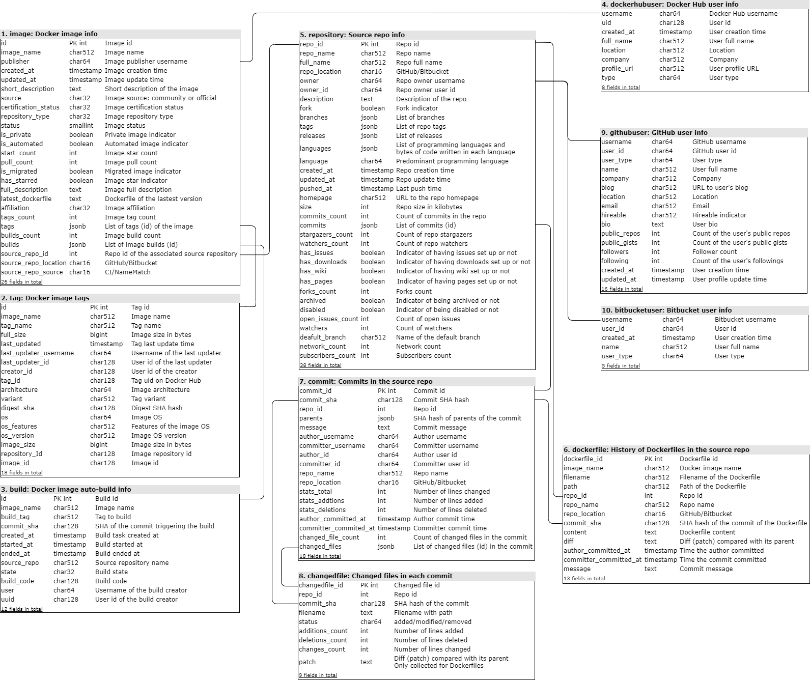

### Data Collection and Curation
We implement Docker Image Miner and Source Repo Miner for data collection. The miners can continuously obtain new data from Docker Hub and the associated GitHub/Bitbucket repositories or update existing data. We implement and containerize two miners, and their source code is available through the following links.
* [Docker Image Miner](./Miners/DockerImageMiner)
* [Source Repo Miner](./Miners/SourceRepoMiner)

For collecting a large-scale data set in a distributed way, the miners are coordinated by a Django-based web application, which is responsible for sending tasks to miners, receiving data from miners, and persisting data in the PostgreSQL database. The source code of the web application can be found [here](./Miners/webapp). The steps to set up the whole data collection system are as follows.
* Set up the web application (Working directory is [here](./Miners/webapp))
    1. Create a database for data storage in PostgreSQL.
    2. Modify the configurations regarding the database in [settings.py](./Miners/webapp/webapp/settings.py). Please modify line 83 - 88 and make those configurations (specifically, DB host, DB name, DB username, DB password, and DB port) aligned with your settings.
    3. Create database migrations `python manage.py makemigrations dockerstudy`
    4. Migrate database `python manage.py migrate`
    5. Create a superuser for ease of web application management `python create_superuser.py`. The default username is 'admin', and the password is 'password'. You can modify them in [create_superuser.py](./Miners/webapp/create_superuser.py)
    6. Initialize the web application and database `python ./db_op/DockerImageMiner_db_init.py`
    7. Start the web application `gunicorn --workers=64 --bind 0.0.0.0:8000 webapp.wsgi` and the web application should be running on http://your-ip-address:8000/
    
* Set up miners
    1. Modify the URL of the web application defined in [DockerImageMiner.py](./Miners/DockerImageMiner/DockerImageMiner.py) and [SourceRepoMiner.py](./Miners/SourceRepoMiner/SourceRepoMiner.py). Please make sure that `your-webapp-url` in two miners is replaced with the IP address of the web application.
    2. Build the Docker Image Miner  (Working directory is [here](./Miners/DockerImageMiner)) `docker build -t docker-image-miner .`
    3. Build the Source Repo Miner  (Working directory is [here](./Miners/SourceRepoMiner)) `docker build -t source-repo-miner .`
    4. Credentials are required to access APIs of GitHub and Bitbucket. For large-scale data mining, please prepare enough access tokens for [GitHub](https://help.github.com/en/github/authenticating-to-github/creating-a-personal-access-token-for-the-command-line) and [Bitbucket](https://confluence.atlassian.com/bitbucketserver/personal-access-tokens-939515499.html). We implement a token pool in the web application. Please load your access tokens into the `dockerstudy_authtoken` table in the database. The token pool distributes tokens to miners, makes sure each token complies with the API rate limit, and refreshes tokens automatically.
        * For each GitHub token, please specify the access token in the `token` field, and specify `GitHub` in the `token_type` field.
        * For each Bitbucket token, please specify the username and password in the `token` field as `username:password`, and specify `Bitbucket` in the `token_type` field.
    5. Deploy miner containers on Kubernetes/Docker Swarm cluster or using the Docker engine. The miners can continuously obtain new data from Docker Hub and the associated GitHub/Bitbucket repositories or update existing data. All collected data will be stored in the PostgreSQL database.

## Research Questions in the Empirical Study
For each RQ, there is a Jupyter notebook in the corresponding folder for reproducing all numbers, figures, and analysis results in the paper. All analysis scripts are written in Python.
* [RQ1: What is the current state of Docker image development and how did it evolve over time?](./RQs/RQ1/RQ1.ipynb)
* [RQ2: What are the current Docker image tagging practices?](./RQs/RQ2/RQ2.ipynb)
* [RQ3: How do Dockerfiles co-evolve with other source code?](./RQs/RQ3/RQ3.ipynb)
* [RQ4: How prevalent are code smells in Dockerfiles?](./RQs/RQ4/RQ4.ipynb)

Before executing scripts of each RQ, the data set should be ready in the PostgreSQL database. Please follow the ***Usage*** in the ***Data Set*** section above to download the data set from Zenodo, load the data, and set up the database.

Please modify the ***Database Configurations*** in the Jupyter notebooks and make it aligned with the configurations of the database in your environment. The following parameters should be configured.

* Define the username of the database server. The default value is dockerstudy.
\`\`\`
POSTGRESQL_USER = os.getenv('POSTGRESQL_USER') if os.getenv('POSTGRESQL_USER') is not None else 'dockerstudy'
\`\`\`

* Define the password of the database user. The default value is dockerstudy.
\`\`\`
POSTGRESQL_PASSWORD = os.getenv('POSTGRESQL_PASSWORD') if os.getenv('POSTGRESQL_PASSWORD') is not None else 'dockerstudy'
\`\`\`

* Define the IP address of the database server. The default value is localhost.
\`\`\`
POSTGRESQL_HOST_IP = os.getenv('POSTGRESQL_HOST_IP') if os.getenv('POSTGRESQL_HOST_IP') is not None else 'localhost'
\`\`\`

* Define the port of the database server. The default value is 5432.
\`\`\`
POSTGRESQL_PORT = os.getenv('POSTGRESQL_PORT') if os.getenv('POSTGRESQL_PORT') is not None else '5432'
\`\`\`

* Define the database name of the Docker data set. The default value is dockerstudy.
\`\`\`
POSTGRESQL_DATABASE = os.getenv('POSTGRESQL_DATABASE') if os.getenv('POSTGRESQL_DATABASE') is not None else 'dockerstudy'
\`\`\`

## Abstract of the Paper
Docker is currently one of the most popular containerization solutions. Previous work investigated various characteristics of the Docker ecosystem, but has mainly focused on Dockerfiles from GitHub, limiting the type of questions that can be asked, and did not investigate evolution aspects. In this paper, we create a recent and more comprehensive data set by collecting data from Docker Hub, GitHub, and Bitbucket. Our data set contains information about 3,364,529 Docker images and 378,615 git repositories behind them. Using this data set, we conduct a large-scale empirical study with four research questions where we reproduce previously explored characteristics (e.g., popular languages and base images), investigate new characteristics such as image tagging practices, and study evolution trends. Our results demonstrate the maturity of the Docker ecosystem: we find more reliance on ready-to-use language and application base images as opposed to yet-to-be-configured OS images, a downward trend of Docker image sizes demonstrating the adoption of best practices of keeping images small, and a declining trend in the number of smells in Dockerfiles suggesting a general improvement in quality. On the downside, we find an upward trend in using obsolete OS base images, posing security risks, and find problematic usages of the latest tag, including version lagging. Overall, our results bring good news such as more developers following best practices, but they also indicate the need to build tools and infrastructure embracing new trends and addressing potential issues.


## Figures
Hover to see the caption.
### Pull Count Distribution

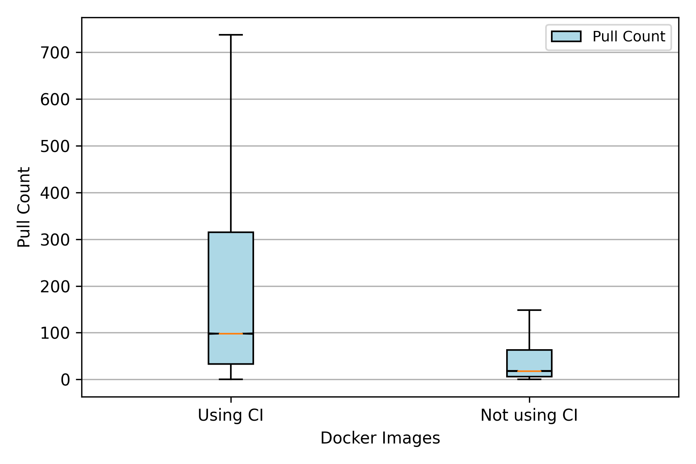

### RQ1

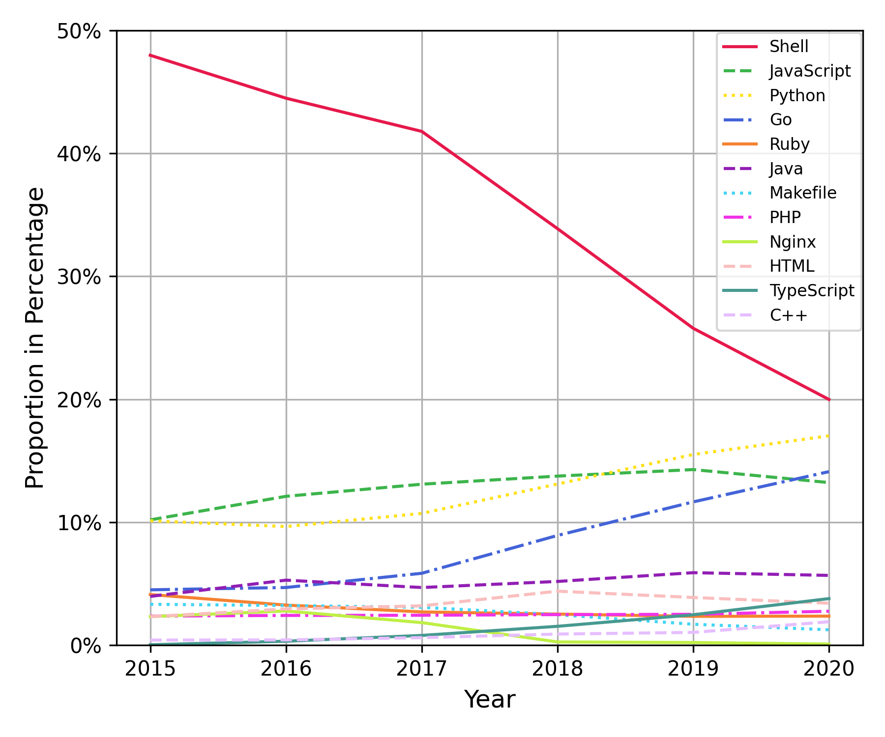


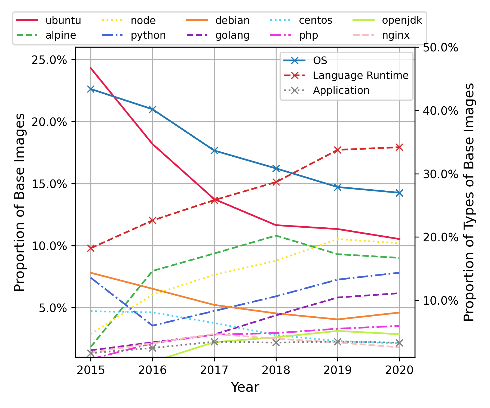


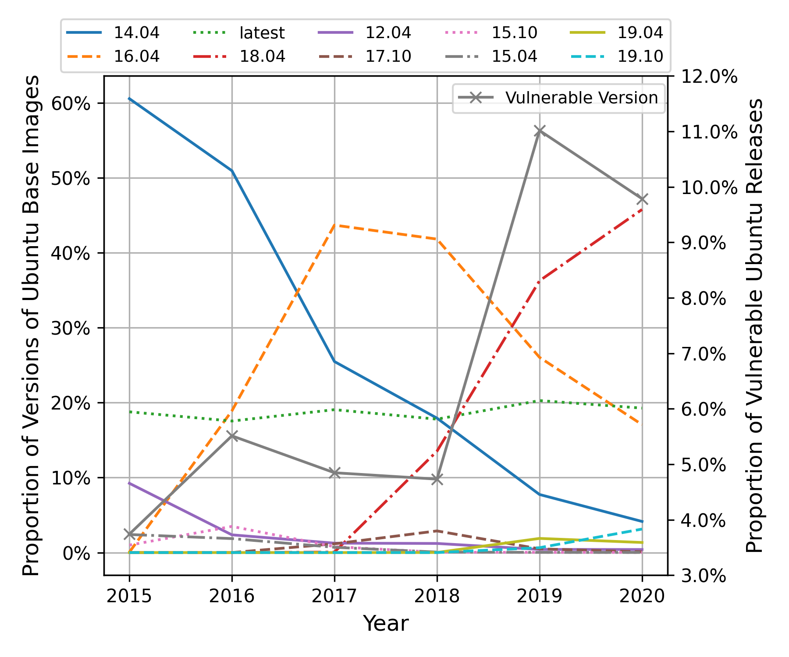


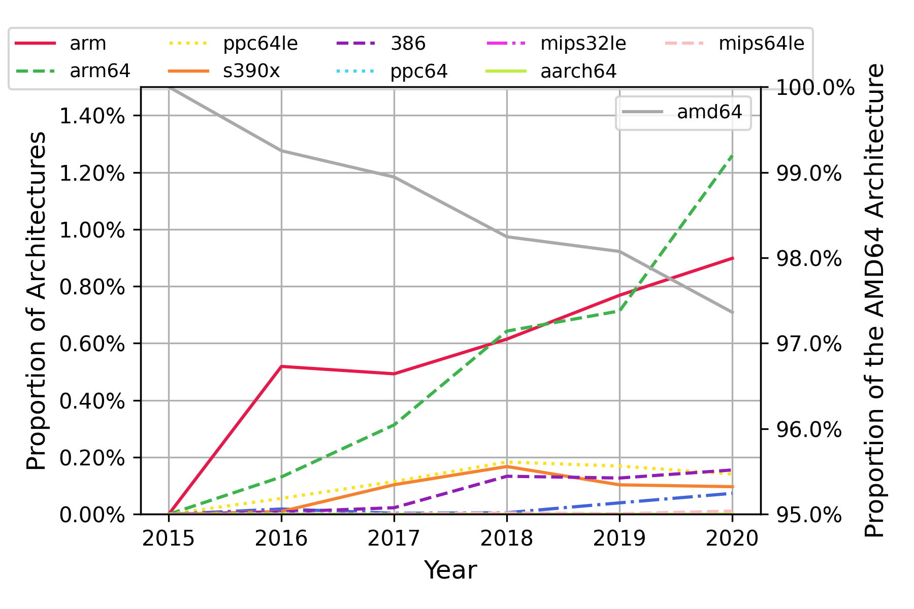


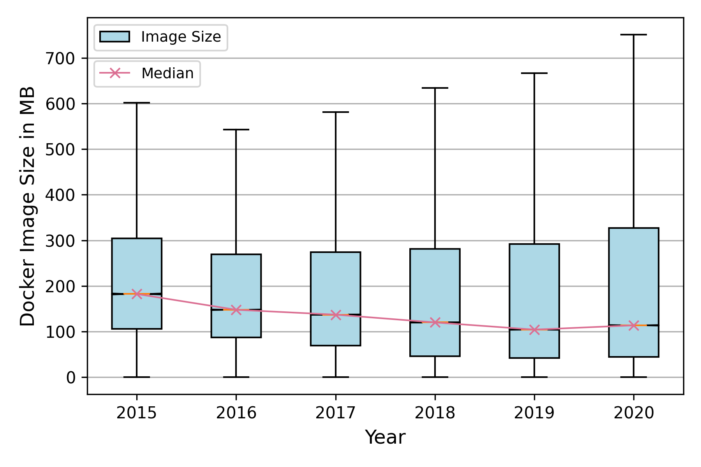


### RQ2
[Link to the Jupyter notebook](./RQs/RQ2/RQ2.ipynb)


### RQ3

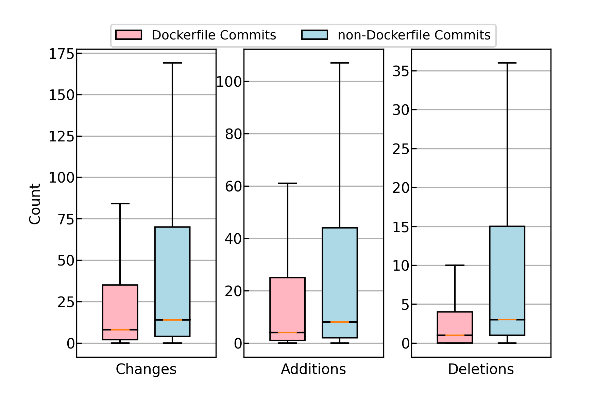

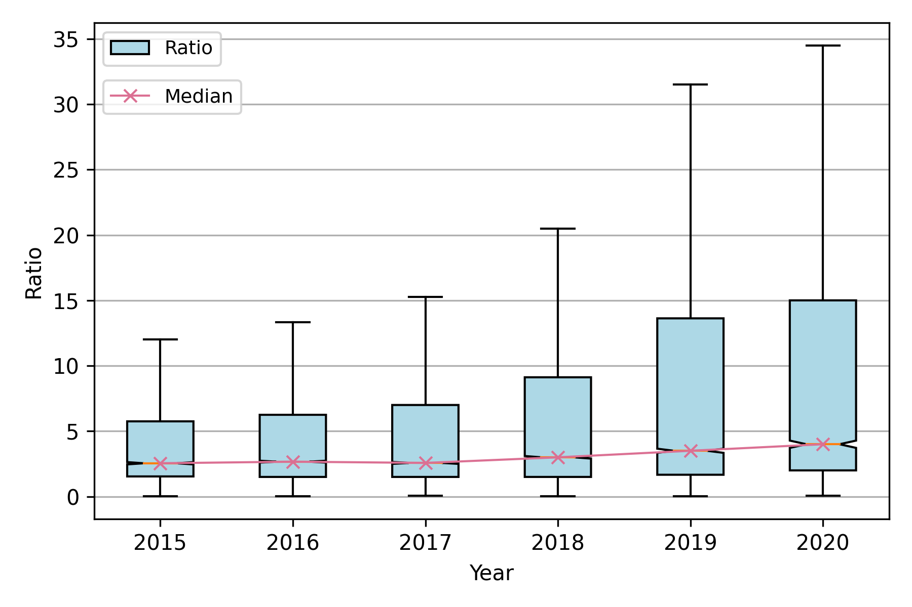

### RQ4

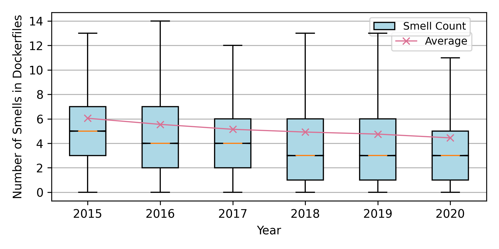

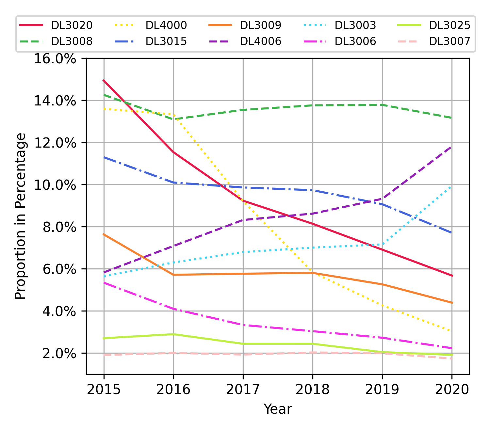


```

# LICENSE

```
MIT License

Copyright (c) 2020 icsme2020-artifacts

Permission is hereby granted, free of charge, to any person obtaining a copy
of this software and associated documentation files (the "Software"), to deal
in the Software without restriction, including without limitation the rights
to use, copy, modify, merge, publish, distribute, sublicense, and/or sell
copies of the Software, and to permit persons to whom the Software is
furnished to do so, subject to the following conditions:

The above copyright notice and this permission notice shall be included in all
copies or substantial portions of the Software.

THE SOFTWARE IS PROVIDED "AS IS", WITHOUT WARRANTY OF ANY KIND, EXPRESS OR
IMPLIED, INCLUDING BUT NOT LIMITED TO THE WARRANTIES OF MERCHANTABILITY,
FITNESS FOR A PARTICULAR PURPOSE AND NONINFRINGEMENT. IN NO EVENT SHALL THE
AUTHORS OR COPYRIGHT HOLDERS BE LIABLE FOR ANY CLAIM, DAMAGES OR OTHER
LIABILITY, WHETHER IN AN ACTION OF CONTRACT, TORT OR OTHERWISE, ARISING FROM,
OUT OF OR IN CONNECTION WITH THE SOFTWARE OR THE USE OR OTHER DEALINGS IN THE
SOFTWARE.

```

# .gitignore

```
# Byte-compiled / optimized / DLL files
__pycache__/
*.py[cod]
*$py.class

# C extensions
*.so

# Distribution / packaging
.Python
build/
develop-eggs/
dist/
downloads/
eggs/
.eggs/
lib/
lib64/
parts/
sdist/
var/
wheels/
pip-wheel-metadata/
share/python-wheels/
*.egg-info/
.installed.cfg
*.egg
MANIFEST

# PyInstaller
#  Usually these files are written by a python script from a template
#  before PyInstaller builds the exe, so as to inject date/other infos into it.
*.manifest
*.spec

# Installer logs
pip-log.txt
pip-delete-this-directory.txt

# Unit test / coverage reports
htmlcov/
.tox/
.nox/
.coverage
.coverage.*
.cache
nosetests.xml
coverage.xml
*.cover
*.py,cover
.hypothesis/
.pytest_cache/

# Translations
*.mo
*.pot

# Django stuff:
*.log
local_settings.py
db.sqlite3
db.sqlite3-journal

# Flask stuff:
instance/
.webassets-cache

# Scrapy stuff:
.scrapy

# Sphinx documentation
docs/_build/

# PyBuilder
target/

# Jupyter Notebook
.ipynb_checkpoints

# IPython
profile_default/
ipython_config.py

# pyenv
.python-version

# pipenv
#   According to pypa/pipenv#598, it is recommended to include Pipfile.lock in version control.
#   However, in case of collaboration, if having platform-specific dependencies or dependencies
#   having no cross-platform support, pipenv may install dependencies that don't work, or not
#   install all needed dependencies.
#Pipfile.lock

# PEP 582; used by e.g. github.com/David-OConnor/pyflow
__pypackages__/

# Celery stuff
celerybeat-schedule
celerybeat.pid

# SageMath parsed files
*.sage.py

# Environments
.env
.venv
env/
venv/
ENV/
env.bak/
venv.bak/

# Spyder project settings
.spyderproject
.spyproject

# Rope project settings
.ropeproject

# mkdocs documentation
/site

# mypy
.mypy_cache/
.dmypy.json
dmypy.json

# Pyre type checker
.pyre/

```

# Docs/requirements.txt

```txt
numpy>=1.18.3
matplotlib>=3.2.1
pandas>=1.0.3
pandarallel>=1.4.8
scipy>=1.4.1
psycopg2==2.8.5

```

# Docs/papericon.png

This is a binary file of the type: Image

# Docs/dataset.png

This is a binary file of the type: Image

# RQs/RQ4/popular-smells-over-time.png

This is a binary file of the type: Image

# RQs/RQ4/popular-smells-over-time.pdf

This is a binary file of the type: PDF

# RQs/RQ4/Smell_Count.png

This is a binary file of the type: Image

# RQs/RQ4/Smell_Count.pdf

This is a binary file of the type: PDF

# RQs/RQ4/RQ4.ipynb

```ipynb
{
 "cells": [
  {
   "cell_type": "markdown",
   "metadata": {},
   "source": [
    "RQ4 - How prevalent are code smells in Dockerfiles?\n",
    "=============="
   ]
  },
  {
   "cell_type": "markdown",
   "metadata": {
    "toc-hr-collapsed": false
   },
   "source": [
    "# Dependencies and Configurations"
   ]
  },
  {
   "cell_type": "markdown",
   "metadata": {},
   "source": [
    "## Import Dependencies"
   ]
  },
  {
   "cell_type": "code",
   "execution_count": 1,
   "metadata": {},
   "outputs": [],
   "source": [
    "import numpy as np\n",
    "import pandas as pd\n",
    "from scipy import stats\n",
    "import itertools\n",
    "from datetime import datetime\n",
    "import time\n",
    "import matplotlib.pyplot as plt\n",
    "import matplotlib.dates as mdate\n",
    "import matplotlib.ticker as ticker\n",
    "import psycopg2\n",
    "import os\n",
    "import re\n",
    "import subprocess\n",
    "import json\n",
    "from pandarallel import pandarallel"
   ]
  },
  {
   "cell_type": "markdown",
   "metadata": {},
   "source": [
    "### Dependency: Haskell Dockerfile Linter (Hadolint)\n",
    "* Haskell Dockerfile Linter (Hadolint) is required to reproduce this RQ.\n",
    "* Haskell Dockerfile Linter (Hadolint) Installation Instructions: https://github.com/hadolint/hadolint"
   ]
  },
  {
   "cell_type": "markdown",
   "metadata": {},
   "source": [
    "## Database Configurations"
   ]
  },
  {
   "cell_type": "code",
   "execution_count": 2,
   "metadata": {},
   "outputs": [],
   "source": [
    "POSTGRESQL_USER = os.getenv('POSTGRESQL_USER') if os.getenv('POSTGRESQL_USER') is not None else 'dockerstudy'\n",
    "POSTGRESQL_PASSWORD = os.getenv('POSTGRESQL_PASSWORD') if os.getenv('POSTGRESQL_PASSWORD') is not None else 'dockerstudy'\n",
    "POSTGRESQL_HOST_IP = os.getenv('POSTGRESQL_HOST_IP') if os.getenv('POSTGRESQL_HOST_IP') is not None else 'localhost'\n",
    "POSTGRESQL_PORT = os.getenv('POSTGRESQL_PORT') if os.getenv('POSTGRESQL_PORT') is not None else '5432'\n",
    "POSTGRESQL_DATABASE = os.getenv('POSTGRESQL_DATABASE') if os.getenv('POSTGRESQL_DATABASE') is not None else 'dockerstudy'"
   ]
  },
  {
   "cell_type": "markdown",
   "metadata": {},
   "source": [
    "## Load the relevant tables"
   ]
  },
  {
   "cell_type": "code",
   "execution_count": 3,
   "metadata": {},
   "outputs": [],
   "source": [
    "conn = psycopg2.connect(database=POSTGRESQL_DATABASE, user=POSTGRESQL_USER, password=POSTGRESQL_PASSWORD, host=POSTGRESQL_HOST_IP, port=POSTGRESQL_PORT)\n",
    "Dockerfiles = pd.read_sql_query('select * from public.dockerfile order by dockerfile_id asc', con = conn)\n",
    "Images = pd.read_sql_query('select * from public.image', con = conn)\n",
    "conn.close()"
   ]
  },
  {
   "cell_type": "markdown",
   "metadata": {},
   "source": [
    "# Smells in Dockerfiles"
   ]
  },
  {
   "cell_type": "code",
   "execution_count": 5,
   "metadata": {},
   "outputs": [],
   "source": [
    "# Function for using hadolint AST to analyze Dockerfile\n",
    "def hadolint(x):\n",
    "    file_id = str(x['dockerfile_id'])\n",
    "    file_name = 'Dockerfile_' + file_id\n",
    "    with open(file_name, 'w') as file:\n",
    "        file.write(x['content'])\n",
    "    proc_hadolint = subprocess.Popen(['hadolint', '-f', 'json', file_name],\n",
    "                                   stdout=subprocess.PIPE, stderr=subprocess.STDOUT)\n",
    "    hadolint_result = proc_hadolint.communicate()[0].decode('utf-8')\n",
    "    os.remove(file_name)\n",
    "    try:\n",
    "        results = json.loads(hadolint_result)\n",
    "    except:\n",
    "        results = []\n",
    "    return results"
   ]
  },
  {
   "cell_type": "code",
   "execution_count": 6,
   "metadata": {},
   "outputs": [],
   "source": [
    "pandarallel.initialize()\n",
    "Dockerfiles['smells'] = Dockerfiles.parallel_apply(hadolint, axis=1)\n",
    "Dockerfiles_ast_results = Dockerfiles.copy()"
   ]
  },
  {
   "cell_type": "code",
   "execution_count": 8,
   "metadata": {},
   "outputs": [
    {
     "name": "stdout",
     "output_type": "stream",
     "text": [
      "INFO: Pandarallel will run on 32 workers.\n",
      "INFO: Pandarallel will use Memory file system to transfer data between the main process and workers.\n"
     ]
    }
   ],
   "source": [
    "pandarallel.initialize()\n",
    "Dockerfiles_ast_results['smell_count'] = Dockerfiles_ast_results['smells'].parallel_apply(lambda x: len(x))\n",
    "Dockerfiles_ast_results['update_year'] = Dockerfiles_ast_results['committer_committed_at'].parallel_apply(lambda x: x.year if x is not None else None)"
   ]
  },
  {
   "cell_type": "code",
   "execution_count": 9,
   "metadata": {},
   "outputs": [],
   "source": [
    "Dockerfiles_ast_results = Dockerfiles_ast_results[Dockerfiles_ast_results['content']!='404: Not Found']\n",
    "Dockerfiles_ast_results = Dockerfiles_ast_results.sort_values(by='committer_committed_at', ascending=False)\n",
    "Dockerfiles_ast_results_trending_analysis = Dockerfiles_ast_results.groupby(by=['dockerfile_id','update_year'], as_index=False).mean()\n",
    "Dockerfiles_ast_results_trending_analysis = Dockerfiles_ast_results_trending_analysis.dropna()"
   ]
  },
  {
   "cell_type": "code",
   "execution_count": 10,
   "metadata": {},
   "outputs": [
    {
     "name": "stdout",
     "output_type": "stream",
     "text": [
      "Average smell count:  5.133314785546983\n",
      "Meidan smell count:  4.0\n",
      "25th quantile of smell count:  2.0\n",
      "75th quantile of smell count:  6.0\n",
      "The proportion of smell-free Dockerfiles:  0.07775654062151398\n"
     ]
    }
   ],
   "source": [
    "print('Average smell count: ', np.mean(Dockerfiles_ast_results_trending_analysis['smell_count']))\n",
    "print('Meidan smell count: ', np.median(Dockerfiles_ast_results_trending_analysis['smell_count']))\n",
    "print('25th quantile of smell count: ', np.quantile(Dockerfiles_ast_results_trending_analysis['smell_count'], q=0.25))\n",
    "print('75th quantile of smell count: ', np.quantile(Dockerfiles_ast_results_trending_analysis['smell_count'], q=0.75))\n",
    "print('The proportion of smell-free Dockerfiles: ', Dockerfiles_ast_results_trending_analysis[Dockerfiles_ast_results_trending_analysis['smell_count']==0].shape[0]/Dockerfiles_ast_results_trending_analysis.shape[0])"
   ]
  },
  {
   "cell_type": "code",
   "execution_count": 12,
   "metadata": {},
   "outputs": [
    {
     "data": {
      "image/png": "iVBORw0KGgoAAAANSUhEUgAAAX4AAADQCAYAAAAAuwrWAAAABHNCSVQICAgIfAhkiAAAAAlwSFlzAAALEgAACxIB0t1+/AAAADh0RVh0U29mdHdhcmUAbWF0cGxvdGxpYiB2ZXJzaW9uMy4yLjEsIGh0dHA6Ly9tYXRwbG90bGliLm9yZy+j8jraAAAgAElEQVR4nO3dd5xV1bXA8d+6ZSq9hl5ERQSjQoJBAxqDMT7BxFhi1Iga0YhG0SRPYqLGaHwmkth91mCUZ0cisWGMYMGGAtKkGXoZqQPTblvvj3NmuIwzd86t09b387mfe+8pe+81F/Y5Z5999hZVxRhjTOvha+wCGGOMyS2r+I0xppWxit8YY1oZq/iNMaaVsYrfGGNaGav4jTGmlQk0dgG86NKli/bv37+xi2GMMc3KJ598sl1Vu9Ze3iwq/v79+zN//vzGLoYxxjQrIrKuruXW1GOMMa1MgxW/iBwkIvnu5+NF5Bci0iH7RTPGGJMNXpp6XgBGiMgg4CHgH8D/Aack2klEHgNOBUpUdWitddcCdwBdVXV7KgU3xjRvu3fvZsuWLY1djBanoKCA3r17EwwG693GS8UfU9WIiPwQuEdV7xGRBR72mwbcC/w9fqGI9AFOAtZ7SMMY00Jt376d/v37U1hY2NhFaTFUlR07drBx40YGDBhQ73Ze2vjDInIOcAHwT3dZ/YeS/QV4G9hZx6q/Ar8GbHQ4Y1qxcDhMQUFBYxejRREROnfuTGVlZcLtvJzxXwhcBtyqqv8RkQHAEykW6jRgk6ouEpGGtp0ITATo3r07c+bMSSXLVuuEE05Ied+33norgyUxpm7t27dn3759jV2MFqmysjJhnSlehmUWkUKgr6quSCZzEekP/FNVh4pIEfAWcJKq7hGRtcAIL238I0aMUOvOmTkigg3HbRrb8uXLOeyww3KWXywW4+c//zlLlizB5/PRt29fpk+fnlaagwYNYvXq1UybNo2NGzfy29/+9oD1O3bsYPLkyaxfv55wOMyhhx7Kgw8+mLD93auZM2dy9NFH07dv36+sq/7bisgnqjqi9voGz/hFZBzOjdg8YICIHAncrKrjkyznQcAAoPpsvzfwqYh8U1W3JpmWMaYF6duvHxvWp3/br0/fvqxfV2fXdV5//XUikQjvvfceADt31tUSnVnnnXcel19+OePGjQPg7bffJhKJZKzi79KlS50Vf0O8NPXcBHwTmAOgqgtFZGCyGanqYqBb9fdkzviNMS3bhvXreeHzzWmn86PBPetdV1xczKpVq1i+fDmDBw+mU6dOAEybNo0XX3wRv9/P559/zi233MK0adNYs2YNd999NyeeeCKLFy9m8uTJxGIxunTpwuOPP97gTenNmzdTWlpaU+kDjB49GoAPPviAa665Bp/Px7Bhw7j//vuZO3cuTz75JI888ghw4NXEzJkz8fl8rFy5kgceeIDOnTvz2muvsWjRIgYNGsRzzz2X1N/J081dVd1Ta1msoZ1E5CngfeBQEdkoIhcnVTJjjMmg0aNHM2HCBC6//HIGDhzInXfeWbPO7/czY8YMbrjhBm655RZefPFFpk+fzt133w3ApEmTeOyxx/j3v//Nsccey6OPPtpgfhs2bKBPnz51rrviiit48skneffdd6mqqmLWrFkNpjdjxgweeugh7rrrLoYMGcLJJ5/MPffck3SlD97O+JeKyE8Av4gcDPwCmNfQTqp6TgPr+3sqoTHGZMhFF13ERRddRGlpKaNHj2b8eKfF+qijjgKgd+/eDBs2DL/fT+/evWuag5YuXcpPf/pTwLlx+t3vfrfBvPr06cP6epqv9uzZw8CBTsPJqFGj+Pzzzxk5cmS9aQ0fPhyAvn37smPHDo/R1s/LGf+VwOFAFfAUUApcnXbOxhiTQ9VNLwBt27alTZs2NZ0c4nsZxn+uXj906FCeeuop5syZwwcffMANN9zQYH49e/akffv2B5zNv/vuu1RUVNC+fXu++OILAObNm8ehhx5Kp06d2LhxIwALFy4kEokkLFNeXt4B2ySjwTN+VS0HrndfxhjTLG3cuJHJkyfj8/mIRCKMGzeOgw46iHfeeafBfe+77z4mTJhAOBwGYMqUKYwdO7bB/Z544gmuueYapk6dSiQS4ZBDDmHkyJHcfffdnHvuufj9fg4//HDGjx+PiNCuXTvGjBnDmDFjCAQSV8+nnnoqN9xwA4cddhgPPvigtz+Cq97unCIyiwQPWaXQqydl1p0zs6w7p2kK4rtz5qJXT2uSTnfOO7JYLmOMqWGVdW7VW/Gr6txcFsQYY5IRi8UIh8PEYg12Mmw1fD6fp2cE6q34ReRZVT1LRBZTR5OPqh6RXhEbV0NDRiRizSQmm1r6v81MxRcOh/H5fOTl5aWVZkuhqkQikZr7EIkkauqp7rlzakZK1cQk+g9ibeCmMbX0f5vV5V++fDmHHHIIfr+/Zl0y8cViMav044gIfr/f0/hHiSr+fwJHA7eo6vmZKpwxxgB06tSJlStXfmX58uXLPe0fDoczMvRBSxOJROp9cKxaooo/z31wa5SInF57parOSLN8xphWrHv37nTv3v0ry70O3JbrQd7iTZw4kZUrVzbJUYOXL19Ohw6JJ0lM9ADXZcC3gQ7AuFqvFtn8Y4xpeXa9+SnlqzYesKx81UZ2vflpSumFQiEWLVpE27Zt630y14toNJryvulK1KvnXRGZB2xU1VtzWCZjjMmY/L7d2Pr4a3ztgpMpOrg35as21nxPxcsvv8z48eM59NBD+fvf/84zzzzDggULCAQCTJ8+nVWrVnHTTTcxZcoU5s2bRygU4vrrr+fUU0/lpptuYu3atezcuZNzzjmHhQsX8tFHH7Fnzx4uu+wyJk6cyN69ezn77LMJhUIcccQRfPrpp8yZM4cNGzZw2WWXUVFRQWFhIdOmTaNr166p/VFUNeELWNDQNtl+DR8+XHPJ+bO0XC09vpaspf92ycS3bNkyz9uWrdyga65/WLe/8oGuuf5hLVu5IZXiqarqmWeeqevWrdPKykodPXq0Xn311frSSy+pqurJJ5+sa9as0VdffVUvvfRSJ++yMj3iiCM0FovpjTfeqBMnTqxJa9++faqqWllZqQcffLCGQiGdOnWq3nbbbaqq+uSTT+qYMWNUVfXss8/W999/X1VVZ86cqddee22d5Yv/uwDztY461csgbW+KyI+AGW5CntQ12bqI/BmnqSgErAEuVNXdSRynjDGmTqsn39vgNrtmfwzA5vtnJtxu0F+vqHP5nj17eO+995g4cSIAa9eu5eabb+bee+/lG9/4BhUVFQwcOJAXXniBuXPncvzxxwNQVVVVM7jaqFGjatJ74IEHmDlzJn6/n5KSEkpKSli1ahVnnHEGACNHjuThhx8GYPHixVx33XWAcwN30KBBDcZbHy8V/6XANUBURCoAwTkqt2tgv2l8dbL1N4Ap6kzefjswBfjvpEttjDG11FdZAzXNO+2PHcae9xbXNPsk6/nnn2fKlClccYWT15tvvsnLL7/MunXruO+++zj33HMBOPzwwznppJO46667AOe+QF5eHkBN99Vdu3bxt7/9jc8++6xmdi5VZdCgQcyfP58TTzyRjz/+uCbvww8/nClTptSMJBoKhZIufzUvg7S1TSVhVX3bnXoxftnsuK8fAGekkrYxxngV36ZfdHBvCgf1OuB7MqZPn85DDz1U8/24445j0qRJXHLJJdx00001o2uecsopzJs3j+OPPx4RoXfv3jzxxIFTlXfo0IEhQ4Zw3HHHcdhhh9G5c2cALrnkEs466yxmz57N4MGDaw4YU6dOZdKkSTX99C+66CLOO++8lP4mDc65K87TEecCA1T1DyLSB+ihqh81mHjcnLt1rJsFPKOqT9azb/xk68OffvrphrLLmBNOOKFFTzje3ONrzRPJN/ffriHJxNe+fXtPzR1l7ywh2KszeQN71CwLfbGF8KYdFH/7K1VTkxCJRAgEAjzzzDN89NFHTJ061fO+q1evZs8eZ+6sE044oc5B2rxU/A/gzLj1HVU9TEQ6ArNV9RsNFaC+il9ErgdGAKd7uW+Q69E5W8LTkYm05Phacmxg8cVrzH782RSLxRgzZgwigojwxBNPJDWvbvzfJeXJ1oGRqnq0iCwAUNVdIpLnuRS1iMgEnJu+JyZzs9gYY1oDn8/naY6AdHip+MMi4scdqE1EuuJhzt26iMjJwK+BMepM8GKMMSbHvEy9eDfwItBNRG4F3gX+2NBO9Uy2fi/QFnhDRBaKyP+mXnRjTGtXUVHRopu+kqGqVFRUeNrWyxn/88AnwIk4XTl/AGzzUIi6JltveGp6Y4zxoEePHmzatMnTMMStRTAYpEePHg1u56XinwH8QFU/BxCRHjj98YenVUJjjElDhw4dGhyMzNTNS1PPTOBZEfG7vXRex3nwyhhjTDPk5QGuh91ePDOB/sClqjov2wUzxhiTHYmmXrwm/ivQF1gIHCMix6jqX7JdOGOMMZmX6Iy/9lANM+pZbowxphlJNB7/73NZEGOMaQkyNZl8NjV4c1dE3hCRDnHfO4rI69ktljHGNE91jX9f/fKyPhe89OrpGj9mvqruArplr0jGGGOyyUvFHxWRmhGCRKQf7vANxhhjmh8vD3BdD7wrInNxevd8G3e4ZGOMMc2Pl378r4nI0cAx7qKrVXV7dotljDEmW7yc8QOMAkbHff9nFspijDEmB7z06vkf4Cpgmfu6SkS8jM75mIiUiMiSuGWd3F5Cq9z3jukU3hhjTPK83Nw9BRirqo+p6mPAyTgTqTRkmrttvOuAN1X1YOBN97sxxpgc8lLxA8QPgdfeyw6q+jaws9bi04DH3c+P4wzxbIwxJoe8tPHfBiwQkbdwevWMJvUz9e6qusX9vBXoXt+GtSZbZ86cOSlmmZpc55drLTm+lhwbWHzNXVOIr8HJ1qFmDP7qydU/UtWtnhKvNdm6iOxW1fingHepaoPt/DbZema15Phacmxg8TV3uY4vpcnWRSQAfB8Y7C5aDqTTlXObiPRQ1S3uwaQkjbSMMcakoN42fhHpBSwFrgV6Ar2AXwFLRaRnivm9BFzgfr4A+EeK6RhjjElRojP+W4EHVPXO+IUi8gucdv8L6txr/3ZPAccDXURkI3Aj8D84s3ldDKwDzkq96MYYY1KRqOI/RlUn1F6oqneLyIqGEq5nsnVwJm03xhjTSBJ156xIsK480wUxxhiTG4nO+NuLyOl1LBegXZbKY4wxJssSVfxzgXH1rHs7C2UxxhiTA4mmXrwwlwUxxhiTG16HbDDGGNNCWMVvjDGtjFX8xhjTyniaiEVERgH947dX1b9nqUzGGGOyqMGKX0SeAA4CFgJRd7ECVvEbY0wz5OWMfwQwRFvykHnGGNOKeGnjXwJ8LdsFMcYYkxtezvi7AMtE5COgqnqhqo7PWqmMMcZkjZeK/6ZMZyoik4Gf4dwrWAxcqKqVmc7HGGPMVzVY8avq3Exm6I7z/wuc+wYVIvIs8GOcydmNMcZkWaKJWN513/eKSGnca6+IlKaZbwAodGf4KgI2p5meMcYYjxKN1XOc+942kxmq6iYRuQNYjzP082xVnZ3JPIwxxtTP0wNcmSQiHYHTgAHAbuA5ETlPVZ+std1EYCJA9+7dcz4zfa7zy7WWHF9Ljg0svuauKcQnue6eLyJnAier6sXu95/izPZ1eX37jBgxQufPn5+rIiIitOTHFlpyfC05NrD4mrtcxycin6jqiNrLG2OsnvXAMSJSJCKCMxXj8kYohzHGtEoNVvwiUiwiPvfzISIyXkSCqWaoqh8CzwOf4nTl9AEPpZqeMcaY5Hg5438bKHC7Yc4GzifNrpeqeqOqDlbVoap6vqpWNbyXMcaYTPBS8YuqlgOnA/er6pnA4dktljHGmGzxVPGLyLeAc4GX3WX+7BXJGGNMNnmp+K8GpgAvqupSERkIvJXdYhljjMkWr0M2zI37/gXOkAvGGGOaoXorfhGZhTOIWp2a+uicpaWlLFq0KOX933nnnaS2DwaDjBw5EqeHavZt3ryZNWvWpLx/svF17NiRoUOHppyfMabpqPcBLhEZk2jHTA/elkgqD3BNuvJK/jHrZTp36550frt376ZDhw5J7bN21ec8/+yzjB07Nun8UjHyW6PYWbqXouI2Se+bSnwrFi9kw/r1dO3aNen8cskeAGreLL6M51fnA1yJxurJWcWeDRUVlZx60c856ezzcpLfny+fQGVl7kaWrqisZOLNd3DQ0CNykt+lY44mHA7nJC9jTHYlaupZTN1NPQKoquamxjHGGJNRiW7unpqzUhhjjMmZRE0966o/i0g/4GBV/ZeIFCbazxhjTNPmZayeS3DG1nnQXdQbmJnNQhljjMkeLw9wTQKOBUoBVHUV0C2bhTLGGJM9Xir+KlUNVX9xp0tMqz+SiHQQkedF5HMRWe4OCdGoui5YQfGmkgOWFW8qoeuCFY1UImOMyQ4vFf9cEfkNzhy5Y4HngFlp5nsX8JqqDga+ThMYj7+8W0f6vfFhTeVfvKmEfm98SHm3jo1cMmOMySwvN2mvAy7GGTv/UuAV4JFUMxSR9sBoYAKAezURSrRPLpT16sa6sSPpN/sDdh3Sl46rNrBu7EjKelmrljGmZfEyVk8MeNh9ZcIA4EvgbyLydeAT4CpVLctQ+ikr69WNqg5t6bp4DQr0e+NDIoUFhIvyiRQVECkqIFxUQKQw7nNRAdH8lOelMfX49XVT+M/atUnvV1BczJk/Pifp/Y4+8kimXPffSe+Xir179/KLqyezryz5f/KpxnfGD3/I2WeflfR+qVi9ejXX/+53xFJoEE41vut+9UuGDx+efIatVIMVv4icCvwB6OduX/0AV7s08jwauFJVPxSRu3CuKn5XK9+0Jlsv2baN3n0PSWqf4k0l5O/Zx7bhg+m89As2jD6acPs2BMorCZRXEiyvJFhWQdGXuwiUV9Us90Wi/HXwicjbX7B42eNE8wPECgJE8wNEC4LE8gNE3e/4MzPbZUVFRUbS8SoWjTJv3jy6dOmSk/z+fPv/cPWf7016v8tGHJf0PvtK93DH1Dv41jEjk943FStWrOCV117nJ5OvS3rfVOL7Ytli7rz7brp3z83V66xZs1j2xXq+e+ZPkt43lfjen/0K99xzDxMmTEh638bQFCZb99LUcyfOJCyLNTODTGwENrpTMILTVfQr/wNU9SHcKRlHjBihxx9/fFKZ/P3J6UltX92mX928s69n15rv+/okHu9HIlEeu/YKfnHeeRz+9aOJlpYRKS0nutd5RbbuI1paTmRvOb5gAH+7YgLtivC3dV6BdsX42xURaFuEv3p5cSHiq3/At8LCwqTiS5fP72fUqFH07NkzZ3l+e9zpOcln57atvPTwPST7byxVbdu2pWPnzjmLr6C4DVXbNuQsvpUrV7J0U0nO4tu89gv6d2mbs/jS1RTK6aXi3wAsyVClj6puFZENInKoqq7AmWx9WSbSTkdRya4D2vSr2/yLSnY12M6vAT/bwxVUts+nzbCB9W+nSqy8ikhp2f6DQmk50dIyqrZsJ+oeLCJ7y4lVhPC3LXQOBnEHB39b5wAxuF03iitCSDiCBhv+GbsuWEF5t44HxFK8qYSikl18edShHv9KxpiWwEvF/2vgFRGZC9TMjauqf0kj3yuB6SKSB3wBXJhGWhlRV+VX1qtbRm/uigj+4gL8xQXQo3PCbTUSJeIeHKKl5TUHi9C2nVSs2sgFB32T3ks2UbhwA+rzxd1/yD/g/kP156p2xQdc0cRf4RhjWhcvFf+twD6gAMjLRKaquhD4ylChZj8J+Al2bEuwY9s610+557ec/9vbOOjwYfhCEYLlFc59hwrnXkSgvJL83XudzxVVBMsq8VeFGDjrHaIFefhDYcq6daLD6o202VhCtCCPSEF+rfc8YnlByNEcA8aY3PBS8fdUVZuBo6kSIZYfpCo/SFVDjxxEY/T4YDFdF69m58F92Nu/J/7KKgKVIYL7Kijcvht/ZYhAZYhAZRX+yhC+aJRIfh7TT5lI5VNvs6VjO+eqpU0hvqKCmisYf3EhPvezryA/4f0JY0zj8lLxvyIiJ6nq7KyXxmRV8dbtdFy1vqbX0q7B/dlzUO+E+0g0ir8yxB/P+QHPTTydtgXFRMsqiZZXEtm9j9Dm7c73skqiZRXEyiqJhSL4i/LdA0FhzcHBV1SAv427rKgAX/znwtQPFnb/wpjkeKn4fw78UkSqgIi7LJ3unKYRJOq1lOg+hvr9RIoLWbPnS/x9u9LGQ68ejUSJljsHg5h7QKg5OJSWE9q8o9b6SmJVIXyF+TUHivvHXULvOZ8QKcirtxkqmp8HIjVPXdv9C2O88fIAV92NzKZZSafXUrIk4CfQrphAu2LP+2g0RrR8/4Hixbtv5rALJ+CvChGoqCJ/196a5qdAZQh/ZRX+cIRoXpBIQR7hwgIGvPweVR3bkr97L3v696R46w4Kt+8mFgwQC/iJBQLEgtXv+5cFQhECvsw8X5ENdkVjMi3RDFz9gN2qusf9fgLwA2AtcF/8wG1N1baN61iz5DOCeXkEgkH8QecJW7/fT5cevZJOLxwKsbNkK+B0zYyEQ0TCYSKhEPtKd2e07JmWi15L6RC/j0DbImhbBMAbaz7jsiEDEu8Ui+GvCtccELosXk2HLzZR2rs7lZ3b44tECVaF8IWj+CKRr75HovjCESQc5s0zfs3qa+/HlxdA8oPOe14QX14QCQbw5QeRvIDz3X2P/1zzHr9vMC6tYDDlpiy7omlaotEoe/fuTXn/3buTqyt8Ph/t2mW2gSXRGf+zwA+BPSJyJM7gbLcBRwL3Az/LaEkybPXKlbzzztvMfPi+Otfrjan/IeX3pXUu9/v9KadpUuDzES3MJ1qYT/GmEtps/rLm/sWXRx3i+aC2c9tWrj/7FLZu2EgsFEZDkQPeaz5XhdHw/nXRiip0zz5ioQgaCtfxHpdWOIIEAkhegLYo9438EV1f+Ldz1VF99VH7Pe4KZfvQg+j/+vvs6d+Tdmu3sOVbwwgXFxLcV07M70f9PmJ+f8aeDM+l5nZFc8ONNzF16h0E85Lv5JiXX0Cffv2S2qeqspJ33n6bkSMzd6BPVPEXqupm9/N5wGOqOlVEfMDCjJUgSwYdcgj9jxnNiaf/mEBePoFgkEAwiLhdE2ekkfYL50AsFqs54w+HQtz7q0lEo9HMFN4kJdX7F7VJwI8/4IeizJdRVdFwBA1FWPTJp9x+3XQmn3963JVH9VXI/iuSYHnlAVcmkYJ8Oq1cT7iogC6LV9Nt4UokGsUXiSLRGL5oFBRifh8a8NccEPpUVjC27yg23v0CEgwgAT8S9OMLBJCgP25ZMuvc9fHrAv6a/1/JaG5XNFu2bmXClJs56ezzcpLfny+fQElJScMbJiFRxR//C34HmALOoG2p/LiNoahNO9p27JSVtH0+H3n5BeTlFwDUvJvcy+X9i1SJCJIXhLwg2qaA9WW7qeju/d9mdWVYfUWz+div1x1bLOYcBCJRfFHngLBs3jusXrWEu351oXPwCUfRSJRYOIJGonHLnCuVaFmFu9xdF9n/Hovf1k2nZptIFAn4+XYsyvBuR1E4/dX9VyMBP+r3f+WgFPP70YCP0t7dGfDqPMq6d6aoZCdfHjEIiSmF23YSyw8SzXNe6vfZcyUZkKji/7eIPAtsAToC/wYQkR40gWGUjanW1O9fpCupKxqfD/X5iAYDVF9/7sr3s76qlMKB2R1nSWOKRqJMe/RRXnvnU84//zf44q5Ial+dSCSKz10ezc+nfF85bTeVUNG5PYU7SyneugN/KII/FMYXCuMPhUGVWN7+A0EsL8i5/m7kl/v5csbb+Arz8RXk4SvMw1+w/7Mv7rMEAyldmaSqKTZlJar4rwbOBnoAx6lq2F3+NeD6bBfMGONoDlc0AOITJC9AxC+UxsKEk+jVVbyphC6LV+2/ohl1RJ2xSTTqHASqwjUHhQXrlzAgUESwcztiFSEie/YR2xYiVhEiVhkiVll1wGeNqnswcA8O7mfnwFD3wSJ+uwCS1ByETbEpq96K3x2U7ek6li/IaomMMQewK5r91O8nWugnWri/aXWZlqN5fjqMOdJTfhqJEqsMEa2ocg8GIWLVnyucg0O0tJzwtt1x2+w/eExuMxTfbkGnzaq56nCuQAK1vu//XPL1g+n/+gfsOKw/nVasa/RJnrw8wGWMMVmT6ysaCfjxtynE3ya1oc0v+tklFPQ5hO+dNg6/2wRV3RTlr6r+7Nyc9+/eW7MuFvDTbZFzVdPYB22r+I0xjao5XtHEhJquxF7Uvjm/r2fXRo2v3k6/IvKm+357NjIWEb+ILBCRf2YjfWOMaQrim7K2feNwZ27vNz6keFNmu2gmI9EZfw8RGQWMF5GnObB7J6r6aZp5XwUsB2zMH2NMi9UUb84nqvhvwJkHtzdQe9IVxenbnxIR6Q38F85Y/9ekmk5rtvaLNfz6jJMpLG4DKPHzo33zxO9xVQrz1b49awYP3rh/wvH9Pd6EirJ9+HI8ns15ww+mrnnfzpp0Dadd/POk03v89t8z+5knD1woUFVeToYmmDPmK5piU1aiXj3PA8+LyO9U9Q8ZzvdOnJm96h0ArjEmW09HJBph8eLFtG2bmzHtKisrAago2/eVdXt37+L0pwYnnebpwJ2/8tc7JMW8efPo1Ck7D8TVpaKsrM7ljxfdBU/dlXR6p/cFKa87TcjdJNgrVqwgEok0vGEG7dm9J6fxxXL8FPvatWtzFl9LqFu8jM75BxEZD4x2F81R1ZTb5UXkVKBEVT8RkeMT5JvTydbTFfAHGDZsWM4mUh485HBnBq6hR9S5Pt0hKWq7dMzRHHPMMTmdbP2FzzfXuTzTsVWP1ZPLydYDgdz2q2jfoX3OJ1vPpf79++csvpZQtzR47S4it+G0xy9zX1eJyB/TyPNYnPsGa3GeE/iOiDyZeBdjjDGZ4uW047+AI1U1BiAijwMLgN+kkqGqTsEd98c94/+lquZmtCNjjDENn/G7OsR9bp+NghhjjMkNL2f8twELROQtnC6do4HrMpG5qs4B5mQiLWOMMd54ubn7lIjMAb7hLvpvVd2a1ZGW9ccAAAyrSURBVFIZY4zJGk9dC1R1C/BSlstijDEmB5rfPG3GGGPSYhW/MY1AVXP4tLA9lZxpsWiEWCyW9Xyi0Shuh8qMStjUIyJ+YKmqJv8YaCPr3KkTD/31j8x8MPknPFOxe+cOOv7+dznJyzRvPp+PlUs+44zDetW5/se/+BVnXj456XR/NLj+h+vyUpgYPFW7du3i9Wee5PXaw2O47nvjfb7WJ7kJxyFxfOeff37S6aXq82XLeP/RR3j45rp7tNf34GEiH/7rVf50xcX1bzD5F0mnmUjCil9VoyKyQkT6qur6jOacZX+89RauvGJSSvv269ePdevWJbVPIBDI6VOtpvmKxWL0GXAQl95yB0DNNIDVVwDXr7wAnnow6XT1xnb88dC/H5CWiLD8k4/4cvnCTBTdk44dO/LN75zE+It/fsAUh9Vluvzd76WUbnx88en9+4WnGThwYBolTs7gIUPofMhQRo79Pj7fgfEF8/JTHi7l9lrxAUSjMZ76y63pFvkrvNzc7QgsFZGPgJqBTlR1fMZLk0HBYJC+ffumvH86+xrTkKI2bThseN1T780Y/nnK6dZV5ezdvTunFT9Ax67dchbfZ/PeSTm9VPUaOIghI+qJb1hm42vfsXPK6dXHS8Vv7RfGGNOCeOnHP1dE+gEHq+q/RKQI8Ge/aMYYY7LByyBtlwDPA9WNjr2AmdkslDHGmOzx0p1zEs6ImqUAqroKaLqTYRpjjEnIS8Vfpaqh6i8iEsA6BhtjTLPlpeKfKyK/AQpFZCzwHDAr1QxFpI+IvCUiy0RkqYhclWpaxhhjkuel4r8O+BJYDFwKvAL8No08I8C1qjoEOAaYJCJD0kjPGGNMErz06om5k698iNPEs0LTeNbcHfBti/t5r4gsx7lhvCzVNFur5Z98yO7tuZniLlRVmZN84n0y5185yWfv7l05yceYpqLBil9E/gv4X2ANznj8A0TkUlV9Nd3MRaQ/cBTOQaX2urQmW09XrvNL1nHHjuKTOa+zNIV9lyxezNBhw5LaZ+TIY1iyZAkrV65MIcfkjf/BD/jX4/+b9H6pxAZw0kkn2WTrGWKTrWdWo0y2DkwFTlDV1QAichDwMpBWxS8ibYAXgKtVtbT2+nQnW09XrvNLVjrlExE+nPde5gqTBanG1xxis8nWM88mW0+Olzb+vdWVvusLYG86mYpIEKfSn66qM9JJyxhjTHLqPe0QkdPdj/NF5BXgWZw2/jOBj1PNUJxRmx4FlqvqX1JNxxhjTGoSXW+Oi/u8DRjjfv4SKEwjz2OB84HFIlI9ctRvVPWVNNI0xhjjUb0Vv6pemI0MVfVdnJvExhhjGoGXXj0DgCuB/vHbN/VhmY0xxtTNS9eCmTht8rOA7M81ZowxJqu8VPyVqnp31ktijDEmJ7xU/HeJyI3AbKCqeqGqfpq1UhljjMkaLxX/MJxeON9hf1OPut+NMUkKBoNsWvsf/nT5BTnJb/f2LzlkQP+c5AVOfAveeStn8W38Yg1H/OyinOQFkBcMMvv//sbCuW/kJL+VixYQDAYzmqY0NOyOiKwGhsQPzZxrI0aM0Pnz5+csPxEhjeGImryWHF9zie2tt96irKys4Q1rGTduHLNmJT847lFHHUWvXr2S3i8V4XCY2bNnp/Q7pBrf8ccfT5s2bZLeLxU7duzg/fffT2nfVOILBoOMHTsWn8/L87YHEpFPVHXEV5Z7qPhnAhNVNbfPYMexij+zWnJ8LTk2sPiau1zHV1/F76WppwPwuYh8zIFt/Nad0xhjmiEvFf+NWS+FMcaYnPEyHv/cXBTEGGNMbnh5cncv++fYzQOCQJmqtstmwYwxxmSHlzP+mtH/3ZE1T8OZMtEYY0wzlFT/IHXMBL6XTqYicrKIrBCR1SJyXTppGWOMSY6Xpp7T4776gBFAyhOwiogfuA8YC2wEPhaRl1TV5tw1xpgc8NKrJ35c/giwFqe5J1XfBFar6hcAIvK0m55V/MYYkwNe2vgzPS5/L2BD3PeNwMjaG2V7svUTTjgh4Xrndkbd3nrrrYyWJRtacnwtOTaw+Cy+7Es09eINCfZTVf1DFsoTn0FWJ1tvyU8HQsuOryXHBhZfc9cc4kt0xl/XQCLFwMVAZyDVin8T0Cfue293mTHGmBxINPXi1OrPItIWuAq4EHgamFrffh58DBzszuy1Cfgx8JM00jPGGJOEhG38ItIJuAY4F3gcOFpVd6WToapGROQK4HXADzymqkvTSdMYY4x3idr4/wycjtPOPkxV92UqU1V9BXglU+kZY4zxLtEDXNcCPYHfAptFpNR97RWR0twUzxhjTKYlauNPftR/Y4wxTV6DE7E0BSLyJbAuh1l2AbbnML9ca8nxteTYwOJr7nIdXz9V7Vp7YbOo+HNNRObXNWtNS9GS42vJsYHF19w1lfisOccYY1oZq/iNMaaVsYq/bg81dgGyrCXH15JjA4uvuWsS8VkbvzHGtDJ2xm+MMa1Mq6j4RaSPiLwlIstEZKmIXOUu7yQib4jIKve9o7t8sIi8LyJVIvLLWmmtFZHFIrJQROY3Rjy1ZTi+DiLyvIh8LiLLReRbjRFTrTJlJD4ROdT93apfpSJydWPF5ZYpk7/dZDeNJSLylIgUNEZMtcqUyfiucmNb2ti/W7UU4jtXRD5z65B5IvL1uLRyNzOhqrb4F9ADZ5whgLbASmAI8CfgOnf5dcDt7uduwDeAW4Ff1kprLdClsWPKYnyPAz9zP+cBHVpSfHFp+oGtOP2cm31sOPNc/AcodL8/C0xoKb8dMBRYAhThPHj6L2BQM4xvFNDR/fx94MO4f49rgIHu/7tFwJBslbtVnPGr6hZV/dT9vBdYjvMf5TScig73/QfuNiWq+jEQboTiJi1T8YlIe2A08Ki7XUhVd+ckiASy9PudCKxR1Vw+GPgVGY4tABSKSACngtyc5eI3KIPxHYZTSZaragSYizOWWKNKIb55un+gyw9whqWHuJkJVTWEMwpyOjMdJtQqKv54ItIfOAr4EOiuqlvcVVuB7h6SUGC2iHwizixhTUqa8Q0AvgT+JiILROQRESnOVllTkYHfr9qPgacyWrg0pRObqm4C7gDWA1uAPao6O2uFTUGav90S4Nsi0llEioBTOHBej0aXQnwXA6+6n+uambBXVgpKK6v4RaQN8AJwtaoeMNCcOtdbXro4HaeqR+Ncpk0SkdGZL2lqMhBfADgaeEBVj8KZjCe7bY1JyNDvh4jkAeOB5zJeyBSlG5vbhnwazsG7J1AsIudlqbhJSzc+VV0O3A7MBl4DFgLR7JQ2ecnGJyIn4FT8/52zQsZpNRW/iARxfpjpqjrDXbxNRHq463sAJQ2l455ZoaolwIs4l2iNLkPxbQQ2quqH7vfncQ4EjS5Tv5/r+8Cnqrot8yVNXoZi+y7wH1X9UlXDwAyc9uRGl8H/e4+q6nBVHQ3swmlPb3TJxiciRwCPAKep6g53cU5nJmwVFb+ICE679XJV/UvcqpeAC9zPFwD/aCCdYnFmI8NtAjkJ5xK0UWUqPlXdCmwQkUPdRScCyzJc3KRlKr4459BEmnkyGNt64BgRKXLTPBGnvblRZfK3E5Fu7ntfnPb9/8tsaZOXbHxu2WcA56tq/IGrZmZC94r0x24a2ZGtu8ZN6QUch3Op9RnOJeJCnDbCzsCbwCqcXgKd3O2/hnP2Wwrsdj+3w7njvsh9LQWub+zYMhmfu+5IYL6b1kzcHggtKL5iYAfQvrHjykJsvwc+xzkZeQLIb2HxvYNzIrIIOLGxY0sxvkdwrlaqt50fl9YpOFcxa7Jdt9iTu8YY08q0iqYeY4wx+1nFb4wxrYxV/MYY08pYxW+MMa2MVfzGGNPKWMVvTB3E8a6IfD9u2Zki8lpjlsuYTLDunMbUQ0SG4gzrcBTOcBYLgJNVdU0KaQXUGVzMmEZnFb8xCYjIn3DGLCp23/vhDBEcBG5S1X+4g3M94W4DcIWqzhOR44E/4DywM1hVD8lt6Y2pm1X8xiTgDs3xKRAC/gksVdUnRaQD8BHO1YACMVWtFJGDgadUdYRb8b8MDFXV/zROBMZ8VaCxC2BMU6aqZSLyDLAPOAsYFzczVAHQF2fc+3tF5EicESPjz+w/skrfNDVW8RvTsJj7EuBHqroifqWI3ARsA76O02GiMm51WY7KaIxn1qvHGO9eB650R2RERI5yl7cHtqhqDDgfZxo9Y5osq/iN8e4PODd1PxORpe53gPuBC0RkETAYO8s3TZzd3DXGmFbGzviNMaaVsYrfGGNaGav4jTGmlbGK3xhjWhmr+I0xppWxit8YY1oZq/iNMaaVsYrfGGNamf8HiPjtNGiuVLwAAAAASUVORK5CYII=\n",
      "text/plain": [
       "<Figure size 432x216 with 1 Axes>"
      ]
     },
     "metadata": {
      "needs_background": "light"
     },
     "output_type": "display_data"
    },
    {
     "name": "stdout",
     "output_type": "stream",
     "text": [
      "Average Number of Smells in Dockerfiles in 2015: 6.0489498233977725\n",
      "Average Number of Smells in Dockerfiles in 2016: 5.550146148399629\n",
      "Average Number of Smells in Dockerfiles in 2017: 5.146727813449755\n",
      "Average Number of Smells in Dockerfiles in 2018: 4.923251332887598\n",
      "Average Number of Smells in Dockerfiles in 2019: 4.755289685253916\n",
      "Average Number of Smells in Dockerfiles in 2020: 4.4460546353155905\n"
     ]
    }
   ],
   "source": [
    "smell_count_in_year = [Dockerfiles_ast_results_trending_analysis[Dockerfiles_ast_results_trending_analysis['update_year']==year]['smell_count'].values for year in list(range(2015, 2021))]\n",
    "labels = list(range(2015, 2021))\n",
    "fig, ax = plt.subplots(nrows=1, ncols=1, figsize=(6, 3))\n",
    "position_list = list(range(0, len(labels)))\n",
    "bplot = ax.boxplot(smell_count_in_year,\n",
    "                         notch=True,\n",
    "                         vert=True,\n",
    "                         patch_artist=True,\n",
    "                         showfliers=False,\n",
    "                         positions=position_list,\n",
    "                         labels=labels, zorder=10)\n",
    "\n",
    "avg_count_line = ax.plot(position_list,  [np.mean(Dockerfiles_ast_results_trending_analysis[Dockerfiles_ast_results_trending_analysis['update_year']==year]['smell_count'].values) for year in range(2015, 2021)], linewidth=1, color='palevioletred', marker='x', markeredgecolor='palevioletred', zorder=20, label='Average')\n",
    "\n",
    "for patch in bplot['boxes']:\n",
    "    patch.set_facecolor('lightblue')\n",
    "    \n",
    "ax.yaxis.grid(True)\n",
    "ax_legend1 = ax.legend(loc='upper left', bbox_to_anchor=(0.77,0.92),  prop={'size': 9})\n",
    "ax_legend = ax.legend([bplot[\"boxes\"][0]], ['Smell Count'], loc='upper left', bbox_to_anchor=(0.72,1.0),  prop={'size': 9})\n",
    "ax.add_artist(ax_legend1)\n",
    "ax.set_xlabel('Year')\n",
    "ax.set_ylabel('Number of Smells in Dockerfiles')\n",
    "plt.show()\n",
    "fig.tight_layout()\n",
    "fig.savefig('Smell_Count', dpi=300)\n",
    "fig.savefig('Smell_Count.pdf')\n",
    "for year in range(2015, 2021):\n",
    "    print('Average Number of Smells in Dockerfiles in {}: {}'.format(year, np.mean(Dockerfiles_ast_results_trending_analysis[Dockerfiles_ast_results_trending_analysis['update_year']==year]['smell_count'].values)))"
   ]
  },
  {
   "cell_type": "code",
   "execution_count": 13,
   "metadata": {},
   "outputs": [],
   "source": [
    "pull_count_gte1000_image_name = Images[Images['pull_count']>=1000]['image_name']\n",
    "Dockerfiles_ast_results = Dockerfiles_ast_results[Dockerfiles_ast_results['image_name'].isin(pull_count_gte1000_image_name)].copy()"
   ]
  },
  {
   "cell_type": "code",
   "execution_count": 14,
   "metadata": {},
   "outputs": [
    {
     "name": "stdout",
     "output_type": "stream",
     "text": [
      "INFO: Pandarallel will run on 32 workers.\n",
      "INFO: Pandarallel will use Memory file system to transfer data between the main process and workers.\n"
     ]
    }
   ],
   "source": [
    "Dockerfiles_ast_results = Dockerfiles_ast_results.sort_values(by='committer_committed_at', ascending=False)\n",
    "Dockerfiles_prevalent_smells = Dockerfiles_ast_results.drop_duplicates(subset=['path', 'repo_id', 'update_year'], keep='first').copy()\n",
    "pandarallel.initialize()\n",
    "Dockerfiles_prevalent_smells['smell_code'] = Dockerfiles_prevalent_smells['smells'].parallel_apply(lambda x: [item['code'] for item in x] if x is not None else [])\n",
    "Dockerfiles_prevalent_smells = Dockerfiles_prevalent_smells.dropna(subset=['smell_code', 'update_year'])\n",
    "Dockerfiles_prevalent_smells.index = range(0, Dockerfiles_prevalent_smells.shape[0])\n",
    "Dockerfiles_prevalent_smells = Dockerfiles_prevalent_smells.explode('smell_code')[['update_year', 'smell_code']]\n",
    "Dockerfiles_prevalent_smells.index = range(0, Dockerfiles_prevalent_smells.shape[0])"
   ]
  },
  {
   "cell_type": "code",
   "execution_count": 15,
   "metadata": {},
   "outputs": [
    {
     "name": "stdout",
     "output_type": "stream",
     "text": [
      "Top 15 Most Prevalent Smells in Dockerfiles\n"
     ]
    },
    {
     "data": {
      "text/plain": [
       "DL3008    13.359891\n",
       "DL3015     9.514359\n",
       "DL3020     9.043765\n",
       "DL4006     8.308808\n",
       "DL4000     7.652575\n",
       "DL3003     6.966404\n",
       "DL3018     6.574692\n",
       "DL3009     5.640790\n",
       "DL3006     3.303977\n",
       "DL3013     2.850490\n",
       "SC2086     2.438503\n",
       "DL3025     2.325883\n",
       "DL3019     2.214690\n",
       "DL3007     1.898215\n",
       "SC2046     1.574454\n",
       "Name: smell_code, dtype: float64"
      ]
     },
     "execution_count": 15,
     "metadata": {},
     "output_type": "execute_result"
    }
   ],
   "source": [
    "print('Top 15 Most Prevalent Smells in Dockerfiles') # In terms of overall proportion\n",
    "Dockerfiles_prevalent_smells['smell_code'].value_counts()[:15]/Dockerfiles_prevalent_smells['smell_code'].shape[0]*100"
   ]
  },
  {
   "cell_type": "code",
   "execution_count": 16,
   "metadata": {},
   "outputs": [],
   "source": [
    "# Over time\n",
    "year_list=range(2015,2021)\n",
    "all_smell_trend=pd.DataFrame(columns=['Year','Smell','Proportion'])\n",
    "for year in year_list:\n",
    "    current_year_smell=Dockerfiles_prevalent_smells.query(\"update_year=={}\".format(year)).dropna()['smell_code']\n",
    "    smell_proportion=current_year_smell.value_counts()/len(current_year_smell)*100.0\n",
    "    for i in range(smell_proportion.size):\n",
    "        all_smell_trend=all_smell_trend.append(pd.DataFrame([[year,smell_proportion.index[i],smell_proportion[i]]],columns=['Year','Smell','Proportion']),ignore_index=True)\n",
    "\n",
    "\n",
    "smell_trend=pd.DataFrame(columns=['Year','Smell','Proportion'])\n",
    "for year in year_list:\n",
    "    current_year_smell=Dockerfiles_prevalent_smells.query(\"update_year=={}\".format(year)).dropna()['smell_code']\n",
    "    smell_proportion=current_year_smell.value_counts()/len(current_year_smell)*100.0\n",
    "    for i in range(10):\n",
    "        try:\n",
    "            smell_trend=smell_trend.append(pd.DataFrame([[year,smell_proportion.index[i],smell_proportion[i]]],columns=['Year','Smell','Proportion']),ignore_index=True)\n",
    "        except:\n",
    "            continue\n",
    "smlt=smell_trend['Smell'].drop_duplicates()\n",
    "smlt.index=range(0,smlt.size)\n",
    "for year in year_list:\n",
    "    for i in range(0,smlt.size):\n",
    "        dt=smell_trend.query(\"Year=={} and Smell=='{}'\".format(year,smlt[i]))\n",
    "        if(dt.shape[0]==0):\n",
    "            try:\n",
    "                prop=all_smell_trend.query(\"Year=={} and Smell=='{}'\".format(year,smlt[i]))['Proportion']\n",
    "                prop=prop[prop.index[0]]\n",
    "            except:\n",
    "                prop=0\n",
    "            smell_trend=smell_trend.append(pd.DataFrame([[year,smlt[i],prop]],columns=['Year','Smell','Proportion']),ignore_index=True)"
   ]
  },
  {
   "cell_type": "code",
   "execution_count": 30,
   "metadata": {},
   "outputs": [
    {
     "data": {
      "image/png": "iVBORw0KGgoAAAANSUhEUgAAAWAAAAE0CAYAAAASfumtAAAABHNCSVQICAgIfAhkiAAAAAlwSFlzAAALEgAACxIB0t1+/AAAADh0RVh0U29mdHdhcmUAbWF0cGxvdGxpYiB2ZXJzaW9uMy4yLjEsIGh0dHA6Ly9tYXRwbG90bGliLm9yZy+j8jraAAAgAElEQVR4nOydd3iUxdqH79neskk2HRIIkEAooYXeEQQLWAELFmwcj6IeUT+PoqgIKlZUVKzHftRjFwtiAUVEmiIgvdeQ3jabbJnvj92EgAE2kE02MDfXXuw775RnJu/+dnbKM0JKiUKhUCgaHk1jG6BQKBSnKkqAFQqFopFQAqxQKBSNhBJghUKhaCSUACsUCkUjoQRYoVAoGgldsBFXrlx5nk6n+7eUMjGUBikUCsXJhBBiv8fjeaR79+6fHn4vaAHWarVPtGnTptxiseQKIerXQoVCoTgJkVLidDptmzdvfgL4mwDXZQhCa7VaXUp8FQqFIjiEEFitVhegre1+2I0Bz507N6JZs2aZffv2bdurV692L774omPDhg2Gc889t1XNeFdddVVKz54923Xu3Dnj22+/tQIsW7bMlJWV1a579+4Zv/32mxng0ksvbdm9e/eMrKysdlVh27dv1/fp06dtt27dMj799NOIhq9l3Qm2XQBKS0tFbGxsl6q61dYuwYaFM/X9rNQW9sknn9i7dOmS0bt377a///67qeFrWTcaok1qSxuuNISeTJ48uVm7du069OrVq93999+fUBf7gh6CaEjGjBmT98wzz+wtLS0Vo0ePbtOxY0fX4XHmzJmz22g0yo0bNxomTpzYYsSIEZvvvvvu5u+///5WrVbLtdde2+L777/fMnXq1H0ZGRmVq1evNt5+++3J8+bN23L//fcnTps2bU/v3r3LTz/99PTzzjtvQ2PUs64E0y4ATz/9dFzbtm2dVde1tUuwYQ1Xu+OjPp+V2sKmT5+e9PPPP28sKCjQ3nDDDSlffvnl1saoZ10IdZvUlrYx6hksodYTgJkzZ+4677zzSupqW1gKcBU2m01Onjw5+5NPPok8/J7RaJQAxcXFmk6dOpUDFBUV6dLS0tyBcB1ARkZGJYDBYJBarVYCrFu3zjx8+PAyjUaDzWbz5ufnaxwOh6+h6nWiHK1dXC6X+O2336x9+vQpqwqrrV2CDWsq1MezcqT62+12n91u9+3YscPYEHWpL0LVJrWlbQqESk8ApkyZkvzoo496H3/88V39+vULuk3q/CErnDwrxbN+h6Wu6Q4pNKOlM+rJf+0KJm6LFi0qly1bZouOjvYcfu/0009vs2rVKusrr7yyDcDnO6ihhzsZuv3225vfcsstBwC8Xq/QaPyjLxEREd68vDydw+GoPO4KAew/qx3WC3OJuCYPWSnIPq8t1nE5REzIx1eq4cC4dGzjD2AbX4C3QEvO+DRsE7KxjSvEm61Dm/C3+h2NI7XL7NmzYy677LK8JUuW2KrCamuXYMOOl4rP70+ROVtO6DkRcW2cxnPuD+o5gRN/Vo5U/127dulyc3N1W7ZsOeEhiBu2lrcbHqnLvSBGn+f2SXHLdlfbkVG6nHMd+nynV2pu3+FKPztad+DsaH1BsUdq/73TlXauQ5c9MkpfmOf26WL0mnp5TuDE2uTwtMfLeucTKWXe7Sf0nFi1qc4My22Npid33nln9pNPPrl39erVxgkTJqSuWLEi6F/UYTcGfDg7duww9OrVq7S2e/Pnz9/y66+/rrv33nubg3/Au4oqgQWYNm1afEZGhmvkyJGlh98rKSnRxsTE1OmhDgdqaxe32838+fMjx40bV1wzvLZ2CTasKXGiz0ptYTNnztw9ZsyY1tOnT0/s3r17rXmHM6Fok9rSNhVCoScJCQlegMzMzIq62lPnHnCwPdf6wOl0ilmzZiVMnz59z8yZMw9Zf1xeXi7MZrOMjIz0WSwWH0BUVJRny5Yteq1Wi81m8wJ8/PHH9iVLltjmzp1bPXbXoUMH53fffWft1atXeWlpqbZehh8Svzr4rScM8pBrjc13yLU22nvodd16v0dql927d+v37NljGDhwYPqOHTuM3377bWT//v031tYuwYYdL3XpudYH9fGs1BY2fPjwsuHDh29cvXq18cknn4w/UTufb22u/rvrNULWvLZoha/mtV0nvDWv69r7DVWb1Jb2eAm251ofhEpPqoYw9+3bp/N6vXVaJhaW43wffvhhzLJly2xer1dcffXVOTExMd7FixdH9OvXry3AhAkTcj744ANHcXGxzuv18tBDD+0BmD59+t6xY8e2AZg9e/YOgMmTJ7ew2WzePn36tEtLS3O9++67O+69997948ePb+VyuTRTp07d23g1rRvBtMuaNWvWgX9mdtCgQSVxcXHe2tol2LBwpz6fldrC7rzzzsQFCxbYo6OjPa+//rpqE2D06NGtD08bzoRaTyZNmpSyfv16s8/nY8aMGbvrYpsIdqxv1apV27t06ZJbp5orFAqFglWrVsV26dIl9fDwpjfQp1AoFCcJSoAVCoWikVACrFAoFI2EEmCFQqFoJJQAKxQKRSMRdgLcEM5EXnvttejMzMz2nTt3znj77bejGr6Wdae+2+XOO+9MjI+P73zzzTc3q0p74YUXpnbu3DmjV69e7ebMmeNo2BrWnYZwUJSdna0966yzWvfp06ftnXfeGfa+sBvi89OU2qQh2mPUqFGte/Xq1a5r164ZGRkZHepiX1iuAw61M5Fnn302YfHixRuEEHLo0KFtL7vsssLGqGddqc92mTRpUu6AAQPK5s+ff4g3uHfffXdbp06d6ryjp7EItYOif//7381mzJixt1u3brXmG46E+vPT1Nok1O1RtSnjzTffjFq+fHmdtlWHpQBXESpnIi1btqwoKSnRgN8XRMPUpv6oj3ZJSUnxrFq16pC0Qgguv/zyVtHR0Z45c+bsbNu27Yn5x2hAQuWgaP369eZp06Yl7t271zBjxow9w4cPLzs8/3AlVJ+fptomoXTYBPDJJ59E3XbbbQfqYtNxCfB1i25td3jY4MR++Zeljc1xeso1tyy5O/3w+yObD80d0+qcvDxXvi7G5Ah6S2UonImcf/75Bd26desgpWTOnDnbg7XlaNw4fcff2uRwenayFk44Lza7Kv7wPvbc84dH5+UVeXQxkboGdbJSG88999yuhIQE77x582w333xz8jfffHNCrhffP2fR39qkzRmJ+T1uSMupLPNoPrlkyd+ek3bnN8/telWrvLIDLp013tToDop+//132+LFi/+Ki4vznHfeeW3q4milNkqvyD3mc6Lrayw0/TMiuyq+/kxzrvESa54v16vTxGob3RlPfbeJZ/nyv7WJiIvL17ZsmSM9Ho33jz/+9pyIxMRcbXJynqyo0AmjsVH1BKCiokKsX7/eMmDAgOpfWcEQdmPAhxMKZyIPP/xws3Xr1q1Zv379mhkzZiSFzvrQUR9ORQ6nyqnIyJEjS3NycvT1a3HoCYWDopYtW7q6d+/uSklJ8TTF02BC8flpym0SKudEX331VUS/fv0axh/wywOeOuI3nkVn9h3tfl16v6FyJmIwGHwRERE+IQSVlZX18iX03D0t69QLqBm/rr3f+miX2qhyKrJq1Sqj3W4/4aGZiz4fcMQ2MVh1vqPdr2vvN1QOilq3bu3asWOHPjo62ltXRyu1YXsztk7PSc34de39hurzU99touvR44htInQ631Hv16H3G6r2APjoo4+ixo8fnx+sLVWE5RhwqJ2JXHvttTlZWVkZAFdddVVOY9TxeKjPdnnqqadiX3nllbjCwkJdQUGB7q233to5ZsyY1kVFRVqAOXPmnDSOZ+rBQVFrl8slpkyZsq9xalk3Qv35aWptEur28Pl8rFixwvbGG2/srKttyhmPQqFQhBjljEehUCjCDCXACoVC0UjURYB9Pp+vaU15KhQKRSMT0M1aTw6pyyTcmpycnA5xcXFFGo3mmAPHW7ZsSS0uLo7U6XSezMzMtVXh+/bti8/JyYkTQmC324tatmz5Nw/y+fn59t27d7cAcDgcucnJyfsBNm/e3Kq8vNwcSLcHYNeuXUkWi6U8JiamSexmUygUpw4+n0/k5OREAmtqux/0JNyKFSvidTrdK0Angug5V1RUmDQaja+wsDA2Li5ub1VYaWlppMPhOCCEkD6fT6vRaP623OnAgQPNHQ5Htlar9ebm5iZFR0fnSClFWVlZRFRUVF5eXl5CVVhRUVGMw+Go0+4ThUKhaCB8wBqPx3NtVlbW33QqaAE+HoQQqcBcKWWnwPUHwEtSyu+OkqYvcL+UcmTg+q7ArU+Be4DLgR+AUcBTwAtSypWhqoNCoVCEioZeB9wWGCiEmAG4gNullMsOi9McqHlS6m6gt5RynRAiB1gJvAWkAZpgxFcIMRGYCGA2m7NSUlLqZLTP52uSx7TXhqpLeKLqEp4cT102btyYK6WMCyqylDJkLyAVWFPjeg3wLCCAXsA2Ar3wGnHGAK/UuL4cmF1L3l8AzYApwAfAdcHYlJWVJevKjz/+WOc04YqqS3ii6hKeHE9dgOUySI1s6K+p3cDHATuX4h8fiT0szh6gZhc1ORBWjRDiXGAFYAPaSCnHAWOEEHVyBadQKBSNSUML8KfAUAAhRFvAABy+u24ZkC6EaCWEMAAXA59X3RRC6IF/AY8CZqBqEFsbyE+hUCiaBCETYCHEf4FfgXZCiN1CiGuA14DWQog1wHvAlVJKKYRoJoT4CkBK6QEmAfOAdcAHUsq1NbK+EXhDSukE/gQsQojVwAoppVqKplAomgwhm4STUl5yhFuX1RJ3L3BWjeuvgK+OkO+sGu8lcKRyFAqFIqw5OaYqFQqFogmiBFihUCgaCSXACoVC0UgoAVYoFIpGQgmwQqFQNBJKgBUKhaKRUAKsUCgUjYQSYIVCoWgklAArFApFI6EE+BhIX60niSgUCsUJowT4KHj35JA74hbM63YdO7JCoVDUESXAR8OgQ1a6SX7sYyqXr2tsaxQKxUmGEuCjoI2LJuaDGXgireSPv4/KVZsa2ySFQnESoQT4GGgTY9h1zzg0URHkX3Iv7jVbG9skhUJxkqAEOAg8MXYc/5uBMJvIv/ge3Ou3N7ZJCoXiJEAJcJDoWiQS878ZoNeRf9E9eDbvbmyTFApFE0cJcB3QtW6O44MZICFv3N14tu9rbJMUCkUTRglwHdGnp+B4fzqywkP+2Lvx7D7Q2CYpFIomihLg40DfPpWY9x7EV+okf8xdePcefq6oQqFQHBslwMeJPrMNjnen4csvJm/c3Xiz8xvbJIVC0cRQAnwMKryVuKW71nuGbu1wvP0Avv355I+bgjdXHcqsUCiCRwnwMfhu7wJmOl9gxqqnWJqzEo/Pe8h9Q68ORL85Fc+uA+RfdA++/OLGMVShUDQ5QibAQojXhBAHhBBrarl3mxBCCiFij5D2SiHEpsDrykCYUQjxjRBijRDihhpxXxJCdA9VPdLsremoa8ui/Uu4belULvj+SmatfRGPz1Mdx9ivM47/3INn6x7yLrkXX1FpqMxRKBQnEaHsAb8OnHF4oBAiBRgB7KwtkRDCAdwH9AZ6AfcJIaKBkcAioDNweSBuF0ArpVwZAvsBaBeZxvnGM/h0+FvMyLqbLo6ObCzagk6jA+C7vQvZXrIL4+BuRL9yN571O8gffx++EmeoTFIoFCcJulBlLKX8SQiRWsutp4D/Az47QtKRwHwpZT6AEGI+fiEvBCyAHhCBuA8C19ef1UfGqDUwKLEfgxL74ZN+F5UV3koe/XM25d5y0u2tOT11CANe+Cf84znyL78fxzsPoLGaG8I8hULRBBFSytBl7hfguVLKToHrc4HTpJS3CCG2Az2klLmHpbkdMEkppweu7wXKgVnAm0B74DGgFOgupbw/CDsmAhMBEhISst5777061aO0tBSbzVbrvRJfGWu86/nTs47dvv0IYMyeTMY8sAZn+2T23HEB0qivU3mh5Gh1aWqouoQnp3pdhg4dukJK2SOoyFLKkL2AVGBN4L0F+A2IDFxvB2JrSXM7cE+N63uB2w+Lowd+ACKAJ4EPgXOCsSkrK0vWlR9//DGoeLtK98j/bHxXbi/ZKcs+/EF+PfxsOfmFS+X87d/Lck95ncsNBcHWpSmg6hKenOp1AZbLIDUyZEMQtdAGaAWsEkIAJAMrhRC9pJT7a8TbAwypcZ0MLDgsrxvw94b7AEXARfgF+fNQGB4sydZmTEi/xH9xYQpe3xo2Vcxj6ZonMa97noGJfRnRbAg947qhEWoBikJxqtNgAiylXA3EV10faQgCmAc8FJh4A/+E3V010kUDo/CPFY8GfIAEwm6w9eyxNzHwjVYsfWwOv461s1gs5fe8P/nwtP8AsN95gARzHIEvJMVJjpSSHaW7KfWUUuL2v0rdZbSOSAX8cwqvbnwbCUjpw4dESh+947LoE9+DEncpL65/HQn4pA8pJT4kw5IG0js+i1xXHs+te616jsInfUgk57Y4k55x3dhVtodn1r6MrPonJT7p4/K0cWTFdmFj0RaeXvtidblVdkzqcC2dHR35Pe9PZq19qdo2AuVP6TKZjtHt+Hn/Ep756yU8Lg8/rFxCmr016fZWdHF0wqILu49nWBAyARZC/Bd/TzZWCLEbuE9K+eoR4vYArpdSXiulzBdCPAgsC9yeJgMTcgGmAjOklD4hxDzgRmA1MCdUdTkR7FeOom+ll473vcw/zh9A2UMXoREavNLLPxZPxqgxMrzZYE5vPphWES0b21zFMcguz6G4ssQvngEhjTE66BPvH/J75M9nyHPlU+opqxbYwYn9uLXT9UgkV/x0A5JD513GpI6mC+3wSi8fbZ+LRggEmsD/ojp/t8/NT/uXIIRAg0AjNAgh6BSdAUClz836ok34UwuE8OdR6ikDwOvzUVhZhAD/vUCcKsEWCHQanT9fRHU5WuGXCZPWRLIlCRGwq6r8KnGNNkbSNSaTHft2srFoCz/uWwTAO4NfpIWtOb9kL+WP/DWkRbQiPbIVLazJ1auJTlVCOgkXjvTo0UMuX768TmkWLFjAkCFDTqjc0tkfUvLQ65jHnkbkU//Ci4/v9v7Ed3sXsjz3d7zSR5uIVK7PmFD9YQ4F9VGXcOF46lJUWUxRZTEl7jJKA71Qg1bPoMR+ALy28R22luyoFs8SdyltI9swPetuAMb9cA37yrMPybNffE9m9rwPgOt/uQ23z0OE3oZNbyVCb6OLoxNnJJ8GwI/7FmHRmrHpbUQE7tv0Vn756ZeT7u9S5nayuWQrnaLboxVa3tz0Pm9sfo9Kn39nqUGjp1VES17o9xh6jZ7s8gNYdVZsemsj1+Agx/OMCSGCnoQ7tb9+gqHsE/q2uAc880CXDK5fwfkFRN0Jmkjw7ADPTjD2AaEHKaGWIQXbpDHISjelj78Deh2Rj07ijOTTOCP5NPIrCvhx3yK+27OwukewvWQXv+evZmhSf6IMkQ1d67Cm0utmX/l+tnl3odn/K26fm2HNBgHw+c5vWJW/NiCufgG16Sy80P9xAO5bOZMVeasOya+VrUW1AG8q3sbusr3Y9FYcxmha2lJIs7eqjntTh+uQ+LDpbETo/S+74eAs+Zz+TxzV9qFJA+qlDZoCVr2FLo5O1ddXpF/EpW3GsKtsN5uKt7KpeBv5FQXoNf5VQk+tmcMvB5bSzJJIur01beyt6BDVlt5xWY1VhZCjBPhYaJuR7+xCkibKf+3ZCs5PISowLF32ORQ9DMmb/QJc/AwUPw/Jq0EYoOxTcC0Ax1PYbr0YYd1O5Xf/o/gePfYZ1yOoxGGI5MLU0VyYOrq62EXZS3hxwxs8vfZFesV15/Rmg+mf0PuUGUsrcZey17mfPWX72FeezaWtL0QIwTN/vcyH2z4/+DN+BRg1xmoB3li0hdX5f1X3MFvakok3HdxweUnrCzg75fTq3qlNZyPSEFF9/+Ee9xzVroGJfeq/sqcQOo2WVhEtaRXRkhHNhx5yb1yr8+gQncHm4q1sLt7GT/t/pVN0+2oBfnz1cxi0BtIDY8stbSnV4t1UUQJ8LEy92ZA7kSRNoJdjG+9/VWEbB8YeoLH4rw1dwHapX3wBvLuh8k8QAgFYxxZjGbqP7CFfIox6IiZtQLi+h+aBzXzFL4BnG+PbzKRPfBbr9r3K2oLfmPbHMhzGKD4aMgudxgqapi3EPukj15XPHuc+9jr3MTRpABadhU92fMXLG96kxH3odu4zk4fhMEbTzZFJhM5KM0sSezbsYkCP/of8ZL0988ajlts7/uTtTTV1usd2pnts5+prp6ecokq/bxX/BOYu1hVuosJXAYBO6BiTOpobO1wDwKr8NbSOSCVC33TWICsBPlG0Cf5XFeYh/lcV9kn+VwAReRtYr8By1ULKXvwUXatOmM/7Z/XWPnyF4M1FCEGavTVprl2Msns4I/1J9jj3osu/BXwF3LK9Ky2syVwZu5oYYxzCMc2fvuxjEFawjPRfe3aDxgZVPfgGpNLrZn95Nnuc+8iITCfaGMVvB1Ywe92r7HXup9JXWR23TUQrMqLSSbYkcVrSQJpbkmhuTaSZJYlmlsTqnv/AxD7VvdAFmxfQNrJNg9dL0TBYdObqv7sQgmf7PoJXetldtpdNgV5yur01AAUVhUz69d8AJJrjSbO3Is3emsGJfUkLxAlHlAA3NNpYhDYW+4PtkJVuiv49D29uFyImB+5H3XVo/NhnEb5Suuqa0zWmEzh9uL1lOIxb+Xr397Rwb8aotbD3QGvOTjmdlOLnQZdyUIBzLgNdGsS9AoBRl1Ov1SlzO9nj3IfDGE2sycHWku08vfYl9jj3caA8t3qoYHr3uxmc1A+b3kaKtRl94rJoZk2iuSWR5pYkEsz+FYo947rRM65bvdqoOHnQCi0tbSm0tKUwvNng6nCLzsITvaZVC/Om4q0szl4WEOPWbCvZwRNrnvd3aiJakR7ZmlRbC4xaQyPWRglwoyE0GiJn3ghuD6WPv4Mw6LFNGvP3iJpI/6sKyxnogfu6+X+iLcpewvw9C1m252NSbS1IaT6X4oo8ypzZJFkSIPJO0Nj9aZ1f0ztlMriSwdQ3KDullORV5CPQEGOKpqCiiGf+8gvs3rL9FLn9PxFv6TCRMa3OwagxUuGtoHN0R5on+wW2mSWJNoG1rh2j2/HQMcZZFYq6YtQa6BXXnV5xBx0juryu6vdOjwuv9PHVrvmUB8K1QsPTfR6ii6MTe5372evcT5q9VYNOeisBbkSERkPkEzcjKz2UPPQ6GHTYJp4XdHqLzsyI5kMZ0XwoBRVFmHVGECa+2ruU59a9Sqfo9pzebDBDkzoSDWAazK7Cs2mZ0uWQfDw+D+VeFxF6G17p5fl1r1VPgO11ZlPhq+Di1hdwY/urMeuMrC1YTzNLIoOT+tEs0INtH9UWgObWpGOuBFAoGgKT1lT9vmN0O17o9xg+6WOPcx+bi7exuXgbLawpAPyw92de3PAGAHGmmMAmkta0kAm15l1fKAFuZIRWS9Qzkyl0uym5/xWEQY91wtl1zifaePBbe2hSfzw+D/P3LuSptXN45q+X6BnbnYd73Mu2gotZvvN7tpdsZb9zLzvKcskuz2FIUn8e6H4nWqFlwb5fsOosNLcm0TOuG80tSXQMLPY3aU18cFqt+2kUirBHIzSkWJuTYm1+yJLAc1ueSUZUevUKjE3F2/g970/uNN5wlNxOHCXAYYDQaYl67g4KKh+m+O4XEHodlvEjjzu/BHM8l6WN5bK0sWwp3s53exeSV1GATqMF4Mtd87g17nsqIu18abiQEc2H0CEqozr9h6f9R22PVpxSROht9IjtSo/YrtVhHp+HRT8tCmm5SoDDBGHQE/3SXRRc9SBF/zcbjHosY0474Xzb2FNpY089JOyFfk9idL4Jmjh6WM/9uy1KfBWKBtkmrVxyhRHCqCf61SkY+mdS9K9ZlH/2U0jKMWoNEHEtVImvrDx6AoVCERKUAIcZwmwk+vWpGHq2p3DS47i+XhzaAl2LYG9/cG8NbTkKheJvKAEOQzQWE9Fv3Ye+azoF1z+Ka/7S0BWmSwV9Oghj6MpQKBS1ogQ4TNHYLDjefgB9+1QKrnuIigUhOndUlwzx74Kuud+R0CnmHU+haEyUAIcxmkgbjv8+iC4tmfyrp1Ox+M/QFSY9kH8HFM8KXRkKheIQlACHOZroCBzvz0DXIpGCK6ZRufSvEJWkBdwg3SHKX6FQHI4S4CaANiYSxwcz0CTGkH/ZfVSu3FD/hQgBjqcg6v/qP2+FQlErSoCbCNr4aGL+NwNNTCT5l07F/efm+i+k6qDQyg1w4ArwFdd/GQqFoholwE0IbVIsjv89hCbCQt4l9+L+a1toCvIVgHut35WlQqEIGUqAmxi65Hgc/3sIYTKQf9E9uDftqv9CTH2g2WIwdKj/vBUKRTVBCbAQoqUQYnjgvVkIEXGsNIrQoUtNIub9GaAR5I+bgmfrnvovRBj9S9JKXgXn1/Wfv0KhOLYACyGuAz4EXgwEJQOfhtIoxbHRpSXj+GAGuD3kjZ2CZ+f+EJTi9p+w4ZwbgrwVCkUwPeAbgf5AMYCUchMQf6xEQojXhBAHhBBraoQ9JoRYL4T4UwjxiRCi1nNyhBBnCCE2CCE2CyH+XSP8nUDah2qE3SOECN6J7kmEvl1LHO9PR5a7yB9zN97dB+q3AGGA+Hcg5tn6zVehUADBCXCFlAe9tQghdEAw26VeB844LGw+0ElK2RnYCNx1eCIhhBZ4DjgT6ABcIoToIIToDJQH0vYUQkQKIZKA3lLKU7ZHru/Ympj3puMrKiVv3BS8+3LrtwBNlH91hLcACh8H6a3f/BWKU5hgBHihEOJuwCyEOB34H/DFsRJJKX8C8g8L+1ZK6QlcLsE/nHE4vYDNUsqtAeF/DzgXcAds0AB6wAtMA+4Log4nNfrOaTjenYYvp5C8cffgzSmo/0LKv4Pi2VC5uv7zVihOUYQ8xt7/gOBdA4wABDAPeEUeK6E/bSowV0rZqZZ7XwDvSynfPix8DHCGlPLawPXl+Hu5k4QQs4AhwFvA98BNUsprgrBjIjARICEhIeu99947VpJDKC0txWYL/6Ouzet3k8n7U/YAACAASURBVDzzQ9zxUeyaMg6v3fK3OCdSF5MuG5cntEe01IWm8ncJBlWX8OR46jJ06NAVUsoeQUWWUobsBaQCa2oJnwJ8QuAL4LB7Y/ALfNX15cDsWuJ9ATQL5PUBcF0wNmVlZcm68uOPP9Y5TWPh+vkPubfV+fLA8JukN7/4b/frpS7lP0lZ8deJ53OCNKW/y7FQdQlPjqcuwHIZpEYGswpidWDiq+brZyHEU0KImLp8MwTymwCMAsYHjD2cPUBKjevkQFjNPM4FVgA2oI2UchwwRgjx9y7fKYZxQBccr03Bs2kn+ZdOxVdcVr8FyArIuxWKHqnffBWKU5BgxoC/Br4ExgdeXwDLgf34J9qCRghxBvB/wDlSSucRoi0D0oUQrYQQBuBi4PMaeeiBfwGPAmYOTghqAUNd7DlZMQ7JIvqlu3Cv3Ur++PvwlR6pqY8DYYS4dyDmufrLU6EIM/I3l+LMrQh5OcEI8HAp5V1SytWB1xRgsJRyJv4hhloRQvwX+BVoJ4TYLYS4BpgNRADzhRB/CCHmBOI2E0J8BSD9k3ST8I81rwM+kFKurZH1jcAbAQH/E7AIIVYDK6SUhXWr/smLaURvol74P9x/bKTgymlIp6v+Mje0A43N78KyfH795atQhAHrP97N+6MX8dMDofI8eJBgTp3TCiF6SSmXAggheuLvbQJ4jpRISnlJLcG1nmcupdwLnFXj+ivgqyPEnVXjvQRqK0cBmM/uD8/cRuFNT5B/1XQcb0yt3wJKX4eCqZD4DRg612/eCkUD43F5WXjfWta+t4tmvRwMmNKe5euXhLTMYAT4WuA1IYQN/yqIYuBaIYQVeDiUxilOHPP5g5FuD0W3zqLg2hmIKwfWX+a2K0DbQomvoslTtNPJlxOXk7uuhB43tqHP5LZodBpYH9pyjynAUsplQKYQIjJwXVTj9gehMkxRf1jGDQO3m6I7ZpOycy+etA7oWjU78YyFASwj/O89O0DYQFvneVmFotExROgQGsE5r/ckdegxN/rWG0EdfC+EOBvoCJiEEABIKaeF0C5FPWMZfwYiwop38ixyT78Z+wPXYr50JFV/zxPCVw7Z54GhB8S9fOL5KRQNgMflZdXr2+l6TSvM0QYu/nJA/Xwe6sAxBTgwUWYBhgKv4F+nG8JjehWhwnzOQLa7C2j//hKK7piN69ulRD5+E9q46BPLWGOG6IeU+0pFk6Fwexlf37CSnLXFONJttBqW0ODiC8GtgugnpbwCKJBSPgD0BdqG1qzwobjUS36J9tgRmwieGDuO96Zjf+A6Kn76ndzTJuGa99uJZ2w5E3QtA4XsPPH8FIoQsenLffz37EUU7y5n1Ks9aDWs8XZ3BiPA5YH/nUKIZvh9MiSFzqTw4tvFRTz/WTy3PLyDLxYUUlza9J3RCI0G63XnEvv1U2gSHBRc9SCFtz1TP+uFS16HfUPAvfHE81Io6pnlz2/m6xtWEpNu49KvB9J6eONurQ9mDHhuwG3kY8BK/BsfXgmpVWHE4B4RbNy0ha3ZBp5+O5vn3ztA70wrw/va6ZVpxaBvuoeK6DNSif3ySUqeeIey5z6icvGfRD1zG4ae7Y8/U8to8OWDrnX9GapQ1BOpQ+NxFbrpe3s7tIbG/+wGI8CPSikrgI+EEHMBE1CPq/rDmziHnn4dy7jrhh5s3lXB/MXF/Li0mEW/lxJh0TC4ZwQj+kXSoY25sU09LoRRj/3uCZiG9aDw5qfIO/9ObDeNxTb5EoQ+qDnaQ9HGQORk/3tfqX/nnNDXr9EKRR3Y/PU+9i4rYNDUDsS2tzOgvb2xTaommK+AX6veSCkrAsvQfj1K/JMSIQTpLUzccHE87z3WhoduaU6PTlbm/1rM+98c9LqZW+BuRCuPH0PvTsR+9yzmMadR+vT75I2+/cTOm/M5IXsUFKjFMorGwVvpY+H9a/nq+pXsW56P23nEfWONxhG7OEKIRKA5fh+83fBvwgCw418Vccqi1Qp6ZdrolWmjrNxLqdMHwN6cSq68ext3TEhkRP/IRray7mgiLETN+hfGEb0oumM2uSNvwX7PVVgmnI3Q1PHnmsbiH44w9g6NsQrFUSje5eTrG1eSvaqIrlen0v+u9mEx5HA4R/uNORKYgN8b2ZM1wkuAu0NoU5PCatZiNftXSVhNGq65IJau7f3fTz+tKOGH34o5va+dXpk29LqGX+ZyPJjP6ochK4Oi256m+J4Xcc1fStSTt6BNiq1bRpG3HXwvK/zDEQpFiPG6fXx08RIqit2cNac7aWeG75qBIwqwlPIN4A0hxIVSyo8a0KYmS2SEjovPPLgTrMzpZc2mchatLCXCqmFITzun97XTvrWpUdYc1gVtgoPot+7H+dbXFN//KjnDJhE5cxLm0QPqnlnZp1A0ExI+B21c/RurUOAXXo1OoNVrOO3hTKJSrUS2CO8f68GugrgUv+ez6vhqJ9yxOXNgFCP6RbLirzLm/1rMvF+K+GJBIc3j9Qzva2dYHzvN4sLXg6YQAusVZ2Hs34XCmx6n8B+PUPHtUOwzrkdjtwafkT4d9B0IcuOlQlFninc7+XrS72Sc15wuE1JpOahpfNEH84n4DCjC7wA99A4yTzIOHy/+eUUp3y0p5s3P83jjszxGDY7kX5cnNraZR0XXpjkxnz1G6dPvU/r0+1QuWUPkM5Mx9s0MLgNDR4gLOMKTEsK8969oWmz7Pptvb12FzyuxxDWtYa5gBDhZSnn46caK48Bq1nLGgEjOGBDJgXw33y8pJjHWv0Sr1OnlqTezufRsB21STI1s6d8Reh0Rt4/HeFoPCm96nPwxd2P9x/lE3Hk5whjkMjOfE/L+CeYRYBsfWoMVJz1et49fH93Aype2EtfRzpnPdycqtQ6/zMKAYKYFFwshguzqKIIl3qHnkrNiGNrLvyZx575KVm1w4vb4D/jYtb+Sv7aUU/upTY2HoXs7Yuc/i+XyMyib8zG5Z92K+69twSUWRn8PWIbfciBF0yP7j0JWvryVzMtaMPbjfk1OfCG4HvAAYIIQYhv+IQiB3xe6cgJbj3RoY+b9x9tQtdrrw2/z+fKnorAcL9ZYTEQ+ciPG4b0ouu1pcs+6lYg7r8D6j/OOvlxNaCHuDTUEoTghinY6iWxhoVlPB5d+M5DYjPDZWFFXgukBnwmk4z+WfjT+AzVHh9KoUxWtVlSvjpg4No7bJyQSG63jjc/yuOKubdzyyE7mLiykpCw8/FGYhvck9ofnMJ7Wg5IHXyN/3BQ8uw8cPVGV+Lp+g5yr/cvTFIog8Hl8/DJzPW8NXcC+FQUATVp8IQgBllLuwH9K8WmB985g0ilOjKrx4ifuaME7M1tz9QWxlJR5mfVWNuNu28IDL+xh5bp6PvH4ONDGRBL96hQin7wF96rN5A6bhPOjH489dOLL8Tvs8eY0jKGKJk3pfhcfX/IbK57fQodxKcR1bNrCW0Uw/oDvA3oA7YD/AHrgbaB/aE1TVJEQo+fSs2K45EwHm3ZU8N2SYn74rZjkBAPd21vxeCSbdrrIaNU464uFEFguPh1D30wKb36SopueoOLb34h85EY00RG1J7KMAvPpanOG4pjsWJjDvH/9gdflZcSsrmSc37yxTao3gunJng+cA5RB9QGaR/hUKUKJEIK2qQf9UVxyln/Tx/K/yrjpoZ0sW+t3J+nzNc7Ena5lIjEfP0zEXVfi+mYJOafdSMWClUdOIIwgvVD4qH9IQqGohdx1xVjjjFz0xYCTSnwhOAGuDJw+LAECh3EqGhmdTmAx+f98melm7rgqkW4Z/l0/b32Rx79mNs54sdBqsd00lti5T6CxW8m/dCpFU+YgnUdwoCed4PwcXN81qJ2K8KYs28WepX4nV90ntuaiz/vjSLM1slX1TzAC/IEQ4kUgSghxHfAdcMyDv4QQrwkhDggh1tQIcwgh5gshNgX+r/UsHCHElYE4m4QQVwbCjEKIb4QQa4QQN9SI+5IQonsQ9ThpsZq1jOwfWe1rIjZaR3HJoePFv/xeUr3ErSHQZ7Yh9ptZWK49B+d/5pJzxr9w/7n57xE1EZA4F6KmNJhtivBm56Jc3j3rZ+bd/DveSh9CI9CZTp5TaWoSzCTc48CHwEf4x4GnSimfDSLv14HDN3D8G/heSpkOfB+4PgQhhAO4D+gN9ALuCwj1SGAR0Bm4PBC3C6CVUh7ld+6px9mDonj1wVSeu6clowZHsnpjOfc9t5eLbt/CW/MdPPDCHr5YUFgd/9vFRWze6e+h+nyS3AI3FZW+E7ZDmI1ETpuI478PIkud5I66jZKn30d6DuuVa6L8/3t2Q9Ez/rXCilMOn1ey5MmNfHrZb5ijDZz7Zq+w9GBWnwQzCdcK+FlKOT9wbRZCpEoptx8tnZTyJyFE6mHB5wJDAu/fABYAdx4WZyQwX0qZHyhvPn4hL8TvBlPPQdeYDwLXH6sOpyJCCNqlmmiXauIfY+NZ/lcZC5aWsGFLOTv3VZIU2IHn80ke/89+Ljk7hrQWJorLvFx8x1YADHpBhFVLhFWD3arFbtVWX/fKtNE1w4LbI1mzyUlqMyPRkbrq1Q81JwONg7sR9/1zFN31PKUz36Li++VEPTMZXephXqrKPoHi58B6PuhSGqahFGGBu9zLF1cvY/fiPDIubM7Q6Z3QW05+3yHiWMuFhBDL8R/MWRm4NgC/SCl7HjNzvwDPlVJ2ClwXSimjAu8F/oM+ow5LcztgklJOD1zfi/9culnAm0B7/McjlQLdpZT3B2HHRGAiQEJCQtZ77713rCSHUFpais12cow/HV4XKaHYqUGnBavJR6VbsGa7ifIKDa5KDeUVGsorNZRXCMorNbgqNDgrNAzqXEL/TmUUlmqZ/Wk8o/oW0rVNOXty9bz5bQxmgw+T0YfZIDEbfZgMPsxGH1H7s0n4bQ2dcjcixnYmd0BnSiu0RJi96LQ+jLo8KjzBOVI5mf8uTZnjqYuUkj3/qcSSpsExKHxOUDmeugwdOnSFlLJHMHGD+YrRVYkvgJSyMiDCJ4SUUgohgv6tKaX0AJcCCCH0wDzgXCHEk0AL4E0p5edHSPsS8BJAjx495JAhQ+pk64IFC6hrmnAlmLqMCCIfn0+i0QgqKn20SnfRPKENsVE69uZU4qSIEqeXkjIvJWU+Ssq87Cv0X7sqbNC2DbckL6THy59TstPATO1QHr89ha4ZFn75vYTXP8whwlyMPcJGhM0a6HlrAr1vf0+8fWsTy5f+TJ++g6io9BFh1aLRNN0ddqfaMwb+IYcVz2+mzRmJONIjYGjobQuWcp/EJGDhwoUh/bsEI8A5QohzqsRNCHEukHuc5WULIZKklPuEEElAbdum9nBwmAL8DuEXHBbnBvy94T74PbVdBPwA1CrAivqnSuyMBg1d2h30udoszsB1Y47cg610+yh1+jAZ2uB7K57YJz5mYvNiEjcOgYxe2Cxa2iQLSgo2kJ+fzI59SRSXeXGWHzomPXtKCwB++K2YJ9/M5r+PtibOoee9r/P4YF4BRoPAZNBgNAiMBg2mwP9V4deNicNu07J6k5N1W12MOT0ajUawaaeLvALP39MZD77XaWmU9dYnE87cCubd8ge7FuXidUv6TA6fla0FHsmt28oZFa2njkcQ1JlgBPh64B0hxOzA9W4Ck2DHwefAlcAjgf8/qyXOPOChGiskRgB3Vd0MhI/CP1Y8GvDhXyLXNE/FPMUw6DU4IgMTKxPPI31QV+ImPYHn+mkU/jySzPuvpcs/W0FlGejbQuDHlscjD+lVt0wysn+H34fGjZfEE2H1z5K3am5kSM8IKip8uColFZU+KiolTpePgmIvFZX+8Gsv9H+0lq0p472v8xk7wv+4ffZDId8sKjpqHXRa+HpOW4QQvPpxDuu2unj8dv+Y9Ruf5bJ9b0Wtol8l6nablkFZfsHZvqfilHONsXtJHvNu+h1XkZvTHsmk48XhNd4fqYXOVi1tzRryjx39hDiqAAshtMA/pZR9hBA2ACllaTAZCyH+i78nGyuE2I1/ZcMj+Je1XQPsAMYF4vYArpdSXiulzBdCPAgsC2Q1rWpCLsBUYIaU0ieEmAfcCKwG5gRVY0VYoc9IJfbLJyl57G3KXviYyl/+JOqZyRh6dPJH8DmhYgk682lE23VE2w99ZFObG0ltfnA3Xe/ONnp3Dn7M7spzY7n4zJjqHu0V58QwanAkFQHxrinirgr//x6vrI4fG62jRdLBEbmCYg8791XWiO/Po+ZUS2KsvlqAn3vvAJWVPs7v67835/0DmIwa2qaaaNvSSEyU7qTqbe9YmMPnE5YSmWrl3Dd7ERtGJxT/UOQhy6olUieY3Mz/TC0IcZlHFWAppVcIMSDwPijhrZH2kiPcGlZL3OXAtTWuXwNeO0K+t9Z47yK4IUtFGCOMeuz3XIVxeE+Kbn6SvPPuxHbzWGy3XoIofQJKXoFmi0FX/7ugtBqBxXRQ4OIdeuIdwU8CnTv00KXstTnXl1Li9shqUffWGE259sI4vF7JgV3bkFKyZnM5G7e7qNrM6IjU0ralifSW/hUtbVNNOCKb7uqA5r0d9Lghjax/tsFgC596ZFf6eHRPBWNi9Fyb0HBeB4Npgd+FEJ8D/yOwHRlASvlxyKxSnJIY+3Qi9rtnKZ76EqWz3qfix5VEPXs9uuQhIRHfhkIIgUEvMOipHiqpol2q3/n+gV3+eLOntKS8wsfWXRVs3O5i4w7/67fVZdW96AuGR3PDxfFIKVm2poyMVmbstvDdqLB3WT6LH9vA6Fd6YLTr6XtHu8Y2qRqflGiEIMGgYVaqiXRzw647DkaATUAecFqNMAkoAVbUOxq7lahZt2I8vRdF/zebnBF3Y7/3KiwTJMK9DnSp/iPvT2LMRg0d08x0TDs4rVHu8rF5l4uN213VQy57D7i5++k9TL4igbMGRZGd5z9lJb2lf/giMqJxe5jSJ1nx4lZ+fWwD9hQzztwKjPbwWWKW6/Zxz84KrknQ09OmI8PS8F9ix/wLSSmvaghDFIqamM/uj6FHe4omP03xlDlULl5I1L0fIyLGQ/Spdx6s2aQhM91CZvrBL584h44n7kghJdH/k3nDdhevfXJwgVJirJ62LY1+QU410bal6W898FBRXlDJ/Fv/YPuPOaSdncSwmZkYI8JHfAGsGoFFA4LGG2MPZidcW+AFIEFK2UkI0Rk4p2qjhEIRKrQJDqLfvh/nG19RPO01ivSpGM/pg1mdUAj4V5TUXAI4KCuCT59JY/POCjZsd7Fph7/H/NOKg9M3zeL0PHRLMsmJBopKPGi1AlsIen4Lp65l5y95DHmwI5mXtwyricTlpV66WjWYtYInUhvHhWsVwfxGeRm4A3gRQEr5pxDiXUAJsCLkCCGwTjgb44AuFN70BOVXP0/F2HXY7z+rsU0LS2wWLV0zLHTNOCjMxaVeNu08KMix0f6P/YfzC/jw2wI+n52OXidYtcHvzjSthRGrOXhRrihys39VIdl/FJLY3T8pOWBKe7pPbE18ZmQ91u7E2eLycucOF9cnGBgbq2/0L4ZgBNgipVx6mKHqVEVFg6JLSybm88cofeo9RMWTsPcZolfdhOzdF2FWTt2Pht2mJauDlawOh3qSHdA9gsRYfbUXvTc+y+XPjeUIASkJBtJbGv1DF6km0lJMmE0apPQvwfO6fXz/f3+SvaqQgi0HT2bpdXMaZIEt0YQtMfxO925j0jI12UjfiPCYtAxGgHOFEG046A94DLAvpFYpFLUg9Doi/u8yKn9PouyTh4l//keyZ/+GcXhPTKMHYBqapcS4DlQ5a6ri3uub+XvJO/wrMFZtcLLkxzyiiiqILnaRUF5JZIqFGz7pg1avoWBbGVGtbWRckExi1yjiO0ditOtZsCC85CHf7ePRvZXcmGggxahhcBgt4wvGkhvx+1HIEELsAbYB40NqlUJxFAzdhqHvNJh1kW+TUbAL1zdLcX32E8JiOlSMLeHXAwtnTF4fKZVueo3yn7TyyWW/seuXwKSeQUNlnBlvnL9NpZR83CaBkf0jGX1BHFJK1m9z0ToM/fZWSNhV4WNfpY8UY3i5tzzWTriuQBpwE7AT0EgpSxrCMIXiaAi9jvLMFOxtXyNiYiyVGx/ENfcXXF8txvX5z34xHtYT0+j+mE7rocS4FvI3lbDz51yy/yhk/x+FFO1wojNp+MeakWj1GjqMTSb9rCQSukYR09aGRndQvDxeOHNgFBmt/O26L9fNTQ/tRKOBxOgYSkUhw3rbMZsaT/C2uXy0MmlIMmh4Pc2MPgydNR1RgIUQU4HLgBXAo8DDUspjnoShUDQUEi04ZiA0URgHZWIc1A37Q/+k8tfVuOYuwvXVr7i++BlhNvp7xqMGYBzWA80pJsbSJyncVsb+P/wTZX1ub4cpUs/mr/az5MmN2JJMJHSJotOlLUjoElXtm6LduUfe/KLXCSacd9BVTXSEjgdubMaG7S6+X5zNrLeyeel/OZze187oIVGHbBdvCH4v83LHdhdTko0MjdSFpfjC0XvAFwFdpZROIUQM8A1BHEWkUDQopoEH3zu/Rpj6YxzYFePArthn/JPKJWtqiPEivxgP6+EX4+E9T0oxrpooy15VyOLHNnBgVSEVxf55c71VS8aF/jHbTpe2oMPFKdgSTrwNzCYN/btF0L9bBK2i1pLQojefLyjkq5+L+OzHQjLTzYweEsWgrAh0utCLYWeLhusS9GEz2XYkjibAFVJKJ4CUMk8IEV6DJwpFTTx7IPefEHENRN8LgNBpMQ7ognFAF+wzrqdyydqAGC/GNfcXMBkxDcs6KMbWpudQz13uJWdNUXXvNvuPQvrc1paMC5LR6DWU51WSPqoZCV2jSOwaRXSaDY3WL4CWuND0SoXwe6nr0MbMP8fF8c0vxcxdWMjs/x5gQHcb4Pcjbazn44aKPJKXsyu5PtGATSu4KLbhfDocL0cT4NYBHxDgPwKoTY1rpJTnhNQyhaIu6JpD/Ptg7FLrbaHVYuzfGWP/ztin/4PKpX/h+iIgxl8uBpMB02k9MI3q7xdjW/htd5Y+Sf5m/6aKmLYROHMreLXX90iv30lERLKZhC5RWAM92rgOdi79euAR82sIIiN0XHSGg7Ejotmb48ag1+DzSSbev53BPSK4+oLgTj8Jhp0VPhYUexgaqSMrjH1j1ORoAnzuYdePh9IQheKEMfX2/+8rh+JnwH5TrX4jhFaLsW8mxr6Z2B+cSOWydQfF+Cu/GBuHdMc8agDGEb0aVYy3fZ/N3uUF/t7tn0W4Sz2kj07izNndscQa6TO5LTHtIkjoEok1PnyHUzQaQXLAy5jbIxnay169BK6g2MPXi4o4c0Dk39yNBkO+R+LQCTKtWt5Nt2BvgCGO+uKItZVSLmxIQxSKeqPiN//hnsaeYD7tqFGFVouxTyeMfTphf3Ai7mV/Uf7FL7i+/IWKb5aAUY9xSBbm0f0xnt4bTURoxNjrkuxekkf2H4W4y730ubUtAL8+vpH8jSXEtreTcX5zErtGkdTjoAvMnpPSQmJPKDEaNIdM4C1fW8ZrH+fy5me5DMyK4JwhUXRKNwe1S+3XEg8P7qrgsVQTHS3aJiW+ENw6YIWiaWEeAs0Wga5FnZIJjQZD704YenfCPu063MvWUT53kV+M5wXEeHB3/zrjEcGJcWWZh7JsF86cCpy5lThzKnAVuel9SzoAvz62gfWf7KFkbzlr5RIAYjvY6f2vdIQQnP1iFtZ4I7owXF9bX5zeN5K2LU3MXVjIt4uL+XFpCanNDIweEsXwvvajbovOtGg5M1pHapit7w0WJcCKk5Mq8a34A0pfB8djIIL3xuUX444YenfE/sB1uJevp3zuIsrn/kLptyvR6cE0pBvOHv3INbSgvETizD0osue/0xuDTcfSWZtY+dLWQ/PWCrKub43OqMXWzETzPg7yvQfoc25XErpGYXYcnDyKbBF+Y9GhoGUzIzdeksDVF8SxYGkxXywo5Nl3D/DyRzkM6+1fypbWwj9kUeqVfJrv5pJYPTat4Kakprv7UQmw4uSmcrV/SMKbB7q/n1YBgRMryrx+Ac3xv5r3icHsMLD71zz+eG0bZTkVlOekUVaaglfv47zzDuBetJCt35fzh3YAAokpQmBtZsWSYMbj8mKw6UgflURsBzuWOCOWWAOWOCPmaAMisC41c3xLMse3ZMGCBaQOiW/IlglLzEYNZw6M4syBUazfVs4XPxYy/9diikq93H+Df13y4iIPbx5w082qpWMj+PCtT4J1R3kH0LJmfCnl0QfXFIowwK29hJzdw3CukjhztvsFNq+STpe0ID4zkh0Lc/hy4nI8rkNPXT7/nd6kDIjF7fRQtNOJJdZIVKoVS6wBa5yR2AuGY465EsuidbT76jd883+GfTlQosOY2A1+KMU3sjcJXaJI6BLVSLVv2mS0MpPRysw/xsXjdPmo9EkOHHDz4iM7uW1iUpMXXwiuB/w//Adevgx4Q2uOQhEcMnBomquwkj/+s53yQO+1LDDW2vvWdNpfkEz+5lI+HPv7IWlNDj0tB8cRnxlJZAsLmZe19PdQ44xYYv3/R7Xyew5rNSyBVsMSjmhHxKCORAzqiHz4Kty/b/Svppi7iKLvllGk12Ec1BXTqAGYRvZBExX8YaGKg9htWlb5JM9tKucOq4YuGRZ6BnbWrdrgpNTppU9nG1pt05qAg+AE2COlfCHkligUx6Ci2M2muftY9+FuWg2Phw7grfSxdNYmTNH6avFM7BqFNbDJILq1jXPe6Om/Z3wDs30v2viHILCvKKqVlYH3djhh24QQGLq3w9C9HRFTr8b9x0ZcX/ziF+PvZ1Gk02Ic2BXTqP6YzuiLJjrihMs8lUg1asgwa0hPNDL1+mbV4Z/9WMhPy0uIi9Zx9qBIzhwYRUxU0xlZDcbSL4QQNwCfABVVgYcdFa9QhIydi3L56/1dbJm3H2+FD0e6DWu8iVL8xJpATAAAIABJREFUu7lu3HwmWn3ts+AGm67G2OrNIKV/q5avFIQVQuCQWwiBoVs7DN3aEXHvVbhXbQr0jH+h6LZnKLrzOYwDuvh7xmf0QeMIn6PZw4lyn2RxsZdhUTpSjBrub/H3dc5TrktiWO8IPv+xkNc/y+OtuXn072rjnKHRdGkX3FK2xiQYAb7y/9k77zArqvPxf96ZuXU721hgYelNKVIsIEUUldhjSTRFTWJiiqZofiYxJjFfTTXG9Bg1lpig2GKJBRGwg4BgA6QjHXbZfuvM+f0xc8suu8tSdvfuMp/nmefOnHNm5pxb3vvOe97zvs7rjWllChh0uDcVke9gp6FXwPvAVU6K+US9D3gQmICdEPQypdRmEZmCnR4pCnxWKbVORPKBR4GzlFIWLj2Cuh0hcvrYS4NX3rORnSuqGX1ZOSMv6UfJ8Xl2rINF6xERdM8h/MgSwnf3+eCfkVy23FGICN5xw/COG0bOzVcRe299ykxxwx+ouenPeKeMIXd4CdaEyR3mZ9wdebIyxj/3xBgS0BjQipuZrksyBsW23VGeW1zNC2/U8Oryevr39nLOjHxmn5LbIWmXjgbtSco58GjeUET6AtcBo5RSIRF5FPgMcH9asy8B+5VSQ0TkM8CvsIMDfQ+YA1QAX3OObwZud4Vv9ydcE2PdMztY/dg2dq2s5qo3TyOnT4DTfjkGf4EHw3eUfkSSZS/Q8E87Otdr721F8I4dinfsUHJ+dCXx9zcQcoRx2eJ32f3gIvxzTiZ4ySy8U8cgemYKjY4mEUzo0iIPxwf1VoVvc/qVevnqpSVceUERi5fV8fSiav4ydw9ej3DO9HwsS6FlWFS0tsJRnqaUekVELmqpXil1JGnpDSAgIjEgCOxoVn8+8FNn/zHgT2I/SyTaB4GYk6mjXCm16Aj64tLF1Gxt5M1fr2HjS7sxIxaFw3OY+sOReLLsr+dRT20jAvk/Sh3H1oOnc1eUiQieMUPwjBlCzg+/yJJ7/sPIDfsJ/fdVwk8sQisrInDxTIKXzMIY0q9T+9aVvF4b59F9MX41wE9At5cXHyo+r8bsU/KYfUoe67aG6Vdi+1U/s8he6PGr7/bLGI1YlFItV4j8TCn1ExH5ZwvVSil19WHfVOR64DYgBLyklLqiWf0H2CaFbc7xBuBEoB+2R0YI+Dx2fIofK6XWHeR+1wDXAJSWlk6YO3fuIfW3vr6e7OyeMYOdKWMJb7ewoorgQJ1YtcW6W8LkTdYpmGoQGKC1y3Z3NMaS7d3ICX1/wrp9V7Gzrus8KxNjkWic7BXryX31Q7JWbUaUIjSkjJppo6k7aQRWdubGe0hwJJ/Lek8ubwT7cHHterLU0U09+eFmPx9v83Ph1Orkce+CGIV5rTt3Hc5YZs6cuVwpNbFdjZVSnboBBcArQDHgAZ4CPteszQdAv7TjDUBRszbTgDuBYcAjwL+A0oPdf8KECepQWbhw4SGfk6l05VhC+yNq1QOb1NxzX1N39X9WPXH528k6M24d8vWOylgsU6nqPyhlVh/5tY6AlsYS31Wp6v7yuNoz8+tqR9mn1I6KC1TVNb9QoflLlRWLd34n28mhfi4R01LvN6TGY1mH/l04VCJRU533zY/VrC+tUTf8ZqtavKxWxWIH3vdwvmPAMtVOedgV/hqnA5uUUnsBROQJ4BRHgCbYDpQD20TEAPKwJ+NwzhFs2+9ngD8C38e2C18HpD1bumQKb/xqDe/eswkralE0ModTbxnF8PNT7kRaV/lwigZ537L3VRzCrx40gE9noZf2Ivvai8j62oXE399A47wFhJ5YTPiZ19FKCghcOIPApbPwjKzo6q4eEffsjvLM/jgPDQ1Q5Gnf08+R4vVo3P9/A3n+9RqeXVzNrX/dQWGezpxp+cw5NY/iXu1ftn4kdIUA3gqcJCJBbFPCLGBZszZPY3tfvAVcDLzi/LMk+ALwP6VUlXMdy9ncKeQMYd+aWtY8sZ3J1w3Fm22QX5HFmM/1Z+TF/SgendfV3WuZ+gdh/81Q+nyrcYW7goS9OG/MEHJ/fDWRBctonLeAhnufpuHvT2IcN5jgpbPwXzgdvTBD39s2uKLYy9gsnaJWXAk7ioI8g8s/VchlZ/finfcbeHphNf96tpKHn6vk5LHZnDsjn1YstEeNThfASqklIvIYsAKIA+8Cd4vIrdiq+9PAvcBDIrIeqMLWdAFwBO6VwGyn6HfA/7Bd0y7vrHG4HEioKsrH/93OR49tY+8HtWiGMGBaMeVTixh9WXlXd+/gZH8e9LKMEr7NEa8H/9kn4z/7ZMzKGsJPLqZx3gJqb7mb2lvvxTdrEsFLZ+GbNRHxdo4WdzgsqYuzuNbkhj5e8gxhymHEAT5a6Jpw0thsThqbzc69UZ5dXMMLr9fw5sp6vn5+x07WtWvUInIK9iN+eiyIBw/3pkqpnwA/aVZ8S1p9GLiklXMbgZlpx68Bxx9uX9pCxcJEn/gBOb7RwIyOuEWPoW57iAemL8SKKYpH5zLtp6MYdl4fgoXdKFKVeCB4tr0f2wjRlZDVohNQRqAX5pH15fPI+vJ5xFZvJvToAkJPLGT/i28jBbkELpxO8NJZGMcPzrgFCVsjig1hi3oTulD2HkBZsZevXFzMF88v5IP1IWp37+zQ+7UnGM9DwGBgJalYEAp7oUSPRlXvwNq9lpE1i4nE1+E5/Xq0/D4HP/EYYN/qWj6atw2AabeMIqdvgJNvGE7/acUUj+oBK7tq74LQIgicAVrmLxv2jKzA85MvkfOjK4ksXkHo0QU0/ut5Gu97BmPEAAKXzCJw0Qz00l5d1se4UuyJKfp4NS4uNDi/l4E3w/xyE3g9GieMzGLR7o69T3v+eyZiL5roYGtI5qEVD8J/7ROs+/fP6LduMea6VzFO/gKeU65EvN0vgeOR0lgZ4eP/2gsl9n5Yi+YRhp3bJ+k4P+Frg7u6i0ePgl9C7s5uIXzTEUPHP2sS/lmTsKrrCT39KqF5C6j7+X3U3XY/vhnjCVx6Ov7ZJyL+zk1aeeeOKO/Um/xzSIAsXfBmpuztVNojgD8AegMdq4tnKOLxs2PAmQy54HpiC/5A/LV/YK56Gs+sb6OPnp1xj3ZHGzNqoRmCaMLyv27g3X9somRMHtN/Npph5/chUJD5mWcPCy0AmrPavu5+0Ish+Kku7dKhouVnk/WFOWR9YQ7x9dtsL4rHFhL52q+QvCwC551K4NLT8ZwwvFO+xxcXehibpZHVDaOWdRTtEcBFwEcispSmwXiOqazIWl5vfBfdjjnxEqIv/obokz9AW/YI3jNvRCsb2dXdO6oopdj7YS2rH9vG2v/u4Kw/jqf/1CLGXT2QUZeUUzi8e2mFR4SKQ8MToPeGwJwOCd7TGRhD+pH7gy+S8/3PEX3jfRoffZnGeQtpfOgF9EF9CV46i8CnZ6L3PXpZigFWNph8HLK4tMjDQL/GQH/3TB3UUbRHAP+0ozvRndD7j8f/pYcwVz1N9JU/Eb7nc+jjL8A78xtIVtfZ144G8bDJew9tYc3j29i3ug7NqzHo9BL8efZseiI4zjGFGFDyMIjfFr6JaGrdFNF1fNPG4Zs2DquukfCzrxOa9wp1v3yQul89hHfqWAKXzsJ/9slowSNfdfdydZyPQibn9zLwZai9tytpTzCexSJSCkxyipYqpfZ0bLcyG9F0jPEXoo88ndhr/yC+dC6hj+bjmXYNxqTLED1z3X+aY0Ytqjc3UDgsB80Q3r17I9l9Asz4+WiGndcHf34PNTEcCgk7sNUA+74CuV/r9EA+HYGWEyT42dkEPzub+JZdhOYtIPTYK9R86w5qswL4z5lC4LLT8U4ehWjt11wtoM5U5OjCdWVeogpX+LZCe7wgLgV+AywCBPijiNyolHqsg/uW8Yg/B+8Z38UYfxHR+XcQm/874iuewDv7e+hDpnR191pFKcXeDxImhu3oXo2r3pqFZmhc/tK0nmvXPVJUxM4tZ/a8UNjGgN7k3HAF2d/9LNGlHxF65GXCz75B6JGX0fuXErj4NAKXzMIYkMqrl5h8bTAV++KKfl5BF+GpnEE8tiXMXRV+vJrgfptapz0miB8BkxJar4gUAy9jRylzAbSiCvyf/SPmuteJvnQHkf98C23IVLyzv4dWOKCru9eE2lVx/n37a1SurUP3aQyaXcrIi/sln6pd4dsGei/o/ZxtlgBQYds0keGYStFggl8DrybUm4p1YYshfo0cXdgdtXi9zmRmrk4vj8bWsSN5qnwon//ZV8mb/zZLlm3g4cHHc90FP6DvwFKWfOUy7uo/jPuHBijzCgtr4ty5M8rcYQGKPcLoSBWleWV4XK33oLTnuUJrZnKobOd5xxz60Kn4v/YontO/g7X1XcJ/u4To/DtR4bou65MZtVj//E5qtjYCdugDT1Bn5u3H8aV3TufsP51AxYySZJZel4OQEL6R5bBjCkTebbt9O1GA5Xh6mkqxKWxRHbePQ5ZiQXWcbRE75HVNXPGP3VE+Dtlu+bujFjdtCfNeg328MWxx2dpG3qm3o4mtCVlcuLaRVY12/fqwxQ2bw6wP2df7JKr4y64o26P2/WpNWF5v0uD1Evz0TIpuvoriURVkXXsR5p79FNx+L2c/+jTRH/2VyKsrGR+AH/Xzke18h4ZHq7mgsPuY4bqS9mjAL4jIi8B/nOPLsJf+urSA6B48J38e4/g5RBf+mfjb/yL+/nN4Z34Tfdx5iHTOf9fej2pZPe8T1jy1g3BVlMnXD+Wk7w4j53iDc7+VueaRboPeFzyjbe8IB0spNOdR4sNGk3xd6OvTUErx8L4YowI6J2TrxCzFD7aGmZ1vMDvfQ4OpuK1oInsr41xa5KHehC9vCPHN3l4uLPTQaCpu3x7h22Ve+vk0wpbi8coYFT5hWMBeKlsbV0QdAZ6jw6RsnTzH3avMq/GN3l7KvfZ3b4hf444KP4Mdj4SxQY2nRgQJOl/NCdk6c4enwqocn6Xzi+G5MPxc1FfOIX/FWkY9+jKhZ16j6uHnMcqKmHjxTDyXzIJjKHbx0aA9k3A3isingcSv9m6l1JMd263uj2QX4jv3FqyJFxN94TdEn70Vbfk8PGfeiF4+rsPuq5Ti8UveYsc7+5NeDKMuKaf/tKIOu2dPIWHTBNgUttCEZDaGZ6piFBjCVGfd7O278hnsv4fLDC8oxaVr6zk1z8u3yuyl1zdtCXN2vsHXy3yICP/eG+OiQjghW8cQMJWt9QIENJjSuJORAdvvOEuHH/fzMdQRkPmGcP+QAL0Mu2+lXo0XRmUl+13q1fjL4JSHSrFH44a+qSXgvQzhojSNNFsXxqUFOvdoQnv1VRHBO2EE3gkjyP3ZNYRfWkJo3gIa/vw4DX+ch2fCcPLGlmONm+hmgW4H7VqFrZR6HHi8g/vSI9HKRuG78j7MD18k9vLvidx/NfpxZ+OZdR1abuvpztuLZSq2vrqX7UuqmHLTCESE8qlFDP1UGcMu6HvM2nR3Ri1CFgxyhNirtXHClmJ2vi1q/rE7iqXgq73t9+c7m0IENOH2AbZN9/ZtEXp7hZ87iSCfrIrR36clBXDUgnhCgtbexYVGhAGBKwH7M/15fz8labnq/jsimLSJigh3DkwJTE2EmY3bOT5rKACGCDPyUj9NXYRyX+aZiMTvtRdznHcq5u4qQk8sIjRvAb3ve5ndDy/GP/skApeehm/6CYiRGRkoMo22UhK9rpSaKiJ1pP6swfaEUEqpHrDgv3MQEYzjzkIfNp3Ym/cTf/MBzLUL8Uy5GuOkzyGeQ5/I2b+xno/mbWPN49to2B3BX+Bh/JcHEizyceK3h3XAKLqWiKXYF1P0dTTSxytjvJFdkQyR9JvtEdaFLe52NMG/7oqyI2pxzxD7UfrF/XH2xVMCuNFUpOdBmJ5r4E2zDl3fx4s/Teb9ZVCAdBnYJENv8AI+W/w45JYki8Y1S6XT0yek0mMXv/3PRxi1sYbQk4sJP/Naj4pdfLRpVQArpaY6r8fQsqeORbwBvDOuxRh3PrH5dxJb9BfiK5/Cc/p30Eec1u7loBte2sVzX1mOaDBgRgnTf9qPgaeXonu799xoug313QaTpXVmUkP9x+4oL1bHeXpEEBEhZCnq9JR2Py5Lp29acIHLizxE09SGm/v58DQRsE2jtDWfNDquWc4wf1sC1FMBed+z9829YNWB57CThndrRITIoN7kXf0Zcm9xYhc/mha7+PjBBC+ZReDC6WjdMHbx0aZd0dCUUp8/WJlL+9Hy++C75DeYm9+xlzU/diPagIl4z7wBrbSp9qosxfYlVXw07xP6TOzFcZf3p/yUIqb8YAQjLuxLVmnmu0G1xJ6YxYp6k5l59gqp5/bH+NPOKPOGB8nWhfUhi2f3x7ii2EO2LpyeZzAqqGMBOvC5Yi/9PvwYsKPTnZHf9Ks8opkADXRG/AGlYN9XbSFctjDlMXGM0mLs4kfTYhefPongJZkfu7gjac83ZHT6gZMiaELHdOfYQq+YhP8r/ya+4klii/5C+B+XY5zwaTwzrqWuysvqx7ezet4n1H4Swptj0GuIPanhzTYyPvJYzFJ8ElWUeoQsXfiw0eSvu6J8v6+P/j6N1Y0Wv9kRZWhAY7BfZ6BP44JeHkxHa72w0ODiQiP5VDAiqDOiC8fTLkSg4Dawao954ducVmMXv/A2Wq9c/BdOtzNAZ2Ds4o6kLRvwD4AfYqePr00UY2eeuLsT+nZMIJqBZ+IlGKNnE3nl78RXzCP+4Yu8tPA77PjQoHxKISd9bziDz+qNJ5BZExmmUpjKdu6vjFk8vC/GmfkGwwM668IW39oU5uf9fZySY+DXBJ8GUcuWsBOydR4cEqC3YzYYFdQZlaa1Gt31R+hNC8wUmg+eUWD07br+ZCBNYhcvWkFo3gIaH3qexnud2MWXziJw0Uz0koKu7mqH05YN+Bci8ivgHnUEKehd2kYpxe6V1Xw0bxvrnx/P5f85H2PZ7zlx2N/xnVpC4WXXog/q+h9wzFIsqIlT4dMYEdSpiisu/7iRr/f2cl4vDyLCy9VxjgvqDA9AhU/jR/18jHC8EAb7Ne6oSM38Z+tCdk8OS2jVQeW3wX8aFP2xq3uTkYih4z99Ev7T02IXP7qAulsTsYtPIHDJrC6JXdxZtPmcpJSyRGRSW21cDo9wTYwP/7OV1Y9to2pdPYZfY8icMqzscnxX/IWySYuJzf8dkYevRR82A88Z30Hr1bF51TaELXSgwm8vHvj25jAnZutcXuxFE/j9zigX9vIwIqiTr9vxXYc4ArZAt12tEo+PQV04Le8YfgzXcqDkETAquron3YImsYvXfULjY68QeuyVVOzi86cRuGRWp8Uu7iza8wtZISKTlFLvdHhvejhm1CK8P0pWqZ9obYw3frmG3uPzOe2XxzP0nDJ8OamJCGP4DPTBJxNf8m9ir92D+beLMU78HJ6pVyO+rDbu0sb9laJRUo/5/9wTJaDBZ4ps7eInW8OMCGjcXO5HRCjzaMnVVLoIDwwJUOT4tmoifLk0pZX0pB/FUcN7nP2qYlD9K8i9FvTCru1TN8AYWp6KXfz6ezTOW0Djo6/Q+ODz6IP7Ebz0NAKfPg29T/dfXNQeAXwicIWIbAEaSPkBj+nQnvUgEvnT1jy5nd7j8znvvknklge56s3T2oyxK4YPz5Sr0MecQ+yVPxJ/85+Y7z2D57Tr0MfMOeiy5k8iFrtjFhOz7Y/5xs1hqvKGMsep3xy2mpgBvt/XR4GROr6pX1NXrdJu7ubWZcTWQP194BkO2S3mmnVpAdF1fNPH45s+3o5d/MzrdnqlXzxI3S/t2MXBy2bhP+tk5CjELu4K2iOAz+zwXvRQPn56B8v/vsFO0e4RBp1Ryqi09OztDXCu5RTjO/9WzAkXE3vxt0SfvgVt+aP2sua+qYTQK+pNVjWaXFVia6YP742xrMFk3jAdEeHCQg/v7dqDnWEKfta/6Zd2TFZmTfL1GLzHQ9nrYLgJXQ8XLSdI8PLZBC+fTXzzTkLzbBNF9TfvQLID+M+ZSuDSWXhPHN2tnsYOqtIopbYA+cC5zpbvlB02IpIvIo+JyBoRWS0iJzerFxH5g4isF5H3ROQEp3y4iCx3yk52ygwReVlEgi3dqzOxTMXmRXuIh+01VjVbGlAWTPvpKL609HTm/HUCFTNKDnKV1tH7jUG76p94zrsVq2YXi56/h28uW0ukdi8AH4VMnqyMEXE8Da4o9nBnRUrInpprMDrS82LZdgsSwjf2Mey9yp6kczksjIoycm68guK3/kGvx3+B/1NTCD/zOlUX3cTeU75C3R3/Jr51V1d3s10cVACLyPXAw0CJs/1LRL51hPe9C3hBKTUCGAusblZ/NjDU2a4B/uqUfxW4HpgD3OCUXQv8SynVeIR9Omz2b6znzV+v4Z+nvMLTX3yHTQvs6J0Trh3M5c+fyrirBhLodeizuDFL8XHIpNFxjn29Ns55a8LsHjGHwNefxDNiJkb9Xvbc9yVib9zPxXmKp0YEk9kHyn0a5T6tW2kEPZ74Foh+YC/WcDkiRNPwnXw8+Xd+m5JVD5H3h++il5dS/7v/sPekL1P56ZtonDsfq77LRMNBaY8J4kvAiUqpBgDHNe0t4LB8a0QkD5gGXAmglIpi+xancz7woFJKAW87GnMZEAOCzhYTkYRmftbh9OVICVdHeeZLy9i5bH9qWfBPRlExy9ZyNePQbKb1pmJRTZyxWTrlPo3VIYvvbA5zW38fJ+UYDPBpXNjLg0dAvFlMm3oBU6u2Ets9hNgrf0DefQLrjO8iw6a7QjdTCZwBfU5NBXJXJohr+jlStKCf4MWnEbz4NMxte2h8fCGheQuo+e5d1P7ob/jnnGKbKKaMOaT0Sh2NKKXabiDyPnZGjLBz7AfeUUod3+aJrV9vHPZCjo+wtd/lwPUJAe+0eRb4pVLqded4AfD/gD3Ag4APWxv+IvCMUmrRQe55DbYmTWlp6YS5c+ceUp/r6+vJzs5GWYqGtRbRSoteUz0opdj8+whZwzQKTjHwFBzaBxsRjflZ5QyLVjMsWkOd5uH3heM4s24Lk8N7iKKxzpdPRbSWLBVv81q5+9cyYMNTBEK7qckfxpZBFxDO6n1Au8RYegLdfSz98p6jMLCS93ffSG1dtFuPJZ2M+VyUwr9uB3mvfkjO22vRGyPECnOonTqKmmmjiZUdPInu4Yxl5syZy5VSE9vZR9XmBnwXWIWdHflnwErg2wc7r43rTQTi2Fo12OaInzdr8ywwNe14ATCxWZshwCPY8f8ecvaHHez+EyZMUIfKi/MWqLd//7H655QF6q7+z6r7Tl6gLNNq17kR01KVMbutaVnqGxsa1X27I8njy9c2qMf3RZPtt0dMZVntu3ZzrHhURZf8WzX8eppq+PlEFXnh18pqrGnSZuHChYd17Uyk24+l7lGl9l6rlBXt/mNJIxPHYjWGVeNTi1Xl5beoHX3PVTvKPqX2nvM9Vf/g/5RZXdfqeYczFmCZaqc8bE9A9t+JyCJgKnZYyquUUkeSh2UbsE0ptcQ5fgy4qVmb7UD6qoN+Tlk6twE3A9cB9wCbgduBK46gbwew8r5NrLk1BOrjJsuCW0vhsz5kUmfC+Gz7sfKrG0IM8Gn8tL8fTYShfo3eab60Dw9rOnfY5whcvUT34Jn8WYzjziK26K/E33mE+PvP45n5dYzxFyKa+6jbEkop2xSgFFgmKCvt1QJlopxXmrymtTugjXXAtQ68RjZYc2D78/Tevxxrex3S+6xulVW7uyABn72Y4/xpmLsqk7GLa//fn6m95W78Z55E4NJZ+KaN79TYxYeyVEmwBfARGReVUrtE5BMRGa6UWgvMwjZHpPM08E0RmYvth1yjlNqZ7IjIdGCHUmqd4/1gOdtR94Toe2IvSs/3cPYNU8ktP/Dyb9TG2RyxuKLYnmS7d0+MvbFUHNrPl3jJbiMMYkcgwQK8c36IccLFRF/6DbH/3U582Ty8Z94IJASOIxgsE6x4cl8lj+Np9enl5gHnqSbHza914HkqedxaeQv3UCaYTc8bVVNNaN3dBwrNZsJPpQnSFgUobZvhOoP+QPiDZ0C7FenVH61oEFI8CK14kL1fOAAxeuZy3M5G711I9tc/Tda1FxF7b70dGOipxYSfdmIXXzSTwKWn4RlR0eF9aY8N+BbgEuyMGAJcAMxTSv3fYd/UtgPfA3iBjcBV2LnmUEr9TewZpD9hT641Ymvdy5xzBXgJuEwpVSUiI7G9NAzgWqXUG23de+LEiWrZsmWH1N+XFy3m9BnTAXhhf4yXquPcUWGvFvvTzghv1pk8PDSAiLA5bOHXoHeGLFpQSmGuXkDs5TtRNTuxRENTVld3CzQDND1tM2wN/YDy9LrUMZpO1f5qehUVI6KDptmTWZpmZx7V9OSriNasPlGXKmvxGmlt5IC65u0TbZreu8VrtFC34o0XGNenEasa1N5NWLuXompDtlYOIBpSUI5WPAgpGohWPNjeLxxwWAH9O5JFixYxY8aMru7GIaGiMSIL3qHxkQVEXlkGcRPPmCFsG9+fMf/vmkNKryQi7bYBt0cArwXGqtQkXABYqZQa3u4eZRCHKoCfrYpx144wT4zMJkcXXqyOsbDG5Cf9fAR0IWop2yshw70OVCxM/N2n2PLRcvpXDEJaEIBoeouCzi43DihrWTgm2rQsNBOC52i8X93xh94aTcZi7ofdn0L5P4eKnY61dyPW3vWofVuw9m5AVX1ia/EACFLQN6UxFw1CKxmEFA5EvO1b6NOhY+mGmPuqk7GL4x9upGj+H/CMbn+A/UMRwO0xQewA/EDYOfZxoD22xzIsoHFK4y4sNQSAM/M9nJmfstF5u0mqGfH48Uz+DNsaezOkG/84jgn0Aih7FcFExIeWuwUKHoSp/wHPYJQZQ1Vuxdq3EbV3I9a+jVh7N6E2vGmbZxwkvw9SNAiteGCagB6I+DLAQyGD0Yt9vn9BAAAgAElEQVTyyfrK+WR95XzefPhxyg5B+B4q7RHANcCHIjIf21h2BrBURP4AoJS6rsN6lwEMC+jMbNxOnjG0q7viciwhBsmfp5YHvvFg9LerzPVIUV+0kqZB+ZUZQ+3fhrV3I2rfJltz3reR+KalYKZc7SW3N+IIZduk4bz63exjzYn27djgSe0RwE86W4JFHdMVFxeXFvFNtjdw0h59zY6qVvpEk2aie2z7cNHAJuXKMlHV223BnNSYNxLf8jjEw6nzs4uQhG25aGBqAjCY3+FDPFZpjxvaAyLiBRLJytYqpWId263MQcWU7V/h4pIJiNgB3q2QfawiUHMnZH+h1WA/oum2Z0Wv/jB8RrJcKQtVvRPlCOSESSP+7lMQC6UukNUrpS0n7MzFgyBYkPFzH5lOe5JyzgAewPazFaBcRL6olHq1Y7uWGcTmhxj920GEV9fiOSeIPuAYDjLukhl40yLBRlZA7V/Ad7ItgJWyhXQ7ENGQgr5Q0Bd96KnJcqUUqnaXoy1vckwaG4m//z+I1KcuEMhPsy8PTu5zkIl9lxTtkSZ3ALMdn11EZBjwH46RxJxab51Qnwje+xuI3NeAPtaD95wgnjP8SE5muJq5HMP4T4Y+S0B3lp3X/RWiq6DwjyCH5zcsIkheGeSVoQ+ZkixXSqHq9iY15sRr/KP5EH482W68kUWk8mS0gZPRB05GCspdTbkV2iOAPQnhC6CU+lhEjpmlOsYJPjZ+eTvTRp9K7PkQ0adDhG6rIfTbGjwz/XjODWJM8iI9Ob+ZS2ZjlKUdON/DhPCNbwOj31G5jYgguSWQW4I+6KRkuVIKGqoc2/IG9q5YSMn29zFXv0wMkLzeaANPRK9wBHK2mxUkQXsE8HIRuQf4l3N8BXBoKxl6AFqxju8L2Xg/n4X5UYzY0yGiL4aIvRDGmOkj67cHD+zh4tLh5F6b2jf3w86ZkPs1yPteh91SRCC7ED27EL1iEpsaetN/+nRU5RbMzUuxNi3FXPMK5sr/2u2Lh6APnIQ+8ES0ARMOO8VWT6A9AvhrwDewYy4AvAb8pcN6lOGICMZoL8ZoL/7v5hJbHEayba3DqrZo/P5+/N/MwRjjLht16WLED/k/AJ9jRohvh8hyCH6qw0NgighSVIFWVAETL0VZJtautViblmBuWkp8xRPEl/4HREfre1zSXKH1G3NMxcJoUwCLiA6sUnbg9N91Tpe6D+ITvLNTq43UThNVaSJ+WyCb62OoKgt9orfV4D0uLh2GFoCcq1PHDY9Aze/Bd8JRM0u0F9F09D6j0PuMwjPlKlQ8gvXJKsxNS7E2LyX++r3EX/sHePxo/cejOyYL6T3soLkPuzMHS0tvishaEemvlNraWZ3qrugjPWQ/VpyccIjMbSD2ZAjpreM9J4DnnAB6uetF4dJF5F4P/tNSwnf/reAZBNmf6/SuiOFDd7ReABWuw9yyPKkhx17+PTGAQD56xSQ0x2QhBf161IRee6RBAfZKuKXYWZEBUEqd12G96sakfzkCN+ZhTPYReyZE5L56IvfUo4/34j03gOd0P5LVc//ZXTIQ0cE3zt5XcTs1UnokOKsRtK5JrSj+HIzhM5J+ylbtHqzNSzE3vWML5dXznQm9MntCb+Bk9IpJ3X5Crz0C+Mcd3oseSsJE4Z0dwNpjEn0uROyZRkK31hD6dS2eWX68Fwdde7FL5yMGlD4KiTVV0fdh98VQfB/4p7R9bieg5ZagjTkHY8w5tvtbYkJv4xLMNQswVz4FgJQMcTTpE9H6n9DtJvRaFcBO6qGvYWeeeB+4V6mD5MVxaRWtRMd/VTa+K7MwP4gRe8b2otD66hhjvKiYwtpluiYKl84l4VEqWRA8G7xOprHoWlsbNspbP7eTaHlCb43tXbFpCfFljxFf8m/QDHtCr2JSt5nQa+vX/gB2EszXsLMUj8LOSOxyBIgIxvFejONtLwpi9iNg/PUIjTfsJ+ueQozxrkbs0sl4BkHh71PH1T+F2Hro83bGJQ21J/RGo/cZ3WxCbwnWpneaTeidkNSQpXRoxk3otSWARykn8aaI3Ass7ZwuHTuIX8DxmNCP8+C/Pgf9ePsfO3xvHdYWE+95AfQTXC8Kl06m1x0Q32wLX6Wg+meQ9emUhpxBtDiht3mZbUPeuCQ1oRe0J/T0gZPRBp6IVtC5niAt0ZYATgbcUUrFe9LMYyaSWOiRJAKxRWFiz4WQPrYXhfecAFpf10Th0gkYfVLBfeJboP4R8Iy0BbCyAGl3zInORvw5GCNmwoiZgDOht2lpalHIR/Ptdvl90Cps7VgfOAnJ6vzFVG39mseKSK2zL0DAORZAKaVyO7x3xzD+r+fguyqb2MIwsWcbifyjnsjd9egT0rwoApn1OOXSQ/FUQN93QJx8ho1PQN39UHw/6EVd2LH2oeWWoI09B2NsYkJvs+1/vGkp5uqX0yb0hiY16c6a0GtVACulMsvwcwwiAcE7J4B3TgBrp0n0f43EngkR+qntRRG4MRfveV3jNuRyjKGlPZ2J3xa8mqMxxtaDUeEEkc9s7Ak9J2bypMtSE3obl2BuXkp82TziSx5OTuj1lRKs2lFouSUd0p/Mf8dcANDKdPxfysF3dTbmqhjRZxrRBtofn/lxjNiiML7PZCG5rlbs0sEEz7E3sOMR77kMfCdB0Z+7tl+HQZMJvalXo2JhrG2rkhpynx3zIXbtwS90mLgCuJshIhjjvBjjUp4S8WVRIg804Pus/chkbomjlWiuicKlE/BAwW0pU4RVR3nes2COAb37BagSj9+xCZ8IwGsvP8/UXv077H6uAO4B+C7PwntOIBmfOHRzNebmOJ4z/HjPDaKP8/So5ZsuGYRoEDwrdRyaz+DCf4N5pS2ArWrbZCH+LuvikWAagQ797XSZiiQiuoi8KyLPtlDnE5FHRGS9iCwRkQqnfIqIvCciy0RkqFOWLyIvSaY5+HUy6aYH/3dz8ZzhJzY/TMOXK6m/YC/hf9Rh7TTbuIKLy1Eg6yKWbP0deI+zj2vugu0nggq3fd4xSldqwNcDq4GWvCm+BOxXSg0Rkc8AvwIuA74HzAEqsFfpfQ+4GbhdKeVmbnMwxnsxxntRN1rEXgkTfTpE5G/1RP5ez/CyAYSW1OA9L4g+MrNXCbl0T0Lx3qmDwJmgl6U04P0/A2Mg5HyhazqXYXSJ1igi/YBPAfe00uR87JV4AI8Bs8R+DogBQWeLichgoFwptahje9w9kYCG91NBsv9eSM4zxfiuzcbMMok+E8Labq8qNz+O0fjD/ZifuKvMXToA/0mQe429ryyIfgjxTan6xhfsIEDHKKK6IIGeiDwG/ALIAW5QSp3TrP4D4Cyl1DbneANwItAP+BsQAj4P/Bb4sVJq3UHudw1wDUBpaemEuXPnHlJ/6+vryc7OPnjDbkB9fT3ZgWxEgTIg96MsyueV8vG3txLLi1P4dh757+VQP7CRhoEhGsvDWL7MTLLY4z6XY2YsFqCR5dnKpPKb+Hjfleyone2UC8m0ShnA4XwuM2fOXK6UmtiuxkqpTt2Ac4C/OPszgGdbaPMB0C/teANQ1KzNNOBOYBjwCHbKpNKD3X/ChAnqUFm4cOEhn5OptDQWy7KS+5HHG1TtJXtU9YQdqvqEHap60g5V9/m9qvGOGhV9uVGZe+Od2Nu26emfS3el3WOxTKVCbyoVr7KPG/6n1LYTlYpu7LC+HSqH87kAy1Q75WFX2ICnAOeJyBzAD+SKyL+UUulRobcD5cA2ETGAPKAyUemYI24GPgP8Efg+tl34OuBHnTGInkT6LK/3oiDei4KoWov4e1HMVVHiK2NEH2sg+rDdRhtukP1wESKCVWUi+Zobq8Ll0BHNzuqcQMsD75hUBLbG58Cqg6zLMnbZ85HS6QJYKfUD4AcAIjID2wTRPCT/08AXgbeAi4FXnH+WBF8A/qeUqhKRIPazi4VtG3Y5CkiuhmeqH89Ue/JExRTmmhjmyigqpJJCu+EbVWh9dLLusH0+zdUxtEEG4uuZPxiXDsR/ir0laHgCzJ2Q/Rn7OLYRjAEZF53tSMgYP2ARuRVbdX8auBd4SETWA1XYmm6iXRC4EpjtFP0O+B8QBS7vzD4fS4gnFUYzHd8VWUn/Y1VnUf+FfaCDPsqDPs6LMdaLPsaLVnBMewm6HA5F94BVZe+rCOw+F4LnQq9fdm2/jiJdKoCV7b2wyNm/Ja08DFzSyjmNwMy049eAzIuRd4zgPSftocMrBH9TQHxVFHNllOjDDUQfsLNYaRU6+lh7BZ9xsg+tuOdoMS4dhAjoiZRDGhT8AgxnVZq5B/Z9BfJ/YicZ7aZkjAbs0v0Rn+CZ4cczwzFbhBXm6hjxlbZAji8ME/tviMD/5eM9O4D5SZz4ojCecwJoBa5AdmkD8UBWWhrK+E7bPqzl2Mex9XbYTP/0bhEUKEH36alLt0P8klwUAqAshbUpjlZiC1vz3Sjh39fhmeWHAjv+sflh1NaUx3jdwEIureMbC2WvpI7rH4b6B6DvuyB5XZpg9FBwBbBLpyGaoA9Orb7znhfEOMWHFNqC1vzQDiqE2QAC2iADY5wXfZwHY6wX6aO7MS1cWib/BxA83/akANj3VdvLoviBts/rYlwB7NKlaEUp04P/G7l2uM33Y7YdeVWM6AsheNxeKSXFGsZJPoI/zbdPcENbuCQQL/jGpY4DswDnu6UU7P+hLaD9J3VJ91rDFcAuGYUENIzJPozJdvYFZSqsDfGkHZl4yhtxxO8qaFywn+DtBQA03lqNeAXppSG9NLReur1fqKH10iAorgZ9rJBzZWrf3AWNzzsBgk4CKwTxdeA5vsv9i10B7JLRiC7owzzowzxwadMUMZUnVtPrpFLAXtFpfhBD7TNRNa0snfaB98IggRvtx9TQL2owTvXhmeq3/ZxXRh3hrSN54i4u6SkYZdB3GfZSASD0IlR+HUqfAt/kru1al97dxeUI2DutmtEzAoC9mi/n0WLAXjSiqi1UlYVVaaGqTHu/ykIfbtugVVQRWxRG66vDVFB7TRq+VpW6uI69ws/RnqVQRwo0PDP8dqS5qMLaGEcr15Esd7Iw40n3jAjMgF6/A68TrqH2zxB+G4rvtU0ZnYgrgF16HOIRpFiHYp3WnNvEK+S+WJo6LtDJ+lsvrCoLVWmh9puO8LY3c0sUVWWilekY471Yn8Spv2Ifgdvz8Z4ZIL4qSujWaqRQtwV2K2YQKdERj6tZdylafmp1HYAEbHe2hPBteNwOmdkJ/sWuAHZxwU6AakzytdlGKZV8itVKdIK/KUA/ztaoxStogz2oShPz4xhWpQX1B5pCgncW4JnmJ748QvhPdQR+lo/e3yCw3UdkXgNakY4UaWiFjinE7wrrDifnansDUCZU/5/tT+wKYBeXzEFEkhPrkqPhOS2VZkcf6SHr1wVN2quIsk0f+01bq66y0EekBcH3SzJmRs7aLMLP1R5402yxhXGRjlao4f9uLlqxjrk5jrXDxJjsRQxXSB81RIey18Cq75TbuQK4h2IpE1M1EFcNxFUjJvYrwW1Erf14JN/1COhgxCdImY5WdqAhxJjgI3tCSuPeM72KEd8ajaq0sCptgW3ts1CJ/UoLc20s+YuNvRAicm89uW/b2SdCv64h9nLY0Z512+RR6NiuizS0Intf6+/6Uh8ULdveOgFXAGcgpoo2FZ7JfXszaUztO21S+/ZmEWn54sPgzdoH0Qng18oI6H0IaGUEtD4EtD74tTL8WjHSgyJOdQt07PgYxTo6B08V5b0kiDHFh+i2MNWP99oad6VtwzY3xFD7rKa+0n4h93Xb7h26qxZru5nU2qPPhyCkkCLHXu0Icdde3bG4AvgoopTCJHygwFTNBWa6Vtpc0DaiiB30Xhp+DMnCkCx0CWJIFn6txDnOwnDKdNL2JcCKVa8z5LhCQuZOQtZOGszNVMaWNLmnYODXeqcEs24LZltA90bv5JlilwPRCnW0wtSfpPfsAN6zA03aKEuhalVSi1b1qTCiWp4G4ZSNOvJQPdbaA9NSSZ4gRbYwNkZ68F9np3CMvRVB8gRjlLPMXClXsz4MXAHcBnHVQGXsbShcyZbwrmaCtbGp9pl4xOdguUE1DAmiE0wKUK8UEtTKDxCe6cI1XZjqkoV2uBpq3S76+WY0KVLKJKIqCZk7CFk7CFk7CVv2fk30Q0zSc3YJPilyNOeUYA442rQhTX11XboO0QTJF8jXYHDTOt+VTR+xsx8octz2TNQ+C7UvzRRSaZtCrD0pdTr8mxr0YR6MX9oCuO7MPWDYfwwDpQ+hlbXo/Q20Ch1tgGF7grgC+gBcAdwGMauW1Y2/gnLYFLY1w+ZC0i+lSQF5gMBMlgeT+zqBjPsiiuj4pQS/VkIB45rUKaWIqRpC1k5C1nbC1k5He97BvthbxFR1k/YeyUsTyn0I6Kl91+6cuYhHkFIdrbR9f+zBu3ol95VSeM8LODZrC98GL9G5DTR5kMsSfJ/Nwn9tDkop4i+H0Y/ztmgfP5ZwBXAb+LRiJufcx9K3VnLqlDPQ8B5zAkRE8Eo+Xi2fPEYeUB9XjY5Q3uEIaUdzjn/IHrWI9CeCA+3OZQS0vq7duRuil6dEh4jg/2Zu8vidRe8x/dTpqF0m5hYTa0sca2scrcI+R+23aLypGv+Nufg+k4W1PU7jrTXoAwy0ATpafwOtwkAr03u8h4crgNtAE4Og3g/i69GlbR/RYxVDgmTrg8nWBx9QZ6kYYWt3UignNOdGc0srdufSJpOBKTOHa3fuboguSF8Dra8BpzT97UiuRvbcIsTJkqIaFEQUsfkhVG2a77QBWj/bhKENMPCeG0Af5EFZCoQeoQy5Atilw9DEQ1DvZ/+JNUMpi4jal9ScEzbnkLWzFbtzIQG9r2PesDVnsjexP5bXeQPqSILbiViVeKUAkZ69tFkMQR+a8vTQh3nIvr/IzhRcrZIas7UljrkljrXVJP5mBM/JPhgE8cURGn9aTfZ9heiDPZjrYpib4rYG3V9HAt3n/XMFsEuXIKK1y+4cdoRyYoKwMraEmNpvNxwCqxr+0wW97wCGwVu1DyAY+LRi/FoJfq0Un/Me+RLHWnGPfRoQEaRA0Aq8MK7pGJWpwFGOtd463jmBZGD/2EshIvc1pK5TqqENMOxJwHSzRl894wIsuQLYJeNor9152Yo3GDd+fBf08Oiz8r0lDB1dSsTaQ9jaQ9jazf7YCiKqiuaeNR4pSAlorcTZL8EnpY4rYnaPeDxPJ+HvDPaqw8DI1JOP7+ocPGcEbI15axzLsTtHXwxBXcqkkftaKQSF6HONWFtM/F+30xmpkAJ/15g0XAHs0u1I2J1p+IR8o4fkY62tpG8z90AAS8WJWHuJqL2Erd2Erd1ELHu/3txIZextLKJNztEJJDXmlPacEtg+6dWjJjwlkApZmr6ExTZpWLZA3mkiwUTmFTtPYUIAN3y7CnNt7ACNWa8wkGjHCmVXALu4ZDCaGLYrH2Ut1tvmmmrC1l4ijoAOW3uJqN2ErT3UxtYQV01jTAg6Pq0oqTHbQroUv1acZubwt3i/7oRt0tDthK/pyTK+n2cHVnLwfiqAWWFgbo0TXx5B/S/1xFEypwBmd1wfO10Ai0g58CBQim3VuVspdVezNgLcBcwBGoErlVIrRGQ48G/AA3xVKfWWiBjAC8B5Tsp6F5djBttcU4BXKwCGtdgmrkJJrTniCGh7fw/V8feIqH0caObIa2biKMUnxckyj+R2azNHet+95wUhLeGyCllYn5iYm+NU79/Uof3oCg04DnzPEag5wHIRma+U+iitzdnAUGc7Efir8/pV4HpgM7aA/jRwLfAvV/i6uLSMIQEMvT9Zev8W6y1lElX7krbnhLAOW3toNLdSFXvngNgiGr4DbdCOoMa7n4hVhS5+NHyHv2qzi5CAhj5MQx/mIbIoevATjoBOF8BKqZ3ATme/TkRWA32BdAF8PvCgsp8T3haRfBEpw15bE3S2mIjkA+cCZ3XmGLoCpZSdXNCywLIQr7MGPxRCxWLJciwLRNAKCwGw9u1DNTba5UpRrhTm9u3offsm64nF7NxYmma/ejxo+XbiS1Vfb983vV7XU/d37tedtaHmJOIaKMuy35u091ZZFhIMIh4PKhJBVVcnyxNttNJSxO/Hqq1F7dzZpA7LQh86FAkGsfbswdy0CSyLiUoRe+stEMEYOxYJBLB27cL85BPA0dicTT/uOMTrxdq1C2v3bpwGqfqRIxFdx9q9G6uqKpn3LHENbehQRARr715UbS2I4AE8kk2Olos+4HQArMpK+7sDmBIhruqIanXUF1UStnYj1WFUNExU7aSG9SAWcS0Ko7byVu1fMeIBLImjNNA1Hxq+pFDWxY8mPnR89qv40XHKJL2t3z522trn+Zucp+HvdkI+gaTbQjr95iIVwKvAcUqlDFUi8izwS6XU687xAuD/AXuwzRc+bG34i8AzSqlFB7nPNcA1AKWlpRPmzp17SP1sqK8nJysLDdAAAaKAEsGrFH6nPL2+ErBEyFWK3Gb1GrDBOb9UKYqcc9LPf9fuOAOVordTniAOLHF+VMOUorhZf6PAO079SKXo1ay+EXjXqT/e6V86dcB7Tv1YpWgemK8a+NCpP0EpAti2JMt5rQLWpV1fb1a/H9ju1A91vn/p9bVApQgoRb+08kSbBqBBhMb6egakfS6JrQaoFcGjFAPS3tNE/U6gSoSAUozkwM9mHbDX+examuJb7ZyfrxSjW6j/AKgRoZdSDE7rv+Vs64CQCHnOZ2sBsVgMj8eDAJuAmHN+idP3xN+bAGuBuPPdKW1WJ8Aq7O9ev7T69DZLAUQY1EK9Cbx9BN+tkBbjzcAq/AGN42qGkBfLxcQkrseIa1HqfFVsKFkOEqO0rgJNQdzTSNxoIOapJ+rdT9Rf08K7ehAsDZQHrOab0UKZB1Qr5cn2XrAMGuqjZHmLodXcKgcyc+bM5Uqpie1p22UCWESygcXAbUqpJ5rVtSiAlVLL0toMAW4DrgN+C3iBHyulPm7rvhMnTlTLli1rq0kTrB07MNeuPaDcmDwZycrC/OQTrPXrD6w/+WTE78fcvBlr06aUBulsxuTJiGFgbtuG2r27SR2ahj5qlK2l7NmDqqtrUie6jtanj92/2lqIRg+olyw7KI6KOxGuHO118aJFTJ8+HdGcVUjRaEo7S2jYmpY836quhni8ab3Xm9Swze3b7fsn6pRCsrKS/YuvWZM6P1FfUIBeUQFAbOlSMM0m52tlZehDhqAsi/jixQe8t1r//uiDB/P6woWc2MJnpg0ciF5RgQqHia9YkXpfnFetXz+0khJUOIy5cWOTOjQNrbgYycmxNdzKygM+G8nORrxe+71t9t4nPudDfSJYtGgRM2bMOKRzjiZJOaBU6rthmqnPPU1OiM/JWB0Opz67RL0Ii5ctY8aMGbaG3dgIsZj9lBaPIz4f+jDbVh1bsgQam1oOpVcv9DHHYRLFWr4KTBNlCMojWB5FPFcRKbYwCaNXxTH1CHEjTFwPE9MbsSSCqcJYRDBV+n4YS0UwiWCp8AGeI20xIfvP5BhD291eRNotgLvEC0JEPMDjwMPNha/DdqA87bifU5bObcDN2AL4Hmy78O3AFUe1rzk5bAEGDhpkP3onfmTOI7hWXIxkZx/wI07W9++P1r9/8kvdHL1fP+h34EqxBFpJCZSUtF6f21x/bdZ/o9lHLNKkLwlTQqvXd0wRrZEwZbSGMWJEm/WeyW1kpRXBmD69qfBXCnRbG4kDxkknHSggE4/cfj+eU05p/fJ+P8aoUa3X+3yI80fSYr1hQPP3t5uS/MNI++MQXU++1y2e42/bU0Irbq4/N8WYPNn+c04I6FgMDAMRHYMAZl4hKhKx68Mx9LoYPq2I3L7D7YA+axaD8gMpn2CtvDz5521+8AF4PIjHk3yV3FwkOxvLMrGi9ViGiaXFMFUYU0WwcF5VBJMwa9a+h390aeuDOEK6wgtCgHuB1Uqp37XS7GngmyIyF3vyrcaxHSeuMR3YoZRaJyJBUk93waPe35wctokwZMCAluv9/ja/iK0JXpeDk7R7tvYeiiCBQMt1LhmPOPMNOKaX5uhD29Y69RNOsIV2LGY/jcRiSI7t24tl2cK7vj41R4LzdJSdjURjqLdWIICu6+iOgNb697efjqJRrO3b2bZPx6O1reQcCV3x9z0F+DzwvoisdMp+CPQHUEr9DfgftgvaemyT5VWJkx0BfjNwmVN0N/Aw9liu7YT+u7i4dDEigrTx9CeGgWfSpOSxMk1bWCc0esNAGzYsJcATGnjC/BIOY23eTE6HjqJrvCBehxb/8NLbKOAbbdSdkXa8Guj49KUuLi7dlubmFDGMNs1nWm4uMn06uxYvZngH9st9PnZxcXFpAdE0VAe7V7oC2MXFxaWLcAWwi4uLSxfhCmAXFxeXLsIVwC4uLi5dhCuAXVxcXLoIVwC7uLi4dBGuAHZxcXHpIlwB7OLi4tJFuALYxcXFpYvo0njAXYGI7AW2HOJpRcC+DuhOV+COJTNxx5KZHM5YBiil2g4F53DMCeDDQUSWtTe+Z6bjjiUzcceSmXT0WFwThIuLi0sX4QpgFxcXly7CFcDt4+6u7sBRxB1LZuKOJTPp0LG4NmAXFxeXLsLVgF1cXFy6iGNSAItIuYgsFJGPRORDEbneKe8lIvNFZJ3zWuCUjxCRt0QkIiI3NLvWZhF5X0RWikj70y1n5ljyReQxEVkjIqtF5OTuOBYRGe58HomtVkS+3R3H4tR9x7nGByLyHxFpOxtmZo/lemccH3b2Z3IE47lCRN5zfudvisjYtGudJSJrRWS9iNx0yJ1RSh1zG1AGnODs5wAfA6OAXwM3OeU3Ab9y9kuASdiZmG9odq3NQFEPGcsDwJedfS+Q313HknZNHdiF7ZvZ7cYC9AU2AQHn+FHgym46luOAD7CT5xrAy8CQzkpflJAAAASxSURBVBzLYY7nlP/f3v2FSFWGcRz//mDtj1tZCZllloFlIeVWRBcmxUZkUBtFYZDsRdBNBd110Y3hVRFdRd1sdGFlUVlGkQldRCGtmrqSWdQm+KfVFdEsQ7T218X7isebnZmdM3Oc5vnAMGfPO7w8z56ZZ97znjnnAJfk5aXAcOG9NQpcmz8vI8CNjcTSlSNg22O2t+TlP4GdpDf6AKkIkZ8fyq8Zt70JOFlBuJMqKxdJM4AlpDtWY/uE7SNtSSJr0XbpB0ZtN3ryTVNKzqUHOF9SD6l4/d7i8M9QYi43kIrX37b/Ab4GHm5DCmeYQj4bbB/O678D5uTl24Ffbf9m+wTwXu6jbl1ZgIskXQP0AcPALNtjuWk/MKuOLgysl/S9pKdaEmSdmsxlHnAQeEvSVklDknpbFWstJWyXU5YBq0sNrkHN5GJ7H/AKsBsYA/6wvb5lwdbQ5Hb5AbhT0kxJ00l3Pr+qRaHWZQr5PAl8kZevBPYU2vbmdXXr6gIs6QLgI+A520eLbU77GPX8RGSx7VtIuyZPS1pSfqS1lZBLD+nu0m/Y7gOOkXbD2q6k7YKkc4AHgQ9KD7JOzeaS5yEHSF+QVwC9kp5oUbiTajYXpzuYvwSsB9YB24B/WxNtbY3mI+luUgF+vqwYurYAS5pG+ue/Y3tNXn1A0uzcPhsYr9VPHqFgexz4mLRb0lYl5bIX2Gt7OP/9Iakgt1VZ2yVbCmyxfaD8SGsrKZd7gF22D9o+CawhzUm2VYmflzdt32p7CXCYNP/ado3mI+kmYAgYsH0or97HmSP4OXld3bqyAEsSaa5zp+1XC02fAoN5eRBYW6OfXkkXnloG7iXtZrVNWbnY3g/skXR9XtUP/FhyuJMqK5eCx6lo+qHEXHYDd0ianvvsJ81Ztk2Z20XSZfl5Lmn+991yo62t0XxyrGuA5baLXxibgPmS5uW9rWW5j/q14ijj2f4AFpN2L7aTdoO2keajZgJfAb+QjtBeml9/OWmEeBQ4kpcvIh39HMmPHcALnZpLblsEbM59fUI+8tuhufQCh4AZnfwey20vAj+RvtxXAed2cC7fkL7YR4D+Dtk2Q6TR+qnXbi70dT9pFD86lc9/nAkXQggV6copiBBCOBtEAQ4hhIpEAQ4hhIpEAQ4hhIpEAQ4hhIpEAQ5dScm3kpYW1j0qaV2VcYXuEj9DC11L0kLSacp9pFOxtwL32R6dQl89TheYCaFuUYBDV5P0Mum6F735+WrSZROnAStsr80XbFmVXwPwjO0Nku4CVpJ+pL/A9nXtjT50uijAoavlU8i3ACeAz4Adtt+WdDGwkTQ6NjBh+7ik+cBq27flAvw5sND2rmoyCJ2sp+oAQqiS7WOS3gf+Ah4DHijcxeE8YC7p+ruvSVpEunpXcaS7MYpvmKoowCHARH4IeMT2z8VGSSuAA8DNpAPXxwvNx9oUY/gfil9BhHDal8Cz+WpZSOrL62cAY7YngOWkW9GE0LQowCGctpJ08G27pB35b4DXgUFJI8ACYtQbShIH4UIIoSIxAg4hhIpEAQ4hhIpEAQ4hhIpEAQ4hhIpEAQ4hhIpEAQ4hhIpEAQ4hhIpEAQ4hhIr8B9w00rzhwA7fAAAAAElFTkSuQmCC\n",
      "text/plain": [
       "<Figure size 360x316.8 with 1 Axes>"
      ]
     },
     "metadata": {
      "needs_background": "light"
     },
     "output_type": "display_data"
    }
   ],
   "source": [
    "colors_list = ['#e6194B', '#3cb44b', '#ffe119', '#4363d8', '#f58231', '#911eb4', '#42d4f4', '#f032e6', '#bfef45', '#fabebe', '#469990', '#e6beff', '#9A6324', '#800000', '#aaffc3', '#808000', '#ffd8b1', '#000075', '#a9a9a9']\n",
    "linestyles = ['-', '--', '-.', ':']\n",
    "from cycler import cycler\n",
    "plt.rc('axes', prop_cycle=(cycler(color=['#1f77b4', '#ff7f0e', '#2ca02c', '#d62728',\n",
    "                                         '#9467bd', '#8c564b', '#e377c2', '#7f7f7f',\n",
    "                                         '#bcbd22', '#17becf']) +\n",
    "                           cycler(linestyle=['-', '--', ':', '-.','-', '--', ':', '-.','-', '--'])))\n",
    "fig=plt.figure(figsize=(5,4.4))\n",
    "ax=plt.subplot(111)\n",
    "ax.grid()\n",
    "ax.set_ylim(1,16)\n",
    "for i in range(0,10):\n",
    "    ax.plot(year_list, smell_trend[smell_trend['Smell']==smlt[i]].sort_values(by=['Year'])['Proportion'], label=smlt[i], color=colors_list[i]) \n",
    "ax.legend(loc='upper right', bbox_to_anchor=(1.03, 1.15),  prop={'size': 8} ,ncol=5)\n",
    "ax.set_xlabel('Year')\n",
    "ax.set_ylabel('Proportion in Percentage')\n",
    "ax.yaxis.set_major_formatter(ticker.PercentFormatter())\n",
    "plt.tight_layout()\n",
    "fig.savefig('popular-smells-over-time', dpi=300)\n",
    "fig.savefig('popular-smells-over-time.pdf')"
   ]
  },
  {
   "cell_type": "code",
   "execution_count": null,
   "metadata": {},
   "outputs": [],
   "source": []
  }
 ],
 "metadata": {
  "kernelspec": {
   "display_name": "Python 3.8.2",
   "language": "python",
   "name": "python3.8"
  },
  "language_info": {
   "codemirror_mode": {
    "name": "ipython",
    "version": 3
   },
   "file_extension": ".py",
   "mimetype": "text/x-python",
   "name": "python",
   "nbconvert_exporter": "python",
   "pygments_lexer": "ipython3",
   "version": "3.8.2"
  }
 },
 "nbformat": 4,
 "nbformat_minor": 4
}

```

# RQs/RQ3/RQ3.ipynb

```ipynb
{
 "cells": [
  {
   "cell_type": "markdown",
   "metadata": {},
   "source": [
    "RQ3 - How do Dockerfiles co-evolve with other source code?\n",
    "=============="
   ]
  },
  {
   "cell_type": "markdown",
   "metadata": {
    "toc-hr-collapsed": false
   },
   "source": [
    "# Dependencies and Configurations"
   ]
  },
  {
   "cell_type": "markdown",
   "metadata": {},
   "source": [
    "## Import Dependencies"
   ]
  },
  {
   "cell_type": "code",
   "execution_count": 1,
   "metadata": {},
   "outputs": [],
   "source": [
    "import numpy as np\n",
    "import pandas as pd\n",
    "from scipy import stats\n",
    "import itertools\n",
    "from datetime import datetime\n",
    "import time\n",
    "import matplotlib.pyplot as plt\n",
    "import matplotlib.dates as mdate\n",
    "import matplotlib.ticker as ticker\n",
    "import psycopg2\n",
    "import os, gc\n",
    "import re\n",
    "from pandarallel import pandarallel\n",
    "import warnings"
   ]
  },
  {
   "cell_type": "markdown",
   "metadata": {},
   "source": [
    "## Database Configurations"
   ]
  },
  {
   "cell_type": "code",
   "execution_count": 2,
   "metadata": {},
   "outputs": [],
   "source": [
    "POSTGRESQL_USER = os.getenv('POSTGRESQL_USER') if os.getenv('POSTGRESQL_USER') is not None else 'dockerstudy'\n",
    "POSTGRESQL_PASSWORD = os.getenv('POSTGRESQL_PASSWORD') if os.getenv('POSTGRESQL_PASSWORD') is not None else 'dockerstudy'\n",
    "POSTGRESQL_HOST_IP = os.getenv('POSTGRESQL_HOST_IP') if os.getenv('POSTGRESQL_HOST_IP') is not None else 'localhost'\n",
    "POSTGRESQL_PORT = os.getenv('POSTGRESQL_PORT') if os.getenv('POSTGRESQL_PORT') is not None else '5432'\n",
    "POSTGRESQL_DATABASE = os.getenv('POSTGRESQL_DATABASE') if os.getenv('POSTGRESQL_DATABASE') is not None else 'dockerstudy'"
   ]
  },
  {
   "cell_type": "markdown",
   "metadata": {},
   "source": [
    "## Load the relevant tables"
   ]
  },
  {
   "cell_type": "code",
   "execution_count": 3,
   "metadata": {},
   "outputs": [],
   "source": [
    "conn = psycopg2.connect(database=POSTGRESQL_DATABASE, user=POSTGRESQL_USER, password=POSTGRESQL_PASSWORD, host=POSTGRESQL_HOST_IP, port=POSTGRESQL_PORT)\n",
    "Commits = pd.read_sql_query('''\n",
    "select commit_id, commit_sha, repo_id, parents, repo_name, repo_location, stats_total, stats_additions, stats_deletions, changed_file_count, changed_files, author_committed_at, committer_committed_at\n",
    "from public.commit\n",
    "''', con = conn)\n",
    "conn.close()"
   ]
  },
  {
   "cell_type": "code",
   "execution_count": 4,
   "metadata": {},
   "outputs": [],
   "source": [
    "conn = psycopg2.connect(database=POSTGRESQL_DATABASE, user=POSTGRESQL_USER, password=POSTGRESQL_PASSWORD, host=POSTGRESQL_HOST_IP, port=POSTGRESQL_PORT)\n",
    "Images = pd.read_sql_query('''\n",
    "select image_name, source_repo_id, pull_count\n",
    "from public.image\n",
    "where source_repo_id is not null\n",
    "''', con = conn)\n",
    "conn.close()"
   ]
  },
  {
   "cell_type": "code",
   "execution_count": 5,
   "metadata": {},
   "outputs": [],
   "source": [
    "conn = psycopg2.connect(database=POSTGRESQL_DATABASE, user=POSTGRESQL_USER, password=POSTGRESQL_PASSWORD, host=POSTGRESQL_HOST_IP, port=POSTGRESQL_PORT)\n",
    "Dockerfiles_change_stats = pd.read_sql_query('''\n",
    "select public.dockerfile.dockerfile_id, public.dockerfile.commit_sha, public.dockerfile.path, public.changedfile.status, public.changedfile.additions_count, public.changedfile.deletions_count, public.changedfile.changes_count, public.dockerfile.author_committed_at, public.dockerfile.committer_committed_at\n",
    "from public.dockerfile, public.changedfile\n",
    "where public.changedfile.commit_sha=public.dockerfile.commit_sha and public.changedfile.filename=public.dockerfile.path\n",
    "''', con = conn)\n",
    "conn.close()"
   ]
  },
  {
   "cell_type": "code",
   "execution_count": 6,
   "metadata": {},
   "outputs": [],
   "source": [
    "conn = psycopg2.connect(database=POSTGRESQL_DATABASE, user=POSTGRESQL_USER, password=POSTGRESQL_PASSWORD, host=POSTGRESQL_HOST_IP, port=POSTGRESQL_PORT)\n",
    "Dockerfiles = pd.read_sql_query('''\n",
    "select dockerfile_id, image_name, path, commit_sha, repo_id, diff, author_committed_at, committer_committed_at\n",
    "from public.dockerfile\n",
    "''', con = conn)\n",
    "conn.close()"
   ]
  },
  {
   "cell_type": "code",
   "execution_count": 7,
   "metadata": {},
   "outputs": [],
   "source": [
    "Dockerfiles_change_stats = Dockerfiles_change_stats.drop_duplicates(subset=['commit_sha', 'path'])\n",
    "Commits = Commits.drop_duplicates(subset=['commit_sha'])\n",
    "changes_data = [Commits[Commits['commit_sha'].isin(Dockerfiles_change_stats['commit_sha'])].dropna()['stats_total'].values, Commits[~Commits['commit_sha'].isin(Dockerfiles_change_stats['commit_sha'])].dropna()['stats_total'].values]\n",
    "additions_data = [Commits[Commits['commit_sha'].isin(Dockerfiles_change_stats['commit_sha'])].dropna()['stats_additions'].values, Commits[~Commits['commit_sha'].isin(Dockerfiles_change_stats['commit_sha'])].dropna()['stats_additions'].values]\n",
    "deletions_data = [Commits[Commits['commit_sha'].isin(Dockerfiles_change_stats['commit_sha'])].dropna()['stats_deletions'].values, Commits[~Commits['commit_sha'].isin(Dockerfiles_change_stats['commit_sha'])].dropna()['stats_deletions'].values]"
   ]
  },
  {
   "cell_type": "code",
   "execution_count": 8,
   "metadata": {},
   "outputs": [
    {
     "data": {
      "image/png": "iVBORw0KGgoAAAANSUhEUgAAAX8AAAEHCAYAAABGNUbLAAAABHNCSVQICAgIfAhkiAAAAAlwSFlzAAALEgAACxIB0t1+/AAAADh0RVh0U29mdHdhcmUAbWF0cGxvdGxpYiB2ZXJzaW9uMy4yLjEsIGh0dHA6Ly9tYXRwbG90bGliLm9yZy+j8jraAAAgAElEQVR4nO3deXyU1bnA8d+TDcIOsoWwBEGDCoJCgyJWQK1owZVVrktttbZ1K1pBvAq33nop2ot4rYgKalERq6AUwYqaKLIlAdkh7EtCwr4vgSTP/WPeyJBMkplkJjPDPN/PJ5/MnPe87/uQd3jmzJnzniOqijHGmMgSFewAjDHGVD9L/sYYE4Es+RtjTASy5G+MMRHIkr8xxkQgS/7GGBOBYoIdQKhYtmzZ7dHR0X8DooMdizEmrBQBqwsKCn7TtWvXPcEOxluW/B0xMTEj27Vrd7J27dqngh2LMSZ8FBUVyd69ey/Ny8t7G7g12PF4y7p9HKravFatWpb4jTE+iYqK0iZNmhwGOgY7Fl9Y8ncjIsEOwRgThqKiopQwy6dhFWx1admiRWcR6VrVn5YtWnQu6xxZWVlx9erV69K9e/eLO3fu3KFPnz7tf/zxx5q+xpqSkpK8efPmWF/327FjR0yXLl06dO/e/eLU1NRazz33XDOAu+66K+nf//53HW+PM3bs2CZdu3ZN7tatW3KPHj0unj9/fi1fY/HFwoUL44tjnTp1aoONGzfGBfJ8AAmJiX55PSQkJpb5egiExMTETt27d7/4yiuv7JCSkpI8bdq0+r4eY/jw4S1ef/31Rr7uV1RUxE033dQuJSUlOTU1tdatt97aFuDVV1+94Omnn07w9jizZ8+ue9VVV12ckpKSfOWVV3aYOHGiz7H4qjjWhQsXxs+dO9fr/wvhxvr8PcjJzY3ROd9V+Thyy3Xl/n07dux4YuHChRsAvv7669qDBw++cMWKFevi4+MDOuFSQUEBc+fOrde7d+8j48eP3wXQu3fvE74e580332y4YMGCOgsXLtxQo0YNzcvLi96wYUMN/0d8Vo8ePU726NHjJMBnn33WoGnTpgUXXXTR6UCeM2/XrphP1++q8nHu6tCiWv+/RUdH65IlSzYAbNu2LbZv374XXXrppac6d+6cH8jzFhQUkJOTE3vgwIGYjIyMLIDevXtv9fU4WVlZcSNGjGj51VdfbUxMTCw4c+YMc+bMqev/iM81a9asrQCZmZm1srOz426++eZjgT5nMFjyDxE33HDD8Q4dOpycP39+rauvvvrkoEGDkvbt2xcbFRWlkydP3t6xY8f8f/3rX3VHjx6dGBMTo506dToxefLkncX7L1u2rOYjjzzS+u233962ePHi2n//+9+bAvTu3fvIyy+/nDt79uy6Y8eObV63bt3C+vXrFy5ZsqTO6dOno3bt2hV7zz33HJg6dWqj6dOnb3eP6S9/+UvTGTNmNCwsLJR777133/Dhw/e5b3/vvfcav/HGGztq1KihAM2bNy9s3rz5iaNHj0Z5ij8lJSX50ksvPbF+/fr42rVrF/bt2/fwjBkzGp0+fVrS0tI21q1btyghIaFTr169jixfvrz27bfffmD37t2xmZmZtTt37nxi6tSpO2bPnl136tSpjZ5++und3333Xf21a9fWSkpKOjVp0qQdd955Z7vo6GhVVfnyyy83NmrUqKg6rp0/ZGVlxd15553t2rdvf2rjxo01hwwZsv/555/fs3Pnzphhw4a1PXnyZFStWrUKp02btq1FixYFrVu37vjLX/7yYGZmZp1mzZqdmT179pbyjp+UlHTmwQcf3PPhhx827Ny5c96TTz6Z8M0339QvKipi1KhRuUOGDDm8cePGuAceeKDNqVOnomJjY3X+/Pkbivc/cOBA1KBBg9o+/PDDe1u3bn3miSeeaFVUVESjRo0KPv7446116tTRFi1adOrTp8/hnJycOBEhKysrPiUlJXnevHkbO3XqdOmOHTtWu8f0xRdf1BkzZkyiiNC+ffuT77///o6oqLOdEe+8806jBx54YG9iYmIBQGxsLLfddttRAE/xDx8+vMWGDRtqnjhxIio3NzduxIgRu6ZMmdIkLy8v9v3339+akpJy0pvXYOvWrTvu2LFj9Wuvvdbs+PHj0WlpafWmT5++5bHHHmu5a9euuJiYGB0zZsyucH9TsG6fENKyZcvTO3bsiBs/fnzjyy677GRGRkbWmDFjdg0fPrxlUVERjz32WOvPP/98U3p6etakSZN+Svypqal1Hn/88VaffPLJliZNmhROmDCh2cKFCzcsXbo0a8WKFbXS09PjAfbs2RP72Wefbf3oo4+2//GPf8wbNmzYvpIJv9iyZctqzps3r15GRkZWZmbm+qlTpzbOy8s7Zxhsbm5uXLt27Uq1uj3FX7ztxhtvPLJ48eINp0+fjjpx4kTUokWLNnTu3PnEzJkz6wEcPHgw9uWXX85ZtmzZutdee635Aw88sH/lypXrMzMz6+zevfun83ft2vXUddddd/iVV17ZMXfu3C2pqal1rrrqqmNLlizZsHjx4qwGDRqETeIvtnfv3tj3339/e2Zm5vpJkyY1Axg9enTCoEGDDmRkZGQNHDjw4PPPP98coLCwUO65554DGRkZWQcPHozOyMiosMuwTZs2p3NycuIWLlwYv2jRorrLli1b/+23324cOXJkq8LCQh5//PGWTzzxxO6MjIys+fPnb4iOdv25c3NzY/v379/uueeeyx0wYMCR3//+963fe++9bYsXL95w9dVXH3v11VcbF8c/evTovNTU1E0TJ07c0bFjxxPp6elZ9evXL3UtioqKeOqpp1p/+eWXm9LT07Pi4+N1+vTp53RL7dy5M65NmzalXl9lxQ/QvHnz099+++2mO+6448DUqVMv+P777zc+99xzuyZOnNi4eP+KXoPFHnnkkd3Dhg3b58RXlJOTUyMjIyNryZIlG37xi1+EdeIHS/4hJTs7O65169ans7Kyavbs2fMYwA033HBs8+bNNXNzc2MaNmxY2KpVqwKAmJizH9qee+65lqNHj97VokWLgrVr19bYtWtX3LXXXntxSkpK8s6dO2ts3rw5DuDyyy8/UdxKr8jy5cvjN27cGH/VVVcl9+jRI/nYsWPRW7ZsOad/PSEh4fSmTZtK9bl7ir94W/fu3U8AtGjR4vSVV155Elxvevv3748BaNKkyenExMSC+Ph4bdiwYUGPHj1OgOs/9b59+8r8pDpo0KDDsbGxetttt7V99NFHE0+fPh123963a9fuVN26dYtq1aql0dHRCrBp06aavXr1OgbQq1evYxs3bqwJri6d4u6vli1bnt6zZ0/Miy++2CQlJSV58ODBbTwdf/v27XGJiYmn16xZU7Nbt27HoqKiaNy4ceEFF1xwJi8vL2bDhg3x/fr1O+oc/6f93nrrrWbXXXfd0euuu+6EE1P8sGHD2qakpCR/8sknjfLy8mIBmjZtesbbLri8vLyYnJycuJtvvrl9SkpK8pIlS+rs3LnznNdSq1atTm/btq3U66us+AGuuOKKE8V/k8svv/wkuN70Dh48+NNrp6LXoCfNmzcvvP/++/fecccdbYcOHdpm27ZtPn/PFmos+YeI1NTUWuvXr4+/9tprTyQnJ5/64Ycf6gB8/fXXdS688MJTCQkJBYcOHYretWtXDEBxSwdg+vTpm0eOHNlywYIF8cnJyfmtW7fOX7BgQVZ6enrWmjVr1g4cOPAwuBKGt/F06tTp5GWXXXZi8eLFWenp6VmrV69eW5xsit133337nn322Rb5+fkCsHv37uj58+fX8hR/8T7uI6rcHxevK1FyxJV7N0DJtSfi4uL0zJkzAlBQUCDjx4/f9fnnn2/dt29fzIwZM85pxYUDT6PN2rdvfyotLa0OQFpaWp327dt77K9XVRk1atTe9PT0LE+f5nbs2BHz9ttvNx0yZMihSy+99FRmZmadoqIi9u3bF71///7Y5s2bF1x88cUni/vU3V9fo0aNylm1alX8q6++egHARRdddPKf//znlvT09KwVK1asHzduXC749vpq3rx5QatWrfLnzZu30Xl9rXv88cfP6Va8//77D7zzzjtNcnJyYsD1XcKsWbPqlhV/yb+hp9eXt3XA9foqKCgQgPz8fPnd7363//PPP9967bXXHh07dmwzb/+tocr6/INo9erVtbp3735xfn5+VKNGjQo+/PDDLfHx8frEE0/sGzhwYNtu3boliwiTJ0/eFhUVxSuvvLLjlltuaR8XF3dOn39iYuKZWbNmbb799tvbvfTSSzsfffTR3VdffXVydHS0xsTE6LRp03z+su1nP/vZqT59+hxJSUlJjo6O1po1axZ9/fXXm2JjzzZ4HnrooYP79++P6dGjx8UiQlxcnI4bNy7bU/z++6ud1a9fv0Njxoxp8eGHH5667bbbDo0bN655dHQ0cXFxRTfeeGPYfywHGDNmTO7dd9/d9t13320cHx9f9NFHH3l9LQsLCyUlJSX5zJkzEhMTo88+++yuK6644hRASkrKsSuuuKJDUVGRvPjiizujo6OZMGFC9q9+9as2L774YoJ7n39MTIzOnDlz68CBA5POnDkjr7/++vZhw4YlFSfGESNG5N1xxx1HfPl3RUVFMW7cuJ033XRTe1XFeX3v7N69+08NjA4dOpz+61//mn3XXXddWFhYKIWFhfLQQw/tufXWW496it/f+vTpc2zSpElN+/btW3PixIk7BwwYcGF0dDRnzpyRCRMm7PD7CauZ2EpeLitWrNjWuXPnfeAa6pmTm1vlN8bEhISC7F27VlQ9OhNMCYmJnfOcT1xV0bxFi4LcnBx7PZynVqxY0bhz585JwY7DW9by98AStnFnCducj6zP3xhjIpAlf2OMiUCW/M/SgoICm87ZGOMTVeX48eM1gcIKK4eQgPX5i8gUoB+wR1U7OmXTgWSnSgPgkKp2EZEkYB2Q5WxbrKoPByo2T1T1jTVr1vwWe0M0xvhGRWR3YWHhfwY7EF8EbLSPiPwcOAb8ozj5l9j+N+Cwqv7ZSf6zPdUDaNy4sSYlJQUkTuObpUuX7lPVJv44ll3X0OHP6wp2bUNFedc1YC1/Vf3eSeqliOvOikFAH2+OlZSURGZmpv+CM5UmIh6ng6gMu66hw5/XFezahoryrmuwujiuBXar6ka3srYi8qOIfCci1wYpLmOMiQjBGuc/FJjm9jwXaK2q+0WkK/CZiFymqkcAsrOzSU5O/qlyv3796N+/f7UGbIwx55NqT/4iEgPcCXQtLlPVfCDfebxURDYDFwOZAC1btrSPkMYY40fB6Pa5AVivqtnFBSLSRESinccXAhcB5c5PbowxpvIClvxFZBqwCEgWkWwR+bWzaQjndvkA/BxYKSLLgU+Ah1X1QKBiM8aYSBfI0T5Dyyi/30PZp8CngYrFGGPMueyGJmOMiUCW/I0xJgLZlM4hzNPKThWx9RlCn13X81NlrisE79pa8g9hZb0oRMSSQRiz63p+Crfrat0+xphyiUhNEUkXkRUiskZE/sspf1dEtorIcuenS7BjNd6zlr8xpiL5QB9VPSYiscAPIjLX2fYnVf0kiLGZSrLkb4wpl7r6LI45T2Odn9DrxzA+sW4fY0yFRCTauQlzDzBPVZc4m/4iIitFZLyI1AhiiMZH1vI3xlRIVQuBLiLSAJgpIh2BZ4A8IA54ExgB/BlsMsaS0tLSgh1CKZb8jTFeU9VDIpIK9FXVl53ifBF5B3iquJ5NxniuXr16BTuEUqzbxxhTLmfixQbO43jgRmC9iCQ4ZQLcDqwOXpTGV5b8jc9EZIqI7BGR1W5ljURknohsdH43dMpFRF4VkU1O3/CVwYvcVFICkCoiK4EMXH3+s4EPRGQVsApoDPx3EGM0PrJuH1MZ7wKvAf9wKxsJfKOqY0VkpPN8BHAzrim6LwK6AxOd3yZMqOpK4AoP5V4tw2pCk7X8jc9U9Xug5JTbtwHvOY/fw9UNUFz+D3VZDDQo7i4wxgSPJX/jL81UNdd5nAc0cx4nAjvd6mU7ZcaYILJuH+N3qqoiUuFNQDYcsLRQHBJozk+W/I2/7BaRBFXNdbp19jjlOUArt3otnTIbDuhBKA4JNOcn6/Yx/jILuM95fB/wuVv5vc6on6uAw27dQ8aYILGWv/GZsz5zL6CxiGQDo4GxwMfOWs3bgUFO9TnALcAm4ATwq2oP2BhTiiV/47Oy1mcGrvdQV4E/BDYiY4yvrNvHGGMiUMCSfxl3gY4RkRy3xR9ucdv2jHMXaJaI3BSouIwxxgS25f8u0NdD+XhV7eL8zAEQkUuBIcBlzj6vi0h0AGMzxpiIFrDkX8ZdoGW5DfhIVfNVdSuuLwdTAhWbMcZEumB84fuIiNwLZAJPqupBXHd8Lnarc85doHYzUGl2M5AxpiqqO/lPBF7AtQTcC8DfgAcq2sluBirNbgYyxlRFtY72UdXdqlqoqkXAW5zt2inzLlBjjDH+V63Jv8RsjndwdvGHWcAQEakhIm1xTf+bXp2xGWNMJAlYt08Zd4H2EpEuuLp9tgG/BVDVNSLyMbAWKAD+4KwZaowxJgAClvzLuAt0cjn1/wL8JVDxGGOMOcvu8DXGmAhkyd8YUy4RqSki6SKyQkTWiMh/OeVtRWSJc2f+dBGJC3asxnuW/I0xFckH+qhqZ6AL0NeZnvuvuO7Ybw8cBH4dxBiNjyz5G2PK5ay/fMx5Guv8KNAH+MQpd1+32YQBS/7GmAqJSLSILMe1Qts8YDNwSFULnCq2NnOYsfn8jTEVcoZedxGRBsBMoEN59W1KlnOF4nQslvyNMV5T1UMikgpcDTQQkRin9X/OXfk2Jcu5QnE6Fuv2McaUS0SaOC1+RCQeuBFYB6QCA5xq7us2mzBgLX9jTEUSgPecNTaigI9VdbaIrAU+EpH/Bn6knJs4Teix5G+MKZeqrgSu8FC+BVt3I2xZt48xxkQgS/7GGBOBLPkbY0wEsuRvjDERyJK/McZEIEv+xhgTgSz5G2NMBLLkb4wxEciSv/ErEfmjs+DHahGZ5iwEYot+GBNiLPkbvxGRROAxoJuqdgSigSHYoh/GhJyAJX8RmSIie0RktVvZSyKyXkRWishMt8mikkTkpIgsd37eCFRcJuBigHgRiQFqAbnYoh/GhJxAtvzfBfqWKJsHdFTVy4ENwDNu2zarahfn5+EAxmUCRFVzgJeBHbiS/mFgKbbohzEhJ2ATu6nq9yKSVKLsK7enizk7Haw5D4hIQ+A2oC1wCPgnpRsAP7EFP0oLxUU/zPkpmLN6PgBMd3veVkR+BI4A/6mq84MTlqmCG4CtqroXQERmANdQxqIftuBHaaG46Ic5PwUl+YvIs0AB8IFTlAu0VtX9ItIV+ExELlPVI2AtRE9CtIW4A7hKRGoBJ4HrgUzOLvrxEbbohzEhodqTv4jcD/QDrldVBVDVfCDfebxURDYDF+NKHNZC9CAUW4iqukREPgGW4Xpz/xF4E/gCW/TDmJBSrclfRPoCTwPXqeoJt/ImwAFVLRSRC4GLgC3VGZvxD1UdDYwuUWyLfhgTYgKW/EVkGtALaCwi2bgSwjNADWCeiAAsdkb2/Bz4s4icAYqAh1X1QKBiM8aYSBfI0T5DPRR7/Livqp8CnwYqFmOMMeeyO3yNMeUSkVYikioia52pOx53yseISI7bzZm3BDtW4z1bwN0YU5EC4ElVXSYidYGlIjLP2TZeVV8OYmymkiz5G2PKpaq5uIZjo6pHRWQddpd22LNuH2OM15y79q8AljhFjzhzdU1x7vA2YcJa/sYYr4hIHVwDM55Q1SMiMhF4AVDn999w3blvN2aWEIo3ZVryN8ZUSERicSX+D1R1BoCq7nbb/hYwu/i53Zh5rlC8KdO6fYwx5RLXTTmTgXWq+r9u5Qlu1e4AVpfc14Qua/kbYypyDXAPsEpEljtlo4ChItIFV7fPNuC3wQnPVIYlf2NMuVT1B0A8bJpT3bEY/7FuH2OMiUCW/I0xJgJZ8jfGmAhkyd8YYyKQJX9jjIlAlvyNMSYCWfI3xpgIZMnfGGMikCV/Y4yJQJb8jTEmAlnyN8aYCBTQ5O8s8LBHRFa7lTUSkXkistH53dApFxF5VUQ2OYtDXBnI2IwxJpIFuuX/LtC3RNlI4BtVvQj4xnkOcDNwkfPzEDAxwLEZY0zECmjyV9XvgQMlim8D3nMevwfc7lb+D3VZDDQoMV+4McYYPwlGn38zZ0FogDygmfM4EdjpVi8bWyTaGGMCIqjz+auqiohWVM/WAy0tFNcENcaEj2Ak/90ikqCquU63zh6nPAdo5VavpVNm64F6EIprghpjwkcwun1mAfc5j+8DPncrv9cZ9XMVcNite8iECRFpICKfiMh6EVknIleXNcLLGBM8gR7qOQ1YBCSLSLaI/BoYC9woIhuBG5zn4FoSbguwCXgL+H0gYzMBMwH4UlU7AJ2BdZQ9wsuEARFpJSKpIrJWRNaIyONOub2ph7GAdvuo6tAyNl3voa4CfwhkPCawRKQ+8HPgfgBVPQ2cFpHbgF5OtfeANGBENcXk8z6ul6JxUwA8qarLRKQusFRE5uG6zt+o6lgRGYnrTb1arqupOq9a/iJyjTdlJuK1BfYC74jIjyLytojUpuwRXgGnqh5/KtpmzlLVXFVd5jw+iuvTXCJlD9s2YcDblv//ASXvuPVUZiJbDK7XxKOqukREJlCii8d9hFewR3GF4oipUIzJnYgkAVcASwjim7qpunKTv4hcDfQAmojIcLdN9YDoQAZmwlI2kK2qS5znn+BK/h5HeAV7FFcojpgKxZiKiUgd4FPgCVU94t6lVnLYdrDf2ENNKL6pV9TyjwPqOPXqupUfAQYEKigTnlQ1T0R2ikiyqmbh+m5nrfNzH64v991HeJkwISKxuBL/B6o6wykua9h20N/YQ00ovqmXm/xV9TvgOxF5V1W3V1NMJrw9CnwgInG4Rm/9Ctd3Sx87o722A4OCGJ/xkbia+JOBdar6v26biodt25t6GPK2z7+GiLwJJLnvo6p9AhGUCV+quhzo5mFTqRFeJmxcA9wDrBKR5U7ZKFxJ397Uw5S3yf+fwBvA20Bh4MIxxoQaVf0BKGvMrL2phylvk3+BqtoUy8YYc57w9g7ff4nI70Ukwbmrr5GINApoZMYYYwLG25Z/8Vw8f3IrU+BC/4ZjjDGmOniV/FW1baADMcYYU328Sv4icq+nclX9h3/DMcYYUx287fb5mdvjmri+4V8GWPI3xpgw5G23z6Puz0WkAfBRQCIyxhgTcJWd0vk4rhkczxs29a8xJpJ42+f/L1yje8A1odslwMeBCioYykrkImJJ3hhz3vG25f+y2+MCYLuqZgcgHmOMMdXAq5u8nAne1uOa2bMhcDqQQRljjAksb1fyGgSkAwNxTd60RERsSmdjjAlT3nb7PAv8TFX3AIhIE+BrXIt1GGOMCTPeJv+o4sTv2I/38wKdQ0SSgeluRRcCzwMNgAdxrQELMEpV51TmHMYYY8rnbfL/UkT+DUxzng8GKpWYnRWeugCISDSQA8zEtejHeFV9uZzdjTHG+EFFa/i2x7VI859E5E6gp7NpEfCBH85/PbBZVbdXZpy9McaYyqmo6+YVXOv1oqozVHW4qg7H1VJ/xQ/nH8LZTxMAj4jIShGZIiIN/XB8Y4wxHlTU7dNMVVeVLFTVVSKSVJUTO2u83go84xRNBF7AdTPZC8DfgAcAsrOzSU5O/mnffv360b9//6qc3idpaWnVdi5vhWJMxpjwUVHyb1DOtvgqnvtmYJmq7gYo/g0gIm8Bs4uft2zZkszMzCqervJ69eoVtHOXJRRjMsaEj4q6fTJF5MGShSLyG2BpFc89FLcuHxFJcNt2B7C6isc3xviB0w27R0RWu5WNEZEcEVnu/NwSzBiN7ypq+T8BzBSRYZxN9t2AOFwJulJEpDZwI/Bbt+JxItIFV7fPthLbjDHB8y7wGqWncLfReWGs3OTvdMX0EJHeQEen+AtV/bYqJ1XV48AFJcruqcoxjTGBoarfV/U7PhN6vJ3PPxVIDXAsEWn+/PksWrTI5/3GjRvndd2uXbty/fXX+3wOYyrwiLPKXybwpKoeDHZAgfbZZ5/xH/fcc3aOYy9Ex8RSp05dr+vXrVeXFcuX07Rp00pE6L3Kzudv/OTx4U9SL6EVDZs283qffvc9yKIN27yqe/TgASa/8y5Z69ZWMkJTGa++9hovveRbj0jNWrVo1SbJ6/pJSUnM/y7Nt8D8p8zReRD8EXqB8uWXX3Ld7YO4+4mRATvH03feyNy5c2nTpk3AzgGW/EOA0vc/HuDizlcG5Og7NmYx8U+/D8ixTdkyMjLoPeg/uLpvYBKeqvKHG68OyLG9PH+Zo/Mg+CP0AiUjI4Pd67cSX6dOwM4RGxdHSkoKl1xyScDOAZb8jQmYeg0voFnL1gE5drAXGBKRBFXNdZ7a6LwwZMnfGFMuEZkG9AIai0g2MBroZaPzwpslf+NXzmR9mUCOqvYTkbbAR7hGdy0F7lFVWwwojKjqUA/Fk6s9EONXlZqW2ZhyPA6sc3v+V1zjwdsDB4FfByUqY8w5LPkbvxGRlsAvgbed5wL04eyiP+8BtwcnOmOMO0v+xp9eAZ4GipznFwCHVLXAeZ4NJAYjMGPMuazP3/iFiPQD9qjqUhHp5c0+wR4LHsiZUffu3Uv95IrrVZXN7moqy5K/8ZdrgFudCb5qAvWACUADEYlxWv8tca3cBgR/LHggZ0ad/M47ATu2O5vd1VSWdfsYv1DVZ1S1paom4Vqk51tVHYZrWpABTrX7gM+DFKIxxo0lfxNoI4DhIrIJ13cANkTQmBBg3T7G71Q1DUhzHm8BUoIZjzGmNGv5G2NMBLLkb4wxEciSvzHGRCBL/sYYE4Es+RtjTASy5G+MMRHIkr8xxkSgoI3zF5FtwFGgEChQ1W4i0giYDiThWiBiUCQsCm2MMdUt2C3/3qraRVW7Oc9HAt+o6kXAN85zY4wxfhbs5F/SbbjmfAeb+90YYwImmNM7KPCViCgwSVXfBJq5LQqdBzSD83vq3xMnTgbs2MVO5Z+yqX9NpYnIFKB4yu6OTpl10Ya5YIsNMGgAABC1SURBVCb/nqqaIyJNgXkist59o6qq88ZwXk/9W6tWfMCOXaxmjZo29a+pineB14B/uJUVd9GOFZGRzvMRQYjNVFLQun1UNcf5vQeYiWvyr90ikgDg/N4TrPiMMS6q+j1woESxddGGuaAkfxGpLSJ1ix8DvwBWA7NwzfkONve7MaHMYxetCR/B6vZpBsx0re9NDPChqn4pIhnAxyLya2A7MChI8RljvOTeRVss0N/T9e7du1L7paamVum8mzdvpkgrrlcVhYWFpKens3v37oCeJyjJ35njvbOH8v3A9dUfkTHGR7tFJEFVcz110Qb6ezpVzxlYRMrc5g8ZGRnsXr81YMcHiI6OJiUlhUsuuSSg5wm1oZ7GmPBgXbRhzpK/MaZcIjINWAQki0i20y07FrhRRDYCNzjPTRixZRyNMeVS1aFlbLIu2jBmLX9jjIlAlvyNMSYCWfI3xpgIZH3+JuzN/te/+J8X/tunferXrs01Kd29rt+seXM++uSfxMXF+RqeMSHJkr8Je2mpqXRp2oK7e90QsHP0HT2CY8eO0ahRo4Cdw5jqZMnfnBfaNk/gmss6Bez4sTH2X8WcX6zP3xhjIpAlf2OMiUAR9Vk2LTWVr776yqd9okQY9cwzXtfv2LEjdw8b5mtoxhhTrSIq+Y978X9oolEkt2zl9T4v3PtryN3nVd2jJ04yfPLkiE3+ItIK14IfzXCt1Pamqk6wVZ+MCT0RlfwBBv+8D7f87KqAHDvvwH7eSfPtk8V5pgB4UlWXOes1LBWRecD92KpPxoQU6/M3fqOquaq6zHl8FFgHJGKrPhkTciz5m4AQkSTgCmAJtuqTMSEn4rp9TOCJSB3gU+AJVT3irNgGnLvqk79We8rOzqF5vQuqHHd5ioqK+OGHH6hXr55X9ffu3Uv95IrrVVVaWlrgT2LOS5b8jV+JSCyuxP+Bqs5wij2u+uSv1Z5mz5oFR05V+TjliYqKomfPnl7f4Tv5nXcCGk+xXr16Vct5zPnHun2M34iriT8ZWKeq/+u2yVZ9MibEWMvf+NM1wD3AKhFZ7pSNwrXK08fOClDbgUFBis8Y46j25F/OWPAxwIPAXqfqKFWdU93xmcpT1R8AKWOzrfpkTAgJRsu/rLHgAONV9eUgxGSMMRGl2pO/M+Qv13l8VESKx4IbY8KMiGwDjgKFQIGqdgtuRMZbQf3Ct8RYcIBHRGSliEwRkYZBC8wY44veqtrFEn94CdoXvh7Ggk8EXsD1PcALwN+AB8B/48EPHznih8jLV1hQ4NPY6xMnTgYuGMep/FM2HtwYc46gJH9PY8FVdbfb9reA2cXP/TUevL6XN+hURXRMjE9jr2vVig9cMI6aNWraeHATKAp85dy4N0lV3wT/NdgqI5ANnc2bN1OkATs8AIWFhaSnp7N79+6KK1dBMEb7eBwLXnwTkPP0DmB1dcdmjPFZT1XNEZGmwDwRWa+q3/urwVYZgWzoZGRksHv91oAdHyA6OpqUlBQuueSSgJ4nGC3/ssaCDxWRLrhaEtuA3wYhNmOMD1Q1x/m9R0RmAinA98GNyngjGKN9yhoLbmP6jQkjIlIbiHJG7dUGfgH8OchhGS/ZHb7GmMpqBsx0Ju6LAT5U1S+DG5LxliV/Y0ylqOoWoHOgjp+Xl8ffXnoJVe+/YY2JjuGp4cO9rh8fX4tnnh1FrVq1KhNiWLPkb4wJSXPmzCHti7kM7tnL633+5/4HfZrh9bWPpnPTzX3p2bNnJSIMb5b8jTEhq1Pbdjx115CAHf+zjEUBO3aosymdjTEmAlnyN8aYCGTdPsYY44Ojhw+xJycbt9VJERHqX9CE2Lg4r49z/OgRThwtPeVM/qnArkpXzJJ/kP2YmcmPg/t53Pbp+l0+HeuuDi38EZIxpgwrVqzgm0+n8c2n00pt09GVmz5G/qv0G8CZM2cqdSxfWPIPsi5du/LL3/6Rdh3PHTEXJcKd0zr4dCwdXY93blpwTlnOlk289+eRVY7T+CYvL4+PPx7F/C9mlto26o1/EBtXw+tjffLGBNakL/RneKaSOnfuzPEa9bjn6edKbZvhob43Ph167vPh/a4jNja2kkfzniX/IBMR6tRvQP1GF5TaNmPoep+PV7/E88P79xEVZV/tVLctmzdz+tQpVi6cX2rb4E99Gxp/Z32QhYGfkdZEFkv+xgRAj2uu4eYH/kAfD8MUK9NCLNk6VFUGXGJrIJnKsyahMcZEIEv+xhgTgSz5G2NMBIqoPv+5X89j7tfzPG7TOd/5dCy55Tp/hGSMMUERUcm/7/U3MPjyblzfpetPZaqKiMAS35aY09H12Hnh5HPK9hw6yC0vjPJLrMY3BYWFnCkoIEqEqKgoRDwtGeEbVaWwqJCiIkUJ8Np9xlSziEr+IkLTBg1p1aRp6Y1N/uXz8VqVeB4bHe2XpGN8M/+HH0jPyOCZd98stW3J+DdISfZ+OTz7RGciRUQlf3N+urZnT265uCOP3XoXUVFClJz9KqvuqsGwxPtj6eh6HO003fUYpaioiCJVLvzN3f4O23hhz6GDrN+5/afnxY2rlo2bULtmvNfHOXj0KHsOHwT4aX0AEeHQsaM+x3Q6/xRHDx7weT9vFRYUBuzY7iz5h4BNq5Zz6sTxgBx7T87OgBw31NSuWZOGdeuW3tDd9090Ho5yzhuKqR5bt27li8UL+GLxglLbfJ1KoaHz42kqhePHvf+/16FDB178n7EsnPO51/scP36c2rVre12/br26NG7c2Ov6lWXJP8gGDhjI3Llz2TD/a6/3WbpsGV2vvNLr+oMHD65MaKaKtm9Yz4/z0wJ09PP/O4i2bdvyq779mPLYn/x2TC2xUnjPkY/7lJj79+/PwQP7fTqniHAwv3oma/NFyCV/EekLTACigbdVdWyQQwqoZ0Y8zTMjnvZpHxHh+7TUAEUUGJF2XW/t35+JkyaxYPoWr/dZsiSd7t1TvK7/wG8erExofhVp1/V8ElLJX0Sigb8DNwLZQIaIzOratWv5O3qpafNmDBn3Z+JivZ921RdFRUW0bGm33JcU6OsKMH/NSuJiAvdyPnU636f6AwcMYOCAAT7tIyJ8O8/zUORQVNZ1VdW1wY3MeCOkkj+QAmxyFoZGRD4CbvPXwd+aMoWXx4/3aZ8mTZqwd+9er+v78hEyggT0uv7HvfcyJf80myjyep8333qThx58yOv6z44aRYMGDSoT3vmsrOtqyT8MhFryTwTcv6HMBrr76+CxsbGV+iKlOr58Oc8F9Lp26dKFV//+mk/7/N/rf/d5H1NKQK8rwMK1q/jDxAn+POQ5NudkB+zYoS7Ukr9H2dnZJCcn//S8X79+9O/v201ZFendu3eZ28oau5+aGth+91CMyZ/supZ2PlxX8M+1TUhIoO8dt/80NNPdq6++Wqm4HnvssXOe39PhV+Tn55OWllap47mrzHWF4F3bUEv+OZx771RLIKdly5ZkZmYG9MSeXmDBFooxVZJdVzehGFMlebyuAP66tjfffLPH8gkTAvdpoLLC7bqG2uDlDOAiEWkrInHAEGBWkGMyVWfX9fxk1zWMhVTyV9UC4BHg38A64GNVXRPcqExV2XU9P9l1DW+h1u2Dqs4B5lRY0YQVu67nJ7uu4SukWv7GGGOqhyV/Y4yJQJb8jTEmAlnyN8aYCGTJ3xhjIpCEw40JIrIX2F5hRVMd2qhqE38cyK5rSPHbdQW7tiGkzOsaFsnfGGOMf1m3jzHGRCBL/sYYE4Es+ZdBRJqLyEcisllElorIHBF5SERmBzs2UzkicruIqIh0KGN7moh081B+v4i85jx+WETudStv4VbvbRG5NFDxm9JEpFBElovIGhFZISJPipS/4LKIJInIai/q3O32vJuIVG4q0RBlyd8Dcc2/OhNIU9V2qtoVeAZoFtzITBUNBX5wfleKqr6hqv9wnt4PtHDb9htbxaranVTVLqp6Ga4VxW4GRvvhuEnAT8lfVTNV9bGyq4cfS/6e9QbOqOobxQWqugKYD9QRkU9EZL2IfOC8USAiz4tIhoisFpE33crTROSvIpIuIhtE5FqnvJaIfCwia0VkpogsKW51isgvRGSRiCwTkX+KSB2nfKxTf6WIvFzNf5Ow5vwNewK/xjX7JCIS73y6WyciM4F4t/q/cq5XOnCNW/kYEXlKRAYA3YAPnJZnvPsnBxEZKiKrnNfDX932PyYif3FaqYtFpJlTPtCpu0JEvq+GP8l5R1X3AA8Bj4hLtIi85Py/XCkivy25Tzl1xgLXOtf2jyLSq/hTv4g0EpHPnPqLReRyp3yMiExxXgdbROQxp7y2iHzhXNvVIjK4ev4iFVBV+ynxAzwGjPdQ3gs4jGve8ihgEdDT2dbIrd5UoL/zOA34m/P4FuBr5/FTwCTncUegAFcyaQx8D9R2to0AngcuALI4O0KrQbD/TuH0AwwDJjuPFwJdgeHAFKfscrdrkADsAJoAccAC4DWn3hjgKbdr283tHGnO/i3c9o8BvgVud+qo22tjHPCfzuNVQKJdW5+v6zEPZYdwfUp/yO3vWwPIBNriatWvdsrLqtMLmO12zJ+eA/8HjHYe9wGWu702FjrHaQzsB2KBu4C33I5VP9h/N1W1ln8lpKtqtqoWActxvZAAejut91W4XhCXue0zw/m91K1+T+AjAFVdDax0yq8CLgUWiMhy4D6gDa43nVPAZBG5Ezjh/3/aeW0ozt/b+T0U+DnwPoCqruTsNeiOq8tvr6qeBqb7eK6fue1fAHzgnAvgNFD8vZH762EB8K6IPAhE+3g+49kvgHud/0dLcDWgLqpEnZJ64mrgoarfAheISD1n2xeqmq+q+4A9uN6EVgE3Oj0A16rqYT/826os5KZ0DhFrgAFlbMt3e1wIxIhITeB1XK3AnSIyBqjpYZ9CKv6bCzBPVUv1S4tICnC9E9sjuN5kTAVEpBGuv1UnEVFcyVWBH4MQzhl1mn+4vR5U9WER6Q78ElgqIl1VdX8Q4gtrInIhrr/rHlz/lx5V1X+XqJPk/rSMOr0qGUKp/KCqG0TkSlyf/P9bRL5R1T9X8vh+Yy1/z74FaojIQ8UFTr/etWXUL070+5y+5bLeONwtAAY5x74U6OSULwauEZH2zrbaInKxc9z66po//Y9AZx//TZFsADBVVduoapKqtgK24mp53w0gIh1xdf2AqwV4nYhcICKxwMAyjnsUqOuhPN3Zv7GIROP6lPFdeQGKSDtVXaKqzwN7OXd5ROMFEWkCvIGri05xLTLzO+ca4vw/ql1it7LqlHVtwfXd3zCnfi9gn6oeKSeuFsAJVX0feAm4spL/RL+ylr8HqqoicgfwioiMwNXdsg34rIz6h0TkLWA1kIdrebuKvA68JyJrgfW4Pm0cVtW9InI/ME1Eajh1/xPXi/Fz51OG4OqvNt4ZCvy1RNmnwBVAvIisw7US1VIAVc11Pr0twtV/vLyM474LvCEiJ4Griwud/UcCqbiu1Req+nkFMb4kIhc59b8BVnj9r4ts8U6XTSyu72ymAv/rbHsbV7faMhERXG+qt5fYv6w6K4FCEVmB6zq7f0ocA0wRkZW4ul/vqyDGTriubxFwBvidr//IQLDpHYLEaRHGquopEWkHfA0kO33MxhgTUNbyD55aQKrzcVOA31viN8ZUF2v5G2NMBLIvfI0xJgJZ8jfGmAhkyd8YYyKQJX9jjIlAlvyNMSYCWfI3xpgI9P+CkB3IC+7VuQAAAABJRU5ErkJggg==\n",
      "text/plain": [
       "<Figure size 432x288 with 3 Axes>"
      ]
     },
     "metadata": {
      "needs_background": "light"
     },
     "output_type": "display_data"
    },
    {
     "name": "stdout",
     "output_type": "stream",
     "text": [
      "Median of Number of Changes in Dockerfile Commits:  8.0\n",
      "Median of Number of Additions in Dockerfile Commits:  4.0\n",
      "Median of Number of Deletions in Dockerfile Commits:  1.0\n",
      "Median of Number of Changes in non-Dockerfile Commits:  14.0\n",
      "Median of Number of Additions in non-Dockerfile Commits:  8.0\n",
      "Median of Number of Deletions in non-Dockerfile Commits:  3.0\n"
     ]
    }
   ],
   "source": [
    "fig, (ax1, ax2, ax3) = plt.subplots(nrows=1, ncols=3, figsize=(6, 4))\n",
    "position_list = list(range(0, 3))\n",
    "bplot1 = ax1.boxplot(changes_data,\n",
    "                         notch=True,\n",
    "                         vert=True,\n",
    "                         patch_artist=True,\n",
    "                         showfliers=False,\n",
    "                         positions= [-0.3, 0.3],\n",
    "                         zorder=10,\n",
    "                        widths=0.4)\n",
    "bplot2 = ax2.boxplot(additions_data,\n",
    "                         notch=True,\n",
    "                         vert=True,\n",
    "                         patch_artist=True,\n",
    "                         showfliers=False,\n",
    "                         positions= [0.7, 1.3],\n",
    "                         zorder=10,\n",
    "                        widths=0.4)\n",
    "bplot3 = ax3.boxplot(deletions_data,\n",
    "                         notch=True,\n",
    "                         vert=True,\n",
    "                         patch_artist=True,\n",
    "                         showfliers=False,\n",
    "                         positions= [1.7, 2.3],\n",
    "                         zorder=10,\n",
    "                        widths=0.4)\n",
    "bplot1['boxes'][0].set_facecolor('lightpink')\n",
    "bplot1['boxes'][1].set_facecolor('lightblue')\n",
    "bplot2['boxes'][0].set_facecolor('lightpink')\n",
    "bplot2['boxes'][1].set_facecolor('lightblue')\n",
    "bplot3['boxes'][0].set_facecolor('lightpink')\n",
    "bplot3['boxes'][1].set_facecolor('lightblue')\n",
    "ax1.yaxis.grid(True)\n",
    "ax2.yaxis.grid(True)\n",
    "ax3.yaxis.grid(True)\n",
    "ax1.set_xticks([])\n",
    "ax2.set_xticks([])\n",
    "ax3.set_xticks([])\n",
    "ax1.tick_params(axis='y', direction ='in', pad=1)\n",
    "ax2.tick_params(axis='y', direction ='in', pad=1)\n",
    "ax3.tick_params(axis='y', direction ='in', pad=1)\n",
    "ax_legend = ax3.legend([bplot1[\"boxes\"][0], bplot1[\"boxes\"][1]], ['Dockerfile Commits', 'non-Dockerfile Commits'], loc='upper left', bbox_to_anchor=(-2.2,1.1),  prop={'size': 9}, ncol=2)\n",
    "ax1.set_xlabel('Changes')\n",
    "ax2.set_xlabel('Additions')\n",
    "ax3.set_xlabel('Deletions')\n",
    "ax1.set_ylabel('Count')\n",
    "plt.show()\n",
    "fig.savefig('Changes_Additions_Deletions', dpi=300)\n",
    "fig.savefig('Changes_Additions_Deletions.pdf')\n",
    "print('Median of Number of Changes in Dockerfile Commits: ', np.median(changes_data[0]))\n",
    "print('Median of Number of Additions in Dockerfile Commits: ', np.median(additions_data[0]))\n",
    "print('Median of Number of Deletions in Dockerfile Commits: ', np.median(deletions_data[0]))\n",
    "print('Median of Number of Changes in non-Dockerfile Commits: ', np.median(changes_data[1]))\n",
    "print('Median of Number of Additions in non-Dockerfile Commits: ', np.median(additions_data[1]))\n",
    "print('Median of Number of Deletions in non-Dockerfile Commits: ', np.median(deletions_data[1]))"
   ]
  },
  {
   "cell_type": "code",
   "execution_count": 9,
   "metadata": {},
   "outputs": [],
   "source": [
    "conn = psycopg2.connect(database=POSTGRESQL_DATABASE, user=POSTGRESQL_USER, password=POSTGRESQL_PASSWORD, host=POSTGRESQL_HOST_IP, port=POSTGRESQL_PORT)\n",
    "Commits = pd.read_sql_query('''\n",
    "select commit_id, commit_sha, repo_id, parents, repo_name, repo_location, stats_total, stats_additions, stats_deletions, changed_file_count, changed_files, author_committed_at, committer_committed_at\n",
    "from public.commit\n",
    "''', con = conn)\n",
    "conn.close()"
   ]
  },
  {
   "cell_type": "code",
   "execution_count": 10,
   "metadata": {},
   "outputs": [],
   "source": [
    "Dockerfiles = Dockerfiles[['dockerfile_id', 'image_name', 'repo_id', 'path', 'commit_sha', 'committer_committed_at']]\n",
    "image_and_path_with_gte2_commits = Dockerfiles.groupby(by=['image_name', 'path']).size()[Dockerfiles.groupby(by=['image_name', 'path']).size()>=2]\n",
    "image_and_path_with_gte2_commits = pd.DataFrame(image_and_path_with_gte2_commits, columns=['commit_count'])\n",
    "image_and_path_with_gte2_commits = image_and_path_with_gte2_commits.reset_index(inplace=False)\n",
    "Dockerfiles_with_gte2_commits = Dockerfiles[Dockerfiles['image_name'].isin(image_and_path_with_gte2_commits['image_name']) & Dockerfiles['path'].isin(image_and_path_with_gte2_commits['path'])]\n",
    "Dockerfiles_with_gte2_commits.index = range(0, Dockerfiles_with_gte2_commits.shape[0])\n",
    "Dockerfiles_with_gte2_commits = Dockerfiles_with_gte2_commits[['dockerfile_id', 'image_name', 'repo_id', 'path', 'commit_sha', 'committer_committed_at']]"
   ]
  },
  {
   "cell_type": "code",
   "execution_count": 11,
   "metadata": {},
   "outputs": [
    {
     "name": "stdout",
     "output_type": "stream",
     "text": [
      "INFO: Pandarallel will run on 32 workers.\n",
      "INFO: Pandarallel will use Memory file system to transfer data between the main process and workers.\n"
     ]
    }
   ],
   "source": [
    "pandarallel.initialize()\n",
    "Dockerfiles_with_gte2_commits = Dockerfiles_with_gte2_commits.groupby(['image_name', 'path']).parallel_apply(lambda x: x.sort_values(by='committer_committed_at', ascending=True))\n",
    "commits_to_query = Commits[['repo_id', 'commit_sha']].copy()\n",
    "commits_to_query['index'] = range(0, commits_to_query.shape[0])\n",
    "commits_to_query = commits_to_query.set_index(keys=['repo_id', 'commit_sha'])"
   ]
  },
  {
   "cell_type": "code",
   "execution_count": 12,
   "metadata": {},
   "outputs": [],
   "source": [
    "Dockerfiles_with_gte2_commits = Dockerfiles_with_gte2_commits.dropna()\n",
    "Dockerfiles_with_gte2_commits.index = range(0, Dockerfiles_with_gte2_commits.shape[0])\n",
    "Dockerfiles_with_gte2_commits['next_image_name'] = Dockerfiles_with_gte2_commits['image_name'].shift(-1)\n",
    "Dockerfiles_with_gte2_commits['next_repo_id'] = Dockerfiles_with_gte2_commits['repo_id'].shift(-1)\n",
    "Dockerfiles_with_gte2_commits['next_path'] = Dockerfiles_with_gte2_commits['path'].shift(-1)\n",
    "Dockerfiles_with_gte2_commits['next_commit_sha'] = Dockerfiles_with_gte2_commits['commit_sha'].shift(-1)\n",
    "Dockerfiles_with_gte2_commits['next_committer_committed_at'] = Dockerfiles_with_gte2_commits['committer_committed_at'].shift(-1)\n",
    "Dockerfiles_with_gte2_commits['commit_window'] = pd.Series([], dtype=int)"
   ]
  },
  {
   "cell_type": "code",
   "execution_count": 13,
   "metadata": {},
   "outputs": [
    {
     "name": "stdout",
     "output_type": "stream",
     "text": [
      "INFO: Pandarallel will run on 32 workers.\n",
      "INFO: Pandarallel will use Memory file system to transfer data between the main process and workers.\n"
     ]
    }
   ],
   "source": [
    "def get_commit(previous_commit_sha, later_commit_sha, repo_id):\n",
    "    try:\n",
    "        later_row = commits_to_query['index'][(repo_id, later_commit_sha)]\n",
    "        previous_row = commits_to_query['index'][(repo_id, previous_commit_sha)]\n",
    "        return later_row - previous_row\n",
    "    except:\n",
    "        return None\n",
    "def apply_get_commit(x):\n",
    "    if x['image_name'] == x['next_image_name'] and x['path'] == x['next_path'] and x['repo_id'] == x['next_repo_id']:\n",
    "        return get_commit(x['commit_sha'], x['next_commit_sha'], x['repo_id'])\n",
    "warnings.filterwarnings(\"ignore\")\n",
    "pandarallel.initialize(nb_workers=32)\n",
    "Dockerfiles_with_gte2_commits['commit_window'] = Dockerfiles_with_gte2_commits.parallel_apply(apply_get_commit, axis=1)"
   ]
  },
  {
   "cell_type": "code",
   "execution_count": 14,
   "metadata": {},
   "outputs": [],
   "source": [
    "Dockerfiles_with_gte2_commits = Dockerfiles_with_gte2_commits.dropna()\n",
    "Dockerfiles_with_gte2_commits['commit_year'] = Dockerfiles_with_gte2_commits['committer_committed_at'].apply(lambda x: x.year)\n",
    "Commits['commit_year'] = Commits['committer_committed_at'].apply(lambda x: x.year if x is not None else None)"
   ]
  },
  {
   "cell_type": "code",
   "execution_count": 15,
   "metadata": {},
   "outputs": [],
   "source": [
    "ratio_results = {}\n",
    "for year in range(2015, 2021):\n",
    "    dockerfile_commit_count = Dockerfiles_with_gte2_commits.query(\"commit_year=={}\".format(year)).groupby(by=['repo_id']).size()\n",
    "    source_repo_commit_count = Commits.query(\"commit_year=={}\".format(year)).groupby(by=['repo_id']).size()\n",
    "    commit_ratio_to_query = pd.DataFrame()\n",
    "    commit_ratio_to_query['repo_commit_count'] = source_repo_commit_count[dockerfile_commit_count.index[dockerfile_commit_count.index.isin(source_repo_commit_count.index) & dockerfile_commit_count.index.isin(Images[Images['pull_count']>=1000]['source_repo_id'])]]\n",
    "    commit_ratio_to_query['dockerfile_commit_count'] = dockerfile_commit_count[dockerfile_commit_count.index[dockerfile_commit_count.index.isin(source_repo_commit_count.index) & dockerfile_commit_count.index.isin(Images[Images['pull_count']>=1000]['source_repo_id'])]]\n",
    "    commit_ratio_to_query['ratio'] = commit_ratio_to_query.apply(lambda x: x['repo_commit_count']/x['dockerfile_commit_count'], axis=1)\n",
    "    ratio_results[year] = commit_ratio_to_query['ratio'].values"
   ]
  },
  {
   "cell_type": "code",
   "execution_count": 16,
   "metadata": {},
   "outputs": [
    {
     "data": {
      "image/png": "iVBORw0KGgoAAAANSUhEUgAAAX4AAAEGCAYAAABiq/5QAAAABHNCSVQICAgIfAhkiAAAAAlwSFlzAAALEgAACxIB0t1+/AAAADh0RVh0U29mdHdhcmUAbWF0cGxvdGxpYiB2ZXJzaW9uMy4yLjEsIGh0dHA6Ly9tYXRwbG90bGliLm9yZy+j8jraAAAgAElEQVR4nO3deXxU9b3/8ddnsrIEiCwxbAZlUYQCkrpQq6LVa7VqqW0v1IW2KvZe7a1tvZVWr0uttXaxfXS5rdalaL217nqtuLP8vLRWQChQQFGiBFkU2RIgySSf3x9zEgMEkknmzCRz3s/HYx4zc7bv98OQ95z5zplzzN0REZHoiGW6AyIikl4KfhGRiFHwi4hEjIJfRCRiFPwiIhGTm+kOtEW/fv28rKws090QEelSFi1a9IG79993epcI/rKyMhYuXJjpboiIdClm9k5L0zXUIyISMQp+EZGICS34zazQzP5uZkvNbIWZ3RRM/4OZrTWzJcFtfFh9EBGR/YU5xl8DnOruVWaWB7xiZrODef/p7o+0d8N1dXVUVlayZ8+elHS0MyksLGTw4MHk5eVluisikqVCC35PnASoKniaF9xScmKgyspKioqKKCsrw8xSsclOwd3ZsmULlZWVDBs2LNPdEZEsFepRPWaWAywChgO/cfdXzezfgFvM7HrgJWCmu9e0sO4MYAZASUkJc+fObZrXu3dv+vbtS1VV1b6rdXn5+fls27Ztr3pFRFLJ0nF2TjPrAzwOfB3YAmwE8oE7gbfc/fsHW7+8vNybH865cuVKjjrqqPA6nGHZXp+IpIeZLXL38n2np+WoHnffBswBznT3DZ5QA9wLHNvR7Q897DDMrMO3oYcddtB2KioqKC4u5pRTTuG4447jF7/4xQGXfeKJJ3j33Xebnl9wwQUdLVNEJCVCG+oxs/5AnbtvM7NuwOnAbWZW6u4bLDE4/1lgeUfbWvfuuzy66r2ObobzjxzY6jITJ07kxRdfpL6+ntGjR3PZZZfRo0eP/ZZ74okn6NevH0OHDgXggQce6HD/RKTz68j3jum6PkqYY/ylwKxgnD8GPOTuT5vZy8GbggFLgK+F2IfQ7Nq1i9raWrZs2cK5555LfX09dXV13HvvvcTjcZ599lmWLl3K8OHDefjhhxk+fDhr1qxh06ZNfPnLX2bXrl306NGDWbNm0b//fr+oFpEu6mDhbWZpC/eDCfOonn8AE1qYfmpYbabDokWLOPnkk1m6dCnXXXcdpaWlzJ49m/z8fGbPns2PfvQj7rnnHs4880wuvfRSTjzxxL3Wv/XWW5k2bRoXX3wx9913H7feeiu33357hqoRkSjSL3eTNHHiRObNm8e8efN48cUX2bZtGxdeeCEnnXQSN910E+vWrTvo+qtXr2bSpEkATJo0iVWrVqWj2yIiTRT87TRu3DgGDhzInXfeyYQJE5g/fz7XX39908e4/Px84vH4fuuNGjWKBQsWALBgwQJGjRqV1n6LiHSJs3O2ZsjQoW36YrYt20nGN7/5TU499VQGDhzI/PnzOfroo5vmfeYzn+H666/nqKOO4o477miaPnPmTKZPn85dd91F9+7due+++zrcbxGRZKTlOP6O0nH8IpIN0v3lbkaP4xcRkc5DwS8iEjFdNvi7whBVe2RrXSLSeXTJ4C8sLGTLli1ZF5KNZ+csLCzMdFdEJIt1yaN6Bg8eTGVlJe+//36mu5JyjefjFxEJS5cM/ry8PJ2vXkSknbrkUI+IiLSfgl9EJGK65FBPNl9zt610bV4Raa8uGfzZes3dttK1eUWkI7rkUM+ePXvo27dvJEMfEj/77tu3b6Q/8UjX1ZGr5ElqdMk9fujYVW6yQdTrl66rK1yoJNt1yT3+ttr60mJ2vVm517Rdb1ay9aXF7dpeRUUFZsb999/fNO2SSy5p83DLpZdeyty5cwFdg1dEMierg79g6AA2znq2Kfx3vVnJxlnPUjB0QLu3ecwxx/DII48AUFNTw7p168jJyUl6O7oGr4hkSlYHf/cRgzl0+plsnPUsW2a/ysZZz3Lo9DPpPqL9v4wtLi4mLy+PzZs38/TTT3PWWWcBsH37dr74xS9y2mmnceqpp7JmzRoAHn74YcaPH8+UKVN46623mrYzfPhwAObMmcPkyZP55Cc/yXnnndc0bj98+HCuueYaTj75ZKZOndru/oqI7KvLjvE3t+abv251ma3PvwbAe//9xEGXG/7zK1vd1he+8AUeeugh5s+fzy9/+Ut+/etfc+utt/K5z32OqVOnsnTpUmbOnMmf//xnrr32WhYtWkRhYSHjxo3bb1vHHnssc+bMAeCaa67hoYce4uKLLyYejzNt2jRuu+02zjjjDJYvX86YMWNa7ZuISGtCC34zKwTmAwVBO4+4+w1mNgx4EOgLLAIucvfajrR1sLBuHN7p/YmxbP+/ZR3e4wc499xz+dSnPkVxcTGHHnooAMuWLWPevHn87ne/AyA3N5cPPviAkpISioqKgMQw0b5WrFjBddddR01NDZs2baJXr15N648fPx6AoUOHsmXLlg71WUSkUZh7/DXAqe5eZWZ5wCtmNhv4FvBzd3/QzH4HXAL8NowONIZ+Y9h3Gz4oJcM93bp1Y8qUKYwePbpp2tFHH80JJ5zAlClTAKitrSUnJ4dNmzZRVVVFYWEhS5Ys2W9bt9xyCzfddBMnnHAC3/nOdw54RIOOdBCRVAkt+D2RVFXB07zg5sCpwJeC6bOAGwkp+Gve3bxXyDeO+de8u7nDe/1XX331Xs+vvfZavva1r/GrX/0Kd+fss8/m6quv5vvf/z4nnngiw4YNY9CgQfttZ+rUqVxyySWMGjWK3r17N+3xi4iEJdRr7ppZDonhnOHAb4CfAH9z9+HB/CHAbHffb/DazGYAMwBKSkomPvjgg03zevfu3fTlaJStWbOG7du3Z7obIikzefLkpu+8slG665s8eXKL19xNy8XWzawP8DjwX8Af2hL8zUXtYuttpX8HyTbZ/gOuSF1s3d23AXOAE4A+ZtY4xDQYWJ+OPoiISEJowW9m/YM9fcysG3A6sJLEG8Dng8WmA0+2Z/vZvFfQFlGvX0TaL8w9/lJgjpn9A3gNeMHdnwauAb5lZmtIHNJ5d7IbztZr7raVrs0rIh0R5lE9/wAmtDD9beDYjmw7m6+521a6Nq+ItFeX/OWurrkrItJ+WX2uHhER2Z+CX0QkYhT8IiIRo+AXEYkYBb+ISMQo+EVEIkbBLyISMQp+EZGIUfCLiESMgl9EJGIU/CIiEaPgFxGJGAW/iEjEKPhFRCJGwS8iEjEKfhGRiFHwi4hEjIJfRCRiFPwiIhETWvCb2RAzm2Nm/zSzFWb2jWD6jWa23syWBLezwuqDiIjsL8yLrceBb7v7YjMrAhaZ2QvBvJ+7+09DbFtERA4gtOB39w3AhuDxTjNbCQwKqz0REWmbMPf4m5hZGTABeBX4BHClmV0MLCTxqWBrC+vMAGYAlJSUMHfu3HR0VUQyLNv/1jtDfebu4TZg1hOYB9zi7o+ZWQnwAeDAzUCpu3/1YNsoLy/3hQsXhtpPEck8MyPsTMqkdNdnZovcvXzf6aEe1WNmecCjwAPu/hiAu29y93p3bwB+DxwbZh9ERGRvYR7VY8DdwEp3v73Z9NJmi00BlofVBxER2V+YY/yfAC4ClpnZkmDa94BpZjaexFBPBXB5iH0QEZF9hHlUzyuAtTDrmbDaFBGR1umXuyIiEaPgFxGJGAW/iEjEKPhFRCJGwS8iEjEKfhGRiFHwi4hEjIJfRCRiFPwiIhGj4BcRiRgFv4hIxCj4RUQiRsEvIhIxCn4RkYhR8IuIRIyCX0QkYhT8IiIRo+AXEYkYBb+ISMSEFvxmNsTM5pjZP81shZl9I5h+iJm9YGZvBvfFYfVBpCsys3bfRNoizD3+OPBtdx8NHA9cYWajgZnAS+4+AngpeC4iAXc/4K0t80VaE1rwu/sGd18cPN4JrAQGAecBs4LFZgGfDasPIiKyv9x0NGJmZcAE4FWgxN03BLM2AiUHWGcGMAOgpKSEuXPnht5Pka4g2/8WVF/4LOyPh2bWE5gH3OLuj5nZNnfv02z+Vnc/6Dh/eXm5L1y4MNR+inQFZpbVQzqqL+XtLXL38n2nh3pUj5nlAY8CD7j7Y8HkTWZWGswvBTaH2QcREdlbmEf1GHA3sNLdb2826ylgevB4OvBkWH0QEZH9hTnG/wngImCZmS0Jpn0P+BHwkJldArwDfDHEPoiIyD5CC353fwU40IHFp4XVroiIHJx+uSsiEjFtCn4zG2xmj5vZ+2a22cweNbPBYXdORERSr617/PeS+FK2FBgI/G8wTUREupi2Bn9/d7/X3ePB7Q9A/xD7JSIiIWlr8G8xswvNLCe4XQhsCbNjIiISjrYG/1dJHHa5EdgAfB74SlidEhGR8LTpcE53fwc4N+S+iIhIGhw0+M3sO+7+YzP7FbDfCSbc/T9C65mIiISitT3+lcG9zpAmIpIlDhr87v6/wcNd7v5w83lm9oXQeiUiIqFp65e7323jNBER6eRaG+P/NHAWMMjMftlsVi8Sl1YUEZEuprUx/vdIjO+fCyxqNn0n8M2wOiUiIuFpbYx/KbDUzP7H3evS1CcREQlRW0/LXGZmtwKjgcLGie5+eCi9EhGR0CRzkrbfkhjXnwzcB/wxrE6JiEh42hr83dz9JRIXZ3/H3W8Ezg6vWyIiEpa2DvXUmFkMeNPMrgTWAz3D65aIiISlrXv83wC6A/8BTCRxLd2Lw+qUiIiEp60naXsteFgFfMXMcoCpwKthdUxERMJx0D1+M+tlZt81s1+b2RmWcCWwhsRpmg+27j3BZRqXN5t2o5mtN7Mlwe2s1JQhIiJt1dpQz/3AKGAZcCkwB/gCMMXdz2tl3T8AZ7Yw/efuPj64PZNkf0VEpINaG+o53N3HApjZXSQuwjLU3fe0tmF3n29mZR3uocg+zKzd67rvd3ZxkaSsWLGCJ554ot3r33LLLUktn5eXxxVXXEGPHj3a3ea+Wgv+pl/runu9mVW2JfRbcaWZXUziVBDfdvetLS1kZjOAGQAlJSXMnTu3g81KtpgzZ84B502ePPmg87Ph/1E21HAwnb2+n/7sdt7bXsWw0WOSXnfKZVeweN2mpNZZ8MyTxONxJk2alHR7B2IH2wMys3qguvEp0A3YFTx2d+910I0n9vifdvcxwfMS4AMSF3W5GSh196+21sny8nJfuFCXBJDWmVlW79Wrvsz76qWXkT90JGf864Vpae8n//5lvnfVlZxzzjlJr2tmi9y9fN/prZ2rJyfplg6+vaa3OjP7PfB0KrcvIiKta+tx/ClhZqXNnk4Blh9oWRERCUdbf7mbNDP7E3AK0M/MKoEbgFPMbDyJoZ4K4PKw2hcRkZaFFvzuPq2FyXeH1Z6IiLRNWod6REQk80Lb4xeRaHrnnXf4wS0/pKEdR+fkFxZyyWUzkl7vqv/4OmPHjk16vahS8ItISj333HMsWLyET55zftLrfmXmTUmvs3DOCzz66KMK/iQo+EUk5YYMH8kZUy9KS1tb30/uB1Gi4M9aOq2BiByIgj9LtfKLbIW7SITpqB4RkYhR8IuIRIyCX0QkYhT8IiIRo+AXEYmYyB7Vo8MdRSSqIhv8OtxRRKJKQz0iIhGj4BcRiRgFv4hIxCj4RUQiRsEvIhIxCn4RkYhR8IuIRExowW9m95jZZjNb3mzaIWb2gpm9GdwXh9W+iIi0LMw9/j8AZ+4zbSbwkruPAF4KnouISBqFFvzuPh/4cJ/J5wGzgsezgM+G1b6IiLQs3adsKHH3DcHjjUDJgRY0sxnADICSkhLmzp0bfu+aSXd76ZbN9WVzbdD561u9ejUN9fVpbbOioiJt/y6bN21i8NCRaWkLIF4fZ9myZRQVFaVsmxk7V4+7u5kd8IQ47n4ncCdAeXm5n3LKKenqGgDpbi/dsrm+bK4NOn99b7zxBivWb05rm2VlZWn7d7nvjw+kpZ1GuTm5jB07NqX1pfuonk1mVgoQ3Kf3f4eIiKQ9+J8CpgePpwNPprl9EZHIC22ox8z+BJwC9DOzSuAG4EfAQ2Z2CfAO8MWw2hfprLZs2cIXp06jqroq6XW7F/XiuEmTkl7vwgsu4OtXXJH0epKdQgt+d592gFmnhdWmSFdQUVHBm2+/zeU3/zTpdc9tR3urFr/GX555RsEvTSJ7IRaRTOreoydHTTwuLW1Vbd/O+yuXpKUt6Rp0ygYRkYhR8IuIRIyCX0QkYhT8IiIRo+AXEYkYBb+ISMQo+EVEIkbBLyISMQp+EZGI0S93pVO6/oYbWVuxNun1Crp156Lp01tfcB8TJkzgW1ddlfR6Il2Rgl86pZu/fxNX3HJ70utdet34pNep2rGd2267TcEvkaHgl07r1POnpqWdDzdtZPasO9LSlkhnoDF+EZGI0R5/F7V69WqWL1/e7vUfffTRpJbv27dvp7/kn4i0jYK/i5p2wYV4fiE9e/VOet2xJ3ySX/z+3qTWeW3eS7xTUUFJSUnS7YlI56Lg76Li9fVc9O3rOGLMx9LS3uUnH0N9fX1a2hKRcGVt8K9evZqnnnqq3ev/5Cc/SWr5vLw8Lr/8crp169buNkVE0iFrg//HP/kpi1a9wbBRRye97tkXXcqCVckdQ/73F2dzxBFHcM455yTdnohIOmUk+M2sAtgJ1ANxdy9PdRsOHH/GZzjjXy9M9aZbtLHirbS0IyLSUZnc45/s7h9ksH0RkUjScfwiIhGTqT1+B543MwfucPc7913AzGYAMwBKSkqYO3duUg1s3rSJwUNHpqCrbROvj7Ns2TKKiorS0t7u3bvT0k6jhvp6FixYQL9+/dLabrrE4/Gk/4+11+rVq4nH42lpq9H2bdvTWl9Dmo8Aq6ioSFt92ZAtmQr+E919vZkNAF4ws1XuPr/5AsGbwZ0A5eXlnuyPh+774wOp6mub5ObkMnbs2LT9yCndRw/FcnKYNGkSAwcOTGu76ZKbm5u2166oqIjc3PT+6fXu0ztt9b3xxhusWL85LW01KisrS1t92ZAtGRnqcff1wf1m4HHg2Ez0Q0QkitIe/GbWw8yKGh8DZwDtP/eAiEgn1v/11fTY5xNQj/Wb6f/66gz1KDNDPSXA42bW2P7/uPuzGeiHiEjShg4ZzC9/+WNW/HU+R4ybyJHHfJxhR40hLz+/xeV3DSjmsBde5Z3Tj6N60AB6rN/c9Lwl1Tu2s3rJIt54fSFrlixk1dLFlJbektIa0h787v42MC7d7YqIpMIN11/P9IsvZsGCBcx/5RXu/8H3WPvWW4wcM5bRE45l6oxvkFMXJ1ZbR6wuTk5tnC1HDaNs9gK2jjqMPm9VNr0JNNpU+S5P/f43vLFkIRsr1zFh4kROOvETfOW/vsfxxx9PcXFxSmvI2l/uikjX0P/11ewaULxXEPZYv5num7fy/oRRobbt8Xoaampp2FO3173X1O0zvZaGmo/m5e6uYeLWWo7uOZoZJw8n9yQozMmjjgZ6/PFBYlZDzGqJUYNZDTGrobahHzkr6ikueJkj5//nfn35tyOh21NxBg0ezJEjR3LkqFGMGDGCPn36pLxuBb+IpNz6t9ewaO6LlAw5jP6DBlNQeOCj0JIaCnEnVhenYdcutldWsv299+i2biODe/dl56LViYBuDOvGoG4hvBtq6mjYUwsOscI8YgX5TfdWsPfzWGE+OT0KyTukF1aQx/NzX+Y3v7+DbsXFDBg5itLRYygbfwz9ysqwWMtfmzbWtOXow4mvyGfhSTfs9UbXaNbn66hY9U9Wv/4ad//5Uf5z5nehoZ55c+dy5JFHtvv12JeCX0RS6uyzz2bhosX87ZH7Wbt2LesrKhhUOpiyocMYNHAI5108g17dupNTGycWDInsOKyUYc8sYE9xEYVbd7CrXx9KFq0i9rflxOrqiNXGqa+qIt9i1NbHqarZQ3FDnIYcY+zQsQzpV0b1PysSQV2QR6wwn7ziIqwxvAs+CvHG+VaQh+XmEHzf2GbP3PEzRkybyplf+nKblm/+RlY9aABVA/vv9by53Lw8ho8dx/Cx4+DiS3F3bvvaRbz55psKfpEoSfdQiLvjtXUH2XPee6/5o2GRxLTdO3by1dzDyRtxBIVH5pITy2FPfR01OPEcY+i8JxNDIQTDIcFQyB6GEPvgCLrn/pOBO19vtkwNsZwarE8N//KPk9m07l02Vr7Ljm1bGTR4CGXDyvjhBTcz8vjjU/5vcSCxnLZHZ/fNW/cK+epBA3jn9OPovnlri3v9zZkZOUm01VYKfpEM2L2rmnVr3qBX8SH07FNMTk7OAZdt01BIfUPiC8W6xBeKsZo66qurqd26jZK1Gzi5z2F8+MLCvYM6CO79x7brsNycpj3jWEF+sOect9cetRXkkVvcc5896jwe/8v/8sD8Vzj78q/TZ8hQCnsVQbO96k0t1Ng0FDL+cPquyGfZaZe3GIr//qWPHtfs2c376yt5/M5f8+yzz3J8GoM/GS29OVcPGtBq6IdJwR/I5BdM6ZDN9XWl2rzBKRs0mP4F3fnZl86ne34B3fMK6H9IX/r26UufXn046V/OZWDpYGLxYCgkXs+u/sUM+8v/UdezG/k7d1Fb1J3B8xYHwyV1WEMDu+vjVNfuoapmDzv2VFO1ZzfVdTXUx2s5ZuIEGmpqiXXLJ9anZ7NQbzauXRgMheTnYTnt/4lPVWGM+kN6c+iYMW1aPpmhkOYKCrsx+IgRDBg8pN19jSoFfyDZY207gw82rqfvoaV0Lyoiv6DwoMu2p776eJxdO3dQXbWTeF1dqrufMql+7dwdj9cn9n5r6/DaeGLvuLYuMQRSG2+a11BbFzyOB/MSe8xeG/9o+ebP6+J4Toz//uQ06sypw6kzI54bw3Nz8YI8Pr7+Oey9WmJWh1FDzOqIWS3VsZFU7xhDUd5iejf8lRh7iOXVEMuvxajDDGbwXXZ8WE1V3YdU133Ijq0fsrHyXU46JM6//OCqFP/Lp0ZHhkKkfbI2+A34+wvPsHPrhxT1KaZnnz707N2Hnr16k9+tG4MPH7HX8o3/2Q57/lW2jhxK8RvvsP7E8dT17E7+tp2YO3V7dvNBZSXx2lpqqqrYvXMHe6p2UlNdTb/te+ixZTfVK9+Bhga8wT+6d4cGxxsaPrp3D5ZpNt0T94nH3uJ2Gpf99rjT2Pjky2x5ai7bYkZOLIccM2IWI8difHzy6VjQjjngTl23Qg5/+hXquheQt6uGPcVFlCxahS9eBWase+tNNr9XSYM3UO+JPtQ3NNCAc/2xn8FfWMqm3BUQiyW+EIsZmGHB/QEfxyxYPgYGZjGIBfd7zf9ovc+NPo7Xf/Rj8goKyC0ohFiMBhwHhowYxaDhI8EMN8CMTRNGUfbc39heVkrvivd4f+xw8qt2U7j8raa95g8q1rJryxbyMfIw8h1y6p3i+noePPvfWHv9PU1BT8wSe8P5eVh+YpjD8nOJ5QfTCvKI5ec2zcvr0S0xvyBYPj8PK2hh+bw8Fr++mIu/cgk/fHh2i/93X+EL+01rGgoZlzgqZMnkb7QYime2sL3XXn6e159+KOm/oXTpjEMh2S5rg/8Tk07gnrvv4vVX5rY432/o1eL0d+v+ndxltRh7OOLl5wHHrAFowHCggdc3xqlvaKDeGxLB6A2MLhtH2TZn+/yliSCLNQu14LHFEuFnTQEXS4TdgZbJzSPWGIixj5Y3i7FscyV5h/Sm5yH9yCssoCEvj5ogGHv3G8CoD34c9LkBzBP3ODtyj2FndTlFeYsYXLMYrzEgBm6MLI5BsfHL+BQM8PoGavfspr5mDyteXcD5g4op6tX7ozctb/4mFbwxeQM0kLh3Em9a7nh9A8TrP1qv+TZa2N6JZUdRv2ELOZZ4k8mxGDEzYrEYZ+RuhrX/BxiOkUj/GLUNxRzyRh25toUjli5J7DFbLTFqE/dWy5Uv72BXXS2762qorqthd10tu+tqKT1sKM/+7LmPQrsDQx2p1t6hEJEDydrgf2XBXzn1/Kkc96lPJ/b4e/ehZ59ievbqTU5uLo+1sE7zY237rnibNaef3uIfVs2e3VRv307V9m3s3LaVqu3beOy3P+f26aen7dKLz29YzUWX3HrAi60/x1n7TWuq72PBXuOpV7VYX0uj4r89+QFyRw+lV5rOzvmtL32K3774Kj169aKwR8+9vvz8WwvL7/varT79sy3Wdv6XP3pcH4+zq2onGyre5udXXUZu756pLyQFNBQiqZa1wQ8w4mPHUD759DYtm8xeVUFhNwoKu3FIyaFN0+Y//ueU9j3VuuJeY1u/tGtvbTm5uRT1KaaudFCquhwKDYVIqmV18Ccj2/eqsrm+bK5NOp/BgwZx6w+uZdaPbkhLe/XxOCW33pzSbSr4A9m+V5XN9WVzbV1VvLaW3VVVaWmrrrY2Le00uvGG65l5zXfatW6PHj2orq5Oah0zS/mFl7I6+NeuXM6rL7R85ESqffh+Sz9LCdeOrR+y9f30XOko3ZfSA9JW2/YPP0hLO83F6+rSVl/1ju1paafREUccwasvXs3fnn8m6XX31NRQWFCQ9Hqfv/OOpNdpr1gsRvfu3du9fkfWTZWsDf7PTfksv7vjTlY8/2TS6748Zw6nTp6c1DpHjxzBxIkTk26rvconHsPvrm3fcdk7duygV6+Wj2o6kAH9+ye9TkdM/PixzDz/jKTXa09tAMcem76LwJWWlhKv2Z3W+i699LKk12mv0047jZ07drRrXTOjqi69e/BRZO6e6T60qry83BcuXJi29syMrvDv0l7ZXF821waqr6tLd31mtsjdy/ed3nkOVhYRkbRQ8IuIRIyCX0QkYhT8IiIRk5HgN7MzzWy1ma0xs5mZ6IOISFSlPfjNLAf4DfBpYDQwzcxGp7sfIiJRlYk9/mOBNe7+trvXAg8C52WgHyIikZSJH3ANAtY1e14J7HfFDDObAcwAKCkpYe7cuSntxORWfqB1sAswz5kzJ6V9CUM215fNtYHqU33h67S/3HX3O4E7IfEDrlNOOSXV20/p9jqbbK4vm2sD1dfVdYX6MjHUsx5ofr7dwcE0ERFJg0wE/2vACDMbZmb5wFTgqQz0Q6OC6ckAAAYeSURBVEQkktI+1OPucTO7EngOyAHucfcV6e6HiEhUZWSM392fAZI/Z6uIiHSYfrkrIhIxCn4RkYhR8IuIRIyCX0QkYrrEFbjM7H3gnTQ22Q9I/4VY0yeb68vm2kD1dXXpru8wd++/78QuEfzpZmYLW7pcWbbI5vqyuTZQfV1dZ6lPQz0iIhGj4BcRiRgFf8vuzHQHQpbN9WVzbaD6urpOUZ/G+EVEIkZ7/CIiEaPgFxGJmEgEv5kNMbM5ZvZPM1thZt8Iph9iZi+Y2ZvBfXEw/Ugz+6uZ1ZjZ1ftsq8LMlpnZEjNbmIl69pXi+vqY2SNmtsrMVprZCZmoaZ8+paQ+MxsVvG6Ntx1mdlWm6gr6lMrX7pvBNpab2Z/MrDATNe3Tp1TW942gthWZft0ataO+C8zsH0GGLDCzcc22daaZrTazNWY2M9SOu3vW34BS4JjgcRHwBokLvf8YmBlMnwncFjweAHwcuAW4ep9tVQD9Ml1TiPXNAi4NHucDfbKpvmbbzAE2kviBS5evjcQlTdcC3YLnDwFfzpbXDhgDLAe6kzir8IvA8C5Y3ySgOHj8aeDVZv8f3wIOD/7ulgKjw+p3JPb43X2Duy8OHu8EVpL4QzmPRNAR3H82WGazu78G1GWgu0lLVX1m1hs4Cbg7WK7W3belpYiDCOn1Ow14y93T+Yvw/aS4tlygm5nlkgjI90LufqtSWN9RJEJyl7vHgXnA59JQwkG1o74F7r41mP43ElcgBDgWWOPub7t7LfBgsI1QRCL4mzOzMmAC8CpQ4u4bglkbgZI2bMKB581skSUuCN+pdLC+YcD7wL1m9rqZ3WVmPcLqa3uk4PVrNBX4U0o710Edqc3d1wM/Bd4FNgDb3f350DrbDh187ZYDnzSzvmbWHTiLvS/hmnHtqO8SYHbweBCwrtm8ymBaKCIV/GbWE3gUuMrddzSf54nPW205tvVEdz+GxMe0K8zspNT3tH1SUF8ucAzwW3efAFST+JjaKaTo9cMSl/w8F3g45Z1sp47WFowhn0fizXsg0MPMLgypu0nraH3uvhK4DXgeeBZYAtSH09vkJVufmU0mEfzXpK2TzUQm+M0sj8QL84C7PxZM3mRmpcH8UmBza9sJ9qxw983A4yQ+omVciuqrBCrd/dXg+SMk3ggyLlWvX+DTwGJ335T6niYvRbV9Cljr7u+7ex3wGInx5IxL4d/e3e4+0d1PAraSGE/PuGTrM7OPAXcB57n7lmDyevb+BDM4mBaKSAS/mRmJceuV7n57s1lPAdODx9OBJ1vZTg8zK2p8DJxB4iNoRqWqPnffCKwzs1HBpNOAf6a4u0lLVX3NTKOTDPOksLZ3gePNrHuwzdNIjDdnVCpfOzMbENwPJTG+/z+p7W3ykq0v6PtjwEXu3vyN6zVghJkNCz6RTg22EY6wvjXuTDfgRBIftf5B4iPiEhJjhH2Bl4A3SRwlcEiw/KEk9n53ANuCx71IfOO+NLitAK7NdG2prC+YNx5YGGzrCYIjELKovh7AFqB3pusKobabgFUkdkbuBwqyrL7/R2JHZClwWqZra2d9d5H4tNK47MJm2zqLxKeYt8LOFp2yQUQkYiIx1CMiIh9R8IuIRIyCX0QkYhT8IiIRo+AXEYkYBb9ICyzhFTP7dLNpXzCzZzPZL5FU0OGcIgdgZmNInNZhAonTWbwOnOnub7VjW7meOLmYSMYp+EUOwsx+TOKcRT2C+8NInCI4D7jR3Z8MTs51f7AMwJXuvsDMTgFuJvGDnSPdfWR6ey/SMgW/yEEEp+ZYDNQCTwMr3P2PZtYH+DuJTwMONLj7HjMbAfzJ3cuD4P8LMMbd12amApH95Wa6AyKdmbtXm9mfgSrgi8A5za4MVQgMJXHe+1+b2XgSZ4xsvmf/d4W+dDYKfpHWNQQ3A85399XNZ5rZjcAmYByJAyb2NJtdnaY+irSZjuoRabvngK8HZ2TEzCYE03sDG9y9AbiIxGX0RDotBb9I291M4kvdf5jZiuA5wH8D081sKXAk2suXTk5f7oqIRIz2+EVEIkbBLyISMQp+EZGIUfCLiESMgl9EJGIU/CIiEaPgFxGJmP8PHvff7Ur8d+UAAAAASUVORK5CYII=\n",
      "text/plain": [
       "<Figure size 432x288 with 1 Axes>"
      ]
     },
     "metadata": {
      "needs_background": "light"
     },
     "output_type": "display_data"
    },
    {
     "name": "stdout",
     "output_type": "stream",
     "text": [
      "Median of the Ratio between the Source Repo Commit Count and Dockerfile Commit Count in 2015: 2.5454545454545454\n",
      "Median of the Ratio between the Source Repo Commit Count and Dockerfile Commit Count in 2016: 2.6666666666666665\n",
      "Median of the Ratio between the Source Repo Commit Count and Dockerfile Commit Count in 2017: 2.5714285714285716\n",
      "Median of the Ratio between the Source Repo Commit Count and Dockerfile Commit Count in 2018: 3.0\n",
      "Median of the Ratio between the Source Repo Commit Count and Dockerfile Commit Count in 2019: 3.5\n",
      "Median of the Ratio between the Source Repo Commit Count and Dockerfile Commit Count in 2020: 4.0\n"
     ]
    }
   ],
   "source": [
    "ratio_in_year = [ratio_results[year] for year in list(range(2015, 2021))]\n",
    "labels = list(range(2015, 2021))\n",
    "fig, ax = plt.subplots(nrows=1, ncols=1, figsize=(6, 4))\n",
    "position_list = list(range(0, len(labels)))\n",
    "bplot = ax.boxplot(ratio_in_year,\n",
    "                         notch=True,\n",
    "                         vert=True,\n",
    "                         patch_artist=True,\n",
    "                         showfliers=False,\n",
    "                         positions=position_list,\n",
    "                         labels=labels, zorder=10)\n",
    "\n",
    "avg_cost_line = ax.plot(position_list,  [np.median(ratio_results[year]) for year in range(2015, 2021)], linewidth=1, color='palevioletred', marker='x', markeredgecolor='palevioletred', zorder=20, label='Median')\n",
    "\n",
    "for patch in bplot['boxes']:\n",
    "    patch.set_facecolor('lightblue')\n",
    "    \n",
    "ax.yaxis.grid(True)\n",
    "ax_legend1 = ax.legend(loc='center left', bbox_to_anchor=(0,0.85),  prop={'size': 9})\n",
    "ax_legend = ax.legend([bplot[\"boxes\"][0]], ['Ratio'], loc='upper left', bbox_to_anchor=(0,1),  prop={'size': 9})\n",
    "ax.add_artist(ax_legend1)\n",
    "ax.set_xlabel('Year')\n",
    "ax.set_ylabel('Ratio')\n",
    "plt.show()\n",
    "fig.tight_layout()\n",
    "fig.savefig('Commit_Ratio', dpi=300)\n",
    "fig.savefig('Commit_Ratio.pdf')\n",
    "for year in range(2015, 2021):\n",
    "    print('Median of the Ratio between the Source Repo Commit Count and Dockerfile Commit Count in {}: {}'.format(year, np.median(ratio_results[year])))"
   ]
  },
  {
   "cell_type": "code",
   "execution_count": null,
   "metadata": {},
   "outputs": [],
   "source": []
  }
 ],
 "metadata": {
  "kernelspec": {
   "display_name": "Python 3.8.2",
   "language": "python",
   "name": "python3.8"
  },
  "language_info": {
   "codemirror_mode": {
    "name": "ipython",
    "version": 3
   },
   "file_extension": ".py",
   "mimetype": "text/x-python",
   "name": "python",
   "nbconvert_exporter": "python",
   "pygments_lexer": "ipython3",
   "version": "3.8.2"
  }
 },
 "nbformat": 4,
 "nbformat_minor": 4
}

```

# RQs/RQ3/Commit_Ratio.png

This is a binary file of the type: Image

# RQs/RQ3/Commit_Ratio.pdf

This is a binary file of the type: PDF

# RQs/RQ3/Changes_Additions_Deletions.png

This is a binary file of the type: Image

# RQs/RQ3/Changes_Additions_Deletions.pdf

This is a binary file of the type: PDF

# RQs/RQ2/RQ2.ipynb

```ipynb
{
 "cells": [
  {
   "cell_type": "markdown",
   "metadata": {},
   "source": [
    "RQ2 - What are the current Docker image tagging practices?\n",
    "=============="
   ]
  },
  {
   "cell_type": "markdown",
   "metadata": {
    "toc-hr-collapsed": false
   },
   "source": [
    "# Dependencies and Configurations"
   ]
  },
  {
   "cell_type": "markdown",
   "metadata": {},
   "source": [
    "## Import Dependencies"
   ]
  },
  {
   "cell_type": "code",
   "execution_count": 1,
   "metadata": {},
   "outputs": [],
   "source": [
    "import numpy as np\n",
    "import pandas as pd\n",
    "from scipy import stats\n",
    "import itertools\n",
    "from datetime import datetime\n",
    "import time\n",
    "import matplotlib.pyplot as plt\n",
    "import matplotlib.dates as mdate\n",
    "import matplotlib.ticker as ticker\n",
    "import psycopg2\n",
    "import os, gc\n",
    "import re"
   ]
  },
  {
   "cell_type": "code",
   "execution_count": 2,
   "metadata": {},
   "outputs": [],
   "source": [
    "from pandarallel import pandarallel"
   ]
  },
  {
   "cell_type": "markdown",
   "metadata": {},
   "source": [
    "## Database Configurations"
   ]
  },
  {
   "cell_type": "code",
   "execution_count": 3,
   "metadata": {},
   "outputs": [],
   "source": [
    "POSTGRESQL_USER = os.getenv('POSTGRESQL_USER') if os.getenv('POSTGRESQL_USER') is not None else 'dockerstudy'\n",
    "POSTGRESQL_PASSWORD = os.getenv('POSTGRESQL_PASSWORD') if os.getenv('POSTGRESQL_PASSWORD') is not None else 'dockerstudy'\n",
    "POSTGRESQL_HOST_IP = os.getenv('POSTGRESQL_HOST_IP') if os.getenv('POSTGRESQL_HOST_IP') is not None else 'localhost'\n",
    "POSTGRESQL_PORT = os.getenv('POSTGRESQL_PORT') if os.getenv('POSTGRESQL_PORT') is not None else '5432'\n",
    "POSTGRESQL_DATABASE = os.getenv('POSTGRESQL_DATABASE') if os.getenv('POSTGRESQL_DATABASE') is not None else 'dockerstudy'"
   ]
  },
  {
   "cell_type": "markdown",
   "metadata": {},
   "source": [
    "## Load the relevant tables"
   ]
  },
  {
   "cell_type": "code",
   "execution_count": 4,
   "metadata": {},
   "outputs": [],
   "source": [
    "conn = psycopg2.connect(database=POSTGRESQL_DATABASE, user=POSTGRESQL_USER, password=POSTGRESQL_PASSWORD, host=POSTGRESQL_HOST_IP, port=POSTGRESQL_PORT)\n",
    "Tags = pd.read_sql_query('select * from public.tag', con = conn)\n",
    "Images = pd.read_sql_query('select * from public.image', con = conn)\n",
    "Repositories = pd.read_sql_query('select * from public.repository', con = conn)\n",
    "conn.close()"
   ]
  },
  {
   "cell_type": "code",
   "execution_count": 6,
   "metadata": {},
   "outputs": [
    {
     "name": "stdout",
     "output_type": "stream",
     "text": [
      "Number of tags:  30896696\n",
      "Number of Docker images with tags: 2988676\n"
     ]
    }
   ],
   "source": [
    "print('Number of tags: ', Tags.shape[0])\n",
    "print('Number of Docker images with tags:', len(Tags['image_name'].unique()))"
   ]
  },
  {
   "cell_type": "markdown",
   "metadata": {},
   "source": [
    "## Results"
   ]
  },
  {
   "cell_type": "code",
   "execution_count": 6,
   "metadata": {},
   "outputs": [
    {
     "name": "stdout",
     "output_type": "stream",
     "text": [
      "Proportion of Docker images that have only one default latest tag:  0.504849973700729\n"
     ]
    }
   ],
   "source": [
    "image_tags_count = Tags.groupby(by='image_name')['id'].count()\n",
    "images_with_one_tag = pd.Series(image_tags_count[image_tags_count==1].index)\n",
    "images_with_latest_tag = pd.Series(Tags[['image_name', 'tag_name']].query(\"tag_name=='{}'\".format('latest'))['image_name'].unique())\n",
    "print('Proportion of Docker images that have only one default latest tag: ', images_with_one_tag[images_with_one_tag.isin(images_with_latest_tag)].shape[0] / len(Tags['image_name'].unique()))"
   ]
  },
  {
   "cell_type": "code",
   "execution_count": 7,
   "metadata": {},
   "outputs": [
    {
     "name": "stdout",
     "output_type": "stream",
     "text": [
      "Number of Docker images that have self-defined tags: 1479833\n"
     ]
    }
   ],
   "source": [
    "name_of_images_with_selfdefined_tag = pd.Series(Tags[['image_name', 'tag_name']].query(\"tag_name!='{}'\".format('latest'))['image_name'].unique())\n",
    "print('Number of Docker images that have self-defined tags:', name_of_images_with_selfdefined_tag.shape[0])"
   ]
  },
  {
   "cell_type": "code",
   "execution_count": 8,
   "metadata": {},
   "outputs": [
    {
     "name": "stdout",
     "output_type": "stream",
     "text": [
      "Proportion of Docker images with self-defined tags that do not have a latest tag:  0.7049545455466935\n"
     ]
    }
   ],
   "source": [
    "images_with_selfdefined_tags = Tags[Tags['image_name'].isin(name_of_images_with_selfdefined_tag)].copy()[['image_name', 'tag_name']]\n",
    "name_of_images_with_selfdefined_tags_without_latest_tag = images_with_selfdefined_tags.groupby(by='image_name').apply(lambda x: True if 'latest' in x['tag_name'].values else False)\n",
    "print('Proportion of Docker images with self-defined tags that do not have a latest tag: ', name_of_images_with_selfdefined_tags_without_latest_tag[name_of_images_with_selfdefined_tags_without_latest_tag==False].shape[0] / name_of_images_with_selfdefined_tags_without_latest_tag.shape[0])"
   ]
  },
  {
   "cell_type": "code",
   "execution_count": 9,
   "metadata": {},
   "outputs": [
    {
     "name": "stdout",
     "output_type": "stream",
     "text": [
      "Number of Docker images that have multiple tags 757349\n"
     ]
    }
   ],
   "source": [
    "images_with_multiple_selfdefined_tags = Tags[Tags['image_name'].isin(name_of_images_with_selfdefined_tag[name_of_images_with_selfdefined_tag.isin(pd.Series(image_tags_count[image_tags_count>=2].index))])].copy()[['image_name', 'tag_name', 'last_updated']]\n",
    "print('Number of Docker images that have multiple tags', len(images_with_multiple_selfdefined_tags['image_name'].unique()))"
   ]
  },
  {
   "cell_type": "code",
   "execution_count": 74,
   "metadata": {},
   "outputs": [],
   "source": [
    "def get_latest_tag_lag_days(x):\n",
    "    x.index=range(0, len(x))\n",
    "    if 'latest' in x['tag_name'].values:\n",
    "        try:\n",
    "            return (x['last_updated'][0] - x['last_updated'][x[x['tag_name'] == 'latest'].index[0]]).days\n",
    "        except:\n",
    "            return None\n",
    "    else:\n",
    "        return None\n",
    "    \n",
    "def get_latest_tag_lag_versions(x):\n",
    "    x.index=range(0, len(x))\n",
    "    if 'latest' in x['tag_name'].values:\n",
    "        try:\n",
    "            return x[x['tag_name'] == 'latest'].index[0]\n",
    "        except:\n",
    "            return None\n",
    "    else:\n",
    "        return None"
   ]
  },
  {
   "cell_type": "code",
   "execution_count": 75,
   "metadata": {},
   "outputs": [
    {
     "name": "stdout",
     "output_type": "stream",
     "text": [
      "INFO: Pandarallel will run on 32 workers.\n",
      "INFO: Pandarallel will use Memory file system to transfer data between the main process and workers.\n",
      "INFO: Pandarallel will run on 32 workers.\n",
      "INFO: Pandarallel will use Memory file system to transfer data between the main process and workers.\n"
     ]
    }
   ],
   "source": [
    "sorted_images_with_multiple_selfdefined_tags = images_with_multiple_selfdefined_tags.copy()\n",
    "sorted_images_with_multiple_selfdefined_tags = sorted_images_with_multiple_selfdefined_tags.dropna()\n",
    "sorted_images_with_multiple_selfdefined_tags = sorted_images_with_multiple_selfdefined_tags.sort_values(by='last_updated', ascending=False)\n",
    "pandarallel.initialize()\n",
    "latest_tag_lag_days = sorted_images_with_multiple_selfdefined_tags.copy().groupby(by='image_name').parallel_apply(get_latest_tag_lag_days)\n",
    "pandarallel.initialize()\n",
    "latest_tag_lag_versions = sorted_images_with_multiple_selfdefined_tags.copy().groupby(by='image_name').parallel_apply(get_latest_tag_lag_versions)"
   ]
  },
  {
   "cell_type": "code",
   "execution_count": 114,
   "metadata": {},
   "outputs": [
    {
     "name": "stdout",
     "output_type": "stream",
     "text": [
      "Proportion of Docker images that have multiple self-defined tags, but the tag does not actually point to the lastest version of the image:  0.11387659783677483\n"
     ]
    }
   ],
   "source": [
    "print('Proportion of Docker images that have multiple self-defined tags, but the tag does not actually point to the lastest version of the image: ', latest_tag_lag_versions[latest_tag_lag_versions>1].shape[0]/latest_tag_lag_versions.shape[0])"
   ]
  },
  {
   "cell_type": "code",
   "execution_count": 56,
   "metadata": {},
   "outputs": [
    {
     "name": "stdout",
     "output_type": "stream",
     "text": [
      "Proportion of Docker images that there are at least 5 released versions beyond the version the latest tag points to:  0.039400837929118034\n"
     ]
    }
   ],
   "source": [
    "print('Proportion of Docker images that there are at least 5 released versions beyond the version the latest tag points to: ', latest_tag_lag_versions[latest_tag_lag_versions>=5].shape[0]/latest_tag_lag_versions.shape[0])"
   ]
  },
  {
   "cell_type": "code",
   "execution_count": 116,
   "metadata": {},
   "outputs": [
    {
     "name": "stdout",
     "output_type": "stream",
     "text": [
      "Proportion of Docker images that have a latest tag pointing to an image that was updated more than 3 months before the current most recent version of the image:  0.04411418921807533\n"
     ]
    }
   ],
   "source": [
    "print('Proportion of Docker images that have a latest tag pointing to an image that was updated more than 3 months before the current most recent version of the image: ', latest_tag_lag_days[latest_tag_lag_days>=90].shape[0]/latest_tag_lag_days.shape[0])"
   ]
  },
  {
   "cell_type": "code",
   "execution_count": 8,
   "metadata": {},
   "outputs": [
    {
     "name": "stdout",
     "output_type": "stream",
     "text": [
      "INFO: Pandarallel will run on 40 workers.\n",
      "INFO: Pandarallel will use Memory file system to transfer data between the main process and workers.\n"
     ]
    }
   ],
   "source": [
    "pandarallel.initialize()\n",
    "Repositories['branch_count']=Repositories['branches'].parallel_apply(lambda x: len(x) if type(x)==list else None)\n",
    "id_of_repo_with_releases_and_tags = Repositories[Repositories['tags'].notnull()]['repo_id'].append(Repositories[Repositories['releases'].notnull()]['repo_id']).append(Repositories[Repositories['branch_count']>1]['repo_id']).copy()\n",
    "id_of_repo_with_releases_and_tags.index = range(0, id_of_repo_with_releases_and_tags.shape[0])\n",
    "images_whose_repo_has_tags_or_releases = Images[Images['source_repo_id'].isin(id_of_repo_with_releases_and_tags)].copy()\n",
    "images_whose_repo_has_tags_or_releases = images_whose_repo_has_tags_or_releases[['image_name', 'created_at', 'updated_at', 'source_repo_id']]\n",
    "images_whose_repo_has_tags_or_releases.index = range(0, images_whose_repo_has_tags_or_releases.shape[0])"
   ]
  },
  {
   "cell_type": "code",
   "execution_count": 9,
   "metadata": {},
   "outputs": [],
   "source": [
    "targeted_Repositories = Repositories[Repositories['repo_id'].isin(id_of_repo_with_releases_and_tags)]\n",
    "targeted_Tags = Tags[Tags['image_name'].isin(images_whose_repo_has_tags_or_releases['image_name'])][['image_name', 'tag_name']]"
   ]
  },
  {
   "cell_type": "code",
   "execution_count": 12,
   "metadata": {},
   "outputs": [
    {
     "name": "stdout",
     "output_type": "stream",
     "text": [
      "INFO: Pandarallel will run on 40 workers.\n",
      "INFO: Pandarallel will use Memory file system to transfer data between the main process and workers.\n"
     ]
    }
   ],
   "source": [
    "pandarallel.initialize()\n",
    "images_whose_repo_has_tags_or_releases['repo_tags'] = images_whose_repo_has_tags_or_releases['source_repo_id'].parallel_apply(lambda x: targeted_Repositories.query('repo_id=={}'.format(x))['tags'].values[0])"
   ]
  },
  {
   "cell_type": "code",
   "execution_count": 13,
   "metadata": {},
   "outputs": [
    {
     "name": "stdout",
     "output_type": "stream",
     "text": [
      "INFO: Pandarallel will run on 40 workers.\n",
      "INFO: Pandarallel will use Memory file system to transfer data between the main process and workers.\n"
     ]
    }
   ],
   "source": [
    "pandarallel.initialize()\n",
    "images_whose_repo_has_tags_or_releases['repo_branches'] = images_whose_repo_has_tags_or_releases['source_repo_id'].parallel_apply(lambda x: targeted_Repositories.query('repo_id=={}'.format(x))['branches'].values[0])"
   ]
  },
  {
   "cell_type": "code",
   "execution_count": 14,
   "metadata": {},
   "outputs": [
    {
     "name": "stdout",
     "output_type": "stream",
     "text": [
      "INFO: Pandarallel will run on 40 workers.\n",
      "INFO: Pandarallel will use Memory file system to transfer data between the main process and workers.\n"
     ]
    }
   ],
   "source": [
    "pandarallel.initialize()\n",
    "images_whose_repo_has_tags_or_releases['image_tags'] = images_whose_repo_has_tags_or_releases['image_name'].parallel_apply(lambda x: list(targeted_Tags.query(\"image_name=='{}'\".format(x))['tag_name']))"
   ]
  },
  {
   "cell_type": "code",
   "execution_count": 52,
   "metadata": {},
   "outputs": [],
   "source": [
    "def check_tag_release_naming(x):\n",
    "    repo_tags = [item['name'] for item in x['repo_tags']] if x['repo_tags'] is not None else []\n",
    "    repo_branches = [item['name'] for item in x['repo_branches']] if x['repo_branches'] is not None else []\n",
    "    image_tags = x['image_tags'] if x['image_tags'] is not None else []\n",
    "    try:\n",
    "        if(list((set(repo_tags) & set(image_tags)) | (set(repo_branches) & set(image_tags)))) != []:\n",
    "            return True\n",
    "        else:\n",
    "            return False\n",
    "    except:\n",
    "        return None\n",
    "\n",
    "def check_sha_naming(x):\n",
    "    try:\n",
    "        if len(x)>=40 and x.isalnum():\n",
    "            return True\n",
    "        else:\n",
    "            return False\n",
    "    except:\n",
    "        return False"
   ]
  },
  {
   "cell_type": "code",
   "execution_count": 22,
   "metadata": {},
   "outputs": [
    {
     "name": "stdout",
     "output_type": "stream",
     "text": [
      "INFO: Pandarallel will run on 40 workers.\n",
      "INFO: Pandarallel will use Memory file system to transfer data between the main process and workers.\n"
     ]
    }
   ],
   "source": [
    "pandarallel.initialize()\n",
    "images_whose_repo_has_tags_or_releases['tag_release_naming'] = images_whose_repo_has_tags_or_releases.parallel_apply(check_tag_release_naming, axis=1)\n",
    "images_whose_repo_has_tags_or_releases['create_year'] = images_whose_repo_has_tags_or_releases['created_at'].parallel_apply(lambda x:x.year if x is not None else None)\n",
    "images_whose_repo_has_tags_or_releases['update_year'] = images_whose_repo_has_tags_or_releases['updated_at'].parallel_apply(lambda x:x.year if x is not None else None)\n",
    "Images['create_year'] = Images['created_at'].parallel_apply(lambda x:x.year if x is not None else None)\n",
    "Images['update_year'] = Images['updated_at'].parallel_apply(lambda x:x.year if x is not None else None)"
   ]
  },
  {
   "cell_type": "code",
   "execution_count": 73,
   "metadata": {},
   "outputs": [
    {
     "name": "stdout",
     "output_type": "stream",
     "text": [
      "Number of Docker images that follow the release pipeline versioning practices: 65509\n"
     ]
    }
   ],
   "source": [
    "print('Number of Docker images that follow the release tagging practices:', images_whose_repo_has_tags_or_releases[images_whose_repo_has_tags_or_releases['tag_release_naming']==True].shape[0])"
   ]
  },
  {
   "cell_type": "code",
   "execution_count": 54,
   "metadata": {},
   "outputs": [
    {
     "name": "stdout",
     "output_type": "stream",
     "text": [
      "INFO: Pandarallel will run on 40 workers.\n",
      "INFO: Pandarallel will use Memory file system to transfer data between the main process and workers.\n"
     ]
    }
   ],
   "source": [
    "pandarallel.initialize()\n",
    "SHA_naming = Tags['tag_name'].parallel_apply(check_sha_naming)"
   ]
  },
  {
   "cell_type": "code",
   "execution_count": 74,
   "metadata": {},
   "outputs": [
    {
     "name": "stdout",
     "output_type": "stream",
     "text": [
      "Number of Docker images that follow the commit/digest SHA pinning practices: 35136\n"
     ]
    }
   ],
   "source": [
    "print('Number of Docker images that follow the commit/digest SHA pinning practices:', len(Tags[SHA_naming]['image_name'].unique()))"
   ]
  },
  {
   "cell_type": "code",
   "execution_count": null,
   "metadata": {},
   "outputs": [],
   "source": []
  }
 ],
 "metadata": {
  "kernelspec": {
   "display_name": "Python 3.8.2",
   "language": "python",
   "name": "python3.8"
  },
  "language_info": {
   "codemirror_mode": {
    "name": "ipython",
    "version": 3
   },
   "file_extension": ".py",
   "mimetype": "text/x-python",
   "name": "python",
   "nbconvert_exporter": "python",
   "pygments_lexer": "ipython3",
   "version": "3.8.2"
  }
 },
 "nbformat": 4,
 "nbformat_minor": 4
}

```

# RQs/RQ1/popular-ubuntu-tags-over-time.png

This is a binary file of the type: Image

# RQs/RQ1/popular-ubuntu-tags-over-time.pdf

This is a binary file of the type: PDF

# RQs/RQ1/popular-languages-over-time.png

This is a binary file of the type: Image

# RQs/RQ1/popular-languages-over-time.pdf

This is a binary file of the type: PDF

# RQs/RQ1/popular-base-images-over-time.png

This is a binary file of the type: Image

# RQs/RQ1/popular-base-images-over-time.pdf

This is a binary file of the type: PDF

# RQs/RQ1/architectures-over-time.png

This is a binary file of the type: Image

# RQs/RQ1/architectures-over-time.pdf

This is a binary file of the type: PDF

# RQs/RQ1/RQ1.ipynb

```ipynb
{
 "cells": [
  {
   "cell_type": "markdown",
   "metadata": {},
   "source": [
    "RQ1 - What is the current state of Docker image development and how did it evolve over time?\n",
    "=============="
   ]
  },
  {
   "cell_type": "markdown",
   "metadata": {
    "toc-hr-collapsed": false
   },
   "source": [
    "# Dependencies and Configurations"
   ]
  },
  {
   "cell_type": "markdown",
   "metadata": {},
   "source": [
    "## Import Dependencies"
   ]
  },
  {
   "cell_type": "code",
   "execution_count": 1,
   "metadata": {},
   "outputs": [],
   "source": [
    "import numpy as np\n",
    "import pandas as pd\n",
    "from scipy import stats\n",
    "import itertools\n",
    "from datetime import datetime\n",
    "import time\n",
    "import matplotlib.pyplot as plt\n",
    "import matplotlib.dates as mdate\n",
    "import matplotlib.ticker as ticker\n",
    "import psycopg2\n",
    "import os\n",
    "import re"
   ]
  },
  {
   "cell_type": "markdown",
   "metadata": {},
   "source": [
    "## Database Configurations"
   ]
  },
  {
   "cell_type": "code",
   "execution_count": 2,
   "metadata": {},
   "outputs": [],
   "source": [
    "POSTGRESQL_USER = os.getenv('POSTGRESQL_USER') if os.getenv('POSTGRESQL_USER') is not None else 'dockerstudy'\n",
    "POSTGRESQL_PASSWORD = os.getenv('POSTGRESQL_PASSWORD') if os.getenv('POSTGRESQL_PASSWORD') is not None else 'dockerstudy'\n",
    "POSTGRESQL_HOST_IP = os.getenv('POSTGRESQL_HOST_IP') if os.getenv('POSTGRESQL_HOST_IP') is not None else 'localhost'\n",
    "POSTGRESQL_PORT = os.getenv('POSTGRESQL_PORT') if os.getenv('POSTGRESQL_PORT') is not None else '5432'\n",
    "POSTGRESQL_DATABASE = os.getenv('POSTGRESQL_DATABASE') if os.getenv('POSTGRESQL_DATABASE') is not None else 'dockerstudy'"
   ]
  },
  {
   "cell_type": "markdown",
   "metadata": {},
   "source": [
    "## Load the relevant tables"
   ]
  },
  {
   "cell_type": "code",
   "execution_count": 3,
   "metadata": {},
   "outputs": [],
   "source": [
    "conn = psycopg2.connect(database=POSTGRESQL_DATABASE, user=POSTGRESQL_USER, password=POSTGRESQL_PASSWORD, host=POSTGRESQL_HOST_IP, port=POSTGRESQL_PORT)\n",
    "Images = pd.read_sql_query('select * from public.image', con = conn)\n",
    "Dockerfiles = pd.read_sql_query('select * from public.dockerfile', con = conn)\n",
    "Repositories = pd.read_sql_query('select * from public.repository', con = conn)\n",
    "Tags = pd.read_sql_query('select * from public.tag', con = conn)\n",
    "conn.close()"
   ]
  },
  {
   "cell_type": "markdown",
   "metadata": {},
   "source": [
    "# Results"
   ]
  },
  {
   "cell_type": "markdown",
   "metadata": {},
   "source": [
    "## Programming Languages"
   ]
  },
  {
   "cell_type": "code",
   "execution_count": 5,
   "metadata": {},
   "outputs": [],
   "source": [
    "def get_second_language(dic):\n",
    "    try:\n",
    "        line_count = list(dic.values())\n",
    "        line_count.sort()\n",
    "        second_language = [key for key in dic.keys() if dic[key]==line_count[-2]][0]\n",
    "        return second_language\n",
    "    except:\n",
    "        return None"
   ]
  },
  {
   "cell_type": "code",
   "execution_count": 6,
   "metadata": {},
   "outputs": [],
   "source": [
    "first_language = Repositories['language'].copy()\n",
    "second_language = Repositories['languages'].apply(lambda dic: get_second_language(dic))\n",
    "second_language = second_language.fillna(value=0)\n",
    "first_language.update(pd.Series(second_language[first_language[first_language=='Dockerfile'].index].values, index=first_language[first_language=='Dockerfile'].index))\n",
    "first_language = first_language[first_language!=0]\n",
    "processed_language = Repositories.query(\"language!='Dockerfile'\")['language'].copy()"
   ]
  },
  {
   "cell_type": "code",
   "execution_count": 7,
   "metadata": {},
   "outputs": [
    {
     "name": "stdout",
     "output_type": "stream",
     "text": [
      "Top 10 popular programming languages used in Docker images\n",
      "Shell         36.603899\n",
      "Python        12.657915\n",
      "JavaScript    11.910003\n",
      "Go             8.832162\n",
      "Java           4.861424\n",
      "HTML           3.478319\n",
      "Makefile       2.672059\n",
      "PHP            2.461212\n",
      "Ruby           2.405959\n",
      "TypeScript     1.826460\n",
      "Name: language, dtype: float64\n"
     ]
    }
   ],
   "source": [
    "first_language = first_language.dropna()\n",
    "language_proportion=first_language.value_counts()/len(first_language)*100.0\n",
    "print('Top 10 popular programming languages used in Docker images')\n",
    "print(language_proportion[:10])"
   ]
  },
  {
   "cell_type": "code",
   "execution_count": 8,
   "metadata": {},
   "outputs": [],
   "source": [
    "# Over time\n",
    "year_list=range(2015,2021)\n",
    "all_language_trend=pd.DataFrame(columns=['Year','Language','Proportion'])\n",
    "processed_language_updated_year = Repositories['updated_at'].apply(lambda x:x.year if x is not None else None)[processed_language.index]\n",
    "for year in year_list:\n",
    "    current_year_index=processed_language_updated_year[processed_language_updated_year==year].index\n",
    "    current_year_language=processed_language[current_year_index].dropna()\n",
    "    language_proportion=current_year_language.value_counts()/len(current_year_language)*100.0\n",
    "    for i in range(language_proportion.size):\n",
    "        all_language_trend=all_language_trend.append(pd.DataFrame([[year,language_proportion.index[i],language_proportion[i]]],columns=['Year','Language','Proportion']),ignore_index=True)\n",
    "\n",
    "\n",
    "language_trend=pd.DataFrame(columns=['Year','Language','Proportion'])\n",
    "for year in year_list:\n",
    "    current_year_index=processed_language_updated_year[processed_language_updated_year==year].index\n",
    "    current_year_language=processed_language[current_year_index].dropna()\n",
    "    language_proportion=current_year_language.value_counts()/len(current_year_language)*100.0\n",
    "    for i in range(10):\n",
    "        try:\n",
    "            language_trend=language_trend.append(pd.DataFrame([[year,language_proportion.index[i],language_proportion[i]]],columns=['Year','Language','Proportion']),ignore_index=True)\n",
    "        except:\n",
    "            continue\n",
    "lang=language_trend['Language'].drop_duplicates()\n",
    "lang.index=range(0,lang.size)\n",
    "for year in year_list:\n",
    "    for i in range(0,lang.size):\n",
    "        dt=language_trend.query(\"Year=={} and Language=='{}'\".format(year,lang[i]))\n",
    "        if(dt.shape[0]==0):\n",
    "            try:\n",
    "                prop=all_language_trend.query(\"Year=={} and Language=='{}'\".format(year,lang[i]))['Proportion']\n",
    "                prop=prop[prop.index[0]]\n",
    "            except:\n",
    "                prop=0\n",
    "            language_trend=language_trend.append(pd.DataFrame([[year,lang[i],prop]],columns=['Year','Language','Proportion']),ignore_index=True)"
   ]
  },
  {
   "cell_type": "code",
   "execution_count": 12,
   "metadata": {},
   "outputs": [
    {
     "data": {
      "image/png": "iVBORw0KGgoAAAANSUhEUgAAAagAAAFgCAYAAADuCe0ZAAAABHNCSVQICAgIfAhkiAAAAAlwSFlzAAALEgAACxIB0t1+/AAAADh0RVh0U29mdHdhcmUAbWF0cGxvdGxpYiB2ZXJzaW9uMy4yLjEsIGh0dHA6Ly9tYXRwbG90bGliLm9yZy+j8jraAAAgAElEQVR4nOzdeZxN9f/A8dfnbnNnubMwdkJRkbFEdhk7IyG+koxEC0WJkLJERKKNKEVCSpGUr/gJN2QpfSNpnUQxZGaY3az38/vjXmMdc2e9s7yfj8d93HM+53POec/hMe/5nPM5n4/SWiOEEEIUNwZPByCEEEJciyQoIYQQxZIkKCGEEMWSJCghhBDFkiQoIYQQxZIkKCGEEMVSkSUopdQxpdRhpdRBpdQBV1k5pdRWpdQfru8gV3k/pdQRpdQupVR5V9lNSqk1RRWvEEIIzyrqFlQHrXVjrXUz1/ozwDatdV1gm2sdYDRwB/A2MMhVNhOYXJTBCiGE8BxP3+LrDbzvWn4f6ONadgBegA+QrpRqB5zWWv9R9CEKIYTwBFVUI0kopf4CzgEaeFtrvUQpFau1DnRtV8A5rXWgUqoLMAeIBAYDnwADtdZnr3P8R4BHALy9vZvWqFEjX/E6HA4MBk/nb8+T6+Ak1+EiuRZOch2cCuI6/P7779Fa6wpXlhdlgqqmtT6plKoIbMV5G+/zCwnKVeec1jroiv2GAOWAfcDTOJPck1rr5OzO1axZM33gwIF8xWu32wkNDc3XMUoDuQ5Och0ukmvhJNfBqSCug1Lq+0se/WQx5euouaC1Pun6PqOUWg80B/5VSlXRWp9SSlUBzly6j1LKBxgKdAM2AvcA/YH7gXeKKnYhhMiP2NhYoqOjSU9P93QoBS4gIIBffvklT/uazWaCg4Oz3V4kCUop5QsYtNYJruWuwAzgc+ABnLfzHgA2XLHreOANrXW6Usob5+1BB85nU0IIUSKcOnWKWrVqYbVacT7NKD0SEhKw2Wy53k9rTUpKCseOHcu2TlG1oCoB613/MCZgtdZ6s1LqO+BjpdRw4Dgw4MIOSqmqQHOt9XRX0QLgOyCWi50phBCiRPD29vZ0CMWKUirHa1IkCUprfRRodI3yGKBTNvtEAj0vWf8EZ2cJIYQQZYB0QRFCiFIiPj6enj17EhoaSsuWLTlw4ACDBw/Ocb9jx45l1Wvbtm1hh+k2SVBCCFFKrFixgnvuuQe73c7u3bvx8vLydEj5UmS9+IQQoqyLm7qEjCNH83UM0203EjDjkWtu8/HxYc+ePfTu3Zvg4GBsNhvHjx+nX79+HDt2jA0bNlC9enVmzJjB9u3bMRgMLFu2LF/xFCZpQQkhRCkRHh7ODTfcQIcOHejcuTOnT58mMTGRTz75hLFjx7Ju3Tp+/PFHTp48id1u580332T27NmeDjtb0oISQogikl3Lp6CYzWamTp3K1KlT+fDDD3nttdeoX78+BoOBatWqERERwa+//nrZy7VVqlQp1JjyQxLUNaQfOQoZmZ4OQwghcuX48eNUrVoVs9lMxYoVcTgcmEwXf81rrbn55pvp2rUrCxYsACA9PZ2TJ096KuTrkgR1BZ2cQnSv8dQxQGyPg3j1aIVX6O0YfKyeDk0IIa7r4MGDDBgwAG9vb8xmM9OmTeOtt966rE7jxo2pXLkyoaGhKKW477776Nq1q4civj5JUFcymwhaPIFj732KafsBzq/bAVYLXu1vx9qjFdYuzTEE5f6taSGEKGy9e/emd+/el5Vd6DYeGhqadVvvueee47nnnrus3qpVqwDYvXt34QfqJklQV1BmE9ZuLTjtdZ5b2rYjbf8RUr7cS8rmfaRu2Uec0YClVQOs3Vth7d4KY9Xsx5ESQgiRd5KgrkOZjHi1aYhXm4b4v/AI6T9GkPLlXlK/3Ev85LeJn/w25sZ1nS2r7q0w1c3fFB9CCCEukgTlJqUUlkZ1sTSqC88MISPihKtltZeE2StImL0CY53qzmTVoxXmRnVL3aCQQghRlCRB5ZGpTnX8Rv8Hv9H/ITMympQt+0j5ci9Ji9aRtOATDFWCsXZvibVHKywtG6BMRk+HLIQQJYokqAJgrBqM74N34fvgXTjOJZDy1bekfLmX5A+3kvzeRlSQDWuX5li7t8KrfROUd8kefkQIIYqCjCRRwAxBNnz+04lyyyZT6acPCFr6LNZOzUjZso9zw2byb4NBnHvoRZLX7cARl+jpcIUQpYjdbmfy5Ml53v9ag83m5Mcff2Tp0qXZbs/PUErSgipEBh8r1h6tsfZojU7PIG3vT87nVlv2krJpD3EmI5bWDV2dLFpirFTO0yELIcqwC4PNDh8+nIyMDM6fP3/d+g6Hg4YNG9KmTZts6yxbtoxhw4blKR5JUEVEmU143dkYrzsb4z/rUdIP/kHKpj2kbN5L/KRFxE9ahLnpLc7u6z1aYbqxmqdDFkIUgtF7n7mqrGOVdvSt1ZOUzBTGf/v8Vdt7VO9MWI3OxKbFEWgJyPEcAwYM4N9//8XLy4u1a9eyceNG4uLiGDlyJIcPH2bx4sVMnjyZ+++/n/T0dBo2bMiiRYuuOdgswOTJk7Hb7VgsFj799FPGjBmDn58fv//+O2PGjGHPnj3MnDmTBg0aUK9ePY4ePcpbb73FqVOnOHz4MKGhoTz33HN06dIlV9dKEpQHKIMBy+23YLn9FmzPDSXj97+dLasv95IwazkJs5ZjuuWGi93XQ26SHoFCCLctX74cHx8f3n33XdasWcPAgQMZOHAgI0eOZN26dfTv35/g4GC2bt2KyWRi8ODB/PHHH4SHh3PixAk6dOhApUqVWLVqFadOneLo0aPs3r0brXXWOdq0acPChQvZtGlTVllkZCT79u0jLi6ORx99lI0bNxISEoLdbs/TzyEJysOUUphvqYn5lprYxgwk48QZUjc7k1XiG5+Q+NoajNUr4nWhR2Dz+iij9AgUoqRa0GpOttusRut1t7vTesrMzGT8+PEcPnyY+Ph4+vbti81mw8vLi+joaHbu3MmUKVM4c+YMI0eOJDY2lmPHjhEZGUndunWvGmy2SZMmtG7dGuCyP5SbNm161bnr1KmDn58ffn5+xMXF5RhrTqSTRDFjql4R34d6U37dHCoeWknA/Ccw3VqT5JVfcrbfJM40Cid27OukbP0WnZLm6XCFEMXMwYMHSUpKYufOnTz++ONZrZ4+ffowd+5c6tati9FoZPXq1fTp0we73U6bNm3QWnP8+HHS09MBsgabveWWW9i3b1/W8S8cz2C4On1ERESQlJREZGQk/v7+APm6+yMtqGLMWD4An/u64nNfVxyJyaTu+J/zVuB/v+H8R1tRvt54dWzq7L7e+Q4MNh9PhyyE8CCtNfXr12f//v10796dGjVqUK2a83n23XffzYgRI/jss88A6NixI0OGDMlah6sHm33vvfeoXr06NWvWpE2bNnh5efHpp59me/4aNWowbNgwIiIiWLRoEQDNmzenT58+jBs3jnbt2uXq55EEVUIY/Hzw7tUW715t0WnppH7zI6lf7nW+IPzFbjCb8GrXCGuPVnh1bYGxQpCnQxZCFLETJ05Qp04d5s+ff9W2wMBAkpOTs9abNGnC4cOHr6p35WCzALNmzbpsffny5VnL7dq1IywsDACbzcaaNWsuq3utWNwlCaoEUhYz1g5NsXZoiv/skaR//1vWsEtx4xfChDcx31Eva9gl0w2VPR2yEKKQrVmzhiVLlrBu3TpPh1JgJEGVcMpoxNK8Ppbm9bFNHUbGL8cu9gicvpSE6Usx1a99MVnVqyU9AoUohe69917uvfdej8ZQ0FN1SIIqRZRSmOvXxly/NrZxg8g4fpqUCz0CX/mQxPmrMdasnPWulbnZrahrPOgUQojiQBJUKWaqWRm/R/vi92hfMqPOkfp/+50D2i77gqS312OoEIi1W0vnrMFtGqIsZk+HLIQQWSRBlRHGCkH43N8dn/u740hIJnXbd6R8uY/z678medVmlM0Hr053ODtZdGyKwdfb0yELIco4ub9TBhlsPnj3aU/Q2xOpdPgDglZMw3pXW9J2/kDso3P4t8Egzg6ZTvKH/4cxLsnT4QohcsFut1OzZk1CQ0Pp3bs3KSkpV9VZvnw5DocDgKFDhxIREVHUYbpFElQZp6wWrJ3vIHD+E1Q8tJJyn87Bd0gYGb8eJ27cG9QZuZgzd44gbsJCzn9qJzMy2tMhCyFyEB4ejt1up3Xr1qxdu/aq7ZcmqOJMEpTIooxGvFo2wH/6w1TYv5TgLa8Tdd+dmGpV4fyGncSOmseZZkM50+ohYp96jeQ1X5Hx9+nLxucSQuTg336Q6HpXSKc715NcXcMdya71Da71eOd6smu8u8yYXJ2qcePGhIeHk5mZCUD//v3Zv38/Bw8epFOnTqxcuRKAefPm0bZtW6ZPnw7AoUOHaNOmDS1btmTVqlWAs6U1YsSIy+oVNklQ4pqUUphDbuJsr+aUWzGNSj9/SPDm1/Cf/jCmerVI+b/9xD31GlEtH+LMHcM4N2oeyR9sJiPihCQsIYqJnTt3Mn36dHbs2EF8fDypqam0aNGCxo0bs23bNsLDwwHo1q0bu3fvzhr4dcqUKXzwwQfs2rWLBQsWZA1/dGW9wiadJIRblNGIuWEdzA3r4Ptwb7TDQcbvf5O29yfS9h0hbddBUj61A2CoEIilZQPnp1UDTDffIN3Zhbig0iUv0irz5esGnyvW/S9fN5Z36xQrV67km2++oX79+owdO5Y5c+Zw8uRJ7rnnnmvWb9CgAQDe3s7OUefOnaNWrVoA1K5dmzNnzlyzXmGTBCXyRBkMmG+thfnWWvg+eBdaazKPRpK27zCpe39yTs74hfOlPRXkj6VFfbxahWBpcRum22rLiOxCFKLw8HBmzpyZtR4ZGcnHH3/M6tWrATCbzWRmZmIyOVPAlS/vBwYGcuzYMapVq8bRo0epWLHiNesVNklQokAopTDdVA3TTdXwub+7M2H986+rheX8pG52joisbD7O0S9aNsDSKgRzyE0os/xXFKKwhIWF8dVXXxEQ4Jyuo2fPnvTp04eHHnromvVnzJjBoEGDyMzM5PHHH8ds9sw7kvJbQRQKpRSmGypjuqEyPvd2BiAzMvpistr3E6nbDjjr+lgxN6uHpeVteLVqgLnxLSgveWlYiLwIDQ0lNDT0sjKlFIMGDcpaHzNmDGPGjAGgX79+WeUXJhZs0qQJe/bsuewYlw4Qm9cJCHNLEpQoMsaqwXjfE4r3PaEAZEadI23/kaxWVuLcVSQCeJmdMw63DMHSqgGW229B+Vg9GboQJdaiRYtYv359kXVsKEiSoITHGCsE4X1XW7zvaguA41yCM2HtO0zaviMkvr4GXv0QzCbMjepiaXkbllYhWO6oh8FP5r4Swh2PPfYYjz32mKfDyBNJUKLYMATZsHZvibV7SwAc8UmkHfjF1cI6TNJb60lauBYMBswhN13sKdjiNgyBfh6OXghR0CRBiWLL4O+LtWMzrB2bAeBITiH9wK9Zz7GSlm8k6e31oBSmerWyurVbWjbAWD7Aw9ELIfJLEpQoMQw+VrzubIzXnY0B0ClppB38nbS9h0nb+xPJq/+P5GVfAGCqW8OZrFo4k5axsnvvjwghig9JUKLEUlYLXi0b4NWyATwFOi2d9B8jnC8O7zvM+U/tJK/4EgBj7SpZycrSKgRT9Yoejl6IwvH1118zffp0HA4HRqORGTNm0KZNG0+HlSeSoESpoSxmLM3qYWlWD0b1R2dkkvHzX6TudXa6SNm8l/MfbQXAWK3C5S2s2lVlpmFR4kVHRzNt2jQ+//xz/P39SUhIKLYjlbtDEpQotZTp4vBMPNrXOTzTr8cvvotl/4Hza3cAYKhUDksLVy/Blrc5h2eShCUKwdi5f+dYp2UjPwZ0K5dVv1ubALq1CSAuIYMAW/a/tjdt2sTgwYPx9/cHwGaz0aRJE1566SU+//xzvLy8WL58OTfccEPB/DCFTBKUKDOUwYC5fm3M9WvjO6yXc7SLiBOk7rs42kXK57sAMJTzd/USvA1LyxAoAVMTCBEZGUlISAgAq1evZtGiRdx66638888/fPPNN+zevZvZs2ezePFiD0fqHklQosxSSmGqWwNT3Rr4hvdwJqzjp7OSVdq+n0jZ5Hyb/sZyfqQuDMArtKmHoxYl3SsTctd6ubT+9VpPAFWqVCEyMhKAQYMG0bp1a0aMGEHDhg0BaNasWZFNlVEQZIhpIVyUUphqVcFnYBcCX3uKivuWUvG79whYMA6HjxdnB00j/vl30Knpng5ViGsKCwtj5cqVxMXFAZCRkQE453cCOHDgADfddJPH4sstaUEJcR3GahXw6deB47YMGtsjSFqygdTdPxK4eALmujU8HZ4Ql6lQoQLPP/88vXv3xmAwYDKZeOaZZ9i/fz+tW7fGYrHw/vvvezpMt0mCEsIN2mIm4MWReIXeTtzY14nuNgb/6Q/hM7i7dKYQxUrHjh3p2LHjVWWTJk3yUER5J7f4hMgFa9cWBG9biKV5feInvsm5YbNwxMR5OiwhSiVJUELkkrFSOcqtno5t2nBStx8gqstoUncd9HRYQpQ6kqCEyANlMOD3aF+CN85H+fpwduAU4me+h06TDhRCFBRJUELkgznkJoK3vIbP/d1IWrSOmLvHk/HnSU+HJUSpUKQJSillVEr9oJTa6FqvrZTar5SKUEqtUUpZXOWjlVI/KaU2XVLWVin1alHGK4Q7DD5WAuaOImjps2T88y/RXZ8g+cP/Q2vt6dCEKNGKugX1JPDLJesvAa9qresA54DhrvL7gYbAHqCbcnaTmgK8UISxCpEr1h6tqbB1AebbbyFu3BvEPjoHR2yip8MSZYzdbqdmzZp06NCBLl26EBMTc1WdY8eOMXjwYA9ElztFlqCUUtWBnsC7rnUFdATWuqq8D/S5UB0wAz5AOjAY+FJrfbao4hUiL4xVgyn30QvYnh1KyuZ9RHUeTeq+nzwdlihjwsPD2bFjBw888AAffvihp8PJs6J8D+o1YAJgc62XB2K11hmu9RNANdfyQmAfcAT4BtgAdLvewZVSjwCPAFSqVAm73Z6vYBMTE/N9jNJAroNTrq9Dg2Cs0wZSZeF/ien3DGd7tyT6nlZgMhZajEVF/k845eY6BAQEkJCQgLIvQEXlb3RxXaEOOnR0ttuTk5NJTU0lISGB06dPAzB+/HimTp3KBx98AEDbtm2JiIggLCyMqKgoli1bxvfff090dDSPPvooP/74IytWrGDevHk5xpOZmUlCQkKef56UlJRstxVJglJK3QWc0Vp/r5QKzam+1nolsNK171TgDaCHUmoI8A8wTmvtuGKfJcASgGbNmunQ0BxPc112u538HqM0kOvglKfrEAqOgX2In/w2as1XVP77HIELn8ZUq0phhFhk5P+EU26uwy+//ILNZiPNYsaRzz9SDBYzFpst2+0+Pj58/PHH7Nixg+TkZGbPnk1sbCw2mw2r1QqAn58fcXFx7N69m++//54333yTV199lX79+vH000+zceNGHnjgAWzXOc8FCQkJbtXLzoWYrqWoWlBtgLuVUmGAFfAHXgcClVImVyuqOnBZ9yelVFWgudZ6hlLqa5y3BCcDnYCtRRS7EHlm8PUm8NUxeHVoStyEhUR3eQL/2SPx7tdBRqAogyzdxhfJecLDw5k5cyZDhw4lMDAwq1xrnfX/LiQkBJPJROPGjYmIiMDb25uKFSvy999/s3//fl588cUiifV6iuQZlNZ6kta6uta6FjAQ2K61vh/YAfR3VXsA5628S70ATHUtewMacOB8NiVEieF9dzuCv1qA6bbaxD3xCrGPz8MRn+TpsEQpN2nSJObMmcOpU6cAOHz4cNa2n376iczMTA4dOpQ1gOygQYMYN24czZs3LxZ/QHn6PaiJwFilVATOZ1JLL2xQSjUB0Fr/z1W0GjiMszW2uYjjFCLfTNUrUn7dbPwmDCbli11Ed3mCtO9+yXlHIfLolltuITU1laNHj2Y9b7qgYsWK9OnThyeeeIIJEyYA0KlTJ3bt2sV9993nqZAvU+SDxWqt7YDdtXwUaJ5NvR+42O0crfVrODtaCFFiKaMR25iBeLVtROyoecT0nYjfUwPxe/JeVCnoQCE8LzQ09LJnY9u3b79mvew6eISEhNCoUaNCiCz3PN2CEqJMsjSrR/DWBXj3bU/i/NXE9JtExj//ejosUYadPXuWzp07M3z48JwrFxFJUEJ4iMHmQ+CCcQQuHEfGL38R3Xk05z/72tNhiTKqXLly7Nixg4EDB3o6lCySoITwMO97OhC8dQGmm2sQ+9jLxD75Co7EZE+HJYTHSYISohgw1axM+fVz8RszkPPr7ER3fZK0H37zdFhCeJQkKCGKCWUyYpswmPLrXoT0DGJ6TyDxjY/RmZmeDk0Ij5AEJUQxY2nRgOCvFmDt0ZqEOSs4O+A5Mk9G5byjKPPsdjuTJ0/2dBgFRhKUEMWQIcCPwLcmEPDqGNIPRRDVZTTnN+72dFhCFKkifw9KCOEepRQ+93bGckc9Yh+fR+wjc0i9ryv+LzyCwSf78ctE8bbu3r1XldXtWYWGQ2qRfj6Tz4d+e9X2ev2rU/8/NTh/Ng3vcpYczzFgwAD+/fdfvLy8WLt2LRs3biQuLo6RI0dy+PBhFi9ezOTJk7n//vtJT0+nYcOGLFq0qEB+voIkLSghijnTjdUov2EuvqP6c/6jrUR3fZL0H/M3IrYo3ZYvX87XX3/NgAEDWLNmDb169WLjxo0ArFu3jv79+xMcHMzWrVvZvXs38fHx/PHHHx6O+mrSghKiBFAWM/7PDsWr/e3EPjGf6F5PY5sYju+IviiD/J1ZkvRb0yrbbWZv43W3u9N6yszMZPz48Rw+fJj4+Hj69u2LzWbDy8uL6Ohodu7cyZQpUzhz5gwjR44kNjaWY8eOERkZSd26dfP0MxUW+Z8tRAni1aYhFbYuwNqlOQkz3+PswClknr56xlRRdh08eJCkpCR27tzJ448/jtYagD59+jB37lzq1q2L0Whk9erV9OnTB7vdTps2bbLqFSeSoIQoYQzl/Al8ZxIBL48i/ftfieo0mpTN+zwdligGtNbUr1+fiIgIunfvzrffXnyedffdd7Nw4UL69esHQMeOHZk/fz59+vQhKal4jqzv9i0+pVR5IAyoorWe65qryaC1PlFo0Qkhrkkphc/93bE0v41zj8/j3LCZ+Azpgf/U4SjpQFFmnThxgjp16jB//vyrtgUGBpKcfHGEkiZNmlw2/UZx5FYLSinVHvgNuB+Y4iquCywupLiEEG4w1a1B8Bfz8H20L8krviS6x1OkHznq6bCEB6xZs4YlS5ZktZBKA3dv8b0G3Ku17g5kuMr2k81UGUKIoqO8zPhPG065D1/AEZdIdM+xJL2zAe1weDo0UYTuvfdedu3aRcWKFT0dSoFxN0HV0lpvcy1feJKWhvQCFKLY8GrfhOBtC/Fqfzvx097hXPh0MqPOeTosIfLM3QT1s1Kq2xVlnXHOcCuEKCaM5QMIWj4F/xdHkrr3MNEdR5Gy7TtPhyVEnriboMYBHyil3ge8lVJvA8uB8YUVmBAib5RS+A7tSfCXr2KoGMS58OnETX4bnZLm6dCEyBW3EpTWeh/QCDgCLAP+ApprreVPMyGKKfMtNQn+7yv4DO9F8rIviO45lvRfj3k6LFHI7HY7JpOJM2fOAPDdd9+hlOLYsWNX1V2+fDnvvvtujsd89913adasGf/9738ZPXo04JxaPiMjI4c988ft96C01ie11nO11o9rredI93Ihij9ltRDwwqMErZyGIyqW6LCxJL23sVi+lCkKTuPGjdmwYQMA69evp1mzZvk63scff8zu3bvp2bMnCxYsKIgQ3eJuN/OVSqkV1/i8o5SappRqVNiBCiHyztrpDoK3LcCrVQjxz73FuQdmkBkT5+mwyqSxf51n87l0ADK0Zuxf59ka62yJpDic6zvinOuJmc71XfHO9bgM9/6w6NixI9u2Ofu1HTlyhNtuu43Y2Fjat29PixYtePHFFy+rf/LkSXr27ElkZCQbN27kzjvvpHXr1mzevJm1a9fy7bff0q1bNyIiImjbtu1l+0ZHR3P33XfToUMHHnvssbxfmGtwtwUVB/QGFHDC9X03kAnUA/YqpYYUaGRCiAJlrBBE0Mpp+M94mNSdPxDdaRSp9v95OixRCCwWC1arlX379lGvXj0AvLy8sNvt7N+/n61bt3L+/HkAIiMjeeSRR3jnnXeoXLky8+bNY/v27djtdl5++WX69+9P48aN2bZtG3Xq1LnqXK+88gqTJk1ix44d2Gw29u69erT2vHK3m/jNQJjW+psLBUqpVsAMrXUXpVR3nO9KrSiwyIQQBU4ZDPg+1BtLqxBiH5/H2UFT8X20D7ZnHkB5mT0dXpnwSm3vrGWTUpetWw2Xr/sZL18PMCm3zxMWFsaIESNYsmQJixYtQmtNWFgYycnJ/Pbbb1nPqN566y1mzZpF1apVOXPmDL/88gudO3cG4MyZMzneDv7tt9945plnUEqRmJhI8+YF93qsuwmqBc4Xcy91gIsv6m4BqhdUUEKIwmW+7UaCN71C/AvLSHr7M1J3/0jQovGY6tbwdGiigISFhbFlyxbuuOMOACZOnMjEiRMJDQ2lbdu2WYln8uTJfPbZZ9SrV4/mzZsTEhLCli1bMBqNpKeno9T1k2LdunUZNmwYTZs2BSjQjhPu3uI7CMxSSlkBXN8vAIdc22sDZwssKiFEoVM+VgJmP0bQe1PIjIwmqtsYkldtlg4UpYSfnx9Lly7NSjA9e/Zk1KhRDBgwAIvl4rQdFouFVatWMW3aNH777TfGjh1Lp06d6NChA2PGjMnxPE8//TQzZ86kY8eOdO7cmRMnCrD/nNY6xw9QC9iDc/SI067vPUBt1/ZmwF3uHKsoPk2bNtX5tWPHjnwfozSQ6+BU2q9DxqloHT3gOR1ZpaeOGTZTZ8bEZVu3tF8Ld+XmOvz888+FF4iHxcfH52v/n3/+WQMH9DV+l7v7HtQxrXVroA7OzhJ1tNattdZ/ubYf0FpvLLi0KYQoSsbK5Sn34QxsU4aR+tV3RK73H4QAACAASURBVHUZTeruQznvKEQhytV8UFrrv4FvgRNKKYNSSuaTEqKUUAYDfiPvIfiLeSgfb87eO5n4WcvRaemeDk2UUe6+B1VVKbVeKRWDczTz9Es+QohSxNywDsFbXsN7UFeS3lxLTO8JZBw96emwRBnkbgvobZzPnToBicDtwOfAiEKKSwjhQQYfK4Evjybw3WfJOH6K6K5PkvzRVulAIYqUu93MWwM3aK2TlFJaa31IKTUcZ0eJdwovPCGEJ3mHtcbS+GZin5hP3NjXSd3xPwx3y8Axomi424LK5OJEhbFKqQpAElCtUKISQhQbxqrBlFszE9ukB0j5cg+1Jq0g7ftfPR2WyIbdbqdmzZqEhobSu3dvnnnmGb766qus7ReGKho6dCgtWrSgZcuWLFq0yFPhXpe7CWo/EOZa3gKsAT7F+bKuEKKUU0YjfqP/Q/n1L6EVxPSZQOLCtTJrbzEVHh6O3W6ndevWrF27Ntt6H3zwAd988w3Lly8nPb34dSlw9xZfOBeT2Ric80PZgFcLIyghRPFkaXorx18cQsjnB0l4cTmpuw8RuGAsxgpBng6txEh8JCbHOua2XngN8cuqb7nLG8vdPjjOOTAEud95unHjxjm+OGs0GrnpppuIiYmhcuXKbh+7KLiboLporT8B0FqfB2YCKKX6A9mnZyFEqePwtRL41kTOt2tM3NQlRHceTeAb4/Bq38TToYkr7Ny5k5tvvplx48YRFOT8I+L06dOX1UlOTubPP/+kQoUKngjxutxNUEuBT65RvgRJUEKUOUopfAZ3x9zsVmJHzHUOOvt4P2zjB6PM7v5aKZv8lpTPc313W08rV67km2++oX79+vTu3Zv27dtnDQB76XQZ999/Pz4+Pjz77LMYjcZcxVUUrvs/SSl1o2vRoJSqjXOajQtuBFIKKzAhRPFnvrUWwZteIW7aOyQtXEva3sMELpqAqUYlT4dWpoWHhzNz5kwAnn/++WzrffDBB9ecQqO4yCkdRwB/AD7An671C58VwPOFGZwQovhTF96ZWjyBjN//IbrLE5z/7zc57yhEDq7bgtJaGwCUUl9rrdsXTUhCiJLIu/edmBvfTOzIl4h9eDZpQ3rgP+0hlLeXp0MrU0JDQwkNDc1av7IFtXv3bgCWL19edEHlkbuDxUpyEkLkyFSzMuU/m4vviHtIXvEl0XeNI/2Pfzwdliih3B2Lr7ZSarVS6mel1N+Xfgo7QCFEyaIsZvynDiNo1fM4zpwjutsYkj/8PxkmSeSau91tVuN8BjUOSC68cIQQpYW1YzPMW99wDpM07g1Sdx0i4KXHMdh8PB2aKCHcTVC3AW201vLauBDCbc55pl4gceFaEud9QPoPvxH41kQsjep6OjRRArj7SvJOQN7CE0LkmjIasT15L+XXzkanZxJz93gS314vwySJHLmboI4Bm5VSS5RSMy79FGJsQohSxNLiNipsfQOvTs1ImL6Ucw/MIDMmztNhlTp2ux2bzUZsbCzgHBQ2IiLiqnoHDx5k6dKlRR1erriboHyBjYAZqHHFRwgh3GIIshG09Dn8Z40gdddBojuPJvWbHz0dVqlTo0YN3n333evWady4McOHDy+iiPLGrWdQWusHCzsQIUTZoJTC98G7sNxRn3Mj53J2wHP4PXkvfmPvQ5mK33A7BemP5MUkZv6Zr2P4GW+irs/I69bp3bs3X3zxBU899RQAMTExPPzww3h7e2M2m7PKv/rqK2bOnElISAghISEcOXKE999/nwoVKjBs2DA2bdrE5MmTad68OX379s1X3Hnh9rC4SqlblVJTlFILXeu3KKUaFl5oQojSzNzgRoI3v4r3fzqR+NpHxPSfRObJKE+HVSoYjUZ69erFp59+Cjhv+z366KNs2rSJtLS0q+qfOXOGZcuWsWjRIt5//32qVatG//79efjhhzl+/LhHkhO42YJSSv0HWASsAwYBo3BOtzEH6Fxo0QkhSjWDrzeBr43B0q4R8c8sIqrLaAJfGYO1e0tPh1Yocmr5FKSHHnqIAQMGULVqVbZu3cobb7wBOG/tXalOnTpYrVaqVauW9exq8ODBjBs3ji1bthRZzFdytwU1A+istR6Bc3ZdgEOAzP0shMg3n34dCN7yGsYalTg3bCZxk99Gpxa/CfRKksDAQG655Ra+/fZbunTpwuHDhwH48cern/kpdXEc8AsvVD///PO88MILvPjii0UT8DW4m6AqAhd+Kn3Jt7waLoQoEKYbqxH8+Tx8H+5N8rIviO71NBl/nvR0WCXaE088wa+//kpoaCiLFy+me/fuAJjN5uvud+DAASIjI3nyySfp0KED77zzTlGEezWtdY4f4P+AIa7ls67vwcBGN/e3At/ibHUdAaa7ymvjnE4+Auc08hZX+WjgJ2DTJWVtgVfdOV/Tpk11fu3YsSPfxygN5Do4yXW4qCiuxfkt+/Sp+gP1qZv66aRPthX6+fIiN9fh559/LrxA3JCZmakzMzO11lqHhYXpEydOFNix4+Pj87X/zz//rIED+hq/y91tQT0BzFRKfQ34KqW2AC8AT7m5fyrQUWvdCGgMdFdKtQReciWdOsA54EKfx/uBhsAeoJtytj+nuM4phCjlrF1bUGHrAswN6xD3xCvEPvkKjqTzng6rxEpMTKR9+/a0aNGCxo0bU61aNU+H5BZ3u5n/qpS6FbgL5/tQ/+BsPSW6ub8GLtQ1uz4a6Iiz0wXA+zjnl1qMc2JEM855qNJxtta+1Fqfded8QoiSz1g1mHKfzCLx1Y9IfG0Nad//StDiiZhDbvJ0aCWOv78/u3bt8nQYuebuaObVAC+t9cda65e11h8BZqVUVXdPpJQyKqUOAmeArTgHn43VWme4qpwALqT1hcA+4AbgG+BB4E13zyWEKB2U0Yjt6fsp9/FMdHIK0b3GkbT0CxkZvYxQ7vxDK6W+A4ZprQ9fUhYCvKu1bpGrEyoVCKzHectuuev2HkqpGjhbSQ2uqD8VZwcNBzAEZ+ttnL5i4Fql1CPAIwCVKlVq+tFHH+UmrKskJibi5+eXr2OUBnIdnOQ6XOSpa2GMT6by25vx++EoCU1v4vQj3XHYvIs8jgtycx0CAgKK9dTq+ZGZmYnRmPcXrCMiIrj99tu/11o3u2rjtR5MXfkB4nJT7sbxpgLjgWjA5CprBWy5ol5VXB0xgK8BIzAN6HK940sniYIj18FJrsNFnrwWDodDJy75TEfe0Fufvv0BnbrvsMdiKUmdJApTcegkEaWUuiz9u9Zj3NlZKVXB1XJCKeUNdAF+AXYA/V3VHgA2XLHrC65kBuCN87mVA+ezKSFEGaOUwvfh3gR/MQ/lZSam37MkvPohOjMz553LCLvdzuTJk7PW77vvPqpXr07Lli2pVKkSoaGhTJo0iaFDh9KrV6+seqNGjcqaKj40NJSMjIwrD13k3E1Qy4B1Sqm7lFL1lVK9gLXA9UcjvKgKsEMp9SPwHbBVa70RmAiMVUpFAOWBrKF1lVJNALTW/3MVrQYOA22AzW6eVwhRCpkb1iF4y+tYe7cj8eUPOHvvZDJPu/X3cpnj5eWF3W7no48+okuXLtjtdmbPng3AuXPnSEhIQGvNiRMnPBzp1dydsHAOzt5083COYP43zmTyijs7a61/5BrzSWmtjwLNs9nnBy52O0dr/RrwmpvxCiFKOYPNh8CFT3P+zibEP7uY6M6jCXj9Kayd7vB0aNeV8cMPV5WpihUxVquGzswk8xojPRgqV8ZQpQo6LQ1lsRRYLD169GDTpk3UrFmTFi1aeHRYo2vJsQWllDIC7wFvaK1v1Vr7aq3raa3naZlhVwjhQUopfO7tTPDm1zBULse58OnET38XnVa2h0lauXIloaGhhIaGsnlz9jecwsLC2LRpE+vXr/fYgLDXk2MLSmudqZTqivPZjxBCFDumujUI3vgK8TOWkvT2Z6TtO0Lg4gmYalXxdGhXMTXJfnJyZTRef7ubrafw8HBmzpwJOCcszI7NZiM1NZWff/6ZW2+91a1jFyV3n0G9CkxXShVc21IIIQqQsloIeHEkQUufJeNYJNFdn+D8+q89HVaxFx4eTr9+/TwdxjW5+wxqNFAZZ4eGKC4ZJFZrfUNhBCaEEHlh7dGa4JA6xD72MrGPv0zqroP4z3wUg4/V06EVSz179rxmebdu3VBKccMNN7Bs2bIijsrJ3QQ1uFCjEEKIAmSqXpHyn84hcf5qEt/4mPTvfyXwrYmY69XydGiF7sKzpwuWL1+etbxq1aprll9gt9sv+/Y0d8fik3ayEKJEUSYjtonhWFqHEDt6PtFhT+E//WF8wntcNv+RKL7cHYvPSyk1Syl1VCkV5yrrqpQaVbjhCSFE/ni1a0zwVwvwahVC/DOLiH1kNo5Yt8a5Fh6Wm04SDXBOg3Hh+dMRoOjmLxZCiDwyBgcStOp5bJMfJGXLfqK7PkHagV88HZbIgbsJqi8wSGu9F1d3c631SS6OPi6EEMWaMhjwe6wf5T+bC0oR03ciiQs+QTvkDZriyt0ElcYVz6uUUhVwcyw+IYQoLiy330Lw1jewhrUmYfb7nB00jcwz5zwdlrgGdxPUJ8D7SqnaAEqpKjjnbMrfnBZCCOEBBn9fAt+aSMDLo0j79gjRnUeTav9fzjsWc3FxcVm9+AICAggNDeXBBx/M07HmzZtHq1ataNu2Lc8//7xb+4wePTrbbXa7naNHj+YqBne7mT+Lc3r2wzhHEv8DeAeYnquzCSFEMaGUwuf+7pib3krsyLmcHTQV38f7Y5swGGV291dj8RIQEJDVRbxt27Z57i4eHx/Pxo0b2bt3L+AcVDYnDoeDBQsWZLvdbrfTtm1bbrzxRrfjyPFfQSkVANwETNVaP+W6tRettUxpKYQo+cy31iL4v68Q//y7JL25lrR9hwlcNAFTjUoFfq7Fe77maExUvo5xY/kKjGzdPsd6p06d4t5772XNmjVkZGTQtWtXtm/fToMGDahXrx5Hjx7lrbfe4o477mDjxo3MnTuXjIwMpk6dSrt27Th9+jSHDh2iUaNGBAUFAfDNN98wYcIEzGYzI0eOpFKlSsydOxeTycTIkSOZNWsWu3fvZujQoRiNRv744w9CQ0OZPHkyy5cvZ/369XTu3Jn58+e79bNe9xafUqonEAkcAE4opTporaMkOQkhShPlYyVg7igC35pIxu//EN3lCc5v3O3psPKlSpUqJCcnk5CQwLZt2+jcuTMAkZGRvPfee3z++edMnz4dh8PBvHnz2L59O3a7nZdffhlfX19ef/11xo8fz80338xnn30GwKRJk9iwYQN2u53//Oc/AKSlpfH555/To0ePy87fsWNHdu7cyf/+9z+ioqIYOnQo8+fPdzs5Qc4tqBdwztm0DHgYmAW0dvvoQghRgnjf3Q5z47rEjpxL7CNzSBvSA/9pD6G8vQrk+O60fArSPffcw4YNG9i+fXvWJIZ16tTBz88PPz8/4uLiiI6O5pdffslKYGfOnEFrTbdu3ejWrRsxMTF07dqVPn36oLUmODgYAIPB2b5p3LjxNc/dxDXobUhICH/99Vee4s+pk8SNWuuFWutk4E2gTg71hRCiRDPdUJny61/Cd+Q9JK/4kuieY0n//W9Ph5Un/fr1Y82aNURGRmY9+4mIiCApKYnIyEj8/f0JDg4mJCSEbdu2YbfbOXToECkpKZw8eRIAf39/zGYz4HxuFxPj7LztcHXPz25UjkOHDgHw008/UatWLcxmM5m5nPk4pwSVtV1rnYH7nSqEEKLEUhYz/lOGEfTBdBxRsUR3f4rk1f9HSXu64e/vj9Vqvez2W40aNRg2bBi9evVi6tSpGAwGxo4dS6dOnejQoQNjxowhNTWVIUOG0LZtW9q3b8+YMWMAmD17Nr169aJDhw588skn1z33119/Tbt27WjUqBHVq1cnNDSUWbNmMWPGDLfjzynh+Cildl6ybrtiHa31nW6fTQghShBrh6aYv1pA7Oj5xD39Bqm7DhLw0uMY/H09HVqOdu92PkMzm80MGDAgq9xms7FmzZrL6oaFhREWFnZZ2bZt2646Zps2bdizZ89lZU2bNr3qnABPP/00derUuWzfnTsvSx85yilBDb9ifWmuji6EECWcsVI5yn04g6Q315Hw8irSD/5O4OIJng7LLY888ggVK1akSpXiN3GjO66boLTW7xdVIEIIUVwpoxG/JwZgadmA2MdfJubu8QT3bIajSTMMAX6eDi9bS5Ysuars0lZOYbnWVB554e5IEkIIUeZZmtcneOsCrHe3o/yG/ZxpOZzEBZ/gSE7xdGilkiQoIYTIBUOgH0ELn+bYi0OwNKtHwuz3iWr9MEnvbUSnpXs6vFJFEpQQQuRBaq2KlFv5POXXv4SpdlXin3uLqHYjSP54GzqX3anFtUmCEkKIfLC0uI1yn84h6IPpqAA/4sa8SnTHUZzftMcj3dK3bdtGaGgod955J3379s16b6kkcuu9JqWUBRgKNAYueyKotR5S8GEJIUTJoZTC2qEpXu2bkLJpDwkvrSL2oRcxN6qL7ZkhUNFaJHFERUUxY8YMNm7ciM1m4/fffyctLQ1wdlyoVasWoaGhV+03dOjQAuvYUJDcffH2faAR8AXwb+GFI4QQJZcyGPC+qy3W7q04v3Y7ifNXc/a+KWR+9CyOG85j8PUm5oer97NWBN9qoDPh7I9Xb/euDD5VwJEGBkv259+0aRPh4eHYbDYAbr755gL6yTzD3QTVHaittY4tzGCEEKI0UCYjPgO74N03lORVm4lJzyQj4gQGf190ZmWUsXCerpw6dYqQkJBCObYnuJug/gYKZrREIYQoI5SXGd/hvTAc+RljcHkcUefwN/+JIdCGsXI5lNflzSFlhPJNsj/e9VpP4BzBPDIy8rKyxYsXs2bNGk6fPo3VaiUwMJAnn3ySvn370rt3b+Li4vj111+zbv19+eWXeHt75+XHLXDuJqgVwAal1OtccYtPa729wKMSQohSRBkUxkrlMJQPwBF1jszoWBxxCRjKBWCsGISymAvkPGFhYfTv35+BAwdis9mIiIigT58+jBw58prPoDZs2ACU/GdQo1zfL15RrgH3p0cUQogyTJmMGKsEYwgOJPPfszjOxuM4G48xOABDxSCUKX/jcVeoUIEpU6Zw1113obWmXLlyLF1ackeoc+tqaK1rF3YgQghRViizCVP1iugKQWT+e5bMqFgcMfEYKgRiqBCIMhrzfOzOnTtnze10qaFDh2a7T3FsPYFMnyGEEB6jvMyYbqiEo2IgjtNnna2q6DgMlYIwlA9AGcr2q6rZJiil1C9a63qu5X9w3s67itb6hkKKTQghSg2tdbaT+xmsXhhqVcGRnILjdAyZkdE4omIxVCqHIcgfZbj2fiVdTi8yX68F9fAly4MLJBohhCiDrFYrMTExlC9fPtskBWDwsWK4sRqOxGQyT8WQeeIMjqhzGCuVRwX6XXffkkZrTUxMDFZr9i8xZ5ugtNa7L1n+uoBjE0KIMqN69eqcOHGCqKioXO2nM1NxnE6Cf46D2YTB3xflXbze+ElJSblukrkeq9VK9erVs90uz6CEEKKQmc1matfOW18z7XCQsmEXCfOWk/nXKcxNb8U2aQherRsWcJR5Y7fbadLkOi9v5UPZfgInhBDFnDIY8O7bngr2xQTMHUVmZBRn+z9LzMAppB383dPhFSpJUEIIUQIoswmfwd2puHsJtqnDSD/8JzFhYzn30Iuk//63p8MrFJKghBCiBFHeXviNuIeK+97Fb9wgUnf+QHTHUcQ++QoZ/5SusbzdnW6jHPA0155u485CiEsIIcR1GGw+2MYNwndoTxIXriVp+UbOf7YTn/u74TdmIMaKQZ4OMd/c7SSxGudgsR8DyYUXjhBCiNwwlA/Af9pwfB/uTeLrH5G88kuSP/oK34d64fdYfwyBfjkfpJhyN0G1BiporVMLMxghhBB5Y6waTMBLo/AdcQ8J8z4g6c11JK/4Er/H+uEzvBcG3+IxQnluuPsM6kcg+87qQgghigVT7aoEvTme4K1vYGnZgIQ5K4hq9TBJ736OTk33dHi54m4LajuwWSn1HnD60g1a62UFHpUQQoh8MdevTbnlU0g78AsJc1YQP3UJSW+vx2/cILz7d0SZ8j4gbVFxtwXVDjgBdAHCL/nIEEhCCFGMWZrVo9wnL1LuwxcwBAcSN/Z1ojo8zvkvdqMdDk+Hd13uTrfRobADEUIIUTiUUni1b4Llzsakbt5LwkuriH10DqaQm7A9MwSv0NuL5Th/br8HpZQKUkoNUUpNcn2X/D6MQghRhiilsPZoTfC2BQS8/hQ6NpFz90/jbL9JpH37s6fDu4pbCUop1Qr4ExgBNAQeBf50lQshhChBlNGIz386UWHXW/jPGkHGnyeI6TOBs+HPk/7TUU+Hl8XdFtRrwGNa69Za6/u01m2AkcAbhReaEEKIwqQsZnwfvIsKe9/F9uxQ0r7/leiuT3BuxEtk/HnS0+G5naBuxvmS7qXWAnUKNhwhhBBFzeBjxW9UfyrufRe/J+8l9avviAodSezTb5B5MndThBRoXG7W+wMYeEXZf3De9hNCCFEKGAL8sE0Mp8Led/B58C7Or93OmTYPEz/tHTKjY4s+HjfrjQEWKqX2KaXWKKX2A4uAJ9zZWSlVQym1Qyn1s1LqiFLqSVd5OaXUVqXUH67vIFd5P1e9XUqp8q6ym5RSa3L/IwohhMgNY4UgAmY8QoXdS/C+pwNJS78gqtXDJMxdhSM+qcjicCtBaa33ADcBC4HvgQVAHVe5OzKAcVrr+kBL4HGlVH3gGWCb1rousM21DjAauAN4GxjkKpsJTHbzfEIIIfLJVL0iga88SYUdb+LVsSmJr33EmVYPkbhoHTo5pfDP725FrfU5YFVeTqK1PgWcci0nKKV+AaoBvYFQV7X3ATswEXDgHJzWB0hXSrUDTmut/8jL+YUQQuSdqW4Ngt5+hvTHI0h4aSUJM98j6Z0N+I0ZCNUKbwr6bBOUUmqz1rq7a3kXoK9VL7fTbSilagFNgP1AJVfyAucQSpVcy7OBr4BInKNVfMLVz8CEEEIUIXPDOpT7YDqp+34iYfYK4ictombtSuhOHQvlRV+l9TXzDkqpQVrr1a7lB7I7gNb6fbdPppQf8DUwS2v9qVIqVmsdeMn2c1rroCv2GQKUA/bhnJPqHPCk1jr5inqPAI8AVKpUqelHH33kbljXlJiYiJ9fyR2mvqDIdXCS63CRXAunMn8dtMb30F+kR50jrUvTfB2qQ4cO32utm13jHDrHD9Aim/Lm7uzvqmsGtgBjLyn7DajiWq4C/HbFPj44B6q9sK8v8ADw8PXO1bRpU51fO3bsyPcxSgO5Dk5yHS6Sa+Ek18GpIK4DcEBf43e5u734tmZTvtmdnZWz7bcU+EVr/colmz53JRxc3xuu2HU88IbWOh3wxnmb0YEzcQkhhCjFrttJQillAJRzUSnX8gU34eyd5442OEc/P6yUOugqexaYA3yslBoOHAcGXHLuqjhbaNNdRQuA74BYoI+b5xVCCFFC5dSLLwNnq0VxdTJyALPcOYnWejeXJ7dLdcpmn0ig5yXrn+DsLCGEEKIMyClB1caZWL4GLu2tp4EorfX5wgpMCCFE2XbdBKW1Pq6UMgJ/4XwPKbVowhJCCFHW5dhJQmudibMl5fbcUUIIIUR+uZt0pgOLlVI1lVJGpZThwqcwgxNCCFF2uTvU0buu7/BLyhTOZ1HGAo1ICCGEwP0EVbtQoxBCCCGu4FaC0lofh6z3oioB/2qtHYUZmBBCiLLNrWdISil/pdQKIAU4CZxXSr2vlAoo1OiEEEKUWe52cngD5zh4DXAOORSCc7ihNwopLiGEEGWcu8+gugM36osjiP+ulHoQmfJdCCFEIXG3BZUCVLiiLBiQF3eFEEIUitx0M9+qlHoF56CuNYGngCWFFZgQQohizJEMGf8U6incbUHNwjnyeH9gvut7Lm4OFiuEEKKE0RoyY0CnO9dTv4eYJ8ER61xPXA2nO2BQhXcjzd1u5hpY5voIIYQoDXQm4ABlhozjkLASbEPAdAOc3wzRw6HyZrA0hMxoSNkNmVFgCATvjmCsCH8V/FTvF7g9VJFSaphSaqtS6ojre7gqjEnohRBCFDxHHMS/C2m/OtfTjsA/N8L57Re3J7wD6a6+b5aGEDgDDBWd6z7doNr3YK7rXDffCL5349CWQgvZ3feg5gITgU9xznL7KfA08FKhRSaEEMJ9OgOSNkDaj851RyycbAoJy13b0yF2KqTuca6bqoPtYWdrCcDcAGocBe8Oru3VwP8hMFUu0h/jUu52khgK3K61PnGhQCm1EfgfMKEQ4hJCCHGl1G9BWZ2tG63hTB+wdoCAMYABYsaAbahzuwoAa3sw1XLuaygP1Q6DoZxrPQCCJl88djEc+9vdBJXg+lxZFl+w4QghRBmW8Tc4ksBSz7l+dqIzkQQ+61yPGQOWEAh+G5QC041gdL0BpAxQZSsYq7rWFZR/5eKxlQJj+aL7WQqAuwnqNeBTpdQc4ARQA+etvleVUjdeqKS1PlrwIQohRCnhSHJ2MjDXcq7Hvw2ZpyDoeed6zFjQaVD5c+e6djg/FwS/dbEFBPD/7J13mCRVuf8/p0LnONMTd2Z2dmdzTrDsLmGXICBBgqJkrqLXHDF78eoF9YcIBjArZkFUFBEvcJUFFBZYYJeFzTub08Se6dxdVef3x+npmWEDCJu3Ps9TT/WpU+FUTU99+7znPe9bffvw85tjDlbLDwuvVaC+VV4vesX2MxgMd+Sm3nBxcTm+kRKcXtDLIpJ9EApLIP5lVe75rBoDGrFUle0dYG0aPD72KcAcLFd/ffj5PdMOVsuPSF6T0VFKqb2GxRUnFxeX44vC89B7U9ldG+j7OmyfoRwWQHnKZR8erA9dCfEvDR4f/xLU/Hyw7D0RM3MxwQAAIABJREFUvDMPTduPAv6tUTEhRIsQYp4QovlgNcjFxcXliMLJDk5WzT4E22eB3aHKpZWQ+vFg2X8GxG8EygIVvQFGLAFR/v3umwuB8w5p849mXqubeYMQ4jFgPcrFfIMQ4nEhRONBbZ2Li4vLoURKKK0Hu0eV80/BtvGqpwRgNIB3Psi8Kgcvg+YNajuAdzaEr1eedqAcE1xeN6+1B/U9YDkQl1I2AHHgBeD7B6thLi4uLgcdWYLco1Baq8rWRth5KuT+psrmeIh8SEVMADUGlLhjcO6Q8Az2jlwOOK9VoE4GPiGlzACU158C5h+shrm4uLgccKSE1C8g90h5gwOd/wHpe1TRGAVVt4NvoSrrVcpxwRx1OFp73PNavfh6gUmoXtQA44HkAW+Ri4uLy4Gk7ztqjlDkA8rklvoheGaC/ywQXqj7M5htal8hIPT2w9telwqvVaBuAf5PCPETBtNt/AfwXwerYS4uLi6vGWmBKL/Okl+H0jqoKWcDKi5XprgB6v6igp0O4J1+6Nrp8m/xWqOZ/0gIsQG4ApgG7ACukFL+/WA2zsXFxWUPpAR7GxhlZ+K+b0D6V9D4vOoBaQG1DJD40XBnBT1+aNvr8rp5VYESQujAWmCSlPIfB79JLi4uLkNw0ioXke8kZZJL/QCSX4YRL6kxIs90CBZRCb59ypQ3lL140jnSIW/nMYSJRzdJldJs6N9Ezs6Rs/Lk7BxZK8ep9fOp89ewMrmG+zY/SM5S23N2nnw+x8jUaEaFW9iW2cG6/naqvDGqvVVUeeMEDP8heTzHMq8qUFJKWwhhAz7cFO8uLi4HG7tb5SLyna7ct/NPQNe76I//lpQ2Dsseh+79GLu6X6YxNJbGwJn0aifwwIb7yVl5snaOXFlE3tJyLrMT01nbt4EvPv+1cl2enK3cxG+a9TlOa5jPyuQabnjmi3s0pSXYRJ2/hmShnxe6X8Sv+wkYfny6l17Zi14OsPp053N88+UfDDvWr/u465TvMCLYwFMdz/JM5/NUeeNUe6uo9sap8sYZFR6JoR1dXoDFksPaTXlWtudp31pgbtvBu9a/E4vvd0KIr6Bi8cmBCjf+nouLywBSSkqORdbOkrPymJpJwleFlJIndj+leh9DRGRibBwLasZjJb/ND7bsZHUuSkzs5n8aH+KbOydTk/hPrhx1Jr3RH3DZE18jPyxgzWN8YOI7ecfoS0iV0vxwzS/QhVYREb/uo7+kYlyHzCATY+Pwl7f7DT8B3c+osHIXnxAdy+1zbyof5ydg+PDrfoKmMhXOrzuB+XV3DbvXxYsX0xJqAuDcpjOYUTWVnkIv3YUeugu9dBd6iXujAGxMbeFv2/5OxsoOO8dDZ9+Lofn5xbp7eGzXk1T7VO8rURawi0eehxCCVCmNRzPx6t6D8WfbL129JXZ2lpg6Tj2L99+0mU3biwDUJ0ymjDh4UdBfq0DdUV6f9Yrtbvw9F5djhEwpS9pKkyplyFgZ0qUsAcPHzGoV/+0X6+5hd76TTfnNPLT0CbJWjkmx8fznhGsBuOwf76Ij34U9ENYHOLfpTD43/aMIIfji87dgSQtDOHyhaTPPpiM8b7+TBTVT0TM/I8YEJNMoaC18q+da8v56RoaaQYsRCJ3N+yaJirD4ywLSGFC5ipqCDfzfOX/Eo5nsLY9qY6CeG2d+cp/3HvVEmJOY8bqfXcAI0BZppY3WvdZf0XYpV7RdSt7O01NI0pXvobeQrJgB494YVd44Xfke1vZtqNRd0no+ALeuuJN/7HyCkBEs98LitISauGGqMme+0L0Cy7Go9ilhi5qRvT6HV6NYcli/pcCaTXkuOj2GEIK77utiyYsZfn97G0IIrjq/GtMQTBrtJx41WLx4y+t7aK+B1+okceQlCnFxcRlGsthHstBP2kqXxSaDQHB64ykA3N1+H+v620mX0mSsLOlShoZAHV+do5xxP7jk06zv3zjsnNOrpnDHPCVQ/9j5BD2FJMKBqlwev+6vmLgA3jRiIbZ0Kr2XsA4jwuXsqx1X8qdZLaTDn8Vv+Ij1XsfpreciIu8GQDSt5spmD1fu4968uqfyst4bmtDw6gcvs+uBwqf7aAzUV4R1gAtazuaClrMrZVvapErpSvncpjMYExlFd6FX9dLyPezOdVbqf7Tml6zoXVkpG8JgVmIa3zhRBan99YbfU7ALlfGxKm+cOn8N5MKs3JBn5YYcK9tzrNtcoGQpA9ncqUEaaz289ewqLjx90LFk4QmRA/tQ9sN+BUoIEQC+AExBJSf8qpTSHYdycTkI9BR66cx3kyoNCkzOyvPWURcAcP+W/+XpjudIWxnSpQwZK4smNH6zUI19fP3FO3h891PDzlnrq6kI1KrkWlYl1xIyQ4SMAA2BekaWTVQAV7ddRtbKETQDhIwgQTNA3DPojv2zU5UhZfHixSw8ZeHwxjtprh81ZzCPUccVIAsQ/4MqmxOIGg1Eg+WQQPV/Hn68OPLF5VCiC52YJ1opn1Q7h5Nq5+xz/y/M+Dgdua5hJsaYZ1BIHt35T9b2bUAiEb1N6OsW4u8bRzEdBEDoNv5EN3VTU4xoLtLWqtOhl2hkCqNGeEmXMgfvZvfDq/Wg7gTmAH8D3gpUAx862I1ycTlasKWNQKAJjZ5CL1vS24cIiFq/tfVCgmaAf+x4gge2PkzaylQEKF3KcP+ZvyJoBvjthj9y98b79rjGRSPPxdAMOnJdbMvuIGQEqfZVMdJoIjrkJXRp6wUsajiZkBkkaAQJmQHCZqhS/6VZn97vvQwI2WvC2qLmFwWUeNLzWeXMMOIF5TUXfKvKazRA3J0yeTDZW6/MdlRPaFdXieA/P84tb47RNq7I0yt7uWuZxag2mD+xlkmjffy6+zt0FnfTU0iypNDD41tL9IhzmFE9BVvanPfw5RiaUXbuUJ6KpzeewhmNpx7U+3o1gToHlep9pxDiO8DjuALlcoxiORZd+R56ir30FvroLSTpKSY5e8RCAJ7tfIG71v22YiJLlTLk7Bx3nfJtxkRG89jOJ7nt5e/tcd7TG08haAbI2wUyVpaQEaTeX1vupQQrXtDnNJ3B9OophMriokQmiF6O9Xb9+Ku4fvxV+2z/rMRBzBVUXA3Z+yH6MVXO/AH6boWm00CLQPidELwUNSwtIHjJwWuLyx5YlmTDtgIr1ytT3coNORadGOH6S2uIhdX3R6BR40tw3sxqzp81fHzqf0Z/qvJZSknayuCUEyXajsP7Jv7HMPPilsx2uvI9B/2+Xk2gglLKnQBSyq1CiOir7O/icsQgpSRn5xBo+A0fvYUkj+16UglPIUlvMUlvIck7x13J7MR0nu16gU89+6U9zjM+ovxoNaFhagbNwREEzSAhI0DIDFZ6MfPrTqQ5NIKwGSJoBCq9GFNTCeje3Hwmb24+c5/tbYu00hZpPfAP4vVQXA3931apxo0mKK2B/u9A4C2qPng5BC4EEVZlN4fRIaW3zyoLkRo/Wrs5T6GoekyJuMGk0T7GjVQR1X1ejW99pqVy7Ks5TwghhvW8PbrJO0ZffBDu4tV5NYEyhBCLALGPMu7kXZdDiZSSVCldFhjV02kJjWBMZDQ9hV6+vuIOVVcWoYJT4OOT38fFrefRXejlGy99F4CoGSHujRH3RJHlWRNjI6P51NQPUeWNletiVHljeHUvi1cuZnZiOrMT+w6LU+evUQPPRwtSAhYIE0obofuDEPs0+E5V2wtPg7VdCZT/TdC0phyhYScY9a9ycpcDycbtBTq6S8ydpoTjQ1/dwq6uEoYOY0b6OO/UGJPafExq81NbZb7K2Y4eXk2gOoCfDil3v6IsgdEHulEuxxdSSoQQSCl5rns5PYXeQZEpJplRNZnzmt9E1srx5offMcyNGeCqtrcxJjIaUzPZmd1NlTdOU7CRKk+MmDfKlLgauG8NNXPfGT8n5oliaHt+9RO+6mGeVMccTr/KY6TXgpOEHadA9CMqf5Feo6I0yPIUR3MyjHhu8FjNjYpwqEimLFZuyLNha56rzq9GCMHdD3azbHWWu29Vrt4fvKKWkF9jXKsPj3nsOlnvV6CklK2HqB0uxxglp6TGcYpJBIJxUWUm+8naX7M9s6NiYuspJDmxZhb/NeMTCCH43NKbydk5AEzNIO6JU+9XuXj8uo8rRl9K1BOp9HKqvDFqfAkAwmao4mm2NwzNIOGrPsh3fgRRXKkcFbwzQDqw/QQ1TlT1FRUsNXixyncEoIWg7o+Dx7qJ9g4Jti1p315g5YYcq8rmuh2dKnuvrsO5p8RIxAyuuTDBOy8Z/JucNC20r1MeU7zWibouLgB05rvoyHXRW+yjp9BLbyGJV/dWbNSfXXoTy7pXkLYG3VLVXJqvAbCkYyn9pRRxT5TGQANT4hMrPRyAb550EyEjSNwbI2QEh9nLhRC8Z8I1h+hOj0Jyj4HTPeig0P0RFauu9h6VbiJ+02BaCYD4lw9PO11YtjrLrx7oZvXGHPmC6rXGIzqT2vycd5oy140b6cPrUb2jEXXHpxu+K1Auw+jMd7G2bwPtqc20pzazJreOe598kDvn3wLALS9+hyWdzw07ZmxkdEWgxkfbqPVVV8Zw4t4YDf66yr4/Ovn2/V5/Umz8Ab6jY5jsX6GwFOLlGHKZ30DxpUGBqrpFCdQAobcd+jYex9iOpFiS+L0am3cUuPHO7Xzw8jpOmKLmHmVzNmcviDKpzc+k0T7qE3uPgnE84wrUcUpvoY/21CY2pjazKb2Vj095H5rQ+Ona3/DA1ocBqPfXEsDHiGBj5birx1zGJa3nU+WNE/NEiXtiePTBQdnrxl5+yO/lmEbKQXNb5n5I/wRq/6jSjBdfhtzDytNOmKqHpIUHj3U96w4pfWmbVWUX71Ub8qzemOPSs6q47qIENVUmIxu8+DzqbzljQoDv/lfr4W3wUYArUMc4WSvHxtQW2iIj8ek+/rbt73xv1V30FgeTIUfNCNeNvZyEr4q3jbqQNzedxejwSIJmQEUNmL6wsu+0qsmH4S6OI+we0ILKYSH7N+j+ODT8HYxGJUp4lYODXg3RT6h05APoR5EH4VGOlJKOXoMHHkuyakOOle15tu5SE5M1DUY3eTlrfpRp45VzScCn8eUPjjicTT4qcQXqGGN7Zid/3foI7alNtKc2szO3G4A75n2N6VVTqPPVML/2BEaFR9IWaWVUaCRV3ljFtDA63HoYW3+cIUvKkcFoVOKSfwo6LlVjRr5TwGiFwPlA2WsxcJ5aBhBunOZDyYateTp7LU6aFkIIwW8frSKV3U00pDOpzcdZ8yNMGu1n/Cgffu+x61l3KHEF6ijDkQ67ch2VMaL21Cba+zfxH+OuYFHDySSLffym/fc0B5uYGBvHec1nMTrcWhGeWYlpBzfigMu+kUXVKzJHgWca2Dth97kQ/yqErwXPpPLE2Fa1v2ciVH/9sDb5eMWyJGs351m7Oc9F5UCpv/lrDys35Jh7i3LeuWhBkjMWzmFErTt2dLBwBeoIpreQZEN5nGhkqJkTa2bRme/i7Y9eX9mn3l+rzHGGytUyPjqWh8/+w7BxIZfDhJSQuhP0FgheCAjo+RiErlECpTdD4sfgPUHtr0Uh8sHD2uTjlZIlWbspz/K1WZavyfLy+kHvupNnhUnEDN55cQKfV6uI0ci6Ik3HqXfdocIVqCOArJUlVUpT569FSsknnrmRdf3tJIt9lX0uankzJ9bMotZXw6enfphR4RZaQy2VhGoDqOycrunnsJH8KqCpiAxCqJh1nllKoIQJ9Q+DMVLtKwQE3nxYm3s8s6OzyD+eTvHimiwrN+TIl0MFtY7wcPb8KNPGB5g2VuU8guPX1ftw4grUYeCJXUtYmVxT9qLbws7cbuYkZnD73JsqcbAW1M1ldHhkZanyKjODEILzW950mO/gOMfpVwFSAXq/pLzp6n6nynYnMGT8of5vIHyDZXPMIWumy3D60jb3P9rLSdNDjG3xsW13iZ/9qYvRTV7OOTnK9PEBpo7zEwu7r8UjBfcvcRAYNk7Uv4n29GYKdpGvzvkCAH/Y9BeW9bxES3AEE2PjOL/5TUyIja0c/2ppEVwOIdZ2NbeIssk0eTOkfgVNL6vJr8ZIwBncv/q24ccPFSeXQ0a+4LCqPceLa3M01Xk446QIuga/eqCbSEhnbIuPGeP9/OGbY4iGXIvDkYorUG8AKSW9xSTtqc1sSm3l0tbzEUJwy4o7+Gt5LhFAg7+OsZHRlZhzN868gbAZqkS5djmEyAJYO8FoUK7cxZWQ/TNE3qfC/2T+CL03QsNjypU79zfovRFT+7463rcQtGqgBHghfN3huxeXCrmCw8r1OZavzfLi2hyr23NYNmgCzl8Y44yTIoQCOvd9aywBn+rhekwNj/sveETjCtRrJFPK4tU9GJrBv3Y/wz3t99Ge3kxfsb+yz6n186j1Jzir8TQmx8YzOtzKqHAzAWP4ONGAuc7lACEl4Ci3a7sb8o+C92QVcbv4ojLDxW8GzwTI/QO63gX1/6scFayN0P89CFwMnhgYzeVxoXLQVP/54JmD1d6lyr4FanE5Irjnb938a1maNZvy2LaagzRupI9LzowzfXyAyWP8hAKDPaQBcXI5OjgkAiWE+ClwPtAhpZxS3lYF3AO0ApuAy6SUvUKIS4EvAz3ARVLKbiFEG/AVKeXbD0V7ewt9LLdWsXq1mku0MbWZXbkOvj//G0yOj8dyLApOkZPrTqItPLLsxj2SuFelx56dmM5s9p2WweXfQBahtBr0ehWF2+6EvttUxlbvbCiugl3nQuL7EDgHrG3Q/WFI3FVOCWGgTHDl7K6eGVD1TdDLkyb9Z0PzJmWuA+VRN+BVB+ocRj2SxYfsll32zSNP9fHksjRffJ/6+63fWgDgbW+qYtr4AFPG+F0ROoY4VD2onwF3AL8Ysu0zwN+llF8TQnymXP40KmPvCcAlwBXAd4CbgC8corayq/9xFjR+kx/uaKZgjOfU6nrOjGRJGGkATqtp4bTwLPVy0xNq9r+1HpxJKl+OLKgXqwgOvvhcBnGygK3C8sgSpH+hejPeE8BJwe6LIfwuCF0OTh/sOkf1gML/AUiV2dV7ohIovV6lizDKCdk846Hhn2ryK6i5RXVD0qgbDRC6bLAsXCPCkUg6a/PSuhzL12RZvjbHTR8aQVXUIJtz6OmzyRccfF6Nz727wZ2DdAxzSP47pZSPCyFaX7H5LcDC8uefA4tRAuUAXiAAlIQQpwC7pJTrDkVbAUaHGkn1JLhz/i2YvlmQ/yd0Xg/lOFoUX4aeT0L9VCVQhaeg691Q/3c1uTL7IHR/QI1jmGNVDLXkl6Duzyr5W+7/IHUXVH9HBfPML4HcQxD9pBK44koorlDpEIRHDdTbneolLjRwVDoKhO/ITIuQX6Luw1OeENz9MeVqHb5ameO2TVYCFP8CYEDvlyHyHiVQIqiekaZ6o2jVkPgpeKaosl6rHBQG0OPl85QRPjDdFGVHG/1pmxXrsixfk+PFtVk2bC0gJZiGYMIoH/1pm6qowVtOj/OW0wdN5K44HdsIOZCg7GBfSAnUA0NMfEkpZaz8WQC9UsqYEOIs4GvADuAq4F7gHVLKnlc5/3uA9wDU1dXNvvvuu99Qe9PpNKHQ3nOuCEp49H6KdhSJgan3EfZsoi8/Hlv6CJjbqQosY1dqIZYTJOpbTX14MRu6r8JyQiSCz9ASvZ8Xd30WywkyIvIQo6vu5snN38WWflpif2J01e94rP3nSExGxv7AqKo/sLj9V4DGqPg9tMT+wmMbfwkIRsbuozb0JM9uU1EHGsOPEPWvYVWHmvRZE3wav7mTLcmLAIj6VmNqKbqyypTlN3YhhEW21ASAJopIqSPRSafTxCM2ulYgb9WWz/9/OBjsSi0EYHrDTeStBGs63wvA3OaP0p8fw6pOdf0ZDf9Db24ym5MqynZj5GEyxRb68hMAMLQUlhNkmHv2Ecb+vg/HGwfiWQzEwO1IGvzpnzE6kgYg0DVJU02RkXVFWmqLjEgUMY/QTq77nVAciOewaNGi56SUc/aokFIekgU11vTSkHLyFfW9eznmGuCjwEnA74EfAYFXu9bs2bPlG+XRRx99w+d43dgpKUubpXQcVS62S5l9ZLA+t0TKvu8NltN/lLL7U4Plvjuk3P32wXL3Z6TcPn+w3Pl+KbfPGyx3vFvK7acOKV8n5Y4zpJTl57DrEil3XThYv+tiKXdfPVhO3i5l/y8Gy4UXpSxtfe33exRwWL8PRxiv51mUSuq7XCja8vob2+VvH+ySUkrZl7LkDbdukb+8v1O+uCYjC0X7QDb1oOJ+JxQH4jkAS+Ve3uWH87fJbiFEg5RypxCiAZVevoIQIgBcB5wNPIAak3orcCVKqI5dtJBaBjBHqWUA31y1DBC8WC0DRD6glgGqvjr8/PH/AZkdLEc/qMZ+Kue7FJz0kPN9eLgpsfbe4YFKox8dfn7P1H3fm8txQU+fpcaP1ii378Yak5s+3ITH1Jgw2k99Qvl3R0I6X/9E82FurcuRyuEUqPuBa1HmvGuBP7+i/pPAt6WUJSGEH+X366DGplzeCHoVMCSRnecVwWMD5w8v+08bXnajaLu8gq6kxYtDBGkg9YTfK5g6NlBJ0gfwiWvrD1czXY4yDpWb+W9RDhEJIcQ24IsoYfqdEOJdwGbgsiH7NwInSim/VN70HeBZIAlcdCja7OLism+6kxbVMfX6uO0Xu3jwcRU3MuDXmDrWXw4d5Gdsiw9ddx0ZXF4fh8qLb19pVs/Yx/47gPOGlO9FOUu4uLgcBvrSNn6vwGNqLF0T4KZfbeDe29qIRwzmTg3SUu9h2rgAbS1edM0VJJcDwxHqH+Pi4nI4sW3JqvYcS1/OsvTlDGs25fnv9zeyYGaY1voi739HLUa5Z7RgZvhVzubi8vpwBcrFxQWAjp4SS1/K8OzLGZ5fmSWTc9AETBjt4+oLqmlt9AKQiFosXOiG63I5+LgC5eJynCLLwYvzBYcP3LyZzTuUY0MibnDq7DBzpgSZNTFAOOg6xbgcHlyBcnE5DvnGz3eRLzh8/j2N+LwaU8b4OffkKHMmBxnZ6HEjNLgcEbgC5eJyDJPO2jy/So0jrduU584vjETTBPXVJoXSYB6rj13jun67HHm4AuXicgzhOJK1m/PlsaQsq9pzOI5y/541MUA66xAJ6Vx5fvXhbqqLy6viCpSLyzHAhq157v5bD8+tzNKfthECxo70cfmbq5kzOcDEUX4MwzXbuRxduALl4nIUks7a/PbBHuZOCzJtXIBSSbJsdZa5U4PMmRJk9qQAsbD77+1ydON+g11cjgK27y6y9OUMAb/GWfOieEzBXx9PEo/oTBsXYPwoH/fc2obmTpJ1OYZwBcrF5Qgkm3dYtlo5Nzz7UoadnSUA5k0PlgVK43ffaMNjqhQlQogjMjWYi8sbwRUoF5cjhE3bCyx5Mc2zL2V4eX0OywafVzBjfIC3nhVnzuQgI+o8lf0HxMnF5VjFFSgXl8NEX9rm+ZUZTpsTRtMEf/x7Lw8+3kdbs5dLz6pizuQAk8f4XSFyOW5xBcrF5RBhWSq+XVOdh3jUYMnyNF+/axfN9R7GtPi48rxqrr0wUYkS7uJyvOP+J7i4HER2d5d49qUMS1/K8PzqLNmcw4eurOUti+LMmx7ijs+3MKpJxbirqzYPc2tdXI4sXIFycTmAFIoOy9fmWFoWpS3lxH01VQYLTwgzZ7KKbwcqm2wk5D+czXVxOaJxBcrF5Q0gpaQ/4xAN6di25B03bCCVdfCYgmnj/Lz51CgnTAnS0uDGt3Nx+XdxBcrF5d8kV3Dwe5Xjwpe+u4OOXovvfmEkui545yU11CdMpo3z4/W4zg0uLm8EV6BcXF6FXN5he5fJL//SxbMvZVi/pcDvbx9DwKdx+kkRMlm7krrigoWxw91clwOIY0u0cmLG3g1pUjty5PtKFPstuteUWNu/g3EXNgKwc2kPud4SmiHQTA3NEHhCBrVTogD0b8vilOSwet2r4Q2rsceB75DLIK5AuRzX5PIOm3cWGNngxe/TWLE2y4NP9NGdtOgqL9mcAyQQopvxrT4uO7uKkiUBOHW2m032SEZK9XcSQpDeladvS5ZCf4lCX4lCvxKaEz8yFoBlP93I+v/dVakr9JXQdMF/rjgbgCW3rWXdAzuHnb/voVUVgXr62+vZ8ljnsPr4mBBX//00AB76yDJ2Lu0dVl83Pcrb7z8ZgN+e+wTda9MVAdNNwYiTqjnv+7MBuO+qp8l2FFS9R0M3VP28G8YD8MgNyyllbfQhAtgwJ86ktzVX2g8MO3/N5ChN86qRjmT1n7ajG9qggJqC2MggsVFBHMuhc2U/WrleL5/fGzu4jj2uQLkcc0gpyeYdunqVwHQPrAdEp9fiuosSnDAlyMsbcnzm9m3c/qlmpo4L0N1nsWxNluqYQUuDh1kTAyTiBj0d67jykjlE3fh2h418sqgEpq9Eod+qiMiUK1rwRkzW/XUnL9+zVdUPEZnrnz8LX9Rk+c828dz3Nuxx3ln/ORrDp2MXVfqRaEsAb9TEGzHxRQdfwCd8cAzTr2vFGzXxhA2WLHmKefPmV+oX3TSFQl8Ju+TgWBKn5GB4B828cz82jmxHHseSap+SxF89OPF68uUtZHareseS2EWH+OhgpT7WGsQT0LHL53ZKcth99G3KkOspVo53Sg6GT4e3qfrnf7ABK+8MO2batSNpmleNXXJ45GPL93g2s9/fxoJPT6DQb3HPBf/ao37eDeNg6l7/XAcE97/N5ajCsiQ9/RamLohHjUrQ1PkzQkwe42ftpjwf//oW8gW5x7GhgEYiZlAdN9DLSWLHjvTx5Q+OoKWcznzhCREWnhDZ49jFi1e44vQGKeVs+rdmK+KRLwtJ25vqCY/ws3NpD8/9oH1ID8ci31fi0rtPonZqlPUP7uIfn12xx3lbT6/FGzGxCjaFvhLeqElB689ZAAAgAElEQVSk2Y8vauKNmpUQUBPf2kTzgmolPmUB8oYNNEOJyOz3tjH7vW37bH9i4vDvhRnXCNX7KuVoS2C/999ycmK/9dOvbd1v/aKbpuy3/q2/n7/f+vevORcpJU5J4lhK4DRTPRzd1LjmsYVK+IYIZLBW/V+YQZ3zfzJnsL68rpkS5eWO7fu97hvB/Y9zwbEc7JLE9OsU+kq8+KvNpLbnSG3L0dWRI/3rpUx6ezOjz6wj11vkpd9swRMy8IQNtQ4ZVI8NE6jxqi++JdG92uuyp9u25IXVWbp6rWFmtu7eEl1Ji95+GynhsrPjvOdttWia4A+P9FBXbTB5jJ9E3ODNp8Sojhkk4gaJmFqqYwY+755OC9GQzvwZoQPxGI957JJDakeO7EabLUZXRWgaZsepHhcmuTnDklvXKuEZEJm+EotunsKYcxvYubSHP131zB7njbYECI/wY+Ud+rZk8UZNwk0BaqIm3oiBt9yLaTk1wfk/maOEJ2LiiRj4oiaGX/3amHhJExMvadpn+6vGhKgac3z/rYUQ6B6B/goHHqEJYq3BfRwFhldn9Jl1e6/sOJAtfMV1D96pXY4USjkbK2/jj3uwiw7PfGsd/dtzSoR25EjvzDPnfW3M++R4pJQ8dcsafHGT8Ag/0oL+rVmK/SpYaXpnnqduWbPHNc78+jQmXdbM7uV93HvJk5UBYk/IwAwZTP3IOIzxUbYu72PbfdvwRQzGjAviCRnc+2iSloU1vPf6JnLJEjff1E5J17B0gT9qkIibJOImbc0+EnElNuNHqV+uAZ/Gg98bV4niXRU1eP87ag/dwz3CKPSXKGVtSlmLUsamlLPxV3moGhPCsRxW/HoLVs6mlLEoZmysnE3zyQnGntdAoa/En699hlK5Xq1t5n50LLPf20Z6Z55fnLoYgPU8Xbnmqf89iepxYaQl6VjRVxGVSJMfb8Qk1KDmeiUmRjjnzpkVgfEOWQM0n5zgyodO3ee9RZoCRJr230txObZwBeooR0pJvreElbMJj1Avgn/9v9UkN6RJ7cjTvz1HvqfIxLc2cdY3pqOZguU/36R+pTb6aTyhinCjj6YFKsOqN2ry3pVn4wmqr8bixYtZuHDwpZGYGOb9a86hmLbUkrLYvjWHXaeuHWrwYZ7fRLKzSCFlUUpbON029921m2S0j5ruLDNf6sLjOHQ/oMxw9UDtaer62//ZyaIntwy7RzOoc+nv5lE7JUr7I7tZ/sMNrA3qbAqbFRGc8a5R+Ks89LanSW7MVLZ7yvv4YibiCEhFIaXELjjqR0PWppix0AxBfLT6Zb/x77vJdhbKIqOEJtoSYPI7WgB46CMvkN6VH1Y/6vRaFt2sBgJ+csL/7THOMOWKFk7/6lSEJnjsxpfVRgFmQMcMGIQbldhrHg0zZBCs9WIEjHK9Tu1U5YUWSHg467bprN28mjkLZlYExl+lxlHibSGuWbxwn/ceSHgZd37jAXuWLsc+rkAd4TiWQ3pXnmLaIjFB2cCX3LaWXcuSpLZlSe3IY+VsmuZXc8lvTwJgy+Od2AWHcKOf2mlRwiP81E1X7s9CCN697CwQAk1T5XzBoVAeIBZCkLYgs6uIZUu2dJg8+kw/3a9wMgC4/dPqpfnNv6foXdrL92ZHCTf62TK2mp5aa5iZ7ZSymU2VpxIJ6UhbUszYFFMlAgll626cU8U5d86kmLKGiWCwxlt5HqWsRaZDPZNSeZ8pV6i2rP/rTp66de0ez/HdL5yFv8rDs3eu5+W7tw4zUXpDBmd+Yzq6qbHliU5616crwuYJGXgig/8mnS/30b89p3onWUt5TZka069rBWDpd9ez+8U+rOxgfbjJz/k/nAPA7y5+kt0vJIe1rWFOnLf9QY0f/Ourq+lZl67UCV0w6szaikAV+i2kA/64h0iTjhk0qCm7MQOc/PmJaIaG4dcxg0qAIuUfLkITXP/8mZgBA8O3pwnW9Otc/Ku5+/wumgGDiZc2sXvxekbMdVPGuxx8XIHaC7YtyRcFfSkLywbbkdi2xC5/tsqf6xIm0ZBOKmOzdnOesS0+IiGd3d0lVrXn1P62VMc7lI9Tn21bcvrcCHGfYOVzSZY8meTt728lHjH4840r2fhoJyJZgFQJIcGOe+l51wRsGyIPdqD3FWmbGqZ1US07ivDP3Q7nlieQyvdP4sHHkupaObDXSKyVPdi/7sGyJU75B/b9d4wl4BP87E9dPPB4kgfuHAfA9+7p4NFnUuWnkQCUa63HFGpMJ24Mixt37UWJijsvwFc/uu9xgKEIQ+CLasM8pcIj/JWe4N4Yc24DY85tGLZt6LUnX95Cy6k1SuAygwLnKTs4RFsCNMyMVeoyu/IkszZaOR362vt3sPJ324ad3wwZTLxTCeTS727Yw9U4WOetCFSyPUPv+nSldxJqMIeZpSa/vZnRZ9VV6s2ATrBucKD9gp+egKYLzKCO4dfRPcOF5MK7Ttj3AwWmXdO63/pAtXe/9S4uRxKuQO2FlzfkuPV39fC7PV1Sh/KZd9Vz5rwom7YX+PRt27jlE03Mmhhk5YYcN/9wJ0iJt2jjz1v48xY7a4MgBKO2JGnZ0U8vDlZK9UZsTdB/TRPxiEGyq0gqZ1Os8lNqjmCFPZSiHvI9FoYuSJ/RjK4Jrn5XA/UJk3+9kOLlf/VX2tVQYzJzQgBNFxi6QNdAf8VnVVb7L5gVGpZn6MJFMU6aHsLQBevXruD002ZTHTUIB/fu+DC+1bfHtkPJ0DYFEt5Kb2xvjLugkXEX7NvMtOjmqSz43MRhPTi76NBuvQTAvBvGM/t9bUpgggamX5nBBjjz1un7beuUy1v2W/9qnmCHGiklSInQNKTjIDs6qJYSp7sbdB2h6+DxILzeYXOOXFwOBK5A7YXGGpOzZvcxYfxY9TIf8lLXNdA19bIf1WDStyWLb0eaT800GJUo/0pf28vlq3eQ253HKQ6OB7z9iUUEE17W3L2FrY8JIiP8RJpUjyHc6KehXr1Yr/3ujH+rvQtmhlkwc3DC6KITIyw6cU9X6X0xdWyAqWMDw8oDyHSRUSOOn1/dukfD7/Hgj3uGbW9frNaxUfv2dDrakFJCqQSOg/CpHxn2xo3IfB4KBWShAIUCWl0d+vjxIAT26tVMAOwXX6ycR2tqQh87Fmwb64knQNNA1yuL3tSE1tiILJWw161TojZk0eJxRDiMtG1kX9+g8A0shoHQ3LBRxyOuQO2F0IMf4UqZJto9nnS2mkw6Rro/yKjTwoRGVLHxacFjX9vFs51FGDLdZsZpCajxEqvz0TAtSmREPeFGH+GmAOFGH1UNPnRTY/Y7RzH7naMO3w26HPNIx4FiUYmMlGgxNQZpr1uHTKUq4oOUiKoqjOmq5+fs3q0Ey+tFBIOIqipEbHD80pg7l2eWLOGEWbPAtoeJG0KgtbaC44BtI5WNm8qks7IAVbYP2JrHjkUPhyGXw16+52RRfcIEREMDTn8/9ooVFeEaEDGttRUtGkVmszg7d+5RL+JxhMeDtCwoFgeFT9Nc4TvCcQXqFUjHYmd7hP/95RmUCsNNV94NP2TkyNUYHSNojJ5IqKmfcFWRUI0kXKcReukxipsjNPljNF8TQwRiiEAcAjGEP4ZwDKQMuCYQlzeEtO1hPRwcB61RmS3tNWtwurrUi3iAYBDtxBPVscUiCIGIRhFeL5SFaABj7tz9fj+F309OCLRodM86XUcfte8fXsLnw5w3b/A+pFRCNXA9vx995kwYELCyyImIsgYIw0BUVw+rH+gBAshcDmfrVpDDJ2nrM2Yogeruxl65cnijNA1j1ixEOIzT2YmzZcuw3p0oC6DwepGpFE5/f0X4YlLiJJOISESZQC1LXVvXXeE7QLgC9QqEZlB93Y1ENj7BhBPHEGr0EakThOIF/P7PIvJ9NGWTjMglkdkklNcym0T2JrF2JCHbB9Le+wV0ExGIgT+qBMwfV+VAWdD8A8IWqwgbps8VteMEaVlKfPJ51QPK56FUQh+nHFis1auRO4c7aWAYFYHC50NUV6se0IAA+QZ/aBmTJ+/3+ofyeyaEAGPwFSR0vdJb2+v+gQDGhAn7rNeqq9EWLlS9x6Ei5lUmahGNok+aNLx3Z9vg8Qw0SAmTbSshdxykbaONHAmA092Ns3Fj5XqTAfuFFzAWLACPB2fLFpzNm4efS9MwTjoJoevY27Yhu7r26OHpY8ao8/f2Qi43TCDRdbSyQEvLUufVXt8k+DeCIyW92Qwd6RS70yk60yl2p/rpTKco9PWz8CBd1xWovRBpDjDiGi+zF+477Mn+kNKBfFqJVq63LGR9g0KWTUI2icwlcTrWVeqH2QuHYnjLojYoXgNixt5ELRBDGMfPuNHRhMznkel0pfczsNanTEEYBs6mTaoXMBTTRGtrU7/mq6uRPp8SHY+nsh5AL79Mj2eEpqlxMHN4IFMx8Nz2gZZIoCX2HY5Ia25Ga2ioCNvzS5cyc/r0isiK6mo00xzeA3Qc1RYYNH0Wi4N1MChQO3YgO14RlsE00U5WwWTtVauUwEFlnE8EAhizZqn69euRmcxwAfT70ZtVsFins1O1a8gYoTBNRDBI0bLY3ZekI5umI52mM5OiI11eUik6MyksZ/j8uqDHQ20ozMGM3+8K1EFACA38EYQ/Auzfa2sA6diQ7y+LWt+giA0RuYFtTt8O9Tmf2vcJTf8ePbFhovaKHhuBGEJ3U46/HgZeNELT1DhId/cw8ZGFAsa0aYhgEKerC2fdOnWgEBUPOGxb9YTq6hDhsOr5DPSAhpiLtJoaqKk5HLd53FNx3CiTEgKtqqpS1qJR2IvpcwC9pQVa9v0+0MePh7a24T28IWgNDchodHjvcEgPdGjPr2IeDQaRTU2kCnl2vPwSHak+Oq0SHaUinVaJTunQ4Vgkc7nh9wpUGSa1gSDja+s4OTSGRCpNrcdLrT9AjT9AyOtDRCI8vmrVa3yC/z6uQO2FFRmbmxOziaRtZoV0lmVs/mtLnq+N9DE5oPN82uYr2wt8pcXLOL/O0rTF7TuK3Nzio9Wn8UzK4vu7i9zU4qPRo7EkZfHzjhJfbvFSY6ryPV0l/qvZR5UheDJlcX+PxeebYoQDcZ5MWTwkLT4zxotfV/WL+yxuaPTi0QRPpSye7Lf5SL2Gnk+xpDfLc1nJe+21kEvydNHPKhni6t2PIHNJlpqNbNQTXLr8l1BI83ztCewMNXFe+30ALK+ZTae/ljN3P4HwR1lRfyJ9wTpOLW6lpbufF4xO8maIOVo/whNkraeGkhFgSgCEJ8hGEcIx/YwJBxCazvaCemGPKMe+6yw5aEC1qcr9lkQXECzn2Sk6Ek2AcRjMmANu1EDFlZpiUW1zHJAS6TgY5X1kNouzbdvwHlCxiD59OqKqCpnJ4Kxfr36llkVGRKOVcRatpkaNWXi9Spxecc8iHFYC5XLcIQxjsDe2l/p99e5sx6Erk6YjEqJDk3Sk++lI5ejIpOjYuYmOZUvIW6Vhx3h0ndpAkJpgmJPicWpDYWosmxrDQ63XR7VhYkiJCIXQm9S8RmvZsnLvz4G+fhy7F2HvYyjjAOEK1F6oMQXzsruo9ygTX7UhODdmEC9P5owbggVhnXD5BRvRBVMDOv7yD92ALhjp1SgHCsYjBHFDoA+5hiZg4HexJSFtD5r3MrZke9GpGPx6SpLVucHu9Y6i5Om0jaZ5EMEq2rMh/pEu8cGJZwCwaneRB3pLXD9PhShatrPAI0mLqy98N9Iu8ey2DP/KaFyy4BxkNsnjpWZeEFWcszOGzCZ5qGYha/xNnPyvD5BIJ7mr+U1sDTcz/eFrAPjVSV+hM+DhW/94FwDfX3ArGTPErYvfC4aP2+bfitQ93Lz6OwhvkG+OfS+GkHyu836Ex8+3qi6kihLvsdeB4eO7YhweU/Cf1TmEJ8BPtkoaDTgnpoOEP3UV0UIhLh5Xj5SSvz+3mjodJvoFOA4vpCwK8SpOHteEtCzWPruMmAbVuurddBYdumobmDZuJDKfJ/X0M3iQ6EPEaUvzaNrGjMTKZGHps3t+KXRlMi2VSti7doPXi+nzQjBIzvTi9XjxgvKIO/lk5Rq9F8GtjA25uLxGcqVixdSmxoDU2M/udIqOVD/d2QzOKxxDoj4/taEwzbE4s5taqA2FqQ1H1DoUJurz/9vjWMaMfUx/2bXr9d7aqyKk3Me4x1HMnDlz5NKlS9/QOVQMuoUHpkGHGSklEtDKX8hSvoBVKuItmwkKxRI2glCDilac2bwF0mm8jk1PVxehSBTL4yE8qh5ZyJLesAOjUMCUDjgSG8hpNiHZjixmKeqT8Yrh5sLefCeh1T+GYhZn1ufxGsPHAnant1G17HZVmH8LpqYPq9+W76Rh+5/BE8BqvhykxCNLIKBH99NhwiRfN9IMsqkvSkiTJAwJusGykgc7Uc3cNiVgjyxbR6vPYExAxxGCe3ttGmqrWdRcRa5Q5Icv7WBe1GRO2CArBV/ZUaI138175k+js2jzjnV5Ptbg4fwqk51Fh6vW5fhko4dz4iY7ig4f2Zjnow0eFkQMdhUdvreryDsSJhMDOt0lh4eTFqdFDRo9Gmlbsj7vMManEdIFtpTYEkxx5E54PZb+N94IB+I5SCnpzWUHx3vKojO0nCrkhx2jC41EKFQRG7WUxSccpjYYxmceOnP9gXgOQojnpJRzXrnd7UEdBcgBc1PZe0fmcshcTtmgLUt59zhOZYB8wFtI2hZYJVWvQeGEemzyeNb0YvbYDHTODQCvxYbYFhyZJ9HbgDcTIKeXMLxFbJnB1iQ7zHZMT5Rg3INWDCA1L5rwYGoaZiCA3nQWAPr27WBZysxVbnPCNx3t3MtU+7q7oZQHuwhWAWkVqHcCMO52KGaQ+X61LmahlEEWMjQWM8hgNRQz6Ot+BMUMVjELhSwRK08EGHCsHlFeDxg1BvzWckIDT4BTPQHwBCh5g+AJcKknCFsDFFcE0T0B3u8NghXASQfweYL8TyTAC1vXYG+TRITBjyJe4gWB0ykIYfLxmI9JTgaZ1jAcnZP8JtUUkJZNzhZsLzoMpKfaUZT8uKPEOL9OowfW5R1u2JTntlYf04M6L2RsPr25wLdHKXPyCxmb7+0q8vkmLyO9GmtyNg/2WlxdY5IwNbYVHF7K2pwSMQjqgj5LkrQlIzzisJhMXYZTtC1lfksNCE7/ME+4jnSK0ivMZAHTUxGeiXX1wwUoFKYqEER/DW7sUkqwUCaaEsiSKougQIQ0ZEFibyihNRpoMQ0n6WCvKKp9LbnHcZQksgTmQi/6aBN7s0Xx3gzMPDjPDlyBOuhUXF4tqzLgLbNZnL4+pF1EWnkcq4i0SpRag9hGEX1nCnNnASyJsFGLFGw7YSOWliO2uZrYrj1zszwb+yI2ORpSM4gVWrD1ApangO0rUDKybE4vBiBS1YwZCap6vVBe57EKBXTho3OUF1340IWPdLoPM1CiJPshV37LDhuj1zBFFI+IYaZjah2P4dFimGLIWghMmUPHh159YAONSseCYg5ZyEAxiyxmoDBkXcoOlovZPfZzsr3l7VkoZsAu7XGNSUChHDyhvrwtD+jAonI5B4SA9w0p1wHfBhA6WU1ntKZzrxHAEJAV0OSJcHO0jcYntpBzisQDDVxTM5f40iXk7TSEx5BofBNi6Z/I2ym2xabxzxEXcckzPyZsp3g+Notv1Z/H5CV3Ysos/whP446qRfx69y+pkiX+EpzEz4Kz+HnfXwgLh0c9I3nE08qNxaX4NMEyvZYX9SquYgu6prNZhNkt/JyopxG6TkaY2JpBRBeg6QhNx5/ejtPZDppeXgxEeY1uDNuOODAu0RVLT3k1EJle2hKkiusI5ZfpgFFo6LpiKJKAQPjL+5e/05VyxoGhzmqDVuDBa+sgwhpSSvq2Z+jMp+nUyy7Ym5N05FJ05FN0FtP0Wtk9fHOrjAB1VRHaqms4Md1MbWOUxqlxajwhIr+CYMlTFgTKojBEIKwi1pka+mVBZNYhfXUX3mtCeN4SwN5ikbm2C1k+Dmvvz9L3sTDeq0I4O20yV3fjvzmG5xw/zroS2Y/27v2gIWiNOvpoE9ltU/xLDm3qwfsh5Jr49oLMODzz+yXMnDEFR2axZQ5JHstwsLUC2Dn0QhERcEC3oWhDxiE5qotiJI1vl4/EtiY0R0eTg6aql0f9iUxwFzU94xm1Y1FluyNsbL3A8vF3UfD0k+iZRE3vpCHiUcDWCuxKLAOpE8jW4i1GIKgjPQKKOk6fhtnkR9d9iE4T0WGiWV50y4dmecuLD83yoFtetJIP3wVxDK8f51mBXCEIXB8HoPhwDmdNCSRs2bKF5pYWJDaWN03J20fJ14cV7IM3FSg6SQpbuinaSezmNEWZpFTsxTZyezxXAM3yYOSimKUo3tpqPFoMbXUAsxDFP7sWj4gh/2xi7Apj5CNo9hBTxZCvqtak471KpajI/zCFVqPjuViFaMp9o59Kl2XIMUO/68YkD55Lyvvf0oc+3YPnbD+yKMl9pRdsSwmfbYFj0dPZSVUsXnaakBhTUxjzepAFm8KPWzBO7EKf1oXs1Sj+tk291STgyHIPmMFtUmLMWoc+qR0n6aV032no85ait27G2Rmn9Mgi1XDJ4Mty4CVbLuuz/oo2YgX57pE4/7waz4k/Ra9aQ1fXKZjPvpWAlQUpKWg+8nqAaKFP3aseJGcEqZ78WYzqlSzWP8v4R0+hbtb1aKEd/LPwFcb/azqxQi9Ijbzup6R5CBdTIAVF3YsjdEIL3osIb2dV7ycZ+dQC/GddgTCzdLZ/jMjKU9GkA1IMyAGDw/5qbb7tQwhfEev5t+GsXojnuk+BpmM9ehXO2pkMjtDuBaOE73M/Bs2g9MdFONtq8X3yL6DpFH50Os76/ecDE7V5Av9vJegGua+1gS0IfGkHaAbpjzWS7oR+f54+f4E+f4F+X57+8uc+f55UokCquciuVD/FV7w/TVsjkQqQSAdIpIMk0gFqUoOfq9N+/Kfq+L+ogZSkLpCYZ4PvgyDzkL5MIgzABAwQ5fXAIgwwTnPwXCiRRcjfomGe4WCcJHGSUPy1BqbaD0OCDsKUQ84h0Sc46K0SmQN7uYbW5qAlJDIjcbZpoEswy+3QpTqfLivHo353VJT7mRde5KQ3X7bfZ/5quCa+14iUkuVdH2Jmy6WInufQoeLc0D76Xnqi64n3tTGp/TJkWmBrdllEinRZj5Et9hLRmtHNEo5t49gqw6wsgfFcgkiuFrsUYLO1FvPUEFqTH9boWL+1Gf3hD2PGgzhPSko/szDyXrx5LyLvQc97qbWH/7lC9ybQG00Kv06Tvy1FZHHd/2/vzIMkueo7//nlVVnV1VXV5xw9ozk0owtJA7pAQoLR6sCSARGsTRhsGTbAVizetYQXwthge3djMXh3bS97sA4hmdDKYCQZVobdMEgYBlhhZI3GI2mk0cxoDphDMz1Xn1VZmVn59o+X1XV0zd093a15n4iMPN6Rma+y3vedv4fkLCpPjhH+r8lTvmvurkVI1qLy0zGixybhY/p6/EyV6DsVEBhQPYR2PS4Hhz4c6UcyUHiPrkuUHxuhtiWi+3FdtZp84BjhlgniwhhxaYyoOE5c1MdxcYyoNEZtcJxw4CiT0U7Ci0ZQTgzl9Da3N57RnsjhjBZwRgu4owWcMX3sSQ/5cAjPKhHtUnijvbjKR8Qi/n8BavIEBa80n2wu1cfPVpFCfa4KxP9Yr0HVf/0MftWhdtgHSQfkXT2Ec2U3KlAEhw5jlVbjXpsjeb1GdfxY414WLXmz2AIC9hVX4P1ijuRQjfjvj+PeeBXuTT61HRG1F1PDv2nYqUe1dFgEMu/7DM4NGbxdEcHIOP6v/xfsS1yWbg6pxvr3Ekv3ZXWhgF5EFC6KAgrvQ1/EXpFwx8sx4WRC5sNfwuqJuWajENYiHDsLJESJYlyF9NpaHfcnMQeDgJvv+QRWocr2V9dywHd5112/gzghP9h6PcWlHneGu0ApnvGGKIvDHcF2UAmbvaUkAtevvQGxq2yxl1Ac3M/FfSt1QeDK4/j9G+mqVfRkd6VAJSiVICoBlYBEJD97HpIalCYRt0i8+TuQxEjpANblfSDpqEsgsGDMg1EPxlxh1A8Zf/o1Rq0so29azqjjMPpUhVHLZ+zuLLUTrBuWjxIKkaJYC1k6PMxVyST9xwcYqI0z0LWVwWSC/MHLsVBgxbrpIx8hhVifWzFYEdgBwRf1b+Tc5qBqMcF/1fdwb+946xaSvRD8j/ST6oF4k96mvrkYVFPtqf2fkOxpNH8DsPnU9zwZq7svgnMUqBNhalAd2D38MNZWl1y+W9fn06KLclxEstiJh5VkcIfyOH1dWBMeapeDe7GPdOu23GRfrDOX+sdeL0TWC4aiq8qSs1ATCcmRRJ97ghpPUKNJU+YmnTO7koU4ggoUKlBIQRBLUFWlq/inCI996o7489EhrpSiRpkwGSFSI4TJcb1XI0TJqN6rkSn3SI3ReVKzpZsYpYRnFXGlrZlxqrmxhGuVsDl9Cx1mYECDk6XFoTBhMoHVvv7QN4zGlBPF3T26Jvyl16tECu5fqkcyfnxXhYItfGGFHjRz384K/Y7wufT8/t0VVmQsfif1/xcHqyxxEm70Y0aDCs8cHceOAvxawGhQ4XC5zERQYbRSZjTdV08wFDrr2BS9DKWMS9F1KXoOJdeh5NoUXZuiY1G0hZIjFCzBIdaimNRQScyO7TtYe8naNLapks+0+zS+MWm+2BauJUSHuM7Sf8d7Tzvo8Dwd/hcniP+Fra9x7fs+Nt3/GWBqUGfAqsGPsuGVDay/dv3pBSgATSMwrZKFVfJO6L0dyVvY+UaThnRbSPfp2/ISXxC/8fFIRiCzcDrIRQSHLhy7i8YQhxOTqBqxGksFbGSagOn9KJVkG1EyQm2qataKReYEAlbEtVIhkx48qwTM7nyPNwqLvNbvdn2xNYv5+JLWIfb/bXd9o3QAABXYSURBVJVPJU44Xp5kJKhwBxNUJio8uaXKSKVMdGyCHVHAJ54LGKmUOThZJqlFfKnDvV3bJnJ8in6OtYUcK3r6eD50uabQxU29eUrZLD8uu1zbm+fG3jyebfNSOWGZJ/S6Z247b3hiA1dct/6Mwy1UVAJJDEnU2FQE47NoSsIIlGHBYYmNJz149IB9av81VSVSo20CNtIicKE6ykS0k0iNoDr1Lq8Tfjr2CFlrKVlrSO/tdG8twRJjhaNOohQT1SojQZnRSoWRSpmRtDYzUqm0HlfKjFeDzvVhEUp+lmI2h5fNcsnAIm64KEcpm6Xo633N8enJ5ljVnSPnenz7eMyKjMW6LptEKf5wb5UbCzZ3llzCRPHZrWWWikvGcajUFJ/YE3DfIo8P9Osh/x/YVubji/UUgvGa4k/3V3lvr8s1eZtyTfH90Zhr8jZLPYsYYU+QMOgKOVum5iJZC2D0pFK6GTCJwPZ1c3A0DtXjkIStItS7To93Gd8Nkz+fHpecrL/wHDECZXjDY0sGWwbxrZN3noNubozVZIuARWqE7bufp7DcpZIc4FD4fWo09/FZ+NZAQ7isIbJ2XcgWY8np16bnI3FSY6JaZbxaZbwasGNilMqrWxippAIUpCJUqaTNahVqKukYVyHjU8xmKWVzrOjpZd3SZRT9LKX0WimbmzrPZ/wzzuzf29soKFgi/IeLGvPtPEv47hW5qXEnjsB/WuGzxGvc455el5Vp82QlUewNE8qJFp7hSPHnr4d8dlmGpZ7FEdvn8zsr/NvlGW4pOOwIEj6+K+CPL8rw1m6H7ZUan99f5ZNLM7wpZ7MzSHh0OOQjgx4rfYu91YTvjcS8u9dhwLUYjhK2lBOuz2sjAGOx4nCcsNyz8CwhVgqlwD1BH1kSQ1xuFZckgtxScHwIjsD4zvR6zFQref8N4HZBOKrdEbA8sFy91X9Kv1/PV69fr/vZ9pPOv/VMYATKYGhCRHAlj0ueHI2l67cfzHPFZesBLWKRGqOS7KeSHKBSS/fJfg6FPziBeLXXvM6veNWShImwykQ1mBKaiWqH8yY/9X27mRwADuwB9JyduuAs7i5w2eDiNsHJpudaeE5n/s5sItKw6OJawjX5RhU8bwv3LW78HoOuxcNrGot3Ls8IX78kSz4ViGIS8gfLMlyWmpDpcYR7B1yG0mZOT4RVGYuu1H9d8OK0prU3TPjqkYibCzYDLmwtJ3xuX5WHV2bJ2cKLx2o8fijiUxdnWF4QfnQoZu8euLPLwasJo4GiGioGLhP6B4UXDtRYvLO1SSFBYRfB8YX9tRqhJywuCo4nTFoJkxZYru4gtxYpiosg60jHLiivqLfpiXoGP8AZYgTKYDhDRARPinhWkSJXtLg1xEsLVqV2YErIhqMNxGqiOSYyMkjOPj3xqiUJk2HIRBgwHgRMhNUpIZloEpnxapAKTeNaOQo5Gb7jks9k6M5kyGd8FncX6O4fTK/55DOZqePXXn6F226+hZKfxXMunCzEFmHAbeTGWVVr6WMbdC0+Mtj4zVb6Fn8w5E/VVN6UsfnvhRzJMRiP4E2RwxPY+BNAFq61bB49kkOGhWHgYhx+D4fsmIICrHQt1oQWFqBcIAPDbsKQp0VpJKv4fn+V+5Z5+BnhW+MRXz4S8q0eLbI/lhqPehFPX5rDEnjsUMzjRyKeukivB/bI0ZBvH4/5v5fr84cPhfzDeMxDqUg/cSRie1DjM8t0rfTpkYiDoWL5LKR1nQvn6zIYzgOt4nV5i5tSijAZ42jwM44G+zhaOcjB4DCj1eOMVbcxWX2FIPQIIpcgdKlGXYShTyX0qIRCJTr5iNuM7aRCogVloCvP6r5+8p6+Vhef7iY/3amba59GZ17K5M49DOYXpkFbldCYfNs8ry5tGawFDbf6XhzdRAYQjgHahjB51U/5gO7DyfTquI9vaRtEEEPXRVC4WLuPvNy4p9i69uKlgwxyvpAMNTWhpZud06K4us+GdzTC9yOsbsrCbx1wuHWgcf7+nMv7FzWaPH+5z+XOkjPVbPquksPVuUaN9sZuh0VNg0VWZCyCpPFdREoRNLXmvVRO2FZJ+OApU/3sMQJlMJwhSinKUTi99hJWm2o29Sa0alrjqTIeBpTDsM2wpw8sSTdwLKErY5P1Enw3Ip8N6C0cJ+OV8d0I34vwvZjuTJaS30sp00+fv5i+7BBFbzm+tQT7JM2GKp3sq5Km4yqotKO8FkBcQWfQSSND9we0ezgCPWoZEz+nJRPPr9DuwWHdl1GfZ1wXgaJeb5HyAaiOMDXxWCmdUfekFdHx3foezeEtD3qv0u4jrzbir292DvrSUbRHN0M01vSuCtwC9OslkziyEeK2KYJeT1P4TVCrtrr7A9BzpT4+9kJjjtEQVzK6DbKLtECJpUVJbHD9hsDUBUgc6L++cV3aWjstFwprTvjTnTNdtkytIACwPGOxPNN4iHVdNuu6GoJ0e8nh9lJDIj400Ppd1Yf+b2hbvmwmMQJleENTSxKCOCKIY4Io0sfpvtp8rem42sHvoaNHeeTre6b6adqtRzfjWBbdGZ+Sl6OYybLYL7Gy6OBnXIpelgG7QJfr0+VkyDoeOccjW7Lp7vZwYofqUZkqpasESMAdnCD091EeGyM+0EscBSTViCSJIRH2DD1ImN1D1+jbGDzwG1jKx1IZRHmIsulaN0xX9wDBfo+xHdOfeeBt4GShcgjGd013H3w72B4Ex2CQNbozvYl8usxROAqT+9MpM/WpMlZDoOJyQ0DqfqzmXKguWunUPaxWd9sHN6YxgVmmDM0DkOkDp6t1Wo/dZJe4a5kWkfq8RGkL370mnQvcHL7JvedK6taS2LR5IzfceN1U7Qug/9rpaVdHBNz8id0N0zECZZhTlFKEcU0LQy0iiGKCakwY1ahGMWGst0ocMq4CgijCDT1qcUJUS4hrCXGtxkg0yd7wKNU4Yq09hEqEJEl0CVwsXg+P82plHwDv7rkeSwQHC0ssbLHYVtnP5snd+JbLvYO34lk2ru3gio3r2byY38FEKaDP6+aWZB2O2DhiYWNhYVFbVCG7FHK1DOObXNp7jouX6tFU4RgcfX56OuSvAN+B6jiMbZ/u3lPIU8hfRgYYGQPPSjNRC5CYvuzvEeZ2E1QjyJYJZZiYMRIpoyRiZ/AEcXKEbvs6upe9HdfqwrW7ce1uPLuEcgpABn9Q1zjqcUu61UWiewVs/tmPufmWWxoi1PSqhTUnrwWcyr17NZys8bB75UkcgfwpOkRyS0/unj3FQM9MT+O4KhMt4meYeYxAdSCuQL9axVhbKTG7WA/HjMtQfn16uNwScHIQTeiSaDtdQ7o0F45BMNzB/SJdSq2OQPXIdPf8Ct0MUD0G1aPT3btX6+aF4Iiez9BOYY3OeCrDaTNKE2I1Mo7ywUYpd1CtZeRVRSIJsjwgiGOi/Q5M2tQSbZcuSRRVidie300QR1w8cRGFWh6UpBZnhGPJGI9N/oggivi17n/GMqdfiwOCJQ6vlg/yhf3fAODzK+5lideaU7wwuZuHDnwPgD9f9VF6nLQomloj2iZ7mbQ3kXFdPmi/E7ft0z6cPcpw7zC+67J6z8WpfThQohCBe5aso7hGsJXN8LO0ZL4iUHTLvPnWS0giOP5yI+PW1kLA7+vGz6d9DyvSGkDdjwVuOvrJyULPVY1w9TicrHb3ijB4U2vczeaOMr2w6Kb2X9YBVultEXpLiZJxKskB+pKP6oEb7n4m8t+lnOwnVmMNj5NCRvr18PhM+3D5pYjoaoTY2nakZXIOw3lgzj8zEfkF4IvorOYhpdQXROSrwFXA/1FK/X7q77PAFqXUk7P9TEkVelnOZFvbqldIBapCq1tT5uHktIBN7pserz+gBSqehPL+6e7ZJYCTUBlTVPY32obrVsWGu44RWhHucJbcscJUI329semZ6lYCFbF0YhFLgtYMXqH4y/0/JExi3qIuYa0sa3GLVY1P/dM3iZMa7+56K1f5KwFw6OXA3knGaxX+8IdfA+BXB97JpdkhaiohUQk1FMficf7ipR8B8M/7YHmmv1G6FpiUCr7jUPKzHHNHiKwQ2xIsS7BtCydf44GLb8N3XJwgZlSO4doWrmPj2jbX+Yt58l3/kozjEh2XqWageuZ9s7ec9TldfI7rhiPqGbsFi6w+LEdbUVcrmtymiv+Nv8J0AYCXNxwALsFyG/0VnbBcKKw+ubvfeWFU/chWa5PSueJa3bjWpRS4dJpbXbzaRxweiZ4hUqMtfrV4DeFbi2HZYbaXXwKkyRCsNKVneg5Nx63VrWnnUx0yzX7bz2Uq1sY9m/1ZrW5Nx41zq8Oz0uEendzqz5nes/AaR6MuBEtvYkP9ON3ARsRK47AQXSRL42n2m4aVtrDMjDX4hcqc2uIT/YtuB+4A9gHPAfcCv62U+piIPA38EpADHlRKved04j0XW3xKKXYcGeYfN27kyquvJkpqRDW9xUlCVIv1eZI0XW/40W7tYfS1OL0WNh3r6w0/J+vbOBtc28a1dCbffOzYVtOxnTZp2TjNfm2bQwcOsHbVanzXxXecdJ9u6bVM3S297tr2G+5PdaHZ4ouSiYZwTYnXAYLkIGFUwXFdpopO9ZEU+iwtMnU6V03FqbZhdIaTUBffZvFqFrMmYZQm9xOI4XS/dpPItoVtu1eLqIoOu2/nGOuv/OS5veE8tcV3A/CaUmoXgIh8HfhFICv67V20EbR/D/zR+XggEeH+Jx/TQrH3tdMKY4m0iIBjWemxoxfzS69nXY+C3+7HxrOdlvMWkbAsHU9bmNb7tQuQ9mfPwFo8GzZsYP11bzunOAwLD9fK41qXUOCSaW4bNmzg5hkUa6WaxatZzGg7b4iaUs1+6SCCnQWzs5jSIWwHt6lhiQkK2LRpI2+55s0o9EgWpWooksZ5ek3HlZ5TS/0mbX5rU9do8qtU/Vylbuk9VFvY9Foj7PR7tbgp/WwJ0VR4SFBJW9gThG/EW4PSqS20nC1zLVBDQHNj2T7grcBhYBPwKLAGsJRSm6YHbyAivwn8Zno6ISLbzvHZ+oEOPUEXHCYdNCYdGpi00Jh00PTDX55rOqzodHGuBaojSqkH6sci8m3gPhH5DLAOeFop9eUOYR4EHpypZxCRjZ2qnBcaJh00Jh0amLTQmHTQzGY6zK1hLNgPLZYylqXXABCRe4Dn0StpX6yU+gDwSyKSw2AwGAxvaOZaoJ4D1orIKhHxgF8BvgUgIi7wAPAfgSyNhmMbWNjmoQ0Gg8FwSuZUoJRSMfCvgO8CW4HHlVJ1a1W/BTyilCoDLwI5EXkJeF4pNdIxwpllxpoLFzgmHTQmHRqYtNCYdNDMWjq8IZd8NxgMBsPCZ66b+AwGg8Fg6IgRKIPBYDDMSy4YgRKR5SLyAxF5RUReFpH70+u9IvK0iOxI9z3p9ctE5B9EpCoin2yLa4+IvCQim0Xk7ExWzBEznA4lEfkbEXlVRLaKyI1z8U5nw0ylg4hcmn4H9W1MRB440X3nIzP8TXwijWOLiPy1iCwYc6oznA73p2nw8gXwPfyqiLyY5ok/EZF1TXH9gohsE5HXROTTZ/wwSqkLYkMvuHNNetyNNrF0BXqU4KfT658G/iQ9HgSuBz4HfLItrj1A/1y/0zxIh0eAj6XHHlCa6/ebi3RoitMGDgIr5vr95iIt0BPvdwPZ9Pxx4CNz/X5zkA5XAlvQJtoc4HvAmrl+v1lMh5uAnvT4LuDZ9NgGdgKr0/zhBeCKM3mWC6YGpZR6XaXWKJRS4+hRg0PAPeiMlnT/vtTPsFLqOSCag8edNWYqHUSkiF7f8+HUX6jOz+jKGWGWvofbgJ1KqZ/N2oPPAjOcFg7aVJmDzqAPzPLjzxgzmA6XozPpstIjlX8IvP88vMKMcBbp8BOlVH39hJ+i57NCkyk7pVQIfD2N47S5YASqGRFZCbwFeBZYpJSqL55xkJbFCk6IAp4SkedFm1hakJxjOqxCm6T6ioj8k4g8JCJds/Wss8kMfA91fgX46xl9uPPMuaSFUmo/8J+BnwOvA6NKqadm7WFnkXP8JrYAt4hIn2ijAnfTapBgwXAW6fBR4O/S406m7IbO5P4XnECJSB74BvCAUs0L4oDS9dLTGXd/s1LqGnR19rdE5B0z/6SzywykgwNcA/xPpdRbgEl0tX9BMUPfA6Inmr8XeGLGH/I8ca5pkfZJ3IMuvCwFukTk12bpcWeNc00HpdRW4E+Ap4DvAJvRRq8XFGeaDiJyK1qgfnemnuGCEijR1im+AXxVKfXN9PIhEVmSui8BOiwl2EpaUkQpNQz8b3RVdsEwQ+mwD9inlHo2Pf8btGAtGGbqe0i5C9iklOqwVOX8Z4bS4nZgt1LqsFIqAr6J7p9YMMxgHvGwUupapdQ7gOPofpwFw5mmg4hcDTwE3KOUqi+nelJTdqfDBSNQIiLo/pKtSqk/a3L6FvDh9PjDwN+eIp4uEemuHwN3oqv0C4KZSgel1EFgr4jUV8K7DXhlhh931pipdGjigyzQ5r0ZTIufA28TkVwa523o/osFwUx+EyIymO4vQvc/fW1mn3b2ONN0SN/xm8C9SqlmIT6hKbvTZjZGgczHDbgZXSV9EV3l3oxuG+4D/h7YgR5t05v6X4yuJYwBI+lxAT0i5YV0exn4zFy/21ykQ+r2ZmBjGteTpCN5FsI2w+nQBRwFinP9XvMgLf4d8Cq60PYokJnr95ujdPgxusD2AnDbXL/bLKfDQ+haYt3vxqa47kbXHneeTV5pTB0ZDAaDYV5ywTTxGQwGg2FhYQTKYDAYDPMSI1AGg8FgmJcYgTIYDAbDvMQIlMFgMBjmJUagDAaDwTAvMQJlMMwRIvJXIvKVtmvvFJGj9Rn7BsOFjBEog2HuuB+4S0TuAEjXTvoy8G9UwyjnWZNaFDcYFixGoAyGOUJpm2X/GngwNZv1R+gZ96+mC7+NiMgLIrK+HkZE/oXoxSHHRWSXiNzX5LZeRPaJyO+KyEHgKxgMCxhTwjIY5hCl1BMiUl+m4+1og7ubgHvRlrBvA74hIpcppQ6jDXS+G9iFXo/r70TkOZWu34M2v9MLrMAUQA0LHGPqyGCYY0RkEamtMsAHrlRK3dvk/l3ga0qpRzqEfRL4gVLqi2lN6ym0PbjgvDy8wTCLmBKWwTDHKL1ExxG08eEVwC+nzXsjIjKCNt5ZX+bgLhH5qYgcS93uBvqbojtsxMnwRsE08RkM84u9wKNKqd9odxCRDHqNnl8H/lYpFaU1KGnyZppEDG8YTA3KYJhf/BXwHhF5l4jYIuKngx+WAR6QAQ4DsYjchV6PzGB4Q2IEymCYRyil9qKXTf99tBDtBT4FWEqpceC3gcfR6+98iDNdAM5gWECYQRIGg8FgmJeYGpTBYDAY5iVGoAwGg8EwLzECZTAYDIZ5iREog8FgMMxLjEAZDAaDYV5iBMpgMBgM8xIjUAaDwWCYlxiBMhgMBsO85P8DACOXZ/pLNG0AAAAASUVORK5CYII=\n",
      "text/plain": [
       "<Figure size 432x360 with 1 Axes>"
      ]
     },
     "metadata": {
      "needs_background": "light"
     },
     "output_type": "display_data"
    }
   ],
   "source": [
    "colors_list = ['#e6194B', '#3cb44b', '#ffe119', '#4363d8', '#f58231', '#911eb4', '#42d4f4', '#f032e6', '#bfef45', '#fabebe', '#469990', '#e6beff', '#9A6324', '#800000', '#aaffc3', '#808000', '#ffd8b1', '#000075', '#a9a9a9']\n",
    "linestyles = ['-', '--', '-.', ':']\n",
    "from cycler import cycler\n",
    "plt.rc('axes', prop_cycle=(cycler(color=['#1f77b4', '#ff7f0e', '#2ca02c', '#d62728',\n",
    "                                         '#9467bd', '#8c564b', '#e377c2', '#7f7f7f',\n",
    "                                         '#bcbd22', '#17becf']) +\n",
    "                           cycler(linestyle=['-', '--', ':', '-.','-', '--', ':', '-.','-', '--'])))\n",
    "fig=plt.figure(figsize=(6,5))\n",
    "ax=plt.subplot(111)\n",
    "ax.grid()\n",
    "ax.set_ylim(0,50)\n",
    "for i in range(0,lang.size):\n",
    "    ax.plot(year_list, language_trend[language_trend['Language']==lang[i]].sort_values(by=['Year'])['Proportion'], label=lang[i], color=colors_list[i]) \n",
    "ax.legend(loc='upper right', bbox_to_anchor=(1.009,1.009),  prop={'size': 8})\n",
    "ax.yaxis.set_major_formatter(ticker.PercentFormatter())\n",
    "ax.set_xlabel('Year', fontsize=12)\n",
    "ax.set_ylabel('Proportion in Percentage', fontsize=12)\n",
    "plt.tight_layout()\n",
    "fig.savefig('popular-languages-over-time', dpi=300)\n",
    "fig.savefig('popular-languages-over-time.pdf')"
   ]
  },
  {
   "cell_type": "markdown",
   "metadata": {},
   "source": [
    "## Base Images"
   ]
  },
  {
   "cell_type": "code",
   "execution_count": 13,
   "metadata": {},
   "outputs": [],
   "source": [
    "namematch_image_name = Images.query(\"source_repo_source=='NameMatch'\")['image_name']\n",
    "\n",
    "dockerfiles_desctime_order = Dockerfiles.copy().sort_values(by='committer_committed_at', ascending=False)\n",
    "dockerfiles_desctime_order = dockerfiles_desctime_order.drop_duplicates(subset=['image_name'], keep='first')\n",
    "\n",
    "dockerfiles_desctime_order_image_name = dockerfiles_desctime_order['image_name'].copy()\n",
    "\n",
    "image_name_union = pd.merge(dockerfiles_desctime_order_image_name, namematch_image_name, how='inner')['image_name']\n",
    "\n",
    "dockerfiles_namematch = dockerfiles_desctime_order[dockerfiles_desctime_order['image_name'].isin(image_name_union)]\n",
    "\n",
    "dockerfiles_namematch = dockerfiles_namematch[['image_name', 'content', 'committer_committed_at']]\n",
    "\n",
    "dockerfiles_namematch.columns = ['image_name', 'dockerfile', 'updated_at']\n",
    "\n",
    "dockerfiles_ci = Images.query(\"latest_dockerfile!='' and source_repo_source=='CI'\").copy()[['image_name', 'latest_dockerfile', 'updated_at']]\n",
    "\n",
    "dockerfiles_ci.columns = ['image_name', 'dockerfile', 'updated_at']\n",
    "\n",
    "dockeriles_ci_and_namematch = dockerfiles_ci.append(dockerfiles_namematch)\n",
    "dockeriles_ci_and_namematch = dockeriles_ci_and_namematch.dropna()\n",
    "dockeriles_ci_and_namematch.index = list(range(0, dockeriles_ci_and_namematch.shape[0]))"
   ]
  },
  {
   "cell_type": "code",
   "execution_count": 14,
   "metadata": {},
   "outputs": [],
   "source": [
    "# Function for extracting Docker base images\n",
    "def base_image_parser(dockerfile):\n",
    "    dockerfile=dockerfile.replace('\\t',' ')\n",
    "    try:\n",
    "        res=re.findall('(?<=FROM ).*?(?=\\\\n)', dockerfile, re.IGNORECASE)\n",
    "        if(res==[]):\n",
    "            res=re.findall('(?<=FROM ).*?(?=\\\\r)', dockerfile, re.IGNORECASE)\n",
    "        if(res==[]):\n",
    "            res=re.findall('(?<=FROM ).*?', dockerfile, re.IGNORECASE)\n",
    "        base_image_full_name=res[0]\n",
    "        name_split=base_image_full_name.split(':')\n",
    "        base_image_name=name_split[0]\n",
    "        characters=['\\r','\\n']\n",
    "        if(len(name_split)==1):\n",
    "            base_image_tag='latest'\n",
    "        else:\n",
    "            base_image_tag=name_split[1]\n",
    "        for char in characters:\n",
    "            base_image_full_name=base_image_full_name.replace(char,'')\n",
    "            base_image_name=base_image_name.replace(char,'')\n",
    "            base_image_tag=base_image_tag.replace(char,'')\n",
    "        return (base_image_full_name,base_image_name,base_image_tag)\n",
    "    except:\n",
    "        return None"
   ]
  },
  {
   "cell_type": "code",
   "execution_count": 15,
   "metadata": {},
   "outputs": [],
   "source": [
    "# Function to convert Ubuntu version\n",
    "def ubuntu_version_converter(tup):\n",
    "    version_dict = {'bionic':'18.04', 'trusty':'14.04', 'eoan':'19.10', 'xenial':'16.04', '14.04 ':'14.04', 'precise':'12.04', 'vivid':'15.04',\n",
    "                    'utopic':'14.10', 'wily':'15.10', 'saucy':'13.10', 'zesty':'17.04', 'artful':'17.10', 'disco':'19.04', 'cosmic':'18.10',\n",
    "                   'focal':'20.04', 'quantal':'12.10', 'latest ':'latest', 'yakkety':'16.10'}\n",
    "    if tup[1]=='ubuntu':\n",
    "        newtag = version_dict.get(tup[2]) if version_dict.get(tup[2]) is not None else tup[2]\n",
    "        if 'as' in tup[2].lower():\n",
    "            newtag = tup[2].lower().split(' as ')[0]\n",
    "        return (tup[0], tup[1], newtag)\n",
    "    return tup"
   ]
  },
  {
   "cell_type": "code",
   "execution_count": 16,
   "metadata": {},
   "outputs": [],
   "source": [
    "parsed_base_images = dockeriles_ci_and_namematch['dockerfile'].apply(lambda x : base_image_parser(x))\n",
    "dockeriles_ci_and_namematch['base_image'] = parsed_base_images\n",
    "dockeriles_ci_and_namematch = dockeriles_ci_and_namematch.dropna()\n",
    "dockeriles_ci_and_namematch.index = range(0, dockeriles_ci_and_namematch.shape[0])"
   ]
  },
  {
   "cell_type": "code",
   "execution_count": 17,
   "metadata": {},
   "outputs": [],
   "source": [
    "dockeriles_ci_and_namematch['base_image'] = dockeriles_ci_and_namematch['base_image'].apply(lambda x : ubuntu_version_converter(x))"
   ]
  },
  {
   "cell_type": "code",
   "execution_count": 18,
   "metadata": {},
   "outputs": [],
   "source": [
    "base_image_name = dockeriles_ci_and_namematch['base_image'].apply(lambda x : x[1])\n",
    "base_image_tag = dockeriles_ci_and_namematch['base_image'].apply(lambda x : x[2])\n",
    "dockeriles_ci_and_namematch['base_image_name'] = base_image_name\n",
    "dockeriles_ci_and_namematch['base_image_tag'] = base_image_tag"
   ]
  },
  {
   "cell_type": "code",
   "execution_count": 19,
   "metadata": {},
   "outputs": [
    {
     "name": "stdout",
     "output_type": "stream",
     "text": [
      "Top 10 most popular Docker base images\n",
      "ubuntu     13.477719\n",
      "alpine      8.822649\n",
      "node        8.499396\n",
      "python      6.263726\n",
      "debian      5.011124\n",
      "golang      4.340375\n",
      "centos      3.056636\n",
      "php         2.851988\n",
      "openjdk     2.291288\n",
      "nginx       2.223548\n",
      "Name: base_image, dtype: float64\n"
     ]
    }
   ],
   "source": [
    "base_image_name_proportion=base_image_name.value_counts()/len(base_image_name)*100.0\n",
    "print('Top 10 most popular Docker base images')\n",
    "print(base_image_name_proportion[:10])"
   ]
  },
  {
   "cell_type": "code",
   "execution_count": 20,
   "metadata": {},
   "outputs": [],
   "source": [
    "# Over time\n",
    "update_year = dockeriles_ci_and_namematch['updated_at'].apply(lambda x : x.year)\n",
    "dockeriles_ci_and_namematch['update_year']=update_year\n",
    "year_list=range(2015,2021)\n",
    "all_base_image_name_trend=pd.DataFrame(columns=['Year','Image_Name','Proportion'])\n",
    "for year in year_list:\n",
    "    base=dockeriles_ci_and_namematch[dockeriles_ci_and_namematch['update_year']==year]\n",
    "    base_proportion=base['base_image_name'].value_counts()/len(base)*100.0\n",
    "    for i in range(base_proportion.size):\n",
    "        all_base_image_name_trend=all_base_image_name_trend.append(pd.DataFrame([[year,base_proportion.index[i],base_proportion[i]]],columns=['Year','Image_Name','Proportion']),ignore_index=True)\n",
    "# Over time\n",
    "base_trend=pd.DataFrame(columns=['Year','Image_Name','Proportion'])\n",
    "for year in year_list:\n",
    "    base=dockeriles_ci_and_namematch[dockeriles_ci_and_namematch['update_year']==year]\n",
    "    base_proportion=base['base_image_name'].value_counts()/len(base)*100.0\n",
    "    for i in range(15):\n",
    "        try:\n",
    "            base_trend=base_trend.append(pd.DataFrame([[year,base_proportion.index[i],base_proportion[i]]],columns=['Year','Image_Name','Proportion']),ignore_index=True)\n",
    "        except:\n",
    "            continue\n",
    "bs=base_trend['Image_Name'].drop_duplicates()\n",
    "bs.index=range(0,bs.size)\n",
    "for year in year_list:\n",
    "    for i in range(0,bs.size):\n",
    "        dt=base_trend.query(\"Year=={} and Image_Name=='{}'\".format(year,bs[i]))\n",
    "        if(dt.shape[0]==0):\n",
    "            try:\n",
    "                prop=all_base_image_name_trend.query(\"Year=={} and Image_Name=='{}'\".format(year,bs[i]))['Proportion']\n",
    "                prop=prop[prop.index[0]]\n",
    "            except:\n",
    "                prop=0\n",
    "            base_trend=base_trend.append(pd.DataFrame([[year,bs[i],prop]],columns=['Year','Image_Name','Proportion']),ignore_index=True)"
   ]
  },
  {
   "cell_type": "code",
   "execution_count": 21,
   "metadata": {},
   "outputs": [],
   "source": [
    "os_images = ['ubuntu', 'alpine', 'debian', 'centos', 'phusion/baseimage', 'fedora', 'gliderlabs/alpine']\n",
    "lang_images = ['node', 'python', 'golang', 'php', 'openjdk', 'java', 'ruby', 'dockerfile/java', 'mhart/alpine-node', 'scratch', 'microsoft/dotnet', 'mcr.microsoft.com/dotnet/core/sdk', 'mcr.microsoft.com/dotnet/core/aspnet']\n",
    "app_images = ['nginx', 'maven', 'jenkins/jenkins']\n",
    "base_type_trend = pd.DataFrame(columns = ['Year', 'Image_Type', 'Proportion'])\n",
    "for year in range(2015, 2021):\n",
    "    OS = base_trend[base_trend['Image_Name'].isin(os_images)].query(\"Year=={}\".format(year))['Proportion'].sum()\n",
    "    Language = base_trend[base_trend['Image_Name'].isin(lang_images)].query(\"Year=={}\".format(year))['Proportion'].sum()\n",
    "    Application = base_trend[base_trend['Image_Name'].isin(app_images)].query(\"Year=={}\".format(year))['Proportion'].sum()\n",
    "    base_type_trend = base_type_trend.append(pd.DataFrame([[year, 'OS', OS], [year, 'Language', Language], [year, 'Application', Application]], columns = ['Year', 'Image_Type', 'Proportion']))"
   ]
  },
  {
   "cell_type": "code",
   "execution_count": 43,
   "metadata": {},
   "outputs": [
    {
     "data": {
      "image/png": "iVBORw0KGgoAAAANSUhEUgAAAaoAAAFhCAYAAAAhoO6BAAAABHNCSVQICAgIfAhkiAAAAAlwSFlzAAALEgAACxIB0t1+/AAAADh0RVh0U29mdHdhcmUAbWF0cGxvdGxpYiB2ZXJzaW9uMy4yLjEsIGh0dHA6Ly9tYXRwbG90bGliLm9yZy+j8jraAAAgAElEQVR4nOzdeXxMV//A8c+ZmeybbJJIRCIkEVEiEhI7VUotrZY22h9qqVrqoYtqqbXF05bSFkWpp5RWV7SUtqEqVUvtS+wliKyCLLKd3x8zSZNIwkRkc96v17zM3OXMOXFnvnPuPfd7hJQSRVEURamqNJVdAUVRFEUpjQpUiqIoSpWmApWiKIpSpalApSiKolRpKlApiqIoVZoKVIqiKEqVpitt5b59+2rrdLplQCAqqCmKolR1ucCR7OzsocHBwXGVXZnyUmqg0ul0y1xdXRs5OzsnazQadcOVoihKFZabmyvi4+MDYmNjlwG9Krs+5eVOvaRAZ2fn6ypIKYqiVH0ajUY6OzunoD8LVmPcKVBpVJBSFEWpPgzf2TXqUk21acyCBQscX3vtNbd7KSMhIUH70UcfOZZXnaqz8PBw3+joaNPKrkdl8vT0LPFXZ2hoqN+ZM2dMii7v1auX9/2tVfW3YMECx6SkpGrz3VLVLFiwwPG7776zLbo87zMbHR1tGh4e7lsZdassD9TBlJiYqP3iiy9UoFLKbP369ecquw5V3apVq5ySk5O1lV2P6uqll15KfPzxx69Xdj2qkioZqDZu3GjTv3//enmv83757t2716pTp04NGjVqFLB582ZrKPzL97XXXnNbsGCBY94+L774ontISIjfY489Vh9g1qxZLkeOHLEMDQ31W7t2rV3fvn29fv75Z2uAhQsXOowfP75ORbf1XkVHR5s2bty4Ue/evb0DAgIaTZ8+vfbFixd17dq1axgSEuLXvn37BpcvX9YBzJgxo3ZgYGCjHj161L927Vr+F8moUaPcQ0JC/Jo1a+a/Zs0au8przf2Vk5ND7969vUNCQvyGDBlSF/Q/Xrp3714/LCzMt1WrVr5Hjhwxy9t+ypQpbuHh4b4dO3ZskJKSooF/j8UNGzbYtGzZ0jc4ONivc+fOPmlpaSJvfdHjrjp68cUX3Zs1a+bfsmVL32+++ca2uGNk/PjxdXr16uXdqVOnBv7+/gH79+83X79+vc3x48ct+vbt6zNw4MC6ubm5RERE1AsODvYLCgryj4yMtAQYPny4R175S5cuta/c1pZNcW3r27evV9++fb3atm3bMCQkxO+ff/4xAVi+fLl9cHCwX3BwsN8rr7ziBvrvubCwMN/u3bvX9/X1DVi+fLk96P+uCxcudICSP7N53nnnHecBAwZ4ZmdnV2TTK1ypo/4Kujb+g7rZJ/6xLJc39a+XVmvufy4au19WVpbYsWPHqejoaNO+ffv6dOvW7XhJ2+bk5IjnnnsuadGiRZdat27dcM+ePeYTJ068evLkSYuoqKiTAOvWrbt/H5DY7n5Y9U3AZkgiMlNwtY8vVv3isRmURO5NDXH9GmI9IA7rAcnkJGuJH9AA60FXse53jZyrOuIH+2AzLBarx1Pu9Fbx8fEmu3btitZqtbJhw4aB58+fN+vXr1/S6NGjEz/66CPHt956y3XatGmxX3zxhdOhQ4eO3bhxQ+Pj49ME4Ouvv7ZNTk7W7tmzJ/rGjRuaFi1a+Pfv3z9Fo6mY3zC31k+tK+PPlMtxJZx90sx6TS3xuFq9enUtKyur3D179kRv2bLFavPmzbUmT57s2qdPn+Thw4cn//nnnxavvPKK++bNm88CtG3b9uaqVasuTJgwwXX+/PlOb731Vv5w3/bt26f27NnzJOi/1JcvX+4wevToxOKOu5CQkIzyaB/AyLPpfg/b6RKecDRJzMqVYuz5DN+utXTxvR1MktJypOaVfzIa9rDXxfWwN0m+ni21r1/IaNDbQXe1ay2Ta4lZubrJF2/59HUwie1cS1ficfXll1/axcTEmP79998nNBoNa9eutSvuGAFwcnLKXr9+/bnFixc7LFq0yGnJkiUxjRo1Sl+zZs1ZHx+frM8//7xWVlaW2LdvX/SxY8dM+/fv73P48OHjv/32m93x48ePmpiYkJOTU15/Hk6kvV83Ned8uRxPVlqvNH/Ll0s9noq2zdfXN93X1zfjm2++Ob9o0SKHadOmuc6ZM+fy/PnzXXbv3h1tZmYmu3Tp4rN7924LgOvXr2t37NhxMiYmxuSxxx5r8PzzzyfnlX/p0iVdcZ/ZPKNGjXI3NzfPXb169YXyaG9VdteBqiIJIYodwNG8efNUAD8/v8wbN25oi25bcMoSrVYrw8PD0wE8PDwy4+LidLa2tplF3ofi9q1ufHx8MmxsbHJB3+7Tp0+bjx8/Pg6gQ4cON9etW2cfHR1t5ufnl25iYoKDg0Nu/fr1MwAOHjxosWvXLpvQ0FA/gMzMTHH16lWdm5tbjfuJFh0dbR4SEpIK0LFjx1SAY8eOWURFRdksW7asNoBOp8s/ENq0aZMKEBYWllr0R82+ffvMJ02a5J6ZmalJSEjQ2draJkLxx13FtK78HD582LxDhw438n6sHD161Ly4YwQgODg4FcDb2zvzl19+ue26yokTJ8zDwsJuAgQEBGRev35dCzB9+vSYfv36eWk0GiZOnBjbokWLcgvmFaWktrVq1SoVoG3btqlr1qxxPHbsmNnly5dN27Zt6wv64HTmzBlTGxub3MaNG6fpdDq8vLyy8vbPU9JnFuDUqVPmKSkp2n379p2ouBZXnrv+EJWlB1RWzs7OOZcvXzYFiIqKssjJyREABw4csAQ4deqUqbW1dQ5ArVq1cs6fP2/q4+OTtX//fsu6detmFlemlFKYmZnJ7Ozs/Ohkb2+fndc137dvn1WtWrXK76ed60/R+c+FqSz0WmOdW+i11j6n8GuX7EKv76BgwAVo0KBBxrZt26wDAwNvbdu2zbpBgwa3/Pz8bp08edI8KyuLmzdvas6ePWsOEBgYmNG+ffvrK1asuAiQkZEhzM3NKyxql9YDKm++vr4ZW7ZssQXYvn27FYC/v39GeHj4zf/7v/+7Bvr2520fFRVl2bhx41t//fWXla+vb6Ev0pkzZ7pNmzbt8sMPP5w6YsQIDyll4f8Eg5KWl9XC+hb5x4WJRsiCry21Irfga1udyCn42tFEk13wdUmaNGmS8cUXXzi8/PLLCVD6MVLcjz0TE5PcvM+Zv79/xvr162sBCceOHTO1sbHJyc3NpVevXtcjIiJSfv75Z+s333zT/eeffz5T5j9KAaX1gMpbcW0D2L17t1Xv3r1v7Ny508rHxyfDz8/vlqen562dO3dG5/UgpZRs3rzZpuhnt6CSPrMADRs2zBg2bFj8Y489Vn/Dhg1nLSwsqu8v7btQJX/thYaGptvY2OSEhIT4tW7d+oZWq5UAFhYWuR06dGhw9epV03ffffciwEsvvXR1xIgRXt7e3hlmZmal/mfVrVs3y9zcPLdr164+I0eOjHvxxRcTIiIi6q9du9bR0dExu1wDVSWaOnXqlYiICO/PPvvMycLCInft2rXn3N3ds/v165fUrFmzRvXr189wd3fPBOjfv3/Kzp07rUJDQ/2EENLNzS3r+++/r5EDBgYMGHDt66+/tg8JCfELDg5O1Wq18u23374yaNAgz4ULF9aWUtK1a9eU6dOnXwX4888/rZcvX+5sYmIif/jhh0JfpP369Ut+4YUXvOrXr59ha2ubY2trWyOOHdAfE5GRkTbNmjXzNzc3z3311VdjbWxscu72GOndu/e1QYMGeYWGht6cO3fu5R9//NEuODjYLycnR8yfP/9CVlaW6NSpky/ArVu3xBtvvHGl4lpXfiIiIq4VbdvChQudz549a9amTZuGGRkZmnXr1p11dXXNGTNmzNWwsDA/rVYrdTqdXLNmzR0/YyV9ZvMMHjw42dTUNLdHjx4+69evP2NtbV1jg5Uo7ZTXwYMHzzdt2jShAuujKIpSbfXt29dr+PDhCV27dr1Z1jJGjhzp3rJly9SBAwdeK2sZBw8edGratKlXWfevaqrkqD9FUZQH0aJFixx2795t3b179xuVXZeqRPWoFEVRahjVo1IURVGUCqQClaIoilKlqUClKIqiVGnVIlAVTHVUnKioKIvJkye7VGSdqqOZM2fWznteHkl+a7LSEtY+qNQxU3ZvvPGGa142CsV41SJQ3Ul4eHj6jBkzrlZ2Paq6JUuW1L7zVoqilLd33nknNjQ0NL2y61FdVblAdeXKFV1YWJhvaGioX/Pmzf0PHTpkVnC9m5tbkyeffNKrWbNm/iNGjPCAwkls+/bt6/X000/X69ChQ4OmTZv6X7p0SQfFJ4WsCaKjo00DAgIa9ejRo35gYGCjGTNm1A4ODvbLa/fmzZut+/XrV2/q1KkucXFxpqGhoX7z5s1zAvj7778tH3nkEZ+GDRs2zkvy++uvv1oFBQX5BwcH+w0YMMAzNze32MS3ldnmssrOzqZnz57eISEhfiNHjnT39PQMLCmBb559+/aZt2rVyjckJMQvLCzMN299aGio3/PPP1+3devWDcPCwnzT09MFwLBhwzyaNWvmHxER4VmnTp0mxdWjOijuuILij5mSErHWdMV9Ls6dO2fSokULv7Zt2zaMiIio17dvXy8ofFbIzc2tSURERL2mTZv6Dx8+3ANg2bJl9v369asHMG7cuDpTp05VZ4gKMCozxbA/xvkVXdbeNTzp2QZPxadlp2vG7nqjYdH1Xd07Jjzp3SsxMSNJ9/reGT4AS9vMKzGNi4ODQ05kZOQpc3Nz+dVXX9nOmDGjUFCJj483mTVr1mUfH5/Mtm3bNoyKirqtOx0QEJC+du3af15//XXXlStX2g8bNiypuKSQ9/MXzqiZ/9z2tyoqJNDq2qA+Tlfztn+4lW3C4w/bJyamZOve+vCSD8DHk+rdMeXNlStXTHfu3BltaWkpmzZt2qhv375Jn3zyieP06dOvLl261GnkyJHxnTt3Tl2+fLnz7t27o0F/Ggdgy5YtZ7Zu3Wr1/vvvu3Tr1u3m2LFjPb/66qszAQEBmU899ZTXmjVr7Fq0aJFeNPFtwQSt9+rLXn/c9rfy6eaa1GJkg/jM1GzNd8/suu248nvcPaHZYO/E1LgM3cahe30A+q9vU+rfavXq1bVsbGxyNmzYEL1lyxarH374wWHKlCluRRP4Llu2LCb/ffz8bu3cufOkVqtlzpw5znPnznV+7733rgB07NjxxvLlyy8+88wz9b7//nvbunXrZp04ccLiwIEDJ06ePGkaEBDgdO9/ncJu/l/CHY8rXZjZNfMXba7mbW/yqEWC2TNWibkJObq08ck+ANb/czL6uHryyScT4fZjBvTpqQomYl2+fHmFpTIqKnvv3tv+RsLZOUlbr168zM7W5Bw4cNvxJFxdE7QeHony1i1dzuHDPgC6Fi3u+Dcq+rk4e/as2fDhw+OGDx+ePGHCBNfTp0+bF90nKSnJZPbs2Zc8PDyyfXx8GiclJV0eOnRo8i+//GL7/PPP1z1//rzZL7/8crqs7a+JqlyPKjExUfvEE094t2jRwu/tt9+uc+nSpUK/zpycnLIbNmyYqdFoCA4OTj169OhtB0JoaGgagKenZ2ZiYqKuYFLI0NBQv4sXL5qdOXOmxkwaWL9+/Qx7e/tcMzMz6efnlx4eHn7z+++/t09KStKcPn3avHPnzqnF7RcUFJRm2D8zOTlZB3Djxg1tQEBAJkBYWNjN48ePm8O/iW8tLS1lXkqr6ubkyZPmISEhafBvUtrTp0+bd+jQ4SboE/ieOnWq0PF07tw50y5dujQICQnxW7FihXNMTEz+cRMWFpYKULdu3cyEhATd8ePHzfISJ/v6+mY6OjpW68S+RY8rKaUo7piBwolYi/tyrqmKfi7Onj1r3rp16zT49/goqnbt2pmenp7ZGo0GNze3rISEBB3Am2++GbtixYrakyZNulJRsxdUF0b1qErrCVnqLHJLW+9o7pBd2vr891i61KFp06Zps2bNiv3yyy/t5s+fX6gLnJiYqDtz5oyJIQmtVb9+/a4VnaelSKJMUVJSyPvpbnpCJW3vaKfLNmb/s2fPmqekpGgsLS1zo6OjLZo1a5bRpEmTtGHDhnk++eSTSXnbFT34i/6dAGxsbHKOHTtmGhAQkPnnn39a9+7d+1rRbctbaT0hUytdbmnrrWqbZ9+pJ5WnYcOGGVu3bi2UlLa4BL4F95k7d27t/v37J73wwgtJs2fPdt6/f3/+FBJFE7L6+/vfWrVqlSPoEycnJiaWey7Nu+kJlbS9xkmbbcz+RY+rJk2apIkCjS6YcLdoIlZj6ljeSusJCZ0ut9T1ZmbZd9OTyt++yOfC29s7o2Ay47vZR0pJTk4OI0aM8Jw/f/75119/3WPHjh0n75S79EFS5ZLS9ujR4/qAAQPq79y508bf3/+2U3POzs5ZkyZNqnP8+HGLkJCQm23atEnbuHGjTWlllpQU0tPTs1r/4s3j7u6e+eyzz9Y7d+6c+TPPPJPg7u6ePXLkyPhOnTo1WrhwYf4pmObNm9/s0qWLz1NPPZVUUlnz5s27EBERUV+r1Uo/P7+MiIiIa6dOnaoRvc9nn3322tdff+0QEhLiFxQUlGpiYiKLS+BbcJ8nnnji2rhx4zy//PJLBzc3t2Iz8+dp27Ztmo+Pz61mzZr5+/v7p7u4uGTd3xbdX0WPK3t7+5yCPcqCiiZirei6VhVvvfVWbL9+/eqvXLnSydXVNcvU1PSugs2ECRPcOnfufP2ll15KTE9P14wdO9Z98eLFMXfe88FQ7VIoeXp6Bl64cOFIZdejqoiOjjYdPHiwV95kkHmioqIsZs+e7aqmTi/s1q1bwszMTG7ZssVq1qxZbpGRkeV6LSCv/JMnT5r26tWrwYkTJ46VZ/kVpaTjqjjlkYi1psjOzkaj0aDRaJgwYYKrmZmZzMvGX5FqWgqlKtejUu7dokWLHD7++GOXlStXqiBVRK9eveonJSXpMjMzxeLFi/8p7/KHDh1a98SJExZpaWma2bNnV9qAAqVyxMTEmPTt27c+gJWVVe533333wPYuy1O161EpiqIopatpPSo1tERRFKWGcHd3b+Lr6xvwxBNP1BFC7AUQQjgIIbYKIU4Z/rUvbl8hxEDDNqeEEAMNy8yEEJuFEEeEECMLbLtECNG8Ylp150CVm5ube/+GeymKoijlKjIy8uS3334bI6VsYVj0OvCrlLIh8KvhdSFCCAdgCtASCAWmGAJaV+AP4CHgOcO2TQGtlPLv+94YgzsFqiPx8fF2KlgpiqJUfVJKkpOTbYGCA856AysNz1cCfYrZtSuwVUqZJKVMBrYC3YAswBIwAfLiwAxg8n2ofolKHUyRnZ09NDY2dllsbGwg6jShoihKlZabm6vp0aOHw+XLl+tlZ2cPl1IuAVyklFcMm8QCxaVncgcKDv6JMSxbh74ntQt4VwjRC/hbSnn5/rXidqUGquDg4DigVwXVpVJoNBppYWF8UuPc3NzbbqCtCWpqu6Dmtk21q/opS9vS0tIkUPB02xJDIMp39epVdynlJSFEbWCrEOJEwfVSSimEuOsbiaWU2UAEgBDCBPgZ6C2EmAt4Av+TUq43qiFl8MAPT7ewsCA1tdhMJ6Xatm0bHTp0KP8KVbKa2i6ouW1T7ap+ytI2IUR6getOxZJSXjL8GyeE+A799aarQgg3KeUVIYQbUFyezktAwQp5ANuKbDMS+B/QCkgB+gO/Afc9UNXMnyuKoigPGCGElRDCJu858Aj6a1XrgYGGzQYCPxSz+8/AI0IIe8MgikcMy/LKtgceQx+oLIFcQAIVMsfWA9+jUhRFqSFcgO8MuQR1wBdSys1CiD3AV0KIIcA/QD8AIUQLYISUcqiUMkkIMQPYYyhrupSyYKq1t4C3pZS5QoifgVHAYWBxRTRMBSpFUZQaQEp5FmhazPJEoHMxy/cCQwu8Xg4sL6HscQWeZ6DvcVUYFagUpQbJysoiJiaGjIxKTWBeLuzs7Dh+/HhlV+O+MKZt5ubmeHh43OcaVW0qUClKDRITE4ONjQ1eXl73dWqWinDjxg1sbEqdGKHautu2SSlJTEwkJubBTqReYYMphBB1hRCRQohjQoijQoixhuVThRCXhBAHDI/uJezfTQgRLYQ4LYR4vcDy1UKIQ0KIdwosmySEKO6mNkWp0TIyMnB0dKz2QUrRE0Lg6OhYI3rI96Iie1TZwMtSyr8NI1P2CSG2GtbNk1K+V9KOQggt8DHQBf2NaHuEEOvR1z9dSvmQIYeVHfoRKS2llDPva2sUpYqqjCC1Z88eJkyYQE5ODhqNhv/+978EBwfz4osvcuTIETQaDZ6enqxevbrC61bdqR8dFRioDHdGXzE8vyGEOI7+zue7EQqcNlwsRAixFn1akO8BCyGEBn2KjxxgOvqcVYqilGDx9jM85GFHuI9T/rKoMwkciklhRHsfo8pKSUlh4MCB/PTTT3h5eXH+/Hm6d+/OrFmzyM7OZufOnQAkJZU4X6eilKpS7qMSQngBQcBfhkWjDafvlpeQ2bfY9B5SyuNAPPq7tTcADQBNRSZLVJTq6CEPO0Z/sZ+oM/pZfKLOJDD6i/085GFndFkbN26kT58+eHl5AeDl5UXv3r05cOAAp06d4vjx40gpcXBwKM8mKA+QUuejui9vKIQ1sB39mPxvhRAuQAL6m8dmAG5SyueL7PMk0E1KOdTw+jn0p/dGF9luA/ACMBj9MM2tUsqlxdRhODAcQKfTBW/durXoJnd08+ZNrK2tjd6vqqup7YKa27aC7bKzs6NBgwYAzNlyhhNXS55093pGNmcT0nC2NiX+Zib1nSyxNS/+JIu/izUTHim+pzVv3jxsbW0ZMmRI/rJPP/2UGzdu4OjoyNq1a7lw4QIjRoxg1KhRd92unJwctFrtXW9fnRjbttOnT9O8efM0KaXVfaxWlVWho/4MuaK+AVZLKb8FkFJeLbB+KbCxmF0vAXULvPYwLCtYdm9gH2AN+Egp+wkhfhZCrJZSphXc1pAfawmAlZWVLEualpqa3qWmtgtqbtsKtuv48eP5o8lMTE1K/TK0t9LikpnDpWsZuNcyx97KrMRtTUxNShylVr9+fY4dO1ZofVxcHI0bN2bAgAGMHDmS69ev065dO/r160f9+vXvql1q1N+/zM3N72Ntqr4KC1RCf0XwU+C4lHJugeVuBTL7Pk7h9PR59gANhRDe6APU0xgSJRrKMAH+A/QAGqLvnQFoAVOgUKBSlAfBlJ6NS12fd7rvpU4NWPXXBcY+3LDQNau71aNHD9555x1eeOEF6tWrx4ULF/j+++8ZPXo0169fx9bWFhsbG6ytranoMzhKzVCRParW6NPFHxZCHDAsewN4RgjRDH1wOY/+1B1CiDrAMilldyllthBiNPrcU1pguZTyaIGyRwErpZRpQohDgKUQ4jDwk5TyWkU0TlGqk7wg9VFEEOE+TrTycSz02hj29vasWLGCQYMG5WcFX7FiBTExMYwbNw6NRkN2djY9e/bEx8e4gRqKAhU76u8P/p14q6CfStj+MtC9wOufStn2gwLPJfDMPVVWUWq4QzEphYJSuI8TH0UEcSgmpUy9qpYtWxIZGXnb8rwRf4pyL1RmCkV5ABU3BD3cx6lMQUpR7jc1zUcZ5MQlQ25uZVdDURTlgaAClZFyEq6R0GUMTl/uqOyqKIqiPBBUoDKS1qkW5t3Dcdywh/Rvt1V2dRRFUWo8FajKwHbaMNL8Pbj2ygKyDp2u7OooiqLUaCpQlYEwNeHy2J5oHe1IGjyTnPjkyq6SoihKjaUCVRnl2Flhv3wSuck3SB46C5mZVdlVUpRKcf78eR5++OHKrkaZDRo0iKCgIDp27Ejnzp3LNPfT+fPnWb9+ff7r2bNnc/jw4fKs5gNNBap7YNLEh1rzxpK15xgpby5Wd90r1UbismWk7vqr0LLUXX+RuGxZJdWocn344YdERkYycOBAPvzwQ6P3LxqoXn/9dZo0aVKeVXygqUB1jyx6t8PqpX6kr/6ZtJXF3o+sKFWOeWATLo0blx+sUnf9xaVx4zAPLJ8v14SEBDp37kyHDh1o3bo1J0+eBPS9l2HDhtGjRw9atWpFXFwcAHPnzqVFixYMGDCAkJAQzp8/z44dOxg6dGh+mXnJdiMjI+nYsSNt27ald+/e+ZMKFlcGwMSJE2nfvj1hYWFs3FhcKtF/JSUl5f/gzHs/gKFDh7Jt2zYAPD09eeGFF2jVqhWvvPJK/nv/+OOPdOjQgX379jFo0CD++OOP/O2HDx9OUFAQs2bN4j//+Q8dO3bMT9CblZXF0KFD6dixI23atGH37t1l/rvXVOqG33Jg89qzZB87x/W3lqDzrYtZ+EOVXSVFAeCf5/7vtmU2j3bDISKCOnNmc2HoUHS1a5MdF4eZjw8JH39M1uXL1HricbKTk7n00lgA6n3+P6Pe187Ojk2bNmFqasqmTZuYPXs2y5cvB6Bx48YsXbqUd955h6+++op+/frx+eefs2fPHtLS0u6YtDY0NDQ/C8aECRP46quv6NatW7FlbN68meTkZLZv305aWhphYWH06NHjtskIx4wZQ05ODunp6ezYUfqtJ3FxcUybNg0XFxcaNWrEW2+9xfjx41m1ahXLiumRxsfHM3PmTOzs7HBxceG3335jxowZtGvXjqSkJL766isaNGjAsmXLuHr1Kk888YTK6FGEClTlQGg01ProFRIee5lrw2fjuGkeuroulV0tRSmVZUiIPkhdvoyuTh20trblVva1a9cYNWoUsbGxZGZmFsoUHhwcDOh7GmfOnOHcuXMEBgai0+mwtbXF398fKHlm26NHjzJp0iRu3brF1atXsbW1LbGMw4cPs3379vzs8rdu3SIxMREnp8IZOD788EPCw8N57rnnOHHiBK6uroXWFzyt7+7unr/ew8OD5OTSB1PVqVOH2rVrA+Dk5ERQUBA3b97E3d2d5ORkDh8+TFRUFJs3bwb0E1EqhalAVU40tlY4rJhMQo/xJA+eieP6d9FYPtip+ZXKV1pPKP3gIWR6Ok4jXyR5zVqcRo3CqlXL/PU6e3uje/Vr/2kAACAASURBVFJ5Vq1aRVBQEBMnTuSnn35i7tz8CRMKBSApJV5eXhw9epTs7GzS09OJjo4G9Mlu8wY2HDhwgOzsbADefvttpk2bRlhYGK+99lqpZTRu3JhHHnmE+fPnA5CZmYmpqWmxddZoNMycOZOIiAj+/PNP7OzsiI2NxdnZmQMHDvDcc8/dVv+8NpiamubXr6ii2xdtf+PGjWnQoAHjxo3Lr6NSmApU5Ujn406tRa+R/Nw0UsZ9QK3FE0r8VagolSnvmpT7vHlYtWqJZWjLQq+NtX///vyRf3Z2dkyfPp2IiAh+//13GjcufboRFxcXIiIiaNmyJb6+vnh4eGBqakrjxo2xtbWlffv2tG/fHp1O/3X19NNPM2TIEPz8/LCzs8PW1rbEMrp3705UVBQdOnRACIGHhweff/55iXXx9vamTp06/Prrr7z22mt06dKFxo0b5/eIStKkSRPOnDnDk08+yZQpU4z62w0bNowxY8bQsWNHAFq0aMG7775rVBk1npTygX5YWlrKsoiMjCxx3Y2Pv5aX3XrIG/O/LFPZlam0dlV3NbVtBdt17Nixu9onYelSefPPXYWW3fxzl0xYurQ8q3bXMjMzpZRSpqSkyPr168vs7Gx5/fr1ey6jqjK2bceOHZNAqqwC35mV8VA9qvvA6sUnyDp2jhtzPkfnXw/zR4z/haoo95NjgdF0eaxatSxTb6o8zJ49m19//ZWUlBRmzJhRpinoy6MMpWpSgeo+EEJQ690xJJ6O4dro93Dc+D4mvp6VXS1FqbImT57M5MmTK70MpWpS91HdJ8LCDPvlkxAWZiQPnkHutZuVXSVFUZRKJYSwEEKYGbufClT3kbaOE/ZL3yAnJp7kF+cgs3Mqu0qKoigVRgjxnhAi1PC8B5AEJAshehpTjgpURli8/QxRZxIKLYs6k8Di7WdK3Mc0NAC7d0aQuX0/N95Zeb+rqCiKUpUMAI4Ynr8FPAv0At4xphAVqIzwkIcdo7/Ynx+sos4kMPqL/TzkYVfqfpYDumE5qAepi78l7ZvIiqiqolS44cOH599Ya6ypU6eyatUqAAYMGGD0/p999hnXr18HIDY2lpdffrlM9VDKnaWUMk0I4QjUl1J+I6X8BahnTCEqUBkh3MeJjyKCGLxiD3P3pjNy9d98FBFEuI/THfe1nTYM07BAUl5ZQObBUxVQW0Up2R9//MG5c+cKLTt37lx+fjpjZWZmcvDgQWxsbLhw4cI91W316tVG71MwULm6uvL+++/fUx2UcnNSCDEAGA1sBRBCOAHpxhSiApWRAt3tsDTVcighl2tpWXyw9RQrdp7jSkrpf3dhoqPWkolone1Jfn4mOXFqDiul8ri7u7Nu3br8YHXu3DnWrVuHu7t7mcr78ccf6dWrFwMHDuSLL74A9CmSBg8enJ9BAmDbtm107NiRxx9/nGbNmrFu3brbyspLBpuZmcnzzz9P27Zt6dixIwcPHuTYsWN06tSJ9u3b07lzZ+Lj4/ntt984cOAATz31FGPGjCk07cjJkyfp0KED7du3p3///qSnp+fXrWhiWeW+GAmMAjoBeUMyuwJbjClEBSojHbmUghCCjnV1WJhouZKSzrQNxwib9RtPLNzJsh1niUlOK3ZfraMd9ismIa/dJHnI28hbag4r5f5asWIF+/fvByAnJ4cVK1Zw8OBBvL296dOnD59//jlffvkl69ato3fv3mzbto1jx44BkJqayooVK/LTEZVmzZo1PPfcc/Ts2ZNNmzYBcOXKFaZNm0ZUVBQHDhzgwIEDgD5J67p16/j999958803yc3NLbbMlStX4uLiwo4dO4iMjCQwMBBvb29++eUXtm/fzpNPPsmiRYvo1KlTftArOkXHa6+9xvTp09m+fXt+Mlz4N7Hsn3/+ycaNG/N7Y0r5klLukVKGSynbSynPGJatllI+Z0w5KlAZIe+a1EcRQQxsbMang1qQmpnDe089xKtd/biVncvMH4/TZk4kvT76g0XbznA+IbVQGSaN62P3wTiy9p0g5Y1FSKnmsFIqh5eXFzY2Nhw/fpwWLVpQr55Rlw3ypaSksHPnToYPH07v3r05f/48Bw8exNXVFU9PT4QQhIaG5ge8oKCg/OSxtWvXJj4+vthy83pPebRaLTExMfTu3Zv27dvzySefcPHixVLrdvLkScLDwwEIDw/nxIkTwL+JZfPSKt0psaxSdkKILkKIT4UQGwyvWwghOt1pv4JUoDLCoZiUQtek8q5ZJdzMZFTHBvz4Ulu2v9qB1x/1RwjBnM0n6PDeNrrP38FHv53iTLz+XiqLnm2w/k9/0tdsIW1F6fPjKMq9GDx4MEFBQYD+i37w4ME0bdoUgEuXLpGVlUW7du3Yu3cvV65cYfDgwQQEBABgZWXF4MGD8fPzK/U9vv76ayZOnMjmzZvZvHkzy5cvZ/Xq1Vy9ejU/qezevXtp2LAh8G+C2Rs3bnD16lWcnZ2LLTcgICB/DiiA3NxcPvroIyIiIti+fTvDhw/P/6FXUlJYX19foqKiAIiKispvS3GJZZXyJ4QYAywCTgHtDIvTgZnGlKMyUxhhRHuf25aF+zgVGkxRz9GKEe19GNHeh5jkNDYfiWXTkVje23KS97acxM/Fhm6Brjz6bC+cj57j+pSl6PzqYdZazWGlVJy8a1JPPfUU3t7eeHt7F3ptjNWrV7NkyZL8123atGHUqFG4uLgwffp0Dh8+THh4OM2bN2fbtm3UqVOHp556inPnzjFz5kw0muJ/Lw8cOJBXXnmFNm3aYGpqyty5c+nTpw+jR49mzZo1ha6nPfHEEwwZMoTw8HCGDBmSv3z27Nm88MILSCmpXbt2qQlplfviP0BnKeV5IcQEw7ITQOm/fooQD/ovCSsrK5mamnrnDYvYtm2bUUNxY1My2HzkCpuOxLL7fBJSQn1HSzocPEiHM6cIWzsJk3puRtejvBnbruqkpratYLuOHz9Oo0aN7rjPH3/8gbu7e6GgdO7cOS5dukSbNm3KpV4NGjTg9OnTt9W1pAkGi7px40aheaxqEmPbdvz4cQICAtKklFb3sVrlTggRB7hJKXOEEElSSgchhDlwTkp51194qkdVQVztzBnU2ptBrb2Ju5HBlqNX2XTkCp/Vbchyj4Z4zNtBj06N6B5Ul4c87NT0IMp9VVwwyutZKUo5+h14HXi7wLKXAKNuKFWBqhLUtjHn2Vb1eLZVPRJv3mLTd3vYsPUin+78h0+iLuBey4JHA115tIkbQXVrodGooKVUP0V7UwAdOnSokb1apURjgA1CiGGAjRAiGrgBPGZMISpQVTJHazOefa4NfdLiuTRrOXuGRxDpWpv//fkPy/44h6utOd0CXenexI3gevZoVdBSFKWakFJeEUKEAKGAJ3AR2C2lLP6ehBKoQFVFWA3vg8vRs3T+6DOeXD6JzKcf5rfjcfx0+Aprdl/gs6jzONuY0bWxC90D3Qj1dkCnVYM2ldtJKdWp4xqkuo8jkPoG/GV4lIkKVFWEEAK7OaPJPh3DtTHv47jxPfoE1aNPkDupt7KJjI5j0+FYvtl3iVW7LuBgZUrXxi48GuhGmI8jJipoKYC5uTmJiYk4OjqqYFUDSClJTEzE3Ny8sqtSJkKIi0BxkfYWEAN8CyySUt5+b0EBKlBVIcLCDPtP3yTh0XEkD56J049z0djbYGWm47GH6vDYQ3VIz8xh+8k4fjocy/oDl1mz+yJ2FiY8EuDCo01cad3ACTOdmtn0QeXh4UFMTEyJN9FWJxkZGdX2C/pOjGmbubk5Hh4e97lG980C9BnTF6A/7eeJPqXSOvRTfrwM1AVeK60QFaiqGK2bE/bL3iDxyYkkv/hfHFZNRRQIPBamWroFutEt0I2MrBx2nEpg05ErbD4ay7p9MdiY6Xg4wIVHA11p5+uMuYkKWg8SExOTGjNyb9u2bfk3K9c0NbltRQwCukgpL+ctEEJsArZIKRsLISKBX1CBqvoxbdEIu1kjSXl5ATfeXoHtlKHFbmduoqVLgAtdAlzIzM5l55kENh2+wpZjV/lu/yWsTLV0auRC90BX2vs5Y2mq/rsVRalQbkDR6c1TgTqG5yeBWncqRH1zVVGWzzxC1tFzpH7yPboAbyyf6lzq9qY6DR39atPRrzZv5+Sy62wim47E8vORWDYcvIy5iX79o03c6ORfG2sz9V+vKMp9twH4QQjxNvprUh7ARMNygDDg/J0KUVfgqzDbKUMwbfMQKa99RObfd85gncdEq6FtQ2feebwJu998mDXDWtGvRV32/pPMS2v203zGVob9by/f7Y/hekZWmWYuVhSlahJCaIUQ+4UQGw2vvYUQfwkhTgshvhRCmJaw30TDNtFCiK6GZc5CiD+EEEeEEH0KbPuDEKJOceUU8QL60X6fAPuBJcAeYIRh/Vmgx50KUYGqChMmOuwXv47WxYHkIW+TE5todBlajSDMx5HpvQP5a2Jn1o0I49mW9ThyKYVxXx4keMZWfj4Sy7CVe9l6NBa4+5mLFUWpksYCxwu8ngPMk1I2AJKBIUV3EEIEAE8DjYFuwEIhhBZ4BliM/j6o/xi27QnsL3jdqSRSygwp5etSSh8ppYWUsr7hdZphfayU8o4zbarzP1WcxsEW+xWTSez5CslD38Hx61kI82J/EN25LI0gxMuBEC8HJvVoxMGYa2w6EstPh6+QmpnDsM/34WYlSM/9m4XPNr+rmYsVRak6hBAe6HsobwPjhf4ehU5AhGGTlcBU9BnNC+oNrJVS3gLOCSFOow9OWYAlYAbkCCF06ANWTyPqZIo+Ca0TkH/PhJTyt7stQ/WoqgGTRl7YzR9H1t/RpLy+sFxuANRoBEGe9rzRvRE7XuvIhtFtCPa050qqJDUzm4tJadX+RkNFeQB9gH4EXV7mB0fgWoH7lGKA4qZxdkc/fJwi232BPohtBd5BP2Pv53k9ojsRQrQB/gG2G8r4GvgZuHNW4gJUoKomLHq0xnrcM6R/9Qtpn2648w5GEEJw41YW5xJTedhTh5Qw4ZvDDFqxhysp6eX6XoqilJlOCLG3wGN4wZVCiMeAOCnlvvJ6QyllipSyh5SyBfA3+p7U10KIpUKIr4UQYXcoYh7wXymlA3DD8O8MYKEx9VCBqhqxfvkZzLq24vq0ZdzacaDcyi04c/GzAWasHByKpamWP88k8si83/lq70XVu1KUypctpWxR4LGkyPrWQC8hxHlgLfpTfvOBWoZTdqAfdXepmLIvob/xllK2m4z+lOIzwB/AQPSnEUvja6hDQbOBcXfYrxAVqKoRodFQ68Px6Bp4kDxiDtn/xJZLuUVnLm7d0IllA1swuLUXjdxsee3rQzz/2R5iUzLK5f0URSl/UsqJUkoPKaUX+oERv0kpB6CfUuNJw2YDgR+K2X098LQQwkwI4Q00BHbnrRRCNAQ8pJTb0F+zykWfGsniDtVKAWwNz68YBm3YA9bGtM2oQCWEeEYI0cjw3E8I8bsQIlII4W9MOUrZaawtsV8xGaQkedB0cm/e1aniUo1o73PbwIlwHycmdm/E2mGtmNIzgD/PJvLIvO18sy9G9a4UpXqZgH5gxWn016w+BRBC9BJCTAeQUh4FvgKOAZuBUVLKnAJlvA28aXi+BngR/TDzor2lor4FuhueL0cfNPehv1Z114ztUc1En58J4D30EXc7Rp5vVO6NzssN+8Wvk30qhmtj5yFzjcqYbxSNRjC4tTebx7bDz9WGl9cdZNj/9hJ3XfWuFKWqklJuk1I+Znh+VkoZKqVsIKV8yjCyDynleinlWwX2edswjNxPSrmpSHn9pJSnDM/jpJThUsrGUspv7lCP/0gpvzA8fw99z26Y4XHXjA1UzlLKq4aphNugj7DTgWZGlqPcI7N2zbCdMoRbm/7k5ry19/39vJysWDs8jMmPBbDjVAJd5v3O9/svqd6Voih3TUq5Q0q5ydj5qIwNVPFCiAbAo8AeQ2Q2p8DY+JIIIeoaThMeE0IcFUKMNSx3EEJsFUKcMvxrX8L+Aw3bnBJCDDQsMxNCbDbcNT2ywLZLhBDNjWxbtWM5tBcW/Tpz8/0vyNgUdd/fT6sRDGnjzaaxbWlQ25r/fHmA4Z/vI+6G6l0pinI7IYSnEOJTIcTfQoiTBR/GlGNsoJqB/vzip8C7hmUPAwfvYt9s4GUpZQDQChhluLD2OvCrlLIh8KvhdSFCCAdgCtAS/U1oUwwBrSv60ScPAc8Ztm0KaKWUfxvZtmpHCIHd7FGYBPlybcxcso6fr5D3re9szVcvhPFm90ZsPxnPI/N+54cDqnelKMpt1qFPLPEW+utaBR93zahAJaX8DH02XA8p5VbD4l3oR5jcad8recFDSnkDfYoPd/Q3k600bLYS6FPM7l2BrVLKJCllMvobx7rx713TJvzbq5uBfhjlA0GYm2L/6ZsIG0uSB88gN+l6hbyvViMY1q4+P73UFi9HK8auPcCIVfuIv3GrQt5fUZRqwR8YLKXcKKX8teDDmELKMjzdAugrhMibP0SHkamYhBBeQBD6ZIUuUsorhlWxgEsxu5R01/RWwAt9sFwghOgF/H03OahqEq2rI/bL3iAnNpHkEXOQ2Tl33qmcNKhtzTcvhvP6o/5ERsfzyLztbDz0QP35FUUp2Qag/b0WIow5XSOEaA98A+wFWkspbQzLXpFS3lXuJyGENfqRgm9LKb8VQlyTUtYqsD5ZSmlfZJ9XAHMp5UzD68lAumEUSd42JuhTc/QGpqGfSfJ/Usr1xdRhODAcQKfTBW/durXoJnd08+ZNrK2NuhXgvrPdfgS3TzaT1K058f/XqUxl3Eu7Lt3M5dPDtzibkksLFy3/19gMW9OqMx16Vfw/Kw+qXdVPWdrWsWPHNCml1X2q0n1huGwTBZwBrhZcJ6V8/q4LklLe9QN9mvbOhufJhn/Ngat3uX9eMBlfYFk04GZ47gZEF7PfM8AnBV5/AjxTZJuxGGaTRH89Swtsv1OdLC0tZVlERkaWab/7LeWtJfKyWw+ZumZLmfa/13ZlZefIjyNPyYZv/CSbT98ifzx0+Z7KK09V9f/sXql2VT9laRuQKo34vq4KD/Q3Fx9FfzvTjIIPY8oxNnu6l/z33GJeVyyTuzj1Z8ji+ylwXEo5t8Cq9ejvlp5NyXdN/wy8U2BE4CPoJ9/KK9seeAz9taye3P1d0zWOzeTnyTp+npTXP0bXsC6mwRV7L7ZOq2FkhwY83MiFl786yMjVf/PYQ25M7x2Ig1XZsr4rilJtdQLqSP24hDIz9hrVsbwJtQp4GDh8F/u2Rj8yr5MQ4oDh0R19gOoihDhlKGs2gBCihRBiGYCUMgl9FN5jeEw3LMvzFvpTibnog1pbQ50+N7J91Z7QabFfPAGtmxPJQ98p0xxW5cHXxYbvRobzalc/fj4ayyPztrP5SPmkfFIUpdo4hD4bxj0xtkf1MrBRCPEjYCGE+AR9D6b3nXaUUv5Byfdb3TbPupRyLzC0wOvl6FNwFFf2uALPM9D3uB5Y+jmsJpH42CskD3kbx29ml3kOq3uh02oY1bEBnRvV5pV1Bxmxah+9mtZhWq/G2KvelaI8CH4DtgghVnD7Napiv8+LY+zw9F1AU/TnHJcD54BQKeUeY8pR7j8Tfy9qfTierP0nSZnwUaXe4+Tvast3I1szvosvPx2+Qpd5v7PlqOpdKcoDoA36LOyPoD+jlvd41phCjJ7hV0p5CfivsfspFc/80XCsX47g5vtfoGtcH+vhxd2iVjFMtBpe6tyQhxu58Mq6gwz/fB99mtVhaq/G1LJUvStFqYmklB3Loxxj73/6nH8HURR0C/29Td9LKe8mS4VSQazHPU3WsXPcmL4cE796mLUPqtT6BNSx5ftRrfk48jQfR55m55lEZj3ehIcDirt9TlEUxfjBFCnor0cJ9IFJAL2AHKAR8KcQ4v/KtYbKPREaDbUWjEfnW5fkF+eQfa7yb8Y11WkY18WX70e1xtHKlKH/28v4rw6QkpZV2VVTFKUcCCEuCiEulPYwpjxjT/35At2llDsLVCgM/Si8LkKIbsAHwP+MLFe5jzRWFtivmExC93EkD56J48b30FhbVna1CHS3Y/3oNnz02yk+3naGnacTmP3EQ3T0r13ZVVMU5d4YdQ3qToztUbVEn/aooL3oE8WCfmi4x71WSil/unqu2C+eQPaZGK6NmXtf57AyhqlOw/hH/Ph+ZGvsLEwY/NkeXl13kJR01btSlOpKSrn9Tg9jyjM2UB0A3jbMR4Xh3xn8mz3dm38nVlSqGLO2zbCdMpRbP+/i5vtrKrs6hTTxsGPDmDaM6ujDN3/H0HXe72yLjqvsaimKUgUYG6gGor+Z9roQIha4DrQzLAdwAEaWsK9SBVgO6YlF/4e5OW8N6T/uvPMOFchMp+XVrv58N7I1NuY6Bq3Yw4SvD3E9Q/WuFOVBZtQ1KinleSBcCOGJPi/fFSnlhQLr95Zv9ZTyljeHVfbpi6S8NBeddx1MArwru1qFNK1biw1j2vDBL6dY8vsZdpyKZ86TD9G2oXNlV01RlEpQlmk+MASn3UCMEEIjhChTOUrlEGYm2C97E2FnRfLgmeQmplR2lW5jbqLl9Uf9+ebFcCxMtTz36W4mfnuYm7eyK7tqiqIYyRAn3Mq6v1EBRghRRwjxnRAiEf2MvVkFHko1onVxwP7TN8mJS9LPYZVVNQNAkKc9P77Ulhfa1Wftngt0nfc7f5xKqOxqKYpyF4QQtYQQXwAZwGnDsl5CiJnGlGNsT+gT9NnSOwM3gebos5+PMLIcpQowDfLD7r+jydx5iOvTPq3s6pTI3ETLxO6N+HpEOGY6Dc9++hdvfqd6V4pSDSxGf/9tPfSxA+BPoL8xhRh7H1U44CmlTBVCSCnlQSHEEPQTYy01siylCrB8qjPZx86R+sn3+mtVdapuOqPgevb8NLYt72+JZtkf59h+Mp7/PvkQ4T5OlV01RVGK1xn9NB9ZQggJIKWMF0IYdbOksT2qHPSn/ACuCSGcgVT008Ir1ZTNm4MxbRdEysSFmJ+8VNnVKZW5iZY3ewSw7oUwdBpBxNK/eOuHI6Sq3pWiVEUpQKFfkobBeFeMKcTYQPUX0N3w/GfgS+Bb9Df9KtWU0GmxX/QaWndn3N//nsz90ZVdpTtq4eXAprHteL61N5/v+odu839n19nKmXtLUe5G4rJlpO4qnC8hdddfJC5bVkk1qhDLgG+EEB0BjSGT0Ur0pwTvmrGB6jkg747i/wCRwBEgwshylCpGY2+Dw6qp5JqbkPTkG2T8VvV/e1iYanmrZwBfDg9DIwRPL9nF1PVHSctUvSul6jEPbMKlcePyg1Xqrr+4NG4c5oFNKrlm99Uc9B2ajwET9NND/QDMN6YQY+ejupY3s66UMl1KOUNKOUFKaVQ3TqmadPXduTBtAFofD5IHTidt7dbKrtJdCfV2YNPYtgwK9+KzqPM8On8Hu8+pBClK5ZI5OfnzwGUnJ6O1r4XTqJHEjBmD1foNXBo3Dvd587Bq1bKSa3r/SL35UsoAKaWVlLKRlPIDaeQEecZO86EDngGCAOsiFRpuTFlK1ZRTywrHb2eRPHQWKePnkxObiPXY/ghR0uTMVYOlqY6pvRrTtbErr31zkP5L/mRwuDf2liYEe9kXGnARdSaBQzEpjGjvU4k1VoqTuGwZ5oFNCn15p+76i4wjh3EcOrSUPe9Nbno62XFx5Kank5uWTm56GjI9HYvgYHT29mREn+TGr78g89frt3F59VVM6tQh5ccfSVi0iNy0NKRhvbx1iwa//oKJuzvXvvyS+A/0nQiNvT3WP/2E/cgXa3SQAjCc8jsvpTwnhHBF38PKBSZKKe969lRjR/2tApoAmygyrbBSc2isLXH431ukvLyAm/9dRe7VJGxnvoDQaiu7ancU5uPI5rHtmLP5BMt3nsPV1pylO86y+LlgQB+kRn+xn48iKndeLqV4eafH3OfNA/49PVbn/ffJioszBIq0/IBi5u2Fibs72QkJpGzYmB9gctP029Xq9xSWQUGkHzlK7JQphgCTjjSU4fHhAqzbtyc1KoqYUaNvq4/nypXoWoZy6+RJEhZ8CCYmaCwt0VhYoLGwIDc1FQCtrS1m9X3QWFggLC3QWFiisbREWOpnKbDp0gVT7/pkXviHxCVLudm9O9o1a7EMbVnTg9VCoKvh+VzDv+nAEvRTRN0VYwNVN6CulPKGkfsp1YwwNcFu/jg0Lg6kLvyGnKtJ2H/8KsLCrLKrdkdWZjqm9w6kW2NXXv36ENczsnl+xR7auWvYu0MfpNSQ9qrJqlVLXGdM5+KIETjn5nJRq6XuokWY1HHjdLv2t23vMnkSDgMGkJ2YSNycOQAIExOEIZhYd+gAgMbMFK2jAyYWhiBjaYGwsMCkTh0AzBs3ps6c2QiLvCCjD0Sm9eoBYPtoN2y7dUWYmBRbb+u2bbFu27bEdpn5+JAdn0DS8hV4fPghezLSCejX70E4/ecupbxgOBvXlX/vpzJqYjxjA9VR9IlnVaB6AAiNBttJg9G6OnJ9ylIS+0/CYeVbaOxtKrtqdyW8gRM/j2vHrJ+Os/qvC2z5Jxcna1P+OJWAiVZDUN1a6LQq+1dVkXPzJkkrV5K04jNkRgYawKbnY1i1akluaiquU6fmB5i8YGLq6QnoA4Hvnt36Ho3u9q81s4YN8VyypMT3NnF1xa537xLXF1emsTKOHP43KG3bhlWrlrjPm0fGkcM1OVBdF0K4AIHAMSnlTSGEKfqBFXfN2L/+c8AyIcQWipz6k1KqyRJrKKuhvdC4OHBtzHsk9H4Vhy+mo/OoHpMbWpvp6PGQGxsPXcHdIoeT17JYvP0MC7edwdZcRztfZzr61aa9nzNO1lW/t1iTXXr5ZVK3/45FcHNunTrN9TZt0P6xk9Rdf2HVqiX2T5eczEDodGhtqvYPqOKusVm1qvGn/j4E9gCm6EeKfkmnmgAAIABJREFUA7QGThhTiLGBahD6aT7s0Z9nzCNRs/rWaBY926BxsiN58EwSe72Cw6ppVS7renHyrkkterY5mRePYFo3kFGr/+b/wry4fC2dyOh4Nh66ghDwkLsdHfxq09G/Ng+526HRVO0BJNWdzMri2rffYfNwZ3SOjjiPHoN1hw4kLPgQjwULHqTTYzWWlHKOEOI7IEdKecaw+BJg1MgYYwPVWCBISnncyP2UGsAsrAmO388hacAUEh+fgP3ySZi1fqiyq1WqQzEp+dektl2EcB8nPh7QnEMxKbz7VFNycyXHrlwn8kQcv0XHseC3U8z/9RSOVqa093Wmg39t2jV0opZl1U0tVd3InByu//gj8R9+RNbFi+Smp+E4aBAWTQJJ+2vXg3h6rEaTUp4s7fXdMDZQXQUu3HErpcYy8ffCaf17JA2YQtKAt6g1fzwWvdtVdrVKVNwQ9HAfp/zBFBqNINDdjkB3O8Z0bkhSaia/n4wnMlofuL7dfwmNgOae9nT0r00HP2cC3Gyr/HD9qurGr78S/8EH3Dp1GrNGjaj7yWKs2v17/Dygp8dqLCGELTAVaI8+lVL+B0dK6Xm35RgbqOYBq4QQc4BC84RLKc8aWZZSTWndnXH8/r8kD57BtRf/S87VJKyH96nsapULBytT+gS50yfInZxcyYGL19gWHUdkdBzv/hzNuz9H42JrRgff2nT0d6Z1AydszI26LvxAS9m4EZmVjfu8udh07YrQqMEsNdxCwAOYjv72pmeBV4FvjCnE2ED1seHfosNjJFD1b7JRyo2mljUOa2Zwbcx73Ji6jNwrCdhMfr5GffFoNYLgevYE17Pn5Uf8iLuewbaT8WyLjuOnw1f4cu9FTLSCEC8HOvrpA5ePs7XqbRWQtn8/8QsW4PrGG5g1bIjblClorK3LZRSdUi08AjSSUiYKIXKklD8IIfYCG9B3fO6KsVPR15xvIeWeCXNTai2ewPXJS0j95HtyriZTa95/EGY1s4dR29acfi3q0q9FXbJyctn3TzKR0XFsOxHP2z8d5+2fjuNhb5EftMLqO2Fh+mD+fvt/9s47Pqoq/f/vZ2oykzKTXumhI0pHQUFQLIi6KvaCdb/ob13WvrbFulZcV8UuKirrqquCBekoUhQUQUBB6SU9ITOpM3N+f5xJIQTJBMKE5L5fr3nNPWfuPfe5JOQz55ynlP/yC7nP/AvPggWY4+Op2rULe1YWZpcr3KYZHFlM6AzqAB4RiUVnTu8SyiDG1xqDQ0LMZmIe/jPm1ARKHn2TgrxC3K/dgynaEW7TmhWr2cSQTvEM6RTPXaf3YGdRmV4i3JDLByt38PayrdgsJoZ2imdkt0RGdk+ifbwz3GYfEXbdfTfFH36EKSaGxEmTiLv8MkyO1v37YHBAVqP3p+YBX6OXAj1ASA4VjRIqEXkbvbx3QJRSV4RyY4PWg4gQ9f8uwJQSR/Etz5J/7h3ETf8H5pT4cJt2xEh3RXLp4PZcOrg95VV+vttSwIINepnwHzPX8Y+Z6+iU4Ay6vycyqGMcdkvrmW35cnMxJyQgIlhT04i/4Qbir56AOTY23KYZhJfrqHWguBl4BHABIelFY2dUm0IZ1KBt4rhgFOZEF4XXPkr+uNuIe2cylqzMcJt1xImwmhmelcjwrETuO6snW/K8QYeMXKYv38rrSzbjsJk5vnMCI7snMqJbEumuyHCb3SR8eXnkvfwyRe/NIOOFF4gaPozEm24Mt1kGLYS6TnZKqRxCjJ+qplFCpZSa3JTBDdoe9hH9if/onxRc9g/yzrmduGn3YRvYI9xmhZUOCU6uSujIVSd0pKzSz9Lf81iwIZf5G3KYu14neOmWHM2I7jpLRv/2bqwtPLWTv7iY/NffoOCtt1CVlcSeew72LkY2eoNaRHsVJQPZSiklImOAM4G1SqkD57NqAGOPyuCwYz2mC/GfPkHBpfeRf+HduKfeQcQYIw4GdLHHk7snc3L3ZB5Qit9yPczfoPe2Xvt6My8t+p1ou4XhXRMY0S2JEV0TSYqJCLfZ+6CUYssll1L522/EnHE6CTf9P+ydWn6WEoMjh4iciK7+Hgf8LiL3Ak8CS4DzRSRTKXVvY8czhMqgWbB0SCX+kycovGIyhdc8TMyj/4fz8tPDbVaLQkTokhRNl6Rorj+xMyXlVSzZpGdbC37J4fM1ulxP7/QYRnZLYkS3JI7NdGE2CS8u+o1jMmKPWJ2tQGUlxZ98guuccxCrlaTbbsWanExEj7Y9WzY4IE8BdwDvAlcCrwEDlFLrRKQ78CVgCJVB+DEnuIj74FGKbvgne+94nsDufKJuu9SIMzoA0RFWTuudymm9U1FKp3Za+EsuCzbk8PyCTfx7/ibcDisndk0kwxXJxHdW8cKl/YDmq7OlfD6KP/mE3Oefx7drNxa3m+jRo4kOls8wMDgAXZVSrwGIyCvA00qpdQBKqQ0iEpKnlSFUBs2KyRGB+417Kb79OTzPzMCfXUDsYzcircjjrTkQEXqlxdIrLZYbR3ahqLSSxRvzWLghh4W/5lLgrQTgitdW0MUl7Fq0khcv7X/Y6mypQICS2bPJ/dezVG7ZQkSfPqQ99BCOoUMPy/gGrZ66qZL8IlJe7/NmLUUvaK+Ni4EEpdQxwbXIFKXU+6GMZdB2EIuZ2Kf+gjklHs8zMwjkFOB66U5Mjpa199KScTlsjOubxri+aQQCip92FrNgQw7vrdjGhoIKIMBtH/zEqB5JjO6RzOBOh+7+nvfiS4jVQsZz/yZq1ChjJmwQCnYReaBOO7JeO6Qsz6G6Fj0AXIMuI1ydUHAHei3SwOCAiAjRt19GzGM3UrFgFQUX/B1/fvHBLzTYD5NJODbTxeBOcfgCilPbW3DazCTH2Hn/++1c8foK+j0wh4nvrOTDlTtqZl8Hw7tiBdtuuAH/3r2IyUTmyy/R8eOPiR492hCpowARiRCRFSKyWkR+FpHJwf6OIrJcRDaJyH+ChQsbuv6u4Dm/BD30EJFEEflGRNaKyDl1zv1ERNL+wJx3gcw6rxn12u+F8mxNqUd1nFIqT0SmBvs2A51CHMegjeK8/HTMiW4KJz5O/tm3EffOA1jap4TbrKOOuntSldvXctWpvbnp3R948dL++AKKeRuymbteO2SYBPq3dzO6RzKjeiTTOdG5j/CUrVlL7jPP4F2yBEtSEpWbNxPZty/W5OQwPqFBE6gATg5W0bUC34jIF8DfgClKqRki8iJ6sjG17oUi0hO4COgFpAFzRaQrevXsRbQH3+fAxyJyFvCDUuqA5eSVUhMO54OFKlRmdPoLqF1jjKrTZ2BwUCJOG0L8fx6m4KoHyD/rVuKm/wPrMSGl/mrzNFRn67lLjqvx+hvdM5mHA4o1O4uZtz6bOetzePSLDTz6xQY6JjgZ1T2J0Vlu0v79CN65czG7XCTdfjvuSy7GFGEsyR6NKKUUtX+LrcGXAk4GLgn2v4kuuzG13uVnAzOUUhXAZhHZBAwCqgAHYAf8ImJBV+o9q/meZH9CFarPgadFZBLU7Fk9iM6Ea2DQaGwDe+hSIZfcR/55d+F+5S7sI/qF26yjhoPV2QK9RNg300XfTBd/O7UbOwpLmb8hh29+2MybS7fw6jebuWdjAbYR5xN35RWceFwHTEbJkqMaETEDK9FJX58HfgOKlFK+4Ck7gPQGLk0HltVpV5/3bvB1PXqLZyLwtlKqtFke4ACEKlR/QytyMVqtPcBXhJi3ycAAwJqVSfzMJym47H4KrphM7NM34zj/5HCb1WpJrizhlNnTGPTJpzz+3w9ZWhbBnH7pLNiQQ+Env2KZuZHBneIY3SOZ0T2SyYwzEsm2MCzBEhnVvFw/w4NSyg8cKyIu4H9A90O5oVKqGJ1NAhFxA3cC5wZdzt3AU0qppYdyj8YQapmPvWgjk4D2wHal1J5mscygTWBOiSf+o8covOZhiv/yNIE9BThvPM/YvD+M+AoLyX/lVQrfeQfl9+O64HyiXNGc3iWB0/uk4g8oVm0rZO76bOauy2byzHVMnrmObsnR2ouwZzLHZrgwmYyfSZjxKaUGNOZEpVSRiCwAhgIuEbEEZ1UZwM4GLtmJdnKopqHz7gUeRu9bfQN8gN67GlP3JBF5Qil1W/D4ZKXU/MbY/EeE6p6eCJQppXJEJB+4QkT8wHSlVOBQjTFom5hinMRNn0zRX6dQ8sg0/LvziHngOsRsxFodKoHSUn4//Qz8xcXEjhtHwk03YsvcN1Gw2aSLPw7sEMddp/dgc56Xeeuzmbs+m5cW/84LC38jIcrGyG5atIZnJeCwGSGYLY3g3+eqoEhFAqcAjwELgPPRnndXAp80cPmnwLsi8jTamSILWFFn7CwgQym1UET6AuXo/a+Gsilfj67iC/AxEHOozxbqb9ss4M/AD2hlPQu92XYcMOlQjTFou4jdiuv5WylJicP70scEcgtxPXsLEhFSuIUBECgvx7NwITGnnYbJ4SDp1luI7NsXe1ZWo67vmODk2uGduHZ4J4pLq1j4aw5z1+fw5c97+O/KHdgsJk7oHM+o4BJhSqzhfNFCSAXeDO5TmYD3lVKzRGQdMENEHkL/7a7OGDEOndboPqXUzyLyPrAO8AE3BpcRq3kYuDt4/B5agO4E7mvAjtUi8kFwrPrxVDUopRq6tkFCFaquwI/B48uA49H7VD9jCJXBISImEzH3X4spJZ6Sya9RkFeM+/V7MLmiwm1aiyP/1VeJ6N0H55DaZL+eb76hcMZ/KP/pJ3w5Odg+6UhEt264zj+/yfeJdVg5+9h0zj42nSp/gO82FzAnONta8Esu93y8lt7pMTX7Wr3SYoxl2zChlPoJPWmo3/872oOvfv+n6JlUdfthtCA1NPb4Osc56L/9B+J89KyqPTpDRUO1fpovMwXgB2xB//pipdQ2ETGhXdQPioi8DowFcpRSvYN9/0AX18oNnvZ3pdTnDVx7GvAvtIv8q0qpfwb73wH6ALOUUn8P9t2DTiX/cYjPZ9ACiLrhXMzJcRTdPIX8c28nbvpkzOmJ4TarRRHRuw87J00ifcoUCATIefpp8l99DQIBIvv1I/2pJ4no1u2w3tNqNnF8lwSO75LAfWN7sjHHU7Ov9a95G3lm7kZSYyM4ubteIhzaKZ4Iq7F829YICtlDAMG9sUOOqQpVqL4A3gfi0eudAD1peHOuIaYBzwFv1eufopR68kAXBaeyz6PXXHcA34nIp2j7y4KpnOaISCza53+wUuqhRtpk0AKJPOckTAkuCq95mLxxtxL3zmSs3TuE26wWg3PIYNIef5ydkyYRNXAA+XPmYm2XScrdd+McPrzZZzUiQtfkaLomRzNxRBfyPBXM35DDvPXZfLRqJ+8s34bDZmZ4VgKjeiRzcvckEqLszWqTQctDKTUh6C14FtrdfSd6UlEQyjihCtW16M24KuDtYF8COoDsoCilFotIhxDvCXrauqm6WqSIzEAHqH2MziFlQrvL+9Fpnu5vwj0MWhj2YX1rijDmn3sH7jfuxT6kd7jNChsqEKB83Xo8ixbiWbQYf34+rosuwj91Kq6LLybl3nsQU3gKLiZE2Rk/IJPxAzIpr/Kz9Pd87ZCxLofZP2cjAsdluhjVI5lTeiaTlRRlLBG2AURkKPAZsAHYil5Re0ZEzgzFrT1U9/QKdJ6/un0LQxnjANwkIlcA3wO3KKUK632eDmyv096BnjWtF5FcYBVaOLsAJqXUqsNgk0ELwNqrk461uuQ+Ci66B9dztxI5dli4zTriFH30P3KmPI0/Nw9EiDimD5GDBlE0YwaeM87A/OWXxIwZs8+eVbiIsJoZ2S2Jkd2SePBsxc+79jJ3fTbz1ufwxOxfeGL2L2TGRdbsaw3qGNfiKxobNJlngIlKqeoVOETkQuBZYGBjBxGddaPxBD1FTkLPpOqmcm9U0G9wRjWrzh5VMpCH3lx7EEhVSl1d75rzgdOUUtcG25ejheqmeufNBG4AJgB9gTlKqVcasOF69GYfFoul/5w5cxpj+j54PB6iolrfJn9LfS5TSRkZT/2PiI27yLniZIrGhJ7FoqU+2z4ohXnPHuxrf8a+dg0l48fjS0/HtnYtkcuWUdG7DxW9emLZtQvXK69SdN21FKan4965s6ZddZj3pg4nheUBfszx80Oun3X5fnwBiLRAnwQzxyVZyC4N0M1tpke8uebntT7fz+ZiP2d0aj0eoE35XRw5cmSpUsrZTCY1CyJSCMTXDV8KbuXkKaXcjR0n1Diq+9Hu6TOAC4CX0Dmk/hPKOHVRSmXXGf8VtAt8fQ4ajCYiZ6NTh0QBnZVS40Vktoi8Uz/dRzCa+2UAp9OpRjShCNzChQtpynUtnZb8XGr0yRROfILkN+fTKSqO6LuuCGmpqyU/my8/n7znX8CzeDFVO3YAYO/alS6du+hZ0ogRcFPt97L8V18l4rnncA4ZzMKFCznhhhvw9j2W8rVriG+hz1jNucH30kofX2/MY976bOZvyGHFngpMAibxcdHATHpYA0Sl9OSVr1fz3CX9DlutrZZAS/5dPMxsRCe7fbdO3wXo1E6NJtQ9qquBU5RSa0VkglJqkoi8B9wT4jg1iEiqUmp3sHkusLaB074DskSkI1qgLqI2ySLBTMF/Raf6yKLW9dGMrntyRPNSGTQPEmnH/epd7L37RbzPf0BgTz6xT/0FsR19+emqdu7Es3gxZrdbxztFRFD82Wc4+vUj/tpriDrxRKxpB66iEH/ttfv1OYcMbhFLf43FYbMwplcKY3qlEAgoftxRxNx12cxcvYvpy7fpk775jgiribv/t5bEKDsJ0Tb9HmUnMVq/qo8TouzYLMYSYgvjr8AsEfkLeo+qA/pv9NhQBglVqFxKqWohqRQRq1JqhYic1JiLg6I2AkgQkR1op4cRInIsWly2oJfuCNY6eVUpdYZSyiciNwGz0eLzulLq5zpD3wi8qZQqFZGfAIeIrAE+V0oVhfiMBi0YMZuJeXQippR4PI9Px59XhPuVuzBFtfy8dKWrVuGZPx/PokVUbNwEQPSYMVqonE66LvkGsbTNjA8mk9CvnZt+7dzcflp37v9kLW8u3crQTvF0S4kmz1NBbkkFG/aU8E1JHnvLfQ2OExtp1QIWZSch+K5FzFYjbIlRduKcNizGvlizo5T6VkQ6oycRaegE5p83t9ffbyLSKygSa4H/C65B1nd+OJDRFzfQ/doBzt0FnFGn/Tk6e3tD5z5T51ihc1EZtFJEhOi/XoQ5OY7i258j/7y7iHv7H5iTGr3kfUTw5edTtvonok8eCUDeC1PxLluGY8AAkv50HlEnnYitY8ea89uqSNXn29/ymPnTbsZ1tvLNnhL+36gu+y37lVf5yfNUkOepJLekokbI6h7/tKOIvJIKvJX+/e4hAvFOW+3MbD9hqxU4t8Nm5Dk8BILOcdMPZYxQ/2fcg46hArgLeAe9JzTxUIwwMGgKjotPxZTkpuj6f5I/7lZdhLFzQxUMjgwqEKD853V4Fi/Cs2gx5WvWAJD1zddY4uNJuf8+zG435pbu0BFG6heEvOjk3jXtumIVYTWT4XaQ4T74TNpb4QuKWq2Y5QYFrlrYfs/1kuupoNK3f8pSs0lIiDq4qCVG24mJsBzQ7f7FRb9xTEbsPs/x7W95NTXEDA5MqO7pn9c5Xo52BzcwCBsRowYS98EjFF4+mfyzb8P91v3Y+h05rzd/SQliNmNyOCj64AP23Hd/jft4wv+7iaiTTsLs1jO9+slgDfbnjwpCNtWZwmm34LRbaB//xw5zSilKKnz7zcz2OfZUsGF3CXmeCnyB/T2mbWaTFq9oO4nVy41BYSuv9PPnt1cyeVwvHD61jygb/DFNXmsIlvoYBqxTSm04fCYZGISG7bhutbFWF/wd10t3EjG60SEaIaGUovL33/EsXIRn8WJKV64kdfJkXOf9iaiTRpD22D9xDh+OJS6uWe7f2mlMQcjmQkSIibASE2Glc+Ifz3oDAUVRWdUBxSy3pIIdhWX8uL2YfG8FdaOAJr2/mvbRQsnS/WeKBg3TKKESkXTg3+h0SUuBJ4HF6EwQLhG5om5Al4HBkcbSMY34T5+g8PLJFE54kNjHbsJxyamH9R5+j5fN555L1XYde27PyiJ+wlVE9NHZMqzJScSeffZhvadBy8RkEuKcNuKcNromR//huT5/gILSSvJKKsn1VPD20q3MXZ/NX05u1+ZESkRGAgGl1KJQrmvsjOpFIAedIf1CtPfdtUqp/wXjlx6kNvefgUFYMCe6ifvwUYque5TiW5/FvyefqEkXNSlVT9WuXXgWLcKzcBGmmBjSn3gcc5STqOHDsXfNOqj7uIFBNRaziaToCJKiI/j2tzxWbStkXGcr05dvY0jn+FYtViKyCJ1ofImI3IGuEu8TkeeVUo80dpzGCtXx6IwRlcEbF6Hz7KGU+kRE6ieZNTAICyZnJO4376P41mfxPPkOgT35xDzyf4ilcVm8C955h6IZM2rcx60ZGcScfnrN5yn33dssdhu0fhrrKNLK6A0sCx5fB4wESoAlwGEXKqtSqhIgGKvkUfvmXjJ8Nw1aDGK1EPvMJEwp8eS/9DJlGzeQ/E5tcn7vsuWUr11D7J/+hGfxYrxLviX14Ycw2Wz4C4swx8WTdPufiBpxEraOHY3kqQaHheZwFDkKMAEqGEslSql1AMGM6o2msUJlCa4tygHaRtEZgxaFiBBz15VUlReQ+96rBM76M7arz6L488/Z/fe7saSlkfPU0zq3XmICVVu3Ys/KIvGmG8NtukErJZyOImHkG3Rpp1TgfwBB0coLZZDGClUO8Hqddn69dk4oNzUwOFK4776RypJcij/7hJR7fmV3pAcVqMIcFUVs0H08okePsJXHMDBo5VwF3IIujPtEsK87ughuo2mUUCmlOoQyqIFBOAlUVOBdsoSS2bMpmb+AQEkJ9p49qFi/nghzOrZiK9YtTiIDSdhTMgyRMjBoJpRS+cDf6/V9Fuo4xv9Qg1ZB9ZapUorfzxrHjok3UrJwEdGnnELi3ybh27MHzxlnUBVVSuTtF2Bun0LJI9PIHnAVRX99hqqfNoX5CQwMWh8iYheRh0XkdxEpDvadGszd2miM5GIGRy2B8nI8ixdT8uVsKjZupOOnnyAiJN44EXNcHM7Bgyld9QM7J00ifcoUdpWX0XP8+Jp2zEM3UDrtM8r+O5+y9+di7d8d54SxRIw94ajMyG5g0AKZgi58eynwRbDv52D/c40dxBAqg6OOstWryZ82Dc+ixajSUsxuN9GjR6NKSxGnc5+g2/K1a0ifMkWXv1i4EOeQwaRPmUL52jU4rx1M7KMTib7rSsren4d32iyKbnoS0+RXcVx6Go7LT8Oc2qo3ug0MmptzgS5KKa+IBACUUjuDSSQazUGFSkTGKaU+DR5blVJVTTLXwKCJBLxePIsXE9GnD7aMDHx5eZSu+I7YcWcRM2YMjoEDD5h5vDF1m0wxTpzXjsNx9VgqF/+A9/VZeP71Hzz/fp+IM47HefVYrIN6GW7qBgahU0k9nRGRRLRDXqNpzIxqOhATPM6vc2xg0Gz4PV48CxdSMns2nq+/RpWXkzhpEgk3XE/USSeRtXgRYj68URFiMmEf0R/7iP74tu6h9M3PKZ3xFeUzv8HSs4NeFjx3BCZHxGG9r4FBK+a/wJsiMgl0oVzgGULMZNQYodoT3Phax/7xUzUopeaHcmMDg/qoQAAxmQhUVrJp5EgCJSVYEhNxnXce0WNOxdG/P3Bk6jZZ2qcQc9/VRN96CWUfL8b7+kyKb3uOvQ+9geOiU3BceSaWDqnNboeBwVHO34HHgDWAA12a/hVgciiDNOZ//FXAA8DN6LLurzdwjgI6hXJjAwPQZTI88+ez98vZBEpKaD/9bUw2G0m33Yq9Uyci+/ULq/u4OCJwXHIqkRefQtWKdXjfmIX3tZl4X/4E+8n9cVx9FvaTjjNc3A0MGiCY0WgSMCm45JdXL6tRozioUCmlvgVGA4jIJqWUUYPK4JDxLFlC4Vtv4/n2W6iqwpKSQsyYMSi/HzGbcY8fH24T90FEsA3uhW1wL/x78imd/iWl07+k8NL7MXdMxXnVWCLHj8IUaxRFNDCoi4hkAePRpeh3icj7SqmNoYwR0tfAapESkXYiMlREjEpwBo3CV1hI0Ycf4isoAKBq+w4qNm4k7rLL6PCfGXSZP4/ku+487PtOzYE5JZ7oWy8lacXruF64DVOCm733v0JOvyspvuM5qtZvCbeJBgYtAhG5BPgBOAbwAn2AVcH+RhPSYr+IpAD/AYaiHSviRWQZcJFSalcoYxm0fnyFhZTMnUvJl7PxLl8OPh+pjz6K69xzcJ33J1wXjj+qPenEZiXynJOIPOckqn7ahHfaZ5T+dz6lb3+JbWhvHFefRcSYIY3O3G5g0Ap5CDhDKbW4ukNEhgNvA+82dpBQd6VfBFYHb+wVESc6VfuLwLgQxzJohVQ7RPgKCth44kng82HNzCR+wlVEjzmNiF49ARBr6wqotR7TBdfTNxNzzwRKZ8yh9M3PKbruUUypCTiuOB3HpWMwJ7jCbaaBwZEmGl1sty7LAGcog4QqVMPQdamqAIJidTuwM8RxDFoRvrw8SubMYe/srzBHR5Px72exxMWRfOedOPodh71Hj6N65hQKprgYoiaeh/OGc6iY9z3eN2bheextPFPeI/Ks4TgmjMXWr1u4zTQwOFI8DTwiIvcqpcpFJBLt8fd0KIOEKlSF6HL0q+v0dUMXUjRoY+z98ksK33mX0u+/B6WwdeyIc/Cgms/jLrs0jNaFFzGbiTh1MBGnDsa3cTveNz+n7P25lH24AOuxWTgmjCXyrOFIhC3cphoYNCcTgRTgZhEpBNzo8KbdIvJ/1Scppdr90SChCtXjwFwReQ3YCrQHJgBG2dM2QFV2NiVfzcE1/gJMdjsVm37DV1hAwsSJRI85FXtWVpuZOYV2mI6GAAAgAElEQVSCJSuT2IduIPrOyyn7YAGlb8yi+OYplEx+jchLx+C8/HTMGUnhNtPAoDm47HAMEpJQKaVeEZHfgEvQXhy7gEuUUvMOhzEG4SH/1VeJ6N1nn7RC1VVwY8aOpWT2bPbO/oqyVasAsHXsSNSwE0i44Xqj0GAImKIcOK86E8eVZ1C55Ccdk/X8h3if/xD7mME4J4zFdsIxhtgbtCbWBkt9HBIhh/gHM1AYWShaERG9+9RkFAfwfLuUXbfcQtKtt7BpxEgA7N26kXjzX4geMwZ7Jx3b3docIo4UIoJ9WF/sw/ri35GD9+0vKHtnNgVfLMXStZ1eFjx/JCZnZLhNNTA4VLaJyFy0l9+nwQDgkDGypxvgHDKYtMf+yfaJE0mwWdlRVk7mSy/hGDyIgMeD88QTsXfsGG4zWyXmjCRi7rqS6EkXU/bp15S+PpO9d71AySPTiBw/CueVZ2LpkhFuMw0MmkoH4GLgDuBlEfkAeEsp9U0ogxhC1cbx5eVR+O67FL77ni6ZUQqOE4fXLAPGXXllmC1sG0iEDcf4UURecDJVP/xK6RuzKH3rC0pfm4ntpONwThiLfdSAoyIg2sCgGqVULvAs8KyIdAMuB94WEYVOeP6aUmrrwcYxEpS1cXKfe468qS9i7dgRU3Q0njNOp3zNWrzLlofbtDaJiGDr1w3Xv28h6fs3iLrjcny/bqPwqgfJPeF6PFM/IlBYEm4zDQyaQkrwFQP8hi6o+IOI3HmwCw2hakMopfAuXcq266+n9IcfAEi4/npSH3mEqi1byPj3v/GOG0f6lCnsnDTJEKswY050E33zhSQtew3Xy3diTk+k5MHXye5/JUW3PEvV2t/DbaKBQYOIyMXB914i8qiIbAWmorOn91VKnaKUugboh86w/oeEmkIpDrgVOBbYJ/umUurEUMYyOHKoqir2fvEF+W9Mo2L9eszx8fhycgGwpqXhz887cBXcOp6ABuFBrBYixw4jcuwwqtZvoXTaLMo+WEDZe19hHdiTuM7xlO4sR2KiMMU4kVhn8D3Ythor/AZHnJeA94DFwfcLlFIr6p+klNoiIs8cbLBQf4PfBezA+0BpiNcahAGlFJsvGE/Fhg3YOncm9aEHiTnrLEx2e805jamCa9AysPboQOxjNxH996soe38e3mmzSPxuHcUzvj7gNeKIqBWvmChMsU4kxokpts5xTFTNOabYqFqRi3YYuQoNmkJ1jEXKwarCK6XuO9hgoQrV8UCiUqoixOsMjiCVO3ZS/MnHJPzf/yEmE3FXXoklzo1z+HCjblIrwRQbhfO6s3FcO47Fs+cwrG8/AsUeVLGXwF79UsWe2vdiL2qvl8BeD/7sAtTG7cHPvBAI/OG9JCqyRuC02DkxuaIaELhqIaztk2iH8TvXNjFXF9k9UFxgKMV2QxWqn4AM9EaYQQujbPVq8t+YRslXX4HJRNSIEUT26oXr3HPCbZpBMyEiqAgb5tQEzKkJIV+vAgGUt7xG1KrFK7DXs6/AVfft9eLflYdv/RZ97l7vwQxEoh0NClztzM5Zu2zp0u+mGCdS3qSQG4OWgR14jQaqwQcJqdhuqEI1H/hSRN4A9uxzV6UaqvxrcASoys5h56RJlK1ahSk6mrgJVxF3+eVYU1LCbZpBC0dMJiTaAdEOmrLAp/x+lKesQYHbpy8odqrYg3/rHqqKvai9HpSn7IBjdwWyU6ZjyWqHJStTv7rqd1N8rJHBo2XjVUodtqrvoQrVcGAHcEq9fkXDJeoNmolAaSkVv28msncvLPFxiMVC8l13Enve+ZijQsqgb2DQZMRs1vtZsVHQhDKqyudHlZTqZcu9XgI1y5VeNn33A+0CVnwbt1M2Yw6qtLz2vu4YLFkZWLtWi1gGlqx2mNISDAFrhYSa629kcxli0Dh8ubkUvPMORe/NAIuFLgvmY7LZaP/Wm+E2zcAgZMRiRtzRmNzR+31WkGbjmBEjAO0UFNiVh2/jNnwbd1D16zYtYJ8tQdWJKxNnZFC0MuvMxDIwt08xgqWPLIf120LIfqsi4gbOQgdr7QRmKqUKD6dRBvtTuXUreS+9zN6ZM1E+H9GjRxE3YYKRb8+gTSAimNMTMacnYh/Rv6ZfKUUgvxjfxu34ft2u3zdup+LrHyn7b529ersVS6f0OkuI7bSgdUxH7Mb/ocONUmr/bx6HQKhxVEOBz4AN6DIfY4FnRORMpVT9Ko4Gh4hSClVRgSkigqo92ez9/HNcF5xP3BVXYOvQIdzmGRiEHRHBnODCnODCPrTPPp8F9nprhMv363Z8m7ZTtXoj5TO/AaX0SWYT5vap++x/Wbu2w9wlA5MjIgxP1HREJBN4C0hGb8e8rJT6VzD+9T/ovHtbgPENTS5E5ErgnmDzIaXUmyJiBz5BO9G9oJR6IXjuy8CLSqlVzftUmlBnVM8AE5VSM6o7RORCdC6ngYfTsLaMqqyk+PPPKXhjGo6BA0m5524cgwaStWgh5tjYcJtn0ILYXLKV7EAeSiljb6Yephgntv7dsfXvvk+/Ki3H9/sufL9uw7epdiZWMe878PlrzjOnJ9bOvOo4dDS0TNlC8AG3KKVWiUg0sFJE5gBXAfOUUv8Mpiu6E50ktoagmN0PDECL3EoR+RTtl/AN8AiwBHhBRPoC5iMlUhC6UHVFB/vW5QPgxcNjTtvGX1xM4X/ep3D6dHw5Odizsojs2xcIfnM0RKrNU+orY3PJNnq5dTn7B358kk1lm/lgweccnzSIYcmDOTa+N1aTsZx1IMQRgbV3J6y993VKU1U+fFt2B2dg22pmYhVL10AdV3lToqvOHlhGUMwyMSW5w/plQSm1G9gdPC4RkfXoLZqzgRHB094EFlJPqIAxwBylVAFAUOBOQ1dvdwBWavedHgT+fCA7RGScUurT4LH1YAG/jSFUodoIXITOUFHNBRhxVYeFnCefoui//8V5/PGkPvwwzmEnGN+SDdju3cnSnO9ZlvM9PxaswSxmPjtlBjazlTv6/IVZ331BXnQRn22fw0dbZ3Fq+kjuPfYWAEqqPERbow5yBwPQqaqsWZlYszLhjONr+lUggH9HTu0eWHAmVvbRAlRJbYIeiXVi6VJn/yu4F2ZOTzziQc8i0gE4DlgOJAdFDHRYUXIDl6QD2+u0dwT7/ovOeL4MeEJExgGrlFK7/uD209GJZwHy6xw3mVCF6q/ALBH5C3qPqgOQhd6rMgiR0h9+oOCNacRfdx2RfXoTf/11uC+7lIhu3cJtmkEYqfBXYhYTFpOFGb9/xPPrdeRH+6hMzmt/FkOSBmAS/YevuyuLPdadjBg4gnJ/OSvzfsJl038Xdnp3c8nCG+jl7s4JyYM4PmkQHaIyj44vP8qH07odAqVgcoTVFDGZsLRLwdIuBUbX7nAopQhkF+yzB+b7dRsVc1ZQ9t5XtddH2jF3yahZOrR2zcTiKW6KKRYR+b5O+2Wl1Mv72SsSBXwI/FUptbfuz1sppYIlNhqFUsqHruiOiFiB2cDZIvI00A5dW+rTepftEZGbgHVBm0fSgBdgs2WmUEp9KyKdgTOBNGAm8Hn1dNHg4Ci/n5J58yh4/Q3KfvwRU0wMMaeNIbJPb2yZTQhEMWgVZJfl1MyaVuav5sF+dzEkaQCDEwdgM9kYkjSANMcfB3BHmCM4IXlQTdtutnNF1oUsyV7Bixum8eKGaaQ5Uph83B10d2U19yOFjlKAD8QKZbMZmHkHVHaFiMFQtgDyb4Sk/4CtD1R8DyWvgOtesGRA1W9QsRQc48AUA4EiCOwFcxpI8yTlFRHMKfGYU+KxDz92n88CBXu1gNXZA6tc9jPlHy0EIH5UX7jg7FBv6VNKDTiITVa0SL2jlPoo2J0tIqlKqd0ikgrkNHDpTmqXB0E7Tyysd85EtLPGEKAYuBCdBKK+UF0FPADcDNhoOMa2WTNTEPQWmR7qdQb6G9iW8RdS/vPPWDMySL77blx/OheT0wjQbavklRdwy4p7+b1E145LjUzmjIzRJEbodEgdo9vRMbpdk8ZOiIjjmq6Xck3XS8kuy+XbnO/4NnsFqQ698jNz22xW5q/mhKRBDEkaEN4lQn8e7BkLsTdB1GUQcTLrc/5Mj4zg6oI5GRzngilRtwPFULkO/fcOqFgOBbdDxAgtVN6ZUHgHpK0ESyp43oO9z0LKF2ByQdl8KJsN7skgEXos3+8QeTqIGQIlQAAkBpowAzXFxWAb3Avb4F779Ae8Zfg27WDz2p+a/E91IIJJ9V4D1iulnq7z0afAlcA/g++fNHD5bOCRYPgRwKnAXXXGdqNXzsagw5MC6H/8yPoDKaW+BUYHr9uklOpyaE/WCKESkS+VUqcFj7+m5jdjP+MOWuZDRF5HP2yOUqp3sO+od538I6qyc9g7axZxV09ARHBdcAHm668nevQoIwCxjVFQUcjy3FUsy/meVEcyf+5+FXF2FxmONE7PGMWQxIG0j8polqW55MhEzm1/Bue2P6Omz+srZVXeT8zbtRizmOjj7smJKUO5oGPI3/Sbxt6X9Owp+mowxUPECWDO0J+ZIsn2nEgPk0u3bT0h7uHaayNH6Vc1zvO0SJmTdDvieIibAuZ43TangK0/SHAZ0bcZSr8E9yO6XToT9j4Hmdt0u/hfUPIqZG4Otv8N5QsgOThJ8X4Kvt8gdpJuV67Ry5QRwYoDqhywgey7N2VyRmLrm0Vl4c4m/7P9ASeg95PWiMiPwb6/owXqfRG5Br1lMx5ARAYAf1ZKXauUKhCRB4Hvgtc9UG+l7D7gYaVUQERmAzcCaziII121SIlIO/Se1w6l1PY/uqYhGjOjeqvO8auh3qAe04Dn6o15J0e562RDlP/yCwVvTKP4s8/A58MxZDCRvXrhvujCcJplEAY+2PwpX+1cwPrijQDE2+PIcKYBYBITDw+4Oyx2XdTpXMZ3PJv1Rb+yJHsFS3KWs3D3khqh+mTrF3SIzqSXqwcW02H4UuXPh8qfIDKY4KZ8iZ7NRF+tZy3xTzV9bLGDJa22be2sX9VEjqy9L0D0NfpV074eHOfUzp4cY8CSWds2u8GcXnt+xVIo/7pWqPZOhcrVkLZEt/NvhqpfIHWhbhc+BGovxD3e9Gc8CEqpbzhwRohR9TuUUt8D19Zpv84BUuEppSbVOS5Hz7gOioikoCciQ9GOFfEisgy46CAOGftwUKFSStX18NuglNqv7KuIDKrfd4CxFge9UepyRF0nm5uqnBx233kX3m+/RSIjcY8fT9yVV2Br17TlG4Oji5IqDytyV/FTwTr+2usGRITNnm2YTRau63o5Q5MG0iWmY4txaDCJiV7u7vRyd+f67ldQ7tf59Cr8FTy//jXK/OXEWKMZkjSAE5IGMSixH1HWEJaq6zpDFD8DnumQ8ROYoiHxVRBbMzxVEzC79asa+0D9qibqMv2qJu7Rfa933aGXI6txjINAnYUhEVBtstzJi8Bq4AyllFdEnOiJxYvAuMYOEuoe1RwadjX8EogLcaxqjrTr5GEnUFlJ5ZYtRHTtisXtxu/1kDhpEu4Lx2N2uY6kKQZhYHdpNvN2LWZpznf8XLQBvwoQY43mks7nkRyZyC29J9Z46bV0Isw6G4PdbOd/o95iRd4qlmQvZ1nOSr7auYA/d7+KSzufT5mvnMLKoj928CibD3nX6X0ha1eIuQ6iLgIJ7oW1FJE6HFja79t2nLlv2xWeWXMLYBiQWh1LFRSr29HOG41GlDq4p6KImNAzliK0UNX9OtgZWKKUSmrUDfWMaladPaoipZSrzueFSil3vWtuBSKUUg8F2/cCZUqpJ+ucU+M6CUzmwK6TiMj1wPUAFoul/5w5cxpjOo7ZX1HVoT1V3brh8XiIFiHqw4+IWLkSFRFB3sMPgeXoLvvt8XiIimqdcTeH69kqVCW/+7eRYkrAbXKx3reJdys+JtWURFdzJ7qaO5FhSjli4nQkfmYBFWB7YBduiSXGFM0a3wber5hFksTT3dKFbubOdLBE0SX+fXK9gygsOwabuYj27g/ZXjSWcl9D3z//GON3cV9GjhxZqpQ6qjyvRGQjcL5SanWdvmOAj0JxsmjsX1Ufem9Igsd1CQAP73dF4znSrpMEYw9eBnA6nWrEiBH1T2kQb0QkOydNIvnuu9k0cxaOpUuhspKI3r1JnPRXeh1/fItZ0mkqCxcupLH/HkcbTX02pRTbvbtYlvs9S3O+Y3XBWqoCPq7rdgXndhnBUP9QLqg6l4SI+MNvdCMIx8+sZ1lvknansLXgC3Z45vOKdznxtmg+dG0irf0oVNRJwf8L55B+0NEaxvhdbBU8DswVkdfQjhztgQnAvaEM0lih6ogWqUVAXe8+BeQqpQ5c/ezgHFHXyUPBOWQw6VOmsOOmm4j0ehGrleSHHsR9/vmH8zYGLYAKfyX5FQWkOVKoDFQy4eubqAxU6aDbDuMYmjiAPnE9AL1MZjfbw2zxESRQRFJkAhd2Ogcip+InkgWB2/i5aAOmtLfBZOHxn54ltzyfE5IGcXzyIJIjE8NttUEYUEq9IiK/oYOGjwF2AZcopeaFMk6jhEoptVVEzMBmYI9SqiJUgwFE5D30zChBRHagPfnC5jrZFJxDBuO+/HLyp04l/tprDJFqRewpzWFp7vcsy/mOlXk/0SmmPS+f8DR2s53J/e6kU3T7gwbdtnqKHtUxSemrdCBt/BTM5hRGm+MYnX5SzWlJkYn8mL+Gp3+eytM/T6VLTEfGZp7KeR3OCqPxBuEgmIGi0VkoGqLRGypKKb+IdASavPCulLr4AB+FxXWyKXiXLadoxgw8Z5yB+b0ZOAYNxjlkcHPdzqAZ8Ss/ZtFu10+teYGPt30O6KDbMzNP4fikWq+vYclt9GdcsRqKH4X458CcEAyodYGq1EJl69ngZROyLuaqLhexzbuDJdkr+DZnBbtLswHwBfw8t/5VBiYcS/+EvjUOHAYGByLUnf/JwFQRuR/teVfjiaGUChxOw1oi3mXL2TlpEulTprCrvIye48fXtA2xOjrILy9kWa5OVfR93o+8fdJUEiLiGJLUn3RnKkOTBtDO2TxBt0cFqgLK5oC1G1izdHySbxv4tgeFaqh+NQIRoX1UJu2jMrmk83lUO27tLN3FFzvm8uGWmdhMNgYk9OWE5MGcmDIUl82oEGCwP6EKVXXA7+V1+gQtWK0+zUL52jW1orRwYc2eVfnaNYZQtXA2FG1katnb7JqnHUUT7HGMSD0BX0D7Bp3QVmdMAMqnc+OZE0CVQd5NEHMDuO4CW3dIXdKkNEL1qRb/9lGZzDrlXVYX/Mw32cv5NnsF3+Z8R5ojhQEJx7K7NJuSKg+N8Ug2aBuEKlQdm8WKo4T4a6/dr885xFj6a2nklxeyIk+nKhqWPJhT0kfgtruwYOa6blcwNHFAiwq6DTvZY3UuvcQ39bJeymdgrVNssBn+nawmKwMSjmVAwrHc3PN6Nnu2kunU/oH/2/oZ7/3+EU4cvLn4Q6KsTpwWB48OuBeTmFiSvZytnh01/VFWJ9HWKHq6dF5AX8CHWczGz7cVEWr29K1QE1eVDGS3hSU/g5ZPQAV49ZfpLMtdyca9ujxanN1N3zidFDQ5MpHrIi9hRJcRYbSyheCZAaWfQeJbWoSir6sNwgWw9Trwtc2AiNApukNN++JOf6J9VCZfrZuHwxGFp8pDUeXemri0Bbu/YfbOBfuMEWON5rNT3wPgHz88zpLsFTitDqIsTqKsTjKcafzjuNsB+HTbl+SXF+AMCl201Um8PY5ebi3OniovdrPNKD55GAimv7sVOBbYJ3CsMflhqwlJqEQkBp2r76LgtVUiMgP4i1KqSQVWDAyaQk5ZHstzV1JcuZfLulyASUx8n/cDDkskN3S7ksGJ/Y1ZUzX+HPB+EMypFwH4AR8oD0i0TujagnDbXZyZeQrO36yMGDBiv8/v7vs3/tZ7Il6fF09VKZ4qL746RWRHpg4jw5mGt6oUr89LSZW3xmkGtNB9n/fjPmN2i+3Cq8OeAeAvy/7Oxr2/YTfZcVodRFucHBvfh1v73AjAa7++Q4W/giiLMyiGUWQ4U2uELrc8j0hzJA5L5FGTkaQZeRewoyvDlx7k3AMS6tLfs4AT6E1t8NbDwf4rm2qEgUFjWF/0Kwt2f8Py3JU1ZTHaOzO4pPN5mMTE1BOe3OcPUpvGn6/LVZhcULkeih4CW2+IOBGiLtWvoxQRwWHRQpDYgMPgqLQTGZV24C/rUwY/hF/5KfWV4any4qny7rO6Ob7jOPaU5eCtKsXj05/XdfL4JnsZ2zw7qQzUlqcfmTqMB9x3AnDFohvx+LwI2s4oq5Mx6SdzXTe9tf/8+tfp1fhSTEc7xwOJTQ1pqiZUoToN6KSUqlbGX0VkAkYpeoNmYHdpNstzV3JaxslEmCNYkr2C/27+lGPiejKx+9UMTupHx6j2NbMmQ6SC+PNgZ39w3Q4xN+ryGanfgrVDuC1rMZjFTLQ1qsEaXKdl7Bctsw9vDP83AFWBKj2j83mwSu0y4U09r6WkyoPXV4q3ykuJz0tqpE4h5Qv42ObZ3paE6id0JqFD0ohQhaocSETPpqpJAA5JLQ0MQGeDWF2wlmW5K1mRs5Kt3h0AZDjTGJBwLOM7ns0lnc/DYTmsCUdaB/m3gsmpCwGaE8B9r549gY53MkTqsGM1WXHbY3Hb93WpPzPzlANeYzFZeGzg/SxcuLCZrWsxzAe+FJE30EnHawjGxjaKprinzxGRp6ld+ptEMG+egUGobPfuxISJdGcqm0u2csuK+7CZrBwb34dx7U9nSGL/Gm+wGFt0mK1tQXjeg4pVEP+EbkuEjnmqJnp/D1UDgzAwHB1zW1+9FQdI4NAQoQrVwwRzNQFpwePHQ7mhQdum3F/Oqrw1LM/9nuW5q9hZupuz253OrX1upGtsZ54cOJm+8b2MbAUAStW6hns/hJLXIXmmrhrr360L8ym//jzuofDZaWBwAJRSIw9+1sEJ1T29WgUNYTJoFEopiiqLcdt1JZcrF9/ErtI9RJjtHBd/DOM7ns2QpAGALuI3OKl/OM0NL6ocsOilutIvoeBWSJkLlhQ9YzLFBwNz4yD2b/plYNDCCSYNPwtdQ3AnMFMpVfjHV+1LyMWTRORq4GJqZ1QzgNeVEUZuEKTUV8r3eatZkbuS5bmr8Cs/H548DRHhum6XE2uN4Zi4XtjNrahwXlPw54FYwRQLFSsgezwkvQsRx+sy6JGjgaBnmePM/YvxGRi0cERkKPAZsAG9XTQWeEZEzlRKLW3sOKHGUT2OLkz4DLV7VLcC3YDbQxnLoPVQ/R1FRJjx+0e8uOFN/MpPpDmSAQl9GZI0AL/yYxELo9NOOshorRSloOpXMEWCpZ3OnbdrMLgfg+jLdQXc6GvAHKw/ausF8c+E12YDg0PnGWCiUmpGdYeIXIgOaRp4wKvqEeqM6iqgn1JqR52bzgJWYQhVm6KkysP3eT+yPHcVK3JX8uiAe+kW24WuMV24sOM5DEnqT293j7Yd3V++TMcy2QcCVZB9OkRdAe5/gDkDXJMhYog+1+TSnnoGBq2Lruhg37p8QIglmEIVqpLgq37f3hDHMThK2VW6h4d/fJqfizbgVwGiLE4GJByLKVj9pV/CMfRLOCbMVoaJsnkQKAbnn3S74HawdICkt0BskPCyzkoO2kki5rqwmWpgcITYiM5k9G6dvgsIMa4qVKF6BvhIRP6JdjnMBG4DpohITQSbUur3EMc1aIEUV+7lu9wfWJ67kq6xnbmg49nE2V34lZ9LO1/A4MT+9HR1w2Jqo4G2pV9C5Rpw3abbnung21IrVAkvgjm19vzI0UfcRAODMPNXYJaI/AW9XdQByELvVTWaUIXqX8H3+i6Ho9BrjtBGSn60Zt757QMW71nK+qJfUShirNGkOnRkfYQ5ghdPeCrMFoaJ0q/A+76eGYkJKr6H0k+1952YIe5x7RhRzQGKChoYtBWUUt+KSGfgTLQD3kzg83oV2g9KqO7pbT7DYltgTcE6AK7KuojBiQPo7urSttITVccvlS+Gwocg6T0wB13DfZshUKCzP7huA9fdtbFO5sTw2m1g0AIJuqJPP5QxQnZPBxCRdmif+B1Kqe2HYsDRSNW303Dle1EVAxD7/rnCjkY+2PwpHaLbAfDwgLvbjjApH+DTcUoVqyHvakiYCvZBuvSFyQWBQi1UUeP1q5q6mSAMDBpAKUWJN0BuYRW5BT5yC32YTDqzd2tFRL5USp0WPP6aOpXg69KcZT5S0XFTQ4F8IF5ElgEXKaV2hTLW0YqqLKVq0ct09ZVTtn4aprQemDoMwtxxIKaMvoj16MuosCR7Bc+ue4VT00cwjP6tW6QCe0FVaeHx7YDdI8D9EERdBJYM7aEnwZ+hvR8k13dYMjDQKKXwlgUoKvGTkaxjAj9fXMRer5+LTo8H4M8PbOW37fumQk1PsjLh1CNu7pHkrTrHrx7wrBAIdUY1FVgNnKGU8oqIE3gE7Wo47nAY1NIRm4PI2xawatZb9ImtIrDlO3zfvolvyetgtmLK6Iu54yBMHQZiSuuJmFu2e/ZWz3Ye+PEJsmI6cWufG1n29bJwm3R4UZXBGVEygg929NXxSu57wJwGUcEYJtDilRCS16xBK2d3biXbs6vIK6git9BHTkEVeYU+cgt85BRWUV6hiHaY+N+zWQD8+EspuQW+GqE688RYKqsUSXFWEuMsJLotuGMtfL14Wzgfq1lRStX18NuglFpe/xwRGRTKmKEK1TAgVSldpSwoVrej02K0GcRip8SVhW3ECABUhZfAth/wb/kO/5bvqFo4FXgBrJGY2vfD3GEg5g6DkJSuSAsqpFZS5eGu7x/CbrLzyIC7W09+PRXQzg4Ae07XWR4Sp6Gw6Jx41mAFWzGB+/7w2WkQNsrKAzWik1Po4+RB0dhtJj5bXMTMhUVMvVeXj5k+K5/ZS3T0jQjExWqxaZ9uY0BvJ0lxFhLcFn8NgGQAACAASURBVJRSiAh3XZu6T7HOcSPd4XrElsIcIKaB/i+BuMYOEqpQFQI90bOqaroBRSGO06oQuxNz1jDMWcMAUKVF+LeuJLBlBf7N31G1aQlVAJGxmNv3x9RhIOaOg5D4DmGtQDtr21fsKt3Dv4Y8THJkUtjsOKwUP6W981Jn63bMTXqfqZqjuGCgQeMoqwhgswhms7BxaznLf/KQU+gjLzgLyi3w4S0L7HNN7y6RZKbYcESYSIm3UlGpiLAL550Sx+nDYkmMsxIfa8Fi+eP/r0ZFaY3ob+SiD0WCx9V0BnyhjBeqUD0OzBWR16hNoTQBaFMh9dv3VPK/b1wMGOQnyrH/fo44XFh6jIIeugBboCSXwOYV+Ld8p8Vrw3yqAIlKCIrWQEwdBmFypR3R57io07n0T+hL19jOR/S+h5Xy5VDyAsS/GExP1BHsA0BVaGcH57nhttDgMFJRGSC30EducClOOyhUceZJLrLaRfDtjx7ue24nU+9rT1a7CH7ZUs60T/JxRZtJdFtIS7TRt5uDRLeFxDgrScH3RLf+UzhyUAwjB9VOADplGA4zTcSHdqIQ9helALoSR6MJ1T39FRH5DV3m4xiCJT+UUvNCGedo59et5azfGsHEB7dy/8Q0Omf+8ZKZKToR0zFnYjnmTJRSqKKdBLZ8h3/zCvybl+Nf+wUA4s7QwtVhIOYOA5CohGaxf0n2CjpEZZLuTD36RMpfAN4PwHGGdn5Q5VC1Cfw7wJSlg22rA24Njkp8PoXPrx3Ftu6q4JUPcrUoFfrY6/Hvd35slJmBvZ1ktYugU4adq/+UgCtKf4E8ZWgMpx4fg83acpbc2wgd0SK1CKjr3aeAXKVUWSiDNVqoRMQM/Ar0VErND+UmrY1Rg2PYtXUNs1ak/H/2zjs8jupq4787M9slrbTqvdpy7xgw4EKHUD/KFwgJNUBICEm+FAglJCFAOpCEFhJKKKGEGnqxAYMptsG44C7LKra6tFptnZn7/TGrldywbMu2ZO/7PPtMn7mzs3vfOeee8x6uvnUjP7ggl+OP8O78QCzXgMgoQskoQpt8pkVcLevj1tanGF++hfHZc9a+2ZWoZYdY5FU6FeHanqt317Cqay03Lb6d6dmTuW3aMDCEpQR9DaCBrQJkADpvBiUVUs6zqtjmz+/LZUpi2EFKGXe1KXT4dS78eQ2X/k8WXsV6rM3tOtk+jdEVTrIzrKCEHJ+NrAxrvMhh7yOhvCwb55+cmVjuvy2JfQcpZW2cM2qAzVLKPaoCP2CiklIaQggDcJIsPU9xTox7byzllvsb+d2Dm1mxPsRVX8/Z5Tc3IQQipxIlpxKmfx1pGpibV1kuwg2fon/+PHz6b0Cg5I/qC4Uvnoyw71pJ9vZIBz9feAvpdi8/HX/1Lh27TyFlPFLPB0Rh89csF57vd5byeMEnljUFSYIapugKGHz2ZQ+LlgdZtKKHsVUurr+8gIw0jdPmpFNV4qSlHkryHdx/c9n+bm4Su4E4Z5QDe/y2sDtaf08JIW7F0vpLJHIdjPp+GV6N3/2omH8+18qTr7WzpjbCTd8pIDdz90PShaKiFoxBLRiDbcZFSCOG2bAUs8aKKNQ/fgx9wcOgaCiF41DKp1tWV+F4hLbj+k4xM8aNi26jK9rN32b8NlHIcEii5Tyrcm3u09Y4U9bfwTaqb3svSSUxbBCNmaxYF2bRih4WLe9hzcYIUkKKW2HSKDeHTehLnL/sLEvhY179js6WxDDCL4F7hBC/YFvOMHd41FbYVaL6a3x63FbrD1p9P1UVfPvsbEZXOPndPzfznV/X8vNv5zNt7ODkngvVhloyBbVkCrZZVyCjIcy6zxOuQv39B9Dfux80J0rJJNSy6Sjlh6DkjUL0E4v99/rn+KJjBb+Y/BOqvVWD0rZBQ/cjEHgM8l61QsY952KNt8bhmr2/WpbEIODvz7TwwjsdhKMSVYXRFS4uPC2TKWM8VJc5UdWkVXwAozfh95v91gl2kTOSWn+DhCOnpFJW4ODmexrY3Brba9cRdhdq5eGolYcDIMPdGLWL+0Lh34lrAztSrFD4uMV1dtmpFLjzOKZgwKolew/RFeC/G3y/sURc1Yy+8SeRlgyGGOZ4d2E3f3+mhftvLsPtVMjPtnHCkV6mjvEwsdqFx3VQvtMerCgfjJMMiKiEEG7gBmAcVpHE2/Z0cOxARFGenbtvKMUWz7X4fGWQiiIHaSl7748pnKlo1bOg2qqcKwNtGLULMWo+sYIzVr9r5XB5fBxZOg29vAWlbDoio2jf5XyYQQi+bIWN28pBhiA814rWc0wF96nWJ4lhhUjUZNmaEAtX9LB4RZArz81m8mgPmV6V6jIngaCB26lwyqwh7GZOYq9CSlkLibyqXKBpV1x+vRioRfU3YBrwKnA2kAkM4dH4/YfeYIpg2OSXdzcwbZyH6y/fd/lRIiUTbewJaGNPoCnUzLVvf48TdC9nkmsR14o3rP28eYlQeKVsOkraICf8Gs0WQdnKQAah/QfgvRa8V4N9MhQuAbFbmshJ7CeYpqSmIcLC5UEWr+hh6ZoQ0ZhEU2FslSvx4jNuhJtxI9z7ubVJDAUIIdKwhoy+jsU3MSHEv4HvSym7BnqegfYUJ2KVoN8khPgL8B5JovpKuJ0Kv7mmiByf9RVHY+Y+zeUIG2GuW/gbNtng8Nk34UgptkLh22r7QuFXv4+x5CUARGYZatkhZPS4kcFJCPduvAWbQVDcloTRpuPAeQRk3W2VxMifC1p8bEwoDEIgUBL7COGIyZ8f2cyiFUE6u608prICO6fMSmfqGDcTqt24HMnnmcR2cReWWPw4+kQifhNff+FATzJQovJIKTcBSCnrhBADSxo6yDGm0gofN0zJjX9tIMdn4+rzdz2EfVchpeT2L+5irX89t0+7idKUYiAeCp9VhpJVBtPOQUoT2bQmrlH4CfrSlxkRDRJa+Qgirxq1fLolsDuQUPi2H0BsJeS9ZhGR7/eglfZt7xV+TWJY4NGXWonqkkvOzMZhFzQ0x5g6xs3UMR6mjHGTlTG0xZaTGDI4EaiQUgbjy6uFEBezl0rRa0KIOfTpNW29zMGeBLwzVJc5efzldtbWhrnpOwXkZ+84lHxP8cyGF3m78T2uqL6QGbmH7HA/IRREXjVKXjW2wy5AGjEWvfwYEzN0jJqP0T95An3BI1YofNEEi7TKp6MUjEVEXgP/fZD7HAgbOGdZIeS9RQfdB3YdgwMFpilZuzHCwhU91NRH+Pm3LVHVzW060Zg1lCCE4K/Xl+7kTEkksV2EgWwsa6oXWexiLu5AiaoZ+Ge/5batliVQsSsXPpigKoJLzsxmdLmL2/+xiat+Xct1385n+vi9U3RxZt4M/LEA36g8e5eOE6qNQFoZtqNmYzvqMmQshLnxcyswo2Y+sXfvhXfvBbsbpagENTeKai5E5B+KSGrqDRs0tcVYvKKHhcuDfLYymJAlqihy0BMySXGr/N+FuUmB1SQGAw8Abwoh/kSf6++HwP27cpIBEZWUsmxXW5fEtjh8Ugr33FjKL+9p5Pq7GrjglEy+eWomijI4HUJ7pIN0u5dcVzaXjtxDlXAZQ+gLUEuKUSuvgeiJyI0nY/R8D7MhjFHzCbH1rcQWfBfcGZY+Yfl0lPJDUTIKB+V+khg8bGiI8NK7nSxeEaRucxSATK/KoeM9TBvrYcpoNxnevu4gSVJ7DtOQRPwxIp0xwp1REIK8SQddBORviGvCAgXx+d+xpaGzUyTDrvYxCnLs3HVdCXc92sS/XmpjZU2Yay/Lx7uHIeyBWA9XL7iOcRmjuG7iD3bvJDKMQ2tJzNNyCaReAhk3gW0komIpmuKGidYuZtfmuLjux5Y6fG9EYXphPH/LknsSngGXnUlikOAPGLw4t4NDJ6QwotRJW5fOa/O7mDjSzddmepk21kNpgT1JSAOAHjYId8aIBnR8VZYXpPbdFtpWdRPujBLpihHujGFzqRz7B+vP8cKFn1A7r2WL82SNSeP8V4/a5+3fn5BSSixS2iVi2hpJotoPcNgVfnxxHqMrXfztiWau+vUG/viTEvKydm+A2pAGv/r8DzQEN/Hj8d/dvUZJCU1nMjJTAc6xRF9znwf7aGu7ECC2DDlWvHkoE09Fm3iqFVHYWoOx4RNL7mnFm33iujlV8cCMQ1FKpiAcg6PakUQfGluiLF4RxJuictTUVFQVHv1vGx63yohSJ5Oq3Tx3Z9VBqyIuTUm0W8eepiGEoG11d5xoYkQ6o4S7YkS7dY6+fTxCCD783Uq+fKaecGcMI2KN1dnTNK5cegIAK56uY81LmxCqwJluw5luw1va97uuPDGPvMnpOLw2nF4bznQ77uyDs2SIEOIS4Dz6LKp/A/+Mk9iAkCSq/QQhBKfMSmdEqZPn3upI1MPZHTyw6lEWNH/Kj8ZdxeTM8bt2sNkDisciorTv0lC7joT2tGPSgE8jhEBkV6BkV8AhX0eaOuamlfE6XJ+gL3wG/ePHrcCMgrGWxVU+facahUlsCyklTW06S9cEWbomxILF2XQ8WgPAzKkpHDU1FY9L5T93VCVUIFRVHFBSRaH2KJ3rA4Tj1kwv4Uy6rAKn18bK5xpY8tCGuLVjWT3ShMuXHIcz3c7K5xpYdHdf4JnmUnGm2zAiJppTJb3MQ+nsnAQJOdPtOLx9L5JzbhnH0beNx56ibdcqHXdeyT75HoY6hBC/A07H0ontHaP6MVbB3Z8O9DxJotrPqC5zcu1l+QB0+HWefLWdi8/MGnB5grcb3+PRdU9zWsmJnFFy0q5dPLYams4G32/BfRK4T6E9NG8X72D7EIqGWjgOtXActiMvQeoRzLol8cCMT9Dn/wP9/b/3aRSWH2pVPc6rRoiD861/Z3j7Yz8fLQmwbE2Ilg6rFp3HpVDg0zn/1AKmjfVQlNvXmQ5nqaJNC9up/WuYZ+/9KE5GUSKdMf7nycPInZDOutc38861S7c8SMCIUwtwem0oNoHDa8Nb4rasmjjhKJr125p4YRmjzizEmW7D4bWhObb8rsacW8yYc4t32D5n+tB8uRJC/BM4BWiWUo6Lr/MBTwJlwAbgXCllx3aOvRBLgQjgFinlw0IIB/ACUATcLaW8O77v/cC9UsrFO2nSRVg5uAmJYSHEf7EUjpJENRyxcHkP/323k+OP8A64smiOM5tZeTP4wdgrBj7eIE0r10krB9fRVumMvQyhORJ5WdCrUbjIsrhqPiH29p2W1JPLi1o6LWFxCV/JQTuO8uHnAT5Y3M1PLrFeZBZ8HmDp6iDjRrgZP9LF+BEuygodvP/eu8yePXE/t3b3oUcMGj5up3ZuM1Un51NwiA8pIbTBxFNmklroIntsWsKFBlA6K5vTH5luEU2vxZOqIeKBSSNPKWDkKTtWhEnJc5KS99UFT4cpHsJSgnik37prgbellLcLIa6NL/+s/0FxMvsFlgKRBBYJIV4EjgLmA7cCHwB3CyEmAuoASAqgO/7Zep1/V24qSVRDCMcdbgl3+uLRV+vrIzskLN3U0RSN8b7RjPeNHvhFep6F7gcg91kQTsi8YzCavsuwNApnQ/VsAMzuloSb0Kz5FGPl28QAkZaHUn5IPDBjOiI1e7+0d28iFDZZsS7E0jUhlq4Jcu2l+WT7bDS1xVi+LkQgaFgh4xfl4bSLA4K49YjBl8/Us2FuC3XzW9FDBqpDIaMyhYJDfORPy2DUH9zMnj1ju8enFrhILdi1emwHA6SU7wkhyrZafTowOz7/MDCPrYgKOAF4U0rZDiCEeBMrWbcTcAM2+vJmfw1cOcAm3QE8K4S4HavMRzHwE+DPQohEStPOykQliWqIoZekPvism1/8rZHzv+bjwtOzUPuFsOumzg8/voEpmRO4eOT5u3YBxWcplpsBUIfOG6WSmo0y4WtoE75mBWa018VJ6xOM1e/1ST1llVtjW2XTUcumIZyp+7nlu44Ov86yNRYxLVsbYu3GMKYJioDKYged3QbZPhtnHJ3OmcdkJI4bzjJFRsxk8+IOwl0xKo/PQ9EUFvxhNTa3yuiziyibk03RjCxscXflgUDGQwi5vcpCwGYscditUQjU9Vuuj697GqtEx0fA74UQpwGLpZSNA7z2nfHpnK3WH4MlowQDKPmRJKohikPGeTjpSC+Pv9zOyvVhfn55Pump1uO6a8Xf+bx9GaeWnLDzE0kDuv4MaiakXmzVdnLOGtKVcYUQiMwSlMwSmHq2JfW0eRVGb2DG5y/Ap0+CUFDyx1gWV/l0lOJJCG1oRVZJKTEM0DTBhoYIv7ynMZHHZNMEoyucfP0kH+NHuBlT6dxiXGm4d9Y9zWFq321hw9wWNr7fQtSvk17hsYhKFXzjtaNw5ziG/X3uQ2hCiIX9lu+XUu5S4qyUUgohBhxtJ6XUsXKgEELYgNeB0+MJvCXAI1LKF7/i+EF5u0oS1RCF3abwfxflMabSyV2PNfOdX9fyiysLWK29y3O1L3Nexf9wfOHWLynbgwLRz0Hrl4Q7zDoGIRRE/miU/NHYZlyI1KOYDUv7AjM+fAT9gwdBtaMUT+xLPM4fvUXxyH0B05QEgiZpKSrRmMlF19dw8lFeLjg1i6wMjYIcGycckca4Khcjy5wHVLi4aUhalneRM95rhXj/dhVfPlOPJ8dB1Un5lM3JpvjIrMT+ntyhY9EPE+hSymm7cVyTECI/Liqej6U0tDUa6HMPghU8MW+rfa7CGvs6DOgC/hd4B9ghUfVCCFGCZaHVSynrdrb/1hgyRCWE2IA1yGawnQcirNeuO4GTgSBwkZRysRCiGngcy4d6hZRygRBCA14DTusnhjgscdJR6VSVOPnlPY1c89taYuM/Z/ohU7li1FcID5vdlhWV9l3Lksr+h1XS/QCB0OyopVNRS6fC7O8gIz2YGxdbFlfNx8Tm/g3m/i1ePHJaongk0hj0tsR0yZraMEtXW6Hiy9eGqC53cvsPi7HbFGYdkkplsdUhp7hVfvP9okFvw/5EuDPKxvdaqXmnmdp3Wwi3R/nGmzPJHJnKlCsqmHRJGVlj0pJW0/7Fi1hK5bfHpy9sZ5/XgVuFEL2+5uOB63o3xtefgjWWdSpWCW4JfOVAYZwY/w0cjiW9lymE+Aj4+i64D4cOUcUxR0rZuoNtJwEj4p9DgXvi0yuAa7DCLu8EzgK+Azw63EmqFyNKndx9Qyk//tsy1n9+JhkOF7FJAnVH3KM3QPeDYB8PnjMPKJLaHoTDgzriKNQRVta/7GnHqPm03xjXPGLANKEQWl6AyChCySi2ikf6ilEyihAZhQjbzgfntw58WFkTJhK1PCnFeXaOnJrK1DF9idFXnDPIdb72M6SUGFETzaFS90Erz1/wMdIEp89O6axsyuZkk5JvEXPmyOE3fjjcIYR4AssyyhJC1GNF8t0OPCWEuBQrl+nc+L7TgCullJdJKduFEL8GPo2f6le9gRVx3AT8RkppCiFeB74LLAXu3UmT7gGWACdLKXuEEB6sCMJ7gdMGel9Djai+Cqdj+UMl8JEQIj3O1jGsqBQ3VlGudCzGP3H/NXXwkZaicu9PJvCv/7by6Evt6LFN3HxVP3ee0Qzh98BzNthHQeHHoB5YneRAITw+tHEnoI2zxvDMjnrMjYvZ8Nl8ilMFsqMevXE5hLeMmhUpWRZ5ZcTJy1dM0FnAmq5MpkwpQAjBb/+5ifmLAygCqkocfG1mOuNHuBg3wkVG2nD6Ow0c0YBO3fxWNsxtZsPcZiZeVMa0q6rImeDlkO9VUXZ0DjkT0lEOoITi4Qop5Xk72HTMdvZdCFzWb3mHUkdSyh/2mw9jWVwDwZFAvpQyFj+2RwjxUyxX44AxlP5ZEngjPtB333YGCXcUlfI3LL+pA8u6uhG4dXfKHQ9FSCn5/dK/MiVrAscWzOLC07IZU+EmM11LbBdCgP9uCPwLnLOtQoUHKUltD0pGEUpGEfUdaVTNnp1YL0NdmB31yPZ6ZEcdZnsdkZY6jFULcEQsw14DRgPBt1JQfEVc5S7gkuPyySovx5FTYhFbmueATFKWUvLihZ9S92ErZkxiT9UomZlN1pg0ABypNg77v+r93Mokhjg6gDFYVlUvqrHC3gcMsQtyS3sVQohCKWWDECIHeBO4Wkr5Xr/t/wVul1LOjy+/Dfws/lbQu08Vllrv94E/AHbgRinl6q2udTlwOYCmaVPffPPNXW5vIBAgJWXvlOnoj/mxT3k9+i7H2I5ktv2wLba5tE0892EJdpuTYyc34bB1EYrl79H19tV97Q9sfW9SQnOnRl2znY3Nduqa7XSHrOCL/z2yiQnZjRhd7SjdbeQozTgjrThDbdgj7Sj93oNMoRFx+oi4sgg7M4k4Mwm7sog4s4g4fUhl774PDsYzMyOSwEqD7iUGekBSepXlvqt/KILqEqROVPFUKQht31lNB9NvcSCYM2dOUEo5rIQyhRDfxnL1/YM+CaWLsfrlAUcsDhmi6g8hxM1AQEr5h37r7gPmSSmfiC+vAmb3yw9ACPEklgTIRcAbWONWt0opd1jzwuPxyJ6enl1u47x585jd7+18b+Dj5kX89NNfMit/Br+c/LMtB6RlBKP+cP7y6k9IyzqWS/5ncBJh98V97S/MmzePKdOO4pX3OxOBD4GgRTjZGRrj4i688SPclBXYd1h+RZo6sqsJ2VGP2VGH7Ki35tuteWKhfnsLhDd3S5diwrVYhHDseUe8J8+s5u0mvniklvoFbZbOnUulZGYWJ98zdb+78g703+Ku3psQYtgRFYAQ4mi2LPPxhJTy7V05x5Bw/cUH2BQpZXd8/njgV1vt9iLwPSHEv7GCKLq2IqlZQKOUco0Qwo0VlWJijV0NKjZFTd7yFFEVMSlyKDRFTd7p0jnaq5FrV2iOmXzabTAjTSNDE7TGTL4MmUz2qKSogg5dUhcxGeFScCmCbkPSFpMU2gU2RRA2JWu6N/GLz35PeWoJPx1/DQagSonQa8BWAcKBmn0nP7h0JFKxQn6XrQmiKIIxlcmM/V6YpuSRF9uskhZY/uV/PNtKca6dmdNSGR8nptzM7YuLbg9C0RAZhZBRiMqhW2yTUkJPu+VS7KiLT62PsWoeRnAriTV3eoK8EkEePstViSdzUKPljKhJ4yftbJjbzNTvVOLOcuDfGKSrNsj4b5RQOieHwuk+NOfw1QhMYuhACKECq4Exe1oBfkgQFVam9HPxP6UGPC6lfE0IcSWAlPJe4BWs0PS1WOHpF/ceHA9dvwErrh+s6pGPxc/1ncFubJsuWejKoVWXFDmgPip5oDnGOLdKrh3Wh03+tClKpVMhQ1NZGTK5uS7CfRVOqlwqn/cY3FIf4Z9VLkodggXdOr9tiPKvES4K7IK3u3T+1OjFoWVy27Qbebtb465NQZ4pXUpG+9k8b3+Ff3RU8sTII0lRBS+1x3iyNYbv+VZWrwtx1IV5NOba+UuFE1UIXuuI8Z7f4NZSy53zVqfOZz0GPym0ogHf8+usCpl8O9fSUWuIlzUoHGZKCB1dOkvXhli2JoSqwBXn5qAogvmfdRMMexiTB94Ulf/8uYq0Paz/tSMIISAlEzUlE4q31d+TkZ64JWYRWe+8Wfc5cvnrlg5jL2wuREbhdiIUixDePMQAXIqRrhhrXtlE7dxmNs5vJdZjoNgVSmdnU3JUNuO/VcbEi8sH8ytIYjuQRgzZ3YL0NyH9zaT4N+38oGEOKaUhhDAAJ7tYen5rDAmiius8bfOvjhNU77zEConc3vESOK7f8pfAlMFvqYVxbpVrWxczadxsACZ7FF4d7abXUzLFo/LvkS688RWTPCr3VzopiiuiT/Ko/KHUSY7N2j7BrXJjkYOMuP9/nFvlmnw70ypuId+VwSjZzcU5DlyuKeD9MWVKGSdJDXv8etk2wTi3wne+W8Af/7mZuR904Ts8jUihHbdTJSohYPS5eFtiJqtCfTlFq0Im73bpCaJ6tDXGooDBU9WWMfp6Z4yICaf5dq9e1t6AlJLG5lhChmjpmiANTTEAHHbB9PF9HpL7bipDVQXz5q0A2GskNRAIhweRV42St20QgjRiyM7GLV2K7fWYbbXItR+AEe3bWdEsssoooiwIUb5EpGYjXZk016ahpWeQO72YcFeMd65dSkqBk1FnFlI6J4fiGZnY3NZff3+79w4EJEiou9lyCXc3xQmp3yfQhmXPW8jKOwxrhOKAxx1YofG3YgXAJb6Enen79ceQHKPalxhqY1RPrn+eSZnjqPZWWSs6b4Pgy5D/liUiuxOYpuTfr7bz0POtlOTb+cVVhRTnDbwkwbx58yg7bCbNMZPpccmmGzaGCRiSO8otl+LNG8OkaYIfFVgWWU3YxKcJvHtxoN00ZWLM6MlX2/jPWx20d1lkm+pRLEXxES7GVbkYUerEtp22DOcxDylNqzPsdSm297kUu+pa2FxTSF3dCBoaqohE3JSXL+OYY54Cdzpd4QrSy+woqVlWCH5KtjVNLGchbENPJWIoPC9p6nFLqBnp37wVAcXXbUVCANjdiLTcLT5K73xqLvO/WMPMY3ctg2Y4jlEJIXYUfS2llAN+YxwSFlUSFuZums9fv3yAM0pOonpchVWKw3kEll7jwEhAUQTnfy2T6nInt96/ie/eUsuPL85j5tSBJ1+WORXKnH1uv1tKnETNvj9isUPB3c8reMPGMKNdCjfEFRgea4kyyqUydQ8sl2jMRAiBTRPM/cTPHf9q4pFby/GmaqR6VCaNcjM+Tk4l+TsOfDhQIISCSMuFtFxkyRQizZGEBNEjR7xCuF7iztQoP9ZJyWSd4lFV2MzLkYFWfIFWZKAVs3W91ama+rYXcKb2kVaCxLK3WYfdc8CoTFgk1Lol+XQ3bWkVBdq2dMeC5ZJNy0V481CyZ1gk5M1DpOYg0vIQaTk7FUs2tV1WERqWSGr9HWBY61/PrUv+zJSMKn6YMx+67ZD2bXDOtD67iKljPNxzUym/uqeRX93TO4uuUwAAIABJREFUyDnHZ3DZWdm7XeXV3o8ILs3d0kL7YYEDT/znaEjJk60xzvTB1BQVQ0ouWxvinCwbJ2fYkFKyPiIptostzhkIGixf26v4EGL1hjA3XlnAjEkpFOXamTM9lWjMIsuTZ6Zz8sz03bqP4QrTkDR91sG6N5pY/2YTPc0Rvr34WDSHSv75Dg6dOY3ssWmJekw7gpQmBDutDjrQgoyTmAy0xte1YtZ/gQy0gr6dYQWbsx95ZW9JaP0sNFze/UpoCRJKEE+vRdRvGmjdMQml5aJUHL6lJRT/4Eg5YMh6byEe0HYDMA6rSOJtUsrdHqdKEtUQQGe0i+sW3kKK5uHGyTei9FwPyp5H7uX4bPzpp8Xc+1QLz7zZwRGTUxg3YtCDIJnWz3JSheD5UW7iqkKETKh0KqTHCbJFl1y+LsRlXpW8xiiL14dYIASdC7uhQ0dVYWSpkzOPSSc/2xoTG1Hq5AffzBv0dg8XrH1lE3NvXEaoNYqiCQoPz2TSxWWJPjZ1rErOeO+AziWEAh4fwuMDRu5wPyklRAKW2yvQ2jft9zGbViPXfQjR7bjOVRsiJXNLV+MWZGaRHO6MXRYOlqZhtWHrcaAtxoS2R0LOuMWTi1JxqFXrLC1uBaXmILx5SRIaPPwNqwjjq8DZQCZw9e6eLElUQwCv1dzHT3IX4M1/iCxXJrh2Jp81cNhtCt//Ri6nzEpPFGFs69QTyhZ7A4oQOOP/9RRVcEOxk42bIqz3G+Tm2/lBpsYdv6tD+A1spQ6iZ2ZxfKbGCUVORL6du1tjzCmwU+5SCRiSoCnJ1g6MgoE7Q7gzSs07zax/o4mJF5ZRdHgmqYUuig7PpOK4XMpm5+Dw7v2gFiGE5Q50pkJ2xVfuK6OhPuusu3UbYjPbNyI3LoZQ13YupFikuR13o6+5jthH9dsGKXS3biswrDnj7rhclPJD4+44azwoYQk5Uw+K39AQwYlYJeg3CSH+ArxHkqiGN84uOwXZ/Cg2z977E/WS1Berg/zsT/XcfFUBh07YO1n/hiFZWxehvVPn8EnWNa6/q4GKIge//G4hp+Y5UM/IorLESVWxg5gAdYwHmyL4MmiQoQlS4xbYgm6D2xsi/KPSRZlTsDpksDxocmK6husAiVjTwwbLntjI+tebaPikHWlIPLkORnzNUhnJnZjOSX/da0GsewxhdyF8JeAr+cr9pB7dxipLEFugFelvwWz8EnraAUkVEFtFHwml5aCUTbfGgLZyyeFMKrQPMXh681yllHVCiIGZ/DtAkqj2F8IfsqHtRVIzf0amcwwULQQx8Oi83UVFkYNTZ6czYeTguQDDEZMv18fDxFeHWLE+RDgiSU9VeXpiJUIIfnxR3hZWXP8xpv6On9FuldtL+9aMdSt8P99OkcPqhD4NGDzYHOPkDOtcL7XHeM+vc2uJE5siaNclTgHuIUxiUkpalvsJtkQom5ODYlP49C9rcfnsTL2ygsoT8qyaTgdYgIjQ7Ij0Akgv+Mr9pKkjezr45L23OfTok5IkNDyhCSHm0BcFtvUyu5IEnCSq/YS29kfQgq/zQEsGP5v0s31CUmDVRLrq65ZgbThi8rt/buLC07MoLdi1UiAr1oV4f1E3S9eGWFMbxjCseowVRQ5OOMIbVxR3JzqYidW7R4wFdoXTfX2BQ+fHgzIc8U5cEWATlqIHwINNUT7o1nl2lBXF+6FfJyZhlnf//tSNmEnjx+2sf9MKhuhuCJFW4ubC97JRVMEFb83C5ds3v4GhDqFoiNRswp48hGuPXsST2H9oZksl9ratliXw1T7lfkgS1b6ClBB6GWyjaNbTufrLThzqHP4646r91qTGlhhfrA7x3d/U8uOL8ph9SNoO911fH+HFuR1cdlY2KW6VxV8Gef6dTqrLnZxzvI/xI1yMrXKR4t67ybRCCDL6/Wq/lmHjaxl9YzbHpWtM8PQR23PtMUJmH1HdvTlCiiL4Vo5FCoaUqHvpbT3ao2NzqwghmHfjMpY/UYfqUCg5Kovp14yg/JicBJEnSSqJAwlSyrLBPF+SqPYVZBe0/QTDfQrXf6nTETO4b/ovSLPvv+JyFUUO7r2plF/d28gt921ixbowI7OhpiHCsnhhwFNmWW5Cf8DgnU+6OfFIL6PKXZx5TDrnnpAx5EqpT/Co9Hcm3lbqpEvvywHr1CVmPy69fF2IyR6V7+VbFuXqkEGRXdlt12FPc5iat5pZ/8ZmNn7QxnkvH0nmyFTGnV9C2ZwcSo7KSqhCJJFEEgND8h+zNyFNCM8F1zGgpEPuf/j7ug9Z2fU8t069gfLU0v3dQrIybPzxJyXc/3Qzz77VgarkYZgbAMj0qhwWD7gYP9LFc3dWocZdbB7X8BAu1YQg09ZHOj8v6lNgkFIyM02jOK5pqEvJ92vCnOmzcUWeHSklz7TpTE9VKd2J7mHHugBv/ngJmz/rBAlpJW4mfLM0IfCaOyGd3Al74QaT2K+QUkIMZEgi3AJhE5gdBuZaHXWcHeESGKti6IuiyJAJIYlIVaxiF0kMGEmi2pvo+Q+0XwM5T1sKE/YxnF9ZTGVaFUflHbbz4/cRbJrgu+flMn6km5ffXsPRR1QyfoSL/GxbwjWlHmAD+2C5ES/M2dLl9stiBzlxK7E5Jrm3KYpbsVPqUOjUJX9ujHBupoZvZTfr3mzCV+FhzLnFuHMcIOGwH42k4vhcMquTodBDCVJKiFqEQshEBqU1H5TIsEQGJepYG2qxhtmoE/1PENvpbtQSDf2zKJEHA8iQRAYtsrHmJYQkxCPlPff40KY70D+NErquk5Sns1ArbOiLooT/6Ld2UkGttsGl+++7GI5IEtVgQ0bB2ARaKXjOtBJ3HTNY66+hxFNEmj2V4wpn7+9Wbhczp6ZidvuZfcTBOYCtCcGhqX1/iVy7wrPVbnplA5d+1MYKVeWF69aQMr+FjvFeFh+bz2+DBqNSbZz8nxn0GJJM28GR87W3YJVKkShh6zuUEYmxJGqRQy+5hMx+89bHNtOJ7WgnZotBzzXtOC9LxXa0E31ZlJ5L2hKEsiO4bvRaRNVmEnmsB3WqA7VEg5hEdpjgEihZKsItwCUQLhGfVxAugVJs/Xa0qXY89/lQ8i1r2n6mC/spLuuYXut+3t769g5MJIlqsNH6bYitg/y5IGzgPoX6nka+/9F1zMw9nGsnXrO/W5jEABHuitGxuIOyOVaUZOu96zg6vlxx5ySMI7JwRCz1eoD5fp3fN0Z5qMpFsUOwPmyyMWIyI1XdQi7qYIOUEmNFDNklkX7T+nSZSL+MT62PdpgD5+WpYIJ/VhM5x/ngRJB+k57vtG//5DYssnAK1JFWUI1wCJQcld6scyVXxXGhJ0Eo2xKNQLgUlGzLklbH2fB+1FcpW5vuIOVfA4+KVTJVlMw+17hwKZAsEbdHSBLVYMAMgHCBUCH1SpABi6SAoB7kuoW3IBB8a8T/7uRESexv+OuDVgj5G000fNyONCWXLTwWd5aDY38/AZfPjubo64TG9Dt2gscqz1IQr78yt0vnydYY/x1thea/06WzMmRwZa4dZZhZXNJvYnaZfcTS1Y9k4qSj5Ks4r7KCg7rPb0GttuH+RTpCCHq+3bZtRSKPQKQpiDSB8CqI3oR3BbRrNTqpI2IWonpduP+egeJStyQYZz8LpR9EmoLnDl9iWclWcX53xxGt2xw/zJ7NwYAkUe0pjGbYfDKkXhEXkT08scmUJr/+/E/U9dTzh+m/osB98OrVDVVIKZGGRNEUVj5bzxs/XAKAb0QKU6+soOL4vEToeGr+V78WF9gVTuuX8/WtbBvHeLWENbU+bLIoYKDkWct/2RShKSa5pcQK8GiNmXjVvpywwYbUJbK7n1XT2Y90/CYoWBYNELq9C+k3cd+aAUDg0jbM9dtRXQdIsYhG65cLaDvWhZLX9124/+BDuAXSGyOa1knM005UaSdithGVrfFpOxG/NW8eFwZgQXxohwoFTbhRcaEKNxpu1IgbNepCEx5UXNb2+EcT1n4q7sR6a+pCwZEko2GGJFHtNuKCl0o2uE8Bx+Rt9vjX2qeY3/QR14y5nGlZk/Zx+5LYEYyYVZK9N/n2sB+NZPRZRRQensmRPx9FxfF5pJfvedkfmyIoc/Z1iJfl2rk0py/nK8+mYBd9ofO/ro+gAH8udyGl5ONOnRynQoVLRXabyICJjAHReKRZTEJUkrbCQzQQRPol9vOsJOvos0H0hZEE0QSv7SD2Zvgr26sUqgmiElkKuPra7vh2CsSkZQF5lb5pqkBoAlMaxGQnfn21RTzfaCNqthEJtlkkNK6NiGxFl93WCfs1RWDDoWTiEFmkqFVk2qZjF1msX93IiOpydBnEkCEMGbTmCcbnA0TMlvj2IAYhtqkLtf07jZOeRVya8MSn7q3IbWvy63+MtU7BniS9fYAkUe0OQm8zveinYLwBaiZk3Lzd3WbmzSBmxjir7NR9274kAJCmCaEQaBrC4QBdsvi3n7Dxoy66N8eIRQU5EzLxeB2YHSYezc7kb5UjXAqyx8TYoKOWaogUBbPZwPgyBlFpEUQMZJwwiMXXRcF+ugulUENfGiX6XBDnVakoWSqxd0JEnwslyAUdToxKiEn88XPcFJGs+5tFLNF/9TD6zm7+8VQGP6pUCd8fIPr49gt8VlJECEvw1X6aC1IEMmBitvSph2szHSgVWtzVpiC8YkvSSRWIfrljzssswpJSostuosfEicdsJSJ759uIhuJT2UHi5S0BBbvIwKFk4lTy8CpjsccJyaFkxucz0cT2IyTXt8+j0DF74M9bmhhELNLqJbUEuYW2WGfIELrswSCEniC9ZvQ4IQ6U9ARqP3JzbUlqvYRGfyvPIkUcrQO+rySSRLV7UIuIGD7cMoilXr8lOqNdeG1plKeWcFn1N/d9+w4iSCnBNBGqitR1Ap+uxOjuQTOi2O06QoG1y5yMmD2VCfcXk/qdOsZP1+j76fcQ+Xcr3T/TETkRnP/XjlLgRHYoRF+MYT8tDW1qLvpnktDN7QingQyqoG8nr0qANs2OUqgh20z0BRHkRVYemgyD7DLBBtgFIkUgNBB2ATYBNrDZBNOy4iXiJ9qIXe7h63ELTBzr4KEUk4npKkf4NHQN/toWZVaWDTZ+wYTZU1miSarskkzA8a0UHN/qEx22n7ythJUhQ0TMZotojDYisVaiso2I2U7E7J1vQxLb5lhNpOIQWdiVTDy2chwiTjxKFnaRaRGRSEeIfZdvJ4SChgtNuNje/3JXYJFeuI/QtrHo+tb3WXRBdBlCl91EzKY+S5DgthfImoJV/SKJgSBJVLsDezVLNl3P7OribTZ1Rf1cPv9HHF1wFFeOumjft+0AhpSSwNKNhOu7UHpC2JQojhQD/2ceXOsrMBti2K9uJdBk0L1ZUtSVQ30ogj/fgUhX6MiN4lo2CuEwEA4dHAbYdWxzMrDN8SBcQYS7BdnVBXoM+4kGRFuRPSloh2XguVtFdq62GiMU0Gyg2VCrRiLS05DBbmRbI0a9DXW0jZTHbAhbCGm4sZ/swn7ywEO/bBMdZE3sizRzTnRwzURHQvKpW5d0NwpkhkaIMK25Kj9fG+Jat+AYm0ltuI0/bmrkvCw/pY5OOvVWasIt5Ng6EFgEtL0OVMGBQ8nCoWSRpozGYcvEvpUFZFcyUfeRNuX+gkV6lmXkGDTS67PoFq9YASMGqbEHAZJENYjQTYObFt9Oa6SNo3IP3/kBSWyDQE07/rVtGP4ebN1hNHuM9laDqstnEryqHfvptThSDGSPDdnkwFhmR1vvAlWiTXMSbJ+A4wg7WYVO1KjCSG+f5VN3VjOVs8d8xdU9QHZiSZomxGKW61BVEKO8mO0jrXW6jozFIBZDuG0ITSADAcwNG7Y5qzZ9Ong8GA0N1nabDWGzJaZKRQXCZkP29CDDYet6djtomjUvBIYME5N+YmYXMdlFTPq5PLeLmNlFbdEKWmNv8cuiVqCN97osN+DZPoiZsDYEoGJKH1GZSYZWii4n80ZnGqf68hjhzKYums6TLV6uyPNS4lRpipqsDJlMS1HxqAIpZXIsZjexJenFEd28P5s07JAkqkHE3Sv/yeK2L7huwg8Ym1G9v5szJBFsCdO6rI1oczd09mCPRqFHkmEbjdoGYuJKsnMi4APDphBt0zCkQDdMhFchvLAKPU3DNdqN41gHSqGKu58I7RYOrj3MXRGKAo4+q0a4XKiFhTvcXykoQOTlga5DLJYgMpzOxPEiMxMZjWLGwsieHojpdBVvJmb6cdVLUhu31H6UmHw88S8YSpD8lql4u0vRtRAxNYSuhYhqQfCuQ5cF+PQiHMp4NJsXm+bDofa64XzYhBczXmFBFYKWmEmHYTDSpZGuCTZEDTrNaCLi8POgwe8aovxrhAuPKni9U+fuzVEeqHKRY1NY0mPwUbfBN7NtuFVBe8ykx4RCuxh2ofdJDH0kiWqQ8ErdWzxd8wLnlJ3GycXH7u/m7DdE/DGal3URqA8Qa+1G+IMYRoSisyaRuljF7PmS/KpuyAFyQEYFZp2TyH1hZL6KSCmkq1LDXZKObZOGZ7LK6HjGv/3Pvq+++HYwf/58CgsLKS8vT6yrqamhoaGBI488co/vV0oTXQYsaydu6cRkFzG1i5jSRczuJxaKr9e6iOZ1YbBVUETUmth8HtwpuTjMTBx6Og7Di83wkO86GZtIw6v4cMbsiJBAxEyEBDSNljqDabNnoy9bhmxp6TuvGka4O9CmVVrLGzYgg0EMTcOnaZyoaQjdCTk5TPao/DVPgh5GojHTo1JV6SInnqdU7FA4Pl3Dq/aF2j/fHuPi+Bjayx06D7XEeHW0G7uAF9pjzOvS+WOZE0UIlgUNNkUlx8VrkkVNiU1sm7O0t59XEsMTSaIaJHjtaczMPZyrRh/YIl562KB5aRf+uiDdDUFibQFsgQgFo8vJ8qYSaqolrXAzedki4UUzTeiMxNA/M5DRdEItHhSPGy03FbXQhe04G44L1UTyZsKmyNnz9hYWFvL0009zzjnnAFan13+5P6SUGITj7rVe4ukiZvabT7jf+ohp22g3CwIbduHFpnixCS9OJQ+blhZfTsMm4lMlPb6chiK2LTOf2ztTGf9gdegFeXmUFxXBRx8BUCsljeEwM8aNs6w6XQelz9qUoRCyqwvZuw0QqakoOdYXrS9fDoEAYHUMJYoCPh+MH89Yt8qourXIdh1D0zhN0zjNoyHaPZCVxSyvRrURxBYOIVUVhwS30mddvdGp84FfTxDVXzdH+TRg8ES8gOdL7TFaY5LZ8ed15Oln0aI6E8/r1LPOJmxKnMNY4SNJwrsPIeVA8g4OXHg8HtnTs/2w36/CvHnzmD17NoY0UPdhZNPexty35jImZzL+uhD+uiD+uh6ibUHKTyykcmwePe83Eg3W4coxsWUaiHg/GPpdObLZgTqxG+MbQbSsFLQuF7Q5sJ/uQyjKPhnnME2Tnp4e3G43qqrS1NTEBx9+wOrVK8kt0di0IUJeqZNDT3QiHN00NfppXKdTMm0TUuuic7Odzvo0iiZtQtEk3c0eujenkDeuBYeaRqg1k1Cbl7IxLuxKOj1tLsJ+OxUjirAJL8EOhUhQpby0GgUnfr+fcDhMbq5FN4FAAF3XSU+3KhyHw2FM08TttjpsPU4gmvbV75D9Cbe2tpbS0tLEcv+OUEqJlBIlTljhcBghBHa7HQwDf1cXqsNBSkoKZkcHzZs2oQlBhssFuk5dZyfukhJycnLQlyxhdW0tKZpGvtsNUrI0FCJ7/HiKi4uJvf8+n2zYQG5KCqXp6aAovNfSQtnkyRSUV6AvWcK8ZUsZUViIO6+YVgPWL1vI+ClTeCWlFKW9jczFb1FUVMTcTxbSWVxN5vovmDVrFv8tnU40GOKIZW8xbdo0HlALsEeCTFk5n8mTJ/NvJQd3tIeRaxcxfvx4/it8pEaDFNYuY/To0bxPGqmxIOkNa6mqqmKp8OCJhnA011FSUsIm1YU9GsZsbyYvL4+YzYmIRejp6sTn82G324lGo4RCITweD5qmYRgGuq5js9kS3+9gPLMdQQgRlFLueYLfMMTQKiY0zBAxoly94Dqeq31lfzdlwJBS0rLCz7rXN/PZP2p49+blvHTZQj7/53rMZoPMlW42PrgQfekySt0bOeKodo7+3xB2EST2fgTxVpSUDAWlw4OxLhezrgwZGIvr17mkvpqD54EReI+ZhGdiFY6ZhTjOzLLGehgcaZpQKMTq1asJBq2ItcbGRp544gna2y0tuOXLl/PHP/6RlrZNtEQ/4LON/+CLJV/gG1FL7aogqQXNNGzoYnP4fbqN1bQ1mqz5KIU0MZlCx+moTceyfn4Zo1w3MDnlDtyNl7L6nUpmpr3EEd6nUDeey6JXnIzz3ES1+xraVpbz9rN15NmPJdN2CCs+a+Wpx19BFS6EEMyfP5+HHnoo0f533nmHBx54ILH86quvct999yWWn3/+ee6+++7E8lNPPcW9996bWH7mmWd4+OGHKS8v55xzzuHRRx/l448/TnR4H3zwAY899lhi/wceeIDHH388sfzQQw/x7LPPIoRAaBr/euIJXnnF+v0qGRk8+eabvLtiBWpZGWpVFc++9x4ffvghANrEiby8ahVLDANt1iy0mTN544svWLZsGQDqmDHMq61lnZQoFRUoRUV8+OWX1NbW4kTiNHRWbNxIy6ZN5Lc0Mrp5I42NjXR3d/ODHJXLmr6kp7WV9NZWjsrNJmPt56Q4nWRnZ3NGKlzduZbm+nqCtbX8T6iJWcEmVq9ahd/vxykk9lAPH330EW1tbawNm9R1dPHWW2/R0tLCs+0xFjS28tJLL9Hc3MzfNkd5bcNmnnrqKZqbm7luY4QnV9Xx8MMP09zczLfWBrl/yTruvfdempub+fqqIA8sXsWf//xnWlpauHp9iEc/XcZtt91Ga2srv6kP8/RHn/GrX/2K1vZ2HmyO8vKnn/H73/+eDr+fNzpjbGj3o2kaTz311BakNRCSOtiRtKh206KaO3cuC3xLeLX+LW6Z8nNm5c/YC63bPbSv6aZrYxD/xiD+essyyqhKYcZPRyENg1cveJsUryQzXyW7QCM1TxB9Jxvey0AUhHH+cAOm5kBIF7LGhjbdi1qRjQzbwZSIDGXQLCMpJcFgEE3TcDgcBAIBFi1axOjRo8nJyWHz5s08/vjjnH766VRWVlJbW8uDDz7IBRdcQFVVFXV1dbz00kucccYZ5OR7qWmZx/JVC0mp/BzN3YNipKFvmsonL5vkFqTTvCnA2WefRWVF1TbtEEIk3pLtdktxIBKJEIlESE21klKDwSA9PT1kZ1t+za6uLgKBAIXxIIu2tjb8fn+i89m8eTN+v5+RI0cCUFdXh9/vZ+zYsQCsX78ev9/PpEmWcsnKlSsJBAJMmzYNgC+++IJgMMhhh1llYT799FMikUjCVfTwww9TU1PDzJkzOfroo/n4448BOPTQQwFYtGgRmqYxceLExPkcDgfV1dWJ6zkcjkR7169fj9PppKCgAID6+nqcTidZWVkANDc343Q6SUtLS9y/3W7H5bIiVyKRCKqq7tQiBJCGJWcuVBVpmsjOTtB1ajZu5D9vvUVVTg5rW1o459xzKcvLQ//iCys4JdaX16VWV6MUFCC7u9EXLrRcnfGISjQNs6gIzedDRKPEmpsJGQau1FS6bE5MKSESJCMjg+UxDacext3ZQl5eHm8GVbJjQbztjZSVlfFgl8KIWDeZLRsZNWoUt7QoTDc6yN60nvGTJvO9RjhRbyWnYTWTD5vBubWSbxpNZNYuZ/qcYzm/1uRbkTpca78gIyODDz74IPHMBoqD2aJKEtVuEtVtb/6JV6LvcPGI87hk5Df2Qst2jK6NQTrWB+iOk5C/PoQjzcbRt41HSsmzZ72HGQiSnifwFalklmpE1VRGfHMq+oIAyIUAyICK2WxHdtiRwSzUCh9LjKVMO/sQFM/gDF8ahkFNTQ3p6elkZWURCoV44YUXmDRpEqNGjaKzs5M77riDU089lalTp9LR0cGdd97JGWecwaRJk/D7/bzzzjtMnz6dgoICIpEIzc3N5OTk4HA4iJodtMYW0BqbT4f+ORIdu/CRZZtBlu1IOurS+M8zz+62u2Uoo/etPDs7m5aWlgPqnr7qeUkprTG2aBTsdiu0PxLB3Ly5L9oyGoVYDKWyEiUjA7O1FWPp0m2up06ciOLzYba3Y9bUJEiuN31AyctDOBzIaNS6ZpwAd/aiJqXExIqwNKSkKSZJUQRtdRt2+5kdzESVDKbYDSxs/ZzXonM5KvcwLhpx3qCfP7A5TPvaQHyMKEh3fQg9bPC1+6237HdvWkb9By1440SUM8KOLb0vMPvUqyWC3kq2AhQXSkUuMiQJ/l83SmUpSr4HdaIHbbqdjzo+obDYoLw8heC8CIpH+8pB3mAwiGmapKRYygfz588nOzub6upqTNPkrrvuYvLkycyaNQuARx99lFmzZjFnzhzsdjvt7e2Ew5bYW0pKCieddBLFxVbytNfr5frrr8dms4IK0tLSOOOMMxLXdjgcZBc6aIm9Qkv3fLqM5YCJU8mnyHEGWbYjSVNHIeKDZysa5yc6g9ra2oTLrKGhYVh36lt36LNnzz4gCLihoWGnz0sI0Wc1xSEcDtTSHZfNFT4f2owZW6QNyGgU4enX76sqMhKBQMAiJilRsrLA4cBsbsZcsyZ+sr7raxMnIhwOzPZ2yyLsT3J2O9LjQVUUCuzigH1m+wJJotoNbOiuI1tkcsOkH6GIXR/mC7ZGaF8TSFhD/rog3Y0hznz8MBRV8Mlda1j22EaEgNQchfwxDjIKHQn31LGXgu3CLSVxRLbHKjC3NArRStRDPAi3m8AFfpRCDc+d/9/evQdHdd0HHP/+dle70koIPQABwhErg2XxCsbAOAYTYgU72HFlJzSD47pJx5R6XFzTkkw89I9Op9PppOPpTDMI9tceAAAM20lEQVTTIZM69ThxY8dJ3KR1xwTbxS+MCNgBzMvYWBhB0AMZhAh67OPXP+5ZsWApaMVKu5J+H2ZHq3t3L+enu3t/955zzznerd2FP5qEf3aeN3SPU9l4+Z1xDQ0NbN++nbVr1wLw4osvUlxczIoVKwDYsmULs2bNor6+vu/1tbW11NTU4PP5mD17dl/VmN/vZ926dX03D/j9fh555JG+/zsQCPRVUwH4fL5+G6Yvxptoi77FmegOOuPe6BCFvplUhb7O5OAyCn3V/Z7l9pdoI5HIqD8wDOaAPhoN1/7q6xMXCtHftZCvrAxf2aXuD6oK8Tj4/X3rpbb2Ut84l+iS67Wjg8THH39quwH3nYkfO0ZTQwP3zZ/PdV1dfOziGgv7bCRYohqCNZF7KDleQDjw6fHTAHo6orQf7aSj6SKdTZeq5+783kIKp+Rz8NkT7HwiORQPlFXnM6Umn94LMfIn5rHkvjw+d0cpfnqRZNVs/qV2oVDVVO+e71ABidNB4nuF2E/jxPc3Qw/IxDyKXi5B/D7CTwRopZXWxkYikQiBuUF27txJT08PK1euBGDHjh2UlJT0VUk0NTVRUVHR9+Xp6uoilNLxddWqVX1tFAAbN268rE3i7rvvvuzvMWPGjLT/xqrKhfgxzkTfoi26g4sJ7yAwwV9Ddf5DTMpbRtif/nbHirGagHOFiHgjgyR/D4eRcP/fdwB/JIJv5sxLnb1dVaG4RCZFRdy6aJGX5FJOqGyfDY4lqiGIXozRc0w42vk7Lxmd7KKj6SLLN9cyeU4xH73Swst/s6/v9YVTQpRUFRC9EIMpcGNdATfMryQUjOKPd7v+LjECxd7uCE8KofkTvJEMwmEIh8E1Vsc/jtH8itJ+qJ2q31TCxW4Oznif1pnt3LlmFYHFQV5q28aJLSfYsGED/pkB3nz+LVpbW9mwYQMALS0tpLbL1dTUeInhwgXeeOMNFi9efNmB8Mo+RwsWLLjs98E0nA+GapyO+GEvOfXuoEdbAB8lgflMD32ZSXm3ku+bfNXtGJMNqVWSVyY1X0UFvoqKSwtaWka4dKObJao0JDvsBU5P4Ng/dHOM3xKdeh6p6qayezaxi14fmOuWFnL/09cTLkoQ9PdCdxd0dxOY4Q3kGQ7HiAcuIPlhfIVTOBuL0dzZyRw3CvgHPT28d+QIa9asQdsT/N8zr7KrYzebN28m9no377z2Dvsjh9h096MEFgfp6o3TerKdgvXeVU71gWpKp5T2lfv2228nkbjUKTW1zQdgyZIlNDY28tprr1FVVcWhQ4eYO3duX3XdcEpolHOxfbRFd3Am+jZRPYuQR2lgETPzHqA87xaCvuEvhzEmd1miSkNylIN7v1TPgs0hJlUX8r979vPVW27hM4VBAjd4f854TzunW/dTHS+H4mKaenrYc/w4dy1cSFEwyN72dl589VU2bdpEUVERHzY0sHXrVr49fz75n4Q492Y7zeeb6e3txX9KmPI/pSy9fwmJRIK8e8IsX/Z5lhbeSn5FMSJCnfuXNG/evMvKnby1eCAj3cgb124+ib7DmegO2mMNxPQCPvIpz1vKpLxllOctJSDj8uYmY0w/LFGlIdn4+dPnnqPI7+fCrl6+OmcOsc5O/un111lXWkplcTGnurt54dAh1q9fz/Tp04m+/z4t771HTyJBETB16lRuu+02fD4fieY4N5yuZqo+QO/XOog1C7VUs/ChBYRCIXSOMu8/bmJBpdtVpVBWem3TDlxpJBrmY/p72qO7aIu+xSfR3SToISAT3G3kyygNLMIvoatvyBgz7liiSlMkEmFObS3v7t3LZ+fOZVZ9PWc7OlheWEihu9Mtcv31PPzww5SXewmlpqamr4OlqjL5YBllu28m9r0LdDZ14AfKJk7AvzhE4JtBAktC+KpcI2yeIJXDu5uGq2F+oD5OU4N3MDlvORMD8/GJfQSNMX+YHSXS1NjYyJGjR6mqquKDxkaOnzhBJBKhru5S1VtBQUFfT32A2G96SJyKE7wv7I128P1OEmcSBG4OEvxaIYElQXzXB5BRPOBmUneilTPRHbT1Xr2PkzHGDIYlqjQMpi1HLyaI7e0lvi9K6OEiRITerV3EdvaQd683/lvhv5Ujk31IYPQnJhioj1Pkqn2cjDFmMCxRpaG/tpw1966hadcJpr00idieHuIHohAH8iBYX4BMD5D/aDHyuPQdrH3TRvdo6wP3cbqR6vx1ro/TwBMMGmNMOsb9WH8ikgC6hvDWABDLcHFywViNC8ZubBbX6DOU2ApUdVzWm4/7RDVUIrJHVRdnuxyZNlbjgrEbm8U1+ozl2IbDuMzOxhhjRg9LVMYYY3KaJaqh+0G2CzBMxmpcMHZjs7hGn7EcW8ZZG5UxxpicZldUxhhjcpolKkdErhOR7SJySEQOishjbnmZiLwsIh+4n6Vu+Y0islNEekTkW1ds67iIvCcie0VkTzbiSSlLJuMqEZGfi8gRETksIp/LRkwp5clIbCJS4/ZV8nFeRDaO9rjcur922zggIs+KSH5//+dIyHBcj7mYDmZzX6WUJ93YHhCR/e448baIfDZlW18SkfdF5EMReTxbMeUUVbWHV/05DVjknk8AjgJzgH8GHnfLHwe+655PAZYA/wh864ptHQcmZTumYYjraWCdex4ESsZKbCnb9APNQNVojwuoBBrx+t8APA98cwzENQ84AITx+iO9AswaZZ/FW4FS93w1sCvl83cMqHbfsX3AnGzGlgsPu6JyVPW0qr7rnncCh/G+6PV4B2jcz3vda1pVdTcQzUJxBy1TcYnIRGAF8EP3ul5VPTciQQxgmPZZHXBMVT89r/gIyXBcAaBARAJ4B/bfDXPxB5TBuGrxDuwXVTUGvA58ZQRCGNAQYntbVc+65Q1AcrrqpcCHqvqRqvYCz7ltjGuWqPohIjOBm4BdQIWqnnarmoGKAd6WSoFtIvKOiKwflkIOwTXGFQHagKdE5Lci8qRI7kwalYF9lrQWeDajhbsG1xKXqp4CngBOAKeBDlXdNmyFTcM17q8DwG0iUi4iYeAu4LphKmrahhDbQ8BL7nkl0JSy7qRbNq5ZorqCiBQBvwA2qur51HXqXZsP5jbJ5aq6CO+S/i9FZEXmS5qeDMQVABYBW1T1JuD3eFUZWZehfYaIBIE/An6W8UIOwbXG5dpD6vFOMqYDhSLyJ8NU3EG71rhU9TDwXWAbsBXYizfCZtalG5uIfAEvUX1nxAo5ClmiSiEieXgfsv9U1Rfc4hYRmebWTwNar7YddyaLqrYC/4V3OZ81GYrrJHBSVXe533+Ol7iyKlP7zFkNvKuqLZkvaXoyFNcXgUZVbVPVKPACXttI1mTwO/ZDVb1ZVVcAZ/HahLIq3dhEZAHwJFCvqu1u8Skuvzqc4ZaNa5aoHBERvPaXw6r6Lymr/hv4hnv+DeBXV9lOoYhMSD4H7sCrqsiKTMWlqs1Ak4jUuEV1wKEMFzctmYotxf3kQLVfBuM6AdwiImG3zTq8tpOsyOT+EpEp7udn8NqnfpLZ0qYn3dhcuV8AHlTV1CS7G5gtIhF3hb/WbWN8y/bdHLnyAJbjXZbvx6tK2ItX910OvAp8gHd3UZl7/VS8q4zzwDn3vBjvbp197nEQ+NuxEJdbtxDY47b1S9xdS2MktkKgHZg4Vj6Lbt3fA0fwTpZ+DITGSFxv4p0o7QPqRuE+exLvSjD52j0p27oL7wrxWLaPH7nysJEpjDHG5DSr+jPGGJPTLFEZY4zJaZaojDHG5DRLVMYYY3KaJSpjjDE5zRKVMcaYnGaJypirEJFnROSpK5Z9XkTak6MOGGOGjyUqY67uMWC1iKwCcHM6/TuwSS8NODpkbmRzY8wALFEZcxXqjcP2KPADNyzW3+GNGnDETXp3TkT2icjK5HtE5M/Em1yyU0Q+EpG/SFm3UkROish3RKQZeApjzIDsTM6YQVDVn4lIcgqQZXgD8r4LPIg3gncd8AsRuVFV2/AGH/0y8BHePF4vichudXMW4Q0PVAZUYSeMxvxBNoSSMYMkIhW48deAfGCeqj6Ysv7XwE9U9el+3vtLYLuq/qu78tqGN25d94gU3phRzM7kjBkk9ab/OIM32HAV8Meu2u+ciJzDG5g0OaXDahFpEJFP3Lq7gEkpm2uzJGXM4FjVnzFD0wT8WFX//MoVIhLCm5foT4FfqWrUXVFJysusKsOYQbIrKmOG5hngHhG5U0T8IpLvbpKYAQSBENAGxERkNd68ZMaYIbBEZcwQqGoT3jTvm/ESUhPwbcCnqp3AXwHP48059HVs8jtjhsxupjDGGJPT7IrKGGNMTrNEZYwxJqdZojLGGJPTLFEZY4zJaZaojDHG5DRLVMYYY3KaJSpjjDE5zRKVMcaYnGaJyhhjTE77f18ZxyummrxrAAAAAElFTkSuQmCC\n",
      "text/plain": [
       "<Figure size 432x360 with 2 Axes>"
      ]
     },
     "metadata": {
      "needs_background": "light"
     },
     "output_type": "display_data"
    }
   ],
   "source": [
    "colors_list = ['#e6194B', '#3cb44b', '#ffe119', '#4363d8', '#f58231', '#911eb4', '#42d4f4', '#f032e6', '#bfef45', '#fabebe', '#469990', '#e6beff', '#9A6324', '#800000', '#aaffc3', '#808000', '#ffd8b1', '#000075', '#a9a9a9']\n",
    "linestyles = ['-', '--', '-.', ':']\n",
    "from cycler import cycler\n",
    "plt.rc('axes', prop_cycle=(cycler(color=['#1f77b4', '#ff7f0e', '#2ca02c', '#d62728',\n",
    "                                         '#9467bd', '#8c564b', '#e377c2', '#7f7f7f',\n",
    "                                         '#bcbd22', '#17becf']) +\n",
    "                           cycler(linestyle=['-', '--', ':', '-.','-', '--', ':', '-.','-', '--'])))\n",
    "fig=plt.figure(figsize=(6,5))\n",
    "ax=plt.subplot(111)\n",
    "ax2 = ax.twinx()\n",
    "ax.grid()\n",
    "ax.set_ylim(1,26)\n",
    "ax2.set_ylim(1,50)\n",
    "bs=pd.Series(base_image_name_proportion[:10].index)\n",
    "for i in range(0,bs.size):\n",
    "    ax.plot(year_list, base_trend[base_trend['Image_Name']==bs[i]].sort_values(by=['Year'])['Proportion'], label=bs[i],color=colors_list[i]) \n",
    "ax2.plot(year_list, base_type_trend[base_type_trend['Image_Type'] == 'OS'].sort_values(by=['Year'])['Proportion'], label='OS', marker='x', color='tab:blue')\n",
    "ax2.plot(year_list, base_type_trend[base_type_trend['Image_Type'] == 'Language'].sort_values(by=['Year'])['Proportion'], label='Language Runtime', marker='x', color='tab:red')\n",
    "ax2.plot(year_list, base_type_trend[base_type_trend['Image_Type'] == 'Application'].sort_values(by=['Year'])['Proportion'], label='Application', marker='x', color='tab:grey')\n",
    "\n",
    "ax.legend(loc='upper right',  bbox_to_anchor=(1.05, 1.13), prop={'size': 9}, ncol=5)\n",
    "ax2.legend(loc='upper right', bbox_to_anchor=(1.01, 1), prop={'size': 9})\n",
    "ax.set_xlabel('Year', fontsize=12)\n",
    "ax.set_ylabel('Proportion of Base Images', fontsize=12)\n",
    "ax2.set_ylabel('Proportion of Types of Base Images', fontsize=12)\n",
    "ax.yaxis.set_major_formatter(ticker.PercentFormatter())\n",
    "ax2.yaxis.set_major_formatter(ticker.PercentFormatter())\n",
    "plt.tight_layout()\n",
    "fig.savefig('popular-base-images-over-time', dpi=300)\n",
    "fig.savefig('popular-base-images-over-time.pdf')"
   ]
  },
  {
   "cell_type": "markdown",
   "metadata": {},
   "source": [
    "## OS Versions (Ubuntu)"
   ]
  },
  {
   "cell_type": "code",
   "execution_count": 29,
   "metadata": {},
   "outputs": [
    {
     "name": "stdout",
     "output_type": "stream",
     "text": [
      "Top 15 most popular tags for ubuntu base images\n",
      "14.04      26.287387\n",
      "16.04      25.751270\n",
      "latest     18.859340\n",
      "18.04      16.596713\n",
      "12.04       2.354331\n",
      "17.10       0.864137\n",
      "15.10       0.783014\n",
      "15.04       0.756560\n",
      "19.04       0.589024\n",
      "19.10       0.562571\n",
      "18.10       0.557280\n",
      "17.04       0.502610\n",
      "20.04       0.497319\n",
      "16.10       0.488502\n",
      "14.04.3     0.442650\n",
      "Name: base_image_tag, dtype: float64\n"
     ]
    }
   ],
   "source": [
    "ubuntu_images=dockeriles_ci_and_namematch.query(\"base_image_name=='ubuntu'\")\n",
    "ubuntu_image_tags=ubuntu_images['base_image_tag']\n",
    "ubuntu_image_tags_proportion=ubuntu_image_tags.value_counts()/len(ubuntu_image_tags)*100.0\n",
    "print('Top 15 most popular tags for ubuntu base images')\n",
    "print(ubuntu_image_tags_proportion[:15])"
   ]
  },
  {
   "cell_type": "code",
   "execution_count": 30,
   "metadata": {},
   "outputs": [],
   "source": [
    "# Over time\n",
    "year_list=range(2015,2021)\n",
    "all_ubuntu_tag_trend=pd.DataFrame(columns=['Year','Tag_Name','Proportion'])\n",
    "for year in year_list:\n",
    "    tag=dockeriles_ci_and_namematch.query(\"base_image_name=='ubuntu' and update_year=={}\".format(year))\n",
    "    tag_proportion=tag['base_image_tag'].value_counts()/len(tag)*100.0\n",
    "    for i in range(tag_proportion.size):\n",
    "        all_ubuntu_tag_trend=all_ubuntu_tag_trend.append(pd.DataFrame([[year,tag_proportion.index[i],tag_proportion[i]]],columns=['Year','Tag_Name','Proportion']),ignore_index=True)\n",
    "# Over time\n",
    "ubuntu_tag_trend=pd.DataFrame(columns=['Year','Tag_Name','Proportion'])\n",
    "for year in year_list:\n",
    "    tag=dockeriles_ci_and_namematch.query(\"base_image_name=='ubuntu' and update_year=={}\".format(year))\n",
    "    tag_proportion=tag['base_image_tag'].value_counts()/len(tag)*100.0\n",
    "    for i in range(15):\n",
    "        try:\n",
    "            ubuntu_tag_trend=ubuntu_tag_trend.append(pd.DataFrame([[year,tag_proportion.index[i],tag_proportion[i]]],columns=['Year','Tag_Name','Proportion']),ignore_index=True)\n",
    "        except:\n",
    "            continue\n",
    "utg=ubuntu_tag_trend['Tag_Name'].drop_duplicates()\n",
    "utg.index=range(0,utg.size)\n",
    "for year in year_list:\n",
    "    for i in range(0,utg.size):\n",
    "        dt=ubuntu_tag_trend.query(\"Year=={} and Tag_Name=='{}'\".format(year,utg[i]))\n",
    "        if(dt.shape[0]==0):\n",
    "            try:\n",
    "                prop=all_ubuntu_tag_trend.query(\"Year=={} and Tag_Name=='{}'\".format(year,utg[i]))['Proportion']\n",
    "                prop=prop[prop.index[0]]\n",
    "            except:\n",
    "                prop=0\n",
    "            ubuntu_tag_trend=ubuntu_tag_trend.append(pd.DataFrame([[year,utg[i],prop]],columns=['Year','Tag_Name','Proportion']),ignore_index=True)"
   ]
  },
  {
   "cell_type": "code",
   "execution_count": 31,
   "metadata": {},
   "outputs": [],
   "source": [
    "vulnerable_versions = {\n",
    "    2015: ['10.04', '13.10', '14.10'],\n",
    "    2016: ['10.04', '13.10', '14.10', '15.04', '15.10'],\n",
    "    2017: ['10.04', '13.10', '14.10', '15.04', '15.10', '12.04', '16.10'],\n",
    "    2018: ['10.04', '13.10', '14.10', '15.04', '15.10', '12.04', '16.10', '17.04', '17.10'],\n",
    "    2019: ['10.04', '13.10', '14.10', '15.04', '15.10', '12.04', '16.10', '17.04', '17.10', '14.04', '18.10', '14.04.1', '14.04.2', '14.04.3', '14.04.4', '14.04.5'],\n",
    "    2020: ['10.04', '13.10', '14.10', '15.04', '15.10', '12.04', '16.10', '17.04', '17.10', '14.04', '18.10', '14.04.1', '14.04.2', '14.04.3', '14.04.4', '14.04.5', '19.04', '19.10']\n",
    "}\n",
    "ubuntu_vernerable_tag_trend = []\n",
    "for year in range(2015, 2021):\n",
    "    ubuntu_vernerable_tag_trend.append(ubuntu_tag_trend[ubuntu_tag_trend['Tag_Name'].isin(vulnerable_versions[year])].query('Year=={}'.format(year))['Proportion'].sum())"
   ]
  },
  {
   "cell_type": "code",
   "execution_count": 60,
   "metadata": {},
   "outputs": [
    {
     "data": {
      "image/png": "iVBORw0KGgoAAAANSUhEUgAAAagAAAFhCAYAAAAlVT68AAAABHNCSVQICAgIfAhkiAAAAAlwSFlzAAALEgAACxIB0t1+/AAAADh0RVh0U29mdHdhcmUAbWF0cGxvdGxpYiB2ZXJzaW9uMy4yLjEsIGh0dHA6Ly9tYXRwbG90bGliLm9yZy+j8jraAAAgAElEQVR4nOydZ3gV1daA33WSkEJCAiSEEkoIBAQRCEgH6SAoikpRbFiwXVH0XlGsKKJcvIqKiIp+itQLqFwLAipFRAVEkCIk9A4JLYSWtr4fcw6EkzYJSU7Kfp9nnpzZs8uaYTjrrL3XXktUFYPBYDAYihsOTwtgMBgMBkNWGAVlMBgMhmKJUVAGg8FgKJYYBWUwGAyGYolRUAaDwWAolhgFZTAYDIZiibcnBv3jjz+qeHt7TwGuxChJg8FgyI10YGNqaup9LVq0OOJpYYoKjygob2/vKVWrVr0iLCzsuMPhMBuxDAaDIQfS09MlPj6+0aFDh6YA/TwtT1HhKevlyrCwsESjnAwGgyF3HA6HhoWFncSadSozeEpBOYxyMhgMBvs4vzPL1JJImbrZDh061K9YsWLTp556qlrG8rfffruyt7d3TFZtVqxYERATE9OwefPmDd95553KGa/99ddfvt7e3jELFy4MLEy5C5OtW7eWa9euXXR218eMGVMlr30mJCR4TZw4sXLuNYsn7u/JxIkTKzdp0uSKli1bNrjuuuvqnj17VtzblPb3xP2ZfPPNN0FhYWFXtWrVqkGrVq0a/PzzzwHubV5//fWwOnXqXFmrVq1LfvXPnTu3QrNmzRo2a9as4bx58yoU1T0UNO7P5NSpU47evXvXbdWqVYMePXpEJSQkeLm32bp1a7k2bdpEx8TENHz66aerZrx2+PBhr+Dg4GaTJk2qVFT3UNwpUwrqs88+2zV69Oh9GcvOnDkjX331VcVq1aolZ9Vm+PDhtWbMmLHj119/3Tp58uQq8fHxF166F154oXqrVq2SCltuT/Lhhx/mWUEdPXrUa8aMGSVWQbm/J127dj31559//r1mzZqtERERyZMnT850b6X9Pcnq/07Xrl1Prlq1auuqVau2duzY8Yx7myFDhhzfunXrpoxlqampjBo1KuKHH36I++GHH+JGjRoVkZqaWtjiFwruz+Stt94KjYmJObNq1aqtAwcOPDZ69Oiq7m2efPLJiJdeeunA2rVrtyxfvrzCn3/+6ee69sILL1SLiYkp0e9JQVOmFFRUVFSKe9nYsWOrDBs2LF4k049izp49K2fOnHE0bNgw2c/PT1u3bp20fPny8gA//fRT+fDw8JTsFFtJY/LkyZVat24d3axZs4aDBg2qnZ6ezksvvRR+5MiRcq1atWrw1ltvhR49etSrT58+ddu2bRvdpk2b6I0bN/qmp6dz/fXXR7Zo0aJB69atoxcsWBD42muvhW/cuDGgVatWDWbNmhXs6XvLK+7vSaNGjZK9vS1/Il9f33Rvb+9LpqfLwnuS1f+dZcuWBbdo0aLBXXfdVTMpKSnTf6CaNWum+vr6XvKsNm3a5FuzZs3zoaGhaaGhoWkRERHnN23a5FuYshcW7s8kNjbWr1WrVqcBOnbseHrFihVB7m02bdrk37t37ySAXr16nfjhhx8CAeLi4sodOnTIp3nz5pkUfVnGI158GfnX3PU1Yw+dyjQ9kB+iqwadGX9L071268fHx3v98ssvQWPGjDk8cuTImu7XDx8+7F2hQoU013lISEhaQkKCN8CYMWOqzZgxY+cjjzySqV1BcOs3tza4Luq6hCFXDDmanJYsdy24K/qGejfED244+NjplNOO+xbeV/+W6FuO3Bx98/ET5094PbT4oXqDGw4+fEO9G07En4n3Hv7T8Kg7Gt1xqE/dPiftjHfbbbedePDBB48B9O3bt+7ChQsDX3rppcOffPJJ2KpVq7YCPPzwwzVuvPHG48OGDTv+66+/+v/zn/+s8emnn+7ev3+/75o1a7Y4HA7S0tKoW7ducmxsrP/KlStjC+p5/Dj175rH9icVyHtSqUbgmW53XmH7PXHx559/+v3444/Br7322paM5Z58Tw5P/LNBQPMqCUHtaxzV1HQ5Mnl9dPkW4fGBbasfSz+f5oj/6K/6ga2qHSnfqurxtDMpXgmfbKwX2Lb64fItwk+kJSZ7J0zdFBXUocahgGZVbL0nLtq3b396x44dGwICAvTRRx+tMXr06Krjx48/mFu7I0eOeIeEhFx4VsHBwWnx8fHewPl83H4mNv89subppNgCeU/KB0afaXTFONvvSZMmTc5+9913wTfeeOOpL7/8MvjEiROZpvhU9YIiDwkJSTt06JAPwLPPPlvtxRdfPDht2jQzvZeBMmVBufP8889Xe+qppw5ld71KlSqpiYmJF16ykydPeoWGhqbOmjUrOCYm5nTVqlXTsmtb0vj+++8D27RpE3311Vc3WLduXfldu3aVc6+zefNm/0mTJoW3atWqwWOPPVYrMTHRu2rVqml33313fP/+/SNvvfXW2rt27fLxhPyFzfbt233uuuuuOrNnz94REBBwiVVQlt4TFxUrVkx3PYe777776Nq1a20phdDQ0LSTJ09eeFaJiYleYWFhJXOOz43HHnss4dy5c47WrVtH79+/v1x4eHgmq1NELrw7J0+e9KpUqVLqqlWr/EWEmJiYc0UrcfHH4xZUXiyegmbbtm2+Y8eOrTZ27Fji4+N9+vbtW/fbb7/d4boeEBCgAQEB6XFxceVq1aqVsmrVqsBx48YdeOONN8JWrFgR1LFjx8CtW7f6b9u2zS8yMnJHdHR0gU3jzLxu5lbX53Je5TTjeXmf8ukZz0N8Q9IynocFhKVmPLfD888/H7Fo0aK42rVrp/Tt27euK0+Yw3HxN0zDhg3PtWvXLunOO+88AXDu3Dk5f/68PPTQQ0eHDx9+dNKkSZVef/318GefffZwampq5jnTyyA/Fk9BcfDgQe/+/ftHvf/++7sbN26c6Ze+J9+T8H80v/DvLN4OzXju8PVKz3juFeCTdsl5hXKpGc/zwtGjR70qV66cBrBw4cKg+vXr27KAmjRpcm7v3r2+x44dcwDs3bvXN6tnml/yYvEUNH5+fjp16tQ9AG+88UZoREREpn/nRo0anV28eHH5Hj16nF60aFHwO++8s3fFihXlt23b5texY8f6u3fv9vX390+/4oorznXp0qXMT/d5XEEVJYMHD669Zs2awOTkZFm7dm3ADz/8sN11rVatWle6lNOoUaOq3njjjSdbtWp1dsKECXsGDRpUV1W57777joSFhaWNGzfuEHAI4Oabb64zbNiwhIL80vEEgwcPPtq9e/foqKiosxnLY2Jiknr06BE1YMCAY6+++urBu+++u9akSZOqqCq9evU6OXTo0GO33HJLXS8vL1JSUuTtt9/eU7NmzRQ/P7/0Xr16RT388MNHbrjhhlOeuq/84P6eVK9ePeXw4cPlRowYUQvg1ltvPTpixIiEsvSeuD+T7t27J06bNi3Uz88vvVKlSqkzZszYBfDOO+9UrlmzZkr//v0TP/nkk4pTpkwJi4+P92nXrl306NGj9/fo0eP0yy+/vL9r167RAC+//PJ+1/peScP9mYwbN27/Qw89VNvLy0sbNWp0dvLkyXvh0mcyfvz4fUOHDq0zcuRIR/fu3U/GxMSci4mJOTd8+PCjAE888UT1evXqGeXkRDyRUXf9+vW7mjZtmlDkAxsMBkMJZv369aFNmzat42k5iooyvQZlMBgMhuKLUVAGg8FgKJYYBWUwGAyGYolRUAaDwWAolhgFZTAYDIZiSZlSUFkFi504cWLltm3bRrdu3Tp68uTJmXZxl/bgju7PJD4+3qt9+/b1r7766gYxMTENf//9d3/3NmXtmUyePLmSKyhq3bp1G/fq1SvKvU1ZC4xqJ1hsWXtP7ASLLe3vSUFTphSUe3DHNWvW+P34449Bv/zyS+zvv/8e6wr1k5HSHtzR/Zl89NFHldq0aZO0evXqrS+//PL+l19+uZp7m7L2TB588MFjrqCo7dq1O3XzzTdnek/KWmBUyD1YbFl7T+wEiy3t70lBU6YUlHtwx5kzZ1b09/dP79ChQ/0ePXpEbd++PVOYntIe3NH9mTRu3PicK2zPsWPHvEJDQzOFaylrz8TF+fPnZcmSJcG33XbbCfdrZS0wKuQeLLasvSd2gsWW9vekoCkeW7g/7NIgU9kV1x+j4xPxnE9y8Nn19TNdbzoogdYPHuXUIW9m3mpNuQxbkqewLQcPHix3/PhxrxUrVsTNnj07+LHHHqv5zTff7MhYx1PBHXcOGJj5mbgR2KHDibDHhh921Q/ud31CpTvuOJoaH++99+FHogAi5/w3T8+kffv2Z0aPHl2jfv36jRMTE72WL1++xb2Op57J9FEjMj2Teq3aHWt944D45LNnHXNeGZXpPbmiY5eEmGv7HU06fsx7/vhXogCGjH0rX+F95s6dW6F169anAgMDbe1uL+zAqAAffvhhru9JvXr1TnTt2vWwq37Tpk0TWrduffTUqVPeM2fOjAIYNmxYXt+TXIPFeuo96b0mNtMz6RMWfGx47fD4pNQ0xy3rtmd6T26pWjHhvoiwo4fPp3jftWFnFMD3LaPz9EzsBIvNiqJ4T0oqZcqCcqdixYqpPXr0SHQ4HNx0002JW7ZsybTeUtaCO7700ktV+/XrdzwuLm7T9OnTtz/wwAO13OuUtWfiYvr06ZXvuOOOTNN72VGaA6PaCRZb1t4TO8Fis6I0vyeXS/GwoHKyfHwD03O8HlQ1Na+Wk4uuXbuemjdvXghYGVFr1aqV6ReLp4I75tXyyVjfOywsNa/tXagqoaGhqQDVqlVLPXHiRKZ3xFPPJCfLp5y/f3pO1wMrVkrNr+UEcOzYMceGDRsC+vXrl2i3TWEHRoW8Wz4Z6wcFBaXmtb0LO8FiPfWe5GT5BHp7ped0PdzXJzWvlpMLO8Fis6Io3pOSSpmKxZcxuGN0dPTZRYsWbb///vtrbtiwISA9PZ2PPvpod/Pmzc9lDO64efPmckOHDq2TkpLi6N69+8l///vfl0xjuII7Pvzww7Z/WRcn3J/JlClT9tx6662RaWlpcu7cORk7duz+66677lRZfiY//PDD9gkTJlTetGmT/0cffXRhUTyrwKh//vln+ebNm592BUadPXt28GuvvVYN4Jlnnjk4aNCgPOVdKi64P5OsgsWGhoamleX3JKtgsT4+PgX6npS1WHxlSkEZDAZDSaasKagyvQZlMBgMhuKLUVAGg8FgKJYYBWUwGAwlHBH5RESOiMjGDGXjRWSLiPwlIl+KSEg2bXuLyFYR2SYiT2con+5sOzZD2XMicmPh3s1FPKWg0tPT0ws0JbjBYDCUZpzfmenZXP4U6O1Wthi4UlWvAmKBZ9wbiYgX8B5wLdAIuFVEGonIVcBZZ9urRSRYRKoBrVX1qwK5IRt4SkFtjI+PDzZKymAwGHInPT1d4uPjg4GNWV1X1eXAMbeyRarq2k/1GxCRRdNWwDZV3aGqycAs4AYgBfAXEQfgA6QBLwMvFsT92MUj+6BSU1PvO3To0JRDhw5diZlmNBgMhtxIBzampqbel8/29wCzsyivAezNcL4Py0r6W0TigbXA50A9wKGqa/M5fr6wpaBEpBFwVFUPi0gg8C+sBzZeVfO8wa5FixZHgH55bWcXh8Oh/v6ZgkLkSnp6Og5H6dWXpf3+oPTfo7m/kk1+7+/MmTOKZSF95yz6UFU/tNNWRJ4FUoHpeRlTVR/P0MfXwAPOvpoCi1X1o7z0lx/sWlAzgYHAYeANoAFwDvgAuKNwRMs//v7+nD59Os/tli5dSufOnQteoGJCab8/KP33aO6vZJPf+xORs6raMh/t7gauA7pp1pte9wM1M5xHOMsy9nED8AcQCESp6kARWSgi0/NjoOQFuwqqjqpuFREBbsJaTDsL7Cw0yQwGg8GQb0SkN/AUcE0OimQ1UF9EIrEU02Dgtgx9+ACPA32B+oBLyXkB5YBCVVB2bc1zIhKEtaC2R1UTsCLt+uXczGAwGAyFjYjMBH4FGojIPhG5F5gIBAGLRWSdiEx21q0uIt8BOJ0o/gEsBP4G/quqGfNVPQJ85lRwfwEBIrIB+ENVM6WdKWjsWlAzgJ+wbnaisywGY0EZDAaDx1HVW7Mo/jibugeAPhnOv+Pi2pZ73QkZPiuQ1TiFhi0FpaojRKQnkKKqS5zF6cCIQpPMYDDkmRMnTnDw4MHcKxZTgoOD+fvvvz0tRqGR1/vz8/MjIiIr7/CygW03c1VdJCI1RaSNqv6mqmsKUzCDwZB3EhISqFOnDvnxYi0OnDp1iqCgTIloSw15uT9V5ejRo+zbty/3yqUUW2tQIlJLRH4BtgA/OMtuEZEphSmcwWDIGykpKfj5maXh0oCIULlyZc6dK3W5HW1j10niA+BbrDUoV5bIxUCPwhDKYDDkH8vZtmjo2rUrGzZsuHCemJhI/fr1SU/POiJPvXr1Ck2Wu+++mxUrVuR7zKlTp/Lkk09eUjZkyBAWLVqUL3m+//57Pv/883y1dVGU/5bFEbsKqhXwuqqm43QzVNWTQHBhCWYwGAqHFStWsHPnpf5NO3fuzPLLPTeGDBnCjBkzLpx/8cUX9O/fv9A222an+AqC/v378/XXX18Y4/Tp0/z+++9069YtX3L17t2bO+4odttESxR236LDWKEuLuCMLrGnwCUyGAyFSo0aNZgzZ84FJbVz507mzJlDjRo18tzXLbfcwldffYVrD+iMGTMYMmQInTt3vrB2MmbMGD799NNL2i1dupRu3boxcOBAmjRpwpw5cwDYt28fffv2pWvXrvTt25f4+HjAsoJGjRpFt27d2LNnD926daNz5860b9+e2NjYC/1OmTKF3r17c80112RyFklJSeG+++6jS5cudOjQgVWrVl1yPSgoiJiYGJYtWwbA/Pnzuf7660lKSmLgwIF069aNrl27sm3bNgA6d+7Mk08+Sa9evVixYgWdOnWiS5cudO7cmcTERD799FPGjBkDwNdff03r1q3p1q0br7zySo7PwHARu04SbwDfiMhrgLeI3AqMAl63O5Az1PsU4EosK+weYCtWfKg6wC5goKoeF5GbsQITHgNuVNWjIhIFjFXVQXbHzAvnUtJIOFt4v84MhqJkwYIFHDp0KNvrQUFBfP755wQFBXHq1CnCwsJYunQpS5cuzVS3atWqXHvttVn2ExwcTOPGjVm5ciX16tXjyJEjNG3a1JaMJ06cYNGiRRw+fJh+/foxYMAAnnvuOZ5//nnatGnD/PnzGTduHG+88Qapqalcf/31jB07lpSUFBYsWEC5cuVYsGABr7/+Op988gkADRo04NNPP2X69OmMGzeOCRMueEnz8ccfU69ePaZMmcLhw4e56aab+OWXXy6R6fbbb2fGjBl06dKFGTNmMHr0aF577TVuuukmBg8ezPr163n66aeZO3cuAC1btuQ///kPX3zxBR06dGDs2LG4B2xIT0/niSeeYPXq1TgcDm666Sb69euX7TMwXMSum/knInIUeAArsOBdwPN5DLv+NvC9qt4iIuWAACwl96Oqvu7MQ/I0MBJ4FLgaK2rFbcC7wBjguTyMlyfeWhzL1JVn8aq6jxub1Sjzc7+G0o2fnx9BQUGcPHmS4ODgy3KsGDJkCNOnT6dBgwYMHjwYuHTtJOsIO9CsWTO8vLyoXr06J05Yez43b97M009bKYlSU1MvrB95eXnRpk0bwPpSf+SRRzh06BDJycmXeMW1atUKgNatWzNt2rRLxtuwYQMrV67k+++/B+DkyZOZZOrVqxcjRozgwIED7NmzhxYtWvDCCy+wbNkyJk+eDIC398WvzXbt2gHQt29f1q9fz+23307NmjUZPXr0hTrx8fGEh4cTEhLCqVOnaNOmDVu3bqVKlSpZPgPDRfLiZj4fmJ+fQUQkGOgE3O3sKxlIdsZ46uys9hmwFEtBpQO+WEosRUQ6AodUNS4/49vh9ja1WbJhFyNmr+fHv4/w6o1NCA7wKazhDIZCJTuLx4VrWq9Tp06sWbOGzp07ExkZma+x+vbty8iRI1m9ejXz5s0DoFKlSuzbt4+IiAj++OMPatasmaldVj8Cr7jiCp5//nmaN28OQHJy8oW6rvrTpk2jefPmPPPMM3z33Xe8+eabF9qvWbOGbt26sXr1aqKjoy/pu3HjxtSrV48RI0Zc0ndGfHx86NmzJ/fccw8DBw680K5t27b0798/UzsvLy8A0tLSLiil++67j4ULF16oExYWxuHDhzlx4gQOh4PffvuNAQMGcPz48VL9Q1hEugC7VHWnM5fU61jf7c+oavbmfQbsRjO/J5tL57HCs/+mqudz6CISiAf+T0SaYgUefAwIV1XXRPEhINz5+TUsd/YDwO3AHKwYUYVGzUoBPN3Kj7+pyVuLY/lj93H+M6Ap7eqFFuawBkOR41JOAwYMIDIyksjIyEvO80q5cuXo3LkzW7dupVatWgAMHz6c++67j+joaHx9fW339eqrrzJy5EiSkpIAuOeee7j99tsvqdOzZ09uu+02li9fTuPGjS+5tn37dnr16sXZs2eZOXPmJdfuv/9+Hn30Ubp06QJY03Pjx4/PJMOQIUNo3749kyZNAuDZZ5/lwQcf5N1330VV6du3L//85z8vabN06VLGjh2Lt7c3vr6+dOjQgfnzrd/zDoeD8ePH07NnT1SV6667jqZNm2Y5nVrKmAT0cn7+j/PvWeBDbGazkOzM70sqiSwF2mI5S+zDingbDqzBWj8CuCG7zbsi0hIrYVZ7Vf1dRN4GEoFHVTUkQ73jqlrRre2dQCVn+38Cx4HH3IMfisgwYBiAt7d3i8WLF+d6X+4kJSURGBjIrpNpTP7rPIdOK73reHNzdDl8HCX/l47r/kozpf0ec7u/4ODgXN2qV61aRdWqVS8oE4A9e/Zw6NChC1NkniItLe2CVVIayc/9bdu2jZiYmDOqWr6QxCoURCRRVSuIiDeW7qgNJAMHVNXeL39VzfXASgk83K3sH1hx+QRrbejXHNpXxTL1XOcdsfZVbQWqOcuqAVvd2gVgxQD0wQpmWB5r/ev+nOQNCAjQ/LBkyZILn8+cT9XnvtygtUd+o73eWqZ/HzyZrz6LExnvr7RS2u8xt/vbvHlz0QhSSCQmJnpahEIlP/e3efNmBU6rje/q4nRgGTPhQDfgZ2dZOeCk3T7supnfxsUgsS7eB4aoNep4rBQc2SnBQ8BeEWngLOoGbAb+51Q4OP+6r3H9C3hHVVMAfyzvv3Sn4ipU/Mt58cqNV/LJ3S1JSDpPv4m/8PGKnaSn525xGgwGg4F3sdJ5TMcycgDaY0UkskVe9kFd71bWFzji/OzHxQgT2fEoMF1E/gKaAWOxFs16iEgc0J0MbusiUh1opRc9BV03+yBWdPUioWvDcL5/vBOd6ofyyjebufOTVRw6WXZDjxgMBoMdVHUc1vd6e1Wd5SzeD9hOW2/Xi284MEdENmK5mdfE2s/kctpvjaVAchJ2HZBVRsgst2mrFRK+b4bzOVjOEkVOaKAvH93Zklmr9/Ly15vpNWE5r93UhD5NqnlCHIMhR1S1VHuHlSXUho9AMWcn0EZEWqrqbNyy9eaGLQtKVRcBdYHJwJ9YsfnqOstR1UWqOjqHLko8IsKtrWrx3WMdqRNanoenr+XJ/67n1LncDEeDoejw8fEp08FFSxPqjGZeUoP/ikgTIBb4iIu5qa4BPrHbR172QR0FLi/yYSkgMrQ8cx9sy7s/bWPiT3H8vvMobw1qxtV1KnlaNIOB0NBQdu3a5Wkx8s25c+dK7BeyHfJ6fyU8H9T7wAuq+rmIHHeWLcNSWLawuw/KG3gYS/uFYnnuAaCqnWyLW0rw8XLwRI9orokOY8TsdQz64Fce6hzFY92iKeddOEEyDQY7hISEEBISknvFYsrSpUsvbNItjZT2+3OjMeAK5+EKMn5aRGwnK7P7bfoWVpij5UALYB5QBcsFvMzSonZFvnusI7e0iOC9Jdu5+f2VbDuS5GmxDAaDoTiwC0tfXEBEWgHb7HZgV0HdBFyrqm8Dqc6/NwJd7A5UWgn09ebftzRl8u0x7D1+huve/ZnPf9tdGhY3DQaD4XJ4HvhWREYD5UTkGSxHN9sxVe0qqAAs7z2AsyISoKpbgDJjq+ZG7yursfDxTlxdpxLPf7WRez9bQ/ypnKI/GQwGQ+lFVb8BegNhWGtPtYGbXM51drCroP7Gii4OVnijl0TkOfLoMljaCa/gx2dDW/HS9Y34ZVsCvScs54fNhz0tlsFgMHgEVf1TVR9W1b6q+qCq/pGX9nYV1GNAqvPzE0AM1sbdYXkZrCzgcAh3t4/k60c7EF7Bj/umrmHUlxs4k5yae2ODoQxSkBl+yyoi8omIHHHuVXWVDRCRTSKS7oyHml3b3iKyVUS2OdMeucqni8hfIjI2Q9lzInKjTZmeEJFmzs9tRGSPiOwUkbZ278vuPqjVqrrW+TlOVburamtV/dnuQGWN6PAgvnykHQ9cU5eZq/bQ950VrNtr8r0YDO4UZIbfMsynWNNpGdmI5T+wPLtGIuKFFYboWqxwdbeKSCMRuQo4q6pXAVeLSLAzZUZrtZ8HcATWRl2wMlS8iZXXb0K2LdywvQ9KRGoDTYFLQimrapGFHSpp+Hp78cy1V9A5ugpP/ncdN7+/kse61efhzlF4exl3dIMBIDIykgEDBjBjxgxCQkJYtWpVvlN/lFVUdbmI1HEr+xuyzruVgVbANlXd4aw7C7gB+ArwFxEHVrDuNKws5y/mQaxgVT0pIkFYuqO7qqaJyH9ya+jC7j6oZ7A8MjZj5fNwoRRhXLySStuoyix4vBMvzN/Im4tjWbr1CG8NakbtyiUqer7BUGhUrlyZlJQU4uPjCQ0NJSwszNMilRVqcNEBDqwI5K1V9W8RiQfWYgVoqAc4XDNpNtkrIu2w9kMtdyqnCljKzhZ2LagngZaqujkPwhkyEOzvw9uDm9O1YRWe+2ojfd7+mRf7NWZAiwgTN81Q5lm5ciUAgYGBJCQk8O6779KvX79MCQnLMN4ikjHf3oeq+mFhDqiqj7s+i8jXwAMi8hjkObMAACAASURBVCyWNbRYVXOLCPEvYC5WDqibnWXXAavsymB3nuko1qYrw2VyQ7MafP94J5pEBPPU3L94aNpajp/OnHraYCgr7Ny5k9WrV1O+fHlatGhBv379SElJYc6cOfz3v/+9kF23jJOqqi0zHAWlnPZjBf92EYGbd7aI3ICVBT0QiFLVgcAtIpJj2iNV/U5Vq6tqnQzee3OwmU0X7Cuox4EPRaSliNTKeNgdyHCRGiH+zLivDaP6NOTHLYfpNWE5y2PjPS2WweAR9u61ZpgaNWqEiBATE8OQIUOoV68eW7duZdKkSWzcuDGXXgz5ZDVQX0QiRaQcMBgrTx8AIuKD9f3/by7m5APwwko+mCsiEuTsvy6WMqyZWxsXdhVUOaAnlmm2K8OxM9sWhhxxOIRhnaL46pH2BPv7cOcnq3jpf5s4l2J7etZgKBVUr16dtLQ06tevf6EsKiqK22+/nQceeICQkBDmzp1rrKkcEJGZwK9AAxHZJyL3ikh/EdkHtMWK6LDQWbe6iHwHoKqpWNnRF2Ltd/2vqm7K0PUjwGeqegb4CwgQkQ3AH6qao1uy0xvwT+AkVnijbUCc87CF3TWoScAoYBaXOkkYLpPG1YP5+tEOjPt+C//3yy5+2ZbAhMHNaFw92NOiGQxFQmxsLN7e3kRGRnLgwIFLrlWpUoV7772XlStXsnTpUnbt2kWfPn1o3LixWbvNgKrems2lL7OoewDok+H8O+C7bPqdkOGzAtmNkxWTgCVYIfF2AnWw3M1X2u3ArgXlDfyfqiapalrGIw/CGrLBz8eLF69vzNR7WnHybAo3vvcLHyzbTppJL28o5agqsbGx1K1bFx8fnyzreHl50bFjR2NNlTyaAiOdlpao6kksx4lX7HZgV0G9ATwt5idLodIpOoyFj3eiW8NwXluwhSFTfmP/CWOwGkovCQkJnDhx4pLpvexwWVPdu3cnNjaW9957j40bN5rAzMWXc1h7qAASnD4LDqCy3Q7sKqjhwEtAkjNcxYUjL9Iacqdi+XK8f3sM/77lKjbsO0nvCcuZv86EPDSUTmJjYwFsKSiwrKkOHTrwwAMPULFiRWNNFW9+BgY6P88FFmAFjbWdpsnuGtTteZPLcDmICANb1qRNZGVG/Hcdj81ax09bjvDyDVcS7J/1NIjBUBKJjY0lPDw8z0kWXdbUr7/+ypIlS9i1axd9+/Y1a1PFCKc7uotRWKGXgoCpdvuwpaBUdVneRDMUBLUqBzB7WBveX7qdCT/GsXrnMf4zsBlto2xbyAZDseXs2bPs2bOH9u3b56u9y5qKjo5m/vz5zJ07l02bNtG3b18CAwNz78BQJDjDJYWr6rRcK7uRo4ISkXty60BVP8nroAb7eHs5eLRbfTo608vfNuU3hnWqyxM9ovH19vK0eAZDvtm+fTuqSnR09GX1U6VKFe65555LrKk+ffpw5ZVXGmvKg4hIRaxAtLcAKUB5EekHtFJVW0kLc7Og7sjlugJGQRUBzWqG8O3wDoz59m8+WLaD5bEJvD24GdHhQZ4WzWDIF3Fxcfj7+xMREXHZfblbU/PmzWPz5s3GmvIs7wPHsRIVusLk/Qr8B5tZdXNUUKpa5lO6FycCynkztn8Tujaowsh5f3Hduyt45tqG3NW2Dg6H+aVoKDmkp6cTFxdHvXr1cDgKLrK/saaKFd2A6qqaIiIKoKrxIlLFbgcm50MJpHujcL5/vBMd6oUy+uvN3P3pag4nnvO0WAaDbfbv38+ZM2cue3ovK1zW1IMPPkilSpWYN28es2fPNp5+Rc9JIDRjgdPV/KDdDoyCKqGEBfny8V0tGXPjlazaeZTeE5bz/Ubb/+4Gg0eJi4tDRIiKiiq0McLCwrj33nvp0aMHcXFxvPfee2zYsMHsmyo6pgDzRKQL4HBm0v0MmGy3A6OgSjAiwu1tavPt8I5EVAzgwWlreWruepLOm/TyhuJNbGwsNWvWJCAgx4DYl43D4aB9+/aZrKlTp04V6rgGAMYBs7EcJXyw/BXmA2/b7cAoqFJAVFggXzzcjn90qcfcP/bR5+2f+WP3cU+LZTBkSWJiIocOHbK9ObcgcLemJk2aZKypQkYt3lbVRqpaXlWvUNUJmoeHnpeU7w2BAUBVVX3EeV5OVf/Kh+yGAsbHy8E/ezXgmgaWO/qAySv5R5d6PNqtPj4mvbyhGBEXZwWzLoz1p5xwWVMZPf1c+6aCgow3bEEgIl3t1FNVW9Ek7KZ8H4Blpn0B3IYVgj0QeB3obqcPQ9FwdZ1KLHisIy/9bzPv/LSNZbHxvDWoGXXDjKutoXgQGxtLcHAwVarYduYqUMLCwi54+v30009MmjSJa6+9liZNmhhPv8vnYxt1FKhrpzO7FtTLQA9VXS8ig5xl67Gi1RqKGUF+PvxnYFO6NqzCqC830PedFTx/XSOqmekMg4dJTU1lx44dNG3a1KPKwN2a+uKLLy7smzLWVP5R1ciC7M/u3E8VrGRVcDGjomb4bCiG9L2qGgsf70SL2hUZ9eUG3vnzPMmp6Z4Wy1CG2bVrFykpKUU+vZcdLmuqZ8+ebNu2jffee4+//vrLrE0VECLiIyIdXYaNiJQXkfJ229tVUH+QOarEYKwMu7YQkV0iskFE1onIGmdZJRFZLCJxzr8VneU3i8gmEflZRCo7y6JEZLbd8QwWVYP9mHpPK56+tiF/Hklj5ioTgN7gOTImJywuOBwO2rVrx4MPPkhoaChffPEFs2bNMp5+l4mINAFigY+4OPV3DXmIPpSXdBtjRGQZVjylhVhJp0bYFxeALqraTFVbOs+fBn5U1frAj85zgEeBq4EPsNa8AMZgMzyG4VIcDuGBTnVpWMnBuz/Fcdq4oRs8gKoSFxdHZGRktskJPUloaOgFa2r79u3Gmrp83gdeUNWGWLH4wEq30cFuB7YUlKpuARpiOUo8B/wf0ERVbeeWz4YbsDZu4fx7o/NzOuALBAApItIROFQA45VZRISB0eVISEpmys87PS2OoQySkJDA8ePHi830XlYYa6pAaQy4Ipi7Qh2dBvztdmDb/1hVz6jqf1V1PNbUXmhubdy7ABaJyB8iMsxZFq6qrvAHh4Bw5+fXgB+A64GZwPPkIU2wIWvqhnhx7ZVV+XD5dhKSzntaHEMZw+VeXpT7n/JLVtbU+vXrjTWVN3YBLTIWiEgrYJvdDsTOAxeRmcC7qrpSRIYCk7CsnOGqasetEBGpoar7nYECF2NN4/1PVUMy1DmuqhXd2t0JVAJ+A/6JFR33MVU941ZvGDAMwNvbu8XixYvtiHUJSUlJpTrycVJSEqcI4NlfztKtljdDrvD1tEgFTln4Nyyp97du3TpSUlK4+uqrs61THO/vzJkzbNmyhcTERCpXrkx0dDS+vvn7v5Pf++vSpcsZVbXtXFAcEJHrsNaeJgNPAq8CDwL3q+oiW52oaq4HcARrUy7ABqA9lvkWZ6d9Fv29hKVstgLVnGXVgK1u9QKw0gP7AAuB8sBdzhvMtv+AgADND0uWLMlXu5KC6/6enveX1hv1re5OOO1ZgQqBsvJvWNI4e/asjh49WhcvXpxjveJ6f2lpafrLL7/oK6+8oq+99pquW7dO09PT89xPfu8POK05f6d+4vye3pihrBKWMRDn/Fsxm7Z3OevEAXc5y3yB77Gy4D6coe6HQExOsrj13RzLoPnWqaha2G2rqran+MqparKI1AAqqeovqrqJi1NyOeJ0LQxyfQZ6Om/8f86H43pI892a/gt4R1VTsOYtFctyK9wAXqWcx7vXx8shvLl4q6dFMZQRtm/fTnp6eomY3suKjGtTYWFhfPnll8VtbepToLdbWXZOaBcQkUrAi0BroBXwotObuhewArgKpwe3iDQFvFR1rV2hVPVPVX1YVfuq6oPAXhEZb7e9XQW1TkSewVoL+tYpbA0g0Wb7cGCFiKzHWr/6VlW/x4pE0UNE4rAiUrzuaiAi1bEyL37lLHoXWI1lIs6wOa4hC8Ir+HFP+0i+WneATQdOelocQxkgNjYWPz+/AklO6ElCQ0MZOnQovXr1KlZrU6q6HDjmVpydE1pGegGLVfWYqh7HsrR6Y3ndBWDNXrl2VL+CpQNyRCzuFZF3RWS4cy9UiIi8CewAGtm9L7sK6l6gCZYV43L1bgtMt9NYVXeoalPn0VhVX3WWH1XVbqpaX1W7q+qxDG0OqGrfDOdznG3bq2q8TbkN2fDANVEE+/vw7++NFWUoXDImJ/Ty8vK0OJeNw+Ggbdu2l1hTM2fOJDHR7u/1IiM7J7SM1AD2Zjjf5yxbDNTBWvt/x5mqfa2qHrAx7hvAaKwAD09jWXdrnOdtMn6v54atUEequp2L+5FcZXOBuXYHMhQvgv19+EeXerz63d+s3J5Au6i8OmUaDPY4cOBAoSUn9CQua+r333/nxx9/vBDT76qrriqMME7ergAHTj5U1Q/tNlZVdWW1tVk/Fed3voi4fABucFpBtYCpqvq/bJoPBDqp6g5nUPHNwECnzsgTtt3MRSRcRK4XkaEico/ryOuAhuLDHW1rUz3Yj3ELtnh8isJQeomNjUVEqFevnqdFKXBc1tRDDz1U2NZUqqq2zHDYUU6HRaQagPPvkSzq7AdqZjiPcJZl5GFgKtAGK0vuICyvvOwIVtUdcGEP7Zn8KCewqaBE5EZgO1bQ2A+wXMQ/IHP4I0MJws/HixE9olm/7yQLNh7ytDiGUkpcXBwRERGFnpzQk1SuXPnC2tSOHTuYNGkS69at8/QPv9yc0MCyjHqKSEWnc0RPZxkAzrLrsBRUAJaTmpLzZlsRkUgRqSsidYHUjOfOMlvYtaDGAENVtTmWu2NzrD1Hf9gdyFA8uSkmgujwQN5YuJWUNBNI1lCwJCYmcvDgwVI3vZcV7tbUV199xcyZM/nxxx/ZufPS6C07d+5kxYoVBTa2c6/qr0ADEdknIveSjROaiLQUkSkAznX/V7Ac0FYDL2f0BQBeAF5V1XQsxdURa6vR5zmIUx5rM67rqIBl4LjObUcEsptuo5aqznEr+wxr4e2fdgczFD+8HMJTvRpy39Q1/HfNXoa0ru1pkQylCE8lJ/QkLmvKtTa1c+dOfv/9dwYPHgxYymnOnDkMGDCgwMZU1VuzudQti7prgPsynH9CNgFcVXVEhs/nsCys3GQpsAypdjs6IiIuD5BdItIWiAJKvkuOgW5XVKFl7Yq8/UMcZ5PTPC2OoRQRFxdHhQoVPJac0FNktKaqVatGcnIy06dPJy4u7oJyKk4R3YsrdhXUR1yMQPsWsAQrYeGkwhDKULSICE9f25Ajp87zyS8mkKyhYEhNTWX79u1ER0eX2Uy1lStX5u6776Z3796kp6ezf/9+WrZsaZSTTexGMx+nqvOcn6cC0VghK3LdtGUoGbSsU4nuV4Qzeel2jp9O9rQ4hlLA7t27SUlJKbHRIwoKh8NBeHg4vr6+VK9enTVr1mRakzJkTX7nCpNU9e8ClcTgcZ7q3YDTyalMWmo72LDBkC3FMTmhJ3CtOQ0aNIjo6GgGDBjAnDlzjJKyQY4KSkS8nKEqJovIXSISKCIrgQQR2S8iLXJqbyhZRIcHcXNMBJ+t3M3+E2c9LY6hBKOqxMbGEhkZSbly5TwtjkfZv3//JWtOkZGRDBgwgP373bcbGdzJzYJ6B7gba3PWCKzotiuAK7HcDN8oTOEMRc+IHtEg8NbiWE+LYijBHD16lOPHj5f56T2ADh06ZLIiIyMj6dDBdmLZEomI7BWRPVkddvvIzc38JqzMuQki8jZWzKZuqnpeRF4EDubc3FDSqB7iz93t6vDRzzu4v2NdGlQN8rRIhhJIbKz1A6csuZfnRlpSkqdFKGpudzuvBjwGzLLbQW4WVHlVTQAreCuQqKrnnefnsb+PylCCeLhzFIG+3oxfuMXTohhKKLGxsYSFhRESEpJ75VKOJidz5K0JbO99LY6TZSd7gKoucztmAf2BoXb7yNVJwhk63SEiXoC6nRtKISEB5XiocxQ//H2E1bvcI/gbDDlz7tw59uzZY6wnJ0c//pijH3xAYKdOaBlfjwPOA7a9ZnKzgAKB1AznkuFcsGIyGUohQ9tF8tnKXby+YAtzH2xbZvexGPKOKzlhWVZQmp5O2rFjeIeGUunOO/G94gqCOncmdulST4tWZIjIy25FAUAfYIHdPnJTUGXbP7QM41/Oi8e7R/PMFxtYvPkwPRtX9bRIhhJCXFxcqUhOeDkcfGYUZzduJPKLeTjKlyeoc2dPi+QJarqdnwbeJOc4fpeQo4JS1d35EMpQShjQIoKPft7B+IVb6XZFOF4OY0UZcqa0JSfMK5qejjgcBN/QD/8WMUjZntJ7RlUzpUkQkapYcVxzpcCC+hlKH95eDv7VswFxR5KYt3afp8UxlAAOHDjA6dOny9z0XtrJk+x/4kkSJr4HQPl27ag4cGBZnxrPbq/KZrsdGAVlyJHeV1alac0Q3locy7kUE0jWkDNxcXGlNjlhdpxeuZId/W4gcdEixM/P0+IUJzJpZxGpgJVTyhZGQRlyRER4undDDp48x9Rfd3laHEMxJzY2ttQnJ3SRfu4ch14dy5577sVRvjx1Zs0idNj9nhbL47g26AL+WWzQPQh8Zbcvs4/JkCttoyrTuUEY7y3ZzqCraxHs7+NpkTJzch989xRUG2ad7/wZNA0qRkJwBDjK3npIUXPq1CkOHjxI165dPS1KoXN24yYOPPUUyTt2UPGOO6jy5BM4jPXk4nYs6+k7Ls26rsBhVd1qtyNbCkpEfiYbl3JV7WR3MEPJ5aleDen77s9MXradkb0belqczPzwEuxcjoTfY53/NAb2/mZ9dvhASC2I7ATXT7DK9vwGvhWgYh0oV/p/7RcFZSE5oaamcnTKFOInvod3pUrU/HgKge3be1qsYoWqLgMQkVBVPXM5fdm1oKa4nVcF7gWmXc7ghpJDo+oVuLFZDT5ZsZO72tahanAx+rW4fy1smAMdn0Qdzlf6lk/g2HY4thOO74Tju8DH/2KbeffByb3W58CqUCkSGvaFdo9aZQfXQ4UaEFAZyvZCt21iY2OpUKEC4eHhuVcuocRPmMDRKR9Toc+1VH3hBbxMpIycSBWRYUAzrD21F1DVO+10YEtBqepn7mUiMg/4P8B9M5ahlPJEj2i++esAb/8Yy2s3XeVpcSxUYdHzEBAK7R+H39Za5cE1rCMyGwN/4FQ4tsNSXsd2WX/PnrCupaXCR10hPdVpZdW2pgqvvBka3wjp6ZZyM1OHF0hNTWXHjh00adKk1HmuqSrpp0/jFRhIpbvuwveKKwju29fTYpUEpgJXAV8Dh/PTweWsQe13Dm4oI9SsFMDtbWrz2cpd3NuhLvWqBObeqLCJ/R52r4A+b4BfBfvtasRYR5YoDJruVF5OC+zI33DCGYQ56RC8fdXFqcNKkdZU4VWDoGYrS8GlJZepqcPdu3eTnJxcKqf3Djw1ktSDB6n12ad4h4UZ5WSfXkCkqp7Ibwd216DucSsKwIp0/lt+BzaUTP7RpR5z1uzjjYVbmXxHMUgHFlQNmt4KLe4uuD69fKBB7+yv+wTA9e9cqsD2roaIqy0FdeBP+Lj7xanDipHW3ya3QKW6lgUmUqqmDmNjY/Hy8iqVyQkDO3Yg7cSJUvXvVUTsAXwvpwO7FtQdbuengZXAW5czuKHkUTnQl2Gd6vLm4ljW7jlOTK2KnhWoejPoP7lox/QPgRZ3ZS5Pd27vCAqHrs9dnDrcsRTWz4BabSwF9fd8+N/wi1OHLgus0Y0QUKkIb6TgiIuLKzXJCdOSTnP4tbH4X9WUioMGEtyvn6dFsoWIPAbcj+VB95GqTnC7LsDbWPHwzgB3q+paEWkAzAB8gAdU9VcR8cbK/9fvMhwdpgLznamaLpniU9Wf7HRgdw2qS95lM5RW7u0QydRfdzNuwRZmDWvjmTWH80mw5FVo/xgEFZM4gQ7ntsKQWtDpX5deSzkLLgeOkNqW1eeaOoz93poSrNvZUlC/fwi/v28pr4p1Llph9XsU4c3YJyEhgWPHjtGmTRtPi3LZnPnjDw6MfJqUAwcoV9M9lFzxRUSuxFJOrYBk4HsR+UZVt2Wodi1Q33m0Bt53/n0AK0/TLiwFdjPwEDDtMr3w/uH8O9atXIG6djqwO8V3TFUz/bQTkSOqWsVOH4bSQ3lfb4Z3q8cL8zexNDaeLg088AqsfAd+m2Q5LhQXBZUTGT0I3de/0tMg8QBUqG6dB0dA1assBbZvDZx35hB61lb4siLH5V5ekrPnanIy8e9O5OiUKfhERFB72jQCYpp7Wqy8cAXwu0uhiMgyrGWYf2eocwMwVVUV+E1EQkSkGpCCtWwTAKSISAhwPZDDPHfuqOplz/faneLLtDNTRHwA48JURhl8dS0+XrGTcQu2cE39MBxFGUg28SCsfBca3wQRLYtu3MLC4QUhGX6tN+xjHS7OHLO8Bn38caQlQ9wPUL970cuZDa7khBUreni6N5+ci43lwFMjOb9lCyEDBhD+9Egc5ct7Wqy8shF4VUQqA2expvHWuNWpgZUV3cU+Z9l7WNNxvljW1PPAWFW1HZKosMhRQWXYoOsnIsvdLkdgrUMZyiDlvB082bMBw2f+yfz1++nfvAhTKyx5FdJSoNsLRTemJwmodGFtqtaeObBiruVlmFGJeYhz586xe/du2rZt62lR8oymp3Ns6lTi33wLR1AQEZMmEdS12K5meItIRoXzoap+6DpR1b9FZBywCMtHYB1gK3imqu4BOgOISD2s7/a/ReRzoBzwvKpmF/g1W0RkL9kHeKhlp4/cLKgpWAtuVwMfZ+wfa9HL1kKXoXRyXZNqfLh8O28sjKVPk2r4eheBQX14E6ybDm0ettZmyhh7at1MnZQ4mHcvDP0Oqnt2GmrHjh2kp6eXyOm9w2Nf4/i0aQR27Uq1V17Gu3JlT4uUE6mqmuN0gap+jPN7WkTGYllIGdnPpTmaIpxlGXkVeA4YjvX9vwtrDWlIPmS+3e28GtZa1yy7HeQYLFZVP1PVT4Hmzs+uY6qqLlTVlLxIKyJeIvKniHzjPI8Ukd9FZJuIzBaRcs7yR0Vko4h8l6Gsg4gYr8FihMMhjOzdkP0nzjL9tz1FM6hfCMTcCR2fLJrxihnpXn5w62xrY/KMQRf3ZnmI2NhY/Pz8qFlCHApUlfTkZAAq3jqYamNeIeK9icVdOdlCRKo4/9bCWn+a4Vblf8CdYtEGOKmqBzO0vwY4oKpxWOtR6c4jXxv6VHWZ2zEL6A8MtduHXS++LSLSk6xDVuRlnuUx4G/AtaNyHPCWqs4SkclY4ZPex9LWVwGjgF5OhfY8cGsexjIUAR3rh9GhXigTl2xjQMsIgvwKOZBscA24/u3CHaO4ExQOQ+bAxz3hi2EwdIFH9ui4khNGRUWViOSEqsqBp0ZCWho13vwPvlFR+EZFeVqsgmSecw0qBXhEVU+IyIMAqjoZK3hrH2Ablpv5BUXhdEF/DhjkLPoQmI6lIx4qQBnPk4dM7Xa9+CYCA4ElWDfmIsv5xWz6iAD6YpmQTzgfSFfgNmeVz4CXsBSUYDlmBGA97NuBBap6zO54hqJjZO+GXD9xBR8t38ETPRsUziDpafDdv6DlUKjapHDGKElUaQi3zoTyYR7bQHrw4MESlZxQRPCNrg/piqqWxpBMHbMom5zhswKPZNNWgR4Zzv8Gsgu1YgsRcQ+DF4ClIBfY7cOuF99tQFNV3ZtrzeyZADwFBDnPKwMnVDXVee7yKAGYiBWlYhPwCzAfK2yGoRjSJCKY666qxkc/7+T2trWpElQIgWT/mg1rPoba7YyCclHHGUVbFbYugAbXFqmyio211s2Lc3LC9LNnOTL+Dcp37EBQly6E3m/yNRUh7vO+p4E3gc/tdiCW4sylkkgs0EJVT+VJvIvtrwP6qOrDItIZ+CdwN/CbqtZz1qmJZSVd6db2BeAvrLnQO7HcJJ90d4F0Rs0dBuDt7d1i8eLFeZYzKSmJwMBiEF+ukCjM+zt8Op1RK85yTU1v7mx0WdFNMuFIO0+rVQ+RXK4ia2PGg2S/dFoW/w0rJ/xOk41j2VnnNnbXGZRNy4Lnjz/+QESIibmsH9qXUJD/ft67dhH8f/+H9+EjJF1/Paf7et7rMb/316VLlzOqWuJ83y8bVc31wPKN/x/QFmsH8IXDZvvXsCykXcAhrGnC6UAC4O2s0xZY6NauOvCN8/MyrH1XLwI9chovICBA88OSJUvy1a6kUNj39+yXf2nUM9/qzvikgu14+RuqL1ZQ3flzrlXL5L9herrqvGHWM1o3q0jkSExM1BdffFGXLVtWoP0WxL9fekqKHpk4UTc3aqyx13TWpJUrL1+wAiK/9wecVhvftcXtwFrG+Qj41vm3W17a2035/j5wHdZ027YMR5xNJfiMqkaoah1gMPCTqg7BWtO6xVntLqypvIy8AricMPyx1rzy7VViKFyGd6uPj5eDNxbZTpiZO6cT4Oe3oEEfqNOh4PotTYhAv3ehTkeY/4iVTbiQKa7RI87v3MmuIUNIeHciFfr0oe7/5lO+BO7RKg2IyJNYLuXHsBTUUWCGs9wWthSUqjqyOS7XdWcklsPENqw1qQt7rUSkuXNsZ4IfZgAbgPZYQQwNxYwqQX7c1zGSb/46yIZ9JwumU28/aPswdB9dMP2VVrzLwaDPrb1hc+6C8/majbdNXFwcQUFBVK1aPMJMqSrHZ81i5003k7xrNzXe/A81xv8brwp5SMFiKGieALqq6khVnaSqT2NZVLYV1OXkg8oXqroUWOr8vAMruGFW9f7Ecjt3nU/AcrQwFGOGdarLtN92M+77LUy7r/Xld+gbCF1GXX4/ZQH/ipb7ecI28A3KvX4+SU1NZfv27cUqOeGhl0ZzYvZsyrdvT7Wxr+JTirP6ljC2uZ3vIA/e33bdzF0hjzKhqtmkLDWURYL8fPhH1/q88s1mg3WOtgAAIABJREFUfo6Lp2P9sPx3tvBZiLwGonsWnIClnYp1rANgxzIrR1UBJ07cs2cPycnJxWJ6T9PTEYeD4Ov64lu/PhWH3FZslGZZROQSD6aXgI9F5CUsH4SaWPtZX7Tbn10LaorbeVUs62aa3YEMZYfb29TikxU7Gff9FtpHheYvkOzuX+HXiVbkCKOg8s6JPTDtJojubaW3L8DU9K7khHXr2sqYUChoWhoHn3ser4oVCX/qXwRcfTUBV1/tMXkMF0jlojHj+o9/q1vZbWTWKVlidw3qM7djHNaGq+KZoMbgUXy9vXiyZzQb9yfy7YaDuTdwRxUWPWdly22b5b5CQ26E1IKeY2DLN7Do+QLtOjY21uPJCcXLC0dAAA5/f5e3mKF4EMlFL+/IDEfGMtu/bC5nDWo/VjgigyETNzSrwYfLd/DGoq30alyVct52HUaBTV/C/jVww3sFPj1VpmjzEBzfBb+9Z037tR522V0ePXqUY8eO0bp1Aawv5pH05GQS3nmHoF698G/ShPDnnjXTecUMVd1dkP3ZXYO6x60oACsY4W8FKYyh9ODlDCQ79NPVzF69hzva1rHXMPU8/DgaqjS2ss4aLo9eY63pvu9HOqNwXJl7mxxwRY8o6vBG57ZutXI2bd2KIzAQ/2LkoGG4lGx8FlKA3cBMVbUdRcGuBXWH2/lprFxQJrq4IVs6NwijdWQl3v4xjptiIijva+N1c3hb6dJDahXoukmZxeEFN0+BTV9BeOPL7i42NpbQ0NAiS06oaWkc+/Qz4idMwBEcTMTk9wnq3LlIxjbkm6zWl3ywpvemisgzamXJyBW70cyLbRYvQ/FFRBh5bUNumrSSj1fsZHg3G15fDi9o7p5GxnBZlCsPzZ3pfI5ssaZNQ2zli7uE8+fPs3v3btq0aVPAAmZNyv79HHj6Gc6sXk1Qj+5UHT0a70qVimRsQ/5R1c+yuyYiXwKfOo9csb0GJSL1sSKaVwcOAP9VK2+IwZAtMbUq0qtxOB8s286Q1rWoHJhDnL7l48G3ArR+oOgELEukJsP0AZbCunch+AXnqfn27dtJT08v9Ok9VeXk/PkcfmUMANXGjiW4/41mSq8UoKprnJktbGFr5VpEbgP+xHKKOA00AdY6yw2GHPlXr4acTUlj4hL3PXsZOL4blv0bDq4vOsHKGt7l4IaJcDQOZt9hKaw8EBcXh6+vb6EnJzz0wgscfPoZfK9oSOT8rwi5qb9RTqUEEWkAHLFb364FNQYrGvnyDAN1xAqb7p610WC4hHpVAhnYsibTftvNPe0jqVkpC8+8n14B8YIuzxa9gGWJutdYcfu+egi+GWEpLBtf/q7khPXq1Sv05ITl27enXO3aVBo6FCkBiRANlyIiXbMo9gHqAI9jcw8U2FdQQcCvbmW/AWUv/LshXzzePZov/9zPm4tjeWtQs0sv7l8LG+ZYadyDa2TdgaHgaHab02J93fLsc61P5cDBgwdJSkoqtOgR53fu5NzGjRAYSIXevQtlDEOR8XEWZanAHizHuo/sdmRXQb0JjBWR51X1nIj4A6Od5QZDrlQN9mNo+0g+WL6d+zvWpVF1ZxBPVVj8AgSEQvvHPStkWaLz0xBUFZrckntdCj96+YlZszgx7wvkJdtRcAzFFFW1ndI9N7JdgxKRvSKyR0T2AA9jmWaJInIYOAmMoGBz1RtKOQ9dE0UFPx/+vXDLxUIRuOYpuO5N8DORp4sMEWg5FLx94cwxy4rNgdjYWCIiIihfvnAmTaqMHEmdmf/P3nmHV1F0Dfw36YUSEkqAAEmAoIChI9KDKCq2D0XBhhULiIX31deCvWLvDZUiiCAoVSBI750AgRQIJZBQUiC93Jzvj7m5XEJCNr2wv+fZ5+7M7syezb3ZszNzygykFiebNCk5lxpBmba+JuVKfQ9nnhrYmvf/OcDGgwlc09pHHwgw4w1XKfPGwpH18EgoNLrYQi81NZUTJ04QElL+3iZ56enkZWbi5O2Na9u2cPx4uV/DpOZS5AhKRFYb2SpTWJOaz6je/jSt78YHSw4gO6bCP//T0SNMqo4b3gNHZ5h+J6Sevuhw/vReRZiXn/nuew7deBO5SUnl3rdJzeeSa1BKqamFVOeHrPhTRMIrRCqTWoubsyPPDQ7izTmbyT73Jq5N2oJj1QUdNUHH6Rv5B0weCr+PgFELLoiBGBkZWSHJCbMOHSJh8mTq33wzTpUUmcKkZlGcH9TBQrY4oB2wUSk1tGLFM6mNDOvanP/VW4Zr1hlyB79lyMzZpILx66ZDIh3fro1WrOQnJ2zbtm25+iKJCCffeQcHNzca/8dwglWTS6CUek4ptU8ptVcp9btSyq3AcVel1B9KqWil1GallL+1vo9SKkwptc0akAGllJdSalmB/E6lkekKpdQEpdQ3dmXDQcYvOYISkSLzbCulBgMfoHPNm5gYxiktnnss81hg6UVqvC8jSx51x6QiuPJmraT8+9mq8pMTlvf0XsrSZaRt2EiTV1/FycenXPu+HFFKNQfGAe1FJEMpNQsYwYUhhR4BkkSkjVJqBPAhcDc6BftNaD+lJ6zlV4H3RCSvDDINB74B5qJzQI0B6qD1xmAjfZRFO/4LtC5De5PLlVXv4yAW/mk8ms9CI8nItlS1RCb5XHUn1G0CllyIWWNLThgQUG6Ww+SlpXHygw9wvfJKGoy4u9z6NcEJcFdKOaEzTpwocPw2ID9O3p/AtUoPi3Os53sAOUqp1kALEVlVRnneAq4TkSeA/H/y3UAnox2URUE1A5LL0N7kcqX3M6hbv+LBm0M4lZLFrxtiqloik4Ks/wym3kbUvl34+/vj6nqJGIol5Mz335MbH4/vhAkop7KkpDPJR0SOAx+jnWHjgLMisqzAac2BY9bzc9HuQj7A+8BU4CXga+Bd9AiqrDQGwvJFtPs0nGHykgpKKRVYyNZOKTUEmAnMKo3UJpc5DdtA55H0DPDm2isa892qgySnlywunEkF0+spEhpeTUJKJkFNyi9pZNbBgyT8Opn6w4bh0bVLufV7GeBkXSPK3y7IPqmUaoAeIQWgBw+eSilDrkIisktEelmzVgSiFZyyrlf9ppRqUkqZt3NxqqYRwBajHRQ3gooGoqyf+dte4FtgLWC6fZsY5+BK+H3kBabML9xwBalZuXy76mAVCmZyES6eRHXUxgttd70DycfKpduT772Pg4cHjcc/Xy79XUbkikh3u+3HAscHAzEiclpEctDrPr0LnHMcaAFgnQasDyTkH7RO970KvI1+tr+ADks0rpQyjwPeUUqtRivMpda+nzPaQXFGEmWy4DAxsZGXB6ETIPPsBREj2vnWZVgXPyZvOMyDvf1p5uVehUKa2BN5JI6GXnXxzkiA2Q/Co8vLbHHZ6LnnyDlx3DSMKH+OAr2UUh5ABnAtsK3AOfOBUei4qncCK0TEfrrtAWCxiCRa+8mzbqUaQovIAaXUFcDNwEL09OJCEUk12oc5AWxSOYT9AfF74I6fdXgdO56/PogFYSf4LDSSj4YbXj81qUCysrI4fPgwV199NQT9Bq51y6ScRASlFO4dO+DeseyZfU0uREQ2K6X+BHagA7PuBH5USr0FbBOR+eggrtOUUtFAInq6DQCrQnoQuN5a9SmwGMhGW+CVVq50yrAUZCook4onJ0On02jWFToMu+hwcy93HujVil/Wx/BY/0CCmtStAiFN7Dl06ND55IT2FnyHVuvQVCVUVqc/+YTcpCSavv02ysGcmKkIROR1Ll52ec3ueCYwvIi26UCIXXktOu9fiVBKrcWAEYSIGIpvZiook4pn8w9w7jgM+wmKeDiNCWnDH1uPMXFJBJNGda9kAU0KEhkZiaurKy1b2jmpRf8Lvw2DQa9C//+WrEMnJ5Szs6mcaj+Gcz0ZoUgFpZS61TosRCnlbF14MzEpOV0fAA8f8O9T5CkNPF14YmBrPloawbbDiXT3965EAU3syU9O2Lp16wuTE7YeBMEjYMU74NUKgu8y3GfjZ5/lwuUOk9qIiEwp/izjXOp15je7/YQizzIxuRQi4OENXQtam17MQ338aVTXlQ/+OWA+zKqQ+Ph4UlNTL44eoZTOxuvfD+aNgcPri+0rdfVqUtevtzY3Q1pdbiilHlZKhVpDMIUqpR5RJfghXEpBxSulxlrT9zoppUKUUoMKbmW/BZNay5ko+CkEThqLKezh4sSzg9uy7UgS/+4/VcHCmRRFZGQkAG3atLn4oJML3D1NB5j9417IKNpX35KaRtyE1zj9yadIXqkj5pjUUJRSE4EX0Sbv/wXmAP9Bh1gyxKXWoB5Eh6p4BnABfinkHEE7dpmYXMzyN7SS8mxouMld3VswaW0ME5ceIOSKxjg6mG/dlU1UVBTNmzenTlHJA90bwL2z4cROcPcqsp8z335L7qlT+H31pbn2dHnyINBVRGLzK5RSi9CWhi8Y6eBS+aA2iMhgEWkLHBaRgEI2UzmZFM6RDXBgoU7jXqex4WbOjg78d0g7Ik+mMndHbPENTMqV1NRUjh8/Xnxw2Ab+0OH/9H7sNshOv+BwVlQUiVOn4jX8Ttw7ma4Dlykp1q1g3TmjHRh6rRGRNgBKqZZKqWuUUi0Mi2hy+SECyyZA3aZwzZgSN7+xoy+d/OrzWWgkmTlmINnKJD85Ydu2bY01OBen80j9NVo7Y6N9nuLffgcHT08aPW9GjLicsA+LB3wOzFVKXaeUulIpdT0wG/jMaH+GFJRSytcariIaPZ94UCm1RinVzGB7N6XUFqXUbuti2ZvW+gBrXpJoa9wnF2v909acJovt6voqpQzfmEkVErEYjm/T5sguJXdCV0rx4o1XcOJsJtM2HqkAAU2KIioqijp16tC0aVNjDeo1hWtfh/0LdKQQ4NzixaRv2ULj554zExFeftiHx/sC7Vu1FNgHLEFHuPjCaGdGJ4a/R4dJbyAiTYEGaE/l7w22zwIGiUgnoDNwg1KqF3qx7DPrCC0Jna8E4F4gGNgADLFafUxAx3Eyqe60vR5u/x46jSx1F71bN6R/UCO+WRXN2QzTw6EysFgsHDx4kKCgoJJZ3PV6Eno+Dhu/xrL6G0598CFuHTrgNfzOihPWpFoiIg4i4mj9LGpzLL4njVEF1RcYLyJpViHS0ItcBYMRFiW02MVfcrZuAgxC5yUBnafkduu+sp7jgc5Vch/wj4gkGpTXpKoQAUdn6DwSHAz/DgvlxRvakZyeww+rzUCylcHRo0fJysoyPr2Xj1Jww/sQdCNnPvuQ3DNn8H39NZRj2b5/ExOjCioJaF+grh0lyAellHJUSu0CTgGh6PTxyda8JACx6HwloHOSbAJaAuuBh9CZGU2qMxlJ8O01ELW8XLrr0Kw+t3Vuxi/rYzh5LrNc+jQpmvzkhIGBpbB9cnAk75ZvSUloitedd+AebDirt0ktRSnlpJQap5Sao5RabV0WWqOUWmO4DyMOkUqpx4D30MEGjwCt0EpjQiFh34vrywv4Cz1lN9nOAKMFepTUscD5r6GTXuWho+0eQ4/m8gqcNxoYDeDk5NQtNDS0JGIB2oKpSNPaWkBF31/gwV9pcWwe27p/Tlod/3Lp81R6Hi+tzaBfcyce7Fh80jzzOyw9mzdvxs3NjU5lsLpTmZmQl4erSkGUA1lujUrU3vz+CickJCRdRDwrQKQKQyn1FXqW7Ed0EsRXgCeBmSLyhqFORMTQZr3QJHSE20nAtUbbFtLXa2jHrTOAk7XuGmBpgfOaocOzA6wGHNHBEK+7VP8eHh5SGlauXFmqdjWFCr2/xMMibzUU+evJcu/69Xl7JfClRRJ9KqXYc83vsHQkJCTI66+/Lhs3bixV+4yICLFkZelCbo7Il11Fvr5aJCO5RP2Y31/hAGlSyudtVW3o/FMtrfvJ1s8rgNVG+zDsPSciK0TkURG5yfr5r9G2SqlG1pETSil34DpgP7ASnZcEdJ6SeQWavs35aLzu6HWrUucnMalA/n0LlCOEvFLuXY8d1AY3Jwc+XhpR7n2baPKjRxTr/1QIeZmZHH3kEeL+95KucHSCoZ9AQhTMegAsppHLZYoH1hTzQIZSykNEDgCGUylXlnt3U2ClUioM2AqEishCdBiM5635SXzQU4gAKKW6AIjIDmvVDGAP0AdtrmhSXTh1APb+Cdc8BfWbF39+CWlYx5XH+gfyz954dh5NKvf+TbR5uY+PD97eJQ/S6+DmRrP33sP7kYfPVwYOhFu+hEOrYOGz2njG5HJjP9DDur8NeEMp9Sp6ZGWISkm3ISJhFKI1ReQQ0LOINjs5b3aOiHyOdvwyqW40agf3zIaWvSrsEo/2C2TaxiN8uOQAvz/Wyww8Wo7kJyfs2bPQf8VLInl5KAcH6vTrd/HBLvdC8hFY/SH49YBuD5ZdWJOaxDPo5IkAzwPfAXWx2goYwQyQZVI28izazDjo+gtSuZc3dVydGHdtWzYdSmR15OkKu87lyKFDh7BYLCWe3hMRjj36GGd++qnokwa+BDd8AB1Nn6jLCaWUIzrhYTiAiESJDp13tehkiIYolYJSSrkrpYo3qTKp3VhydbTyLZd4QJUjI3u2pKW3Bx8uiSAvz5wyKi+ioqIuTk5ogHMLF5K2YQOO9esXfZJS2pHXtQ5kpUJcWBmlNakJiIgF+FREssrSj9FQRx8rpXpa94ei89knKaVuKcvFTWo4O6ZA3G4dc68ScHFyYPz1QeyPO8f83Scq5Zq1HREhMjLy4uSExWBJSeHkxIm4BQfjdafB0dGCcTDlFh3h3uRyYEFZdYTREdS9wF7r/mvoyA63on2jTC5HslJg1fvQsjdcMbTSLntLcDM6NKvHx8siyMo1A8mWlbi4OFJTU0scPeLM119jOZOA74QJxlNpXPuajjIy/U5INadpLwPcgD+VUquUUtOUUlPzN6MdGFVQHiKSrpTyAQJFZI6ILEc77Jpcjqz/AtJOw/Xv6GmcSsLBQfHCDVcQm5TBjM1HK+26tZUSRy8HMiMiSPxtOl5334X7VR2Lb5BPA38Y+QeknITfR0BORgmlNalh7EUPYlaig8cetNsMYdSKL1IpdS/QBh2mCKVUQ8D8hV2OZJ6DTd9Bh2Hg163SL9+/bUN6t/bhqxXR3NnNj7puzpUuQ20hMjLy0skJCyAixL/1No5169L42WdLfkG/bnDHT/DH/fDPi3DrlyXvw+QilFLtgD/sqgKB16zWz/nnKHQk8ZuAdOBBEdlhbTsDHf/0cRHZqJRyQrvz3CoiFyb7MoiIvFm6uzmP0RHUU8AYdOj0Cda6IcCysgpgUgNxqwcPL4Xryvz7KxVKKV684QoS07L5aW1MlchQG8hPTliS0dO5+fPJ2L6dxv8Zj6NX0dl0L8mVt8Dt30G/8aVrb3IRIhIhIp1FpDPQDa2A/ipw2o1AW+s2Gm32DfA42iT8JnRKdtAhiX4rrXLKx5oL6mel1AJrubtSapDR9kYTFm4Vkd4iMlBEDlrrpovI/aUT26TGkh8VwLcjeJXM6qs86dTCi6FXNWXS2kOcTimTodBlS3R0NGA8eoQlJYWTH32MW6dg6g8bVraLdx4JDVrpJIfHtpStL5OCXAscFJGCydRuA6ZaoydtAryUUk3RGSM8rFuONerPLYDhtaLCUEo9jVaCUUB/a3UG8I7RPgybmSul2iml7lJKPWy/lUhik5rP7yNhUfV48x1/fRBZuXl8tcK0CisNkZGR1KlTB19fX0PnS3Y2Ht264TvhNeOGEcWx6Vv4ZQhELi2f/kwARgC/F1LfnPOhh+B8BolvgJfRKY/eQ8+SvScFAnKXgmeBwSLyATpEHcABdCYMQxg1M38ZnbBwPHC/3XZfSaQ1qeEcXAHRoXqxuxoQ2KgOI3q0YMbmoxxJSKtqcWoU+ckJ27Zti4NBZePk44PfF5/j3rFD+QnS7UHwvQpmPwQndpVfv7UPJ6XUNrut0GgM1gzkt6JTqxtCRI5aZ8euQU8N+gH7rZZ3fyilSh6gUVOX8wox33HRGcg22oHR16BngZ5WL+AQu83wXKJJDSfPAste09N6PQ1HKqlwnrm2Lc6ODny8LLKqRalR5CcnNDK9JyKc/HAiWYcOlb8grnXgnlng3gBm3I1bxsnyv0btIFdEutttRaU5uhHYISKF/SGPAy3syn5cHBfvXeBVYBw6a8UL6AwSpWEN8L8CdePQVn2GMKqgMtBDM5PLlbA/4OQeuPZ1cKo+QUQa13Pjkb4BLNh9gr3Hz1a1ODWGyMhIHBwcDCUnzI45TPKff5Kxc2fFCFPXF+6dDTkZdNo9QUcoMSktIyl8eg9gPvCA0vQCzopIXP5BpdQA4ISIRKHXo/IoW/aIp4H/U0odBuoqpSKAu9Bx+Qxh1Mx8AvCVUuoN4ALNXA7zlCbVHRFY9xk06wod76hqaS5i9IBApm/WgWQfaV3V0tQMoqKi8Pf3x9W1+JcN18AAWi9dUnqrPSM0aQ+jVxK5eh6dHJ208URqPNRrVnHXrGUopTzRqYwet6t7AkBEvkfn8rsJ7ZOUjk46m3+eQo+c7rZW/QhMR+uIJ0sjj4jEKaV6oAOCt0RP920pic4wqqAmWz8ftatT6HlF4/FRTGomSsGohTqlezWMIl7PzZkxIW14Z9F+JN2JK7pk4lvfrarFqrYkJiZy5swZunfvXuy56Tt34t6pE06lSMNRYnxak+TdVe9v+xmWv6FdGbo9DOVllFGLEZE0dNoi+7rv7fYF7S5UWFtBK7f88n6gaznIJMBmpdTW/DqllINRJWX0Ww+wboF2W37ZpDaTk6lHUHWbQOMrqlqaIhnV25/H+wey6UQuAz9eycdLI0jNMqeKCsNo9IjM/fs5cu99JP7yS2WIdSFBQ3SKjkXjdfy+BMPBB0yqCUqprkqpjUqpNLQpew46/YbhDJZG/aCOWG3qj6EtMI7Z1ZnUZpa9ApOHVvt1AWdHB1666Ure7+fOde19+XplNAM/Wsm0TUfItZiz0PZERkbi4+ODj49PkedIXp6OGOHlhdfw4ZUonRWvlnD/X3Dr1xC/B77rA7tmVL4cJmVhCtogojulHNgYNTOvZw3wl4m2+shQSk1RSl0izr5JjedMFGz7FRpdodN41wAaeTjw1cguzBvTh8BGdZjw916GfL6G0PCTiJnV1ZacsLjR09m/55GxcyeNx4+/dDqNikQp6Ho/jNmkM/TWK/9szSYVSivgFRHZnz+gKenAxugU35eAJ9ARcEcnovKw1pvUVpa/Ac7uMLCgpWj1p1MLL/4Y3Ysf7++GAI9N3caIHzcRFptc1aJVKTExMcUmJ7ScO8epjz/GvXNn6v/f7ZUoXRHUawb3zITAAbq84l1Y+2m1H9Wb8BdwfVk6MPpafAM6inl+XKZIpdRDlCAqrUkN48gGOLAQQl6FOo2rWppSoZTi+g6+hFzRmJlbjvL58ihu/Xo9t3Vuxn+ub0cL79Jaz9ZcIiMjcXFxuWRywtNffIklORnfST+VX8SI8kIEEg/C3jkQPg9u+0aH3TKpjrgBfyml1gHx9gdE5AEjHRj99WUCjQrUNQTMIGi1lU3f6kSE1xRq9FOjcHZ04P5r/Fn134GMDWnDkr3xXPvJat5bvJ+z6YbXa2s8IkJUVBStW7fGyanwd9PM8HCSfv+dBiNH4ta+fSVLaACl4M5fYPgUOHccfhwAK9+HXMPBCUwqj3DgQ2A9F6baKPd0G5OAUKXUp8AR9Nzic2hbeZPayLCftOWUS+0ZZdR1c+Y/Q9pxb6+WfLIskp/WHmLWtmM8Pagt9/dqhYtTNRstlDPx8fGkpKQUOb1nbxjR6JlxlSxdCelwO/j3gyX/g3Wfav+8RqWNyGNSEZRHug2jCupd4ARwD9DMuj8RqAL7U5MKJTcbJE+vPdXSqZOm9d35eHgnHu4TwHuL9/P2wnCmbjzMC0Ou4KarfFHV0NerPIiM1OGg2rRpU+jxlGWhZOzaRdP338exXr3KFK10ePro3FIhL4N3gK4Lm63TeTibfnBVgdFUGiKywsh5hhSU1dnqF0yFVPvZ+hNs/h4eWwmeDatamgqlfbN6THukJ6sjT/P+4gOMmbGDri29eGXolXRrVQmOqZVMVFQUzZo1o27duoUer3vdYJp/+gl1b7ihkiUrI/nKKW43zH0UfNrqtamWV1etXJcnPxs4RzBoal6kglJK3S8i06z7RabVEBFTadUWMpJg9URo3rXWK6d8lFIMbNeYfm0b8ef2Y3yyLJI7vtvIDR18efHGKwho6FnVIpYLaWlpxMbGMnDgwEKP52Vl4eDqSr2bbqpcwcqTpp2079T8Z3QKj15PwqAJtWqaurojIgHl2d+lJt1H2u3fX8RmptuoTaz5GDLPwnVvV7UklY6jg+LuHi1Z9d+BPH9dEGuiTnPdp6t5Y/4+EtNq/gL8paJHZOzdR/Sga0nfUUHBYCuT1oPgqQ3Q41Ft6DN5qLb8M6mRFDmCEpGb7PZDKkcckyoj6TBs+RE631Nr156M4OHixLhr2zKiZws+Xx7F1I2HmbM9lqdC2vBQH3/cnGtm6MmoqCg8PT1p2rTpRccc3N3w6NoF1za1JNKua10Y+jF0+D/ITNaWf3l5kJOu03uYVApKqWOczwN1ASJiKB23oTUopVQjIENEUpVSjsADgAWds96MI1Mb2DkdlCOEvFLVklQLGtd1473/u4qHevvzwT8H+HDJAaZtPMx/b2jHbZ2a4+BQcwwpLBYL0dHRtG/fvtDkhK6tW+P31VdVIFkF49/n/P7Wn2DDV3DLF9Dm2qqT6fKi4AxbU+AZYKbRDoza1S4E8ucG3gP+g87p8YnRC5lUc0JehsdWQH0znIw9bZvU5ecHezDjsavxruPCc3/s5tZv1rEh+kxVi2aYY8eOkZWVddH0niU5mbjX3yD39OkqkqwSadZFW6b+NgzmjYGMyzuiSGUgIqsLbDOB/8MuzUdxGFVQQUB+PuZ70VkbBwEjSiKwSTVYqxdvAAAgAElEQVREBNIT9TRIk2romFlN6N26IfPH9OXzuzuTlJbDPZM28/DkrUSdTKlq0YolPzlh69YXTuGd+uILkv/8k9zExCqSrBJp0RMeXwt9n4ddv8M3V8NBQ5bOJuVLFjpgrCGM+kFZABdrbvqzInJUKeUAmBO6NZ2If2DuaHhwITTrXNXSVGscHBS3d2nODR19mbzhMN+siGbI52u4u0dLnruuLY3rVk/fm8jISFq1anVBcsKMvftInvkHDe6/D7d27apQukrE2Q0Gvw7tb4V5T4NDzQiAXFNRSr1VoMoDnTDxH6N9GP2GlgCz0Mmw8ucP23NxPnuTmoQlF5a/rnM9NelQ1dLUGNycHXliQGvu6t6CL/+N4rdNR5i36ziP92/NY/0D8HCpPg++pKQkzpw5Q7du3Wx1OmLEWzj6+NDo6aerULoqolkXeHzN+SSIaz4Gn9bQ/vZqmZCzpmGXkLBFgUNpwKfANKN9Gf1PegQYhU40NdVa1xB4w+iFTKohO6bAmUgYMQMcnatamhqHt6cLb9zagVG9/Zm45ACfLY9k+uYjjL8+iDu7tcCxGhhS5EePsA9vlDxnDplhYTSb+CGORTjt1nrylZMlR88iHN+mI1Dc9Il+YTMpC8eVUtOAT0VkT1k6KnYNymq1txSYIiK/iogFQERWWRe9ikUp1UIptVIpFa6U2qeUesZa762UClVKRVk/G1jr77Cet1Yp5WOta62U+qO0N2pSgKwUWPU+tOwN7Wqwc2Y1IKChJ9/d1405T15D8wbuvDhnDzd9sZaVEaeqPAdVVFQU3t7etuSEuUlJnP7kU9y7d6PeLbdUqWzVAkdneHgpDH4DIpfBt1fD7j9M36my8QR6nWmLUmqHUmqcUqpUnv/FKiirQgoAyvI6mAuMF5H2QC9gjFKqPfA/4F8RaQv8ay0DPA30AH5Ax/8DeAd4tQwymNgTtQzSzsD175jTGuVEt1bezH2yN9/e25XMXAsP/bqV+3/ewr4TZ6tEnuzsbGJiYi4YPZ3+/AssKSn4Tnit1sYcLDGOTtD3OXhinQ6TNH8sJB+taqlqLCIyT0SGo83KfwDuQo+q5lsHH4ana4xa8b0JfK+UaqWUclRKOeRvBgWOE5Ed1v0UYD/QHLgNnRYY62d+drQ8wBW9qJajlOoHxItIlEF5TYqj4x3w9Hbw61b8uSaGUUpx01VNCX1uAK/d3J69J85y81frGD9rN3FnMypVlkOHDmGxWGzm5Rl79pI8axbe992LW7vqEfk7OTOZ+LTzqYLmJc1jScwSW3lt7FpizsbYyjl5FZgepVEQPLxEbw1a6bpDq8zRVCkRkWQR+UFE+gJXAtuAz4A4o30YVVCT0M65h4Bs9FpUrvWzRCil/IEuwGagiYjkCxsP5E/+vg8sB24BfgcmAJdf/J2KIuWk/vSpJZEDqiEuTg483DeA1f8NYXS/QBaEnWDgR6v4aOkBUjIrJwdVVFQULi4utGqlH7YZYbtxatKEhmPHVsr1C2PF0RWEHgm1le9aeBefbf/MVg5LDyM8MdxWfm7Vc8yNmgvofFZXT7+ar3Zqp+I8yeOJ0CdYclgrNEuehen7pxORGGErHz13lIzcErwYODhCc+tLW8wamHobTLsdkgxnKTcpgFLKBegOXI1+xhtel1JG5siVUq2KOlaS/PJKqTrAauBdEZmrlEoWES+740ki0qBAmwcAb2AT2kE4CXjGLrtv/nmjgdEATk5O3UJDQykpqamp1KlTey3nU1NTacIZum0fz/4rn+d04z7FN6phVNfv8ExGHnMis9kYZ6GuC9zexoUBfk44ldCQwuj9iQgbN26kXr16dOxoF7oqOxtcXEoqfonIysvC1UGbtC89u5Sk3CRG+GiXya9OfkV2Xjbjm44HYFf6Luo51CPQTQe3tr8/ESE2JxYPBw98nHywiIXQs6EEuAbQzr0dWXlZfH3ya/rU7UOvOr1ItaTyUuxL3NHgDgbWG8g5yzleiX2F4d7D6V+3P2dzz/LlyS+5tcGtdPLoRKolldBzofTw7IGfix+ZeZkcyTqCn4sfno6eSJ6F5nHLCDw0GSVwsPUDnGh2IxibOCqU0v4+Q0JC0kXkkpGLlVJe6MFER3SIoYdFZKPdcQV8gTb1TgceFJEdSql2wAzAGXhcRDYqpZzQ1tu3FnzWGkUp1Rc9sBkOnEZb700tic5ARAxv6BFX05K0sWvrjDa2eN6uLiK/P/R8ZUSBNh7ACru2nmhrwscudS0PDw8pDStXrixVu5rCypUrRab+n8j7LUTSEqpanAqhun+Hu48lyV3fb5BWLy6UkI9WypK9cZKXl2e4vdH7O3HihLz++uuyfft2yUlMlNTNm0sp8aWJTYmVf4/8ayu/s/EdGTRrkK38+fbPZfyq8bby6fTTkp2bXWR/Zfn+LHkWScpIktTsVBERSctOk3nR8+RQ8iERETmZdlKeX/m8bI3bKiIiEYkR0uO3HrL8yHIREQk7FSYdJ3eUVUdXiYjIzpM7pfu07rIpcr7I1Nsl4h0feX5qHzmYdFBEROJS4+SvqL8kMSNRRETSc9IlMSNRLHmWcr8/IE2Kf8ZOAR617rsAXgWO5/sgKbQtwGZr/adAX8APmGOtexqtwErzrH8DiEYPJn4E+pSmHxExNsWnlPJSSs1Ap36PttbdqpR6x2B7hc4Tsl9EPrU7NN+qcLB+zivQ9L/AlyKSA7ij3wry0IrLpIQ0SNwFB/+F/i+AR+3Ld1QTCPbzYuboXkx6oDtKwePTtnP3D5vYdax8Q+/YRy9P/OUXjj78CDnx8cW0Kp7tJ7fz6rpXbWtB86Pn8+zKZ0nP0S/Z/f3680D7B8izhuh8puszfDzgY1v7hu4Nca4glwYH5YCXmxeeznqg4eHswa2tbyWgvg5c0NijMZ8M/ITuvt0BCGoQxJZ7tzCohc6xF1A/gF+G/EKnRp0A8Hbz5u52d9PMtzPcN5dz/ccT5eKs7z0vjz2ndjNh/QROpZ8CYPWx1fT/oz+Hkg/Zyvcuute2xhaecH7qsrxRStUH+mPNxyQi2SJS8Ed1G3oEIyKyCfBSSjVFL9V4cH7N3wu9vDKV0nE12qCtqYiMFpH1pezH2AgK7Zz7HXqUk2StawREGWzfF61cwtAhk3ahtbkP2novCr3m5G3XphmwyK48HNiHzm/f6FLXM0dQhWDJlZSJwSKfXSWSk1nV0pSJvLw8iU2JldPpp0VEvym/t+k9WR+7XlauXCm5llz548AftjfdvLw8ycjJqEqRCyUn1yLTNh6Wbm8vk1YvLpSxM3bI0YS0S7Yx+hv96aef5IcffhAREUtGhqSsWWOoXbYlWyITIyUtW8ux5tgaGfjHQDl67qiIiCw8uFBC/giR2JRYEdGjiIjECMm15BrqvzhqzP/gxu8k88cQORqzSrJys0REJCY5Rn4L/01SslJERGRd7DoZvWy0JGcmi4jI4kOLK2wEBXQGtgCTgZ3oqT7PAucsBPralf9Frw21BFYBG4FgdIzVgZe6XmVtRidTrwXGiTZoEKtiOw00NqgE14mIEpFgEels3RaLSIKIXCsibUVksIgk2rU5ISJD7cqzRaSDiPSxXrvc2Zm2k5VHV9rKZ7POkmOpnAXtCudMJO4ZJ3SoFyfX4s+vYnae2mlb7BYRnl/1PLMiZgFgEQs3zb2J3w/8DoCroysLDy3k0Fn95pqUlcTbm95mc/xmAM5knKHH9B78GfknAAkZCYxfNZ6dp3T+o7ScNNbEriExs3Jj0jk5OnBfr1as+m8ITw9qQ2h4PNd+spp3FoaTnF76HFT5yQnbtmlDXmYmDm5u1OnXr9BzkzKTmLJviu1vt/PkTobNH2b72/h6+tK7We/8Bxo3BtzIirtW0LxOc9vxoAZBODrUzDQkpaZuE1wTY2gx7U5c1n8Blhz86/tz75X3UsdFrzH1ad6HH677gfqu9QH9tysDTkqpbXbb6ILHga7AdyLSBR214X8X9VIIInJURAaKyDXotSk/YL9SappS6g9riLsqwaiCOouOHGFDKdWSEpgL1gSWn1vOzIjzvsejQ0czbuU4W/mNDW/wy97zCYRDj4Sy5/R5g5RqrcwaX8nWHl9Ch2FVJkKeXWaWFUdXsCZ2ja089t+xfLjlQ1v5hTUvMDVczzAopTiXdc42jeTk4MR7fd9jiP8QABwdHFk/cj33tdfR/b3dvFl+53KGBur3GxdHF8Z1GcdVDa8C4Fz2OSKTIknNTgUg5mwMY/4dQ9jpMAD2nN5Dv5n92Bq/FYDDZw/z0daPiE2JtbWPSIwgy5JVLn+XOq5OjL++Hav+E8LtXZrx8/oYBny0iklrD5GVaylxf9HR0QD4Hj3GoZtvISPuuO1ez2ad5fHQx1l6eCkAWZYsPt72MbtO6VjQ7X3a80G/D2jnrePztW3Qlnf7vkvLejp9j0MZDARqFR3+D8ZsgSuGwop34KcQiN9bkVfMFZHudtuPBY7HArEistla/hOtsOw5zoXhh/y4OFzdu+jpuXHoUdgLwOvlcQOloSRm5nOUUiGAg1LqGvSC3PcVJlkV8EyTZ/ig3we28qj2o7gr6C5b+WzWWds/OsC7m95lTtQcW3nwn4N5f/P7tvIr617hn5jzcRFXHVvFsZRjFSV+4eRkwP4FAGS6N60wp9xsSzan088PbBceWsj0/dNt5aeWP8Xo0PMvfb/s/YWp+85Pcbes1xJfT19b+ZMBn/BU56ds5UlDJvFgxwdt5aGBQwlqUPiLnYNyoIlnE+q51AOgvmt9Hgt+zPbQDagfwIL/W0A/Pz2qCKwfyPSbptOlcRcA6rrUZYj/EJp4aK+H46nHmRUxi5RsHbl8c9xm7lxwp80/Z03sGoYvGM7xVP2/HpEYwbTwabbfSlpOGmezztpGIUXhW9+NiXd2YvG4fnRq4cU7i/Yz+NPVLNh9oti29mzcvRFXNxccvvsOx6a+DPj3dtuLVR3nOqTlpGHJ04qviUcTVt+9mmFt9YtLHZc6DA0cSkP3Ujn+X17UaQTDJ8Nd0yD1FGQkVZkoIhIPHLNa5IGe9Sq46DUfeEBpeqEDf9sGGUqpAcAJ0f6mHuj1/hKt+SulbrXbL/tiYzHzmg7WT4VONBWOHjruB57FaqZe3bbKWoM6kXJC4lPjbeVJYZNkzTE912/Js8jtf98uv+75VUREsnKzpOPkjvLdru9ERCQzN1N6/NZDpodPFxFtAfT6+tdlW/w2ERHJzs2WrXFbbRZCpWbh8yKv1xOJCyvT/P6ptFOy+9RuW3lu5Fx5c8ObtvLzK5+Xm+febCuPXzVe7lpwl608K2KWzNw/01Y+mXbSts5RnlTUGkZeXp7N2u5k2klZGrPUZi226cQmGbN8jCRlJImIyG/hv0nHyR1t5Sl7p0jHyR1taxGLDi6SscvHSmauXgsMPxMuyw4vs1l/5VhyRERkdcQpGfLZamn14kK57et1siUmwXZ/9pZ/P+z+QSbvnSwiIrm5ufLKm6/I5/95UsLbd5DMyEiZvHeybInbUiF/l/KmxqxBFSQ7/fz+xu9EYrcVeloFW/F1RjvDhgF/Aw3QYYeekPPP8W+Ag2hfpO52bRUQitUOAO1Yu8Pal2ErPOBcYful3Yq7WBwwEehY1gtV5lYdjSRyLbkSfiZc4lLjREQkNTtVJm6ZaHtwxKXGSf+Z/eXvqL9FROTI2SPScXJHmRc9z1YePHuwrD62WkT0Q/Lz7Z/bTGjTstMkKjHqQmOA8AVaOS15udj7O3L2iCw4uMD24JsbOVfuWXSPrfzRlo+k27RutvI3O7+RexbeY2u//vh6WXhwoa2c/5CtbKrDAy4vL0+SM5Ntf6v9Cftl6r6ptvKfEX/KiAUjLvjbdp/W3Vb+YPMH0n9mfxERybXkycvLJknnr56WVi8ulFFfLZEXV78kDy952Ha9scvHyv/W/E9ERGJiYuT111+XpYMHS/wHH1baPZcX1eH7KxNZqSKfdhB5w0tk2YQLFZdUrIKqDhsQCYxF5wtMB0Ks+xdshvsr5mK3AbOBDKs2HQc0rOo/QnFbdVRQJSUtO03WH18vJ9NOioj2N3l57cuy78w+EdE+Gp2ndJaNJzaKiMjmE5ul4+SONoW3/eASufOnKyXih94iOVkSkxwjL/71opzLOiciIvOj50u/3/vZ3vKn7pt6wVv/woML5cnQJ20KLzopWjae2HhJH4/qQHX6Do2SnJks0UnRtvLKoyvl+13f28ofbflIRiwYKe8tCpdWLy6UPt+8Le9v+Mp23H40tXTJEnlzwgTZNzBEclNSK+cGypGa+P1dREayyLyx+uXwy24iRzbaDl0GCqo32iI7Ch1tKKaQ7ZDh/gxe1At4HFiHzog4H7gDcK7qP0hhW21QUEaw5Fls5r2n00/L4kOL9ZRgXp7s+nWwjPkuSGKPrBcRrZA6Tu4oBxIOiIjIjpM75M0Nb8qZ9DMiInIm/YzEJMeUm7lwVVHTvsOS8sWsUOny1jK5csI/Mmf7sYuPv/uufPPEE5K8cGEhras/ter7i/5X5NOOIm83EUnVLhG1XUHZb0B0WfswlA9KtMPXD8APSqlA4D500L8fKGDdZ1J5OCgHW4z5hu4NLzBj7dRjDF9bcnQ6DeDmwJtxP+puMxTo0riLzSgAwMfdBx93n8oT3qRUBDdyYvH1vRj3+06en7WbjQcTePO2Dni4OHHm8GESs7Pp4eRMvZvMFCpVTutB8NRGOLYZPPVj0sGSWcVCVR4i0gZsFt/N0VaGJbISK1Hqz0KC/m0oSXuTSiA3G5xcoMPtF1QrpXBS1SfTq0np8a3vxozHruaLf6P4emU0u44l8829XTny88/g6EiXhx40U2lUF1zrQJtr9X7qKfIcLp/EoEopX+AP4BogAfBRSm0CRojICSN9GA111Fcp9SNwEp2XaRMQJCIhpZLcpGLISIbvesPO6cWfa1KjcXJ0YPz17Zj6cE+S0rO59et17PWoT30nJ5p1Lej+YlItqNMY1GXl0Pw9sBtoICJN0VaFOymBe9IlFZRS6g2lVDSwwFp1s4gEicjbUpKItCYVjwgsfA4SD0HD6pHrx6Ti6de2EYvH9aNr87okZqZxqm5L0rJyq1osExPQIe7Gi0gagPXzBbQhhSGKG0GVX9A/k4pl13TYNxdCXoYWPWzV69atIyYm5oJTY2JiWLduXWVLaFJBOC9dwDMpm3BUwpqTTtzy9Tr2x52rarFMTJKA9gXq2gGGIyNfUkGJyI0iMlNELp+VvZrImShY/F/w76dTV9vRvHlzZs+ebVNSMTExzJ49m+bNm1eFpCYVQGZ4OIfi43BxcWHig4NJyczl9m/WM2Pz0XxrKhOTqmAisFwp9YFS6kml1AdoZ+CJRjswA2vVBg6vBWcPGPajzghqR0BAAMOHD2f27NmEh4cza9Yshg8fTkBAQBUJa1Le+L72GnHNmhEYGEifoMb880w/egZ48/Jfexg3c1elZfA1MbFHRH4C7kZbet9i/bxHLo4jWCSmWVdtoPvDOgisu1ehh5s2bYqTkxOnTp3CwcGBXbt2kZeXR0BAAA4O5jtKTSVz/35wcCS5fj3OpaQwMEivPTas48qUh3ry3eqDfLIsgj2xyXx9T1c6Nq9fxRKbXG6IyAp00tlSUeTTqdyD/pmUPwdXwqHVer8I5ZSens6kSZM4d+4cXl5eODg4EB4ezrRp0/jss89YtmwZ8fHx5lRQDUMsFk68/AqxTz1F5IEDgE5OmI+Dg2JMSBtmjr6GzJw8hn27gakbD5vfs0mN4lIjqN+Aetb9BLt9k+pAykmY+xjU8YXH10AhI6G0tDQmTZpEUlISISEhiAitWrVi9uzZ9O7dm/j4eDZt2sSGDRto3LgxwcHBXHXVVdSvb75pV3eSZs4ka/9+mn/+GasPHqRp06bUrVv3ovN6Bniz+Jl+PD9rF6/N28emQwl8cEcw9dzMd06T6s+lFFS8UmosOoK5kzXVxkXef9YhnEllkpcHfz8BWSkwamGhyuncuXNMnTqVs2fPMnjwYPr27cuqVatsa1LHjx9n5MiRpKWlsW/fPsLCwli+fDnLly/H39+f4OBg2rdvj5ubWxXcoMmlyE1I4PTnX+DZ+xoc+/Uj9uOP6d+/f5Hne3u68MuoHvy09hATl0aw5/havh7ZlU4tCh91m5hUFy6loB4E3kKn2XABfinkHAECy18sk0uy8Ws4uAJu/gwaX3HR4eTkZKZMmUJaWhoPPPAA/v7+FxwPCAiwGUl4enrSs2dPevbsSWJiImFhYYSFhTF//nwWL15Mu3btCA4OpnXr1jg5mUuW1YFTH39CXmYmTV59lQPR0YjIBdN7heHgoHh8QGu6+3sz7ved3Pn9Bl668Uoe6uNvRp0wqbYU+cQRkQ3AYAClVHR+XCWTKuZ0JPz7Flx5C3R76KLDCQkJTJkyhezsbO6//35atGhRSCeF4+3tzcCBAxkwYADHjx8nLCyMvXv3sm/fPtzd3enYsSPBwcH4+fmZD7Uqwjn6IGf/+gufxx7FNTCQqD//xNPTk2bNmhlq361VAxaN68t/Zofx1sJwNh5K4KM7g/HycKlgyU0uN5RS3sB/0Hmq6tgfE5Gih/x2GA0WW+agfyblhE8buPFDnXK6gJI4deoUU6dOJS8vj1GjRtG0adNSXUIphZ+fH35+fgwZMoTo6GjCwsLYuXMnW7dupUGDBgQHBxMcHIyPjxlgtrKQ3FzqzpyJk68vDZ94AovFQnR0NO3atSuRNaaXhws/PdCNX9Yf5oN/9jP0y3V8dU8XurZsUIHSm1yGzABcgVno3FAlxpCCKo+gfyblQHoieHhDj0cuOhQXF8e0adNwcHDgwQcfpHHjxuVySUdHR9q1a0e7du3IzMxk//79hIWFsXr1alavXo2fnx/BwcF06NABT0/PcrmmSeEk/T4T59hYmnz+OQ6enhw5coTMzEyCgkoe2kopxSN9A+jeqgFjZuzgru838sIN7Xi0byAODubo2KRc6A00EpGs0nZg9LWrzEH/TMpI2Gz4sjOcDL/oUGxsLFOmTMHJyYmHHnqo3JRTQdzc3OjSpQujRo3iueee47rrriMnJ4fFixfzySefMGPGDPbu3UtOjukYWt6IiLbcu/JK6g65HoDIyEgcHBxo3bp1qfvt1MKLReP6MfjKJry3+ACPTt1GYlp2eYltcnkTBviVpQOjq9590fH4ckAH/VNKvQAcL8vFTQySGKMDwTbpcFEg2MOHDzNjxgw8PT0ZNWoUXl6VY5lVv359+vTpQ58+fYiPj2fPnj2EhYURGRmJi4sL7du3Jzg4GH9/f9MZuBxQSuH31Vds2b7Ntv4XGRlJy5Yty2xpWd/dme/u68q0TUd4Z+F+hn65li9HdqGHv3d5iG5y+bICWKKU+hWItz8gIoUZ3V2EUQWVH/Rvt11diYL+mZQSSw7MeQSUA9zxEzie/8qio6OZOXMmXl5ePPDAA9SrVzWuar6+vvj6+nLttddy+PBhwsLCCA8PZ9euXdStW9e2XtWkSZMqka8mk7FvHymhoTR65hlcAwOwHNVJBJKTkzl9+jRdunQppgdjKKV44Bp/urbUU34jftzE89cF8eSA1uaUn0lp6QfEAtcVqBcKtwq/CKMKKj/o38/AEaAV8BAwwWB7k9Ky8j04vh2GTwavlrbqAwcOMHv2bBo2bMj9999PnTp1iu6jknBwcCAwMJDAwECGDh1KREQEYWFhbNy4kfXr19OkSRObM3BVKdOaRkpoKGfnz8d71CicGpw3YoiMjAQo1frTpejYvD4Ln+7LS3P38NHSCDbHJPLpXZ1oWMe1XK9jUvspj3yBRq34flJKHQTuAYKBE+igf/+WVQCTSyACqSeh6wPaas/K3r17mTt3Lr6+vtx33314eHhUoZCF4+zsTMeOHenYseMFzsChoaGEhoYSEBBAcHAwV155pekMXAhisaAcHWn0zDMXKSeAqKgoGjRoUCFWlHXdnPlqZBeuae3DmwvCuekLPeXXK9C02KzOKKUOAymABcgVke4FjivgC+AmtFXdgyKyQynVDm1x5ww8LiIblVJOwBLgVhEplQWe9ZoN0IFim6OXhBaISJLR9oY9L8sa9M+kFCgFt38LlvMJ6Hbt2sW8efNo0aIF99xzT414uNs7AyckJNicgefNm8eiRYto164dnTp1onXr1jg6XlYZRwslfedO4l55Fb9vvsY1IOAi5ZSdnU1MTAzdunWrMH80pRT3Xt2KLi0aMHbGDu75aRPPXBvE2EFtcDSn/KozISJypohjNwJtrdvVwHfWz8fRARkOoxXYHcCTwG9lVE7XAIuAA+iZt5uBz5VSQ0Vko5E+zNAA1RERWPYqdLkPGl9pW3faunUrixYtIjAwkBEjRuDiUvOcK318fAgJCWHgwIHExsZe4Azs4eFhcwZu3rz5ZekMnL59O8ceG41To0Y4uLsXek5MTAy5ubnFRo8oD9o3q8eCp/vy6t97+Wx5JFsOJ/DZ3Z1pXLf6vxiZXMRtwFTREYM3KaW8lFJNgRzAw7rlKKW80KOeG8p4vc+Bp0RkZn6FUupu4EugR5Gt7DAVVHVky486nFH9FlpBARs2bGDZsmUEBQUxfPhwnJ1rdrBPpRQtWrSgRYsWDBkyhIMHDxIWFsb27dvZsmUL3t7eNuMKb+/Lw5osfetWjj7+BM6NG9NyyhScmxTuLhAVFYWzs/NFIawqCk9XJz69qxPXBPrw2vy93PTFOr4Y0Zk+bRpWyvVNDCPAMqWUAD8UknepOWAfYCHWWvcNMBXtVPs42rbgPRHJK6M8QWgnXXv+pATuSaaCqm7E74FlE6DtELj6cUSENWvWsHLlStq3b8+wYcNqXUw8JyenC5yBw8PDCQsLY9WqVaxatQo/Pz86depEhw4dquV6W3mQtmkTx558CudmzWj56y84F+HLJiJERkZWemxEpRR39WhB55ZePDV9B2edQWEAACAASURBVPf9vJmnQ9rwzOAgc8qvcnBSSm2zK/9YiALqKyLHlVKNgVCl1AERWVNcxyJyFBgIoJRqg/Zd2q+UmoaOwzpBRCJLIXMUMAK9vpXPcOCg0Q5q15OuppOdDn8+rHM73f4tAvz777+sW7eO4OBgbrvttlq/RuPm5kbXrl3p2rUrZ8+etflXLVq0iH/++Ye2bdsSHBxMUFBQjR9F5pO6fj2xT43BpWULWv76K04Nix6ZpKWlce7cOQYMGFCJEp4nqEld5o/tw+vz9vHlimg2xyTy5cguNKlnTvlVMBcZPRRERI5bP08ppf4CegL2Cuo4YB+c04+LfVnfBV4FxgGT0OtS7wH3lkLmZ4GFSqlx6DUof/T6181GOzAa6qjMQf9MDLDxGzgTBff/RZ67N0uXLGHz5s1069aNoUOHXnYOr/Xr16dv37706dOHkydPEhYWxp49e4iIiMDV1dXmDBwbG4ufn98FaexjYmI4fvw4ffv2rcI7KJ7UtWuJHTMWF39/Wk7+FadipjMTEhIAKmX9qSg8XJz4aHgnrmntwyt/7eXGL9by2d2dGRDUqMpkutxRSnkCDiKSYt2/Hp2Nwp75wFil1Ey0ccRZEYmz62MAcEJEopRSHkCedSvVtIWIbFBKtQaGAs2ABcBiEUk02ofREVSZgv4ppX5Ba81TItLRWueNju/nj9bSd4lIklLqDvQfNhG4XUQSrDf5nojcXdJr1yj6jAPfq8gLGMDChQvZsWMHvXr1YsiQIZelwUA+SimbM/DgwYM5fPgwu3fvZt++fezcuRMPDw+ys7O54YYbyM3N5eDBg8yZM4fhw4dXteiXJOvQIT1yatOGlr/8fJG1XmEkJCTg6+tbLfzIhnX1I9jPi7EzdjDqly08ObA1468Lwsnx8nqRqiY0Af6yPiecgBkiskQp9QSAiHwPLEabmEejn+O2dAhWE/RXgfxn7I/AdGtfT5ZWKKtJ+W+lba+MpIBWSp2jDEH/lFL9gVS0BUm+gpoIJIrIB0qp/6Hj/L2olFqF/iMOs9Z9pZT6HXhNRKKMXM/T01PS0tJKLOeqVasYOHBgiduVmZR4cHIDdy8sFgt///03e/bsoV+/fgwaNKjclFOV3V8FkZ2dbXMGjoq68Kfh7OyMp6cnbm5uJd5cXFwqZbQqIiT9Np36t9yMo4EQVenp6UycOJH+/fszaNCgCpfPKJk5Ft5csI/ftxyje6sGfDmyC828CrdALI7a9hstSGnvTymVLiLVPhqzUmqJiNxg3V+LNty4iHJNt8H5oH+GF7cKCLNGKeVfoPo2rAtzwBRgFfAiekjpynmTx35AvFHlVOOw5MLshyDzLLmPrWLO3L/Yv38/gwYNumSWVBNwcXHhqquu4qqrriI1NZUFCxYQERFBy5Yt8fX1JTMz07YlJiba9rOziw+GWhrFZlTBpaxYgUuLFri2bYv3/fcVK8u6deto3rw5KSkpgI4eUZ2mMN2cHXl/WDC9An14ee4ebvpyLZ/e1YlBV5ihrS5DptrtTyprZ0YVVJmD/hVCE7v5z3j0EBXgfWA5OlrFfcBstCVI7WTtx3B0Azm3fs+sWbOJiopiyJAhXHPNNVUtWY3i9OnTHDt2jFatWnH69GlCQkIuWJOyx2KxkJWVZVNY9vtFbUlJSRecXxz5ysrV1fVCBebsTPqcOXj4+OB7772FKjhXV9cLFFzz5s2ZPXs2jRs3xtnZmaysrGo5hXlb5+YE+3kxZvoOHp68jcf6BfDCDVfgbE75XTaIiL3F3gER2VzwHKVUT6P9GZ3iW1m0PGJorsE6glpoN8WXLCJedseTRKRBgTYPAN7AJrSRRhLwTGHezUqp0cBoACcnp26hoaFGxLqA1NTUSo1pVz95H513vUpso4HMyRlAcnIyQUFBhrOjlpTKvr/KIikpifDwcNq3b4+zszM5OTm2cgMD6zolRUTIzc0t9WaxWIq9hqOjI05OTrZNRDh37hzu7u7k5uZW2L2VB9kWYWZENiuO5hJY34GnOrvS0N2Ykqqtv9F8Snt/ISEhNWKKzx6l1DkRuWixVCmVKCKGnBsNKajyoBAFFQEMFJE4qzfzKhFpZ3e+B7AQGGL9HAbcCbiIyE+XulaNWIPKSILv+pLp4M50z9HEnojj9ttvp1OnThV2ydo6v58/BRYQEGC7x+o0BQZwdsFCMvfto/GLLyAihkZtBbezZ8+SmZlZ7dagimJRWBz/mxOGUvDR8E4M6eBbbJva+hvNp7avQQEopRwAhc52Uc+6n09rYL2IGEpaZ9gPqqxB/wphPjAK+MD6Oa/A8f8CX4pIjlLKHb3YVmqTx+JIPplOyglBRCrHYs6SQ7p3e6al9uZkXDx33nknHTp0qPjr1kIKU0IBAQFFTvFVNsl//03cy6/g0b07kp2Ng6sr7u7uuBcRyqgwYmJimD17Nq1atWLbtm3V6v6KYmhwUzo2r8fYGTt5fNp2Hurjz0s3XomLkznlV8vJRT+vlXXfnjy0r5UhDP1SrEH/DgJPoKOZPw4ctNYbaf87sBFop5SKVUo9glZM1ymlooDB1nL++c2AniLyt7XqK2Cr9fozqADCVsZydI0wZ+J2juxLoKJHlql4MDn9/9s77/g6inN/P++eXtS71WW5d+OCbcA2hmCMgRAwAUILkHCTmxAS0kgDkgskuSlcUsjlEvglVGMgYJKYjh3THBs3cC+yJMtFsqx6ik6b3x+7qm6qVvE+H5azu7MzO+M9Ot+dmXfedz6VNY1cc801pjgNUWpffImDd/8Az9kzyf3fP6E5uh62olmclixZQmFhIUuWLGHZsmWUlJT0QY17l/wUDy98ZRZfnFPAE+/v46o/fUBZdbf9j5oMDgrRe0rlQFGbrRCIV0rd29mCOtuD6pHTP6XUtSdIWnCC6w+gL+5qPl6GbizRZ8y5qpgjvgoa9jTx999tIqMwnhmXFpI7Jrl3e1RVO6j758/4a+006ht9XHfddT0K2W0ycKl5/nkO/eQePHPmkPOH36N10/N8RUVFiziVlpa2iFRFRcWA70UBOKwW7rl0HGcXpfCdZZu45OHV/OKqiSyakNXfVTPpA5RSpSJiAUrQLbC7tTwJOtmD4sRO/4q7e+OBhsWqkTxcuP6ns5j3hVH46pp49eFNvPTf6ynferR3elThIDVLv8oT+zJo8Pm4/vrrTXEaotQ895wuTuedS84f/9BtcQJ9CLOjEBUWFg6Y+bXOctG4TP5xx7kMT/fy1afX8+OXPyUYPrXBiMngQykVRe8x9Wg8t7OZm53+taVLTv8GCxarxrhzs7n+vlnMvW4UjTVBlj+8kb/9aj3l23smVEdevZcnjkwmaEvipptuJj8/vxdrbjJQOPr00xy69z688+aR8/vfd2tYb6iSm+zm+dtn8aVzC3nyo1KufOQDSo503aDJZFBwH/CIiOSLiEVEtOatswV0doivx07/BhsWm8b487IZMyuLre8f4OPXSln+0EayihOYsbiQ7FFJXRr6O7zmRf66OYqyern5ltvIzDy1RZPJ4KP2hRc4/LP/wrtgATm//Q0yCGN29TV2q8YPLxnL2UUp3LVsE4sfXs2DV07kskl9s7zCpN9oXqh7Q5tzgm5A0Smv150N+d5jp3+DFYtNY8K8HMbMyWLrewdZ/9o+XnloI8NGJLYI1ak4UFHBk6+tx6pZuPG220kzxWnI4p45k6TrriXj7ruRIeJtva9YMCaDf95xLnc8u4E7nt3Ah3uqOS/+9Cx7MTkt9HiCtCsh33vk9G+wY7VZmDg/h7HnZLH1Pb1H9fJvN5A9MpHpiwvJHnl8oSorK+Ppp5/GGZfMTVdcSHKm+ZY4FGlc/R6eObOx5+aS+ZOf9Hd1Bg3DEl08++Wz+c2bO3lk5R6WCkzZ9QFzhqcwuziVKXmJOKxDO8TMUEUpVQot66IygMNdDYJ4QoHqbad/QwVdqHIZO2cYW1YfYP3rpbz8mw1kj0pkxuIiho1odfpZUlLCM08/RVxcPDfedBOJnXAIajL48H20hvIvfYmsBx8k8YrP9nd1Bh02i8b3Fo5m4bhMHlvxb/ZHFL9/dzcPv7Mbl83C9MJk5gxPYU5xKmOz4tHMAImDAhGJB36Pbr9gRfet+hxwh1KqrjNlnKwH1atO/4YaVruFSQtyGXeuLlQfv17K3369npzRScxYXEijqmLpc8+SFK3ixpEx4kxxGrK4Z84g+ze/Ju6ii/q7KoOaSbmJXDnSzrx5c6gPhlmz9yjv7z7C+7uP8OCK7QAkuW3MMsRqzvBU8lPcZ3QomgHOw4AHGI9uu5CPvkj3YXTnDKfkhALV207/hirNQjX23GFs+VcF618v5dnfvUFD0jZSxMfNcR/gmfd2f1fTpJdRSlH92GPEzZuHY8QI4hct6u8qDSninTYuHJvBhWN1H9KV9UE+2FPNe7uP8MHuI/zzE91ndXaiiznFumDNGp5CepwZ2XcAsRAoauM7daeIfJE+CPn+JrpPpY68hu7M9YzHZrcw+YI8VMpRlr/yDrawG3V0Fm8XLGLGQSGzqL9raNJbKKWo+u1DVD/6KNGaWjK++53+rtKQJz3eyWenZPPZKdkopdhX7W8Rq9e3HOb5dfsBGJURx+ziFOYMT2VmUTJxTtNQpR8JAmnovadmUoFOL9w9qUC1cfonRsTFjk7/OvpZOqNZv349y5cvpyDVxVWVD7Fz0gNs2F3Ei7/8mLxxyUxfXEhmYUJ/V9OkByilqPzVrzj658dJvPpq0r99V39X6YxDRChM9VCY6uGGs/OJxhRbD9Tz/h59OPDZf5fxxPv7sGjCpJwEfTjQNLjoDx4D3hSR39A6xPdN9Gi9neJUPahec/o31FmzZg0rVqxg+PDhfH7+JOzrK5i6+HrGhxSfrqpgw5tlvPiLj8kbl8KMxYVkFPZ/yG6TrqGUovLnv+DoX/6im5L/6EfIaYi8a3JyLJowISeBCTkJ/Mfc4TRFoqwvrdXnr/Yc4Y8r9/C7d3bjtGnMKEwxDS5OH/ejx/W7Dn150gHgl0CnYwieSqAK0cVpFdDWWk8BVUqpQFdqO1R57733eOuttxg1ahRLlizBarVCzsMA2J0w9aJ8xs/N5pOV+9n4Zjkv/GId+RN0oUrPN4VqMKCU4vD9D1Dz1FMk3XADGT+425ycH6A4rBZmDU9h1vAUvs2odgYXH+w51uBi9nC9h1VgGlz0Kkp3u/M4XRCkjpxUoHrT6d9QRCnFypUrWbVqFePHj+cK7yYsr34NLv8DaO2HEuxOK2ctLGDCvBw+WbmfDW+WsezBdRRMTGX6JQWmUA1gVCzGoZ/9jNpnnyP5pptI//73zB+yQcSJDC6aLQTbGlzMNnpXs4tNg4veQERuAa6ltQf1HPC46qTPuFMaSSiloiLSY6d/Qw2lFG+++SYffPABkydP5rKxXrRnHoZptxwjTm1pEaq5OWx+dz8b32oVqhmLC0nLizuNrTA5FUopDt1zL7XLlpF86y2kf/vbpjgNck5mcPHmtsMs+1g3uBiZ4W0xZzcNLrqOiPwSuBw9GkbzHNS3gVHAdztTRmet+Jqd/t0D7KfNot2urgweCsRiMVasWMHatWuZPn06F583He1PcyBtDFz0QKfKsLusTFtUwMT5OWx+t5yNb5Xz/ANrKZyUyvTFhaTlmkI1EBARrGlppHz5y6R9805TnIYY3TG4mD08lan5A8/gwhjtWgdUKKUWd0hzoK9tPQuoBj6vlNonInOAR4AQcK1SapeIJKJHr1jYw9/3m4GpSqn9berxd2A9vSxQPXb6N1SIxWIsX76cjRs3Mnv2bC5csAB59moI1sGNL4Ot81FSoVmoCpkwP5fN7+hCVXL/WoompzF9cSGpOd4+aonJyVDRKOGDB7Hn5JD69a8BmOJ0BnAig4sP9hzhvd3tDS6mFyQzpziVcwaOwcU3gG0cf0nQrUCNUqpYRK4BfgF8HrgLWITuAPw/jOMfAQ/0Quejwdg6nqvvbAGdFaiBHxXtNBCNRnnppZfYsmUL8+bNY+7cuUj1HihfCxfdDxndj4rrcFmZfkkhE+fnsOntcja9Xc7ejVUMn6ILVUq2KVSnk8pf/Zq6v/2Non/8HWtKSn9Xx6SfaGtwcddndIOLf+89qg8J7jnCzw2Di0S3jVlFKS0m7afb4EJEctCded8PfOs4l1wO3GvsvwD83lg6FAbcxhY2nILnKqVW9kK1HgJeEpGfo4+85QLfAX4rIi0rQ5VSe09UQGe9mffY6d9gJxKJsGzZMnbs2MEFF1zQGiwutRi+tha86b1yH4fbxoxLi5h4fi6b3iln89vl7NlQxfCpaUy/xBSq00XStddgy8oyxcmkHfFOGxeMzeCCExhcrPhUN7gYluBsEavTZHDxEPqw2YnmBrLRQ7CjlIqISB2QAjyIPvQXQB8h+xV6D6o3+B/jc36H8wvQ3R3BKUbhOiVQveH0bzATCoVYunQpe/bs4eKLL2bmzJkQ8sGnL8KUGyAuo9fv6fTYmHlpEZPOz9V7VO/oQlU8NZ3plxSSPMzT6/c801HhMHWvvELClVdiz8sj+cYbTp3J5IzmeAYXzWLV0eBi9vBUUkNR5nXvVlYRWdfm+FGl1KMAIrIYqFRKfSwiXSpeKbURONso5zzgoL4rS9F7V3cppQ53p8JKqR4b1nV2iK/HTv8GK01NTTzzzDOUlpZy2WWXMXXqVD1hxXdhw9OQNUnf+ginx8bMy4qYtCCXjW+Vsfmd/exeX8mIs9KZdkkhyVmmUPUGKhSi4q67aHjzLWzZ2XhmzervKpkMMtoaXFx/dj6xmGLrwXreMwTrubVljE8Wvta94iNKqWknSJsDXCYiiwAnEC8iTymlrm9zTQX6ENt+EbECCejGEs11F/Se0zXA79B7YwXAHcAPu1fllrLz0Htw+5VS5V3J21mB6rHTv8FIIBDg6aefpqKigiuvvJIJEyboCZ++CBuegnO/3afi1Banx8bZlw9n8oI8NrxVxifv7mfXx5WMmJbB9EsKSMo0haq7xEIhKu78Jo3vvEPGD+42xcmkV9A0YXx2AuOzWw0uVry9qtfvo5S6G7gbwOhBfbuDOAEsR+9MfAhcBbzTYS3SjRhBaEXEje4pKIY+N9UtRCQLfd3TLHQxTBGRj4BrlFIHOlNGZwWqx07/Bhs+n48nn3ySyspKrr76asaMGaMn1OyDV++EnOkw7/unvV5Or41Znx3O5Aty2fhmOZtX7mf3usOMmJ7BtEXHF6pYMEL9m6XE1euTtkopYg0htDj7GW+ZFmtqouKOb9C4ahUZP/4RyV/4Qn9XyWSI4rBaSHScvuWkIvJTYJ1SajnwZ+BJEdkNHEXvKTVf50Y3Cf+Mceo3wD/RTc+v60EVHgE2AYuUUj4R8QAPAH8CLutMAV0xM++R07/BRENDA3/961+pqanh2muvZcSIEXqCUvDS7fr+lY+Bpf8W7rm8dmZdoQvVhjfL2LlqPxXrDpM9PYNpCwtoem477olpxC/IQ2wa/g2VxEbqL0zRuhCHfv5vEq8oxjszi1hThKZdtTiKEtDcZ85ixFhTE/u/9nV8q1eTee89JF1zzakzmZh0g1AsxoGmcJ/fx7C+W2ns/6TN+SCw5AR5/LQxZFBKrQYm9EJ1zgGylFJho1yfiHwXfbixU3RWoHrs9G+g8t5775GdnU1hoW5JX1dXx2OPPYbP5+OGG25oOQ+ACMy/G5oaIamgfyps4N9cBYB7YhqzP1dMwbZqGmwaKzdUsevfhzk330umVX9bE4tG1o/PZucqfXhBbBqJlxbhKNI9q4fKG6l+ahupt4zHOTKJcKUf//rDeGYNw5rg6J8G9jGxYJD9X/1PfB9+SObPfkrSkuP+7Q4IlFL462ppqD5CyNeIUuqM7/kOZKpCYZKsVqya8NLhGn5fephd/iZcFuF/O+XgZ8hQA4xF70U1Mwqo7WwBnTUz77HTv4FKdnY2y5YtY8mSJQQCAR599FF8Ph8XX3xxe3EK+cDugaJ5p61usWAEzak/ovq3SonWhUi6Uu/N+T46iIop3BPTAEi6opjUeDu58Q42vFHKB6sqiC7dxaiSeqZdUkBCWutQssVjwzsnu+XYkR9P2lcnYcvQhwfDh3w0/KsCz4wsAAKfHqHxwwMkXzMaS5wdFY6CRUP6f2Fit4gFApR/5av416wh6/77SfzcFf1an2YBqq+qpK7qMHWVh6mvOsycz9+AOz6BNX97nveXPtly/a6XniY1L5/LvvUDXHHx+Otqsdrt2F3dni4w6SZVoTArjzawtTHA1sYgW30BqkIR3po2kvFxbuwiZDpsLEiJZ6zXRWzr0f6u8unkl8BbIvJnWkfevgj8uLMFdLYH1WOnfwOVwsJClixZwtKlSwmFQsRiMc4991yKi4upr6/HZrNhizRi+b/5yJw7YOaX+6QekeoA4YM+XONTAaj52y6C24+SdfdMAFRUoSKtS8+SrxuN5modjnON1dfr2IE5V41gymfyWf9GKZ+uqmDHvw8z6uxMIomKWEwds+JdbBqOvNbF5+6JaXp5ltY5KxWOobn1r0vDqv00vH+AYT+ciVg1wpW67YwtfXD8QEbr6ggfOMCwX/ychMs6NRTeI5RSBOrrqKs6rItQpf455eJLScnOZdvqd1nxh9+0y+OKi2fShYtwxydQOPksHB4P3qRkNqz5iESHjZoDFTg8+gvF+0ufYvPbrxGflk5qbj6peQWk5RcyevZ5x6uOSTeobAqz1RdgS2OQbY0BbhiWwsxEL1saA3x9WxkOTRjlcbIgOZ5xXhdpdv1vc3F6IovTE1vKWbmtv1pw+lFK/Z+I7EEfeZuIMQqnlOp0iPHOroPqsdO/gUxhYSFpaWmUl+sWkKtXr2b16tXtrhE+h/2tSjK2PM4tt9wCwKuvvorNZmPhwoUAvPHGG4RCIWw2G3a7XRe3DltcXBzZ2dk07a3j4Ae7Sbt8FJ44L771ldS/U0r2fXPQ7BZcY1OwprlRMYVoQsJFBe3qY/HaT9omd7ydc64awZQL89jwehmfrq4gGlbsWfEuDo8Nl9eGK86O03ucfa8dZ5z+6fLacE9Iwz0hraVse348XgViDCE2vFNG0946sn6gi2nb4ceBRMzvRxwObJmZFL26HM3RO8OXSikCDfXUV1VSb/SA6qoqGTNnLtmjx1K+5ROW/ewH7fI4vXEUT5tJSnYuWSNHM//m20lIzyAhLZ34tPR2vaGMomIyiooBqPCHmDdvXruyxp53PvFp6VSV7eNI2T72bVpPXGpai0C988T/EmiobxWvvALiUtPMYcLjEIrF9OE4TaPI7aAs0MSij3dxJNwaDi/LYeOCFP2FbnqCh3/NGE2Ry4F1kI4o9AWGX8CdwFil1DvdLaezPaib6aHTv4FMSUkJ1dXVpKenU1dXx6xZs0hKSiIcDhPeu5rw1n8QLryQcMYk3O42Q2UWCxZL6yLo0tJSampq9Hzh40+IDs8v4oYv3kikrollu9+keMU+rrj6StzTM3j4w79i+dV77UVtq62d4A0fPpyzzjoLgHfffZeCggIKCwsJh8Ns27btuMI44aJ0Rs9N491XPiYvs5BgY5hAY4hAQ5iaQ34ONoYINoY5UV/Y5rS0iJjLazOEzI7zjVJdxHLjsGd7qasK4Iqz0fjBAUSTFoGqXb4HS6KDuPNyAPplDiUWClF26204Rowg66f3dUmclFIEGxtahuDqDQHKnzCZ4ulnU3voAI/feXu7PE6Pl6zikWSPHktqXr4hQOnEp2UQn5qOo833KClzGEkXD+t227JHjyV79NiW42gkjK+2puU4EmqiYsdWtr/fauKcP3EKV/3wZwBse38V3qRkUvMKcHn7x0mxUopQuBqlagiH67FYnGjayV/CeoOYUjxSXmUM0QXY5Q8SUXBrdir3j8why2HnwtR4xnpcjPE6Get1kWxr/dn0WCyM9JxR7kg7hREFI4q+Lqvb1t6dFageO/0bqJSUlLTMQZWWlpKfn99yXOgOwGs/h+Fz4AvfgQ7RUxctWtSyH/WFuWb0Ipyjk7CluQnsquHwnzcRf91ItDw3/gP11K+tIHG2/iPtnpzGIvulxMXpPwiWeDuz58xuEbeOm8/nIxQKkZqqDwFGo1FWrVqFpmkUFhbi9/t56aWXTtnetJEW5l02j0AgwMsvv8zZM2dSVFSEr9HHjm27sIgdS8wOUSsqZKHJF20Rs6AvTGNtE0f2NxJoCBONHN/blcWqEee1Yr3/37i8NkbUNxHz2Ag0hnF67cSvLkcrSsQzPxen14alIYQtzd3SI+sLNLsdz5w5OJotMjsQbGw0huAOtwhRWn4hE+Z/hkg4xB9va29ta3e58SanUDz9bOJS05l/05d08UlLJyE9A4e71dzfHZ/A1Isv7bO2dcRitRGf2up66zO33wFAk9/HkfIyjpTtaxkejEWjvP7IQ0SNFypPUjKpufmMO+98xpyrG3ZFQiGs9p6LRSwWJhg8QCBQZmyl+AOlxn45sZge//RfxuCFiBVNc2KxuLBoLjSLvt9yzuLGojnRLK42ny5d3Fr2XUTERWnIyc4mBzuCFnYEFHlOB/89KhdNs/PY/ioEGONxcaExVzQlXn+BsGnCb0fn9bjtZygPAc+LyAMcGwXjhP732tJZgeqx07+BSkVFhS5GhYWUlpa2zElVVFRQGFcB7lS44k+gaS3zQJrDQswf5ujSHbinZeKekIoKx6j7x140xwhsaW4cuXGkf34sjsJELHF2EhMTGTa29YsuIowb1+pcVtM0FixY0Ol6WywW7rnnHpqnAL1eL1/72tdaBC0UCh0jctu3b6egoADQPWTU1tYSCoUAqKyqZPk/Xj7mPi6XC4/Ho2+ZHmZ99mzy8vJoaGhg7559ZKZkQ8SKrz5IsDFC0Bc2emhhgg0hAo1h1jXFCFY3Etqpe8Ua59SoOXSQA6sOYAEuSbCyVwkVHjsuj5VhYpltwAAAHJlJREFUShFOc2NLduKKa+2xuYxhR6fXhqWTYhatryd86BCSk41afDGHqw6z6x+vUF91GG9yCtMvuxKAx795O4H6Vq9ddpeL8fP1ZSE2u4MFt34VT1ISCYYIOT2tPhGtNhtTF13e6WfXXzjcHrJHjSF71JiWc6Jp3PbwYxwp20dVeSlHyvZxpLyURqMH5q+r5U+330hiZhapefmk5upDhMNGjcGTmHTMPaJRP4FAuSE+uggF/LogBZsqUCracq2mOXC58nC58khOnoPLmcuu3fsoLs4jGvUTiwaIxoJEowFi0SDRWEA/Fw0QCh0hGg0Si+nHMeO6WhIoo4A6EjgXvcd4L/ezS0YDUWwqQA5lpLCJlYeeAYQHtUTcFsHic6EFXFiOOjmiuaixuFqErlkc2wuhq70othNHN5Y2gqq7MT3j+L3xeWGH852OgiGdsXEQkc44hlVKqQHR1/V4PMrn83U538qVK9uN7zftrUW0CPaCVFQ0xoH7PsI7ZxgJFxWgYorKP24kbk427inp+uLXxjCWuL4fluguHdvXlnA4TG1tLT6fD5/Ph9/vb9lvuy1cuJDi4mJ27tzJM888w2233UZOTg4bNmxg+fLluN3uVkHrsDkdLjJTs4mFNfx1TQT9YYJ1IaS8gUYFdRGF1DYxvibA5iiUNIZxAqOdFvY0RWlo8y20Oy04jSFHV5wdqz2EiI8DZTuJd1sI+o4iCpL2xYj5/ZSlHsRX27r8QrPaSc4ez9i5XwTg8N61WKw2nN5UnN5krA53O2OSdkOSAqL/z0jj2OvapUmHa9pnOiZ/x2uNE6LBzl3bmTJtEnaXFYfLit1lxe6yYLX1zZ+ev76ODa/93RCufdQePojFEWHuTZ8ja2wmRys/oWLPB9i8QbDWElXtLYit1oQWEXK78nC58vXNnYfDnn7MD/fJvqNtCccUNuP5LD14lBcPH2VrY7BlrsijCRvP8oIKsqI6SFM0zEi7n2xrI6Kaha6N6MWChijq59qKXttz0agf3cFC19A0B5rmIhoZy/nnP3nqDB0QEb9S6oxzF9MpgRpsdFegNj6xiuKRxXhTP4FoiIOvZmLPjSPlOv2Ns35lOfacOJzFiacoaWDS2T/+zhAKhaipqSEpKQm73U5FRQXbt29vJ2bNItfU1DoE/ZWvfIWMjAzWrFnDG2+8wbe+9S08Hg+bNm1i7969uN1uXJoDh9OGxSrERxOJvnUI/yjhUNVuLEdjFATyWO9/n7pQLTmjbiHgC3No71LC/p1tamhFs2Rgj1uCaBqR0G5QMURLQLR4EOeQMhLQrILDZcXmbBYuC3ZnWxGztoiazWlpd75532rXEBGUitHUdKjN8FsZAb++7w+UEo02trt32G+nqdZKU72NUL2dWDiBcz/3dXJGnkugronGo0dJzc3rlBn88b6jNeEIG+v9bPUFW+aKdvub+HTOOBJsVh4uPczfq2oZ63ExzutirNfJmA5zRb2FUgqlwu16b9FYkFjU32a/g/hFA8Z+kIoDMc6f/9Mu33cwCZThmeJH6L5b1wMPKqW6NQ/VpSfYE6d/JylzIbpbdgvwmFLq5yLyNPpK5r8rpX5gXPcj4FOl1LHjUL2Eq1po2n0Y73v/AYn5pHxhOZaE1gCE8fNy++rWgw673U5GRqsX9+zsbLKzs497bTgcpr6ulurDhwjVVLNn/z78B8rJS07EZhiZ7Fi/lp0lpURE9K5CR3YAsSgjKn1kxCXgSxJizgzmnZ1J3at7OHTNJTSG5lJfWs+I+Hyalv8O9m4g955rcRWNxzVmPiJCLBBBxZRuMm+8mykApdoMkNMmTWH815LW7qVOteZv89EmrTWzavlsn781TbXLr1TbG+vHH763honjJ9MUiBIKRPQtqH+2OxeIUFcVMNKjhIKRdmWJFsbmOYLNW4XdW4XNU4U9rhJ7XBU29xFEi7S5rxWJpmNhGFZZgMuWi9Oh94jc7lycHi/RiI/G6gPUHCqjuryU9Ow52GwJrH9vGe89+xcA4tMySM3LJy2vgBmXX9VOsJRSBGKKUqXx/KGjbG0McEt2KnkuB69W1vLdnbp91jCHrWWuKGK05478DO7I7/2IAsdDRBCxGwYcx4sLeHIOHlzZ63UagPwBmAasQPf7lwJ8vTsFddbMvMdO/05QrgW9MReiz22tFZF/AgGl1EQReVNEEtAdFs5USv1Xd+/VGQ5ODTOq9McQCcFVj2NPSejL2w1qopEw/vo6nN44bHYH1RXllKxfi7+hHn9dLYH6Ovx1tSy+83skpGdS8uFqVj117DrvwJKrsTudjB9ehK3qAO74RBxxcVhcHsThJKVwOIFgEw11dQSbmrjIMOk/+vbb7N27F0dBPPGfKeDd/SvZs0f3Xbz+yB4YP07f1q1E1q7E7nSQnJzM54ddgG/dYbae4yMcDjNHG0twdw27p/gJBAJwuAlLQJEwdRh2ux0qm7CGNeInZOByufCGHYhSWNJcaMa8JNrpi7brTBKGjTh27ud4RCINLb0gv68Uv68Un38fwWA54chh2qufCy2WhQoXEWuYRdifSagxjWB9KsHaBEKBGKFgFBXThTxiAWjAFt1KRIODSVZCVgjZkom503nxmZ2MCAp5wTTcU27mtRwPAcIEiNIUFZwf7uGLzjhSPnqVtfXV/Pm8y4iJBsTDtjIcIsywO1F1exnhC/B7j5WRDitJdjs2h524lBQIRKmrD6BpFjSL5YTP4JjT0vHwmBMn5djyOqwrPCZD624sMvRGrI7DQnSr74Mi8jvgX/SlQNELTv9OwAxgd7NxhRFj6hLAZQRHtAFR4KfAPT24T6fIL3sRSt+Dzz4CKcP7+nYDChWLEWhswF9Xi7+uDn+9/lk45SySModxYOd2Vj31OAHjfJNfH0K9+icPkDtuIlWlJax66nE0ixV3QgLu+ETcCQlEI/qkeMHks3B643AnJOKOT8CdkIgrPh6bQw/kNva88xl73vmdru+CBQtajErsw7wsrllMTVkZe+69D5qaiL/1FiQ3l2BDgKbGAFEH2Gw2XMNTsWV6iFZvJBKJYB3mwhGKsmXLWg4ePNjau9nf4YYfQm5uLpdbzyZa28QL1g/JyMhgXsNoYoEIrzo+1s3nayPYLTY8+UktAme32/EUJpORkUF2JBnNaeEgNcTHxxMvbrBpNEkYu92O1WrttNgppQiFqtpYxBlGCcawXDjcampeRwIRaxY48lFxk4nahzHMk8qUpEwczlwePRjFH1M0RqP4ojF80RjnJ8dxTVYK9ZEoC9ftxNcmTQH/mZDITY44ynxNXOWrPKZ+nz8sFB+0ElUetqVasYcVtnAMWzhG7GCAT3fWkFcWw2oLMmPDR9jCjSTWHyXtaCNZ8jlKVDU7Gl4kFtF9VDd7qhYtBUeCHuWnqf45VLT5HdkKYkGzZGGP+xwAocZXUbF6wIIeZcKCWDOwuWYDEA68DyoEWEAsCFbEkoLFrq87i4Z20jKnLxY9vxaHZtFfEmLRWsQ435yu3+v4zzAuG7igU493MONRSh0EUEqVG52MbtFZI4kjtHH6Z5xzABVKqdRu31zkKmChUuo24/gGYCYQAeYBTwJvA19XSt3a2XK7MwdVX/ZPnnz1Lxxx54GndYFpkoRY5NCt6f/elECd5sKSpM9BRevqyLCEuWxaAQDPfFiCL9r+izlMgsx36GP2y4LJhG1OtAR9aCBaU0O+M8ZnpuQD8Of39xHr8DiKxM8sh58o8FwwFXE40eJ0C7JodTVjEy3MGZeDPxji6XXHdmbHWxqYZGuiISYsrXVjj49DWS2EQyHCDfXMznAya/IISveV8+SmQ8fkn+sMMsUN+5sU/wgnYnO7sXm8WDRB1dUzvyCekYUZlB+q5V97G9Cah+eM79V0fxnp0QYOWuP42JGDIy8PS3w80cZGmkpKOH9MCpmpXvaUVbOmpHnVgmoZZpvTuJOEaJBSaxJb3Nk4Ro7E4vUSrq4mVFLC4hk5JMS7+WR7BRs2lxMNBvHOno3VMMdfGF+PU2JsDepmxu1RLI6vwyqwOeBiT8iuG7tEY8RiUWKxGBdZDxIJhdkUjeegePFoDlRMcTRQh8tmYYnWCFHFC7WNHFZOIsEIsVgMLGCJNjGudgsxFWO3uxAtLZc0nwdxWNjlKycvJY7LK2pRcRYe9zfSaPEggCaCZrUQTxMT6kuw2K1sTRyJJTGVprpGwl6oiTSSrpVzvloBwB+5gyrSCSoPTbgJipPx0QPccHAT2NK5M+McgtLekOLyOAe/rHbRkBFj5tE6YoAzFsOBwimKc8I+Lth3GFKcPJGUzrCEROLrwBYv1NdVcWlBITP2RalMD/NK5X6c4SiWKh/eJCdutwVXUwQO+rBmeLC4rUwaMR7bziA1mVF27t/L+JxxsKORCm8j+48eINwQJHS4FkuqB6vHgzRFUTWNBOxhYlqMPFs6iY129nvqaPK6GZM0mtDWnWyL7aUhFsAa1XBGHAScERKzi9GCUQIVZRyNHCYWizIs6CBFUihN8JE4fDKjvMUcXPVPNgY2EbFacGlePLYE/K4oWSNnYglEqNm1mUr/PlCK7ICDJHsGBzMtZI6ZzXBbLnveeJqtlKCsNrzWJBwWF5EkF+kFk9Eam6jes5naaCWaEvIlDfv087js+o4BZk/NIJuD8qN3NJp/DF9Gd/TQ8uPY2cW7ne1B9djpX1dQSt3ZvC8irwK3i8gPgUnAm0qp/+uYR0S+DHwZwGq1snLlyi7dMxZ7jaVjPstOGdPu/HC1k3F6qBWe8f6aMiloTUyEcWozI7br6X9N+gOVktku/zS1hiL0MfgnvI9T3/ZlIhnmqFXkGvkfTXmGsLT/Eb1AvcYwniSKxiNxy9pXOhUWq7+RvP0P+PDwSNpfj2nXVeoZEnmRalL4fwkdnM+ngKYeJ3H74+wnh5dG/88x+VPUH0nlbXYzgqfl5+0TPWBv+jXR7R/wKRP5dcqxndzvJP8Xk9nAWmbwkNysB5YOGInpxbiP/JBRR7azmrn8KfOOY/InqzfIp5RVXMT/k0XgQ9/IhNxxZB/4KhkHDrOCz/LcpBv1TFHAiAGadehuEqjnBa7lFbnqmPKLDt2FnRDPcQuvyyXt0jQVZTLfAeCffJVVMrVdujvYyDQjXuf7rrtYI7P1sJ4tdT/Cpal/BuBFLmSzTIXmx+sZxzBVzsxc3cXRusT/Ou5374LkJwBYwcWUhQv0we4YaBJlfGQfV+9Ooc4VR1VCEQHNhT0UwxULYVN+nI1N7Cr3ErX6OafxU9JT0phcmkh9WoDt1duZPCyb+vXJbM87ypdrtmGJxbCEIWZRKA1QsDUCsUqYJorxRWOY9kk6W4ZXs/bQp4Sqj9KwMZktBQfwV+7Ar0BiUKW1mc+LAfv149CBRiZsSebj4v18sn8HtlFhRmzysrNgL7sOlbQ2vGP8ViMKXVFRNumlbrYmHmL33q3kD/cwrCaO9XkODlUeMR5aA4SgosQIPqsBditg5ZxRc8ncYaUkaztbS9dRNMzFaOcUdgzXqKo+QhCoQQEaR0vW6vnjgLhcLBYL4zxTSavysjf5Y7bv/5hCr5WJafPZ5rYRjERaV6OqEJUl/9b34wHSsKkow8KFHE30dfm3aRBSSXu/rdUdjhVQRCfobA/qS+hDesc4/WsOO9wdRGQWcK9S6iLj+G4ApdSDxvHlwBTgGeD7SqlbROR14Io2wROPoTs9qEikgeUvP09RcXG78w6LlZwE/VenvLaREGBJ0EUm1lCPw2alIF83nti1q4RoNNIuv9tmJStOz19SU4+yWNGMxbnRujq8Lic5uboXgR07d6M6dKHiHDbSPbrLo7219YjdjmaswYnW1pCYEE9mZjqRcITde0roSKLTTorbRTgS4821HzNl9mys8fGomCJaV0ei102810UoFOFQfWMbM2kBhASrBa9VaFJQHVWIxYpYLfpQWDRKkt2G26YRjMY4epzx9WSrhtMiBKKKmuMs7E2xaTg0wR9V1B4nPdWmYdeExmiM+uOUn27XsIrQEInREFWsX7+eqVPPaknPsGtYRKiPKhqjx+bPslvQRKiLxPAdky4Mc+i9jtpwDH+HZyMIWUb60XCUYIfsFoQMhwUBqsNRmjrkt4iQYdffEatCUcLt/hYFmwhpdr38ylCUKLBp7adcNHcudpEBb4XY9rdFtw40esbS/rhZzlRMsWrVKubOm2sUYGxGp1yM2aIYCqUUmmiIgqhh9q1iCmKqxYekHnJPgVU/togFUYqo6PmtmgUVVUQlptclplBRhdj0G6pIDBVVaMYztmlWVDRGVNPz28SKisWIGPlVWJ+jE+OZxUJRiCk0pz5saxMr//pgdbcsaQdTD6o36aw38x47/TsBa4ERIlKIHiPkGuMeiIgNuBO9qziC1hldC7pP1BMKVHewWuNITh3O5MlzT3jN2FMsKJ8w4eTuaiaeIv+kiSfPP7njifw2+06YPPnkN8goq2dkbuviYNrMtTudEH8SoyR3+8uPwQmczPje2Yn8yadIP9lYshM9omaZ7KEoIee46enHnG0l/RSejzJOkZ51qvRTLI/LPkV6jpFeIoJDGxyLPjsK6LFrvKR1TRmABppFa+c+7Hh0TLXStX+Ptj96YgHtRGtGj/NMxKq1u5ugtV7W8Tvg7FK1TI7DKQWqt5z+HQ+lVEREvga8jv69e1wptcVI/k/gL0opv4hsBtwi8gl6WOI+GVo0MTExMRk4nFKgesvp30nK/yd6eOGO5x9qs6/QQ32YmJiYmJwhdMUXX4+c/pmYmJiYmHSFzgpUj53+mZiYmJiYdIXOGkkMjllZExMTE5Mhw0mFR0TcIvKAiCwXkXuNxbkmJiYmJiZ9zql6Rn8ALgW2ozv9+1Wf18jExMTEpEuIiFNE/i0im0Rki4jcd5xrHCKyVER2i8gaESkwzs8Rkc0isk5ERhjnEkXkDennQFanuvlC4DNKqe8CFwOL+75KJiYmJiZdpAk4Xyk1CX3J5EIRObvDNbcCNUqpYuC3wC+M83cBi9DXnf6Hce5HwANKqa4Hv+pFTiVQ7Zz+AaZ7bxMTE5MBhtJpDtRlM7aOrlEuB8PvGrwALBB9NXUYfS2+GwiLyHAgVym1ss8rfgpOZSRhFZH5tK7/7njcaad/JiYmJiZ9h+FU4WOgGPiDUmpNh0uygXJocZJQhx6r6UHgr+heMm9An8r50emq98k4lUD1mtO/04nf71ciEjj1lcdgRfekPlQZ6u2Dod9Gs32Dm+62zyUi69ocP9rRD6pSKgpMFpFE4G8iMl4p9empClZKbQTOBhCR84CD+q4sRe9d3aWU6ujC97RwUoFSShWcpnr0Kt01ixeRdUqpab1dn4HCUG8fDP02mu0b3JyO9imlakXkXXQbgrYCVQHkAvtFD46VgN7paK6boPecrgF+B3wXKADuAH7Yl3U+Eeb6JhMTE5NBjoikGT0nRMSF7lRhe4fLloMRH0a3yn5HtQ9ncSO6r9OjtAR2IWbs9wud9SRhYmJiYjJwyQL+YsxDacDzSqm/i8hPgXVKqeXo4ZKeFJHdwFH0nhKgr3kFbgY+Y5z6DbqP1BBGhIn+wBSo9nQ7ttUgYai3D4Z+G832DW76pH1Kqc3osfM6nv9Jm/0gsOQE+f3A/DbHq4EJvV/TrtGpgIUmJiYmJianG3MOysTExMRkQDKkBUpEckXkXRHZarj/+IZxPllE3hSRXcZnknF+tIh8KCJNIvLtDmXtE5FPRGRjB3PPfqOX25coIi+IyHYR2SYis/qjTR3prTaKyCjj2TVv9SJyZ3+1q029evMZftMo41MReVZE+j2may+37xtG27YMhGcH3WrfF0R3K/SJiHwgIpPalLVQRHaI7oro+/3VpgGFUmrIbugTh1ON/TiMyMDAL4HvG+e/D/zC2E8HpgP3A9/uUNY+ILW/29SH7fsLcJuxbwcS+7t9vd3GNmVagENA/lBpH/oizBLAZRw/D9w8hNo3Ht1k2o0+d/4WUDwI2zcbSDL2LwbWtPlO7kFfV2oHNqFHMe/X9vX3NqR7UEqpg0qp9cZ+A7AN/Q+5rcuPvwCfNa6pVEqtRV+cNuDprfaJSAJwHrqVD0qpkFKq9rQ04hT00TNcAOxRSpX2WcU7SS+3z4q+oNOK/kN+oI+rf0p6sX1j0H/M/UqpCLAK+NxpaMJJ6Ub7PlBK1RjnPwJyjP0ZwG6l1F6lVAh4zijjjGZIC1RbRPfcOwVYA2Qow8cg+pt0RieKUMAbIvKxiHy5TyrZA3rYvkKgCnhCRDaIyGMi4umrunaXXniGzVwDPNurlesFetI+pVQFuouaMnRPAHVKqTf6rLLdoIfP71PgXBFJMUyiF6EvOh0wdKN9twIrjP0WN0QG+41zZzRnhECJiBd4EbhTKVXfNk3p/evOmDKeo5Sait4t/0/RXYIMCHqhfVZgKvCIUmoK4EMflhgw9NIzRETswGXAsl6vZA/oafuMOY7L0V82hgEeEbm+j6rbZXraPqXUNnTv228ArwEbgWjf1LbrdLV9ovs0vRX43mmr5CBkyAuUiNjQvzhPK6VeMk4fFpEsIz0L3efgSTHeUFFKVQJ/Q++S9zu91L79wH7V6lzyBXTBGhD01jM0uBhYr/rJt9jx6KX2XQCUKKWqlFJh4CX0+Y5+pxf/Bv+slDpLKXUeUIM+39PvdLV9IjIReAy4XCnV7Gqo2Q1RMznGuTOaIS1QIiLo8yrblFK/aZPU1uXHTcArpyjHIyJxzfvoq61P6YSxr+mt9imlDgHlIjLKOLUA2NrL1e0WvdXGNlzLABre68X2lQFnix4FW9Cf4bberm9X6c3nJyLpxmce+vzTM71b267T1fYZdX8JuEEp1VZg1wIjRKTQ6OVfY5RxZtPfVhp9uQHnoHetN6MPCWxEH7tOAd4GdqFbAyUb12ei9ybqgVpjPx7dsmaTsW0BftjfbevN9hlpk4F1RlkvY1ga9ffWy230oDvHTOjvdvVR++5D97/2KfAk4Bhi7VuN/uK0CVjQ323rZvseQ+/9NV+7rk1Zi9B7hXsGym9Mf2+mJwkTExMTkwHJkB7iMzExMTEZvJgCZWJiYmIyIDEFysTExMRkQGIKlImJiYnJgMQUKBMTExOTAYkpUCYmJiYmAxJToExMDETkKRF5osO5uSJS3ewVwMTE5PRhCpSJSSvfAC4WkQsBjHhK/wfcpVodf3Ybw8u4iYlJJzEFysTEQOl+0b4OPGq4tLoHfVX/diO4XK2IbBKRec15ROSLogd4bBCRvSJye5u0eSKyX0S+JyKHgCcwMTHpNOYbnYlJG5RSy0SkORzHHHSnueuBG9C9aC8AXhSR0UqpKnQnoIuBvegxtVaIyFplxAhCd92TDORjvhCamHQJ09WRiUkHRCQDwx8a4ATGK6VuaJP+OvCMUuovx8n7MvCuUup/jJ7WG+i+5IKnpfImJkMI843OxKQDSg/FcQTdMXA+sMQY3qsVkVp0B6HNoRQuFpGPROSokbYISG1TXJUpTiYm3cMc4jMxOTnlwJNKqS91TBARB3ocoBuBV5RSYaMHJW0uM4coTEy6idmDMjE5OU8Bl4rIRSJiERGnYfyQA9gBB1AFRETkYvRYYSYmJr2AKVAmJidBKVWOHkr9B+hCVA58B9CUUg3AHcDz6DF+rsMMMmdi0muYRhImJiYmJgMSswdlYmJiYjIgMQXKxMTExGRAYgqUiYmJicmAxBQoExMTE5MBiSlQJiYmJiYDElOgTExMTEwGJKZAmZiYmJgMSEyBMjExMTEZkJgCZWJiYmIyIPn/fIBqKK0bSSQAAAAASUVORK5CYII=\n",
      "text/plain": [
       "<Figure size 432x360 with 2 Axes>"
      ]
     },
     "metadata": {
      "needs_background": "light"
     },
     "output_type": "display_data"
    }
   ],
   "source": [
    "colors_list = ['#e6194B', '#3cb44b', '#ffe119', '#4363d8', '#f58231', '#911eb4', '#42d4f4', '#f032e6', '#bfef45', '#fabebe', '#469990', '#e6beff', '#9A6324', '#800000', '#aaffc3', '#808000', '#ffd8b1', '#000075', '#a9a9a9']\n",
    "linestyles = ['-', '--', '-.', ':']\n",
    "from cycler import cycler\n",
    "plt.rc('axes', prop_cycle=(cycler(color=['#1f77b4', '#ff7f0e', '#2ca02c', '#d62728',\n",
    "                                         '#9467bd', '#8c564b', '#e377c2', '#7f7f7f',\n",
    "                                         '#bcbd22', '#17becf']) +\n",
    "                           cycler(linestyle=['-', '--', ':', '-.','-', '--', ':', '-.','-', '--'])))\n",
    "fig=plt.figure(figsize=(6,5))\n",
    "ax=plt.subplot(111)\n",
    "ax2=ax.twinx()\n",
    "ax.grid()\n",
    "ax2.set_ylim(3,12)\n",
    "utg=pd.Series(ubuntu_image_tags_proportion[:10].index)\n",
    "for i in range(0,utg.size):\n",
    "    ax.plot(year_list, ubuntu_tag_trend[ubuntu_tag_trend['Tag_Name']==utg[i]].sort_values(by=['Year'])['Proportion'], label=utg[i]) \n",
    "ax2.plot(year_list, ubuntu_vernerable_tag_trend, label='Vulnerable Version', marker='x', color='tab:grey')\n",
    "ax.legend()\n",
    "ax.set_xlabel('Year', fontsize=12)\n",
    "ax.set_ylabel('Proportion of Versions of Ubuntu Base Images', fontsize=12)\n",
    "ax2.set_ylabel('Proportion of Vulnerable Ubuntu Releases', fontsize=12)\n",
    "ax.legend(loc='upper right',  bbox_to_anchor=(1.02, 1.13), prop={'size': 9}, ncol=5)\n",
    "ax2.legend(loc='upper right', bbox_to_anchor=(1.01, 1), prop={'size': 9})\n",
    "ax.yaxis.set_major_formatter(ticker.PercentFormatter())\n",
    "ax2.yaxis.set_major_formatter(ticker.PercentFormatter())\n",
    "plt.tight_layout()\n",
    "fig.savefig('popular-ubuntu-tags-over-time', dpi=300)\n",
    "fig.savefig('popular-ubuntu-tags-over-time.pdf')"
   ]
  },
  {
   "cell_type": "markdown",
   "metadata": {},
   "source": [
    "## Image Architectures"
   ]
  },
  {
   "cell_type": "code",
   "execution_count": 33,
   "metadata": {},
   "outputs": [],
   "source": [
    "image_architecture = Tags['architecture'].copy()\n",
    "image_architecture = image_architecture.dropna()\n",
    "image_architecture = image_architecture.apply(lambda x: 'amd64' if x=='x86_64' else x)"
   ]
  },
  {
   "cell_type": "code",
   "execution_count": 34,
   "metadata": {},
   "outputs": [
    {
     "name": "stdout",
     "output_type": "stream",
     "text": [
      "Top 10 architectures of Docker images\n",
      "amd64       98.090237\n",
      "arm64        0.753340\n",
      "arm          0.727096\n",
      "ppc64le      0.156646\n",
      "386          0.119461\n",
      "s390x        0.112116\n",
      "             0.035466\n",
      "mips64le     0.004292\n",
      "ppc64        0.000362\n",
      "config       0.000247\n",
      "Name: architecture, dtype: float64\n"
     ]
    }
   ],
   "source": [
    "image_architecture_proportion=image_architecture.value_counts()/len(image_architecture)*100.0\n",
    "print('Top 10 architectures of Docker images')\n",
    "print(image_architecture_proportion[:10])"
   ]
  },
  {
   "cell_type": "code",
   "execution_count": 35,
   "metadata": {},
   "outputs": [],
   "source": [
    "# Over time\n",
    "year_list=range(2015,2021)\n",
    "all_architecture_trend=pd.DataFrame(columns=['Year','Architecture','Proportion'])\n",
    "processed_architecture_updated_year = Tags['last_updated'].apply(lambda x:x.year if x is not None else None)[image_architecture.index]\n",
    "for year in year_list:\n",
    "    current_year_index=processed_architecture_updated_year[processed_architecture_updated_year==year].index\n",
    "    current_year_architecture=image_architecture[current_year_index].dropna()\n",
    "    architecture_proportion=current_year_architecture.value_counts()/len(current_year_architecture)*100.0\n",
    "    for i in range(architecture_proportion.size):\n",
    "        all_architecture_trend=all_architecture_trend.append(pd.DataFrame([[year,architecture_proportion.index[i],architecture_proportion[i]]],columns=['Year','Architecture','Proportion']),ignore_index=True)\n",
    "\n",
    "\n",
    "architecture_trend=pd.DataFrame(columns=['Year','Architecture','Proportion'])\n",
    "for year in year_list:\n",
    "    current_year_index=processed_architecture_updated_year[processed_architecture_updated_year==year].index\n",
    "    current_year_architecture=image_architecture[current_year_index].dropna()\n",
    "    architecture_proportion=current_year_architecture.value_counts()/len(current_year_architecture)*100.0\n",
    "    for i in range(10):\n",
    "        try:\n",
    "            architecture_trend=architecture_trend.append(pd.DataFrame([[year,architecture_proportion.index[i],architecture_proportion[i]]],columns=['Year','Architecture','Proportion']),ignore_index=True)\n",
    "        except:\n",
    "            continue\n",
    "archi=architecture_trend['Architecture'].drop_duplicates()\n",
    "archi.index=range(0,archi.size)\n",
    "for year in year_list:\n",
    "    for i in range(0,archi.size):\n",
    "        dt=architecture_trend.query(\"Year=={} and Architecture=='{}'\".format(year,archi[i]))\n",
    "        if(dt.shape[0]==0):\n",
    "            try:\n",
    "                prop=all_architecture_trend.query(\"Year=={} and Architecture=='{}'\".format(year,archi[i]))['Proportion']\n",
    "                prop=prop[prop.index[0]]\n",
    "            except:\n",
    "                prop=0\n",
    "            architecture_trend=architecture_trend.append(pd.DataFrame([[year,archi[i],prop]],columns=['Year','Architecture','Proportion']),ignore_index=True)"
   ]
  },
  {
   "cell_type": "code",
   "execution_count": 58,
   "metadata": {},
   "outputs": [
    {
     "data": {
      "image/png": "iVBORw0KGgoAAAANSUhEUgAAAbAAAAEWCAYAAAAHC8LZAAAABHNCSVQICAgIfAhkiAAAAAlwSFlzAAALEgAACxIB0t1+/AAAADh0RVh0U29mdHdhcmUAbWF0cGxvdGxpYiB2ZXJzaW9uMy4yLjEsIGh0dHA6Ly9tYXRwbG90bGliLm9yZy+j8jraAAAgAElEQVR4nOydd3xUVfr/32cyyaT3kEAKJRVICE16FVFQVwXbKruuyyrWFXFd7C7WXSvqz8Iq2L/2vggKqKB0qSGUkBgSkhBCEhIgpJCZPL8/7iQmIYGETCrn/XrNi7nn3nPuOZfMPHOe85zPo0QEjUaj0Wg6G6b27oBGo9FoNGeCNmAajUaj6ZRoA6bRaDSaTok2YBqNRqPplGgDptFoNJpOiTZgGo1Go+mUmE91cvPmzd3MZvNCIB5t7DQajaYrY7PZbP8YPHjwV+3dkaZySgNmNpsXhoSE9A0KCioymUx6w5hGo9F0UY4fP+7622+/3Qt0GgN2ullVfFBQ0FFtvDQajaZr4+7uXi4iwe3dj+ZwOgNm0sZLo9Fouj5KKQDV3v1oDnpd6yzEarUya9assFGjRsUMGzYsdvPmza7V5yoqKlTPnj3j586d2x1g8eLFXldffXXP9uutYzl8+LBp0KBBccOGDYtNSEjo+/XXX3vl5+c7jR49Ovqcc86JHTx4cNyGDRvc4NTP6Wzls88+837llVf8m1Pn22+/9Rw8eHDcOeecEzt8+PCYtLQ0Z4CZM2eGJyYmxiUmJsbdf//9IdXXR0RExDu63x2VM3meAC+//HLAyJEjY4YPHx6zYMGCOvWnT5/ea9SoUTHVx135eZ5yDawjYrVaMZs7Xbc7FM8991xQTExM+euvv57dwLnAyMjI8vboV1vg4+NTtXHjxj3Ozs7s2rXL5aqrroq89tprC0aMGFHy3HPP5S5evNjr0Ucf7f7tt9+mn+o5na1cccUVR5tbZ9KkSccvuuiiPQAvvPBCwDPPPBP83//+N3vOnDmHEhISKmw2G0OGDImbMWNGUf/+/Ssc3+uOy5k8z02bNrn+8MMPXmvWrNlrMtWdg2zYsMHtyJEjTg7rYAenyZag+K4Xwq17Mt0dctO4nqW+z9+Z1dC53Nxc8/Tp0/vYbDZltVrV22+/ve+RRx7pbrFYqnJzc13+8Y9/5N144429JkyYcHTbtm0el1122eG8vDznTZs2eSQmJpa+9957+x3RxzPi4IWxeFxegNffCpETirzLYvC4Kh+v6w9TVWLi0FXReM44hOeMImxFTuTPiMLz+jw8ryrGlmcm/6+ReN14EI9pR051m5SUFJdp06ZF9u7duyIzM9Ny9dVXF/r4+Ni++uorP4Dc3FyX+fPn758yZUrJunXr3GbPnh0BEBwcfOJ///vfvi+//NLvnHPOOT58+PCY2NjY8tdffz3L1dVVjhw5Ylq2bJnP9OnTi7Kzs13q33fjxo1ud955Z3hVVRX+/v7WTz75ZJ+np6fDXMwfX7I6tn5Z5JSQw0Nvjco/cdxq+vKa9dH1z8dOCy0Y+NfehccPlZsX37ApEuDqb8akNHYPJycnnJyMz3dxcbFTv379Svv371++ePFiH4DDhw87BQYGVgI09pwcNNxmUXJdwUnPpj7mkZZi11u88qqvd57qVmC5xqOwqsBmLr2rKBLA893ARp8NGH9b06dPj4yKiirftWuX+80335y3Zs0azz179rhdeumlRd27d6/Mzs52efrpp3OHDRsWGxMTU5aenu5qsViqvvrqq/QjR46Ypk+fHunk5CQior777rtUf3//qur2jx496jRgwIBSgISEhAqo+T8Rs9lc59kWFhY6/fnPf+5ZVFRkFhEWLlyYGR8f7xADZ9206aTnqYKCDjv17JkvVqvJtm3bSX9rKiSkwCksrFAqKsy2HTsiAcxDh7b58/zwww/93NzcqsaMGRPt4eFRtWDBgv2RkZGVAPPmzev+wAMPHHzwwQdD6/elNZ9ne9HhXIj+/v62n376KXXjxo0p995774HHHnusO0DPnj1P/PTTT2kXX3zxsaKiIudnn302Z8uWLbtffvnlkJkzZxYmJSXt2bRpk2deXt5Z8esjNzfX5f3338/YvHnznv/7v/8LPHTokLmyslL9+OOPaV999VXa3XffHQ5wyy239HzttdcyN27cmPLll1/uAzh48KBL9+7dT2zYsGGvq6tr1UsvvRQIMG/evJDZs2cfauyet956a8Q777yTsX79+r0jR44sqa7X2di3b5/zkCFDYi+++OKYadOmFY8ePbp08+bNntHR0f3/+c9/Rtx///150Phz6urk5+c7f/jhhxk//PBDyn333RfxwgsvZG/fvn33+++/f9L4x44dW7J27dq9w4YNK3nxxRcDf/rpJ88RI0aUbNiwYe/69etTfH19qwA++ugjn/j4+L5vvvlmt/Hjxx+v3cZrr73m37Nnz4rY2NgTtcsfeuihkMsuu6xo3bp1e+fPn5919913n/Sl3Blw9PPMzc11KSoqMq9evTp15syZBbNnzw4Hw90fFRVVERoaWtlQP7rK86xNk2dgjc2YHE1hYaHTDTfcEHHo0CHnyspK5eHhYevevXvlmDFjSqqvCQoKOhEaGmoF8PPzs44aNaoUICQk5ERBQYE5ODjY1hZ9PYmQJb//GlMuUufY5FlV59jJz1b3ONha5/g09OnTp9zPz68KIDY2tkxE1ODBg4/bj08cO3bMCaCoqMg8ZMiQcqDG9err62u95JJLjgJceOGFRz777DO/rKws8/bt293nz59/4KWXXgpo6J5paWluM2bM6A3GWtn48eOb7f44FaeaObl4mKtOdd6jm6v1VOdr07t378rNmzenpKSkuJx77rmx06ZNO3zJJZcUzZs3L2/FihUeN910U8TKlSvTGnpOzR+VYzjdzOlU15sCnazNqR8ZGVnu7u4uERER1uDg4BMRERFWAFdXV7HZbHUW+ceMGXMcYOTIkcc//fRTv3/+85/527Ztc7/00kt7h4WFnXjuuecOuLq6yh//+Mcjf/zjH48sXLjQb+7cuaFLlixJB/jqq6+83nvvvcBly5al1u/Hrl273NauXeu1cOHCbgD1Z2gt4VQzJ2U2V53yvMViPd3MqzaOfp5+fn7WoUOHHjeZTEyfPv3oQw89FAbw1FNPhXz55ZfphYWFDf6Ib83n2V50uMWkN954wz8xMbH03//+98GPP/7Y58UXXwwG6qx72aNlaqjtBz5b8pulp6e7HjlyxOTu7l6VkpLilpCQULpt2zZ3gNTUVBdPT08bgL+/v3Xr1q2ugwYNKrfZbDg5OTF69Ohja9eudY+Pj6/YuHGjR1RUVMXmzZvdDh8+bB47dmx0Xl6e84kTJ0wDBw4s9fb2rnH/REdHl3366afpPXv2rAQoLy/vVBFLAGVlZcrNzU0AfH19bR4eHjYRITAw0ArQvXt3a3FxsRlo8Dm1Z9/bitqfr/qftfqfr7Vr17r379+/YsOGDR4xMTHlVqtVzZ8//wDA1Vdf3fOLL77wvuyyy466u7sLGB4WNze3KoAff/zRY968eaErVqxIbcgVHRcXVz5q1KiS6667rhg6598bOP55nnvuucc+//xzX4DVq1e7R0REVBQVFZny8/Odp02b1qe8vNyUlpbmes8994Q89dRTB6vb7irPszYdzoBddNFFR2fMmNFnzZo1XnFxcWXt3Z+OSmho6Ik//elPPfft2+d6zTXXFPj5+dnc3NyqJkyYEJWXl+fyzDPPZAG8+uqrmbNmzeqplKpZA5s3b97Ba665ptfChQu7+fr6Wj/77LN93t7eVZdddtkegJdeeikgOzvb5dprrz2yePFir+p7vvrqq5kzZszoZbVaFcA999xzcNq0aQ6dhbU2mzZtcpszZ064k5OTWK1W9cwzz2QlJiaWX3PNNb3ffffdwPLycvXkk0/mADT0nNq7/x2NdevWeb755ptBzs7O8vXXX/+2ZMkSr6effjrEyckJFxeXqsmTJ5csWLAg4MMPPwwwmUzi4uIiixYtygS46aabegFceOGFUQDPPfdc1tixY0ur237iiSdyr7/++ohXX321m4hwwQUXHHn00Ufz2mWgbURTnmdAQIBtyZIlPsOGDYutqqrijTfeyPTz86vas2fPLjDW3f7617/2qm28oGs+T3WqGcv27dszEhMTC9qwP5omUP0Hunbt2r3VZdVG5+mnn85tz75pzh6GDRsW++GHH6ZXBxBoWkZHeJ7bt28PTExM7NVe928uHS6IQ6PRaDSapqBnYBqNRqMB9AxMo9FoNJo2QRswjUaj0XRKtAHTaDQaTaekyxqwzz//3Lta7HLevHl1UgTMmTOnR1cSuHz99df9hgwZEjt06NDYiRMnRh0+fNgEsGLFCo9BgwbFDR06NPahhx6qeQafffaZ98CBA+MGDhwY9/nnn3u3X887J80RQz5bufzyy3t9//33nvXLc3NzzRdddFGfESNGxIwePbqOXFNSUpLFbDYPbqieRtMQHW4f2Oloiphvbm6u+eWXX+72008/pdbXrsvKyjKnpaVZWrWTbcx1111XPGvWrCKAO++8s8d///vfgPvuuy//zjvvjPjyyy9/i46OPjFhwoSopKSk4n79+lXcf//9YWvXrk0BGD16dOyll166SwskN52zWQy5Ps0V17755pvDH3nkkQNDhw496Rk9/PDDPYYNG1bSUD1N10Mp5QyMAHqIyMdKKQ8AETl+6pq/0+G+tRwh5vvZZ5/5+Pr6WidPnhwFMH/+/KzqD8wDDzzQ48EHHzx45ZVXRrbvSM+cTZs2ud5www29LBZLlcVikZ9//rlGhuf48eOmhISEcoCSkhKn6OjoEwCDBg0qXbZsmZeIEB4eXhEYGGgDCAsLq9i5c6fl119/dV+2bJn3J598kjlnzpwePj4+tnnz5nXqTY6N0V5iyB2dhj57X3zxhe93333nU1JS4jR58uQj8+fPP5CSkuJy+eWXR0ZFRZU7OzvLXXfdlVf/GQG89dZbAf/+979DioqKzEuWLEkLDg62pqSkuD311FMhGRkZlssvv/zwvffemw+GKkdwcHClk5PT2SGlc5ajlEoAvgEqgDDgY2A88Bfg6qa20ywDduPqOScpOI8PGXX4T1FX5pday0yz199/koLzBaETC67ofUlhYflh872bHosEeGPM/EZ1xKrFfF1dXeWTTz7xri3m+8EHH+wHqBbz9ff3t3Xr1i1x6dKle998882svn379svLy3M6cOCAc0ZGhuu6detStm7d6jpr1qxeW7Zs2bNjxw7L8ePHTcOHD3e4wkfFN/PCJf83h6j1q6DIUssl8xrVnly8eLHPn/70p4K77767wGYzZB/nz58f+Nprr3WzWCzyyCOPHARDJ3LdunVugwYNKl+1apX3lClTig8dOmT29fWt0Yr08fGx5efnm2+44YaiFStWeM+cOTM8IyPDsmLFijRHjKU53JpeFnuej7lgeoBzYWWVqNkZ5TEX+JrzL/V3PlxqE9PdmeXRF/mZD13k51x01CpO9+4vj7rU35x3ga9zcWFllfmhrIrIy/2dD07yNZ9SzR8MI7VmzZoUd3d3SUxM7HvFFVcUVlZWql9++SW1+gt6ypQpu2+55ZaeixYtyhgyZEi51WoFakR+izZs2JAza9assJdeeilw7ty5+dViyFlZWc6OfC57Sp8LP27LcMjflodTr9I49380+LfV0Gdv0aJF++fNm5dXVVXFkCFD4lJTUwsAcnJyXH7++ecUf3//qoEDB8bVf0YA/fr1K/voo48y77333pB33nnHb8aMGcWpqalub7311r5BgwaVjx49Oub8888/Nnjw4PLHH3+8+wcffLDvtttuC3fEODUdnteAh0XkPaVUkb1sFfBGcxrpcGtghYWFTtOnT+89dOjQ2CeeeKJHTk6OM0BDYr5ubm7SkJivv7+/dezYsUddXV1l5MiRZYWFhWYwZl+PPvpop1equO222wr27t3reskll/R++OGHQwDmzJlTsHfv3l2XXnrp4UcffTQE4I033siYO3du2OTJk6MiIiIqevToURkYGGirnS/o6NGjTkFBQVaABx544OBbb73V7cEHH8ytn2eoq1EthmyxWKSlYshJSUlu1WLInU1aqzYNffbeffddv6FDh8YOHz48Nisry7Jv3z5ngJiYmLLqNCkNPSOAYcOGlQJEREScKCwsNAcFBVmDgoIqR44cWebq6iqjR48+tmXLFrePPvrIZ/DgwcdDQkLaR4Rb0x70B963vxeocR26NaeRZs3ATjVzcje7VZ3qfICrv/VU52vu4QAx3/PPP//YHXfcEQ6Qlpbm7OXlZQPYv3+/5eabb44AI8XB9ddfH/722287RGX/VDMmR+Pq6irV6y+jRo2K2bhx45Fhw4aVgSFQW1pa6gQwdOjQ8l9++SW1vLxcTZkyJXL69OlHunXrZs3KyrJUB3pkZWVZ+vfvX2Gz2bj55psjXnzxxYx777037JdfftlrsVja1J3zah+3mr8PZ5OS2sfuTqqq9rG3WdlqHwc4m6y1j09HW4khX3vttaedDZ6OxmZMjqahz96TTz7ZY+/evclubm4yZMiQOBFRQE1ONWj4GUHdz6mIKHd3dwkPD69IS0tzjoqKqty2bZvHVVddVfy///3Pe/Xq1V5jx471TElJcUtLS3Pt3bt3ekxMzAk0XZUMYAiwqbpAKTUMaJbnp8OtgTlCzDcxMbFi7Nixx4YOHRprtVrV888/vx9g27Zte6qviYiIiHeU8WprFi5c6P/+++8HKKXo1q1b5ccff+x7++23R4AxO/jggw8yAObNmxe8dOlSH4C77rorr0ePHlaARx99NOfcc8+NqX5vNpu5++67u0+aNOnoHXfcUVhWVmaaPXt26IIFC7psJuK2EkNu31E2j4Y+e1OnTi0eNmxYnD0lSIMzpIaeUWP3ePHFF/dfc801faxWqxo7duzRMWPGlI4ZM6YUOAhG9OKsWbMKtPHq8jwEfKuUWgC4KKXuA24GbmxOI1pKSnPWocWQNV2VK6+8stcPP/zgExAQYE1NTd0JkJeX5zRt2rQ+OTk5ltDQ0Iqvv/46PSgoyFZVVcXMmTPDf/zxRx9XV9eqN998M8PLy8u9vpSUUmoI8DaGe28JMFtERCn1FDAV2CYi19mv/RMQKCIvnK6vSqlBGAarJ5AFvCEim5sz3q690KHRaDRnETNnziz45ptv6iQH/de//tV9woQJxzIzM5MnTJhwrHrd/NNPP/VJT093zcjISH7ttdcyb7311ohGmn0Nw9BE219TlFI+wGARGQCcUEolKKXcgL8Cr5yqj0opJ6XUb8AuEblVRC4SkZuba7ygA7oQNZrWJjY29kTt2RfAHXfcUdhe/dFoHMXUqVNLUlJS6mzh+O6773xXrVqVAnDTTTcVjh8/PhbI+frrr31nzJhRaDKZmDRp0vGjR4+a8/Ly6mRzVkp1B7xFZL39+F3gMmA14KyMhU53oBK4G/h/InLKdDAiYlNK2QBXjDD6M0bPwDQajaYLU1hYaK7Ooh4eHl5ZHZWdm5vr3KtXr5q1xu7du584ePCgU73qoUDttfBsIFREjmG4E7cCucARYLiIfNXEbr0AfKKUGq+UilRK9al+NWdsp5uBVVVVVSmTyXRWbi708/MbEhoa2qRrRYSqqioqKysREUwmE87OznSFcHQROSnys7PTFccEXXNceky/k56eTp8+fWqyVl9//fX5d999d5PjFEwmU6P3FRHkVEERJ1//NPA0gFJqIfCwUuoG4HwgSUQeP0X1l+3/Tq7fLFDfiDbK6QxYcn5+fr+goKAjZ6MRCw0NJTk5uVl1iouLyc3NZffu3dhsNqKioujXrx8WS+dVrzp27BheXl7t3Q2H0hXHBF1zXHpMv9OvX7+q5OTk3c2pExAQYM3MzHTu2bNnZWZmprO/v78VoHv37pUZGRk17saDBw9agoODU+tVz8FQyqgmzF5Wgz0YQwEpwL9F5AKl1FtKqWgRqd8eACLikF/2pzRgVqv1hoMHDy48ePBgPGehu7GyspLdu5v1t0J5eTmurq5ERUVx6NAhUlNTSU9Pp1u3bgQEBHTKX5LVY+pKdMUxQdcclx7T71itVrV9+/bAU12zf/9+c2VlpVP1dSNHjqz497//HXHLLbccee2113xGjRpVsX379sChQ4dWLVq0KGT48OGmLVu2WFxdXaVbt26P1W5LRHKVUkeVUiOADcB1wP+rd8vHgFmAM7/Pnqow1sZalVOG0Z/teHh4yPHjTdaVBGDlypVMmDCh5ri4uJjt27eTl5eHl5cXiYmJdO/evVMZsvpj6gp0xTFB1xyXHtPvKKVKRcTjFOc/BCYAgUAe8C/gK+ATIALIBK4SkcP2AIyXgSlAKfBXEdlkb2ebiAy0vx/K72H0S4G/V7salVKXAQNFZJ79+FngAgwX4oxT9PMX7Aoc9RGRcU15FqCjEFsdX19fxo0bR25uLtu3b2f16tUEBweTmJiIr69ve3dPo+mwVFZWkp2djY+PT7M9IR2d043J1dWVsLAwnJ2bJ6spItc0cmpSA9cKcFsj7Qys9X4T0GD6KXvQxle1ju/GiEY8HQvrHYcAf+N3eakmoQ1YG6CUokePHoSEhJCWlsauXbtYvnw5vXv3Jj4+vsu5RzQaR5CdnY2XlxcBAQF4e3ettHWnWgMTEQoLC8nOzqZ3795t3LO2QUTeqV+mlPoceAt4tKntaAPWhphMJmJiYujZsye7du0iLS2N/fv3069fP6Kjo+voy2k0Zzvl5eX06tWLkpKzK0WYUoqAgADy8/PbuyttTQ4woDkVtAFrBywWC4MGDSIyMpLt27eTlJTEb7/9xoABAwgLC+tU62MaTWtytn4Wuvq4lVIz6xW5A9OB9c1p56yLLOxIeHt7M3bsWMaPH4/ZbGbdunX89NNPHD58uL27ptFoWsB5551HRkYGAJs3b+b8889n4sSJzJ07t851b731VrPXuboIf673mgKsBa5tTiN6BtYBCA4OZvLkyezbt4/k5GRWrFhBz549SUhIwN291SNRNRpNK3HixAnuvfdevvjii5PWvMrLy/n888+JiGhMgrDrIiITHdFOh5iBKaXeVEodUkqdctewUuocpZRVKXVFrbK/KKVS7a+/2MssSqnvlFLJSqlba137ulJqcOuN5MwxmUxERkYydepU4uLiyMrKYunSpezcuZPaWW41Gk3rUlBQwKRJk5gwYQKjR49m7969XH/99fztb39j6tSpjBkzhg8++IDzzz+fIUOGcODAAQBefPFFhg4dytVXX13jRVm3bh2enp5ce+21nHvuufzyyy8193nppZe4+eabu7y7sCGUUg26mZRSh5rTTkeZgb2NsR/h3cYuUEo5AU8By2qV+WPscxiKsadgs1LqG2Ashtjkk8Aa4FWlVCLgJCJbWmkMDsHFxYUBAwbQp08fkpKS2LlzJ+np6SQkJNCzZ8+z8o9do9m6dSvFxcUOacvX15dBgwY1et7Hx4elS5fi4uLC0qVL+c9//gNAYmIiixYt4uabb2bDhg0sW7aMF154gY8//pgZM2bw9ttv8+uvv1JaWkqfPoak34EDB9i+fTvbtm3j2LFjTJo0id27d1NUVMTPP//M3LlzufPOOx0yrk7GSX5TpVTtjdBNokMYMBH5WSnV6zSX/R34HDinVtkFwHIROQyglFqO4UstxlgUdMaQOAFjt/jNjut16+Lp6cmoUaPIz89n27ZtbNy4kbS0NAYOHEhg4Ck34ms0mhZQXFzMbbfdxsGDBzlx4gReXl6EhobWGL2wsDCqNVLDwsLYvn07+/btIz4+HrPZjLe3N3FxcQD4+/szatQovL298fb2JjAwkPz8fJ5//vmT1sPOBmptYHZVSv1c73QYxjpYk+kQBux0KKVCgWnAROoasFCMRGjVZNvLPsVYGFwPPKOUugTYIiIHmnCvWRiyKJjNZlauXNmsvpaUlDS7zukwm814eXlRXFzMjz/+iMViwdPTs83C7ltjTO1NVxwTdK1x+fj4cOzYsRpNUUdy7NixRs8tXLiQfv36sWjRIr7//nteeeUVKisrKSsr49ixY1RUVFBRUcGxY8coKyujvLycoKAgduzYQVFREWVlZezevZuSkhL69etXM+MqKyvj4MGDuLi4kJqayqOPGtudcnNzufzyy3n77bfr9KO8vLzL/F/WYiHGpOIcYFGtcsFQDvmxOY11CgOGIb1/j4hUNcWFJiJW7NEs9mnp98ClSqnnMeRU3hWRbxqp+zrwOhhSUs2Ve2lN2Rur1cqePXtISUmhqKiImJgY+vbt2+pRTFrKp/PQlca1e/duvLy82lzM95JLLuHaa69lw4YN9O/fHycnJ5ydnXF3d8fLywuLxYKrqyteXl64ublhsVjo06cP1113Heeddx4xMTH06dMHT09PwsPDufPOO/nDH/5AZWUlzzzzDL6+vnz00Uc1Y4qKiuLzzz8/qR+urq6ndHV2Rqo3MCul1ovInpa212G0EO0uxMUicpJkiVJqH7+7AgMxdLtmYWhzTRCRm+zX/RdYKSIf1qo7GyNXTQ4wCngc+FFExp+uT47QQmwNSktL2bFjB5mZmVgsFuLj4+ndu3erpW7pSl+K1XTFMUHXGtfu3bvp27fvWatGXz3+2pxOC7GzoJR6CfhIRNbWKhuFodPY5EXBDhGFeDpEpLeI9BKRXsBnwK12Da7vgfOVUn5KKT+MPDTfV9ezl12MERzijqGQLBiGr9Pi7u7O8OHDmTRpEl5eXmzevJnly5eTl5fX3l3TaDSapnANsKle2WY64z6w2grKSqlsjMhCZwARWdBYPbui8mPAr/aiR6sDOuw8DDxhdz1+jyFcuQNotM3OREBAABMnTiQ7O5ukpCRWrVpFjx49SExM7HK/WDUaTZdCOHkC5dRA2SnpEAbsFArKDV17fb3jN4E3G7l2Tq335RgztC6FUorw8HB69OjB3r172b17N9999x1RUVH0798fFxeX0zei0Wg0bcsvwONKqbn2CYYJmGcvbzIdwoBpWo6TkxN9+/ald+/eJCcnk5aWRmZmJv379ycyMrLV1sc0mtakrKyMjrJO3xQmVw8AACAASURBVFaICOXl5e3djdZmNrAYyFVKZWIE1+UCf2hOI9qAdTFcXV0ZOnQoUVFRbNu2ja1bt5KWltYpE2lqzm66d+9OTk4Ox44d63Iph06XkdnZ2Znu3bu3YY/aFhHJtqsiDQPCMbZDbRSRqua0ow1YF8XX15fx48eflEhz4MCB+Pj4tHf3NJrT4uvri6+vLytXruxy4eRdcUxngBNGrINJRNYrpTyUUohIk0O/W8WvpJSaqJQ6bZi6pnWpTqR5/vnnM3DgQIqKili2bBmbNm06G1wUGo2mg6KUSgD2Am/w+4bm8TQSz9AYDjFgSqlVSqnR9vf3AB8BHyil7ndE+5qW4eTkRExMDFOnTiUyMpJ9+/axdOlS9uzZg81ma+/uaTSas4/XgIdFJA6otJetAsY0pxFHzcDi+T0R2Y0Ykk8j6ETag2cDFouFwYMHc8EFFxAYGEhSUhLfffcdWVlZZ91CuUajaVf6A+/b3wtQ7Tps1h5dRxkwEyBKqUgMdY9dIpIF+DmofY0DqU6kOW7cOJ1IU6PRtAcZwJDaBUqpYUBacxpxVBDHaox0KN2BL+2diQQKHNS+phUICQmhW7dudRJp9urVi4SEBNzcOrVYiUaj6dg8BHyrlFoAuCil7sPw2N3YnEYcZcCuB/4B5APP2MvigBcd1L6mlahOpBkeHs7u3btJTU0lKyuLuLg4YmNjMZt1oKpGo3EsIrJYKTUFw2CtAnoC00Vkc3Pacci3k4gUAvfXK/vWEW1r2gYXFxcSExOJjIysk0hzwIABen1Mo9E4FKXUlSLyKXBrvfIrROSzprbjqChEi1LqCaVUulLqiL3sfKXU7Y5oX9N2VCfSnDhxIq6urmzYsIHDhw+zZcsW9u/fT2lpaXt3UaPRdH4WNVL+enMacZR/aD5GIskZwFJ72U57+csOuoemDQkKCuK8884jMzOTrVu3kpGRQVqasb7q7u5OYGBgzcvHx0crfGg0mtOilOpjf2tSSvXm9zRZAH2AZm1QdZQBmwZEichxpVQVgIjk2DMpazopSil69epFRkYG48aNo7i4mIKCAgoKCjh06BD79+8HDNmbwMBAAgICCAoKws/PT6+daTSNUFBeSNXZ65ZPwwibV8Bv9c4dxBD0bTKO+pY5Ub8tpVQQUOig9jXtjMlkwt/fH39/f2JiYhARjh8/XmPQCgoKyM3NrbnWz8+vzizNYrG08wg0mvanpPI4t66dS2hlMOcysb270+aIiAkM8YumJBU+HY4yYJ8C7yil5gAopboDL2Aocmi6IEopPD098fT0pFevXgBUVFRQWFhIfn4+BQUFpKamkpKSAoCXl1cdg+bp6andjpqzChHh2eRXOFSez8WWSe3dnXbFEcYLHGfA7geewkgW6Q6kYmhcPeKg9jWdAIvFQo8ePejRowcANpuNw4cP18zQcnJy2LdvH2Co5tc2aL6+vjrli6ZLU1llxVplZWb0DCJygtu7O22OUuo7EZlif/8LdgWO+ojIuKa22WIDppRyAh4E7hWROXbXYYHo2OuzHicnJ4KCgggKCgKMX6BHjx6t43bMzs6uuTYgIKDGoAUEBODs7Nye3ddoHIqLkzOPDb4PQfg55+f27k578G6t9wsd0WCLDZiI2JRSt2JffBOR/Oa2oZR6E7gYOCQi8Q2cnwHcg7Hwdwy4RUS2289Nwdgw7QQsFJH/2Mv/D0gAFovI/fayB4FkEfmquX3UtBylFD4+Pvj4+BAZGQlAaWlpjduxsLCQ3bt3IyI119aepbm7u7fzCDSa5lNZVcmzO17hT1FXEu4RiqL1XOdKqdkYm4MV8IaIvKCUSgQWAJ4YEk4zRORoA3Vb9btURD6o9f6dMxthXRzlQnwXQwbk1TOs/zZGuP27jZzfB4wXkSKl1FSMvQLD7bO/V4DJQDbwq1LqG4xxlYnIAKXUcqWUD4Zrc7iIPH6GfdS0Au7u7ri7uxMeHg5AZWUlhYWFNTO0ffv21YTve3h41Il29Pb21utomg7P63veZUn2CkYHDyfco/UCs5VS8RjGaxhGYN13SqnFGLOdu0VklVJqJvBPDCmn2nXb/LtUKXU+MBDDsNYgIg83tQ1HGbBhwN+VUnMxMmvWuA+b4s8UkZ+VUr1OcX5trcP1QFit+6aJSDqAUuoj4FLgK8BNKWXCSJhmAx4F/tX0IWnaA2dnZ0JCQggJCQGgqqqqTvh+Xl4emZmZNdfWnqH5+/vj5OTUnt3XaOqw4dBmPtr3JdN6XsS4kJGtfbu+wAYRKQUj0g+YDsQA1T7L5cD31DNgtPF3qVLqZeAq4CfgjNURHGXA3rC/2oK/8ftm6VAMg1lNNsYvg91KqXxgC/AeEIWR9XNLG/VR4yB0+L6ms3K4oognts+nj1dPbus7sy1umQw8oZQKAMqAC4FNGKIS1cboSiC8gbpt/V16LZBoz1pyxqiOEmthn4EtbmgNrNY1EzHclGNEpFApdQUwRURusJ//M8ZDv71evf8BNwF/BRKB5SLSoMFVSs0CZgGYzeYhy5cvb9Y4SkpK8PT0PP2FnYiOPqaqqioqKyvrvKpxcnLC2dm55uXk5IRSqsOP6UzpiuPqrGP6X8UKtliTudltBsGmoDrnznRMEydOPIER7V3N6yJSI7+klPobhr7gcQzDVYGx/vUSEAB8A9whIgG1222N79JToZTaCwwRkWPNrVsbh8zA7H7VBhGRZqWIPsU9BmD4cqfaxYMBcqj7ayLMXla73qXAZgw/a6SIXKWU+l4p9X/VU+16/X0dux6Xh4eHTJgwoVn9XLlyJc2t09HpbGOyWq0UFRXVmaWVlxsKNdXh+yaTidGjR3e5SMfO9n/VFDrrmEbYRrC7OJVBAQknnWvBmKwiMrSxkyKyCLvOoFLqSSBbRPYA59vLYoCLGqjq8O/S+tSSkQJ4Dvg/pdS/gbx6Y0g/XVvVOMqF+Od6xyFAJLAGaLEBU0pFAF8AfxaRvbVO/QpE2zW1coA/YkxNq+s5A3di/IdF8/vanBPgQgt8r5qOi9lsbjB8vzrSsaCggOPHj7NkyRL69u1LZGSkXjvTOIys4zkEWPxwN7s3aLxaE6VUNxE5ZP/OnA6MqFVmwtjytKCBqm3xXVpbRqqai+tdI/Y2m4Sj0qmcpIlin5X1bUp9pdSHwAQgUCmVjbFA6GxvewHwMMb091V71JlVRIaKiNWueP89xqDfFJGdtZq+DXhHREqVUkmAu1JqB7BERIrPbLSazkbt8P2oqCgAli9fjouLC9u2bWPv3r3079+fnj176s3UmhZRai1j7q+P0M01kBdHPNkeXfjcvgZWCdwmIsVKqdlKqdvs578A3gJQSvXACJe/sC2+S6tlpBxJayquvo2Rkfmfp7tQRK45zfkbgBsaObcEWNLIuRdqvRfglPfRnD04Ozszfvx48vLy2LFjB7/++ispKSnEx8cTGhqqw/M1Z8SLO/9LzvFc5ib8vV3uLyJjGyh7kQaSC4vIAYxAj+rjNvsutQu9l4pIUa0yP8DN3q8m4ah8YKZ6L0+MQAg9y9F0aIKDg5k0aRKjRo1CRFi7di0//PADeXl5p6+s0dRiRc4qlmSv4Lqoq9rcddgJ+Yrft0NVEwZ82ZxGHDUDs3KyrlUO9mg+jaYjo5QiLCyMHj16kJmZyc6dO1m1ahXBwcEkJCTg7+/f3l3UdHAOlB7k2eRXiPeN4/roa09fQRMjIrWjKRGRHUqpuOY04igD1rve8XERKXBQ2xpNm2AymejduzcRERGkpaWxZ88eVqxYQVhYGPHx8Xh7e7d3FzUdFCdlIsGvL3fF34rZpAOCmkC+UipKRNKqC5RSUTQzBZejDNg/ROSO+oVKqRdE5E4H3UOjaROcnJyIjY2lT58+pKSksHfvXnJycujVqxf9+/fXmoyakwh268Yzw3TyjWbwJkbAyQNAOkbU+mM0U+TXUVEh1zdSXj+8XqPpNDg7OxMfH8+FF15IVFQUmZmZLFmyhG3btlFRUdHe3dN0ALYUJHHfpsc4eqJF+3HPRv4DvA88ixHC/7T9+D/NaaRFM7BaG5jNDWxm7oMRhajRdGpcXV0ZNGgQMTEx7Ny5k9TUVNLT04mNjSUmJqbLbYbWNI3iE0d4bNuzuJvdcTbpv4GmYhcOfhOYJSLPtKStlroQq2dYLtSdbQnG7uq/tLB9jabD4OHhwbBhw4iNjSU5OZmdO3eSlpamN0OfhYgITyW9xJHKozx1zr9wM7u2d5c6DfYUXOcDVS1tq0UGrHoDs1LqcRF5sKWd0Wg6Az4+PowePZrCwkJ27NhRsxk6Pj6eiIgIvRn6LODLzG9ZnbeBv/e7kRifyPbuTmdkPvCIUmqeiJw400Yc9Un72a6xVYNSKlYpNdlB7Ws0HY6AgADGjx/PuHHjsFgsbNy4kWXLlpGTk0NHEcnWOJ7Kqko+3vcVI4KGcGWvS9q7O52Vv2OIXBxVSmUppfZXv5rTiKOiEF8B6uf9OmYvjzn5co2ma6CUIiQkhODgYLKzs0lOTmbNmjX4+/szYMAAunXr1t5d1DgYZ5MzC0Y9B6AVW86cPzmiEUcZsG4ikluvLBdD1Fej6fIopQgPDyc0NJSMjAx27tzJypUr9WboLsaavA0MDxqKn8WnvbvSqRGRVfXL7GLDU5rTjqNciOlKqXPrlU0A9jmofY2mU2AymejTpw9Tp04lMTGRoqIiVqxYwbp16zh2TIdad2ZW5a7l3k2P8fX+BuUCNWeIUmqAUuo54ADwTnPqOmoGNg/4Qim1CPgNY1PaX+0vjeasw2w2ExsbS+/evdm7dy979+4lOzub3r17069fP70ZupORV5bPUzteIs4nmksimjVJ0DSAUqobMAO4DhiAEbl+B81Mv+WQGZiIfI2RMM0DI1+MB3CBvVyjOWtxcXGpsxk6IyODpUuXsn37dr0ZupNgExuPbXsWa5WNfw36p97z1QKUUlfaszrnYExwPsbYM5wPfCYi5c1pz2HpVERkI7DRUe1pNF2J2puhk5OTSUlJqdkMHR0drTdDd2DeS/uE7Yd38kDiXYR59Gjv7nR2PsbQO7xKRGqU5880GMYhBkwpZcFIOnkNECAiPvaNajEi8rIj7qHRdAU8PDwYPnw4cXFx7Nixg+Tk5JrN0H369NGboTsgI7udQ4XtBFPC6i/za86AmRhuw0+VUpuA/8Mwame078RRQRzzgXgMn2Z1R3YCtziofY2mS+Hj48OYMWM499xz8fLyYuvWrXz33XdkZmZSVdVigQKNA7BW2QCI9YnipjgtKuQIRORtETkXI07iW4z9YDlAEHChXWaqyTjKgE0DrhWRddjlQUQkBwh1UPsaTZckMDCQCRMmMG7cOJydndmwYQPLly/nwIEDejN0OyIiPLrtGV7Y+d/27kqXREQyReQxEYnBiFh/C2Mi1KyNzI4yYCeo545USgXRxNwuSqk3lVKHlFLJjZxXSqmXlFJpSqkkpdTgWuf+opRKtb/+Yi+zKKW+U0olK6VurXXt67XrajQdgerN0JMnT2bEiBHYbDZWr17Njz/+SH5+fnt376zk26zl/JS7miDXgPbuSpdHRNaIyCyMfcN3NaeuowzYp8A7SqneAEqp7sDLwEdNrP82p97ANhWItr9mAa/Z7+MP/AsYDgwD/qWU8gMuAFZjhGf+2X5tIuAkIluaMzCNpq1QShEREcGUKVMYMmQIpaWl/PTTT/z8888UFRW1d/fOGjKOZfHirv8yNHAg1/SZ3t7dOWsQkQoR+bg5dRxlwO7H2LS8A/AFUjE2pT3alMoi8jNw+BSXXAq8KwbrAV+7kbwAWC4ih0WkCFiOYQgrAXfAGagOb3kMeKi5A9No2hqTyURkZCRTp05lwIABHD58mOXLl+vN0G1Ahe0Ej2x7GouThQcS78KktDBzR8YhUYh2NeE5wBy767BAHOvADwWyah1n28saK/8UY+a1HnhGKXUJsEVEDjiwTxpNq2I2m4mLi6uTGTo7O5s+ffrQr18/3Nzc2ruLXY60o/s4UHqQfw2cS6Crlv/q6ChH2Bml1GEROel/Wyl1SESapGaqlOoFLBaR+AbOLQb+IyKr7cc/APdgLP65isjj9vKHgDIRebZWXWfge4xZ3CNABMZs7ptG+jELw02J2Wwesnz58qZ0v4aSkhI8PT2bVaejo8fUMbDZbJSWllJWVgaAu7s77u7uddK3dMZxnY62HlOplOGuWvfHwZmOaeLEiaUi4tEKXeqUOGoj80m7MO2Gw1GbWnKA8FrHYfayHAwjVrt8Zb26twLvAiOAI8DVwI9AgwZMRF4HXgfw8PCQCRMmNHRZo6xcuZLm1uno6DF1LEpKSti5cyeZmZlUVlYSFxdHdHQ0ZrO5U4+rMdpiTAXlh9mQv4kLwya3icJ8V/x/agn2PWHni8iplpJOokUGTCn1C8a+L1el1M/1TocBa1vSfi2+AW5XSn2EEbBxRERylVLfA0/aAzfAkLO6r1b//ICLMdbK/oAR4i+A9r1oOi2enp4MHz68JjP0jh07SE1NpV+/fthsNkREp/loBlVSxRPbn2fH4d0MDRxIsJtOgdNaKKXebeRUP2CBUqpcRK5ranstnYEtxAiSOAdYVKtcgDyMmc5pUUp9iDGTClRKZWNEFjoDiMgCYAlwIZAGlGIXCRaRw0qpx4Bf7U09Ws+CPww8ISJVdmN3G0agyYJmj1Sj6WD4+voyZswYCgoKSEpKYssWI8D2iy++wN3dHU9PTzw8POq8PD09tWxVPT5M/4JNBdv4Z8Lt2ni1PldiSA7+wO8BdgA2IBMoaU5jLTJgIvIOgFJqvYjsaUE715zmvGAYn4bOvUkjCsYiMqfW+3KMGZpG06UIDAxk4sSJFBQU8OuvvxIaGkpJSQnHjx+noKCAysrKOte7uLjUMWi1DZy7u/tZJWe1qziFN1LeY0LIaP4QfkF7d+dsYADGFqt+wF3VgXVKqZuBZ0TkUHMaO2MDppT6s4i8Zz8cpZQa1dB1dgOj0WhaEaUUQUFBuLu7k5iYWOfciRMnagxa7VdxcTEHDhyoI12llMLNze2kWVv1e1dX1y7jnqysquSxrc8S6OrP3AF/7zLj6siISCpwgVLqj8BPSqk3gBc4Qy3ElszArgGqDdifG7lGaGZ+F41G41hcXFzw9/dvMCt0VVUV5eXlHD9+/CQjl5eXVxPxWI2Tk1ODbsnq953JPelscuaO/rPwNHvi5dy1Ijc7OiLykVJqCcZe4W2A15m0c8YGTEQurPV+4pm2o9Fo2g+TyVQTjh8UFHTSeavVSmlpaYMGriH3pMViadTA1Q/5b09KKo/j6ezByG7ntHdXzlpE5Chwp10laQJwtLltOCwfGNRk2azzU0ZE0h15D41G03aYzWa8vb3x9vY+6ZyIcOLEiRqDVtvAFRUVkZ2dXUeQuLZ7sv7am6enJxaLpU3ceNnHDzBrzV3M6X8zk0MntPr9NI2jlDJjRIf/CFibW99R+cCmYEQhdq93SnDcXjCNRtOBUEphsViwWCyNuifLysrqzNqqjVxubi7l5XWT79Z3T1YbOUeml6msquTRrc8AMMC/n8Pa1TQNpdR/gPdFJFkpFQ98DVQrJucrpS4Rkd1Nbc9RM7BXMLQG3xGRstNdrNFouj4mk6nGGDVEtXuyvmuypKSE/Px8rNbff5AnJSURFxeHi4tLi/q0MOV9dh9J5fHB93fJkHml1GzgRowQ9TdE5AWl1ECMrUOuGLOcW0VkYwN1/wI8aD98XETesScr/hpjX++rIvKq/drXgQVnII4+E2N7E8BLwGsi8qwypt53YtiSJmcOdZQB8wP+62D9Q41G04VpinuypKSE1atXs2fPHtLT0+nbty9RUVFnFOr/a/5WPkj/nEsjpjC+e4NB050a+4zmRozMHCeA7+wyfE8Dj4jIUqXUhfbjCfXqVmf2GIrhOduslPoGGIuR2eNJYA3wagsze7jyu4h8AvatTSIiSqkX7X1oMo5aUV2EfXOxRqPRtJRq92RAQAA+Pj5MnjwZf39/tm/fztKlS8nIyGi2azHreA6RXr24vd8NrdTrpmM61iqOqr7ABhEpFRErsAqYjmGQqn8l+GBkCqlPW2X2WAXcZH//K3VnWxOAZiXAa8k+sGoZKTAGNlspdS9wsPZ1IjLuTO+h0Wg0AH5+fowbN468vDySkpLYuHEjKSkpDBgwgJCQkCYFf0zvdTF/iLgAZ1P7hPpb03Mo/3Yt5d+uITIlEznvXJSbxZG3SAaeUEoFAGUY6kWbMFxz3yulnsWYtDQ0/WyrzB53AMuVUtMxlDf+p5RajWFLRgB/ak5jLXEhLjzNsUaj0TiU4OBgzjvvPLKyskhOTuaXX34hKCiIxMTEBgNJABbvX0agqz8jug1tc+NlTc2i7Ns1lC9eg3XXPgCcB8dScPkouttsnEHMpdkufFvN63YBckRkt1LqKWAZcBxjf5UNuAWYIyKfK6WuwvCYndeUm9lnctdC3cweSqnnOU1mj0ba26eU6gtcj2GwVmIY2ySMtbm9TW0LWrYP7J0zravRaDRnSnXm6tDQUNLT09m1axcrVqwgLCyMhIQEvLx+3xObeiSd53e+yvCgIYzoNrTV+yYiWFMyKV+8hvJv12BN2Q+A8zn98H7kRlynjsQprBvJK1di8nQ/k1tYRaTRgYjIIuy6tEqpJzFmUv8GZtsv+ZSGJxsOz+xxij5WAm/YXy3CUWH0LwEficjaWmWjgKtE5E5H3EOj0Whq4+TkRHR0NL169apJ+JmTk1OT8BNnxbytT+Pj7M09A+5otX6ICNad+yj/dg1li9dg+y0blMJlRH+8H7/JMFrdA1vt/rVRSnUTkUNKqQiM9a8RwN+B8RgG6VwgtYGqbZrZwx5MMhbwBw4DP4vI0ua246goxGuAu+uVbQa+wvC/ajQaTavg7OxMfHw8UVFR7Nq1i99++43MzEzyfYo5WJbHMyMewdfFx6H3FBEqt6caM60la7Fl5IKTCZeRCXjceIlhtIL8Tt+Q4/ncvgZWCdwmIsVKqRuBF+2bhsuxJ+xVSg0FbhaRG9oqs4dSygUju8hIjPW5AxjBJ3copdYDU0XkRFPbc5QBE06OaHRqoEyj0WhaBVdXVwYPHkx0dDSrt6zBL8/KjU5/xKvIDZufrcUq+1JVReWWFMq/XUP5t2uxZR8CsxOWsQPxvO0KLFNG4BTgWEPZ7D6KjG2gbDUwpIHyTcANtY7bIrPHHIyNy3EiUhM0opQKx5jw3AX8p6mNOcqA/QI8rpSaa7fQJmCevVyj0WjaDC8vL6aMu4DlqT/hnKPYunUre/fuJSEhgfDw8GbJVYnNRuWm3ZTZZ1pVuYXgYsYybhCed8/A9fzhmHy1EHAzuAKYXdt4AYhIllLqLuB52sGAzQYWA7lKqUyM6JRcDF+pRqPRtAnWKhv55QV0dw/m/JhzkWipCb1fv359Teh9cHBwo22I1caJDTsN9+DStVQdKgKLM5aJQ3B74Hos5w3D5N2wuojmtETzu5uyPhuBqOY01mIDZp9txWDsLRgAhGPsJ9goIo4TMdNoNJrT8E7aR3yc/hXvjnuFEPduKKUICQkhODiY/fv3s2PHDlatWkVwcDADBgzAz89Yp5JKKyfW7jDcg0vXUVV4BFwtuJ43FNeLRmOZNPRMowY1dVGNyQ2KSFlzxZxbbMDsLsOvRcQLY7Pb+pa2qdFoNM1la+EO3k39mPPDJhLiXlfnUClFz549CQsLIy0tjd27d7N8+XJCLZ70Xp+O6Zs1SNExlIcblvPOwfXi0VgmDsHk7tpOo+myuCil/gqNboFr1kY9R7kQf1ZKjRCRMzZedkX7FzGCPxaKyH/qnY8A3gF87dfcKyJL7OfuA/6GsWnvDhH5XikVBHxpv/5BEfnKfu3XwC0t2Emu0Wg6GEdPHOPxbc/RwyOEOf1vavQ6U6WNnpnF+P+8j7SKY+SMjOJAQiDh3c6jb2wc3hOHOlodQ1OXDcB1pznfZBxlwDKBpXbjkEWt9NAi8nCjtewopZwwVIgnY2y8+1Up9Y2I7Kp12YPAJyLymlKqH0YoZi/7+z8C/YEewAqlVAxGaP8C4Av7tV8ppf4AbNXGS6PpOogITyW9xOGKYhaMfhZ3c11Xn5RVULFyM2WL11CxfCNSUoby8aDvBSPp2603qT5OZDhncqA8j7h9vxETE4PZ7NBUiRo7IjLBke056n/JDSMEEowd3M1lGJBWnfxSKfURcClQ24A1Jkh5KcYm6gpgn1Iqzd5etQilBbDZ90DciQ4s0Wi6FDax4Wfx4aa464j1MWIAqo6XUfHjZsoXr6Hih1+R0nJM/t64XjIWt4tH4zJqAMrF8FadA8T2jWPHjh0kJyeTlpZGv3796NOnT4fJIK1pGIcYMBFpUIneHuDRFBoSkhxe75p5wDKl1N8BD37X8gql7rpbtQjlB/bXLOAeDBmU90SktIl90mg0nQCzyczdCbdjO3qcsi9WUvbtGip+2gzlJzAF+eJ25bm4XjQalxHxKHPDe8G8vb0ZPXo0BQUFJCUlsWXLFlJTU0lISCA0NLRNMkWfDSilbKc6jZFZpckb9lRrpPBSSiVg+DlniEiPJlx/BTBFRG6wH/8ZGC4it9e65i57f59TSo3E0PuKx0iKtl5E3rdftwhYKiKf1arrB3wCTAPmY+Qve05E1jXQl1nYd6qbzeYhy5cvb9bYS0pK8PTsWvtC9Jg6D11xXI2NqVIq+bz0f0zdFUK/VXm4J2Vgstqo9POkZFg0x4bFUBYbCs2cRdXORWaz2TCbzXh6erY4mWZtzvT/aeLEiaUi0mlj+JVShzCko97BSJRZUf8aEfmtqe05zNFrD5q4FvgLkIiRBG32KSv9Tg5G+H01Yfay2vwNIz8NIrJOKeUKBDax7kPAExjrYquBzzDWxi6o3xG7svPrAB4eHjJhwoQmDsFg5cqVNLdOR0ePqfPQFcdVf0xVh49SmWdcbAAAIABJREFU/v16Xjz4ITtj8rlkeTreh4Nwm3kxrheNwXlILMoBrr+qqioyMzNJTk6muLiY7t27k5CQgK+vb4vb7or/T02kBzAVY4JzB4YQ8LsisuZMGmuRAbPL61+CIY1/AZAGfAj0BK4UkUNNbOpXIFop1RvD+PwRu4R/LfYDk4C37XL8rhjJz74BPrDL+/fA2ChXky5bKRUNhInISnsm0XJaIEKp0WjaHltBMRXfrads8RpOrNnOpvgqltwO0/KiOO+pW3AeGONwN5/JZKJ3796Eh4fXhN4vW7aMXr160b9/fzw8Ou1EqN2wp2f5H0YeMF8MRfunlFLdgEtFZHdz2mvpDCwPQ5X4beBf1SmmlVK3NqcREbEqpW7HUER2At4UkZ1KqUeBTfZ8M/8A3lBKzcEwQNeL4f/cqZT6BCPgw4ohYFnbz/oE8ID9/YcYwSb3YohTajSaDkrVsVLKv/6ZsLe/5tCe56GqCqfe3Sm740IWxP9ItGcIt095Bhen1s3xZTabiYuLo3fv3uzZs4fU1FT2799PdHQ0cXFxWCw67P4MqVa0B+N7v9m01IAlAWMwAi5SlVL77Omom419T9eSemUP13q/CxjdSN0nMAxVQ+euqvX+EA1nI9VoNB0AEaHy192UfrCM8v/9gpRVYO7hj+cdV+F68WjMfXvx0e6FVO6vYt6ge1rdeNXGYrGQmJhIdHQ0ycnJpKSkkJ6eTlxcHNHR0Tr0vgnYA/umYiw1jcPwoN0nImekm9uiJy4iE5RSPTH8mXcDLymllmFECbZP3m6NRtPpsBUUU/bpj5R+uAxbWjbKww23yyfids1k1hYfoNfEiTXX3ho3kwtCJxLhGdoufXV3d2fYsGHExsaSlJTEjh07SEtLo3///vTq1UuH3p+aA0AR8B5GZHk5gFKqT/UF1dupmoIjpKQygceAx5RSYzCMWRWwXSn1pojMbek9NBpN10NsNipWbaXsw2WUf78BrDacz+mH5/Ozcf3DGEwe9mXqlbkApB/LwN/ih6+LT81+r/bEx8eHsWPHkp+fT1JSEps2bapRve/Ro4cOvW+YbvbX4xh2A+rKSgnNcCc6dM5rzzuzWil1B0bI+qkkQzQazVmINSuPso9WUPrRcqpyCzD5e+Pxt//P3nnHV1ndf/z9vSs3ewMJEAhhCcpwgMpUq4KzWuusow602lZtrXW1Wveq2tZVZ2t/4rZqXYBiUFHAAciQFVZYYWSvm3vv8/39cZ4klxAgIReSwPN+vZ5Xnuc855x7nht4PjnnfMdpxJ5/At5+PZttUxms4qZv7iLDn84TRz3QocQhMzOTY489lvXr17NgwQJmzpxJRkYGQ4YMISNj32Ri7iyoalSnp3tl0dZOePaKfTg4OBzgaCBI7ZRZVE+eSt0X8wCIGX8osXdegf/4EQ1RMZptq8rDC59gc+0Wbh/+hw4lXvWICD169CA7O5tVq1axaNEipk+fTnZ2NkOGDCEpKWn3nRzgiMhg4OLWrNo5u44ODg57jeDSNdS8MpXqNz5DS8pxd88k4XfnEXfOT3D36LL7DoC5oUV8uuFzrhhwEYNTB+7lEbcNl8tFXl4evXr1YtmyZSxZsoQpU6Y0mN7HxTkpWSIRkQwa/YeHAR+1pr0jYA4ODlHFqqqh9t0vqH5lCsHvloLXg3/CkcSddwK+MUMRd8stptdWrueDuk8ZnnYIF+T9bC+OOrp4PB4GDRpEXl4eixcvpqCgYDvT+wMZ23/4VIxoTcCEEcwGjqh3xWopeyxgInKa7Z+FiHhVNbinfTk4OHRuVJXg90uN+fu7n6PVtXj655B4x+XE/uwY3OnJu2xvqcXG6iIKKlZRUL6agFXHVQMvIdGbwEB3X/40/Pe4ZY9chdqVmJgYhg8f3mB6v2TJElauXInP5yMcDuNuhZjvD4jIExjn5SDwBjBOVWeJyEZMHNtW0ZYZ2P/RGB1+W8S5g4PDAYK1rYzqtz6jZvJUQsvWInF+/KePJe684/EeNrDZ/aqKYCWrKwo5JO0gAJ768UX+u+YDasK1AAhC36Q+XDngYlJjkvm5/2Qy/Z3bGCIhIYEjjzySAQMGsGDBAoqKigiFQgecgAFXYWIh3oHJIlLWls7aImCb7OgZiwGPiBxDM1k2VXV6Gz7DwcGhg6GWRd3n86h+ZRq1H38NwRDeQweQ/NBv8J8+BlfC9vs8S0qXk79pJgXlq1lZsZrNtVsB+PCEV0n0JtA7MYeTex5PXmIueUm96Z2QQ6xn/8yEnJqaytixY/n0008P1AgeeRjr9D8Aj4nIh5isIXtkndgWAbsEuBMTsNcHvNBMHQX6NFPu4ODQyQiv30L1a59Q8+o0wus2I6mJxF9yMv5zf0J5bjILK1ZTUPQxBStWUVCxmtuH3UjvxJ4sKy/g1ZX/pVdCT4amHUxeUm/6Jubic5no7hN7HMfEHse189PtWw7AmRcAqroaoxt3isgYjJg9j1nBu0dEHm2SyHiX7LGAqepX2Dm5RGSFqra/Z6GDg0NU0bogtdPmUDN5KoH876nzKJtOHsDG2w5j2OiT6JaWy6zN3/KHT3/T0CbTn06fxN6E7G3xE7sfw8Qex+F1OcF5HBqxw0d9Yed4PANj1DEPMyFqEdFKaNkXQERyMMkk16lq4a5bOTg4dFTqlq2l7NWPsd6YQUldGS9c6qPwZwlsiKnEYimwlGtKs+mdlsuA5L5cO2gSeUm96ZPYm2Tf9tvhMe4DcqnMoYVE+g2LyG7zR0YSFQETkW7Aa8BRGIOOdBGZBZyrqhui8RkODg57B1VlQcliVmxbwbJFsyjYtoI1yTUcVyJMGnkU2ecdQ6HrRXITc/hJUi55ib3JS+pNdlw3AFJjUjgr97R2fgqH/YHW6kW0/MCeBuYDJ6lqlYjEA/fa5c6/bAeHDkDICrO+egMF5aspqFhNojeec3LPIDh/Obeu+hOlvjri66BXnY+fhA5i1NUnkdrPBNF9haPaefQODjsSLQEbDWTV+4LZInYjO2ZGdnBw2AeUBEopqtnCwJR+ANw592FmbPqKOqsOADcujqjtyXGTphNavJobBnrJPmI0OWecgu/ngztkuCYHh6ZES8BKgEGYWVg9A4DSKPXv4OCwC+rCQSavfJP8mi959JPnKA6UkuCJ58MTXkVE6JuUS1pMCr02ecieuoqMt+bjq1qDDO1H0gPXMOb0sbiSnAzDDvsWOz9YV1XduCftoyVgDwKfiMjzwBqgF/BL4E9R6t/BwWEX/Kfgdf61/BWyXV05MvNw+tj7VIpibdzGqe+HqHnla8Jri5DkeGLPmWicjQc7Xi4O+x4RSQGeBM7CROWIF5HTgBGqeltL+4mWFeKzIlKACco4BJO07HxV/TQa/Ts4ODSPqiIinN/nZwxM7kfwx2rGDx2PBkMEPvmG0lfuIjD9O7AsfKOHkHjjhfgnHoXEOpaBDu3K05iVu16YYBgAXwN/BVosYFHLzaKq01X1clU9yf7ZKvESkQkislREVojITTupc7aILBaRRSIyOaL8YhFZbh8X22UxIvKxiCwUkasj6j4jIofu6XM6OHQUZhbN4ddf/5HqUA2xHj+juo7Au7GY8rtfZPPhl1By2T0EFxQQ/+uzyPzqWdJfv5fYM8c74rUfIyLX2u+8RSJynV32mojMs4/VIjJvJ22bfQeLyMsi8oOI3BtRdpuI/LQNQz0O+K29dKgAqroFk+yyxXSIaPQi4gaeAI7HBHT8RkTei/TIFpF+wM3AKFUtEZEudnkacDtwOOaL+E5E3gPGAF9irCFnAk+KyFDA3dqIxw4OHQlV5dWV/+WpJS/SL6kPlavWYE3/kdoPv6bPN4upcruI+ckI4s4/gZhjDkM8B2bUhwMNETkYuAIYAdQBH4vI+6p6TkSdvwI7xB/c2TsYoxE1qjpERKaJSDIQB4xU1bvbMNwyIANo2Puy/YhbtRfWIQQM84WvUNWVACLyKnA6jVNLML+YJ1S1BEBVN9vlJwLTVLXYbjsNE6K/FPNFe2mM0XgXJpikg0OnpC4c5OEFj/PR+k8ZXdqDax4NEF58AxWA56DebDl3DIP/eAXurmntPVSHfc9BwGxVrQYQkRnAmRgbBcSYlp4NHNtM2529g98BYm1jCy8QxoSCur2NY30OeEtEbgVcInIUja5XLaajCFh3TE6YetYBI5vU6Q8gIjMBN3CHqn68k7bdMaH6LwRmAQ/ZG4TfO47VDp0Rra0jMHM+D698ninZ6zjrPTjro/X4Rx6C/86JxJwwEk9ONxbl5zvideCyEBNPMB2oAU4Cvo24PwYoUtXlzbRt9h2sqj+KyBbge+A/QF/AFYVVrAfsMT6BEcYXgH8Cf2tNJx1FwFqCB+gHjAd6AJ+LyCE7q6yqIYxRSX0CtSnA6SLyCJADvFSfzywSEZkETAKTlC4/P79Vg6ysrGx1m46O80ztg6uihoS5K0n4bgXxP6zGFQhySpaHPmOzGNhzOAVP5mIlxJrKK5fAyiWd4rlai/NM2+ERkUhRekZVnwGwxeYBYCpQhYkrGI6oex4mZFOrUNXr6s9F5H/AlfbMaShm9evZPehTMWLVKsFqSrRCSaUBN2BSQidE3lPVsS3oYj3QM+K6Bzs6Qa/DTI+DwCoRWYYRtPUYUYtsm9+k7dXAS8CRmLXXc4DpwA4CZv9jeAYgPj5ex48f37TKLsnPz6e1bTo6zjPtO0KrN1I7dTaBKbOom7MYwhbfj0vgmz914cbel9Nt1DCGxew8KG5Hfa624DzTdoRU9fCd3VTV5zHR3bGNLtbZ5x7McuJhO2m623ewiJwOfId5x+ep6tkiMkVEXq5ftmwNIjIAI4JNNaO5zCbNEq0Z2GQgBngdaPWDAN8A/UQkF/OlnYs9e4rgHcxfEC+KSAZmSXElUADcKyKpdr0TMMYeANjlp2D2yk4FLIyxR+wejNPBIaqoZRGcv5zaKUa0QkvXAuAZ2Iv4X5/FO0dX81z5B/RP7kZ45EGI14no7rBzRKSLqm62DSLOxPzRDiZzyBJV3VnW412+g+1VrOuAkzETB7VvuTHR41v13heRW4A/Y4JfRLZVmk/N1SzRErCjgUxVDexJY1UN2ckxp2C+kBdUdZGI3Al8ay/1TQFOEJHFmGnxH1R1G4CI3IX5BQDcWW/QYfNn4B5VtURkCnANsIBWbhY6OESL+v2swNTZ1E6dg1VUDG4XvpGDSfrLFcScMBKrRzoPLXycj9d9yrFZY7h56LX43ftnkkeHqPKWvQcWBK5R1fpoSOfSZPnQjvz+nO361Ow7OKL6NcC/VbVaRH4A4kRkAfBhxGe0huswTss/7EHbBqIlYD9gppwFe9qBqn4IfNik7M8R5wr8zj6atn2Bnai2ql4fcV6LmaE5OOxTrJIKaj/9hsCUWQTy56JVNUicn5hjDiXmxCPxH3cErtTEhvo3f3s3XxbN4tJ+53NJv/Oc2IQOLUJVx+yk/JJmyjZgDD3qr3d4B0fceyziXDGrYW2hBljSxj6iJmDTMT4HLwKbIm+0Zj3TwWF/IrRmE7VTZhGYOpu62YsgbOHqmkbsmeOIOfFIYo4egvibz913Tu5POT57HMdmN/s+cnDodNim+PX8CfiHiNwBFEXWU1WrpX1GS8DGYDYLj29S3qr1TAeHzoxaFsEfVhCYMpvaKbMILVkDgGdADvHXnIX/xJF4h/ZDXM0HwPmyaDZrKgu5IO8shqUfvC+H7uCwLwjRuHdWv6RwecR9se+32PM+WrEQj4lGPw4OnQ0NBM1+1pRZ1E6bg7WpGFwufCMHkXjH5fhPGImnd9au+1Bl8sq3+OeSfzMwpR9n556O1+UYazjsd+RGu8Oo+YHZ1n6nYhzi1gP/q4+a4eCwP2GVVFA7/Vuzn/XZ99vvZ50w0uxnpSW1qK+6cJCHFvyDj9dP57jssdw85FpHvBz2S1R1Tf25iNygqg83rSMivwMeaWmf0fIDOwr4ALMptwZjtv6YiJysql9H4zMcHNqT0NpNDUuDDftZXVKJPWMcMSeOJGbU0J3uZ+0MSy1+P+dPzCteyGX9L+Divuc6xhoOBwp/BnYQMEwk+n0rYMBjwNWq+mp9gYicA/wdOCJKn+HQDlT9+0N6P/4qW7v+D1dSPJKcgCslwfxMiseVnICkJOCyr+vPJTFup3s9nYGG/ayps6mdMpvQj6uBiP2sE0biHbbz/ayW4BIXJ3Y/ljN7n8IxWaOjNHIHh46LiNTHYXSLyDE07oUB9AEqWtNftASsP8aJOZI3cXytOjWBL+dTfuvTaE4mkhiHVVqBtWYjVmkVWl4J4V0YC4kgSXFGzJJtgUuObzxPSUCSTFmjINpimBSPePd9lDMNBAl89YPZz5o6u3E/a8QgEm+/DP+JR+52P6slfLFpForF2G5Hc0qO49XhcEDxvP3Tz/YGfoqxYP9NazqL1ltiOcZRbnJE2c9pg1+YQ/sS3rSN0qsfwpPXnbU3n8G4Cdu/aFUVrapBSyuxyiqxyqsaz8sq0bKqiPNKrLIqQkXFDWUEgrv8fImPRZKMuDWKYPx2gij2dcMssH5G2Ip8V1ZppfHPmjqbwGffoZX2ftb4+v2sw3GlJ+/Rd9gUVeXlgjd5ZulLDE8/hDFdj3KWDB0OKFQ1F0BEXlLVi9raX7QE7DrgfRH5LWYPrDcm3MgpUerfYR+ioTClVz+EVtWQ8ua96IaVO9QRESQhDhLicPdoVQ468xm1dY0CV2oEsOG8rBItr8QqrWoQwHDhJoILqtCySrSqZtedx3iNkNmCZmZ7EefJCaQuW862J6ZSN2thw36W//Sx+E88kpjRrd/P2h2BcB0PLfgHU9Z/1mCs4YiXw4FKNMQLomdG/5WI5GHiZGUD/8OEGCnedUuHjkjFA/+hbtZCkv/xe7z9c6AZAWsr4vfh9qftUeoPDYbQ8iYzPFsEG87LKk2d0krCm0vQ5YX2/SpQpQtg9c8h/uqf4T/xyDbvZ+2KQDjAtbNuYVHpUi7v/wsu6nuOI14ODlEgahsNtsn8/0WrP4f2oXbaHKqeeJO4X0wg7mcd071PvB4kPXmPlvbUstCKambmz2DM6SfvhdHtSIw7hkPSBnNunzMZnzVqn3ymg8OBwB4LmIh8rKoT7PMvaPSw3o4WplNx6ACECosovfYRPAfnkXTnpPYezl5BXC4kOYFwcvxe/6zPN31NdlxX+ib14ZqDLt3rn+fg0JERkdPqczCKiNdOjdUm2jIDeyni/Lm2DsShfdFAkNJJ94OlpD5zU9T3gA4kVJX/FLzBs0tfYny3Udx12M27b+TgsP/zf0C9h/+2iPM9Zo8FTFUjLQ6XqOrspnVEZMSe9u+wbyn/y3ME5y8n9flbomIqfqASCNfxwA9/Z9qGfI7PHscfh/y2vYfk4NBR2GSnbFmMySzd1A8MAFWd3tIOo7UHNo3m1fRjoPW79A77lJp3ZlD9rw+Iv/Kn+Cce3d7D6bSU1ZVz4zd/YXHpUq4YcBEX5v3cMdZwcGjkEuBO4FpMEszmAr0rxqG5RbRJwOzw+GJORdheTfMw0YcdOjCh5YWU3fAPvIcfROItl7T3cDo18Z44UnxJ3HPYLYzt5vwh4OAQiap+hckMjYisUNW+be2zrTOw+vD4wo5iZQH3tLF/h72IVV1LyaT7EL+P1Kf/2C7RL/YHZhbNZlDKQFJjkrn/8D87sy4Hh91QL14ikoMJAL9OVQtb209bHV9yMTOtQsy0r/7IBZJU9Y429u+wl1BVym9+ktCyQlKe+APu7Iz2HlKnQ1V5aflr3PTtXfxrucnW7oiXg8PuEZFuIjIDWAG8DRSIyOcikt2aftokYHZ4/EJgFbBJVdfYx1pV3U24hO0RkQkislREVojITbuo9zMRURE5PKLsZrvdUhE50S7LFJEvRWShiPw0ou67rf2S9kdqJk+l5o3pJFx/LjHjhrf3cDodgXCAO+c9zLPL/sPx2eO52jGTd3BoDU8D84FUVc0CUoG5tDJ+bpvXjFQ1LCK5tEEMRcQNPIHJ6LwO+EZE3lPVxU3qJWI2AGdHlA3CxGEcjIkC8omI9AfOw3wZbwMfAu+IyKnAXFXdsKdj3R8ILlxJ2W1P4xszjITrz23v4XQ6ttWWcPN3d/Fj6TImDbiIXzjGGg4OrWU0kFXvC6aqVSJyIyaXZIuJVuycvwBPiUgvEXGLiKv+aGH7EcAKVV2pqnXAq8DpzdS7C3gAqI0oOx14VVUDqroKMyUdAQSBOCAGCIuIBxOz8cE9ecD9Bau8ipJJ9+FKTSTliRsQd4uzdzvYuF0uAuE67jnsVi7se7YjXg4OracEGNSkbABQ2ppOorVrX+/IfGFEmWAMPFryhuyOWYqsZx0wMrKCiBwK9FTVD0TkD03azmrStjsmMv5kYBLwR+Bq4D+qWt2C8eyXqCplv/sb4cIi0t+8D3dGSnsPqVPx7dZ5DE0bTIovmRfG/A23OOLv4LCHPIhZLXseEwC+F/BL4E+t6SRaApYbpX6axZ7JPYLxI2gRqlqGCS6MiKQCNwFniMizmPXWvzaXLVpEJmFED4/HQ35+fqvGWllZ2eo2+4rUj76jy4dfsfn8cSyt2QItHGdHfqY9pTXPpKrkB2cxPTiT471jGOsbuftG7cSB/rvqLOyPz9QaVPVZESkAzgeGABuA81X109Z2FLUDsySZBbha2e4oYErE9c3AzRHXycBWYLV91NoPfHgzdacARzXp/xFgPHAFcDEQH/l5Ozvi4uK0tXz22WetbrMvCHyzWDf0PE23XXKXWpbVqrYd9ZnaQkufqTZUq7d//4COfv9kvWvuw1obCuzdgbWRA/l31ZnY02cCqjSK7+zOfkRlD0xEkkTkJVtY1gM1IvJvEWlpuPBvgH4ikisiPoxRxnv1N1W1TFUzVLW3qvbGLBmepqrf2vXOFZEY25ikHzAnYmz9gB6qmo/ZE7MwS5uxbXvqzoO1rYySKx/AnZ1BymPXOXs2LWRr7TZ+8/VNTN/wBVcOuJhbh/6OGLcTI9LBoaMQLSOOv2NmNQdjhOEQjFj8vSWNVTUE/Boze/oReF1VF4nInSJy2m7aLgJex8TX+hi4RlXDEVXuAW61z18BfoURzL+17NE6N2pZlP7mr1jbSkl95mZcyQntPaROQ1ldBUW1W7nnsFv5RV/H0tDBoaMRrT2wCUAfbTSQWCYivwQKWtqBqn6IMXePLPvzTuqOb3J9DzuJ+qGqZ0ecbwYOqBg/lX97jUD+9yTdfzXeIW2O3HJAsLRsBf2T8shL6s3rxzxHjDumvYfk4ODQDNGagdUCmU3KMoBAlPp32AMCX8yj8uHJ+M8cT9yFE9t7OB0eVeXF5a9w+ZfXMX3jFwCOeDk4dGCiaUY/TUQeodEk8nrgmSj179BKwpu2UXrNw3j69iD5gWuc5a/dEAgHuHf+Y0zf+AUTuh/LmK5HtfeQHBz2W0QkDbgBGAZst6+hrUiCHC0BuwfbDBITDWMDxs6/uXD5DnsZDYUp/dWDaFUNKW/eiyv+gLFX2SO21m7j5m/vZmnZCn418Jec1+dMR/AdHPYukzFBJl4H9tg3NyoCZpt3voAjWB2Civtfom72IlIe/z3e/jntPZwOz9KyFRRWrefew29jdNeO6+Pl4LAfcTSQqapt2maK1h4YInKpiEwTkUX2z8vE+TN2n1M7ZTZVT75F3IUTiD3zmPYeTodmQ/UmAEZ1HclrxzzniJeDw77jB6BHWzuJlh/Yg5hwTW8Df7B/3oCJW+iwjwit3UTpdY/gOSSPpL9Mau/hdFjCGmZ63VdckH8Vi0qWAJDsay6huIND50JErrUzcCwSkesiyn8jIkvs8mbjwe4sI4iIvCwiP4jIvRFlt0Vm+dgDpgMfi8gt9uSn4WhNJ9HaA7sEOFRV19UXiMj7wPfAjVH6DIddoIEgpVc+AAqpz9yM+B2H26YEwgE+XjedV1e+zbrgRib2+An9kvLae1gODlFBRA7GRBsaAdRhBOJ9oCcm6PlQVQ2ISJdm2jabEQSjETWqOsReWUvG+PiOVNW72zDcMfbnHN+kvH47qkVES8Aq7KNpWXmU+nfYDeV3PEdw/nJSn78VT69u7T2cDoelFpd9cS1rqtZxUHI/zo05jauHXOEYazjsTxwEzK73x7UTRp6JCbl3f/1+k+0P25SGjCB22/qMIO8AsXY8Wi8QBu4Ebm/LQFU1Kvsb0RKwx4C3ReR+jKr2xCwlPioifeor1X85DtGl5p0ZVP/7A+KvPAP/RMf8u56imi1MWTedX/T9OS5xcWHfc+gSm86wtEOYMWOGI14OnRGPiHwbcf2Mqta7Ky0E7hGRdKAGOAn4FugPjBGRezA+uzeo6jdN+m02I4iq/igiWzCraf8B+mJi3X7f1gexg6yfan/2euB/qlrSmj6iJWD1YZmaqupxNIaTamlqFYdWEFpeSNkN/8B7xCASb7m4vYfTISgoX80rK9/ikw2fAzCyy2EMSO7LiT0coxaHTk9IVQ9v7oYtNg8AU4EqYB5mxuQB0oAjgSOA10Wkj209vltUNXIv7X/AlSJyKzAUmKaqz7b2IUTkKOADYAnGd/gU4DEROVmbyRKyM6JlRh81a0aHlmNV11Iy6T7E7yP1qRsRb7T+HumcFAdKuG/+35i15Vti3X7O7H0K5+SeTtfYHZb8HRz2S1T1eeB5ANvoYh0wEHjbFqw5ImJhIiVtiWi6HrNyVk8PmmRHFpHTge8wjsd5qnq2iEwRkZe19XkWHwOuVtVXI/o/BzPhOaKlnUT1jSciOZjp4DpVLdxdfYc9R1Upv+kJQssKSZt8J+7sjPYeUrsQ1jAbqjfRM747Sd4kyoLlXNH/Qn7a6ySSfIntPTwHh32KiHRR1c32u/hMzKzLwqyOfSYi/QEfJj1VJA0ZQTDCdS4mMEV9v15MRvuTMRk/6mdvbru/1gpYf4wTcyRvAk+3ppOoCJiIZAGvYvJ6bQPSRWQWcK6qbohcvbUOAAAgAElEQVTGZzhsT83kKdS8+RkJvz+fmHHD23s4+5xAuI4p66fzysq3qQ7V8PoxzxPj9vHPo//q7G05HMi8Ze+BBTGZOUpF5AXgBRFZiLFOvFhVVUSygedU9SRVDYlIfUYQN/CCnemjnmuAf6tqtYj8AMSJyALgQ1Ut3YNxLseI5OSIsp/TigDwEL0Z2FPAfOAkVa0SkXjgXoya7jIdikPrCS4ooOy2f+IbO5yE685p7+HsUyqClfx3zYe8tfo9igOlDEjuy6QBF+Fxme1VR7wcDmRUdUwzZXXAL5op34Ax9Ki/3iEjSMS9xyLOFTivjUO9DnhfRH6L2QPrjZnZndKaTqIlYKOBLFUNAtgidiNN1lAd2o5VXkXJlffjSksi5YkbEPeBYRejqogIS8tW8OzSlxiReSjn9/kZh6YPcUTLwaGToapfiUgeZkkyG/gfZjZX3Jp+oiVgJcAgzCysngHAnkwtHXaCqlJ6/WOEC4tIf+t+3OktTXjdeVlZsZpXVv6XVF8yVx90KYelD+WlsU+Sm+jEeHRw6MzYJvP/15Y+oiVgDwKfiMjzNKZT+SXwpyj17wBUPfsugY++JvHPl+IbMai9h7PXUFXmFy9i8sq3+HrzN/jdMZzV26xEi4gjXg4OnRAR+VhVJ9jnX9BoCLId+zydiqo+KyIFGKuVIdipVVT102j07wB13/xIxd0vEjPhSOKvPKO9h7NX+dfyV3hh+WSSfUlc1v8Czuh1shOr0MGh8/NSxPlz0eiwzQJmx9BaBgxS1elt6GcCxiHajbGMub/J/d8BlwMhjP/Cpaq6xr53MXCbXfVuVf23iMQA72L8GZ5U1Sftus8AT0fDk3xfYW0ro+SqB3B3zyTl0ev2uz2feovCwSkDyUvqzfis0aT4kpnY8zj8bn97D8/BwSEKqGqkxeESVZ3dtI6IjGhNn20WMFUNi0gY8AN7lNtlZ4EkVXVxRLW5wOG2GeevMMuW59iZPW/HxPtS4Ds7COUY4EuMNeRM4EkRGQq4O5N4qWVR+pu/YhWXkfHuQ7iSE3bfqJNQEazk3TUf8cbq9ygOlHBB3lnkJV1CbmKOs0zo4LB/Mw1oblnlY0zUkBYRzViIr0d4fjesbbYw/uHOAkk2CJiqfhZRfxaNZqEnYsKZFNttpwETMAYkcZgAlPVTlruAq1r7cO1J5d9eI5D/PUkPXIN3SN/2Hk7UeHHZZF5Z+V9qwjUckTGcPw37PYelD23vYTk4OOxF7KDAYk5FaHw3A+RhVthaTLQE7HH7Z3Oh8Vti591sIMld1L8M+GgXbbsDbwAXYsTuIRE5Dfi+MzlWBz6fR+XDk/GfOZ64X0xo7+G0mbWV6+kZn42IELDqGNV1BOf3+Rn9kvvsvrGDg8P+QAijC8KOYmUB97Sms04XC1FEfoFZLhy3q3qqGsIOhWKHQZkCnC4ijwA5wEuq+l4z/U8CJgF4PB7y8/NbNb7KyspWt2kOT3EFvW55iXB2KstOGYLOmNHmPveUtj7TmvA6vgh+w9JwARfF/Ix+nlwGaC8GSm/Wz13LetZGbawtJVq/p47G/vhczjPtV+RixGsGEGltqMAWVa1pTWdtEjARicMYTxyMCbd/X33OmVay20CS9uf9BLgVGBfxOeuB8U3a5jdpejXGAuZIoAw4B5MRdAcBs1MTPAMQHx+v48ePb1pll+Tn59PaNjuMIRhi289vIRS06Pby3fTu3777QXvyTJZazCyaw+SVb7Gw5EeSfUlcmncBZ/Q6iRRf+/uvReP31CHQINR+CZ7u4O3PjPxPGDfkI4g7GfxjQQNQ8QL4R4PvEHNdkw++weDpYdqHVoE7C1yJoBYNAcw7iLHQfvO7imB/fKaWoKprbJuHVcCmPdSLBto6c3oCk89lCXAW8PAe9tMQSFJEfJgYWduJi4gMB/4JnNYkIdsU4AQRSbXzy5xgl9W3S8WEJ3kJsydmYdQ+dg/HutepuP8lgnMWk/zQb/C2s3i1lvoMDWEN8+iip9hWW8z1g6/izWNf4Jf9zusQ4tUpMUFuQBWKb4bK1xrvbbkEqt4EwCV1UP0RBO2tZ6sCSu+CgJ1CKrwNtv4SavPt642wcTxU2xGEQiuhsBdU/9dcB5fD+iOgxt6CDq6AorMhYNtBBVdD8U2mHkBoHZQ/DSF7pT68BaqngFXaOJ7gciOkABpqfDaHAwJVDWNmYm1euWtrBxOAE1T1RmAirYxjVY+93FcfSPJH4HVVXSQid9p7VwAPYcL4vyEi82xLQ2zjjbswIvgNcGeTcCR/Bu5RVcvufwywAJOcrcNRO2U2VU+9TdxFE4k9c3x7D6fFVAareLngTa786vcErSBel5fHRt7L5PHPcGbvUxxz+NZQtxACcxqvN02Ebb8z5yJQNx9CqwHQUAiLfxBaO4DgjH+Svv47wsFnUU42f0y40qHHMkiwQ9e5M6DbxxBr76m60iD9KfDbiVBdqZD8R/AdbH+eH/yjwJ2O/YGgtTTYaVlbjPiF7f9ywRVQeieE7QWUwFwjmME15rr2C9g4DoJ2zNbq941g1gtg9fuwfgSE7PY10zik2wNGeAHqfoDy58Cyg5+Ht5q+NLzHX7dDu/AX4CkR6SUibhFx1R+t6aSte2DxqroRQFULRWSP/7xuLpCkqv454vwnu2j7AvDCTu5dH3Fei5mhdUhCazdRet0jeA7JI+mOK9p7OC1iS+1W3lj1Hu+u/YjqUA2HZwyjrK6cDH86OQnd23t4HRe1oP7/auXL5oWdcqO5LrkdtA66/c9cx52OhhKx1v2Abl2JtfV4rK2r0C2noqUbiAxo0BsIFNizJ38iroxcJKMPrsw+9nkuknwwDe8JVwLEn944Lnc6JF/beO3pCemPNV77BkK3iMWRmCOgxw+N1/4x0GOpET4A/5FGMD22Ba1vqBFMTw9z7R0IyTeCy04H5Mo0Yipx9vcUwuuqAPGa69ovofTuRkGufAXK7oMeBSCxZvZX+W/I+gLEYwSx9mtIvdsW/wUQ3gyxx5n2VjWIz9R12JfUOzJfGFEmtDLxcVt/ax4ROYZGU8im17TFuflAQmvrKJ10PyikPnMz4ve195B2S0H5ai7/8jostTgmezTn9TmTAcn7j6l/1AhtguBSiLXtjkruhpqPIHumua77AYLLzYypugSr4jysbVvReQ8Yodq6Cq2IyD3o9iHpvXBlD8Y19FQkIxdXRh8krSdfTf+YI/t1tQVuFdbWlYSXzSA8753G9t7YBjFzZfYxApeRi6R2R1xtDA4tbpCIPGyuJPANabz2dDdHPb6B5qjHP9Ic9cRN5PsNsYzvb7sMJV4J8ec1ClzcBNOfy94R8ORAzFGNghRcCrWfNe7nVb5sRK3HQnNdcjvUTIMe88x12SNmRpfxhLmufh+sckiwU2MFVwBu8OY2DFEtpa4iRE1pHYHSIN54D2l9E1BLmfOPFdSW1FFbGjQ/y4L0m9jNRIo9sMndfZXd01YB28z2M59tTa4VcGykW0D5X54j+MMKUl+4DU+vbu09nJ2yoPhH1ldvZEKPY+mT2IuL+53DCd2PITuu4455n1CfnV0EamdD1RuQdr95kVa+BOV/hx7LwRWL+oailQF0xUysrauwtiagW1Owth4LNWWNffricGX0wZV7pBGYzFzzM2XnQhP0JeHOHYk7d3svFK0uMZ+1ZSW6dZU5X/0N4QUfNFaqF8amwpaeg7i90f7G9gxxgzu18drbzxz1xJ1kjnqSf2+OhuvrIeGi7ev7BgO2EJV7CFf7ibMnhAXvz6RyU4haPYJAaR01Gz8jrXcRR9x0FwAvjXmVsnUJqNVo8DLglCpOfOJsxCV899QyXG7Bn+rHn+LDnwK+/ScWwR4TEUXJBXQFiuxtnlbRJgFT1d5tae9gqHk7n+p/f0j8VWfin3Bkew9nByxVviyazeSCt1hQspjsuG4c330cbnFzSb+2pgXqhFjVEFwI3kFmCa56ChT/zl4q6wmhtVAzFQ3+Fq1QrKLe6JarsL6/G926BmvrKgjWALZ4xKbgyszFc9BP7NlULpLZB0nsErWwYRKXijsnFXfOoduVa20F1rbV6JaVtpiuxNq4mPDiaTQsTYobSevZMC5XvbBl9EK8Hc8Wqj71DkDxikoq1tdQW2rPgkqDeP0xHHqlqTvtT2ls/FaoLZ1KoCyIWnlkHX44P3/L3P/62QkUL6sEluFL9OBP7osvuXHG2P8kRa0K/F1HGoFyPUFSTxdwNgBXTX0IV2x/yHzGNNhgrEHzFx5YefyaIiJJGP/hczE6FLQDWPxWVct22TgCZ+G3nQkuL6TsxsfxjhhE4s0X7b7BPmZ+8UIer3mRLd8WkxXblesGX8lJPY7HLQdGHjIAQhuh4jmIPxt8A6DuO9h8DnR5DfxjULqh1WOxFn+BVVJuZjhbBqLFP4dwo4WdJHZBMvvgGf7TBqFyZfRB4lN38eG7JlgdYtX0zazN38K6r7dRVVZDQewnjLtzMH0nZlE0v5Spv5uPyyO43ILLI4hbGHXzQXQfkUbRkjCzH63B5cnG5e6OuMfg8rg4/KoepKVtY+NXK/nx/TJci8sgUIbUrcclaxg06AHi4ysorhvCui2H4E5Mw52cjispHXdyBv1/mktMspfiFZVsXVJuf7YLl1sQj9B9RBoev5uKjTVUFQW2G5vLIyT3isflFgIVQQKbLYp+KG1YhgtWhzn4PGOdO/9fq1kzY0vD8lxtSR0ev5tLZ5k9rpn3/ciqTzZv952lD0zk0CvzAIjLjCHz4CR7duTFn+IlKSeuoe7p/xqB2+8iJsmL27ujfcGRNzf9A+6+7a5c2S9vfzvpt+DO3JNf9f7G34F4jAtWfQaTe+zyi1vaiSNg7YhVXUvpFfchsTGkPnUj4m3/X0dRzRbyN85kaNpgBqb0wyMevOLl9qF/YHzW6IbMx/sVahnzcYkDT7bZs9p8FiT/DuLPBEJQ8TzKQKytIXTzJqyic9GvXsPa9le0ZJ3tPzUbELOXlJGLu+8oXJn2XlN6b8SfuJuB7B4rrBTNL8XtddHlkGRqiuv4+Jq5xCR56DEqA28gSLeuXUjoZowoPLFu0gckoiELK6xYIcUKKy63maGE6yxqS+oayq2QomElVNcbV9ZAauKSWTV/IVYoHSuspp+QRf/Lj8ObsoYt71Yz56OIJTxKgBIyVt1Oar9UVnx/OLPe7LrDc1w25zg8fjeLXi1kzmPLd7h/1aIT8SV4mPPYcpY+V8NSZjbeFBh0dk9cbqF6S4CqzbX4U3wk9ojFn+wlrkujxevI6/tz2FV5+FONQMUkby9Eo/44kF2R2L2NM0xPE0OmhLPtk/y29dv5mQD0UVXbnJRlIvJLoKA1nUi9347DjsTHx2tVVVWr2rTUQVFVKfvtI9S8nU/aK3cRM3bYHo6y7RTVbOazjTPJ3/gli0qXAnBZ/wsalgf3G6dLVbNHpUrBvBvIG3AixJ1gzMIL+5q/jlNuRKu2YhX8Bq0eglXubdg30vKixr5cHiQtx94rym1cVkvPQbzRdRmoLKpl7YwtrJmxhbVfbCVQFiRvYjdOfvowADYvKCPjoERcHtc+/11ZIYtwULHqgoS3bSC0eQ3W1rX4AgW4SgqoXldETbkby3Kh6sKKSYGkHnQdkoonqzfltTmUl2dieRPRsNoiqfQ7JQuXx8XGb4v5+sPvGHbUkIYZkj/FR2yGr1NnZdjT35OIVKtqfPRHtG8RkdWYgBRrIsp6A5+raoudX9v/T/4DlJqXp1Dz1mck/P78dhGv6lANcZ5YLLW44svfUVJXSr+kPlwx4CLGdxvV+U3ga2cDVqN/06bTwNsf0h8GEbKTpmJttdBQsrHY23QKVvECrG3HQXWJ3clS8PiRjN64cg7dTqwktfteM2wIBcKUFFSROchY3r138Ry2/lhBfJcY8k7oSs64THqOzmio3+WQ9nMOd3lcuDxArBuS+0Cf7W22YtQipWxTo+HIlpXGFWDJ1wTnVxKLHVEg0uS/Wx90dS5WRi7dDutGWqWXPuN3nMU5dGqeA6bZof3qlxCvx46C1FIcAWsHgj+soOxP/8Q3djgJ1+27zdyN1UXkb5zJZ5u+pDRQxmvHPIdLXNwy9Dq6x2fRM74TiZZVZqI8eG2z/dL7TbSHNDuNXOndIDHgNxEq1DsKawtYi58jXDiX4OpENDwDE5KNhheou/+4CCu8XCS5G630rWw1qkrpqqqGWda6WcWICybNOwG3z8XYOwbjT/GSPiCx0806RFxISjakZOPuO6qhXFWhcqsxGok0+V/++Q4m/0PccdQs/ju4POByGwvMhsMDbrtcIspc7sZyV5Pyhp9uJOJ89+We7T/bHVEuTcub++yIPp2Vr3uwEx8D2fb5g+zEn3dnOAK2j7HKKim58n5caUmkPHED4t77e0pfFX3Di8sns6TM7DUMSO7L6b0mErRC+Nxejuxy+F4fwx6hwUYH1uqPoG4upNxirotvNE6p2V811o0ISaTxd2KtW0t4wd+wCudibVgMlgl+LZl9Kc4cTvdhYxvEivj0fSoOdZUh3D4Xbp+L7/+5kpn3LQEguXccg87uQa9xmQ3elD2OTN9n49pXiAgkZuJOzNypyb/aM7bKVUuJz0wHKwxWGLXC5ndphUxZXR1YYSwrDGG7XMPb1w9H1K8/2jF6xwhAx3yNeGLabQztiZq9q50GoGgpjoDtQ1SV0usfI7x+C+lv3oc7fe8s/ayv2kj+ppmM7XYUPeO7E7b/o1418BKOyRrdMX22gsuhdiYkXGz2qcoeg/LHTRgkcRnxqnoHkm8y14mXGQdTG8s9CWv9XKzZ9xFeOxfdssLccHlwZQ/CM/ICXDnDcPcchsQmszo/n95HjN9nj6eWsmVROWs+N7OsTd+VcOoLR9BrXCa9j+2CN85NzrhMUnp1+u2NNlNv8o9t8r8yP5+cvbCvp6o7ipotjo0i2Vi2vXhuf79RJMPbCejOxHP1qgL6ug7s16+IXAqcR+MM7FXgBW2FYcaB/Q3uY6qeeYfAx7NIvP0yfCMGRbXvdVUb+Gzjl3y2cSbLy40hT4Innp7x3RnddSRjurWzf5lVCcEfwXuwiZpQMw1K74Mub5jwRbVfQsmtJkafpxvEHA5JvwLqAL8RLnv2papoeQZWYSHhtbdhrZ2Llm00n+OLw9VjCJ7BJ+DKGY4re1C7+SqppYhLKC+s5rWfzqRmax0AGYOSGD6pD0k9zbjS+yeS3r/tFooOrUNEwO01R9N7e/mz11v59NsfLXpbiIg8iEla/BiNe2A3YGKU3NjSfhwB20fUffMjFff8i5iJRxE/6adR6bPeEKM6VMPFn19DnRVkUMoArjnoUsZ3G023uC4A+25pzKo2syPxm5A75Y9D0q/NPlXtl7D1Uuj6AcQMB0kyTr/16X/izzBREVxmzPhHmwPQcBBr0xKstfOw1s4lXDgPauzo5vFpuHsOxzXyAtw5w5Gu/cz+RTsQDlps+r6ENfZeVtahqYy/62ASu8eSe1xXuo9MI2dMBvFdnMDG+yt1QYvSijCl5WFKK8OUlocorQhTVhFm1PAEBuXFsmJtLeu3dpDIJu3HJcChqrquvkBE3sek5XIErCMR3lZGyVX34+6eScoj17ZJUNZWrrNnWl8S447hn6P+SpwnltuH/4EByX3pGtsliiPfBVY5VL0OMUeDbxDULYZNP4GM54wQachEHo8/ywhYzBGQ+RJ4bSu1pjHvXCkNp1pXjbVuAeG132MVzsNavwCCtQBIWk/c/cfgzhmOq+ehSFrPDmHYMP2WBSx9dwPByhDiFrIOTSF9oJlViUv4yYNDdtODQ0ckFFJKK8OUVYSI87vIyvRRE7CY/ME2jjg4niH94yjcVMetf1tHaUWY6trmoyF5PUJWppdBebEkJRy4M68IKuyjaVl5M3V3iiNgexkNhyn99cNYxeVkvPcwruQ9C4Q2bX0+/1fwBisrjNvEwakHcWzW6IawOWO7HR3NYRvH3MDsxjQaViUUnQIJl0DiJWaNv+TPkHKHETBPL0j+Q6NVoG8gdP+usT93OsQ2n1BAq0oIF87FWmsfm5aa/sWFdO2PZ/gZuHra+1eJ7RvFIFgTZv3X21jz+Ra2/ljOma8eiYgQk+xlwGnZ5IzNoOeoDGKSDvi/sDs0q9cH8PmE7EwfwZDyf+9vo6witMPMqbK6UZDOOC6Fa87ritsFr08pJjnBzZD+cSTEuRiQ6yc1yUNygpuUJDcpiW5SEj3mZ5KbOL+r4Q+tLmleumcc8DnQHgPeFpH7gXWYhMZ/AB4VkQZfDFVduatOHAHby1T+7XXqZswl+cFf4z0kr8XtVlcU8tmmL/lpzkRSY1KoCdcS74nnt4OuYFy3UXSJzdh9J7sjtN5Y7nl7m+utV5t0F0lXAgJbLrSjcB8LEm9i/7ltfxx3KnT/weSbAnDFm0Cpu0FV0dIN9lKgESzdttru04er+8F4Rl2Cu+cwXD2HIjEdI/Lp2i+28N3TK9nwTTHhgIU7xkWPI9OpqwgRk+TdbUQHh73Luk11bCszolNqC1FZhBCVVoTp39vPTZdlAfDHRwoZcUgCv7+kGx43vP5xMfGxLltwPOT19JOS5CY10U2yLUQ5WSZDhM/r4qOn+uNyGUFKTfJw66Tsdnv2Tsrf7J/HNCk/DhNOClqQWsURsL1I4PN5VP51MrE/O4bYC07cbf1VFWsaDDFWV65FEPISezG229Gc2vNETsuZ0LoBaMj4S9XPosofBwSSrjHXm88zzr2ZdmoerbGTFWIsAbu8avap+NFcZzy5ff/u3YuoWmF0c0HjDKtwbmNqEH8irp5D8Qw9zRhcZB2EeNo/jUxtWZDCL7eyZsYWhl+WS/qAROoqQ1QV1TLkwl7kjMtsiOXnEF1Ulepay8yEKsKUlIf4blkc6yq34RI4/2Tzb/n+5zdSF1T+fJURjlv/vo71m7ef1SQluEmxZ0S9sn3kdm80Wb/hl1mkp5jXn4jwwZP9GgSpJbSmrsOOqGpUnCsdAdtLhDdupfSah/D060nSA9c0u0+jqtSEa4nzxLKldisXfX4NgjA0bTDXD76Ksd2OJsOfBuzCECMyMWL1RxAqhKRJ5nrLRUbAutlRzwPzTDqKelLvMBl468l8cfu+Y+r9w35s8XNrqA5rwyKswnmE187FKpwHgUrzDIldTESLnOG4ew5HuuTtdSfhlhIoCzLvX6tZk7+ZonmlqAUxSR5yj+1C+oBE8iZ0o+/ErPYeZqckbCnlFWZprl5E5iysYlVhLedMNIL0j8lFfD2vktKKMHXBplbUycBWunf1NghYrywfoXBjvd9e0BVx0bBsl5zgxu3eucgccfD27gqOILUPIpIDdAfWqWpha9s7ArYX0GCIkl89iNYESHn2ZlxxjVZnqkpBxWry7ZlWTkIP7jv8NjL9Gdwx/EaGpR1Cun8n0cnrFpp08gkXmOuSu6H6Hej+rbmumQ61nzcKWMKFjVZ+0DjTqif22LY/a20F1rofbLGai7V+EYSNubhk5OIedLwxuMg5FEnO6hAGF+GgRV2xxeI3CvHFe+h7UhYur/DtEyvIOCiJI37dl17jMuk6LAWXxwhsRxh3R6IuaFFcFqZLmgeXS1iwvJoFy2oaZk2l5fbPCrOUV+/Z8/4T/fDHuPhuURVTZpY1CFiXVA9DBsSRmmT2jlKTzFJeapKbHxfMYcIJo/FFBOE976TtnbsPG+z4z3UmRCQL4/d1FCaPZLqIzALOVdUNLe2nwwiYiEzArIu6gedU9f4m92OAl4DDMA98jqqutu/dDFwGhDH5ZKaISCbwXyAFuE1V37Hrvgv8qjVfUmupuO8lgnMWk/L4DXj79Wwo/++aD3lj1bsUVq3HhYth6QczqsuIhvvHdR0IgTmgx9mJEF+H8kchK9+ERaqZBmUPQdyZxpcq5jATqaJ+FpZ6Z2Mqd4C4ibscp6pSF1S8HsHlEorLQmzaGqSm1qK61qImYI6lS+OocpXi97mIt4oZErcUz6Z51K2ei2xdgahlwul0HYD78LNx5ww3BhetTBMSqg1TVxUiXGsRrAkTqgmjqnQdYiwU1329jfLC6oZ7oYCFL97N8MvNnu/sx5axdXE5wVrL3K8Nk9I7ngn/GA7A62fMZPMPZVgh8zZdwg/0PrYLfU/Kwhvn4Yrvj8eX0GH+S+xTLEupqLYoLQ9RUm7vI1WEzXlE2Y2XZtGjq48PZpTxxKubeevRPJITPXyzsIrJHxQT53fZIuSmR1cfB/dzk5pkZkWpSR5ctgZddmYGV53daJBTL2TNsX6ltZ14OewcEbkWuALjyvasqj4mInfYZfVpvW9R1Q+badvsO1hEXgYOAd5X1VvsstuAhfXv1T3gKWA+cJKqVolIPHAv8DRwWks76RD/W0XEDTwBHI+xSPlGRN5T1cUR1S4DSlS1r4icCzwAnCMigzBJ0QZjPLo/EZH+GA/vp4G3gQ+Bd0TkVGDu3hSvhG9XUPX0O8ReNIHC43ry+dL/cGHfc4hx+6iqK2FIgovzci9jVLfxpOkyKHsYQoNN2oWa6SYxYtZMk7LcnQm+Q8GqJoyPGveF1MZdQHzAR2wslFsn8OPaMQzsoyQnwJpNLmbOLTbC0yBASm2EGNUELG65PIv+OR4+nbmNx/9vPU/dmk3XZGXmZ1t4e+oWvBLCqyE8BPFpiIyYbVirJpOtq0kMBtgc8hIinm2Sx9yi0Vx0x2HE5g3j8QfXs3jyFryq+FiMF8WrsGFsNv4YNxkLt5KwqpysZDeh2jBV5SHCFvxm/vEAvHrF9xR/vn3uJm+ql3FvjcHvE757soCNn2/Z7n5qXnyDgJWtqaZ0TTWeWDeeGBdx6T7iuzbue/Q7OYseR6Xj8btZW7SacReMJOOgRgfi/U28giFtMGIoqQhTWhbi4H6xZHfxsXxtLc+9tYVfnd2F3t1jmDKzjL/+u2iHPlxi9pLqZ0Rhe9nu0EFx/Edf8vMAAA9GSURBVP6Sbg3Cct7EdC44OZ0YX8uEprMJkqqa+IWWZX7ah8SYf19aXY2GQo33LQtcLlyp5o84a+tWqKtDLQssi5i9EAtRRA7GCNUITASAj23fKoBHVfXhXbRt9h2M0YgaVR0iItNEJBmIA0aq6t1tGO5oIEvVxH+zRexGYH1rOuko/2NHACvqTSbtzJynA5ECdjpwh33+JvC4mHWd04FXVTUArBKRFXZ/QcwXHQOERcQDXAecurceIrh6I4FP3uO1XyUza/gS3B9/zkn+Gr7YFE+XhGHkFSfSdVWYrl2UUFoBBdtW8fWCozl0+Jf075fJ6pUupnz6KN6KmUjtDIJATexo4n3/xh9TTqguhrLqHvSXGlJdFiUhFytcccT1/5F+3YspKkijaO0hZKzZSkJtmOqEOLb1SOf0lLfITizkx9KhfFE1ga/O+5zZNUpZZhKH5KVT8+QkahPW4958MhnWqfTI34TUuijLTWXb4GTO9z9LSnqID4t/ydeBg+n98UZcYaU0L4HS/olYmYMQnx+PJ0xcHx+9PtkEXhclAxKp6BFPjwwvAUuoyPZTmu5lQG0d3lg334qLDRGxIOcPTGZ9SiyxK6oJu4Tann6C8R7eum8tAP7MZBIuTeeFX2XjiXXz5ze3sKjW4kK7/YxDu7A5N43kWgu/Twgle/D5hFkvbsTvcxHOjCejXxIXjEoh8MU6vqwIETuvjAnDzQzvtRmb0UCYOAtQpcotdkQgH6ji9gTonuJi9OB4UOX9OWVkpMVy9GGZWJby1vtr8GHhtczLKShKddhLSZ2JuNEzppScrl4OyfVjWcq0OWVk5aQw7LAsyiuCzJq6HBeKoCYShMKGgJ91NfG4CTMipZheWV56dvMRqLP4fnEVXfK60H9YNus3VLH266UEq3xM/c+31AYsAkH4qtDPgs0xpPx/e+cfZGV13vHPd3fZXVgEFmFRBEEUAYOKabWhTY2N/SFOU2pq22iliTUm06o1naQT24xNm06SSdskZjrNtDFoGYk2RE1CMjVCY9KaiRKRAmEFEQgLi/zYBRa2rCzsvU//eM6Fuz+Ae3fvsns3z2fmnXvve95z9jz3vfs+73vOc75PbYb3zj1GR1cdmfYa6o9m+NULj5FtrwUmM39GJV+8I0ttTYVvtZWMrq2g9uJJVI0dix0/7hdhayWzB6YB02cJUQPUUssJ7FAbWfCAn/SqCRNQdTV2/DjW3t6tDEDjx6OqKqyzE+voOF2eqz/Wo1Dt+HEvz3cQZqihAVVUkG1rw44c6eVkKmbN8vJ9+8geOtSrftUCzwSR2bGDbEtL9/qVlYx6hyvYZDZtwlpbu//D19YyaqFnO8hs3YodPty9vK6Oiht8hCXb1IQdPb3EaZC0YeYBa3I5tiT9N/DeAuue6Rr8LWC0fLJ6FD7K9SngkwPs62HgKvwpLMccoK2YRoZFPjBJtwO3mNkH0+cluIe/P++YTemY5vR5O/BLuFN72cyWp/1LgeeA1cCTwBTg4/gT2lEz+/dC+1VMPjDrPMma7UtY0HJ3r7KmyS+yb+L/Uts5kWt33kX+Ny5g+8WraZ24gTFvTeXqHXf2qr9t6nMcnPA6445NZ17T76X6luqLLTO+Sdu4HUw4egVzm3o/fTfOWkF73R4mHZ7HFc29Ixk3zl5Ox5gDNBy8hlnNvddqrZ/7GMdr2ph64Hou3XsjWPf5oFff9mVOjupg+t53Mm3/Qk4J8SRD18x/hGzFSWa++W6mtv7iqXIhDOOl6/4RgMt33sKUw90X/HZVdPKTeR5Ve+Xu9zDpaPdw9c6qdtZd7RkY5rxxGxP/r3s6j47qQ6yf5cEp85v+kHFvTetW3l67j8Z5/+Hlr93J2M7uC8GPjNnFa9M9v/x1O+6m9uSEbuUHx27njdnfAeDtG++lOtN9Lqblgs1sm/o9AG7Yej+V1n192N76jTTNfAHLioUbHqQnb9avpanhRSoz1Vy/7U8xDGT+irFr8hr2X/IqlZ1jWPD6XamWwPz73TX5R+yv38jozolcvfOu09+8CRDbLllNa0Mjde0Xcc22ntmFYevU73Jw3FbGH7uUq3bf3qv8tZnf5Ej9TiYcupx5ffz2Nl36ddrH7GHSkXnM3tt7SHvDlcvpqGuhYf81XP7mzb3K181ayvGaNi5pvZ4ZLTf2Kl/7tn/lZHUH05oXMr1l4an9WXVhyvLKlV8mW9HFtJaFTD5yFVaRIasMRpasumic83UApuxbwPhj0zFlMGXIKkumspOmi34IwIVH5lDbWY9VZb2cDF0VnRyc5AFOY49OpSpT420rgylLpvIEHbWtgDHqZB2SyFZksYoMXTrBu+pXUqHiom7Plg9M0jzg2/i80lvA94G1+JTLB/BFwmuBj5rZ4R51z3gNlvQIcBPwRGrzATO7p6iO9+7rvfiQ4VJOS0ndDTxsZgWnVBmxDszMns6rWw+sAG4DvgjUA583s5f66MuHgBQFwdvxH0IxVAFdRdYZ7oRN5cNItCtsOs1oXG4px1fyL/iS7gH+DDgGNAKdwGcB96Tw9/jQ3Z/kN1rINTjt/w7wYdzZXAusNrNH+2EHkt5N93QqT5nZ94tpY7gMIe7BV2LnmEbvsdDcMc1pOHA8fmdRSN2H8fwzdwA/wocgnwV6Lc5KP4aikqrlI2mtmQ3T/CT9I2wqH0aiXWFT4ZjZUvypBkmfwcPTT01uSnoU+G4fVc95HZW0GHgVGAtcbmZ/IOl5SV/LDVsWQppv2wpcZWYvFFqvL4bLTOorwGxJl0mqxoMyVvY4ZiXw/vT+duCFJLu/EnifpBpJlwGzgZ/kKkmaDUwzsx/ic2JZ/E5kaCTKgyAIBglJDen1Unz+68kUsp7jNmBTH1XPeg2WNAqPIfgH/NqZG7qrBIoaBzWzDD6XNmBV62HxBGZmXZLuB57Hv5DHzKxR0qeAtWa2Er+reCIFaRzCv2DScSvwgI8u4L70BeX4NPCJ9P4pfFLyIeBvzoNpQRAE55NnJF2IB7HdZ2Ztkv5Z0gLc6ezEhwCRNBUPl7/1TNfgvHbvA5aZWYekjcAYST8F/tPMigq8SDwCrMg9JXLaIZ5T/zCfYTEHNpKQ9KFiJiHLgbCpfBiJdoVNIw9Jfcv2e7LmgjXawoEFQRAEZclwmQMLgiAIRjiSxkj6jKSVkv42KSz1m3Bg50DSdEk/kPSapMYk1YKkiWll+hvptT7tnyvpJUmdkj7Wo62dkn4qab2ktUNhT+pHKW2aIOlpSVskbZa0sK+/eT4olV2S5qRzlNuOSvpIOduUyv4itbFJ0lOShiQ1dIltejDZ0zhU5yj1o1ib/kjSxnQ9+LGka/PaukXS65K2SXpoqGwaJP4FF5PYggfjnVEdpCDMLLazbMDFeOprgAtI4Z94NM5Daf9DwOfS+wbgejx45GM92toJTBphNi0DPpjeVwMTRoJdeW1WAvuAGeVsE674/TNgdPq8AvhAmds0H4+oG4MHpP0XcEWZ2PTLQH16vwhX0Mj93rYDs9L/0wY83HxI/qcG4Xvai69DAw/b/9lA2osnsHNgZnvNbF16347nFrkEl1lZlg5bBvxuOuaAmb2CRwENS0plk1wX7UbSuhMzO2H9i0gqCYN0rm4GtptZ06B1/CyU2KYqXBaoCr/oD5om6NkooU2npJPMrAsoRjqppPTDph/baTWMl/F1V5An6WRmJ3DF9sXnx4rzQp2Z7QUwT58yfiCNDYsw+nJB0kzgOmANMCV3IvA79CkFNGHAKkkG/JsNgyikAdp0Ga5w/XgaAnkVeNDMCtPfGkRKcK5yvA9ffjHkDMQmM9sj6Z+AXbi6zCozWzV4vS2MAZ6nTcCn5WHjbwG34lJJQ0o/bLoHl78Dd3r5ebGaccWhkUKVpF/jlN5cr89YEYubw4EViKSxwDPAR8zsqPJER83MklM6F+9MF5IGYLWkLWb2P4PU5XNSApuqcLmtB8xsjaQv4cMkDw9WnwuhROcK+YLO3wH+alA6WgQDtSnNvSzGbzragG9IusuSBNtQMFCbzGyzpM8Bq3DppPX4Atkho1ib0sX7Hlyd/eeBA8BjeZ8P9vhs+PBpQcQQYgHIV6E/A3zNzJ5Nu/crrXBPrwfOVD+Hme1JrwfwXGU3nL3G4FEim5pxqZo16fPTuEMbMkp1rhKLgHWWJ8UzFJTIpl/H5xtazFNYPIvPwwwJJfyfWmpmv2BmN+IK51sHq8/nolibJF0DfBVYbGYH0+5CpPHKFjObaWaXnWUr2HlBOLBzIr+FWgpsNrMv5BXlS1u9H1eBPls7dZIuyL0HfpO+JV0GnVLZZGb7gN2S5qRdN9M9Bc55pVR25XEHQzx8WEKbdgHvkIcxCz9Xm0vd30Io5XlSH9JJpe1tYRRrU+rvs8ASM8t3uoXI6gU5BhIB8vOw4Y/2BmzEhyjW42PtF+KpBd7Ao58mpuMvwp9MjuJDNc3AOPyxeEPaGoFPlLtNqWwBPu+wEZfpqh8hdtXhwxvjR8LvL5X9HR6+vAlPjVEzAmx6Eb9p2gDcXEbn6av4E2Pu2LV5bd2KP0luH8rrRDlsocQRBEEQlCUxhBgEQRCUJeHAgiAIgrIkHFgQBEFQloQDC4IgCMqScGBBEARBWRIOLAiCIChLwoEFQRFIWi7p8R773iXpYE5xIQiC80M4sCAojgeBRZJ+AyDl1HoU+KidFm3tN0kpPgiCAggHFgRFYK5Z9wDwlSQJ9klcMWFLSkzYJmmDpJtydSTdLU/22S5ph6QP55XdJKlZ0scl7QMeJwiCgoi7vSAoEjP7hqRcmpVfwQWM1wFLgO/hOoPPSJprZi24gOtvAzvw/GnPSXrFUv4oXCppIjCDuKkMgoIJKakg6AeSppC06oBaYL6ZLckrfx540syW9VH3W8APzOxL6UltFa7td/y8dD4IRghxtxcE/cA8xUorLsw8A/j9NHzYJqkNF3fNpdFYJOllSYdS2a3ApLzmWsJ5BUHxxBBiEAyc3cATZnZvzwJJNXiOqD8Gvm1mJ9MTmPIOi2GQIOgH8QQWBANnOfAeSb8lqVJSbQrOmAZUAzVAC9AlaRGeCy4IggESDiwIBoiZ7QYWA3+NO6rdwF8CFWbWDvw5sALP/3QnkaAwCEpCBHEEQRAEZUk8gQVBEARlSTiwIAiCoCwJBxYEQRCUJeHAgiAIgrIkHFgQBEFQloQDC4IgCMqScGBBEARBWRIOLAiCIChLwoEFQRAEZcn/A/8NlCQ+emXPAAAAAElFTkSuQmCC\n",
      "text/plain": [
       "<Figure size 432x288 with 2 Axes>"
      ]
     },
     "metadata": {
      "needs_background": "light"
     },
     "output_type": "display_data"
    }
   ],
   "source": [
    "colors_list = ['#e6194B', '#3cb44b', '#ffe119', '#4363d8', '#f58231', '#911eb4', '#42d4f4', '#f032e6', '#bfef45', '#fabebe', '#469990', '#e6beff', '#9A6324', '#800000', '#aaffc3', '#808000', '#ffd8b1', '#000075', '#a9a9a9']\n",
    "linestyles = ['-', '--', '-.', ':']\n",
    "from cycler import cycler\n",
    "plt.rc('axes', prop_cycle=(cycler(color=['#1f77b4', '#ff7f0e', '#2ca02c', '#d62728',\n",
    "                                         '#9467bd', '#8c564b', '#e377c2', '#7f7f7f',\n",
    "                                         '#bcbd22', '#17becf']) +\n",
    "                           cycler(linestyle=['-', '--', ':', '-.','-', '--', ':', '-.','-', '--'])))\n",
    "fig=plt.figure(figsize=(6,4))\n",
    "ax=plt.subplot(111)\n",
    "ax.grid()\n",
    "ax2 = ax.twinx()\n",
    "ax2.set_ylim(95, 100)\n",
    "archi_wo_amd64 = archi.drop(0)\n",
    "archi_wo_amd64.index = list(range(0, archi_wo_amd64.size))\n",
    "for i in range(0,10):\n",
    "    ax.plot(year_list, architecture_trend[architecture_trend['Architecture']==archi_wo_amd64[i]].sort_values(by=['Year'])['Proportion'], label=archi_wo_amd64[i], color=colors_list[i]) \n",
    "amd64=['amd64']\n",
    "for i in range(0,1):\n",
    "    ax2.plot(year_list, architecture_trend[architecture_trend['Architecture']==amd64[i]].sort_values(by=['Year'])['Proportion'], label=amd64[i], color=colors_list[18]) \n",
    "ax.set_ylim(0,1.5)\n",
    "#ax.legend(loc='upper left', bbox_to_anchor=(0,0.88),  prop={'size': 8})\n",
    "ax.legend(loc='upper right',  bbox_to_anchor=(1.1, 1.16), prop={'size': 9}, ncol=5)\n",
    "ax2.legend(loc='upper right', bbox_to_anchor=(1,1),  prop={'size': 9})\n",
    "ax.set_xlabel('Year', fontsize=12)\n",
    "ax.set_ylabel('Proportion of Architectures', fontsize=12)\n",
    "ax2.set_ylabel('Proportion of the AMD64 Architecture', fontsize=12)\n",
    "ax.yaxis.set_major_formatter(ticker.PercentFormatter())\n",
    "ax2.yaxis.set_major_formatter(ticker.PercentFormatter())\n",
    "plt.tight_layout()\n",
    "fig.savefig('architectures-over-time', dpi=300)\n",
    "fig.savefig('architectures-over-time.pdf')"
   ]
  },
  {
   "cell_type": "markdown",
   "metadata": {},
   "source": [
    "## Image Sizes"
   ]
  },
  {
   "cell_type": "code",
   "execution_count": 44,
   "metadata": {},
   "outputs": [],
   "source": [
    "tags_info = Tags[['image_name', 'tag_name', 'last_updated', 'full_size']].copy()\n",
    "tags_info['full_size'] = tags_info['full_size'].apply(lambda x : x/1024/1024 if(x is not None and x>0) else None)\n",
    "tags_info['last_updated_year'] = tags_info['last_updated'].apply(lambda x : x.year if x is not None else None)\n",
    "tags_info = tags_info.dropna()\n",
    "tags_info = tags_info.reset_index(drop=True)"
   ]
  },
  {
   "cell_type": "code",
   "execution_count": 45,
   "metadata": {},
   "outputs": [
    {
     "data": {
      "image/png": "iVBORw0KGgoAAAANSUhEUgAAAYgAAAEJCAYAAACOr7BbAAAABHNCSVQICAgIfAhkiAAAAAlwSFlzAAALEgAACxIB0t1+/AAAADh0RVh0U29mdHdhcmUAbWF0cGxvdGxpYiB2ZXJzaW9uMy4yLjEsIGh0dHA6Ly9tYXRwbG90bGliLm9yZy+j8jraAAAgAElEQVR4nO3deXxU1fn48c+TyUw2loQtKLuFqogKSHFHFrGCrah1wdq6FKWLrbUtFazWrXX92q+12mpB6w8treLOl7rgQnC3LIKIqCCCgEBYAkJCMjOZ5/fHvQmTMCF3JrNked6vV15z59zlnEPCPHPOufccUVWMMcaY+rIyXQBjjDHNkwUIY4wxMVmAMMYYE5MFCGOMMTFZgDDGGBNTdqYLkCxdunTRvn37ZroYxhjToixevHibqnaNta/VBIi+ffuyaNGiTBfDGGNaFBFZ19A+62IyxhgTkwUIY4wxMVmAMMYYE1OrGYOIZefOnWzatCnTxWjRcnNz6dmzJ36/P9NFMcakWasOENu2baNv377k5eVluigtkqqyfft2NmzYQL9+/TJdHGNMmrXqLqZQKERubm6mi9FiiQidO3emsrIy00UxxmRAqw4Q4HzImcTZv58xbVerDxA1evfpg4g0+ad3nz4N5rF27VpOPfXUNNaqrhtvvJHjjjuOESNGMGrUKACWLl3K//zP/2SsTMaYlqtVj0FEW//llzz9yVdNvs73Djs4CaVJvpUrV/L222/z3nvvAbBjxw4ABg8ezODBgzNZNGNMPU1pmadzDZ8204JIt5tuuomJEydy5plnMmTIEJ5++mnGjRvHkUceyfLlywGYOnUqo0aNYujQoUyfPh2A3bt3M378eE499VR+/etfM3LkSADWr1/PGWecwejRoznjjDPYunVrnfxyc3PZvHkzixcvJhKJ0KlTJwBKSkq4/PLLqa6uZuTIkYwcOZJjjjmGY445BoAnn3ySk08+mZNOOolbbrklTf86xrRtqtrgj5f96WIBIoUOPvhg5syZwwUXXMCjjz7Kiy++yB/+8AceeughAG644Qbmz5/Pu+++y913300oFGLGjBmMGDGCV199tfZDHOC3v/0tv//973n99deZPHkyd955Z528+vXrx6233sr1119P3759mTZtWp39Pp+PkpIS5s2bR/fu3bn77rspKyvjT3/6E6+//jpvvfUWH3zwQW3wMsaYNtPFlAlDhgwBoGfPnrXdPD179qzt/nnggQd47rnn8Pl8lJaWUlpayqpVqzj33HMBOPbYY5kxYwYAy5cvr/3QD4fD9O/ff7/8JkyYwIQJE6iqqmLChAnMnz+/TlNWVZk0aRIXX3wxo0aNYuHChaxbt46xY8cCznMj69at48gjj0zRv4gxpiWxAJFC0R/O9T+oy8rKeOSRR/jwww8JhUIceuihqCr9+/dn0aJFjBkzhoULF9aec8QRR3DttdfWBp1gMFgnrx07dhAOh+nWrRs5OTl06tSJSCSCz+erPeaaa65hyJAhXHDBBQAccsgh9O/fn1dffZXs7GwikUjam7DGmOarzQSIXr17J2WAuVfv3kkoDRQWFjJw4EBOOukkDj/8cDp37gzAFVdcwfnnn8+8efM47LDDCAQCAPzpT3/iyiuvZM+ePQD86Ec/4gc/+EHt9Xbt2sWll15KdXU1qsoxxxzD6NGjWbBgAeCMYdx3330cd9xxzJkzh/79+/PQQw9x9dVXM3r0aHw+H36/n0cffZTu3bsnpY7GmJZNWss3xmHDhmn96b5XrlzJ4YcfnqESJS4cDpOdnc2sWbN49913uf/++zNanpb672hMSyQiaW3Ji8hiVR0Wa1+baUG0FJFIhFGjRtU+d/HYY49lukjGmDbKAkQzk5WVxZtvvpnpYhhjTOu/zbW1dKFliv37GdN2pSVAiMihIrI06udrEblaRDqJyCsissp9LXKPFxH5i4isFpEPRWRoIvn6/X6baK4JamZztQkPjWmb0tLFpKqfAoMBRMQHbASeBaYBr6nqHSIyzX0/FRgHDHB/jgUecF/j0qVLF9auXZuMKrRZNetBGGPankyMQYwBPlfVdSIyARjpps8ESnACxATgUXX6N94TkUIROUhV41r9p7CwkMLCwuSV3Bhj2pBMjEFMBP7tbhdHfehvBord7R7A+qhzNrhpxhhj0iStLQgRCQBnAtfW36eqKiJxjYiKyGRgMkBxcTElJSXJKKYxxmRUc/ksS3cX0zhgiapucd9vqek6EpGDgFI3fSPQK+q8nm5aHao6HZgOzoNyNTOf1mjra1LbetLGtEz1P8syJd0B4kL2dS8BzAEuAe5wX5+PSv+5iDyOMzi9K97xB2jba1LbetLGmKZK2xiEiBQAY4FnopLvAMaKyCrgVPc9wAvAGmA1MAP4WSJ5tuU1qW09aWNMU6WtBaGq5UDnemnbce5qqn+sAlcmI9+2vKZyW667MabpWv2T1I0pe20JFas21EmrWLWBsteWJHS9tWvX7jeH0qRJkzx381x++eW1A1QXXXRRQmUwxphkaPMBIqd3NzbPfKk2SFSs2sDmmS+R07tbwtccOnQoTz31FABVVVWsX7++zroMXs2aNSvhMhhjTFO1+QCRP6An3S85nc0zX2L7i++zeeZLdL/kdPIHJP70cFFREX6/n9LSUubOncv48eMBZ82G888/nzFjxjB69GhWr14NOOtCDx48mLPPPpvPP/+89jo1q8bNnz+fUaNGcfLJJzNhwoTacYX+/fszdepUTjnlFCZOnJhweY0xJpY2M5vr6l81vqZC2TxnBbev/vbcAY/rf8/PG73Weeedx+zZs3njjTf4y1/+wv3338/tt9/OOeecw8SJE1m2bBnTpk3jiSee4LrrrmPx4sXk5uZy9NFH73et4cOHM3/+fACmTp3K7NmzufjiiwmHw1x44YXceeednHbaaXz00UcMGjSo0bIZ09w1ZfzMJphMnjYTIA70oV7TrdTxxCPZ9fbyJrcgAM4880xOPfVUioqKaldoW758OQsWLODBBx8EIDs7m23btlFcXEz79u0Bp3uqvhUrVnD99ddTVVXFli1b6NChQ+35NWtd9+7dm+3btzepzMY0Fwf6kE/3gjptWZsJEA2pCQ41QSGvf4+kdDPl5eVx9tlnM3DgwNq0I444guOPP56zzz4bcNaV9vl8bNmyhT179pCbm8vSpUv3u9att97KzTffzPHHH88111zT4H8O+09jjEmmNh8gqr4srRMMasYkqr4sbXIrYsqUKXXeX3fddfzkJz/hvvvuQ1U544wzmDJlCrfccgsnnXQS/fr1o0eP/aecmjhxIpMmTeLQQw+lY8eOtS0IY4xJJVuTupWzfwPT2rT2LqbmtCZ13HcxiUg3ETlHROxTxxhjWrEDBggR6SEiz4jIJyLyiIgcAawEHgSWiYjdW2mMMa1UYy2IB4Ey4FeAAC8Dl6tqN+A84HepLV7TteamaGPact2NMU3X2CD1CcBBqhoUkQXATuA5AFV9XkQeTXUBm6JmTeq2PJtrW52s0BjTdI0FCL+qBgFUtUJE9mjdr6XNeja4tr4mta0n3XrZg2QmHRoLENkiMop9gaD++/gnGEojW5PatFb2IJlJh8YCRCnwj6j32+u9L8UYY0yrdMAAoap901QOY4wxzUybn83VGGNMbAdsQYjImsYuoKqHJK84xhhjmovGxiB6Ap8DjwL/bUpGIlIIPAQMAhT4EfAp8ATQF1gLnK+qZeLconEvMB6oAC5V1cSWeDPGGJOQxrqYDgL+BpwD3AcMBz5V1ddqfuLI617gJVU9DDga54nsacBrqjoAeM19DzAOGOD+TAYeiCMfY4wxSXDAAKGq21X1PlX9FnAu0AF4U0ReFRFviywDItIRGAE87F43qKo7gQnATPewmcBZ7vYE4FF1vAcUishB8VTMGGNM08Qz3fdKYD7QBzgDKAK+8HhuP2Ar8IiIHA0sBn4JFKvqJveYzUCxu90DWB91/gY3bVNUGiIyGaeFQXFxMSUlJXFUp3GjRo1K+NyaFeCMyYRk/19obqx+6dHodN8iMhC4FJgIfAI8BjytqhWeMxEZBrwHnKiq74vIvcDXwC9UtTDquDJVLRKRucAdqvqWm/4aMFVVF8W6PsSe7juV7GEk01y19r9Nq1/S82twuu/G7mJaDOTjBIWTcL7J1+zLAlDViIcybAA2qOr77vuncMYbtojIQaq6ye1CqnnwbiPQK+r8nm6aMcaYNGlskHoIcCjwR5zupFDUT9h9bZSqbgbWi8ihbtIY4GNgDnCJm3YJ8Ly7PQe4WBzHAbuiuqKMMcakQWNjEJ4Hoj34BTBLRALAGuAynAA1W0QmAeuA891jX8C5xXU1zm2ulyWxHMYYYzxobKqNdcnKSFWXArH6ucbEOFaBK5OVt2mbbMZTY5omnruYjGlRbMZTY5rG5mIyxhgTkwUIY4wxMVmAMMYYE5OnMQh3Wo1bgcFAu+h9qto7BeUyxhiTYV4Hqf+FM6vrb3BuOzXGGNPKeQ0QR+BMk+HlqWljjDGtgNcxiDdwnqo2xhjTRnhtQawFXhKRZ3FmXa2lqjcku1DGGGMyz2uAKADmAn7qTqJnWjB70tgYcyCeAoSq2lxIrZA9aWyMOZAGA4SI9FXVte72IQ0dp6prUlAuY4wxGXagFsRyoL27vRpQoH6fhAK+FJTLGGNMhjUYIFS1fdS2PXFtjDFtjH3wG2OMickChDHGmJgsQBhjjIkpbQFCRNaKyHIRWSoii9y0TiLyioiscl+L3HQRkb+IyGoR+VBEhqarnMYYYxyeA4SI+EXkZBG5wH1fICIFceY3SlUHq2rN0qPTgNdUdQDwmvseYBwwwP2ZDDwQZz7GGGOayFOAEJEjgc+AGcDDbvIpwD+amP8EYKa7PRM4Kyr9UXW8BxSKyEFNzMsYY0wcvE618QBwg6o+JiJlbtoCnIDhlQLzRESBv6vqdKBYVTe5+zcDxe52D2B91Lkb3LRNUWmIyGScFgbFxcWUlJTEUZymS3d+6Wb1a7lac93A6pcu4mU6BTcodFJVFZEdqtrJTa/d9nCNHqq6UUS6Aa8AvwDmqGphdD6qWiQic4E7VPUtN/01YKqqLmro+sOGDdNFixrcnXStfSoKq1/L1ZrrBla/FOS3OKrbvw6vYxBrgWPqXXQ4zhPWnqjqRve1FHgWGA5sqek6cl9L3cM3UndSwJ5umjHGmDTxGiB+D/xHRG4GAiJyLfAkcL2Xk90B7fY128BpwEfAHOAS97BLgOfd7TnAxe7dTMcBu6K6oowxxqSB19lc54rI6cAVOGMPfYBzVHWxx3yKgWfd6aWzgX+p6ksishCYLSKTgHXA+e7xLwDjcVooFYDNJmuMMWnmKUCISG/gQ1X9Wb30nqq6obHz3Rlfj46Rvh0YEyNdgSu9lM0YY0xqxDMG8aqI1B+Q/ji5xTHGGNNceA0QFcA7wCIROSoqPfElyYwxxjRrXgNERFWvA67FaUl8z01vvfeaGWNMG+f1QTkAVPUJEfkMZ8B5MNaCMMaYVstrC6K6ZkNVP8B5huEUID8VhTLGGJN5Xm9zLar3vlRERuE8wGaMMaYVajBAiMgIVX3D3R59gGusS3qpjDHGZNyBWhB/Awa52w83cIwChyS1RMYYY5qFBgOEqg6K2u6XnuIYY4xpLuJeUU5EDhWRs0WkTyoKZIwxpnk4YIAQkf8VkR9Evb8YWAFMBz4RkXEpLp8xxpgMaawFcRbwRtT724CrVLUr8BPgxlQVzBhjTGY1FiC6qOqXACIyCOjMvgHrfwLfTGHZjDHGZFBjAWKXiNQsA3oysEhVq9z3fuxJamOMabUae1BuNvC4iDwL/Aa4I2rfscDnqSqYMcaYzGqsBTENKAHG4gxMPxi1bzDw99QUyxhjTKYdsAWhqiHg5gb23ZuSEhljjGkW4n4OoilExCciH4jIXPd9PxF5X0RWi8gTIhJw03Pc96vd/X3TWU5jjDFpDhDAL4GVUe/vBO5R1f5AGTDJTZ8ElLnp97jHGWOMSaO0BQgR6QmcATzkvhdgNPCUe8hMnOcuACa473H3j3GPN8YYkybpbEH8GbgGiLjvOwM7VTXsvt8A9HC3ewDrAdz9u9zjjTHGpImn9SBEJAe4AbgQ6KyqHUXkNOCbqnq/h/O/A5Sq6mIRGdmUAte77mRgMkBxcTElJSXJurQn6c4v3ax+LVdrrhtY/dJFVBtfVlpE/obzrf4O4EVVLRSRHsA8VT3Cw/m3Az8EwkAu0AF4Fvg20F1VwyJyPHCTqn5bRF52t98VkWxgM9BVD1DYYcOG6aJFixqtS7KICF7+7Voqq1/L1ZrrBla/FOS3WFWHxdrntYvpbOD7qvoubheRqm5kX5fQAanqtaraU1X7AhOB11X1ImA+cK572CXA8+72HPc97v7XDxQcjDHGJJ/XABGkXneUiHQFtjcx/6nAr0VkNXXneXoY6Oym/xrngT1jjDFp5GkMAngSmCkivwIQkYNwBp0fjzdDVS3BeTobVV0DDI9xTCVwXrzXNsYYkzxeWxC/A74AlgOFwCrgKxp4ytoYY0zL56kFoapB4FfAr9yupW02JmCMMa2b19tcD6mX1N59bq0K2KSqkf3PMsYY05J5HYNYDSh113+oaUFERGQO8DNV3ZLMwhljjMkcr2MQVwD/AgbgPMfwTeAx4GfAkTiB5q+pKKAxxpjM8NqCuBno795dBLBaRH4GfKaqfxeRS3EGro0xxrQSXlsQWUDfemm9AZ+7XY73YGOMMaYF8Pqh/mfgdRF5BGcSvZ7AZW46wHjg3eQXzxhjTKZ4vc31LhH5EOfhtaHAJmCSqr7k7n8OeC5lpTTGGJN2nruF3GDwUgrLYowxphnxHCBEZDBwMtCFqNtdVfWGFJTLGGNMhnkapHbXXXgbZwW4qTi3tv4G6J+6ohljjMkkr3cxXQOcrqpnA3vd13OBUMpKZowxJqO8djF1U9U33e2IiGSp6osiMitVBTPGmJZq0aJF3HjzLQmdm9euPWd898z4ThK487bbGDRoUEJ5NsRrgNggIn1VdS3wGTBBRLbhrBNhjDEmyrx589hRVc2ICd+L+9xBp58V9zmvzZ7F/PnzMxYg7gIOB9YCtwBPAQHgqqSWxhhjWomD+32DY08dl5a8Pn7v7ZRc1+tzEP8vavtFESkCAqq6JyWlMsYYk3FxTY8hIh2AdtHvVfWrpJfKGGNMxnm9zfVUEVkDlAEbon7Wezw/V0T+KyLLRGSFiNzspvcTkfdFZLWIPCEiATc9x32/2t3fN4G6GWOMaQKvLYiHgT/grEG9N4F8qoDRqrpHRPzAWyLyIvBr4B5VfVxEHgQmAQ+4r2Wq2l9EJgJ3AhckkO8BLVy4kBtvSexOg/x27Rn/3e/Gfd6dt93GkUcemVCexhiTTl4DRC7wiKpWJ5KJuzxpzXiF3/1RnAfvvu+mzwRuwgkQE9xtcAbE7xcRSfYyp6+88gplQeWUBO40OGrcOXGf89rsWZSUlFiAMMa0CF4DxD3ANSJyR6If0iLiAxbjPH39V+BzYKeqht1DNgA93O0euN1XqhoWkV1AZ2BbvWtOBiYDFBcXU1JSEleZ1qxZw8F9+zF8zOmJVCluH779BqtWrYq7nJnSUsqZqNZcv9ZcN2j+9VuzZg348tKWX3UkkpLPFq8B4mngZeBa9/mHWqpaf73qmNzWx2ARKQSeBQ6Lp6ANXHM6MB1g2LBhOnLkyLjOf+edd1i8bnNTi+GZLyuLAQMGEG85M6WllDNRrbl+zb1uVVVVzJgxg2AwsUeplixZEvc548eP57DDmvyx40lr+WzxGiCeAt4EniSxMYhaqrpTROYDxwOFIpLttiJ6AhvdwzYCvXAe0MsGOgLbm5KvMab5WLBgAX+8406OHTs+7nNP//6lLFj+aVznfLn6U5YsXcY/H50Zd35tmdcA0Q8YoqqRRDIRka5AyA0OecBYnIHn+ThzOj0OXAI8754yx33/rrv/9WSPPxhjMqvXIf25ZNpNacnr9WeeYOfK+FsdbZ3XAPE8zoDyqwnmcxAw0x2HyAJmq+pcEfkYeFxE/gh8gHO3FO7rYyKyGtgBTEwwX2NapHA4zLRrf8fmLfF3U+Tk5/ODiy+O+7yTTzqZH0++Iu7zTOvlNUDkAHNE5E1gS/QOVW30L1FVPwSGxEhfAwyPkV6Js3qdMW3Srl27+Otf/8qk398a97mXXz807nO2b/6Ke+691wKEqcNrgFjh/hjTbEy55hrefe+9hM7Nb9+BE0eMiOuc3r16Meuxx8jK8jpLftPk5OYw+pykP/4T07pPV/LBqy+kJS/Tcnidi+nmVBfEJN9///tfXnop8VVib4nzIcK8vDyuuuoqcnJyEs4zHo8//gTnXz2Nwi7d4j732wnkd8uPLmDmI48QCAQSONuYlueAAUJEGr2F1e0mMs3QH2+/nW17w/T4RvwL/33vp79k+ZayuM5Z8MyDnHjiiZxwwglx55eobx59DN169kpLXpKmloMxzUVjLYjVOE88SwP7FfAltUQmqU4cP4Hjv31GWvL65P3UTDlsjMmMAwYIVbWvTMYY00ZZADDGGBOTBQhjjDExWYAwxhgTk9cFgyyQGGNMG9PoB787PUa5iKTn5nZjjDHNQqMBwp2m+zOc9RiMMca0EV6n2pgFzBWRe3EW9qmdWVVVX09FwYwxxmSW1wDxU/f1pnrpCnhaMMgYY0zL4nUupn6pLogxxpjmxfPdSSLiF5GTReQC932BiBSkrmjGGGMyyettrkfiDFTPYN+iPqcA/0hRuYwxxmSY1xbEA8ANqnoYEHLTFgAnpaRUxhhjMs5rgDgC+Ke7rQCqWg7keTlZRHqJyHwR+VhEVojIL930TiLyioiscl+L3HQRkb+IyGoR+VBE4l8iyxhjTJN4DRBrgWOiE0RkOM504F6Egd+o6kDgOOBKERkITANeU9UBwGvue4BxwAD3ZzJOC8YYY0waeQ0Qvwf+IyI3AwERuRZ4Erjey8mquklVl7jbu4GVQA9gAjDTPWwmcJa7PQF4VB3vAYUicpDHshpjjEkCr7e5zhWR04ErcMYe+gDnqOrieDMUkb7AEOB9oFhVN7m7NgPF7nYPYH3UaRvctE1RaYjIZJwWBsXFxZSUlMRVljVr1oDPUy9ZUlRHIqxatSruciaqrCy+FeGaKhQOs2TJEoLBYHryC4UaPyiZVFmwYAF+vz/lWe3atYtIJJLyfKJVVVam7W9z2bJlhMPhtORVY+vWrWmrX2v5bPEUIETkAlV9AvhZvfSbVfVGr5mJSDvgaeBqVf1aZN9CdaqqIqINnhyDqk4HpgMMGzZMR44cGc/pvPPOOyxetzmuc5rCl5XFgAEDiLeciSoqKkpLPjX82dkMHTo0bUuOpuODug4RTjnllLSsSb19+3ay0rzEaU5ubtr+NoPBILP/74W05FWja9euaatfa/ls8foXeLuIjItOEJHbgTO9ZiQifpzgMEtVn3GTt9R0HbmvpW76RiB6oeGeblpGdf3gUwo2ltZJK9hYStcPPs1QiYwxJnW8BogzgAdF5GQAEflfYCww2svJ4jQVHgZWqur/Ru2aA1zibl8CPB+VfrF7N9NxwK6orqiMqehWRJ9X3q8NEgUbS+nzyvtUdEvvN3VjjEkHr2MQK0XkbOB5EXkb6A2MVtWvPeZzIvBDYLmILHXTfgfcAcwWkUnAOuB8d98LwHicu6QqgMs85hOXvLw8npl+H89Mvy/m/tkffYkve98/UXmPbqwbeyx9X3qXyk4dyN3xNZuOHcTervsCRPnXu7h4+OEN5vm9MY8krwLGGJNCDQYIEYnVOngY+DHwE2CYiHiazVVV3wKkgd1jYhyvwJWNXbepgsEg+e3b03fAYaiTb81DHkhWFuc9OSjmeVs4i91bvoU/azPfeOdLgm91wScVBHyl+LNK2XntaC59J4cvy3dSXh0iSwQB1qxcwd69e1NdLWOMSYoDtSAebiC9Evizu92iZ3Otrq7m9Asv5aJfXxtz/zMx0mq6lbYfdQidVwRYN/ZYyg/qSmBPOTllu8kt+5qcst3c3N55jfizqSxqT1VRB0reK6HD7jDh3RX42uURPUhvjDHNTYMBwmZw3V9NcFg39ljKe3Rjz8Fd67wPdmjH7j5Rj2uo4i/fWxs4emTnMWAHfHnHLBAhUNyJQHGR89rdefV1LLDAYYxpFrze5joY2K6q66PSegGdVHVZqgrX3OSXltUGA9g3JpFfWlabVocIoXb5hNrls6dXMbPnzOS0gZ35+c8vp3rPXoKbdxDcsoPQ5jLKP1pDcEsZGgrjrxc0At07kV3YHsmywGGMSR+vCwb9k/1vaQ0AjwFHJbVEzdjWIYful1beo1vs4HAAIkJ2+3yy2+eTP6BnnX3V5XsJbilzg0cZFZ+uJ7SljOqKKgLdCgkUd8IfFTj8nTsgab5f3hjTNngNEL1VdU10gqp+7j4VbZLIV5BH3iF55B1ycJ30SGWQ4JYdtYHj6/dWENxcRvXuCvxdOhLoHt1d1Ql/l44ZqoExprXwGiA2iMjQmvmUANwZVr9KTbFMfVm5AXL7dCe3T/c66ZGqEMHSMkKlTqtj95LPCG7eQbhsN1MPPo7yLUEK/ruCqqIOzmB5YXs02xczj64ffEpFt6I6LaKCjaXkl5bFbD0ZY1o3rwHiHpxnIO4CPge+AUwBbk1VwYw3WTl+cnt1I7dX3W4uDVdz5/cvYUiPkzlKhA5fbKTbkt0Evt5DqCCvNmBUFnWgyr3LquZBwJpxluhBeWNM2+P1QbkZIrITmIQzBcZ6nOm7n0pl4UziJNvHojWfMOPJWXXSs7Oy6NWxCycePZwfX/Fr2q/fQtflq8nZuZtwbg5V7Qvo98LblHfvTP6WHWwb9A18wRDtNmyh2u/nk5XLuWvKTykPVVERrKJa604ol+75g4wxqeO1BYGqPokzxbdpwcKRCF+UlSKl63jss7Nq0zVfCGshwfJu7OQEsjb2J5C1gf4rFhH5KIeI5hAhh4Ea4KwrprCzMkC+P4dQJEx5sIryYCXloSo6vvYJX324lawcP1k5ASTHX7udlRuVlhtw0+sel8oBd+tCMyY+ngOEiFyGM11GD/SxzOQAABJySURBVJyJ8x5TVZs3ohnr2asXYy7+Ccd/+4yY+w/4IOBg50HAlWMvbPguLVUkXI0vFCYrFGbGb3/B788bRe/+hxKpChIJhtDKEJGqINXlewlt30WkynmvVaHa7UhViEhlEA2GEb/PCSY5fjdouIEkt15arp8z+x1N9w3baBf2Ue3PJuL3Ewlku9vOD1HPlFgXmjHx8focxHXAxcCfcOZM6gNcIyIHq6qNQ7QSjT0IuB8R1J9N2O/8GX1RvoNQ1/YUHNE3ofw1omgoRKQyRCToBo16QaQmqFR/XcHB/ny+eHw2BYEcCgK5FPid13x/Du1z88jzB4j4fEQCfiJ+J3CE8nPp95+3qSpqT87OPZQN6EVgdwVZa7+iOjeHf9x3Fy/+35PsCVbGLKM9xGjaEq8tiMuBkaq6riZBRF4G3sAGqluNuB8ETDLJEiQnQFaOt/UWbr3wNI468RTatysCdkMICDkf4of3P5Z7K65H8TvdY9U5RMI5RAiwK2s4WduPIs+3mk5rSqj+PJ9qLaBaC7irzze4/Wd/IKQB9kTC7KkOsScSYk8kzMrPPmbnvEX4OxbgK8jD1y4PX0Guu52L+GLfHWZMS+U1QBQAW+ulbQfSt2SSSblkPQiYLp27dOWyaTfTrWevmPuf5bz90mq70I52utA+GntZzPpJdTW+vUGyK6sIVFbRbW+Ql258A1UluHkH1Xv2Ur1nL5HySme7ooqsHL8TMNrlkeW+1gQPX0Fe3aDSLg/J8SetRWLjKyYVvAaIl4BZIjIN+BKni+lW4OVUFcyYZIunC019PsLt8gi32/cdaNbyt5h+2rCYK8ppRInsraK6fC/Veyqd13IniIR3lRP8arsTSGoCSvleiGjsQNIujyqqGdNnIAVfbSWcm0M4L0B1TgAaGMS38RWTCl4DxM+B+4EP3XNCwGzgqhSVy5ikS2UXmmSJ292UCx4vFQmG6gSMSE1g2bOX8PadjOl5OIH/vE6hCnkq5KpQhVIhinRoj6+okHBugOq8HMK5AbYf3pe+L7/LzkN60vGLjawf/S3KD+5aJ8+lb5Wwad0XODPq7xtT2frVBiorKpr0b2AS11xbgF6fg/gaZ4W3S4EuwDZVTe+K6sY0UXPrQssK+MkK+PEXtd9/X1kZV14yHuZGpYlQmFtAUW4By39WTHVpAdWRmvET57Uy3IvOn4QR9nLIi/NRfPhkLz6pIEsqOF728sjSneysLGfn3nLKKsvZWVnBzr3lZO+tcKaiz89FfPY8Szo11xag17uYBgInA52AHcCbwMcpLJcxbVokEqFjURH/eHdFzP0vxkirHV854hA6r1jDurHHUlHcGV9VkOzKIL7KIL6qICecUIWvcl9adlUV4bJdVGzaxJd3/ovI3ioneLktIl9+rrOd77yvs+2++gpykUDyxlTqa67fsBuye/fu2tUqA75s8rID5AdyyM8OkOcP8D//moOvOkJWqJqssHOb+K6+B9PvxXfY2e9gOqzfsl/XZ8We3fxwWMN1HXHUXUmvxwEDRNRa0pcAG3DmXuoBHCwijwE/0pq26oGv8w/gO0Cpqg5y0zoBTwB9gbXA+apa5uZ5L86SoxXApdFzQBlj9tfY+Eq44MD3k6z7dCV/v/YePlnx0b7xlIpKZxC+vHLfdkUlwU07arery51usUhFJSgNBo/abTfY+PcEae8LQETBwzT2qf6GrRFFg87t1RoMO7dTB0PObdb104LOMzxOWpBIMFw3LRjiwqrunPfTO8n35xBRZW84yN5wiIpQkMpwkEEvPkqWhMiSIELQeZUgldqLrFXVFOW8zmFv/Ha/cv7gxg60/7PTunNX9ARgz66dKZnFoLEWxGRgJHCcqi6sSRSRbwH/xll+9EEP+fw/nDGMR6PSpgGvqeod7uD3NGAqMA4Y4P4cCzzgvqbEJ0v+y1MP/LnxA5Ng1fKlnDZ8cFryMm1LMsdX6oyndG38+Bo1YyqR2sCxbzu8cw/Br7bVBpvuW3fwpyNOo2DGM1Rn+wgFst0fP6FANlkdOqD5ec4YS26AcG6ATcOPoM+899hxWF86fbKWr44/iog/m4KNW2u/hVfu2IGEwvjC1WSFq/GFI2SFw4wpDRJoP4CNf3uuzgd/zYe6hqsRf7bzMGYg22lB5fiRgJ+sQLbzgGZUmq8gF+nkr+0mdPZnO8fn+Hnm7w+yaMMWvvfz30KM7rr/xvj3i35INbwiwKIRN8b83c28cP9zH/nj9TFvnmiqxgLED4GrooMDgKouFJGrgWvxECBU9Y0YU4NPwAk+ADOBEpwAMQF41G2ZvCcihSJykKpuaiyfeF100UWUl5cndO5tt9/O766NvVRpQ/qdcTrnnntuQvkZcyDNYXyl5sOSGGMq9c2dO5fvfve7ZInQMSefwryC2vGVorwCZpzZmWrNJxLJp1rznG3NJxQpotuyVQiVfOONl+p8A6/Z/uvCPewNBakIVVERCrI3VEVFqIr8jh0YddWl+4JATqA2GIg/O6kLcu31KZVEYgaHWOJ+SDVNGgsQA4EFDexbgLNgUKKKoz70NwPF7nYPnMkAa2xw05IeIPr06cOttyb2nN9tt92W8LnGtHWBQIAhJ5zM1Acfw5edvV/3yPwY59QfY1k9dmzMD8/Bk/ZtRyIRItXVzH92NrtXfUj+obGfmcm0TD+k2pDGAoRPVXfH2qGqu0UkKZ1eqqoi0uhYRn0iMhmnG4zi4mJKSkqSURzP0p1fvMrKytKaXygcZsmSJQSDwfTkFwqlJZ9aqixYsAC/35/yrHbt2kUkkt4bBasqK9P2N71s2TJUFb/HbpFEv2FnZWWRlZWFLzubrVu3pq1+a9asAZ/354ib2gKsjkRYtWpV0uvXWIDwi8gooKG2l+fJ/mLYUtN1JCIHAaVu+kacKcVr9HTT9qOq04HpAMOGDdORI0c2oTjxS3d+8SoqKkprfv7sbIYOHcoJJ5yQnvzS8EFdhwinnHJKSvp669u+fXvap07Pyc1N2990MBhk9v+94Pn4ZHzD7tq1a9rq984777B43ea05AXgy8piwIABSa9fYx/wpcA/GtmfqDk4d0fd4b4+H5X+cxF5HGdwelcqxh/aigXPzWbV0kVpyWvzhi/Tko9pe5rDGEtbdMAAoap9k5GJiPwbZ0C6i4hsAG7ECQyzRWQSzgyx57uHv4Bzi+tqnNtcL0tGGdqiP9x0E6+++mpC506ZMoW77747rnNOG3YDw4cPTyg/Y0zz05QuIs9UNcaNWQCMiXGsAlemtkRtw9FHH83RRx+d0LlTpkzhN7/5TZJLZIxpSex5emOMMTFZgDDGGBNTWrqYjEmFDh06cOvlE8lO091MOTk5tqKcaVMsQJgW642S+ZSWJnYj3RFHHMGKFbEnwmtIYWFh+m+tNSaDLECYFqtLly506dIl4fMHDhyYxNIY0/rYGIQxxpiYLEAYY4yJyQKEMcaYmGwMwphmyOfzUVFezl0/vTgt+ZXv2U3ABuCT6qu1a1j4+stpyWvz+nWQgrVmLEAY0wwVFhby5htvsG3btrjP/c53vsPcuXMbP7CeQw9N39KdPp+Pzz/+iHt+eUVa8tuycT3HDzsmLXkBjB07ljffeYel/3kq7nPfWPAGI04ZEdc5XdqlZqJF8bBiaIswbNgwXbQoPZPSQd3l/lojq1/L1RLqFolE+M9//pPQ1PDnnnsuTz0V/wfviSeeSPfu3eM+L93S/fsTkcWqOizmvub+h+SVBYjksvq1XK25bmD1S0F+DQYIG6Q2xhgTkwUIY4wxMVmAMMYYE5MFCGOMMTFZgDDGGBOTBQhjjDExNdsAISKni8inIrJaRKZlujzGGNPWNMsAISI+4K/AOGAgcKGI2NzMxhiTRs0yQADDgdWqukZVg8DjwIQMl8kYY9qU5joXUw9gfdT7DcCx9Q8SkcnAZIDi4mJKSkqSWohRo0YdcP+Blp+cP39+UsuSCla/llu/1lw3sPo1l/o11wDhiapOB6aDM9VGsieras2P84PVryVrzXUDq19z0Vy7mDYCvaLe93TTjDHGpElzDRALgQEi0k9EAsBEYE6Gy2SMMW1Ks+xiUtWwiPwceBnwAf9Q1RUZLpYxxrQpzTJAAKjqC8ALmS6HMca0Vc21i8kYY0yGWYAwxhgTkwUIY4wxMVmAMMYYE1OrWZNaRLYC69KYZRdgWxrzSzerX8vVmusGVr9k66OqXWPtaDUBIt1EZFFDC323Bla/lqs11w2sfulkXUzGGGNisgBhjDEmJgsQiZue6QKkmNWv5WrNdQOrX9rYGIQxxpiYrAVhjDEmJgsQxhhjYrIA4RKRXiIyX0Q+FpEVIvJLN72TiLwiIqvc1yI3/TAReVdEqkRkSr1rrRWR5SKyVEQWZaI+9SW5foUi8pSIfCIiK0Xk+EzUqV6ZklI/ETnU/b3V/HwtIldnql5umZL5u/uVe42PROTfIpKbiTrVK1My6/dLt24rMv17q5FA/S4SkQ/dz5B3ROToqGudLiKfishqEZmW8sKrqv044zAHAUPd7fbAZ8BA4C5gmps+DbjT3e4GfAu4FZhS71prgS6ZrlMK6zcTuNzdDgCFral+Udf0AZtxHiRq8XXDWcr3CyDPfT8buLS1/O6AQcBHQD7OTNWvAv1bYP1OAIrc7XHA+1F/j58Dh7j/75YBA1NZdmtBuFR1k6oucbd3Aytx/kNNwPlAxH09yz2mVFUXAqEMFDduyaqfiHQERgAPu8cFVXVnWipxACn6/Y0BPlfVdD6hv58k1y0byBORbJwP0q9SXPxGJbF+h+N8mFaoahhYAJyThiocUAL1e0dVy9z093BW1AQYDqxW1TWqGgQed6+RMhYgYhCRvsAQ4H2gWFU3ubs2A8UeLqHAPBFZLCKTU1LIJmhi/foBW4FHROQDEXlIRApSVdZEJOH3V2Mi8O+kFq6JmlI3Vd0I3A18CWwCdqnqvJQVNgFN/N19BJwsIp1FJB8YT92lizMugfpNAl50t3sA66P2bXDTUsYCRD0i0g54GrhaVb+O3qdOO8/LfcEnqepQnObhlSIyIvklTUwS6pcNDAUeUNUhQDlO87hZSNLvD3GWuj0TeDLphUxQU+vm9nFPwAnyBwMFIvKDFBU3bk2tn6quBO4E5gEvAUuB6tSUNn7x1k9ERuEEiKlpK2Q9FiCiiIgf5xc4S1WfcZO3iMhB7v6DgNLGruN+U0NVS4FncZqGGZek+m0ANqjq++77p3ACRsYl6/fnGgcsUdUtyS9p/JJUt1OBL1R1q6qGgGdw+rszLon/9x5W1WNUdQRQhtPfn3Hx1k9EjgIeAiao6nY3eSN1W0Q93bSUsQDhEhHB6Vdfqar/G7VrDnCJu30J8Hwj1ykQkfY128BpOE3fjEpW/VR1M7BeRA51k8YAHye5uHFLVv2iXEgz6V5KYt2+BI4TkXz3mmNw+sMzKpm/OxHp5r72xhl/+FdySxu/eOvnlv0Z4IeqGh3gFgIDRKSf28Kd6F4jdVI5At6SfoCTcJp4H+I0TZfi9GF2Bl4DVuHcFdHJPb47zrfpr4Gd7nYHnDsMlrk/K4DrMl23ZNbP3TcYWORe6zncOy5aUf0KgO1Ax0zXKwV1uxn4BOdLy2NATiur35s4X1iWAWMyXbcE6/cQTuun5thFUdcaj9Mq+jwdny021YYxxpiYrIvJGGNMTBYgjDHGxGQBwhhjTEwWIIwxxsRkAcIYY0xMFiCMMcbEZAHCmDiJyD9F5JF6aaeIyPaaJ2ONaQ0sQBgTv18C40RkLIC7psIM4De6b/K1hLkzrRqTcRYgjImTOnPj/AKY7k6nciPOk62fuAu87BSRZSIysuYcEblMnMWVdovIGhH5cdS+kSKyQUSmishm4BGMaQbsm4oxCVDVJ0WkZjrwE3EmLFwC/BBnJtExwNMicpiqbsWZiO07wBqc9TReFJGF6q4TgDN9RCegD/bFzTQTNtWGMQkSkWLcOXGAXGCQqv4wav/LwL9UdWaMc58D5qvqvW5LYx7OfEKVaSm8MR7YNxVjEqTOVODbcCZl7AOc53Yv7RSRnTiTtNVM5zxORN4TkR3uvvFAl6jLbbXgYJob62IyJjnWA4+p6hX1d4hIDs5aABcDz6tqyG1BSNRh1pQ3zY61IIxJjn8C3xWRb4uIT0Ry3cHnnjgLzOfgLNUaFpFxOOuEGNOsWYAwJglUdT3Ocp6/wwkE64HfAlnqLFR/FTAbZ57/75PqhV6MSQIbpDbGGBOTtSCMMcbEZAHCGGNMTBYgjDHGxGQBwhhjTEwWIIwxxsRkAcIYY0xMFiCMMcbEZAHCGGNMTP8fJrGF65f6xNcAAAAASUVORK5CYII=\n",
      "text/plain": [
       "<Figure size 432x288 with 1 Axes>"
      ]
     },
     "metadata": {
      "needs_background": "light"
     },
     "output_type": "display_data"
    },
    {
     "name": "stdout",
     "output_type": "stream",
     "text": [
      "Median of the Docker Image Size in 2015: 182.42860984802246 MB\n",
      "Median of the Docker Image Size in 2016: 147.81033062934875 MB\n",
      "Median of the Docker Image Size in 2017: 137.15461215065488 MB\n",
      "Median of the Docker Image Size in 2018: 120.11134147644043 MB\n",
      "Median of the Docker Image Size in 2019: 104.34264755249023 MB\n",
      "Median of the Docker Image Size in 2020: 113.75834798812866 MB\n"
     ]
    }
   ],
   "source": [
    "tag_size_in_year = [tags_info[tags_info['last_updated_year']==year].groupby(by='image_name').mean()['full_size'].values for year in list(range(2015, 2021))]\n",
    "labels = list(range(2015, 2021))\n",
    "fig, ax = plt.subplots(nrows=1, ncols=1, figsize=(6, 4))\n",
    "position_list = list(range(0, len(labels)))\n",
    "bplot = ax.boxplot(tag_size_in_year,\n",
    "                         notch=True,\n",
    "                         vert=True,\n",
    "                         patch_artist=True,\n",
    "                         showfliers=False,\n",
    "                         positions=position_list,\n",
    "                         labels=labels, zorder=10)\n",
    "\n",
    "avg_cost_line = ax.plot(position_list,  [np.median(tags_info[tags_info['last_updated_year']==year].groupby(by='image_name').mean()['full_size'].values) for year in range(2015, 2021)], linewidth=1, color='palevioletred', marker='x', markeredgecolor='palevioletred', zorder=20, label='Median')\n",
    "\n",
    "for patch in bplot['boxes']:\n",
    "    patch.set_facecolor('lightblue')\n",
    "    \n",
    "ax.yaxis.grid(True)\n",
    "ax_legend1 = ax.legend(loc='center left', bbox_to_anchor=(0,0.85),  prop={'size': 9})\n",
    "ax_legend = ax.legend([bplot[\"boxes\"][0]], ['Image Size'], loc='upper left', bbox_to_anchor=(0,1),  prop={'size': 9})\n",
    "ax.add_artist(ax_legend1)\n",
    "ax.set_xlabel('Year', fontsize=12)\n",
    "ax.set_ylabel('Docker Image Size in MB', fontsize=12)\n",
    "#ax.set_ylim(0, 800)\n",
    "plt.show()\n",
    "fig.tight_layout()\n",
    "fig.savefig('Image_Size', dpi=300)\n",
    "fig.savefig('Image_Size.pdf')\n",
    "for year in range(2015, 2021):\n",
    "    print('Median of the Docker Image Size in {}: {} MB'.format(year, np.median(tags_info[tags_info['last_updated_year']==year].groupby(by='image_name').mean()['full_size'].values)))"
   ]
  },
  {
   "cell_type": "code",
   "execution_count": 49,
   "metadata": {},
   "outputs": [
    {
     "name": "stdout",
     "output_type": "stream",
     "text": [
      "Slope: -14.022789405835972\n",
      "R^2: 0.854365719895893\n",
      "p_value: 0.00837467233113481\n",
      "std_err: 2.8947716822748806\n"
     ]
    }
   ],
   "source": [
    "slope, intercept, r_value, p_value, std_err = stats.linregress(list(range(2015, 2021)), [np.median(tags_info[tags_info['last_updated_year']==year].groupby(by='image_name').mean()['full_size'].values) for year in range(2015, 2021)])\n",
    "print('Slope:', slope)\n",
    "print('R^2:', r_value*r_value)\n",
    "print('p_value:', p_value)\n",
    "print('std_err:', std_err)"
   ]
  },
  {
   "cell_type": "code",
   "execution_count": 50,
   "metadata": {},
   "outputs": [],
   "source": [
    "tags_info = tags_info.sort_values('last_updated', ascending=False)\n",
    "images_with_gte5_tags = tags_info[tags_info['image_name'].isin(tags_info['image_name'].value_counts()[tags_info['image_name'].value_counts()>=5].index)].copy()\n",
    "\n",
    "def image_size_linregress(size_list):\n",
    "    slope, intercept, r_value, p_value, std_err = stats.linregress(list(range(0, len(size_list))), size_list)\n",
    "    return (slope, intercept, r_value*r_value, p_value, std_err)\n",
    "\n",
    "image_with_gte5_tags_linreg = images_with_gte5_tags.groupby('image_name').apply(lambda x: image_size_linregress(x['full_size'].values))\n",
    "\n",
    "image_with_gte5_tags_linreg_results = pd.DataFrame(columns=['slope', 'intercept', 'rsquare', 'p_value', 'std_err'])\n",
    "\n",
    "image_with_gte5_tags_linreg_results['slope'] = image_with_gte5_tags_linreg.apply(lambda x : x[0])\n",
    "image_with_gte5_tags_linreg_results['intercept'] = image_with_gte5_tags_linreg.apply(lambda x : x[1])\n",
    "image_with_gte5_tags_linreg_results['rsquare'] = image_with_gte5_tags_linreg.apply(lambda x : x[2])\n",
    "image_with_gte5_tags_linreg_results['p_value'] = image_with_gte5_tags_linreg.apply(lambda x : x[3])\n",
    "image_with_gte5_tags_linreg_results['std_err'] = image_with_gte5_tags_linreg.apply(lambda x : x[4])"
   ]
  },
  {
   "cell_type": "code",
   "execution_count": 51,
   "metadata": {},
   "outputs": [
    {
     "name": "stdout",
     "output_type": "stream",
     "text": [
      "Percentage of Docker images with a statistically significant decreasing trend in size (p-value <= 0.05): 39.631259862137696\n",
      "Percentage of Docker images with a statistically significant increasing trend in size (p-value <= 0.05): 12.24150818038369\n",
      "Percentage of Docker images with a decreasing trend in size: 67.609833070343\n",
      "Percentage of Docker images with a increasing trend in size: 31.07424632505606\n"
     ]
    }
   ],
   "source": [
    "print('Percentage of Docker images with a statistically significant decreasing trend in size (p-value <= 0.05):', image_with_gte5_tags_linreg_results.query(\"slope<0 and p_value<=0.05\").shape[0] / image_with_gte5_tags_linreg_results.shape[0] *100)\n",
    "print('Percentage of Docker images with a statistically significant increasing trend in size (p-value <= 0.05):', image_with_gte5_tags_linreg_results.query(\"slope>0 and p_value<=0.05\").shape[0] / image_with_gte5_tags_linreg_results.shape[0] *100)\n",
    "print('Percentage of Docker images with a decreasing trend in size:', image_with_gte5_tags_linreg_results.query(\"slope<0\").shape[0] / image_with_gte5_tags_linreg_results.shape[0] *100)\n",
    "print('Percentage of Docker images with a increasing trend in size:', image_with_gte5_tags_linreg_results.query(\"slope>0\").shape[0] / image_with_gte5_tags_linreg_results.shape[0] *100)"
   ]
  },
  {
   "cell_type": "code",
   "execution_count": null,
   "metadata": {},
   "outputs": [],
   "source": []
  }
 ],
 "metadata": {
  "kernelspec": {
   "display_name": "Python 3.8.2",
   "language": "python",
   "name": "python3.8"
  },
  "language_info": {
   "codemirror_mode": {
    "name": "ipython",
    "version": 3
   },
   "file_extension": ".py",
   "mimetype": "text/x-python",
   "name": "python",
   "nbconvert_exporter": "python",
   "pygments_lexer": "ipython3",
   "version": "3.8.2"
  }
 },
 "nbformat": 4,
 "nbformat_minor": 4
}

```

# RQs/RQ1/Image_Size.png

This is a binary file of the type: Image

# RQs/RQ1/Image_Size.pdf

This is a binary file of the type: PDF

# Miners/webapp/requirements.txt

```txt
django==3.0.4
django-bootstrap4==1.1.1
psycopg2==2.8.4
gunicorn==20.0.4
pandas>=1.0.1
django-postgres-copy==2.4.2

```

# Miners/webapp/manage.py

```py
import os
import sys

if __name__ == '__main__':
    os.environ.setdefault('DJANGO_SETTINGS_MODULE', 'webapp.settings')
    try:
        from django.core.management import execute_from_command_line
    except ImportError as exc:
        raise ImportError(
            "Couldn't import Django. Are you sure it's installed and "
            "available on your PYTHONPATH environment variable? Did you "
            "forget to activate a virtual environment?"
        ) from exc
    execute_from_command_line(sys.argv)
```

# Miners/webapp/create_superuser.py

```py
import os
os.environ.setdefault('DJANGO_SETTINGS_MODULE', 'webapp.settings')
import django
django.setup()
from django.contrib.auth import get_user_model
User = get_user_model()

try:
    User.objects.create_superuser('admin', 'webappadmin@dockerstudy.dev', 'password')
except Exception:
    print("Admin already exists!")
```

# Miners/SourceRepoMiner/requirements.txt

```txt
requests==2.23.0
fake_headers==1.0.2
pytz==2019.3
```

# Miners/SourceRepoMiner/SourceRepoMiner.py

```py
import requests
import json
import os
import time
import pytz
from datetime import datetime, timedelta
from fake_headers import Headers
from requests.auth import HTTPBasicAuth
import string
import itertools


class APIClient(object):
    def __init__(self, **config_options):
        self.tokenpool_query_interval = 10
        self.tokenpool_session = requests.Session()
        self.api_session = requests.Session()
        self.__dict__.update(**config_options)
        self.APIPoolURL = os.getenv('APIPOOL')
        if (self.APIPoolURL == None):
            self.APIPoolURL = 'http://$localhost:8000/authtoken/'
        if (os.path.exists('token.json')):
            with open('token.json', 'r') as jsonfile:
                previous_token = json.load(jsonfile)
                previous_token['in_use'] = False
                self.tokenpool_session.post(self.APIPoolURL, json=previous_token)
            os.remove("token.json")
        if (self.apiname == 'GitHub'):
            while True:
                try:
                    self.token = self.tokenpool_session.get(self.APIPoolURL + 'github').json()
                    if (self.token['last_update'] == None):
                        self.token['limit_remaining'] = 5000
                        self.token['limit_reset_time'] = (datetime.utcnow() + timedelta(minutes=5)).strftime(
                            "%Y-%m-%dT%H:%M:%SZ")
                        break
                    if (time.mktime(datetime.strptime(self.token['limit_reset_time'],
                                                      "%Y-%m-%dT%H:%M:%SZ").timetuple())) <= time.mktime(
                            datetime.strptime(datetime.utcnow().strftime("%Y-%m-%dT%H:%M:%SZ"),
                                              "%Y-%m-%dT%H:%M:%SZ").timetuple()):
                        self.token['limit_remaining'] = 5000
                        self.token['limit_reset_time'] = (datetime.utcnow() + timedelta(minutes=5)).strftime(
                            "%Y-%m-%dT%H:%M:%SZ")
                        break
                    if (self.token['limit_remaining'] > 0):
                        break
                except:
                    time.sleep(self.tokenpool_query_interval)
            self.api_session.headers['Authorization'] = 'token {}'.format(self.token['token'])
        elif (self.apiname == 'Bitbucket'):
            while True:
                try:
                    self.token = self.tokenpool_session.get(self.APIPoolURL + 'bitbucket').json()
                    if (self.token['last_update'] == None):
                        self.token['limit_remaining'] = 960
                        self.token['limit_reset_time'] = (datetime.utcnow() + timedelta(hours=1)).strftime(
                            "%Y-%m-%dT%H:%M:%SZ")
                        break
                    if (time.mktime(datetime.strptime(self.token['limit_reset_time'],
                                                      "%Y-%m-%dT%H:%M:%SZ").timetuple())) <= time.mktime(
                            datetime.strptime(datetime.utcnow().strftime("%Y-%m-%dT%H:%M:%SZ"),
                                              "%Y-%m-%dT%H:%M:%SZ").timetuple()):
                        self.token['limit_remaining'] = 960
                        self.token['limit_reset_time'] = (datetime.utcnow() + timedelta(hours=1)).strftime(
                            "%Y-%m-%dT%H:%M:%SZ")
                        break

                    if (self.token['limit_remaining'] > 0):
                        break
                except:
                    time.sleep(self.tokenpool_query_interval)
        with open('token.json', 'w') as jsonfile:
            json.dump(self.token, jsonfile)

    def __enter__(self):
        return self

    def __exit__(self, exc_type, exc_value, traceback):
        self.token['in_use'] = False
        self.tokenpool_session.post(self.APIPoolURL, json=self.token)
        os.remove("token.json")

    def callAPI(self, url):
        if (self.apiname == 'GitHub'):
            self.call_GitHub_API(url)
        elif (self.apiname == 'Bitbucket'):
            self.call_Bitbucket_API(url)

    def call_GitHub_API(self, url, separate_limit=False):
        if not separate_limit:
            time.sleep(0.5)
        else:
            time.sleep(2)
        while True:
            if (self.token['limit_remaining'] == 0 or time.mktime(datetime.strptime(self.token['limit_reset_time'],
                                                      "%Y-%m-%dT%H:%M:%SZ").timetuple())) < time.mktime(
                            datetime.strptime(datetime.utcnow().strftime("%Y-%m-%dT%H:%M:%SZ"),
                                              "%Y-%m-%dT%H:%M:%SZ").timetuple()):
                self.token['in_use'] = False
                self.token['last_update'] = datetime.utcnow().strftime("%Y-%m-%dT%H:%M:%SZ")
                self.tokenpool_session.post(self.APIPoolURL, json=self.token)
                os.remove("token.json")
                self.__init__(apiname=self.apiname)
                continue
            res = self.api_session.get(url)
            headers = res.headers
            try:
                if not separate_limit:
                    self.token['limit_remaining'] = int(headers['X-RateLimit-Remaining'])
                    self.token['limit_reset_time'] = datetime.fromtimestamp(int(headers['X-RateLimit-Reset']), tz = pytz.utc).strftime(
                    "%Y-%m-%dT%H:%M:%SZ")
            except:
                self.token['limit_remaining'] = 0
            self.token['last_update'] = datetime.utcnow().strftime("%Y-%m-%dT%H:%M:%SZ")
            with open('token.json', 'w') as jsonfile:
                json.dump(self.token, jsonfile)
            if headers.get('Status') == '403 Forbidden':
                try:
                    if res.json().get('message') == 'Sorry. Your account was suspended.':
                        self.token['limit_remaining'] = 0
                        self.token['suspended'] = True
                except:
                    pass
                continue
            return (res, headers)

    def call_Bitbucket_API(self, url):
        time.sleep(0.5)
        while True:
            if (self.token['limit_remaining'] == 0 or time.mktime(datetime.strptime(self.token['limit_reset_time'],
                                                      "%Y-%m-%dT%H:%M:%SZ").timetuple())) < time.mktime(
                            datetime.strptime(datetime.utcnow().strftime("%Y-%m-%dT%H:%M:%SZ"),
                                              "%Y-%m-%dT%H:%M:%SZ").timetuple()):
                self.token['in_use'] = False
                self.token['last_update'] = datetime.utcnow().strftime("%Y-%m-%dT%H:%M:%SZ")
                self.tokenpool_session.post(self.APIPoolURL, json=self.token)
                os.remove("token.json")
                self.__init__(apiname=self.apiname)
                continue
            res = self.api_session.get(url, auth=HTTPBasicAuth(self.token['token'].split(':')[0], self.token['token'].split(':')[-1]))
            headers = res.headers
            self.token['limit_remaining'] -= 1
            self.token['last_update'] = datetime.utcnow().strftime("%Y-%m-%dT%H:%M:%SZ")
            with open('token.json', 'w') as jsonfile:
                json.dump(self.token, jsonfile)
            return (res, headers)

class SourceRepoMiner(object):
    def __init__(self, **config_options):
        self.__dict__.update(**config_options)

        self.WebAppURL = 'http://$localhost:8000'
        self.ImageAndRepoInfoCrawlerTaskURL = self.WebAppURL + '/image_and_repo_info_crawler_task/'
        self.RepositoryPOSTURL = self.WebAppURL + '/repository'
        self.RepositoryQueryURL = self.WebAppURL + '/query_repository/'

        self.DockerHubSearchAPIURL = "https://hub.docker.com/api/content/v1/products/search"
        self.DockerHubSourceRepoQueryURL = 'https://hub.docker.com/api/build/v1/source/?image={}'
        self.DockerHubUserRepoAPIURL = 'https://hub.docker.com/v2/repositories/{}/?page_size=25&page=1&ordering=last_updated'
        self.DockerHubImageInfoAPIURL = 'https://hub.docker.com/v2/repositories/{}'
        self.DockerHubImageTagAPIURL = 'https://hub.docker.com/v2/repositories/{}/tags?page_size=100'
        self.DockerHubImageBuildAPIURL = 'https://hub.docker.com/api/audit/v1/build/?include_related=true&limit=10&object=%2Fapi%2Frepo%2Fv1%2Frepository%2F{}%2F&offset=0'
        self.DockerHubImageDockerfileAPIURL = 'https://hub.docker.com/v2/repositories/{}/dockerfile'
        self.DockerHubUserInfoAPIURL = 'https://hub.docker.com/v2/users/{}' #username
        self.GitHubAPIRepoInfoAPIURL = 'https://api.github.com/repos/{}'
        self.GitHubAPIRepoTagsAPIURL = 'https://api.github.com/repos/{}/tags'
        self.GitHubAPIRepoReleasesAPIURL = 'https://api.github.com/repos/{}/releases'
        self.GitHubAPIRepoBranchesAPIURL = 'https://api.github.com/repos/{}/branches'
        self.GitHubAPIRepoLanguagesAPIURL = 'https://api.github.com/repos/{}/languages'
        self.GitHubAPISearchDockerfilesURL = 'https://api.github.com/search/code?q=+in:file+language:dockerfile+repo:{}'
        self.GitHubFileHistoryAPIURL = 'https://api.github.com/repos/{}/commits?path={}' # Repo_name, file path
        self.GitHubFileHistoryStartFromAPIURL = 'https://api.github.com/repos/{}/commits?path={}&sha={}' # Repo_name, file path, commit_sha  (start from and include)
        self.GitHubFileContentAPIURL = 'https://raw.githubusercontent.com/{}/{}/{}'  # Repo_name, commit_sha, file_path
        self.GitHubCommitInfoAPIURL = 'https://api.github.com/repos/{}/commits/{}'  # Repo_name, commit_sha
        self.GitHubAPIRepoCommitsURL = 'https://api.github.com/repos/{}/commits'
        self.GitHubCommitInfoAPIURL = 'https://api.github.com/repos/{}/commits/{}'  # Repo_name, commit_sha
        self.GitHubUserInfoAPIURL = 'https://api.github.com/users/{}'  # username
        self.GitHubRepoCommitCountAPIURL = 'https://api.github.com/repos/{}/commits?per_page=1'  # full_name
        self.GitHubAPIRepoCommitsStartFromURL = 'https://api.github.com/repos/{}/commits?sha={}' # full_name, commit_sha (start from and include)


        self.BitbucketAPIRepoInfoAPIURL = 'https://api.bitbucket.org/2.0/repositories/{}' # repo_name
        self.BitbucketFileHistoryAPIURL = 'https://api.bitbucket.org/2.0/repositories/{}/filehistory/master/Dockerfile' # repo_name
        self.BitbucketFileContentAPIURL = 'https://api.bitbucket.org/2.0/repositories/{}/src/{}/Dockerfile'  # repo_name, commit_sha
        self.BitbucketAPIRepoCommitsURL = 'https://api.bitbucket.org/2.0/repositories/{}/commits' # repo_name
        self.BitbucketCommitInfoAPIURL = 'https://api.bitbucket.org/2.0/repositories/{}/diffstat/{}' # repo_name, commit_sha
        self.BitbucketUserInfoAPIURL = 'https://api.bitbucket.org/2.0/users/{}'  # username

        self.HEADER = {
            'Host': 'hub.docker.com',
            'Connection': 'keep-alive',
            'Search-Version': 'v3',
            'Accept': '*/*',
            'Sec-Fetch-Dest': 'empty',
            'User-Agent': 'Mozilla/5.0 (Windows NT 10.0; Win64; x64) AppleWebKit/537.36 (KHTML, like Gecko) Chrome/80.0.3987.116 Safari/537.36',
            'Content-Type': 'application/json',
            'Sec-Fetch-Site': 'same-origin',
            'Sec-Fetch-Mode': 'cors',
            'Accept-Encoding': 'gzip, deflate, br',
            'Accept-Language': 'en'
        }

        self.commit_count_filter = os.getenv('FILTER')
        if(self.commit_count_filter == 'ON'):
            self.commit_count_filter = True
        else:
            self.commit_count_filter = False

    def header_generator(self):
        headers = self.HEADER
        headers['User-Agent'] = Headers(headers=False).generate()['User-Agent']
        return headers

    def get_next_page_link_from_headers(self, headers):
        try:
            url_list_from_headers = requests.utils.parse_header_links(headers['Link'].rstrip('>').replace('>,<', ',<'))
            return [item['url'] for item in url_list_from_headers if item['rel'] == 'next'][0]
        except:
            return None

    # Get Tags -----------------------------------------------------------------------------------
    def taginfo_parser(self, dic, image_name):
        tag = {'image_name': image_name}
        tag['tag_name'] = dic.get('name')
        tag['full_size'] = dic.get('full_size')
        tag['last_updated'] = dic.get('last_updated')
        tag['last_updater_username'] = dic.get('last_updater_username')
        tag['last_updater_id'] = dic.get('last_updater')
        tag['creator_id'] = dic.get('creator')
        if (dic.get('images') != [] and dic.get('images') != None):
            tag['architecture'] = dic.get('images')[0].get('architecture')
            tag['features'] = dic.get('images')[0].get('features')
            tag['variant'] = dic.get('images')[0].get('variant')
            tag['digest_sha'] = dic.get('images')[0].get('digest')
            tag['os'] = dic.get('images')[0].get('os')
            tag['os_features'] = dic.get('images')[0].get('os_features')
            tag['os_version'] = dic.get('images')[0].get('os_version')
            tag['image_size'] = dic.get('images')[0].get('size')
        tag['repository_id'] = dic.get('repository')
        tag['image_id'] = dic.get('id')
        tag['v2'] = dic.get('v2')
        tag = {key: tag[key] for key in tag.keys() if tag[key] != None}
        return tag

    def get_tags(self, image_name):
        query_session = requests.Session()
        query_session.headers.update(self.header_generator())
        tags = []
        try:
            res = query_session.get(self.DockerHubImageTagAPIURL.format(image_name)).json()
            tags += [self.taginfo_parser(tag, image_name) for tag in res['results']]
            while (res['next'] != None):
                time.sleep(1)
                res = query_session.get(res['next']).json()
                tags += [self.taginfo_parser(tag, image_name) for tag in res['results']]
            return {'is_successful': True, 'results': tags}
        except Exception as e:
            return {'is_successful': False, 'results': str(e)}

    # Get Builds -----------------------------------------------------------------------------------
    def buildinfo_parser(self, dic, image_name):
        build = {'image_name': image_name}
        build['build_tag'] = dic.get('build_tag')
        build['commit_sha'] = dic.get('commit')

        build['created_at'] = datetime.strptime(dic.get('created'), '%a, %d %b %Y %H:%M:%S +0000').strftime(
            "%Y-%m-%dT%H:%M:%SZ") if dic.get('created')!=None else None
        build['started_at'] = datetime.strptime(dic.get('start_date'), '%a, %d %b %Y %H:%M:%S +0000').strftime(
            "%Y-%m-%dT%H:%M:%SZ") if dic.get('start_date')!=None else None
        build['ended_at'] = datetime.strptime(dic.get('end_date'), '%a, %d %b %Y %H:%M:%S +0000').strftime(
            "%Y-%m-%dT%H:%M:%SZ") if dic.get('end_date')!=None else None
        build['source_repo'] = dic.get('source_repo')
        build['state'] = dic.get('state')
        build['build_code'] = dic.get('build_code')
        build['user'] = dic.get('user')
        build['uuid'] = dic.get('uuid')
        build = {key: build[key] for key in build.keys() if build[key] != None}
        return build

    def get_builds(self, image_name):
        query_session = requests.Session()
        query_session.headers.update(self.header_generator())
        builds = []
        try:
            res = query_session.get(self.DockerHubImageBuildAPIURL.format(image_name)).json()
            builds += [self.buildinfo_parser(build, image_name) for build in res.get('objects', [])]
            while (res.get('meta', {}).get('next') != None):
                time.sleep(1)
                res = query_session.get('https://hub.docker.com' + res.get('meta').get('next')).json()
                builds += [self.buildinfo_parser(build, image_name) for build in res.get('objects')]
            return {'is_successful': True, 'results': builds}
        except Exception as e:
            return {'is_successful': True, 'results': builds}

    # Get Image Info -----------------------------------------------------------------------------------
    def imageinfo_parser(self, dic, image_name):
        info = {'image_name': image_name}
        info['publisher'] = dic.get('user')
        info['updated_at'] = dic.get('last_updated')
        info['short_description'] = dic.get('description')
        info['repository_type'] = dic.get('repository_type')
        info['status'] = dic.get('status')
        info['is_private'] = dic.get('is_private')
        info['is_automated'] = dic.get('is_automated')
        info['star_count'] = dic.get('star_count')
        info['pull_count'] = dic.get('pull_count')
        info['is_migrated'] = dic.get('is_migrated')
        info['has_starred'] = dic.get('has_starred')
        info['full_description'] = dic.get('full_description')
        info['affiliation'] = dic.get('affiliation')
        info = {key: info[key] for key in info.keys() if info[key] != None}
        return info

    def get_image_info(self, image_name):
        query_session = requests.Session()
        query_session.headers.update(self.header_generator())
        try:
            res = query_session.get(self.DockerHubImageInfoAPIURL.format(image_name)).json()
            if ('{}/{}'.format(res.get('user'), res.get('name'))) == image_name:
                info = self.imageinfo_parser(res, image_name)
                try:
                    res = query_session.get(self.DockerHubImageDockerfileAPIURL.format(image_name)).json()
                    if (res.get('contents') != None):
                        info['latest_dockerfile'] = res.get('contents')
                except:
                    pass
                return {'is_successful': True, 'results': info}
            else:
                return {'is_successful': True, 'results': None}
        except Exception as e:
            return {'is_successful': False, 'results': str(e)}

    # Get DockerHub userinfo -----------------------------------------------------------------------------------
    def dockerhub_userinfo_parser(self, dic, username):
        info = {'username': username}
        info['uid'] = dic.get('id')
        info['full_name'] = dic.get('full_name')
        info['location'] = dic.get('location')
        info['company'] = dic.get('company')
        info['created_at'] = dic.get('date_joined')
        info['type'] = dic.get('type')
        info['profile_url'] = dic.get('profile_url')
        info = {key: info[key] for key in info.keys() if info[key] != None and info[key] != ''}
        return info

    def get_dockerhub_user_info(self, username):
        query_session = requests.Session()
        query_session.headers.update(self.header_generator())
        try:
            res = query_session.get(self.DockerHubUserInfoAPIURL.format(username))
            if(res.text != '"Not Found"'):
                info = self.dockerhub_userinfo_parser(res.json(), username)
                return {'is_successful': True, 'results': info}
            else:
                return {'is_successful': True, 'results': {'username': username}}
        except Exception as e:
            return {'is_successful': False, 'results': str(e)}

    # Get Source Repo (CI Link) -----------------------------------------------------------------------------------
    def get_source_repo_name(self, image_name):
        query_session = requests.Session()
        query_session.headers.update(self.header_generator())
        try:
            res = query_session.get(self.DockerHubSourceRepoQueryURL.format(image_name)).json()
            if (res.get('objects') != None and res.get('objects') != []):
                source_repo_location = res.get('objects')[0].get('provider')
                source_repo_name = '{}/{}'.format(res.get('objects')[0].get('owner'),
                                                  res.get('objects')[0].get('repository'))
                source_repo_location = 'GitHub' if source_repo_location == 'Github' else source_repo_location
                return {'is_successful': True, 'results': (source_repo_location, source_repo_name)}
            else:
                return {'is_successful': True, 'results': None}
        except Exception as e:
            return {'is_successful': False, 'results': str(e)}

    # Get GitHub Repo Info -----------------------------------------------------------------------------------
    def githubrepoinfo_parser(self, dic, repo_name):
        info = {'repo_name': repo_name, 'repo_location': 'GitHub'}
        info['full_name'] = dic.get('full_name')
        info['owner'] = dic.get('owner', {}).get('login') if dic.get('owner')!=None else None
        info['owner_id'] = dic.get('owner', {}).get('id') if dic.get('owner')!=None else None
        info['description'] = dic.get('description')
        info['fork'] = dic.get('fork')
        info['language'] = dic.get('language')
        info['created_at'] = dic.get('created_at')
        info['updated_at'] = dic.get('updated_at')
        info['pushed_at'] = dic.get('pushed_at')
        info['homepage'] = dic.get('homepage')
        info['size'] = dic.get('size')
        info['stargazers_count'] = dic.get('stargazers_count')
        info['watchers_count'] = dic.get('watchers_count')
        info['has_issues'] = dic.get('has_issues')
        info['has_projects'] = dic.get('has_projects')
        info['has_downloads'] = dic.get('has_downloads')
        info['has_wiki'] = dic.get('has_wiki')
        info['has_pages'] = dic.get('has_pages')
        info['forks_count'] = dic.get('forks_count')
        info['mirror_url'] = dic.get('mirror_url')
        info['archived'] = dic.get('archived')
        info['disabled'] = dic.get('disabled')
        info['open_issues_count'] = dic.get('open_issues_count')
        info['license'] = dic.get('license', {}).get('name') if dic.get('license')!=None else None
        info['forks'] = dic.get('forks')
        info['open_issues'] = dic.get('open_issues')
        info['watchers'] = dic.get('watchers')
        info['default_branch'] = dic.get('default_branch')
        info['network_count'] = dic.get('network_count')
        info['subscribers_count'] = dic.get('subscribers_count')
        info = {key: info[key] for key in info.keys() if info[key] != None}
        return info

    def get_github_repo_info(self, repo_name):
        with APIClient(apiname='GitHub') as api_client:
            try:
                res = api_client.call_GitHub_API(self.GitHubAPIRepoInfoAPIURL.format(repo_name))[0].json()
                if(res.get('message')=='Not Found'):
                    return {'is_successful': True, 'results': None}
                info = self.githubrepoinfo_parser(res, repo_name)
                # tags
                try:
                    res = api_client.call_GitHub_API(self.GitHubAPIRepoTagsAPIURL.format(repo_name))
                    tags_list = []
                    tags = res[0].json()
                    tags_list += tags
                    next_page_url = self.get_next_page_link_from_headers(res[1])
                    while next_page_url != None:
                        res = api_client.call_GitHub_API(next_page_url)
                        tags = res[0].json()
                        tags_list += tags
                        next_page_url = self.get_next_page_link_from_headers(res[1])
                    if (tags_list != []):
                        tags_list = [{'name': item.get('name'), 'commit_sha': item.get('commit').get('sha')} for item in
                                     tags_list]
                        info['tags'] = tags_list
                except:
                    pass
                # releases
                try:
                    res = api_client.call_GitHub_API(self.GitHubAPIRepoReleasesAPIURL.format(repo_name))
                    releases_list = []
                    releases = res[0].json()
                    releases_list += releases
                    next_page_url = self.get_next_page_link_from_headers(res[1])
                    while next_page_url != None:
                        res = api_client.call_GitHub_API(next_page_url)
                        releases = res[0].json()
                        releases_list += releases
                        next_page_url = self.get_next_page_link_from_headers(res[1])
                    if (releases_list != []):
                        releases_list = [{'name': item.get('name'), 'tag_name': item.get('tag_name'), 'id': item.get('id'),
                                          'target_commitish': item.get('target_commitish'), 'body': item.get('body'),
                                          'draft': item.get('draft'), 'prerelease': item.get('prerelease'),
                                          'created_at': item.get('created_at'), 'published_at': item.get('published_at'),
                                          'author_username': item.get('author', {}).get('login'),
                                          'author_id': item.get('author', {}).get('id')} for item in releases_list]
                        info['releases'] = releases_list
                except:
                    pass
                # branches
                try:
                    res = api_client.call_GitHub_API(self.GitHubAPIRepoBranchesAPIURL.format(repo_name))
                    branches_list = []
                    branches = res[0].json()
                    branches_list += branches
                    next_page_url = self.get_next_page_link_from_headers(res[1])
                    while next_page_url != None:
                        res = api_client.call_GitHub_API(next_page_url)
                        branches = res[0].json()
                        branches_list += branches
                        next_page_url = self.get_next_page_link_from_headers(res[1])
                    if (branches_list != []):
                        branches_list = [{'name': item.get('name'), 'commit_sha': item.get('commit').get('sha')} for
                                         item in branches_list]
                        info['branches'] = branches_list
                except:
                    pass
                # languages
                try:
                    res = api_client.call_GitHub_API(self.GitHubAPIRepoLanguagesAPIURL.format(repo_name))
                    languages = res[0].json()
                    info['languages'] = languages
                except:
                    pass
                return {'is_successful': True, 'results': info}
            except Exception as e:
                return {'is_successful': False, 'results': str(e)}

    # Get GitHub Repo Commit count -----------------------------------------------------------------------------------
    def get_github_repo_commit_count(self, full_name):
        with APIClient(apiname='GitHub') as api_client:
            try:
                headers = api_client.call_GitHub_API(self.GitHubRepoCommitCountAPIURL.format(full_name))[1]
                url_list_from_headers = requests.utils.parse_header_links(headers['Link'].rstrip('>').replace('>,<', ',<'))
                commit_count = int([item['url'] for item in url_list_from_headers if item['rel'] == 'last'][0].split('page=')[-1])
                return {'is_successful': True, 'results': commit_count}
            except Exception as e:
                return {'is_successful': False, 'results': str(e)}

    # Get Bitbucket Repo Info -----------------------------------------------------------------------------------
    def bitbucketrepoinfo_parser(self, dic, repo_name):
        info = {'repo_name': repo_name, 'repo_location': 'Bitbucket'}
        info['full_name'] = dic.get('full_name')
        info['owner'] = dic.get('owner', {}).get('nickname')
        info['owner_id'] = dic.get('owner', {}).get('account_id')
        info['description'] = dic.get('description')
        info['language'] = dic.get('language')
        info['created_at'] = datetime.strptime(dic.get('created_on'), '%Y-%m-%dT%H:%M:%S.%f+00:00').strftime("%Y-%m-%dT%H:%M:%SZ") if dic.get('created_on')!=None else None
        info['updated_at'] = datetime.strptime(dic.get('updated_on'), '%Y-%m-%dT%H:%M:%S.%f+00:00').strftime("%Y-%m-%dT%H:%M:%SZ") if dic.get('created_on')!=None else None
        info['homepage'] = dic.get('website')
        info['size'] = dic.get('size')
        info['has_issues'] = dic.get('has_issues')
        info['has_wiki'] = dic.get('has_wiki')
        info['default_branch'] = dic.get('mainbranch', {}).get('name')
        info = {key: info[key] for key in info.keys() if info[key] != None and info[key] != ''}
        return info

    def get_bitbucket_repo_info(self, repo_name):
        with APIClient(apiname='Bitbucket') as api_client:
            try:
                info_res = api_client.call_Bitbucket_API(self.BitbucketAPIRepoInfoAPIURL.format(repo_name))[0]
                if 'Access denied.' in info_res.text or 'not found' in info_res.text:
                    return {'is_successful': True, 'results': None}

                info_res = info_res.json()
                info = self.bitbucketrepoinfo_parser(info_res, repo_name)
                # tags
                if(info_res.get('links', {}).get('tags', {}).get('href') != None):
                    try:
                        res = api_client.call_Bitbucket_API(info_res.get('links', {}).get('tags', {}).get('href'))[0].json()
                        tags_list = []
                        tags = res.get('values')
                        tags_list += tags
                        next_page_url = res.get('next')
                        while next_page_url != None:
                            res = api_client.call_Bitbucket_API(next_page_url)[0].json()
                            tags = res.get('values')
                            tags_list += tags
                            next_page_url = res.get('next')
                        if (tags_list != []):
                            tags_list = [{'name': item.get('name'), 'commit_sha': item.get('target').get('hash')} for item in tags_list]
                            info['tags'] = tags_list
                    except:
                        pass
                # branches
                if(info_res.get('links', {}).get('branches', {}).get('href') != None):
                    try:
                        res = api_client.call_Bitbucket_API(info_res.get('links', {}).get('branches', {}).get('href'))[0].json()
                        branches_list = []
                        branches = res.get('values')
                        branches_list += branches
                        next_page_url = res.get('next')
                        while next_page_url != None:
                            res = api_client.call_Bitbucket_API(next_page_url)[0].json()
                            branches = res.get('values')
                            branches_list += branches
                            next_page_url = res.get('next')
                        if (branches_list != []):
                            branches_list = [{'name': item.get('name'), 'commit_sha': item.get('target').get('hash')} for item in branches_list]
                            info['branches'] = branches_list
                    except:
                        pass
                # forks count
                if(info_res.get('links', {}).get('forks', {}).get('href') != None):
                    try:
                        res = api_client.call_Bitbucket_API(info_res.get('links', {}).get('forks', {}).get('href'))[0].json()
                        forks_list = []
                        forks = res.get('values')
                        forks_list += forks
                        next_page_url = res.get('next')
                        while next_page_url != None:
                            res = api_client.call_Bitbucket_API(next_page_url)[0].json()
                            forks = res.get('values')
                            forks_list += forks
                            next_page_url = res.get('next')
                        info['forks'] = len(forks_list)
                    except:
                        pass

                # watchers
                if(info_res.get('links', {}).get('watchers', {}).get('href') != None):
                    try:
                        res = api_client.call_Bitbucket_API(info_res.get('links', {}).get('watchers', {}).get('href'))[0].json()
                        watchers_list = []
                        watchers = res.get('values')
                        watchers_list += watchers
                        next_page_url = res.get('next')
                        while next_page_url != None:
                            res = api_client.call_Bitbucket_API(next_page_url)[0].json()
                            watchers = res.get('values')
                            watchers_list += watchers
                            next_page_url = res.get('next')
                        info['watchers'] = len(watchers_list)
                    except:
                        pass
                return {'is_successful': True, 'results': info}
            except Exception as e:
                return {'is_successful': False, 'results': str(e)}

    # Get all Dockerfiles in the GitHub Repo -----------------------------------------------------------------------------------
    def get_dockerfiles_github_repo(self, image_name, full_name, pagination=None):
        with APIClient(apiname='GitHub') as api_client:
            try:
                res = api_client.call_GitHub_API(self.GitHubAPISearchDockerfilesURL.format(full_name), separate_limit=True)[0]
                dockerfiles_path_list = []
                if pagination is None:
                    dockerfiles_path = res.json().get('items', [])
                    dockerfiles_path = [{'name':item.get('name'), 'path':item.get('path')} for item in dockerfiles_path]
                    dockerfiles_path_list += dockerfiles_path
                    next_page_url = self.get_next_page_link_from_headers(res.headers)
                    while next_page_url is not None:
                        res = api_client.call_GitHub_API(next_page_url, separate_limit=True)[0]
                        dockerfiles_path = res.json().get('items')
                        dockerfiles_path_list += dockerfiles_path
                        next_page_url = self.get_next_page_link_from_headers(res.headers)
                else:
                    dockerfiles_path_list = pagination['dockerfiles_path_list']
                dockerfiles_list = []
                pagination_indicator = False
                for search_result in dockerfiles_path_list:
                    commits_list = []
                    if pagination is None and search_result.get('pagination') is None:
                        res = api_client.call_GitHub_API(self.GitHubFileHistoryAPIURL.format(full_name, search_result['path']))
                    elif pagination is not None and search_result.get('pagination') is not None:
                        res = api_client.call_GitHub_API(self.GitHubFileHistoryStartFromAPIURL.format(full_name, search_result['path'], search_result.get('pagination').get('start_from_sha')))
                    elif pagination is not None and search_result.get('pagination') is None:
                        continue
                    commits = res[0].json()
                    commits = [{'commit_sha': commit.get('sha'),
                                'author_committed_at': commit.get('commit').get('author').get('date'),
                                'committer_committed_at': commit.get('commit').get('committer').get('date'),
                                'message': commit.get('commit').get('message')} for commit in commits]
                    if pagination is None and search_result.get('pagination') is None:
                        commits_list += commits
                    elif pagination is not None and search_result.get('pagination') is not None:
                        commits_list += commits[1:]
                    page_counter = 1
                    next_page_url = self.get_next_page_link_from_headers(res[1])
                    while next_page_url is not None and page_counter<=10:
                        res = api_client.call_GitHub_API(next_page_url)
                        commits = res[0].json()
                        commits = [{'commit_sha': commit.get('sha'),
                                    'author_committed_at': commit.get('commit').get('author').get('date'),
                                    'committer_committed_at': commit.get('commit').get('committer').get('date'),
                                    'message': commit.get('commit').get('message')} for commit in commits]
                        commits_list += commits
                        next_page_url = self.get_next_page_link_from_headers(res[1])
                        page_counter += 1
                    if page_counter > 10 and next_page_url is not None:
                        search_result['pagination'] = {'start_from_sha':commits[-1]['commit_sha']}
                        pagination_indicator = True
                    else:
                        search_result.pop('pagination', None)

                    for commit in commits_list:
                        content = requests.get(self.GitHubFileContentAPIURL.format(full_name, commit.get('commit_sha'),
                                                                                   search_result['path'])).text
                        dockerfile = {'image_name': image_name, 'content': content, 'filename': search_result['name'],
                                      'path': search_result['path'],
                                      'repo_name': full_name, 'repo_location': 'GitHub',
                                      'commit_sha': commit['commit_sha'],
                                      'author_committed_at': commit['author_committed_at'],
                                      'committer_committed_at': commit['committer_committed_at'],
                                      'message': commit['message']}
                        dockerfiles_list.append(dockerfile)
                if pagination_indicator:
                    return {'is_successful': True, 'results': dockerfiles_list, 'pagination':{'dockerfiles_path_list':dockerfiles_path_list, 'image_name':image_name, 'full_name':full_name}}
                else:
                    return {'is_successful': True, 'results': dockerfiles_list}
            except Exception as e:
                return {'is_successful': False, 'results': str(e)}

    # Get all Dockerfiles in the Bitbucket Repo -----------------------------------------------------------------------------------
    def get_dockerfiles_bitbucket_repo(self, image_name, full_name):
        with APIClient(apiname='Bitbucket') as api_client:
            try:
                res = api_client.call_Bitbucket_API(self.BitbucketFileHistoryAPIURL.format(full_name))[0].json()
                if 'No such file' in res.get('error', {}).get('message', ''):
                    return {'is_successful': True, 'results': []}
                commits_list = []
                commits = res.get('values')
                commits_list += commits
                next_page_url = res.get('next')
                while next_page_url != None:
                    res = api_client.call_Bitbucket_API(next_page_url)[0].json()
                    commits = res.get('values')
                    commits_list += commits
                    next_page_url = res.get('next')
                commits_list = [{'image_name': image_name, 'filename':'Dockerfile', 'path':item.get('path'), 'repo_name':full_name,
                                 'repo_location':'Bitbucket', 'commit_sha':item.get('commit', {}).get('hash')} for item in commits_list]
                for commit in commits_list:
                    dockerfile_content = api_client.call_Bitbucket_API(self.BitbucketFileContentAPIURL.format(full_name, commit['commit_sha']))[0].text
                    commit['content'] = dockerfile_content
                return {'is_successful': True, 'results': commits_list}
            except Exception as e:
                return {'is_successful': False, 'results': str(e)}

    # Get all commits in the GitHub Repo -----------------------------------------------------------------------------------
    def github_commit_parser(self, dic, full_name):
        commit = {'commit_sha': dic['sha']}
        commit['parents'] = [parent.get('sha') for parent in dic.get('parents')]
        commit['message'] = (dic.get('commit') or {}).get('message')
        commit['repo_name'] = full_name
        commit['repo_location'] = 'GitHub'
        commit['author_committed_at'] = ((dic.get('commit') or {}).get('author') or {}).get('date')
        commit['committer_committed_at'] = ((dic.get('commit') or {}).get('committer') or {}).get('date')
        commit = {key: commit[key] for key in commit.keys() if commit[key] != None}
        return commit

    def github_commit_info_parser(self, dic):
        commit_info = {}
        commit_info['author_username'] = (dic.get('author') or {}).get('login')
        commit_info['committer_username'] = (dic.get('committer') or {}).get('login')
        commit_info['author_id'] = (dic.get('author') or {}).get('id')
        commit_info['committer_id'] = (dic.get('committer') or {}).get('id')
        commit_info['stats_total'] = (dic.get('stats') or {}).get('total')
        commit_info['stats_additions'] = (dic.get('stats') or {}).get('additions')
        commit_info['stats_deletions'] = (dic.get('stats') or {}).get('deletions')
        commit_info['changed_file_count'] = len(dic.get('files')) if (dic.get('files')!=None) else None
        commit_info['changed_files'] = dic.get('files')
        commit_info = {key: commit_info[key] for key in commit_info.keys() if commit_info[key] != None}
        return commit_info

    def github_changed_file_parser(self, lis, commit_sha, save_all_patches=True, patch_saving_files_list=[]):
        changed_files = []
        for file in lis:
            afile = {'commit_sha': commit_sha}
            afile['filename'] = file.get('filename')
            afile['status'] = file.get('status')
            afile['additions_count'] = file.get('additions')
            afile['deletions_count'] = file.get('deletions')
            afile['changes_count'] = file.get('changes')
            if save_all_patches:
                afile['patch'] = file.get('patch')
            else:
                if afile['filename'] in patch_saving_files_list:
                    afile['patch'] = file.get('patch')
            afile = {key: afile[key] for key in afile.keys() if afile[key] != None}
            if file != {}:
                changed_files.append(afile)
        return changed_files

    def get_commits_github_repo(self, full_name, save_all_patches=True, patch_saving_files_list=[], pagination=None):  # if save_all_patches is false, only save the patch of files whose path is in the patch_saving_files_list
        with APIClient(apiname='GitHub') as api_client:
            try:
                if pagination is None:
                    res = api_client.call_GitHub_API(self.GitHubAPIRepoCommitsURL.format(full_name))
                else:
                    res = api_client.call_GitHub_API(self.GitHubAPIRepoCommitsStartFromURL.format(full_name, pagination['start_from_sha']))
                commits_list = []
                commits = res[0].json()
                if type(commits) == dict:
                    if commits.get('message') == 'Git Repository is empty.':
                        return {'is_successful': True, 'results': []}
                if pagination is None:
                    commits_list += commits
                else:
                    commits_list += commits[1:]
                page_counter = 1
                pagination_indicator = False
                next_page_url = self.get_next_page_link_from_headers(res[1])
                while next_page_url != None and page_counter<=10:
                    res = api_client.call_GitHub_API(next_page_url)
                    commits = res[0].json()
                    commits_list += commits
                    next_page_url = self.get_next_page_link_from_headers(res[1])
                    page_counter += 1
                if next_page_url != None and page_counter>10:
                    pagination_indicator = True
                    last_sha = commits[-1]['sha']
                commits_list = [self.github_commit_parser(commit, full_name) for commit in commits_list]
                if pagination is not None:
                    patch_saving_files_list = pagination['patch_saving_files_list']
                for commit in commits_list:
                    res = api_client.call_GitHub_API(
                        self.GitHubCommitInfoAPIURL.format(full_name, commit['commit_sha']))
                    commit_info = self.github_commit_info_parser(res[0].json())
                    commit.update(commit_info)
                    commit['changed_files'] = self.github_changed_file_parser(commit.get('changed_files', []), commit['commit_sha'], save_all_patches, patch_saving_files_list)
                if pagination_indicator:
                    return {'is_successful': True, 'results': commits_list, 'pagination':{'start_from_sha':last_sha, 'patch_saving_files_list':patch_saving_files_list, 'full_name':full_name}}
                else:
                    return {'is_successful': True, 'results': commits_list}
            except Exception as e:
                return {'is_successful': False, 'results': str(e)}

    # Get all commits in the Bitbucket Repo -----------------------------------------------------------------------------------
    def bitbucket_commit_parser(self, dic, full_name):
        commit = {'commit_sha': dic['hash']}
        commit['parents'] = [parent.get('hash') for parent in dic.get('parents')]
        commit['message'] = dic.get('message')
        commit['repo_name'] = full_name
        commit['repo_location'] = 'Bitbucket'
        commit['author_committed_at'] = datetime.strptime(dic.get('date'), '%Y-%m-%dT%H:%M:%S+00:00').strftime("%Y-%m-%dT%H:%M:%SZ") if dic.get('date')!=None else None
        commit['committer_committed_at'] = commit['author_committed_at']
        commit['author_username'] = commit.get('author', {}).get('user', {}).get('nickname')
        commit['committer_username'] = commit.get('author', {}).get('user', {}).get('nickname')
        commit['author_id'] = commit.get('author', {}).get('user', {}).get('account_id')
        commit['committer_id'] = commit['author_id']
        commit = {key: commit[key] for key in commit.keys() if commit[key] != None}
        return commit

    def bitbucket_commit_info_parser(self, lis, commit_sha):
        commit_info = {}
        commit_info['changed_file_count'] = len(lis) if (lis!=None) else None
        commit_info['changed_files'] = self.bitbucket_changed_file_parser(lis, commit_sha)
        commit_info['stats_total'] = sum([file.get('changes_count') for file in commit_info['changed_files'] if file.get('changes_count')!=None])
        commit_info['stats_additions'] = sum([file.get('additions_count') for file in commit_info['changed_files'] if file.get('additions_count')!=None])
        commit_info['stats_deletions'] = sum([file.get('deletions_count') for file in commit_info['changed_files'] if file.get('deletions_count')!=None])
        commit_info = {key: commit_info[key] for key in commit_info.keys() if commit_info[key] != None}
        return commit_info

    def bitbucket_changed_file_parser(self, lis, commit_sha):
        changed_files = []
        for file in lis:
            afile = {'commit_sha': commit_sha}
            if(file.get('new') != None):
                afile['filename'] = file.get('new', {}).get('path')
            else:
                afile['filename'] = file.get('old', {}).get('path')
            afile['status'] = file.get('status')
            afile['additions_count'] = file.get('lines_added')
            afile['deletions_count'] = file.get('lines_removed')
            if(file.get('lines_removed')!=None and file.get('lines_added')!=None):
                afile['changes_count'] = file.get('lines_added') + file.get('lines_removed')
            changed_files.append(afile)
        return changed_files

    def get_commits_bitbucket_repo(self, full_name):
        with APIClient(apiname='Bitbucket') as api_client:
            try:
                res = api_client.call_Bitbucket_API(self.BitbucketAPIRepoCommitsURL.format(full_name))[0].json()
                commits_list = []
                commits = res.get('values')
                commits_list += commits
                next_page_url = res.get('next')
                while next_page_url != None:
                    res = api_client.call_Bitbucket_API(next_page_url)[0].json()
                    commits = res.get('values')
                    commits_list += commits
                    next_page_url = res.get('next')
                commits_list = [self.bitbucket_commit_parser(commit, full_name) for commit in commits_list]

                for commit in commits_list:
                    res = api_client.call_Bitbucket_API(self.BitbucketCommitInfoAPIURL.format(full_name, commit['commit_sha']))[0].json()
                    commit_info_list = []
                    commit_info = res.get('values')
                    commit_info_list += commit_info
                    next_page_url = res.get('url')
                    while next_page_url!=None:
                        res = api_client.call_Bitbucket_API(
                            self.BitbucketCommitInfoAPIURL.format(full_name, commit['commit_sha']))[0].json()
                        commit_info = res.get('values')
                        commit_info_list += commit_info
                        next_page_url = res.get('url')
                    commit_info_list = self.bitbucket_commit_info_parser(commit_info_list, commit['commit_sha'])
                    commit.update(commit_info_list)
                return {'is_successful': True, 'results': commits_list}
            except Exception as e:
                return {'is_successful': False, 'results': str(e)}


    # Get GitHub userinfo -----------------------------------------------------------------------------------
    def github_userinfo_parser(self, dic, username):
        info = {'username': username}
        info['user_id'] = dic.get('id')
        info['user_type'] = dic.get('type')
        info['name'] = dic.get('name')
        info['company'] = dic.get('company')
        info['blog'] = dic.get('blog')
        info['location'] = dic.get('location')
        info['email'] = dic.get('email')
        info['hireable'] = dic.get('hireable')
        info['bio'] = dic.get('bio')
        info['public_repos'] = dic.get('public_repos')
        info['public_gists'] = dic.get('public_gists')
        info['followers'] = dic.get('followers')
        info['following'] = dic.get('following')
        info['created_at'] = dic.get('created_at')
        info['updated_at'] = dic.get('updated_at')
        info = {key: info[key] for key in info.keys() if info[key] != None}
        return info

    def get_github_user_info(self, username):
        with APIClient(apiname='GitHub') as api_client:
            try:
                res = api_client.call_GitHub_API(self.GitHubUserInfoAPIURL.format(username))
                info = self.github_userinfo_parser(res[0].json(), username)
                return {'is_successful': True, 'results': info}
            except Exception as e:
                return {'is_successful': False, 'results': str(e)}

    # Get Bitbucket userinfo -----------------------------------------------------------------------------------
    def bitbucket_userinfo_parser(self, dic, user_id):
        info = {'user_id': user_id}
        info['username'] = dic.get('nickname')
        info['user_type'] = dic.get('type') if dic.get('type')!='error' else None
        info['name'] = dic.get('display_name')
        info['created_at'] = datetime.strptime(dic.get('created_on'), '%Y-%m-%dT%H:%M:%S.%f+00:00').strftime("%Y-%m-%dT%H:%M:%SZ") if dic.get('created_on')!=None else None
        info = {key: info[key] for key in info.keys() if info[key] != None}
        return info

    def get_bitbucket_user_info(self, user_id):
        with APIClient(apiname='Bitbucket') as api_client:
            try:
                res = api_client.call_Bitbucket_API(self.BitbucketUserInfoAPIURL.format(user_id))[0].json()
                info = self.bitbucket_userinfo_parser(res, user_id)
                return {'is_successful': True, 'results': info}
            except Exception as e:
                return {'is_successful': False, 'results': str(e)}

    def crawler_task(self):
        webapp_session = requests.Session()
        res = webapp_session.get(self.ImageAndRepoInfoCrawlerTaskURL).json()
        with open('task.json', 'w') as jsonfile:
            json.dump(res, jsonfile)
        image_name = res['image_name']
        publisher = res['publisher']
        pagination_task = res.get('pagination_task', False)

        results = {'image_name':{'is_successful':True, 'results':image_name}}

        if pagination_task:
            if (self.commit_count_filter == True):
                return
            results['pagination_task'] = {'is_successful':True, 'results':True}
            pagination = res['pagination']
            if pagination.get('repo_dockerfiles') is not None:
                results['repo_dockerfiles'] = self.get_dockerfiles_github_repo(image_name=image_name,
                                                                               full_name=pagination['repo_dockerfiles']['full_name'],
                                                                               pagination=pagination.get('repo_dockerfiles'))
            if pagination.get('repo_commits') is not None:
                results['repo_commits'] = self.get_commits_github_repo(full_name=pagination['repo_commits']['full_name'],
                                                                       save_all_patches=False,
                                                                       patch_saving_files_list=pagination['repo_commits']['patch_saving_files_list'],
                                                                       pagination=pagination.get('repo_commits'))
            r = requests.post(self.ImageAndRepoInfoCrawlerTaskURL, json=results)
            return

        results['image_info'] = self.get_image_info(image_name)
        if(results['image_info']['is_successful'] == True and results['image_info']['results'] == None):
            r = requests.post(self.ImageAndRepoInfoCrawlerTaskURL, json=results)
            return
        time.sleep(1)
        results['image_tags'] = self.get_tags(image_name)
        time.sleep(1)
        results['image_builds'] = self.get_builds(image_name)
        time.sleep(1)
        results['dockerhub_user_info'] = self.get_dockerhub_user_info(publisher)
        time.sleep(1)
        results['source_repo_name'] = self.get_source_repo_name(image_name) #(source_repo_location, source_repo_name)
        error = {key:results[key]['results'] for key in results.keys() if results[key]['is_successful'] == False}
        if(error!={}):
            r = requests.post(self.ImageAndRepoInfoCrawlerTaskURL, json=results)
            time.sleep(10)
            return
        if(results['source_repo_name']['is_successful'] == True and results['source_repo_name'].get('results') != None):
            # CI Repo
            repo_location, repo_name = results['source_repo_name']['results']
            results['image_info']['results']['source_repo_source'] = 'CI'
            repo_in_db = requests.get(self.RepositoryQueryURL + repo_location + '/' + repo_name).json()
            if(repo_in_db.get('repo_id') is not None):
                results['image_info']['results']['source_repo_id'] = repo_in_db.get('repo_id')
                results['image_info']['results']['source_repo'] = repo_name
                results['image_info']['results']['source_repo_location'] = repo_location
                r = requests.post(self.ImageAndRepoInfoCrawlerTaskURL, json=results)
                return
            if(repo_location=='GitHub'): # if the image has a GitHub source repo
                results['repo_info'] = self.get_github_repo_info(repo_name)
                if(results['repo_info']['is_successful'] == True and results['repo_info']['results']!=None):
                    full_name = results['repo_info']['results'].get('full_name') if results['repo_info']['results'].get('full_name')!=None else repo_name
                    repo_owner = results['repo_info']['results'].get('owner') if results['repo_info']['results'].get('owner')!=None else repo_name.split('/')[0]
                    if (self.commit_count_filter == True):
                        commit_count = self.get_github_repo_commit_count(full_name)
                        if(commit_count['is_successful']==False or commit_count['results']>300):
                            return
                    results['repo_dockerfiles'] = self.get_dockerfiles_github_repo(image_name, full_name)
                    dockerfiles_path_list = list(set([item['path'] for item in results['repo_dockerfiles']['results']])) if results['repo_dockerfiles']['is_successful'] else []
                    results['repo_commits'] = self.get_commits_github_repo(full_name, save_all_patches=False, patch_saving_files_list=dockerfiles_path_list)
                    results['repo_user_info'] = self.get_github_user_info(repo_owner)
            elif(repo_location=='Bitbucket'):
                results['repo_info'] = self.get_bitbucket_repo_info(repo_name)
                if (results['repo_info']['is_successful'] == True and results['repo_info']['results'] != None):
                    full_name = results['repo_info']['results'].get('full_name') if results['repo_info']['results'].get('full_name')!=None else repo_name
                    repo_owner = results['repo_info']['results'].get('owner') if results['repo_info']['results'].get('owner')!=None else repo_name.split('/')[0]
                    repo_owner_id = results['repo_info']['results'].get('owner_id')
                    results['repo_dockerfiles'] = self.get_dockerfiles_bitbucket_repo(image_name, full_name)
                    results['repo_commits'] = self.get_commits_bitbucket_repo(full_name)
                    if(repo_owner_id!=None):
                        results['repo_user_info'] = self.get_bitbucket_user_info(repo_owner_id)
        elif(results['source_repo_name']['is_successful'] == True and results['source_repo_name'].get('results') == None):
            #Name Match Repo
            results['repo_info'] = self.get_github_repo_info(image_name) # Try GitHub repo using the image name
            if (results['repo_info']['is_successful'] == True and results['repo_info']['results'] != None):
                results['image_info']['results']['source_repo_source'] = 'NameMatch'
                repo_in_db = requests.get(self.RepositoryQueryURL + 'GitHub' + '/' + image_name).json()
                if (repo_in_db.get('repo_id') is not None):
                    results['image_info']['results']['source_repo_id'] = repo_in_db.get('repo_id')
                    results['image_info']['results']['source_repo'] = image_name
                    results['image_info']['results']['source_repo_location'] = 'GitHub'
                    r = requests.post(self.ImageAndRepoInfoCrawlerTaskURL, json=results)
                    return
                full_name = results['repo_info']['results'].get('full_name') if results['repo_info']['results'].get('full_name') != None else image_name
                repo_owner = results['repo_info']['results'].get('owner') if results['repo_info']['results'].get('owner') != None else image_name.split('/')[0]
                if(self.commit_count_filter == True):
                    commit_count = self.get_github_repo_commit_count(full_name)
                    if (commit_count['is_successful'] == False or commit_count['results'] > 300):
                        return
                results['repo_dockerfiles'] = self.get_dockerfiles_github_repo(image_name, full_name)
                dockerfiles_path_list = list(set([item['path'] for item in results['repo_dockerfiles']['results']])) if results['repo_dockerfiles']['is_successful'] else []
                if(dockerfiles_path_list != []):
                    results['repo_commits'] = self.get_commits_github_repo(full_name, save_all_patches=False, patch_saving_files_list=dockerfiles_path_list)
                    results['repo_user_info'] = self.get_github_user_info(repo_owner)
                    results['source_repo_name']['results'] = ('GitHub', full_name)
            else: # Try Bitbucket repo using the image name
                results['repo_info'] = self.get_bitbucket_repo_info(image_name)
                if (results['repo_info']['is_successful'] == True and results['repo_info']['results'] != None):
                    results['image_info']['results']['source_repo_source'] = 'NameMatch'
                    repo_in_db = requests.get(self.RepositoryQueryURL + 'Bitbucket' + '/' + image_name).json()
                    if (repo_in_db.get('repo_id') is not None):
                        results['image_info']['results']['source_repo_id'] = repo_in_db.get('repo_id')
                        results['image_info']['results']['source_repo'] = image_name
                        results['image_info']['results']['source_repo_location'] = 'Bitbucket'
                        r = requests.post(self.ImageAndRepoInfoCrawlerTaskURL, json=results)
                        return
                    full_name = results['repo_info']['results'].get('full_name') if results['repo_info']['results'].get('full_name')!=None else image_name
                    repo_owner = results['repo_info']['results'].get('owner') if results['repo_info']['results'].get('owner')!=None else image_name.split('/')[0]
                    repo_owner_id = results['repo_info']['results'].get('owner_id')
                    results['repo_dockerfiles'] = self.get_dockerfiles_bitbucket_repo(image_name, full_name)
                    if(results['repo_dockerfiles']['is_successful'] == True and results['repo_dockerfiles']['results'] != []):
                        results['repo_commits'] = self.get_commits_bitbucket_repo(full_name)
                        if (repo_owner_id != None):
                            results['repo_user_info'] = self.get_bitbucket_user_info(repo_owner_id)
                        results['source_repo_name']['results'] = ('Bitbucket', full_name)
        r = requests.post(self.ImageAndRepoInfoCrawlerTaskURL, json=results)

if __name__ == '__main__':
    miner = SourceRepoMiner()
    while True:
        miner.crawler_task()
```

# Miners/SourceRepoMiner/Dockerfile

```
FROM python:3.8.2-slim-buster
COPY requirements.txt /
RUN pip3 install -r /requirements.txt
COPY SourceRepoMiner.py /
CMD ["python3","-u","SourceRepoMiner.py"]
```

# Miners/DockerImageMiner/requirements.txt

```txt
requests==2.23.0
fake_headers==1.0.2

```

# Miners/DockerImageMiner/Dockerfile

```
FROM python:3.8.2-slim-buster
COPY requirements.txt /
RUN pip3 install -r /requirements.txt
COPY DockerImageMiner.py /
CMD ["python3","-u","DockerImageMiner.py"]
```

# Miners/DockerImageMiner/DockerImageMiner.py

```py
import requests
import json
from fake_headers import Headers
import time
import string
import itertools
import os

class DockerImageMiner:
    def __init__(self):
        self.DockerHubSearchAPIURL="https://hub.docker.com/api/content/v1/products/search"
        self.DockerHubSourceRepoQueryURL = 'https://hub.docker.com/api/build/v1/source/?image='
        self.ImageNameCrawlerTaskURL= 'http://localhost:8000/image_name_crawler_task/'
        self.PostImageURL= 'http://localhost:8000/create_image/'
        self.PostDockerHubUserURL= 'http://localhost:8000/dockerhub_user/'
        self.HEADER = {  
          'Host': 'hub.docker.com',
          'Connection': 'keep-alive',
          'Search-Version': 'v3',
          'Accept': '*/*',
          'Sec-Fetch-Dest': 'empty',
          'User-Agent': 'Mozilla/5.0 (Windows NT 10.0; Win64; x64) AppleWebKit/537.36 (KHTML, like Gecko) Chrome/80.0.3987.116 Safari/537.36',
          'Content-Type': 'application/json',
          'Sec-Fetch-Site': 'same-origin',
          'Sec-Fetch-Mode': 'cors',
          'Accept-Encoding': 'gzip, deflate, br',
          'Accept-Language': 'en'
        }
        self.SEARCH_PARAMETERS = {
            'architecture':'arm%2Carm64%2Cppc%2Cs390x%2Cppc64le%2C386%2Camd64',
            'order':'desc',
            'page':1,
            'page_size':100,
            'q':'example',
            'sort':'updated_at',
            'type':'image'
        }
    
    def search_url_generator(self, q, page, order, page_size=10):
        url = self.DockerHubSearchAPIURL + '?'
        if(order == 'desc'):
            search_parameters_dict = self.SEARCH_PARAMETERS.copy()
            search_parameters_dict['q'] = q
            search_parameters_dict['page'] = page
            search_parameters_dict['order'] = order
            search_parameters_dict['page_size'] = page_size
            for para_name in search_parameters_dict:
                url += para_name + '=' + str(search_parameters_dict[para_name]) + '&'
            return url[:-1]
        elif(order == 'asc'):
            search_parameters_dict = self.SEARCH_PARAMETERS.copy()
            url+='order=asc&page={}&page_size={}&q={}&sort=updated_at&type=image'.format(page, page_size, q)
            return url
    
    def header_generator(self):
        headers = self.HEADER
        headers['User-Agent'] = Headers(headers=False).generate()['User-Agent']
        return headers
    
    def image_parser(self, image_dict):
        res_dict = {}
        res_dict['image_name'] = image_dict['name']
        res_dict['publisher'] = image_dict['publisher']['name']
        res_dict['created_at'] = image_dict['created_at']
        res_dict['updated_at'] = image_dict['updated_at']
        res_dict['short_description'] = image_dict['short_description']
        res_dict['source'] = image_dict['source']
        res_dict['certification_status'] = image_dict['certification_status']
        res_dict['complete'] = False
        return res_dict

    def dockerhubuser_parser(self, image_dict):
        res_dict = {}
        res_dict['username'] = image_dict['publisher']['name']
        res_dict['uid'] = image_dict['publisher']['id']
        return res_dict
    
    def crawl_task(self, order='desc'):
        query_session = requests.Session()
        keyword = query_session.get(self.ImageNameCrawlerTaskURL).json()['keyword']
        query_url = self.search_url_generator(q = keyword, page = 1, order = order, page_size=10)
        try:
            res = query_session.get(query_url, headers = self.header_generator())
            image_count = res.json()['count']
            res_images_list = []
            if (image_count<=2500):
                for i in range(0, image_count, 100):
                    query_url = self.search_url_generator(q = keyword, page = int(i/100+1), order = order, page_size=100)
                    res = query_session.get(query_url, headers = self.header_generator())
                    res_images_list += res.json()['summaries']
                    # time.sleep(0.1)
                images = [self.image_parser(item) for item in res_images_list]
                dockerhubusers = [self.dockerhubuser_parser(item) for item in res_images_list]
                r = requests.post(self.PostImageURL, json=images)
                r = requests.post(self.PostDockerHubUserURL, json=dockerhubusers)
                r = requests.post(self.ImageNameCrawlerTaskURL, json=[{'keyword':keyword, 'complete':True, 'image_count':image_count}])
            else:
                characters = list(string.ascii_lowercase)+ [str(i) for i in range(10)]
                characters = [keyword + item for item in characters]
                new_keywords = [{'keyword': word} for word in characters]
                new_keywords.append({'keyword':keyword, 'complete':True, 'image_count':image_count})
                r = requests.post(self.ImageNameCrawlerTaskURL, json=new_keywords)
        except Exception as e:
            r = requests.post(self.ImageNameCrawlerTaskURL, json=[{'keyword':keyword, 'complete':False, 'error_response':str(e)}]) 
            
    def run_task(self, order='desc'):
        while True:
            self.crawl_task(order)
            # time.sleep(0.1)

if __name__== '__main__':
    order = os.getenv('ORDER')
    if(order == None):
        order = 'desc'
    miner = DockerImageMiner()
    miner.run_task(order)

```

# Docs/dataset/dataset.ipynb

```ipynb
{
 "cells": [
  {
   "cell_type": "markdown",
   "metadata": {
    "toc-hr-collapsed": false
   },
   "source": [
    "About Data Set\n",
    "=============="
   ]
  },
  {
   "cell_type": "markdown",
   "metadata": {
    "toc-hr-collapsed": false
   },
   "source": [
    "# Dependencies and Configurations"
   ]
  },
  {
   "cell_type": "markdown",
   "metadata": {},
   "source": [
    "## Import Dependencies"
   ]
  },
  {
   "cell_type": "code",
   "execution_count": 1,
   "metadata": {},
   "outputs": [],
   "source": [
    "import numpy as np\n",
    "import pandas as pd\n",
    "from datetime import datetime\n",
    "import time\n",
    "import matplotlib.pyplot as plt\n",
    "import matplotlib.dates as mdate\n",
    "import matplotlib.ticker as ticker\n",
    "import psycopg2\n",
    "import os"
   ]
  },
  {
   "cell_type": "markdown",
   "metadata": {},
   "source": [
    "## Database Configurations"
   ]
  },
  {
   "cell_type": "code",
   "execution_count": 2,
   "metadata": {},
   "outputs": [],
   "source": [
    "POSTGRESQL_USER = os.getenv('POSTGRESQL_USER') if os.getenv('POSTGRESQL_USER') is not None else 'dockerstudy'\n",
    "POSTGRESQL_PASSWORD = os.getenv('POSTGRESQL_PASSWORD') if os.getenv('POSTGRESQL_PASSWORD') is not None else 'dockerstudy'\n",
    "POSTGRESQL_HOST_IP = os.getenv('POSTGRESQL_HOST_IP') if os.getenv('POSTGRESQL_HOST_IP') is not None else 'localhost'\n",
    "POSTGRESQL_PORT = os.getenv('POSTGRESQL_PORT') if os.getenv('POSTGRESQL_PORT') is not None else '5432'\n",
    "POSTGRESQL_DATABASE = os.getenv('POSTGRESQL_DATABASE') if os.getenv('POSTGRESQL_DATABASE') is not None else 'dockerstudy'"
   ]
  },
  {
   "cell_type": "code",
   "execution_count": 3,
   "metadata": {},
   "outputs": [],
   "source": [
    "conn = psycopg2.connect(database=POSTGRESQL_DATABASE, user=POSTGRESQL_USER, password=POSTGRESQL_PASSWORD, host=POSTGRESQL_HOST_IP, port=POSTGRESQL_PORT)\n",
    "Images = pd.read_sql_query('select * from public.image', con = conn)\n",
    "Tags = pd.read_sql_query('select * from public.tag', con = conn)\n",
    "Builds = pd.read_sql_query('select * from public.build', con = conn)\n",
    "Repositories = pd.read_sql_query('select * from public.repository', con = conn)\n",
    "Commits = pd.read_sql_query('select * from public.commit', con = conn)\n",
    "ChangedFiles = pd.read_sql_query('select * from public.changedfile', con = conn)\n",
    "DockerhubUsers = pd.read_sql_query('select * from public.dockerhubuser', con = conn)\n",
    "BitbucketUsers = pd.read_sql_query('select * from public.bitbucketuser', con = conn)\n",
    "GitHubUsers = pd.read_sql_query('select * from public.githubuser', con = conn)\n",
    "conn.close()"
   ]
  },
  {
   "cell_type": "markdown",
   "metadata": {},
   "source": [
    "## Facts about Docker Images"
   ]
  },
  {
   "cell_type": "code",
   "execution_count": 4,
   "metadata": {},
   "outputs": [
    {
     "name": "stdout",
     "output_type": "stream",
     "text": [
      "Number of Docker Images:  3364529\n"
     ]
    }
   ],
   "source": [
    "print('Number of Docker Images: ', Images.shape[0])"
   ]
  },
  {
   "cell_type": "code",
   "execution_count": 5,
   "metadata": {},
   "outputs": [
    {
     "name": "stdout",
     "output_type": "stream",
     "text": [
      "Number of Docker Images with Linked Source Repositories:  440057\n"
     ]
    }
   ],
   "source": [
    "print('Number of Docker Images with Linked Source Repositories: ', Images.query(\"source_repo_source=='CI' or source_repo_source=='NameMatch'\").shape[0])"
   ]
  },
  {
   "cell_type": "code",
   "execution_count": 6,
   "metadata": {},
   "outputs": [
    {
     "name": "stdout",
     "output_type": "stream",
     "text": [
      "Number of Docker Images using the CI Automated Builds:  375518\n",
      "In which, \n",
      "Number of Docker Images linking to a GitHub repository:  357030\n",
      "Number of Docker Images linking to a Bitbucket repository:  18488\n"
     ]
    }
   ],
   "source": [
    "print('Number of Docker Images using the CI Automated Builds: ', Images.query(\"source_repo_source=='CI'\").shape[0])\n",
    "print('In which, ')\n",
    "print('Number of Docker Images linking to a GitHub repository: ', Images.query(\"source_repo_source=='CI' and source_repo_location=='GitHub'\").shape[0])\n",
    "print('Number of Docker Images linking to a Bitbucket repository: ', Images.query(\"source_repo_source=='CI' and source_repo_location=='Bitbucket'\").shape[0])"
   ]
  },
  {
   "cell_type": "code",
   "execution_count": 7,
   "metadata": {},
   "outputs": [
    {
     "name": "stdout",
     "output_type": "stream",
     "text": [
      "Number of Docker Images that has a repository identified by the name matching method 64539\n",
      "In which, \n",
      "Number of Docker Images matching to a GitHub repository:  63653\n",
      "Number of Docker Images matching to a Bitbucket repository:  886\n"
     ]
    }
   ],
   "source": [
    "print('Number of Docker Images that has a repository identified by the name matching method', Images.query(\"source_repo_source=='NameMatch'\").shape[0])\n",
    "print('In which, ')\n",
    "print('Number of Docker Images matching to a GitHub repository: ', Images.query(\"source_repo_source=='NameMatch' and source_repo_location=='GitHub'\").shape[0])\n",
    "print('Number of Docker Images matching to a Bitbucket repository: ', Images.query(\"source_repo_source=='NameMatch' and source_repo_location=='Bitbucket'\").shape[0])"
   ]
  },
  {
   "cell_type": "code",
   "execution_count": 8,
   "metadata": {},
   "outputs": [
    {
     "name": "stdout",
     "output_type": "stream",
     "text": [
      "Number of Linked Repositories: 378615\n"
     ]
    }
   ],
   "source": [
    "conn = psycopg2.connect(database=POSTGRESQL_DATABASE, user=POSTGRESQL_USER, password=POSTGRESQL_PASSWORD, host=POSTGRESQL_HOST_IP, port=POSTGRESQL_PORT)\n",
    "repo_count = pd.read_sql_query('select count(repo_id) from public.repository', con = conn)\n",
    "print('Number of Linked Repositories: {}'.format(repo_count['count'][0]))\n",
    "conn.close()"
   ]
  },
  {
   "cell_type": "markdown",
   "metadata": {},
   "source": [
    "### Pull count"
   ]
  },
  {
   "cell_type": "code",
   "execution_count": 9,
   "metadata": {},
   "outputs": [
    {
     "data": {
      "image/png": "iVBORw0KGgoAAAANSUhEUgAAAYUAAAEGCAYAAACKB4k+AAAABHNCSVQICAgIfAhkiAAAAAlwSFlzAAALEgAACxIB0t1+/AAAADh0RVh0U29mdHdhcmUAbWF0cGxvdGxpYiB2ZXJzaW9uMy4yLjEsIGh0dHA6Ly9tYXRwbG90bGliLm9yZy+j8jraAAAdd0lEQVR4nO3dfZwU1Z3v8c9XUDEqT4oTAih4JahJFGWiqNncMSgRdcEYNSZGiZcEc68x5sldzSsb3TX3rrua1ZhEXaJGXDXGxXjFxPgEzM3TGhGDqKCREJCZIBiC4gMQ0N/9o86U7dAz9AxT3czM9/16zaurT5069et+9fSv65yqU4oIzMzMAHaqdQBmZrbjcFIwM7Ock4KZmeWcFMzMLOekYGZmub61DmB77L333jFy5Mhah2Fm1q0sWLDgzxExpNy6bp0URo4cyeOPP17rMMzMuhVJK9pa5+4jMzPLOSmYmVnOScHMzHLdekzBzHqPzZs309TUxMaNG2sdSrcydOhQBg4cWHF9JwUz6xaamprYc889GTlyJJJqHU63sGHDBpqbmzuUFNx9ZGbdwsaNG9lrr72cEDqgX79+bN68uUPbOCmYWbfhhNAxnXm/nBTMrFvad7/9kLTdf/vut1+b+1i+fDmDBg2ioaGB+vp67rjjjnbrHnfccQBcdtll3HbbbWXrnHrqqTQ0NHD00Udz0UUXbf8bkdxyyy2sX79+u9vxmEIv09lfWr7vhu1oVr7wAnc/+6ftbufjB76n3fXjxo3jkUceYf369RxyyCGcccYZ9O3b8a/OLVu2cNppp3HDDTdQX18PwIMPPtipmMu55ZZbOO644+jfv/92teMjhV4mItr8a2+9WW/Xv39/3v3ud7N27VoOOOCAvPy4445j+fLl29z+scceY8yYMXlCAPjoRz8KwH333ceRRx7JUUcdxeWXXw5kX/Lf+ta3gGyQvaGhAciOQs466ywmT57M2LFjefbZZ5k7dy4LFy7k9NNP54ILLtiu1+kjBTOzCjQ3N/PSSy8xZEjZKYO2aeXKlYwYMWKr8rfeeouvfOUrzJ8/nwEDBnD88cczefLkdtsaMmQIt99+O3fccQc33ngjV111FWPHjuW2225j+PDhnYqvhY8UzMzasWDBAo499ljOPvtsZsyYwU47vfNrs9Ij6REjRvDCCy9sVf7SSy9RV1fHwIEDkcT48eN57rnn3tHV23of48aNA2Dfffdl7dq1HX1J7XJSMDNrx7hx45g3bx5z585lwoQJQPbrftOmTbzxxhssWbKkonaOOOIIfv/7379jEs+HHnqIIUOGsHr1al5++WUigkcffZQxY8YwePBgmpqagCwxlSqXMHbZZRe2bNmyXa8V3H1kZt3UiH333eYgcaXtdNQXvvAFxo8fz9ixYyvurunbty+zZs3iy1/+MuvWrWPz5s0cc8wxTJw4kSuvvJKJEyey0047MWnSJA499FDGjBnD1VdfzcSJEznssMO22f6pp57KtGnTOProo/Nxic5Qdx5ErK+vD0+d3XUkeVDZdlhLlizhoIMOqnUY3U65903SgoioL1e/sO4jSWMkLSz5Wy/pS5IGS3pY0vPpcVCqL0nXSloqaZGkw4uKzczMyissKUTEcxExNiLGAuOAN4B7gIuBORExGpiTngNMAkanv+nA9UXFZmZm5VVroHkC8IeIWAFMAWam8pnAKWl5CnBrZB4FBkoaWqX4zKwbcPdmx3Tm/arWQPOZwI/Scl1ErErLLwJ1aXkYsLJkm6ZUtqqkDEnTyY4kqKuro7GxsaCQeye/n7aj2mOPPWhqamLAgAGeA6lCmzZtYsOGDR36vy48KUjaBZgMXNJ6XUSEpA6lsoiYAcyAbKC55So/6xp+P21H1XI/hebm5lqH0q3sv//+O9z9FCYBT0TE6vR8taShEbEqdQ+tSeXNQOnlfsNTmZkZO++8M6NGjap1GD1eNcYUPsnbXUcAs4GpaXkqcG9J+TnpLKTxwCsl3UxmZlYFhR4pSNodOB44r6T4CuAuSdOAFcAZqfx+4ERgKdmZSucWGZuZmW2t0KQQEa8De7UqW0t2NlLrugGcX2Q8ZmbWPs99ZGZmOScFMzPLOSmYmVnOScHMzHJOCmZmlnNSMDOznJOCmZnlnBTMzCznpGBmZjknBTMzyzkpmJlZzknBzMxyTgpmZpZzUjAzs5yTgpmZ5ZwUzMws56RgZmY5JwUzM8sVmhQkDZQ0S9KzkpZIOkrSYEkPS3o+PQ5KdSXpWklLJS2SdHiRsZmZ2daKPlL4DvBARBwIHAosAS4G5kTEaGBOeg4wCRid/qYD1xccm5mZtVJYUpA0APgwcBNARPw1Il4GpgAzU7WZwClpeQpwa2QeBQZKGlpUfGZmtrW+BbY9CngJ+KGkQ4EFwIVAXUSsSnVeBOrS8jBgZcn2TalsVUkZkqaTHUlQV1dHY2NjUfH3Sn4/zXq3IpNCX+Bw4IKI+K2k7/B2VxEAERGSoiONRsQMYAZAfX19NDQ0dFG4BuD306x3K3JMoQloiojfpuezyJLE6pZuofS4Jq1vBkaUbD88lZmZWZUUlhQi4kVgpaQxqWgCsBiYDUxNZVOBe9PybOCcdBbSeOCVkm4mMzOrgiK7jwAuAG6XtAuwDDiXLBHdJWkasAI4I9W9HzgRWAq8keqamVkVFZoUImIhUF9m1YQydQM4v8h4zMysfb6i2czMck4KZmaWc1IwM7Ock4KZmeWcFMzMLOekYGZmOScFMzPLOSmYmVnOScHMzHJOCmZmlnNSMDOznJOCmZnlnBTMzCznpGBmZjknBTMzyzkpmJlZzknBzMxyTgpmZpYrNClIWi7pKUkLJT2eygZLeljS8+lxUCqXpGslLZW0SNLhRcZmZmZbq8aRwrERMTYiWu7VfDEwJyJGA3PSc4BJwOj0Nx24vgqxmZlZiVp0H00BZqblmcApJeW3RuZRYKCkoTWIz8ys1+pbcPsBPCQpgH+PiBlAXUSsSutfBOrS8jBgZcm2TalsVUkZkqaTHUlQV1dHY2NjcdH3Qn4/zXq3opPChyKiWdI+wMOSni1dGRGREkbFUmKZAVBfXx8NDQ1dFqyB30+z3q3Q7qOIaE6Pa4B7gCOA1S3dQulxTareDIwo2Xx4KjMzsyopLClI2l3Sni3LwETgaWA2MDVVmwrcm5ZnA+eks5DGA6+UdDOZmVkVFNl9VAfcI6llP3dExAOS5gN3SZoGrADOSPXvB04ElgJvAOcWGJuZmZVRWFKIiGXAoWXK1wITypQHcH5R8ZiZ2bb5imYzM8s5KZiZWc5JwczMck4KZmaWc1IwM7PcNpOCpNMrKTMzs+6vkiOFSyosMzOzbq7N6xQkTSK7mGyYpGtLVvUHthQdmJmZVV97F6/9CXgcmAwsKCl/FfhykUGZmVlttJkUIuJJ4ElJd0TE5irGZGZmNVLJNBdHSLoM2C/VF9msFPsXGZiZmVVfJUnhJrLuogXAm8WGY2ZmtVRJUnglIn5eeCRmZlZzlSSFeZKuBH4CbGopjIgnCovKzMxqopKkcGR6rC8pC+AjXR+OmZnV0jaTQkQcW41AzMys9raZFCR9s1x5RPxT14djZma1VEn30esly/2Ak4ElxYRjZma1VEn30bdLn0u6Cniw0h1I6kN2ZXRzRJwsaRRwJ7AX2WmuZ0fEXyXtCtwKjAPWAp+IiOWV7sfMzLZfZ6bOfhcwvAP1L+SdRxb/AlwdEQcA64BpqXwasC6VX53qmZlZFVUydfZTkhalv2eA54BrKmlc0nDgJODG9FxkZy3NSlVmAqek5SnpOWn9hFTfzMyqpJIxhZNLlrcAqyOi0llSrwH+DtgzPd8LeLlk+yZgWFoeBqwEiIgtkl5J9f9c2qCk6cB0gLq6OhobGysMxSrh99Osd6tkTGGFpEOBv0lFvwAWbWs7SScDayJigaSG7YrynfHMAGYA1NfXR0NDlzVtgN9Ps96tku6jC4HbgX3S3+2SLqig7WOAyZKWkw0sfwT4DjBQUksyGg40p+VmYETaZ19gANmAs5mZVUklA83TgCMj4psR8U1gPPC5bW0UEZdExPCIGAmcCcyNiLOAecBpqdpU4N60PDs9J62fGxFR8SsxM7PtVklSEO+cHfXNVNZZfw98RdJSsjGDm1L5TcBeqfwrwMXbsQ8zM+uESgaafwj8VtI96fkpvP1FXpGIaAQa0/Iy4IgydTYCp3ekXTMz61qVDDT/m6RG4EOp6NyI+F2hUZmZWU20mRQkfRDYOyJ+nqbJfiKVnyhpp4hY0Na2ZmbWPbU3pvAvwOIy5c8AVxYTjpmZ1VJ7SWHPiFjRujCV7V1cSGZmVivtJYVB7ax7V1cHYmZmtddeUnhE0v8unX9ImX8C5hYfmpmZVVt7Zx99lWwiu6WSFqayQ8mmwf5s0YGZmVn1tZkUIuJ14JOS9gfel4qfSdcZmJlZD1TJdQrLACcCM7NeoDM32TEzsx7KScHMzHLtXdE8uL0NI+IvXR+OmZnVUntjCguAoPyMqAHsX0hEZmZWM+2dfTSqmoGYmVnttdd9dHh7G6ZJ8szMrAdpr/vo2+2sC7Lba5qZWQ/SXvfRsdUMxLrO008/zTEf+hs2b/5rh7br07cv79p994rrf/SESdxz96yOhmdmO7BtXrwm6Zxy5RFx6za26wf8Atg17WdWRFwqaRRwJ9mtOBcAZ0fEXyXtCtwKjAPWAp+IiOUdeC2WNDU1ccD7D+Gr3725sH2sXPocP7z0osLaN7PaqOR2nB8sWe4HTCC74U67SQHYBHwkIl6TtDPwK0k/J7v/8tURcaekG4BpwPXpcV1EHCDpTLL7OXyiYy/HWvTp04d+7ypuMttd++1WWNtmVjuVTHNxQelzSQPJfulva7sAXktPd05/LWMRn0rlM4HLyJLClLQMMAv4niSldszMrAo6c0Xz60BFp6tK6pNmWF0DPAz8AXg5IrakKk3AsLQ8DFgJkNa/QtbFZGZmVVLJmMJ9ZL/wIUsiBwN3VdJ4RLwJjE1HF/cAB3YyztJ4pgPTAerq6mhsbNzeJnucRYsWsWXLlm1X3E4bN230+2/Ww1QypnBVyfIWYEVENHVkJxHxsqR5wFHAQEl909HAcKA5VWsGRgBNkvoCA8gGnFu3NQOYAVBfXx8NDQ0dCaVX2LhxI7N+9kDh++m3az/8/pv1LG12H0nqJ+lLwOlkv/B/HRG/rjQhSBqSjhCQtBtwPLAEmAeclqpNBe5Ny7PTc9L6uR5PMDOrrvaOFGYCm4FfApPIuo0u7EDbQ4GZkvqQJZ+7IuKnkhYDd0r6FvA74KZU/ybgPyQtBf4CnNmhV2JmZtutvaRwcER8AEDSTcBjHWk4IhYBh5UpXwYcUaZ8I9lRiZmZ1Uh7Zx9tblkoOVvIzMx6sPaOFA6VtD4tC9gtPRfZZQj9C4/OzMyqqr25j/pUMxAzM6s9347TzMxyTgpmZpZzUjAzs5yTgpmZ5ZwUzMws56RgZmY5JwUzM8s5KZiZWc5JwczMck4KZmaWc1IwM7Ock4KZmeWcFMzMLOekYGZmOScFMzPLFZYUJI2QNE/SYknPSLowlQ+W9LCk59PjoFQuSddKWippkaTDi4rNzMzKK/JIYQvw1Yg4GBgPnC/pYOBiYE5EjAbmpOcAk4DR6W86cH2BsZmZWRmFJYWIWBURT6TlV4ElwDBgCjAzVZsJnJKWpwC3RuZRYKCkoUXFZ2ZmW2vvHs1dRtJI4DDgt0BdRKxKq14E6tLyMGBlyWZNqWxVSRmSppMdSVBXV0djY2NRYXdbixYtYsuWLYXvZ+OmjX7/zXqYwpOCpD2Au4EvRcR6Sfm6iAhJ0ZH2ImIGMAOgvr4+GhoaujDanmHjxo3M+tkDhe+n36798Ptv1rMUevaRpJ3JEsLtEfGTVLy6pVsoPa5J5c3AiJLNh6cyMzOrkiLPPhJwE7AkIv6tZNVsYGpangrcW1J+TjoLaTzwSkk3k5mZVUGR3UfHAGcDT0lamMq+DlwB3CVpGrACOCOtux84EVgKvAGcW2BsZmZWRmFJISJ+BaiN1RPK1A/g/KLiMTOzbfMVzWZmlnNSMDOznJOCmZnlnBTMzCznpGBmZjknBTMzyzkpmJlZzknBzMxyVZkl1cysEqUTZlYqu+7VuoqTgpntMNr6gpfkL/8qcfeRmZnlnBTMzCznpGBmZjknBTMzyzkpmJlZzknBzMxyTgpmZpZzUjAzs1xhSUHSzZLWSHq6pGywpIclPZ8eB6VySbpW0lJJiyQdXlRcZmbWtiKPFG4BTmhVdjEwJyJGA3PSc4BJwOj0Nx24vsC4zMysDYUlhYj4BfCXVsVTgJlpeSZwSkn5rZF5FBgoaWhRsfUGEVHotACecsCsZ6r23Ed1EbEqLb8I1KXlYcDKknpNqWwVrUiaTnY0QV1dHY2NjYUF210tXryYx3/ZyGkHDdtq3YgDxnDNT+d1qL2PH/ieNtf5/bdq8WetOmo2IV5EhKQO/9yMiBnADID6+vpoaGjo6tC6vY0bN7L/ge/jY5//4lbrrlp3EfzowA61F5f252uDrsyfC/HSn5p49L5Z+P23avFnrTqqnRRWSxoaEatS99CaVN4MjCipNzyVWSfttc8+HH3C325V/hO2LqvE0a2ev/D7Z3n0vlmdasvMdlzVPiV1NjA1LU8F7i0pPyedhTQeeKWkm8nMzKqksCMFST8CGoC9JTUBlwJXAHdJmgasAM5I1e8HTgSWAm8A5xYVl5mZta2wpBARn2xj1YQydQM4v6hYzMysMr6i2czMck4KZmaWc1IwM7Ncza5TMLPe6YEHHuCpp57q8HZXXnnltislu+22G+eddx4777xzh/fT2zkpmFlVffZz0zn46A+z+x79K97mpLM/y2+e/WPF9X/5059w2GGHccwxx3QmxF7NScHMqiqAU8+7kH2GDS9sH0ufXFBY2z2dxxTMzCznpGBmZjknBTMzyzkpmJlZzknBzMxyPvuoh1rd3MT9t91cWPvr1qwurG0zqx0nhR5o/PjxfOzkk9i09k8d2u6mm25i2rRpFdXdpw+c8vVLOhOeme3AnBR6oIEDB3LNNVd3eLsbrr+O66/7fgERmVl34TEFMzPL+UjBzKrqT00r+cZZU9hjwKB3lA/Yay8uvfnHHWpr9s030Hjv1reFXfHcYt56663tirO3clIws6pb++Iq1r649R13T/3RgR1q59TdQM+tL7tuw4YNnYqtt3NSMLOqes/wEfzDzLvLzn30k060d3eZezxeetYp7L777p1ozXaopCDpBOA7QB/gxoi4osYhmVkBVj7/LK+9sq6w9je88Xphbfd0O0xSkNQH+D5wPNAEzJc0OyIW1zYyM+tKJ510Evde9+0ObfPHZcsYtf/+Fdcf3H9PRo0a1dHQjB0oKQBHAEsjYhmApDuBKYCTglkPMuOG6zu8jSSefnJhAdFYaztSUhgGrCx53gQc2bqSpOnAdIC6ujoaGxurElxPceyxx7a7XlLZ8nnz5hURjtk7tPf59GezOnakpFCRiJgBzACor6+PhoaG2gbUzURErUMwa5M/n7W3I1281gyMKHk+PJWZmVmV7EhJYT4wWtIoSbsAZwKzaxyTmVmvssN0H0XEFklfAB4kOyX15oh4psZhmZn1KjtMUgCIiPuB+2sdh5lZb7UjdR+ZmVmNOSmYmVnOScHMzHJOCmZmllN3vlhE0kvAilrH0YPsDfy51kGYleHPZtfaLyKGlFvRrZOCdS1Jj0dEfa3jMGvNn83qcfeRmZnlnBTMzCznpGClZtQ6ALM2+LNZJR5TMDOznI8UzMws56RgZmY5J4VuStJISU+3KrtM0tfa2WaypIu7MIavSXpW0kJJ8yWdk8obJfn0wR5KUkj6dsnzr0m6bBvbnCLp4C7a//2SBnZRW+9N7T0v6QlJd0mqk9Qg6addsY/uxkmhF4mI2RFxRVe0JenzwPHAERExFpgAlL9fovU0m4BTJe3dgW1OAbokKUTEiRHx8va2I6kf8DPg+ogYHRGHA9cBZS/q6i2cFHooSV+UtFjSIkl3prLPSPpeWr5F0rWSfiNpmaTTUvlOkq5LRwAPp19Rp5XZxdeB/xkR6wEiYn1EzKzW67Oa2kJ2NtCXW69IR7Bz0+dujqR9JR0NTAauTEeV/63VNreUfsYkvZYeh0r6RdrmaUl/k8qXS9o77WuJpB9IekbSQ5J2S3U+mGJYKOnK1kfVyaeA/4qI+1oKIqIxIsrV7TWcFHqui4HDIuIQ4PNt1BkKfAg4GWg5gjgVGEn2q+5s4KjWG0nqD+wZEcu6OGbrPr4PnCVpQKvy7wIz0+fuduDaiPgN2V0UL4qIsRHxhwr38SngwXQkeiiwsEyd0cD3I+J9wMvAx1P5D4Hz0rZvttH++4EFFcbSazgpdF9tnUvcUr4IuF3Sp8l+2ZXzfyPirYhYDNSlsg8B/5nKXwTmdVnE1mOkI8RbgS+2WnUUcEda/g+yz1NnzQfOTeMVH4iIV8vU+WNEtCSLBcDINN6wZ0T8Vyq/o8x21gYnhe5rLTCoVdlg3p407CSyX3OHA/MllbvL3qaS5YrHA9IXwmuS9q88XOuBrgGmAbtvZztbSN9FknYCdgGIiF8AHwaagVtaTmRopfQz/CYdu5vkM8C4zgTckzkpdFMR8RqwStJHACQNBk4AfpX+sUZExDzg74EBwB4VNv1r4ONpbKEOaGij3j8D309dSUjao41/WuuhIuIvwF1kiaHFb4Az0/JZwC/T8qvAnm00tZy3v5wnAzsDSNoPWB0RPwBuJPuBU0lcLwOvSjoyFZ3ZRtU7gKMlndRSIOnDkt5fyX56KieF7u0c4B8kLQTmAv+Y+mv7ALdJegr4HVm/bqVna9wNNAGLgduAJ4BXytS7nqxraX4axPsl8Nb2vBjrlr5NNq11iwvIunwWkY1JXZjK7wQukvS71gPNwA+A/y7pSbLup9dTeQPwpKTfAZ8AvtOBuKYBP0j/G7tT5jMcERvIxtMuSKekLgb+F/BSB/bT43iaC9uKpD0i4jVJewGPAcek8QWzbqHlM5yWLwaGRsSF29jM6Fj/m/UeP02DdbsAlzshWDd0kqRLyL7jVgCfqW043YePFMzMLOcxBTMzyzkpmJlZzknBzMxyTgrWI0h6M81z84ykJyV9NV2v0Zm2lndwsrf22nqtK9oxqxaffWQ9xYY0zw2S9iG7MKk/cGm1ApDUNyLamlLErFvwkYL1OBGxBpgOfEGZfpJ+KOmpdPHUsQCS+ki6Ks3AuUjSBaXtSNpN0s8lfU7S7pJulvRYamNKqvMZSbMlzQXmtBVTmp///0m6N81Ke4Wks1J7T7Vc0CXpbyX9Nu3jkXRVOZKGpFlrn5F0o6QVLUczkj6d2lko6d/T6+qTZh99OrW/1YymZuX4SMF6pIhYJqkPsA/w6awoPiDpQOAhSe8FziWbEXZsRGxJU4W02IPsKtxbI+JWSf8HmBsR/yNdw/GYpEdS3cOBQ9K0D+05FDgI+AuwDLgxIo6QdCHZlcBfAn4FjI+IkPRZ4O+Ar5Id8cyNiH+WdAJpaglJB5Fd7XtMRGyWdB3Z9BLPAMMi4v2pXpfclMZ6PicF6w0+RDalMxHxrKQVwHuB44AbWrp8Wn2p3wv8a0Tcnp5PBCbr7Tvb9QP2TcsPV5AQAOZHxCoASX8AHkrlTwHHpuXhwI8lDSW7ePCPJa/hYynOByStS+UTyOYNmi8JYDdgDXAfsL+k75LdSKZlX2btcveR9UhpBtc3yb4gO+PXwAlK37Rks8h+PN0PYGxE7BsRS9K618s3sZXSGT3fKnn+Fm//QPsu8L2I+ABwHlnyaY/I7l/QEteYiLgsItaRHZk0kt1P48YKY7RezknBehxJQ4AbyL5cg2yyvrPSuveS/cJ/DngYOK9lWvFW3UffBNaRTT8O8CDZxGlKdQ8rKPwBZFNFA0wtKf81cEba90TenjZ9DnBaGlxH0mBJ+6Xxhp0i4m7gG1Q4w6iZk4L1FLu1nJIKPELWXfKPad11wE5p1tgfA5+JiE1kv55fABalGTo/1arNC1O7/wpcTjal86K0j8sLeh2XAf8paQFv3xuD9FomphlpTwdeBF5NN0j6Btk4ySKyRDcUGAY0pllCbwMuKShe62E895FZNyBpV+DNNCB+FNnN5sfWOi7reTzQbNY97AvclS7I+yvwuRrHYz2UjxTMzCznMQUzM8s5KZiZWc5JwczMck4KZmaWc1IwM7Pc/wcLtqLmwZQUqwAAAABJRU5ErkJggg==\n",
      "text/plain": [
       "<Figure size 432x288 with 1 Axes>"
      ]
     },
     "metadata": {
      "needs_background": "light"
     },
     "output_type": "display_data"
    },
    {
     "name": "stdout",
     "output_type": "stream",
     "text": [
      "Median of pull count of Docker Images using CI automated builds 98.0\n",
      "Median of pull count of Docker Images not using CI automated builds 18.0\n"
     ]
    }
   ],
   "source": [
    "labels = ['Using CI', 'Not using CI']\n",
    "fig, ax = plt.subplots(nrows=1, ncols=1, figsize=(6, 4))\n",
    "position_list = list(range(0, len(labels)))\n",
    "bplot = ax.boxplot([Images.query(\"source_repo_source=='CI'\")['pull_count'].dropna().values, Images.query(\"source_repo_source!='CI'\")['pull_count'].dropna().values],\n",
    "                         notch=True,\n",
    "                         vert=True,\n",
    "                         patch_artist=True,\n",
    "                         showfliers=False,\n",
    "                         positions=position_list,\n",
    "                         labels=labels, zorder=10)\n",
    "for patch in bplot['boxes']:\n",
    "    patch.set_facecolor('lightblue')\n",
    "    \n",
    "ax.yaxis.grid(True)\n",
    "#ax_legend1 = ax.legend(loc='center left', bbox_to_anchor=(0,0.8),  prop={'size': 9})\n",
    "ax_legend = ax.legend([bplot[\"boxes\"][0]], ['Pull Count'], loc='upper right', bbox_to_anchor=(1,1),  prop={'size': 9})\n",
    "#ax.add_artist(ax_legend1)\n",
    "ax.set_xlabel('Docker Images')\n",
    "ax.set_ylabel('Pull Count')\n",
    "plt.show()\n",
    "fig.tight_layout()\n",
    "fig.savefig('Image_Pull_Count', dpi=300)\n",
    "fig.savefig('Image_Pull_Count.pdf')\n",
    "print('Median of pull count of Docker Images using CI automated builds', np.median(Images.query(\"source_repo_source=='CI'\")['pull_count'].dropna().values))\n",
    "print('Median of pull count of Docker Images not using CI automated builds', np.median(Images.query(\"source_repo_source!='CI'\")['pull_count'].dropna().values))"
   ]
  },
  {
   "cell_type": "code",
   "execution_count": null,
   "metadata": {},
   "outputs": [],
   "source": []
  }
 ],
 "metadata": {
  "kernelspec": {
   "display_name": "Python 3.8.2",
   "language": "python",
   "name": "python3.8"
  },
  "language_info": {
   "codemirror_mode": {
    "name": "ipython",
    "version": 3
   },
   "file_extension": ".py",
   "mimetype": "text/x-python",
   "name": "python",
   "nbconvert_exporter": "python",
   "pygments_lexer": "ipython3",
   "version": "3.8.2"
  }
 },
 "nbformat": 4,
 "nbformat_minor": 4
}

```

# Docs/dataset/Image_Pull_Count.png

This is a binary file of the type: Image

# Docs/dataset/Image_Pull_Count.pdf

This is a binary file of the type: PDF

# Miners/webapp/webapp/wsgi.py

```py
import os

from django.core.wsgi import get_wsgi_application

os.environ.setdefault('DJANGO_SETTINGS_MODULE', 'webapp.settings')

application = get_wsgi_application()

```

# Miners/webapp/webapp/urls.py

```py
"""webapp URL Configuration

The `urlpatterns` list routes URLs to views. For more information please see:
    https://docs.djangoproject.com/en/2.1/topics/http/urls/
Examples:
Function views
    1. Add an import:  from my_app import views
    2. Add a URL to urlpatterns:  path('', views.home, name='home')
Class-based views
    1. Add an import:  from other_app.views import Home
    2. Add a URL to urlpatterns:  path('', Home.as_view(), name='home')
Including another URLconf
    1. Import the include() function: from django.urls import include, path
    2. Add a URL to urlpatterns:  path('blog/', include('blog.urls'))
"""
from django.contrib import admin
from django.urls import path
from django.conf.urls import url
from django.urls import path, include
from django.contrib.staticfiles.urls import staticfiles_urlpatterns

urlpatterns = [
    path('admin/', admin.site.urls),
    url(r"^accounts/", include("django.contrib.auth.urls")),
    url(r"", include("dockerstudy.urls")),
]

urlpatterns += staticfiles_urlpatterns()


```

# Miners/webapp/webapp/settings.py

```py
import os

BASE_DIR = os.path.dirname(os.path.dirname(os.path.abspath(__file__)))


SECRET_KEY = 'dockerstudyh07rozh7@w!1*d!35_@^b78+eqb$gms4)n!)0jtf6@3o@9b!'

# SECURITY WARNING: don't run with debug turned on in production!
DEBUG = True

ALLOWED_HOSTS = ['*', '127.0.0.1:8000']


# Application definition

INSTALLED_APPS = [
    'django.contrib.admin',
    'django.contrib.auth',
    'django.contrib.contenttypes',
    'django.contrib.sessions',
    'django.contrib.messages',
    'django.contrib.staticfiles',
    'dockerstudy',
    'postgres_copy',
]

MIDDLEWARE = [
    'django.middleware.security.SecurityMiddleware',
    'django.contrib.sessions.middleware.SessionMiddleware',
    'django.middleware.common.CommonMiddleware',
    'django.middleware.csrf.CsrfViewMiddleware',
    'django.contrib.auth.middleware.AuthenticationMiddleware',
    'django.contrib.messages.middleware.MessageMiddleware',
    'django.middleware.clickjacking.XFrameOptionsMiddleware',
]

ROOT_URLCONF = 'webapp.urls'

TEMPLATES = [
    {
        'BACKEND': 'django.template.backends.django.DjangoTemplates',
        'DIRS': [os.path.join(BASE_DIR, 'templates')]
        ,
        'APP_DIRS': True,
        'OPTIONS': {
            'context_processors': [
                'django.template.context_processors.debug',
                'django.template.context_processors.request',
                'django.contrib.auth.context_processors.auth',
                'django.contrib.messages.context_processors.messages',
            ],
        },
    },
]

WSGI_APPLICATION = 'webapp.wsgi.application'


# Database

if os.getenv('DB', 'POSTGRES') == 'sqlite':
    DATABASES = {
        'default': {
            'ENGINE': 'django.db.backends.sqlite3',
            'NAME': os.path.join(BASE_DIR, 'db.sqlite3'),
        }
    }
else:
    if 'TRAVIS' in os.environ:
        DATABASES = {
            'default': {
                'ENGINE':   'django.db.backends.postgresql_psycopg2',
                'NAME':     'travisci',
                'USER':     'postgres',
                'PASSWORD': '',
                'HOST':     'localhost',
                'PORT':     '',
            }
        }
    else:
        DATABASES = {
            'default': {
                'ENGINE': 'django.db.backends.postgresql',
                'NAME': 'dockerstudy',
                'USER': os.getenv('POSTGRES_USER', 'dockerstudy'),
                'PASSWORD': os.getenv('POSTGRES_PASSWORD', 'dockerstudy'),
                'HOST': os.getenv('POSTGRES_HOST', 'localhost'),
                'PORT': os.getenv('POSTGRES_PORT', 5432)
            }
        }

print(DATABASES)


# Password validation
AUTH_PASSWORD_VALIDATORS = [
    {
        'NAME': 'django.contrib.auth.password_validation.UserAttributeSimilarityValidator',
    },
    {
        'NAME': 'django.contrib.auth.password_validation.MinimumLengthValidator',
    },
    {
        'NAME': 'django.contrib.auth.password_validation.CommonPasswordValidator',
    },
    {
        'NAME': 'django.contrib.auth.password_validation.NumericPasswordValidator',
    },
]

LANGUAGE_CODE = 'en-us'

TIME_ZONE = 'UTC'

USE_I18N = True

USE_L10N = True

USE_TZ = True


STATIC_URL = '/static/'
if not DEBUG:
    STATIC_ROOT = os.path.join(BASE_DIR, "static")
else:
    STATICFILES_DIRS = (
        os.path.join(BASE_DIR, "static"),
    )

STATICFILES_FINDERS = (
    'django.contrib.staticfiles.finders.FileSystemFinder',
    'django.contrib.staticfiles.finders.AppDirectoriesFinder',
)

DATA_UPLOAD_MAX_MEMORY_SIZE = 268435456 #256 MB
```

# Miners/webapp/webapp/__init__.py

```py

```

# Miners/webapp/dockerstudy/views.py

```py
from django.http import HttpResponse, HttpResponseBadRequest, JsonResponse
from django.utils import timezone
from django.shortcuts import render, get_object_or_404
from django.db import transaction
from django.db.models import Q
from django.views.decorators.csrf import csrf_exempt
from django.core.exceptions import MultipleObjectsReturned, ObjectDoesNotExist
from .models import Image
from .models import DockerHubUser
from .models import ImageNameCrawlerTask
from .models import AuthToken
from .models import Repository
from .models import Tag
from .models import Build
from .models import Dockerfile
from .models import Commit
from .models import ChangedFile
from .models import GitHubUser
from .models import BitbucketUser


import random
import json


@csrf_exempt
def request_image(request):
    if(request.method == 'GET'):
        return HttpResponseBadRequest('GET Method not allowed.')
    elif(request.method == 'POST'):
        body_unicode = request.body.decode('utf-8')
        jsondata = json.loads(body_unicode)
        for item in jsondata:
            Image.objects.update_or_create(image_name = item['image_name'], defaults = item)
        return JsonResponse({
            'msg': 'OK!',
            'code': 200,
    })

@csrf_exempt
def create_image(request):
    if(request.method == 'GET'):
        return HttpResponseBadRequest('GET Method not allowed.')
    elif(request.method == 'POST'):
        body_unicode = request.body.decode('utf-8')
        jsondata = json.loads(body_unicode)
        for item in jsondata:
            Image.objects.get_or_create(image_name = item['image_name'], defaults = item)
        return JsonResponse({
            'msg': 'OK!',
            'code': 200,
    })

@csrf_exempt
def request_dockerhub_user(request):
    if(request.method == 'GET'):
        last_process_threshold = timezone.now() - timezone.timedelta(minutes=2)
        pass
    elif(request.method == 'POST'):
        body_unicode = request.body.decode('utf-8')
        jsondata = json.loads(body_unicode)
        for item in jsondata:
            DockerHubUser.objects.update_or_create(username = item['username'], defaults = item)
        return JsonResponse({
            'msg': 'OK!',
            'code': 200,
    })

@csrf_exempt
def request_repository(request):
    if(request.method == 'GET'):
        return HttpResponseBadRequest('GET Method not allowed.')
    elif(request.method == 'POST'):
        body_unicode = request.body.decode('utf-8')
        jsondata = json.loads(body_unicode)
        if(jsondata.get('repo_id')==None):
            repo, created = Repository.objects.get_or_create(repo_name=jsondata['repo_name'], repo_location=jsondata['repo_location'], defaults=jsondata)
        if created:
            return JsonResponse({
                'msg': 'OK!',
                'code': 200,
                'created': created,
                'repo_id': repo.get_id()
        })
        else:
            latest_commit_id = repo.commits[0]
            latest_commit_sha = Commit.objects.filter(commit_id = latest_commit_id)[0].commit_sha
            return JsonResponse({
                'msg': 'OK!',
                'code': 200,
                'created': created,
                'repo_id': repo.get_id(),
                'latest_commit_sha': latest_commit_sha
            })

@csrf_exempt
def query_repository(request, repo_location, repo_owner, repo_name):
    if(request.method == 'GET'):
        try:
            repo = Repository.objects.filter(repo_location=repo_location, repo_name=repo_owner+'/'+repo_name)[0]
            return JsonResponse({
                'msg': 'OK!',
                'code': 200,
                'repo_id': repo.get_id()
            })
        except IndexError:
            return JsonResponse({
                'msg': 'OK!',
                'code': 404
            })
    elif(request.method == 'POST'):
        return HttpResponseBadRequest('POST Method not allowed.')

@csrf_exempt
def request_image_name_crawler(request):
    if(request.method == 'GET'):
        last_process_threshold = timezone.now() - timezone.timedelta(minutes=2)
        tasks = ImageNameCrawlerTask.objects.filter(Q(last_sent__lte=last_process_threshold, complete=False) | Q(last_sent__isnull=True))
        with transaction.atomic():
            try:
                task = tasks[0]
                task.update_last_sent()
                obj = task.to_task_dict()
                return JsonResponse(obj)
            except Exception as e:
                return HttpResponseBadRequest('No more keywords left. ' + str(e))
    elif(request.method == 'POST'):
        body_unicode = request.body.decode('utf-8')
        jsondata = json.loads(body_unicode)
        for item in jsondata:
            ImageNameCrawlerTask.objects.update_or_create(keyword = item['keyword'], defaults = item)
        return JsonResponse({
            'msg': 'OK!',
            'code': 200,
    })


@csrf_exempt
def request_github_authtoken(request):
    GITHUBAPI_RATELIMIT = 5000
    if(request.method == 'GET'):
        last_updated_threshold = timezone.now() - timezone.timedelta(minutes=60)
        tokens = AuthToken.objects.filter(
            (Q(token_type='GitHub', in_use=False) &
            (Q(limit_remaining__gt=0) | Q(limit_reset_time__lte=timezone.now()) | Q(last_sent__isnull=True))) |
            (Q(token_type='GitHub', last_update__lte=last_updated_threshold, last_sent__lte=last_updated_threshold))
        ).order_by('limit_reset_time')
        with transaction.atomic():
            try:
                token = tokens[0]
                token.update_last_sent()
                token.claim_in_use()
                obj = token.to_dict()
                return JsonResponse(obj)
            except Exception as e:
                return HttpResponseBadRequest('No more GitHub tokens left.')
    elif(request.method == 'POST'):
        return HttpResponseBadRequest('POST Method not allowed.')


@csrf_exempt
def request_bitbucket_authtoken(request):
    BITBUCKETAPI_RATELIMIT = 1000
    if(request.method == 'GET'):
        tokens = AuthToken.objects.filter(
            Q(token_type='Bitbucket', in_use=False) & 
            (Q(limit_remaining__gt=0) | Q(limit_reset_time__lte=timezone.now()) | Q(last_sent__isnull=True))
            ).order_by('limit_reset_time')
        with transaction.atomic():
            try:
                token = tokens[0]
                token.update_last_sent()
                token.claim_in_use()
                obj = token.to_dict()
                return JsonResponse(obj)
            except Exception as e:
                return HttpResponseBadRequest('No more Bitbucket tokens left.')
    elif(request.method == 'POST'):
        return HttpResponseBadRequest('POST Method not allowed.')


@csrf_exempt
def request_update_authtoken(request):
    if(request.method == 'GET'):
        return HttpResponseBadRequest('GET Method not allowed.')
    elif(request.method == 'POST'):
        body_unicode = request.body.decode('utf-8')
        jsondata = json.loads(body_unicode)
        with transaction.atomic():
            if jsondata.get('suspended') == True:
                AuthToken.objects.filter(token=jsondata['token']).delete()
            else:
                AuthToken.objects.update_or_create(token=jsondata['token'], defaults = jsondata)
        return JsonResponse({
            'msg': 'OK!',
            'code': 200,
    })

@csrf_exempt
def request_image_and_repo_info_crawler(request):
    if(request.method == 'GET'):
        last_process_threshold = timezone.now() - timezone.timedelta(minutes=720)
        pagination_process_threshold = timezone.now() - timezone.timedelta(minutes=10)
        images = Image.objects.select_for_update().filter(
            Q(last_sent__lte=last_process_threshold, complete=False)
            | Q(last_sent__isnull=True)
            | Q(pagination__isnull=False, last_sent__lte=pagination_process_threshold, complete=False, error=False)
        )
        with transaction.atomic():
            try:
                image = images[0]
                image.update_last_sent()
                obj = image.to_task_dict()
                if(image.pagination is not None):
                    obj['pagination_task'] = True
                return JsonResponse(obj)
            except Exception as e:
                return HttpResponseBadRequest('No more images left. ' + str(e))
    elif(request.method == 'POST'):
        body_unicode = request.body.decode('utf-8')
        jsondata = json.loads(body_unicode)
        error = {key: jsondata[key]['results'] for key in jsondata.keys() if jsondata[key]['is_successful'] == False}
        if(error!={}):
            Image.objects.update_or_create(image_name = jsondata['image_name']['results'], defaults={'complete':False, 'error':True, 'response':error})
            return JsonResponse({
                    'msg': 'OK! But error exists.',
                    'code': 200,
            })
        if(jsondata.get('pagination_task', {}).get('results') == True):
            with transaction.atomic():
                image = Image.objects.select_for_update().filter(image_name=jsondata['image_name']['results'])[0]
                if jsondata.get('repo_dockerfiles') is not None:
                    objs_list = []
                    commits_list_for_query_diff = jsondata.get('repo_commits', {}).get('results', [])
                    for dockerfile in jsondata.get('repo_dockerfiles', {}).get('results', []): 
                        dockerfile['repo_id'] = image.source_repo_id
                        try:
                            diff_query = [commit for commit in commits_list_for_query_diff if
                                          commit.get('commit_sha') == dockerfile.get('commit_sha')][0]
                            diff_query = [file for file in diff_query.get('changed_files') if
                                          file.get('filename') == dockerfile.get('path')][0].get('patch')
                            dockerfile['diff'] = diff_query
                        except:
                            pass
                        objs_list.append(Dockerfile(**dockerfile))
                    Dockerfile.objects.bulk_create(objs_list)
                if jsondata.get('repo_commits') is not None:
                    objs_list = []
                    for commit in jsondata.get('repo_commits', {}).get('results', []):
                        commit['repo_id'] = image.source_repo_id
                        changedfile_objs_list = [ChangedFile(**file, repo_id=image.source_repo_id) for file in
                                                 commit['changed_files']]
                        ChangedFile.objects.bulk_create(changedfile_objs_list)
                        changedfile_id_list = [file.changedfile_id for file in changedfile_objs_list]
                        commit['changed_files'] = changedfile_id_list
                        objs_list.append(Commit(**commit))
                    Commit.objects.bulk_create(objs_list)
                    commits_id_list = [commit.commit_id for commit in objs_list]
                    with transaction.atomic():
                        repository = Repository.objects.select_for_update().filter(repo_id=image.source_repo_id)[0]
                        repository.commits += commits_id_list
                        repository.commits_count += len(commits_id_list)
                        repository.save()
                new_pagination = {'repo_dockerfiles':jsondata.get('repo_dockerfiles', {}).get('pagination'),
                                  'repo_commits':jsondata.get('repo_commits', {}).get('pagination')}
                new_pagination = {key:new_pagination[key] for key in new_pagination if new_pagination[key] is not None}
                image.pagination = new_pagination
                if new_pagination == {}:
                    image.complete = True
                    image.error = False
                    image.pagination = None
                image.save()
            return JsonResponse({
                'msg': 'OK!',
                'code': 200
            })
        if(jsondata['image_info']['results']==None):
            Image.objects.update_or_create(image_name=jsondata['image_name']['results'],
                                           defaults={'complete': True, 'error': False, 'response': None})
            return JsonResponse({
                'msg': 'OK!',
                'code': 200,
            })

        objs_list = [Tag(**tag) for tag in jsondata['image_tags']['results']]
        Tag.objects.bulk_create(objs_list)
        tags_id_list = [tag.id for tag in objs_list]
        jsondata['image_info']['results']['tags_count'] = len(tags_id_list)
        jsondata['image_info']['results']['tags'] = tags_id_list

        objs_list = [Build(**build) for build in jsondata['image_builds']['results']]
        Build.objects.bulk_create(objs_list)
        builds_id_list = [build.id for build in objs_list]
        jsondata['image_info']['results']['builds_count'] = len(builds_id_list)
        jsondata['image_info']['results']['builds'] = builds_id_list

        DockerHubUser.objects.update_or_create(username= jsondata['dockerhub_user_info']['results']['username'], defaults=jsondata['dockerhub_user_info']['results'])

        if(jsondata['image_info']['results'].get('source_repo_id') is not None and jsondata['image_info']['results'].get('source_repo') is not None and jsondata['image_info']['results'].get('source_repo_location') is not None):
            jsondata['image_info']['results']['complete'] = True
            jsondata['image_info']['results']['error'] = False
            jsondata['image_info']['results']['response'] = None
            jsondata['image_info']['results']['pagination'] = None
            Image.objects.update_or_create(image_name=jsondata['image_name']['results'],
                                           defaults=jsondata['image_info']['results'])
            return JsonResponse({
                'msg': 'OK!',
                'code': 200,
            })

        if(jsondata['source_repo_name']['results']!=None):
            repo_location, repo_name = jsondata['source_repo_name']['results']
            try:
                repo, repo_created = Repository.objects.get_or_create(repo_name=repo_name, repo_location=repo_location, defaults=jsondata['repo_info']['results'])
            except MultipleObjectsReturned:
                Repository.objects.filter(repo_name=repo_name, repo_location=repo_location).update(**jsondata['repo_info']['results'])
                repo = Repository.objects.filter(repo_name=repo_name, repo_location=repo_location)[0]
                repo_created = False
            repo_id = repo.get_id()
            jsondata['image_info']['results']['source_repo_id'] = repo_id
            jsondata['image_info']['results']['source_repo'] = repo.get_name()
            jsondata['image_info']['results']['source_repo_location'] = repo.get_location()

            if not repo_created:
                jsondata['image_info']['results']['complete'] = True
                jsondata['image_info']['results']['error'] = False
                jsondata['image_info']['results']['response'] = None
                jsondata['image_info']['results']['pagination'] = None
                Image.objects.update_or_create(image_name=jsondata['image_name']['results'],
                                               defaults=jsondata['image_info']['results'])
                return JsonResponse({
                    'msg': 'OK!',
                    'code': 200,
                })

            objs_list = []
            commits_list_for_query_diff = jsondata.get('repo_commits', {}).get('results', [])
            for dockerfile in jsondata.get('repo_dockerfiles', {}).get('results', []):
                dockerfile['repo_id'] = repo_id
                try:
                    diff_query = [commit for commit in commits_list_for_query_diff if commit.get('commit_sha')==dockerfile.get('commit_sha')][0]
                    diff_query = [file for file in diff_query.get('changed_files') if file.get('filename')==dockerfile.get('path')][0].get('patch')
                    dockerfile['diff'] = diff_query
                except:
                    pass
                objs_list.append(Dockerfile(**dockerfile))
            Dockerfile.objects.bulk_create(objs_list)

            objs_list = []
            for commit in jsondata.get('repo_commits', {}).get('results', []):
                commit['repo_id'] = repo_id
                changedfile_objs_list = [ChangedFile(**file, repo_id=repo_id) for file in commit['changed_files']]
                ChangedFile.objects.bulk_create(changedfile_objs_list)
                changedfile_id_list = [file.changedfile_id for file in changedfile_objs_list]
                commit['changed_files'] = changedfile_id_list
                objs_list.append(Commit(**commit))
            Commit.objects.bulk_create(objs_list)
            commits_id_list = [commit.commit_id for commit in objs_list]
            Repository.objects.filter(repo_id=repo_id).update(commits=commits_id_list, commits_count=len(commits_id_list))
        Image.objects.update_or_create(image_name = jsondata['image_name']['results'], defaults=jsondata['image_info']['results'])

        if(jsondata['source_repo_name']['results']!=None and jsondata['repo_info']['results']!=None and jsondata.get('repo_user_info')!=None):
            if(repo_location == 'GitHub'):
                GitHubUser.objects.update_or_create(username = jsondata['repo_user_info']['results']['username'], defaults = jsondata['repo_user_info']['results'])
            elif(repo_location == 'Bitbucket'):
                BitbucketUser.objects.update_or_create(user_id=jsondata['repo_user_info']['results']['user_id'], defaults=jsondata['repo_user_info']['results'])

        new_pagination = {'repo_dockerfiles': jsondata.get('repo_dockerfiles', {}).get('pagination'),
                          'repo_commits': jsondata.get('repo_commits', {}).get('pagination')}
        new_pagination = {key: new_pagination[key] for key in new_pagination if new_pagination[key] is not None}
        new_pagination = new_pagination if new_pagination!={} else None
        if new_pagination is None:
            Image.objects.update_or_create(image_name=jsondata['image_name']['results'],
                                       defaults={'complete': True, 'error': False, 'response': None})
        else:
            Image.objects.update_or_create(image_name=jsondata['image_name']['results'],
                                       defaults={'complete': False, 'error': False, 'response': None, 'pagination':new_pagination})
        return JsonResponse({
                'msg': 'OK!',
                'code': 200,
            })
```

# Miners/webapp/dockerstudy/urls.py

```py
from django.conf.urls import url
from django.urls import path
from django.urls import include

from . import views

app_name = 'dockerstudy'

urlpatterns = [
    url(r"^image/$", views.request_image, name='post_image'),
    url(r"^create_image/$", views.create_image, name='create_image'),
    url(r"^dockerhub_user/$", views.request_dockerhub_user, name='dockerhub_user'),
    url(r"^image_name_crawler_task/$", views.request_image_name_crawler, name='image_name_crawler_task'),
    url(r"^authtoken/github$", views.request_github_authtoken, name='request_github_authtoken'),
    url(r"^authtoken/bitbucket$", views.request_bitbucket_authtoken, name='request_bitbucket_authtoken'),
    url(r"^authtoken/$", views.request_update_authtoken, name='request_update_authtoken'),
    url(r"^image_and_repo_info_crawler_task/$", views.request_image_and_repo_info_crawler, name='image_and_repo_info_crawler_task'),
    url(r"^repository/$", views.request_repository, name='request_repository'),
    path('query_repository/<str:repo_location>/<str:repo_owner>/<str:repo_name>/', views.query_repository)

]

```

# Miners/webapp/dockerstudy/models.py

```py
from django.db import models
from django.utils import timezone
from postgres_copy import CopyManager
from django.contrib.postgres.fields import JSONField

# image Table
class Image(models.Model):
    image_name = models.CharField(max_length=512, blank=False, primary_key=True)
    publisher = models.CharField(max_length=64)
    created_at = models.DateTimeField(null=True)
    updated_at = models.DateTimeField(null=True)
    short_description = models.TextField(blank=True, null=True)
    source = models.CharField(max_length=32, blank=True, null=True)
    certification_status = models.CharField(max_length=32, blank=True, null=True)
    repository_type = models.CharField(max_length=32, blank=True, null=True)
    status = models.SmallIntegerField(blank=True, null=True)
    is_private = models.BooleanField(blank=True, null=True)
    is_automated = models.BooleanField(blank=True, null=True)
    star_count = models.IntegerField(blank=True, null=True)
    pull_count = models.IntegerField(blank=True, null=True)
    is_migrated = models.BooleanField(blank=True, null=True)
    has_starred = models.BooleanField(blank=True, null=True)
    full_description = models.TextField(blank=True, null=True)
    affiliation = models.CharField(max_length=32, blank=True, null=True)
    tags_count = models.IntegerField(blank=True, null=True)
    tags = JSONField(blank=True, null=True)
    builds_count = models.IntegerField(blank=True, null=True)
    builds = JSONField(blank=True, null=True)
    latest_dockerfile = models.TextField(blank=True, null=True)
    source_repo_id = models.IntegerField(blank=True, null=True)
    source_repo = models.CharField(max_length=512, blank=True, null=True)
    source_repo_location = models.CharField(max_length=16, blank=True, null=True, choices=[('GitHub', 'GitHub'), ('Bitbucket', 'Bitbucket')])
    source_repo_source = models.CharField(max_length=16, blank=True, null=True, choices=[('CI', 'CI'), ('NameMatch', 'NameMatch')])

    last_sent = models.DateTimeField(default=None, blank=True, null=True)
    complete = models.BooleanField(default=False, blank=True, null=True)
    error = models.BooleanField(default=False, blank=True, null=True)
    response = JSONField(blank=True, null=True)
    pagination = JSONField(blank=True, null=True, default=None)


    objects = CopyManager()

    def __unicode__(self):
        return self.image_name

    def __str__(self):
        return self.__unicode__()

    def update_last_sent(self):
        self.refresh_from_db()
        self.last_sent = timezone.now()
        self.save()

    def to_dict(self):
        return {
            'image_name': self.image_name,
            'publisher': self.publisher,
            'created_at': self.created_at,
            'updated_at': self.updated_at,
            'short_description': self.short_description,
            'source': self.source,
            'certification_status': self.certification_status,
            'repository_type': self.repository_type,
            'status': self.status,
            'is_private': self.is_private,
            'is_automated': self.is_automated,
            'star_count': self.star_count,
            'pull_count': self.pull_count,
            'is_migrated': self.is_migrated,
            'has_starred': self.has_starred,
            'full_description': self.full_description,
            'affiliation': self.affiliation,
            'tags_count': self.tags_count,
            'tags': self.tags,
            'builds_count': self.builds_count,
            'builds': self.builds,
            'latest_dockerfile': self.latest_dockerfile,
            'source_repo_id': self.source_repo_id,
            'source_repo': self.source_repo,
            'source_repo_location': self.source_repo_location,
            'source_repo_source': self.source_repo_source
            }

    def to_task_dict(self):
        return {
            'image_name': self.image_name,
            'publisher': self.publisher,
            'pagination': self.pagination
        }

# tag Table
class Tag(models.Model):
    id = models.AutoField(primary_key=True)
    image_name = models.CharField(max_length=512, blank=False, null=False)
    tag_name = models.CharField(max_length=512, blank=True, null=True)
    full_size = models.BigIntegerField(blank=True, null=True)
    last_updated = models.DateTimeField(blank=True, null=True)
    last_updater_username = models.CharField(max_length=64, blank=True, null=True)
    last_updater_id = models.CharField(max_length=128, blank=True, null=True)
    creator_id = models.CharField(max_length=128, blank=True, null=True)
    tag_id = models.CharField(max_length=128, blank=True, null=True)
    architecture = models.CharField(max_length=64, blank=True, null=True)
    features = models.CharField(max_length=512, blank=True, null=True)
    variant = models.CharField(max_length=512, blank=True, null=True)
    digest_sha = models.CharField(max_length=128, blank=True, null=True)
    os = models.CharField(max_length=64, blank=True, null=True)
    os_features = models.CharField(max_length=512, blank=True, null=True)
    os_version = models.CharField(max_length=512, blank=True, null=True)
    image_size = models.BigIntegerField(blank=True, null=True)
    repository_id = models.CharField(max_length=128, blank=True, null=True)
    image_id = models.CharField(max_length=128, blank=True, null=True)
    v2 = models.BooleanField(blank=True, null=True)

    objects = CopyManager()

    def __unicode__(self):
        return self.image_name

    def __str__(self):
        return self.__unicode__()

    def get_id(self):
        return self.id

    def to_dict(self):
        return {
            'id' : self.id,
            'image_name': self.image_name,
            'tag_name': self.tag_name,
            'full_size': self.full_size,
            'last_updated': self.last_updated,
            'last_updater_username': self.last_updater_username,
            'last_updater_id': self.last_updater_id,
            'creator_id': self.creator_id,
            'tag_id': self.tag_id,
            'architecture': self.architecture,
            'features': self.features,
            'variant': self.variant,
            'digest_sha': self.digest_sha,
            'os': self.os,
            'os_features': self.os_features,
            'os_version': self.os_version,
            'image_size': self.image_size,
            'repository_id': self.repository_id,
            'image_id': self.image_id,
            'v2': self.v2
            }


# build Table
class Build(models.Model):
    id = models.AutoField(primary_key=True)
    image_name = models.CharField(max_length=512, blank=False, null=False)
    build_tag = models.CharField(max_length=512, blank=True, null=True)
    commit_sha = models.CharField(max_length=128, blank=True, null=True)
    created_at = models.DateTimeField(blank=True, null=True)
    started_at = models.DateTimeField(blank=True, null=True)
    ended_at = models.DateTimeField(blank=True, null=True)
    source_repo = models.CharField(max_length=512, blank=True, null=True)
    state = models.CharField(max_length=32, blank=True, null=True)
    build_code = models.CharField(max_length=128, blank=True, null=True)
    user = models.CharField(max_length=64, blank=True, null=True)
    uuid = models.CharField(max_length=128, blank=True, null=True)

    objects = CopyManager()

    def __unicode__(self):
        return self.image_name

    def __str__(self):
        return self.__unicode__()

    def get_id(self):
        return self.id

    def to_dict(self):
        return {
            'id': self.id,
            'image_name': self.image_name,
            'build_tag': self.build_tag,
            'commit_sha': self.commit_sha,
            'created_at': self.created_at,
            'started_at': self.started_at,
            'ended_at': self.ended_at,
            'source_repo': self.source_repo,
            'state': self.state,
            'build_code': self.build_code,
            'user': self.user,
            'uuid': self.uuid
            }


# dockerhub_user Table
class DockerHubUser(models.Model):
    username = models.CharField(max_length=64, primary_key=True)
    uid = models.CharField(max_length=128, null=True, blank=True)
    created_at = models.DateTimeField(null=True, blank=True)
    full_name = models.CharField(max_length=512, blank=True, null=True)
    location = models.CharField(max_length=512, blank=True, null=True)
    company = models.CharField(max_length=512, blank=True, null=True)
    profile_url = models.CharField(max_length=512, blank=True, null=True)
    type = models.CharField(max_length=64, blank=True, null=True)

    objects = CopyManager()

    def __str__(self):
        return self.username

    def to_dict(self):
        return {
            'username': self.username,
            'uid': self.uid
        }

# github_user Table
class GitHubUser(models.Model):
    username = models.CharField(max_length=64, primary_key=True)
    user_id = models.CharField(max_length=64, blank=True, null=True)
    user_type = models.CharField(max_length=64, blank=True, null=True)
    name = models.CharField(max_length=512, blank=True, null=True)
    company = models.CharField(max_length=512, blank=True, null=True)
    blog = models.CharField(max_length=512, blank=True, null=True)
    location = models.CharField(max_length=512, blank=True, null=True)
    email = models.CharField(max_length=512, blank=True, null=True)
    hireable = models.CharField(max_length=512, blank=True, null=True)
    bio = models.TextField(blank=True, null=True)
    public_repos = models.IntegerField(blank=True, null=True)
    public_gists = models.IntegerField(blank=True, null=True)
    followers = models.IntegerField(blank=True, null=True)
    following = models.IntegerField(blank=True, null=True)
    created_at = models.DateTimeField(blank=True, null=True)
    updated_at = models.DateTimeField(blank=True, null=True)

    objects = CopyManager()

    def __unicode__(self):
        return self.username

    def __str__(self):
        return self.__unicode__()

    def to_dict(self):
        return {
            'username': self.username,
            'user_id': self.user_id,
            'user_type': self.user_type,
            'name': self.name,
            'company': self.company,
            'blog': self.blog,
            'location': self.location,
            'email': self.email,
            'hireable': self.hireable,
            'bio': self.bio,
            'public_repos': self.public_repos,
            'public_gists': self.public_gists,
            'followers': self.followers,
            'following': self.following,
            'created_at': self.created_at,
            'updated_at': self.updated_at
            }

# bitbucket_user Table
class BitbucketUser(models.Model):
    username = models.CharField(max_length=64, primary_key=True)
    user_id = models.CharField(max_length=64, blank=True, null=True)
    user_type = models.CharField(max_length=64, blank=True, null=True)
    name = models.CharField(max_length=512, blank=True, null=True)
    created_at = models.DateTimeField(blank=True, null=True)

    objects = CopyManager()

    def __unicode__(self):
        return self.username

    def __str__(self):
        return self.__unicode__()

    def to_dict(self):
        return {
            'username': self.username,
            'user_id': self.user_id,
            'user_type': self.user_type,
            'name': self.name,
            'created_at': self.created_at
            }

# repository Table
class Repository(models.Model):
    repo_id = models.AutoField(primary_key=True)
    repo_name = models.CharField(max_length=512, null=False, blank=False)
    full_name = models.CharField(max_length=512, null=True, blank=True)
    repo_location = models.CharField(max_length=16, null=False, blank=False, choices=[('GitHub', 'GitHub'), ('Bitbucket', 'Bitbucket')])
    owner = models.CharField(max_length=64, blank=True, null=True)
    owner_id = models.CharField(max_length=64, blank=True, null=True)
    description = models.TextField(blank=True, null=True)
    fork = models.BooleanField(blank=True, null=True)
    branches = JSONField(blank=True, null=True)
    tags = JSONField(blank=True, null=True)
    releases = JSONField(blank=True, null=True)
    languages = JSONField(blank=True, null=True)
    language = models.CharField(max_length=64, blank=True, null=True)
    created_at = models.DateTimeField(blank=True, null=True)
    updated_at = models.DateTimeField(blank=True, null=True)
    pushed_at = models.DateTimeField(blank=True, null=True)
    homepage = models.CharField(max_length=512, blank=True, null=True)
    size = models.IntegerField(blank=True, null=True)
    commits_count = models.IntegerField(blank=True, null=True)
    commits = JSONField(blank=True, null=True)
    stargazers_count = models.IntegerField(blank=True, null=True)
    watchers_count = models.IntegerField(blank=True, null=True)
    has_issues = models.BooleanField(blank=True, null=True)
    has_projects = models.BooleanField(blank=True, null=True)
    has_downloads = models.BooleanField(blank=True, null=True)
    has_wiki = models.BooleanField(blank=True, null=True)
    has_pages = models.BooleanField(blank=True, null=True)
    forks_count = models.IntegerField(blank=True, null=True)
    archived = models.BooleanField(blank=True, null=True)
    disabled = models.BooleanField(blank=True, null=True)
    open_issues_count = models.IntegerField(blank=True, null=True)
    license = models.CharField(max_length=64, blank=True, null=True)
    forks = models.IntegerField(blank=True, null=True)
    open_issues = models.IntegerField(blank=True, null=True)
    watchers = models.IntegerField(blank=True, null=True)
    default_branch = models.CharField(max_length=512, blank=True, null=True)
    network_count = models.IntegerField(blank=True, null=True)
    subscribers_count = models.IntegerField(blank=True, null=True)

    objects = CopyManager()

    def __unicode__(self):
        return self.repo_name

    def __str__(self):
        return self.__unicode__()

    def get_id(self):
        return self.repo_id

    def get_name(self):
        return self.repo_name

    def get_location(self):
        return self.repo_location

    def to_dict(self):
        return {
            'repo_id': self.repo_id,
            'repo_name': self.repo_name,
            'repo_location': self.repo_location,
            'repo_source': self.repo_source,
            'owner': self.owner,
            'owner_id': self.owner_id,
            'description': self.description,
            'fork': self.fork,
            'tags': self.tags,
            'releases': self.releases,
            'languages': self.languages,
            'language': self.language,
            'created_at': self.created_at,
            'updated_at': self.updated_at,
            'pushed_at': self.pushed_at,
            'homepage': self.homepage,
            'size': self.size,
            'commits_count': self.commits_count,
            'commits': self.commits,
            'stargazers_count': self.stargazers_count,
            'watchers_count': self.watchers_count,
            'has_issues': self.has_issues,
            'has_projects': self.has_projects,
            'has_downloads': self.has_downloads,
            'has_wiki': self.has_wiki,
            'has_pages': self.has_pages,
            'forks_count': self.forks_count,
            'archived': self.archived,
            'disabled': self.disabled,
            'open_issues_count': self.open_issues_count,
            'license': self.license,
            'forks': self.forks,
            'open_issues': self.open_issues,
            'watchers': self.watchers,
            'default_branch': self.default_branch,
            'network_count': self.network_count,
            'subscribers_count': self.subscribers_count
            }


# commit Table
class Commit(models.Model):
    commit_id = models.AutoField(primary_key = True)
    commit_sha = models.CharField(max_length=128)
    repo_id = models.IntegerField(blank=False, null=False)
    parents = JSONField(blank=True, null=True)
    message = models.TextField(blank=True, null=True)
    author_username = models.CharField(max_length=64, blank=True, null=True)
    committer_username = models.CharField(max_length=64, blank=True, null=True)
    author_id = models.CharField(max_length=64, blank=True, null=True)
    committer_id = models.CharField(max_length=64, blank=True, null=True)
    repo_name = models.CharField(max_length=512, blank=False, null=False)
    repo_location = models.CharField(max_length=16, null=False, blank=False, choices=[('GitHub', 'GitHub'), ('Bitbucket', 'Bitbucket')])
    stats_total = models.IntegerField(blank=True, null=True)
    stats_additions = models.IntegerField(blank=True, null=True)
    stats_deletions = models.IntegerField(blank=True, null=True)
    changed_file_count = models.IntegerField(blank=True, null=True)
    changed_files = JSONField(blank=True, null=True)
    author_committed_at = models.DateTimeField(blank=True, null=True)
    committer_committed_at = models.DateTimeField(blank=True, null=True)

    objects = CopyManager()

    def __unicode__(self):
        return self.repo_name

    def __str__(self):
        return self.__unicode__()

    def get_id(self):
        return self.commit_id

    def to_dict(self):
        return {
            'commit_id': self.commit_id,
            'commit_sha': self.commit_sha,
            'repo_id': self.repo_id,
            'parents': self.parents,
            'message': self.message,
            'author_username': self.author_username,
            'committer_username': self.committer_username,
            'author_id': self.author_id,
            'committer_id': self.committer_id,
            'repo_name': self.repo_name,
            'repo_location': self.repo_location,
            'stats_total': self.stats_total,
            'stats_additions': self.stats_additions,
            'stats_deletions': self.stats_deletions,
            'changed_file_count': self.changed_file_count,
            'changed_files': self.changed_files,
            'author_committed_at': self.author_committed_at,
            'committer_committed_at': self.committer_committed_at
            }

# dockerfile Table
class Dockerfile(models.Model):
    dockerfile_id = models.AutoField(primary_key=True)
    image_name = models.CharField(max_length=512, blank=False, null=False)
    content = models.TextField(blank=True, null=True)
    filename = models.CharField(max_length=512, blank=True, null=True)
    path = models.CharField(max_length=512, blank=True, null=True)
    repo_id = models.IntegerField(blank=False, null=False)
    repo_name = models.CharField(max_length=512, blank=False, null=False)
    repo_location = models.CharField(max_length=16, null=False, blank=False, choices=[('GitHub', 'GitHub'), ('Bitbucket', 'Bitbucket')])
    commit_sha = models.CharField(max_length=128, blank=False, null=False)
    diff = models.TextField(blank=True, null=True)
    author_committed_at = models.DateTimeField(blank=True, null=True)
    committer_committed_at = models.DateTimeField(blank=True, null=True)
    message = models.TextField(blank=True, null=True)

    objects = CopyManager()

    def __unicode__(self):
        return self.image_name

    def __str__(self):
        return self.__unicode__()

    def get_id(self):
        return self.dockerfile_id

    def to_dict(self):
        return {
            'dockerfile_id': self.dockerfile_id,
            'image_name': self.image_name,
            'content': self.content,
            'filename': self.filename,
            'path': self.path,
            'repo_id': self.repo_id,
            'repo_name': self.repo_name,
            'repo_location': self.repo_location,
            'commit_sha': self.commit_sha,
            'diff': self.diff
            }

# changed_file Table
class ChangedFile(models.Model):
    changedfile_id = models.AutoField(primary_key=True)
    repo_id = models.IntegerField(blank=True, null=True)
    commit_sha = models.CharField(max_length=128)
    filename = models.TextField(blank=True, null=True)
    status = models.CharField(max_length=64, blank=True, null=True)
    additions_count = models.IntegerField(blank=True, null=True)
    deletions_count = models.IntegerField(blank=True, null=True)
    changes_count = models.IntegerField(blank=True, null=True)
    patch = models.TextField(blank=True, null=True)

    objects = CopyManager()

    def __unicode__(self):
        return self.changedfile_id

    def get_id(self):
        return self.changedfile_id

    def __str__(self):
        return self.__unicode__()

    def to_dict(self):
        return {
            'changedfile_id': self.changedfile_id,
            'commit_sha': self.commit_sha,
            'filename': self.filename,
            'status': self.status,
            'additions_count': self.additions_count,
            'deletions_count': self.deletions_count,
            'changes_count': self.changes_count,
            'patch': self.patch
            }

# image_name_crawler_task Table
class ImageNameCrawlerTask(models.Model):
    keyword = models.CharField(max_length=32, primary_key=True)
    last_sent = models.DateTimeField(default=None, blank=True, null=True)
    complete = models.BooleanField(default=False)
    image_count = models.IntegerField(null=True)
    error_response = models.TextField(blank=True, null=True)    

    objects = CopyManager()

    def update_last_sent(self):
        self.refresh_from_db()
        self.last_sent = timezone.now()
        self.save()

    def __str__(self):
        return self.keyword

    def to_dict(self):
        return {
            'keyword': self.keyword,
            'last_sent': self.last_sent,
            'complete': self.complete,
            'image_count': self.image_count,
            'error_response': self.error_response
        }

    def to_task_dict(self):
        return {
            'keyword': self.keyword
        }

# token Table used for the token pool
class AuthToken(models.Model):
    token = models.CharField(max_length=128, primary_key=True)
    in_use = models.BooleanField(default=False, blank=False, null=False)
    last_sent = models.DateTimeField(default=None, blank=True, null=True)
    last_update = models.DateTimeField(default=None, blank=True, null=True)
    limit_remaining = models.IntegerField(default=None, blank=True, null=True)
    limit_reset_time = models.DateTimeField(default=None, blank=True, null=True)
    token_type = models.CharField(max_length=16, default=None, blank=False, null=True) # GitHub or Bitbucket

    objects = CopyManager()

    def update_last_sent(self):
        self.refresh_from_db()
        self.last_sent = timezone.now()
        self.save()

    def claim_in_use(self):
        self.refresh_from_db()
        self.in_use = True
        self.save()

    def __str__(self):
        return self.token

    def to_dict(self):
        return {
            'token':self.token,
            'in_use':self.in_use,
            'last_sent':self.last_sent,
            'last_update':self.last_update,
            'limit_remaining':self.limit_remaining,
            'limit_reset_time':self.limit_reset_time,
            'token_type':self.token_type
        }
```

# Miners/webapp/dockerstudy/apps.py

```py
from django.apps import AppConfig


class DockerStudyConfig(AppConfig):
    name = 'dockerstudy'

```

# Miners/webapp/dockerstudy/admin.py

```py
from django.contrib import admin

from . import models

class ImageAdmin(admin.ModelAdmin):
    list_display = ['image_name','last_sent', 'complete', 'error', 'response', 'pagination', 'created_at', 'updated_at', 'short_description', 'pull_count', 'tags_count', 'builds_count', 'latest_dockerfile', 'source_repo_id', 'source_repo', 'source_repo_location', 'source_repo_source', 'tags', 'builds']

class DockerHubUserAdmin(admin.ModelAdmin):
    list_display = ['username', 'uid', 'created_at', 'full_name', 'location', 'company', 'profile_url']

class GitHubUserAdmin(admin.ModelAdmin):
    list_display = ['username', 'user_id', 'user_type', 'name', 'company', 'blog', 'location', 'email', 'hireable', 'bio', 'public_repos', 'public_gists', 'followers', 'following', 'created_at', 'updated_at']

class BitbucketUserAdmin(admin.ModelAdmin):
    list_display = ['username', 'user_id', 'user_type', 'name', 'created_at']

class ImageNameCrawlerTaskAdmin(admin.ModelAdmin):
    list_display = ['keyword', 'last_sent', 'complete', 'image_count', 'error_response']

class AuthTokenAdmin(admin.ModelAdmin):
    list_display = ['token', 'in_use', 'last_sent', 'last_update', 'limit_remaining', 'limit_reset_time', 'token_type']

class TagAdmin(admin.ModelAdmin):
    list_display = ['id', 'image_name', 'tag_name', 'full_size', 'last_updated', 'last_updater_username', 'last_updater_id', 'creator_id', 'tag_id', 'architecture', 'features', 'variant', 'digest_sha', 'os', 'os_features', 'os_version', 'image_size', 'repository_id', 'image_id', 'v2']

class BuildAdmin(admin.ModelAdmin):
    list_display = ['id' ,'image_name', 'build_tag', 'commit_sha', 'created_at', 'started_at', 'ended_at', 'source_repo', 'state', 'build_code', 'user', 'uuid']

class RepositoryAdmin(admin.ModelAdmin):
    list_display = ['repo_id', 'repo_name', 'repo_location', 'owner', 'owner_id', 'description', 'fork', 'tags', 'releases', 'languages', 'language', 'created_at', 'updated_at', 'pushed_at', 'homepage', 'size', 'commits_count', 'commits', 'stargazers_count', 'watchers_count', 'has_issues', 'has_projects', 'has_downloads', 'has_wiki', 'has_pages', 'forks_count', 'archived', 'disabled', 'open_issues_count', 'license', 'forks', 'open_issues', 'watchers', 'default_branch', 'network_count', 'subscribers_count']

class CommitAdmin(admin.ModelAdmin):
    list_display = ['commit_id', 'commit_sha', 'repo_id', 'parents', 'message', 'author_username', 'committer_username', 'author_id', 'committer_id', 'repo_name', 'repo_location', 'stats_total', 'stats_additions', 'stats_deletions', 'changed_file_count', 'changed_files', 'author_committed_at', 'committer_committed_at']

class DockerfileAdmin(admin.ModelAdmin):
    list_display = ['dockerfile_id', 'image_name', 'content', 'filename', 'path', 'repo_id', 'repo_name', 'repo_location', 'commit_sha', 'diff']

class ChangedFileAdmin(admin.ModelAdmin):
    list_display = ['changedfile_id', 'repo_id', 'commit_sha', 'filename', 'status', 'additions_count', 'deletions_count', 'changes_count', 'patch']

admin.site.register(models.Image, ImageAdmin)
admin.site.register(models.DockerHubUser, DockerHubUserAdmin)
admin.site.register(models.GitHubUser, GitHubUserAdmin)
admin.site.register(models.BitbucketUser, BitbucketUserAdmin)
admin.site.register(models.ImageNameCrawlerTask, ImageNameCrawlerTaskAdmin)
admin.site.register(models.AuthToken, AuthTokenAdmin)
admin.site.register(models.Tag, TagAdmin)
admin.site.register(models.Build, BuildAdmin)
admin.site.register(models.Repository, RepositoryAdmin)
admin.site.register(models.Commit, CommitAdmin)
admin.site.register(models.Dockerfile, DockerfileAdmin)
admin.site.register(models.ChangedFile, ChangedFileAdmin)
```

# Miners/webapp/dockerstudy/__init__.py

```py

```

# Miners/webapp/db_op/DockerImageMiner_db_init.py

```py
import sys
import os
import django
import itertools
import string

# Dynamically find the project root directory (assuming the script is in a subdirectory of the project)
project_root = os.path.dirname(os.path.dirname(os.path.abspath(__file__)))
sys.path.append(project_root)

os.environ.setdefault('DJANGO_SETTINGS_MODULE', 'webapp.settings')
django.setup()

from dockerstudy import models

try:
    models.ImageNameCrawlerTask.objects.all().delete()
    print('Delete all rows in ImageNameCrawlerTask table')
except:
    print('nothing to delete')

characters = list(string.ascii_lowercase)
characters.extend([str(i) for i in range(10)])
keywords = list(itertools.product(characters,repeat = 3))
keywords = [''.join(item) for item in keywords]

print('num of rows to be added:', len(keywords))

all_data = [models.ImageNameCrawlerTask(keyword = keyword) for keyword in keywords]

print('Bulk Saving...')

models.ImageNameCrawlerTask.objects.bulk_create(all_data, batch_size=999)
```

# Miners/webapp/dockerstudy/migrations/__init__.py

```py

```

# Miners/webapp/dockerstudy/migrations/0002_add_image_name_index.py

```py
# Generated by Django 3.0.4 on 2024-08-01 17:39

from django.db import migrations, models


class Migration(migrations.Migration):

    dependencies = [
        ('dockerstudy', '0001_initial'),
    ]

    operations = [
        migrations.AddIndex(
            model_name='Image',
            index=models.Index(fields=['image_name'], name='idx_image_name'),
        ),

        migrations.AddIndex(
            model_name='DockerHubUser',
            index=models.Index(fields=['username'], name='idx_username'),
        ),
    ]

```

# Miners/webapp/dockerstudy/migrations/0001_initial.py

```py
# Generated by Django 3.0.4 on 2024-07-23 14:09

import django.contrib.postgres.fields.jsonb
from django.db import migrations, models


class Migration(migrations.Migration):

    initial = True

    dependencies = [
    ]

    operations = [
        migrations.CreateModel(
            name='AuthToken',
            fields=[
                ('token', models.CharField(max_length=128, primary_key=True, serialize=False)),
                ('in_use', models.BooleanField(default=False)),
                ('last_sent', models.DateTimeField(blank=True, default=None, null=True)),
                ('last_update', models.DateTimeField(blank=True, default=None, null=True)),
                ('limit_remaining', models.IntegerField(blank=True, default=None, null=True)),
                ('limit_reset_time', models.DateTimeField(blank=True, default=None, null=True)),
                ('token_type', models.CharField(default=None, max_length=16, null=True)),
            ],
        ),
        migrations.CreateModel(
            name='BitbucketUser',
            fields=[
                ('username', models.CharField(max_length=64, primary_key=True, serialize=False)),
                ('user_id', models.CharField(blank=True, max_length=64, null=True)),
                ('user_type', models.CharField(blank=True, max_length=64, null=True)),
                ('name', models.CharField(blank=True, max_length=512, null=True)),
                ('created_at', models.DateTimeField(blank=True, null=True)),
            ],
        ),
        migrations.CreateModel(
            name='Build',
            fields=[
                ('id', models.AutoField(primary_key=True, serialize=False)),
                ('image_name', models.CharField(max_length=512)),
                ('build_tag', models.CharField(blank=True, max_length=512, null=True)),
                ('commit_sha', models.CharField(blank=True, max_length=128, null=True)),
                ('created_at', models.DateTimeField(blank=True, null=True)),
                ('started_at', models.DateTimeField(blank=True, null=True)),
                ('ended_at', models.DateTimeField(blank=True, null=True)),
                ('source_repo', models.CharField(blank=True, max_length=512, null=True)),
                ('state', models.CharField(blank=True, max_length=32, null=True)),
                ('build_code', models.CharField(blank=True, max_length=128, null=True)),
                ('user', models.CharField(blank=True, max_length=64, null=True)),
                ('uuid', models.CharField(blank=True, max_length=128, null=True)),
            ],
        ),
        migrations.CreateModel(
            name='ChangedFile',
            fields=[
                ('changedfile_id', models.AutoField(primary_key=True, serialize=False)),
                ('repo_id', models.IntegerField(blank=True, null=True)),
                ('commit_sha', models.CharField(max_length=128)),
                ('filename', models.TextField(blank=True, null=True)),
                ('status', models.CharField(blank=True, max_length=64, null=True)),
                ('additions_count', models.IntegerField(blank=True, null=True)),
                ('deletions_count', models.IntegerField(blank=True, null=True)),
                ('changes_count', models.IntegerField(blank=True, null=True)),
                ('patch', models.TextField(blank=True, null=True)),
            ],
        ),
        migrations.CreateModel(
            name='Commit',
            fields=[
                ('commit_id', models.AutoField(primary_key=True, serialize=False)),
                ('commit_sha', models.CharField(max_length=128)),
                ('repo_id', models.IntegerField()),
                ('parents', django.contrib.postgres.fields.jsonb.JSONField(blank=True, null=True)),
                ('message', models.TextField(blank=True, null=True)),
                ('author_username', models.CharField(blank=True, max_length=64, null=True)),
                ('committer_username', models.CharField(blank=True, max_length=64, null=True)),
                ('author_id', models.CharField(blank=True, max_length=64, null=True)),
                ('committer_id', models.CharField(blank=True, max_length=64, null=True)),
                ('repo_name', models.CharField(max_length=512)),
                ('repo_location', models.CharField(choices=[('GitHub', 'GitHub'), ('Bitbucket', 'Bitbucket')], max_length=16)),
                ('stats_total', models.IntegerField(blank=True, null=True)),
                ('stats_additions', models.IntegerField(blank=True, null=True)),
                ('stats_deletions', models.IntegerField(blank=True, null=True)),
                ('changed_file_count', models.IntegerField(blank=True, null=True)),
                ('changed_files', django.contrib.postgres.fields.jsonb.JSONField(blank=True, null=True)),
                ('author_committed_at', models.DateTimeField(blank=True, null=True)),
                ('committer_committed_at', models.DateTimeField(blank=True, null=True)),
            ],
        ),
        migrations.CreateModel(
            name='Dockerfile',
            fields=[
                ('dockerfile_id', models.AutoField(primary_key=True, serialize=False)),
                ('image_name', models.CharField(max_length=512)),
                ('content', models.TextField(blank=True, null=True)),
                ('filename', models.CharField(blank=True, max_length=512, null=True)),
                ('path', models.CharField(blank=True, max_length=512, null=True)),
                ('repo_id', models.IntegerField()),
                ('repo_name', models.CharField(max_length=512)),
                ('repo_location', models.CharField(choices=[('GitHub', 'GitHub'), ('Bitbucket', 'Bitbucket')], max_length=16)),
                ('commit_sha', models.CharField(max_length=128)),
                ('diff', models.TextField(blank=True, null=True)),
                ('author_committed_at', models.DateTimeField(blank=True, null=True)),
                ('committer_committed_at', models.DateTimeField(blank=True, null=True)),
                ('message', models.TextField(blank=True, null=True)),
            ],
        ),
        migrations.CreateModel(
            name='DockerHubUser',
            fields=[
                ('username', models.CharField(max_length=64, primary_key=True, serialize=False)),
                ('uid', models.CharField(blank=True, max_length=128, null=True)),
                ('created_at', models.DateTimeField(blank=True, null=True)),
                ('full_name', models.CharField(blank=True, max_length=512, null=True)),
                ('location', models.CharField(blank=True, max_length=512, null=True)),
                ('company', models.CharField(blank=True, max_length=512, null=True)),
                ('profile_url', models.CharField(blank=True, max_length=512, null=True)),
                ('type', models.CharField(blank=True, max_length=64, null=True)),
            ],
        ),
        migrations.CreateModel(
            name='GitHubUser',
            fields=[
                ('username', models.CharField(max_length=64, primary_key=True, serialize=False)),
                ('user_id', models.CharField(blank=True, max_length=64, null=True)),
                ('user_type', models.CharField(blank=True, max_length=64, null=True)),
                ('name', models.CharField(blank=True, max_length=512, null=True)),
                ('company', models.CharField(blank=True, max_length=512, null=True)),
                ('blog', models.CharField(blank=True, max_length=512, null=True)),
                ('location', models.CharField(blank=True, max_length=512, null=True)),
                ('email', models.CharField(blank=True, max_length=512, null=True)),
                ('hireable', models.CharField(blank=True, max_length=512, null=True)),
                ('bio', models.TextField(blank=True, null=True)),
                ('public_repos', models.IntegerField(blank=True, null=True)),
                ('public_gists', models.IntegerField(blank=True, null=True)),
                ('followers', models.IntegerField(blank=True, null=True)),
                ('following', models.IntegerField(blank=True, null=True)),
                ('created_at', models.DateTimeField(blank=True, null=True)),
                ('updated_at', models.DateTimeField(blank=True, null=True)),
            ],
        ),
        migrations.CreateModel(
            name='Image',
            fields=[
                ('image_name', models.CharField(max_length=512, primary_key=True, serialize=False)),
                ('publisher', models.CharField(max_length=64)),
                ('created_at', models.DateTimeField(null=True)),
                ('updated_at', models.DateTimeField(null=True)),
                ('short_description', models.TextField(blank=True, null=True)),
                ('source', models.CharField(blank=True, max_length=32, null=True)),
                ('certification_status', models.CharField(blank=True, max_length=32, null=True)),
                ('repository_type', models.CharField(blank=True, max_length=32, null=True)),
                ('status', models.SmallIntegerField(blank=True, null=True)),
                ('is_private', models.BooleanField(blank=True, null=True)),
                ('is_automated', models.BooleanField(blank=True, null=True)),
                ('star_count', models.IntegerField(blank=True, null=True)),
                ('pull_count', models.IntegerField(blank=True, null=True)),
                ('is_migrated', models.BooleanField(blank=True, null=True)),
                ('has_starred', models.BooleanField(blank=True, null=True)),
                ('full_description', models.TextField(blank=True, null=True)),
                ('affiliation', models.CharField(blank=True, max_length=32, null=True)),
                ('tags_count', models.IntegerField(blank=True, null=True)),
                ('tags', django.contrib.postgres.fields.jsonb.JSONField(blank=True, null=True)),
                ('builds_count', models.IntegerField(blank=True, null=True)),
                ('builds', django.contrib.postgres.fields.jsonb.JSONField(blank=True, null=True)),
                ('latest_dockerfile', models.TextField(blank=True, null=True)),
                ('source_repo_id', models.IntegerField(blank=True, null=True)),
                ('source_repo', models.CharField(blank=True, max_length=512, null=True)),
                ('source_repo_location', models.CharField(blank=True, choices=[('GitHub', 'GitHub'), ('Bitbucket', 'Bitbucket')], max_length=16, null=True)),
                ('source_repo_source', models.CharField(blank=True, choices=[('CI', 'CI'), ('NameMatch', 'NameMatch')], max_length=16, null=True)),
                ('last_sent', models.DateTimeField(blank=True, default=None, null=True)),
                ('complete', models.BooleanField(blank=True, default=False, null=True)),
                ('error', models.BooleanField(blank=True, default=False, null=True)),
                ('response', django.contrib.postgres.fields.jsonb.JSONField(blank=True, null=True)),
                ('pagination', django.contrib.postgres.fields.jsonb.JSONField(blank=True, default=None, null=True)),
            ],
        ),
        migrations.CreateModel(
            name='ImageNameCrawlerTask',
            fields=[
                ('keyword', models.CharField(max_length=32, primary_key=True, serialize=False)),
                ('last_sent', models.DateTimeField(blank=True, default=None, null=True)),
                ('complete', models.BooleanField(default=False)),
                ('image_count', models.IntegerField(null=True)),
                ('error_response', models.TextField(blank=True, null=True)),
            ],
        ),
        migrations.CreateModel(
            name='Repository',
            fields=[
                ('repo_id', models.AutoField(primary_key=True, serialize=False)),
                ('repo_name', models.CharField(max_length=512)),
                ('full_name', models.CharField(blank=True, max_length=512, null=True)),
                ('repo_location', models.CharField(choices=[('GitHub', 'GitHub'), ('Bitbucket', 'Bitbucket')], max_length=16)),
                ('owner', models.CharField(blank=True, max_length=64, null=True)),
                ('owner_id', models.CharField(blank=True, max_length=64, null=True)),
                ('description', models.TextField(blank=True, null=True)),
                ('fork', models.BooleanField(blank=True, null=True)),
                ('branches', django.contrib.postgres.fields.jsonb.JSONField(blank=True, null=True)),
                ('tags', django.contrib.postgres.fields.jsonb.JSONField(blank=True, null=True)),
                ('releases', django.contrib.postgres.fields.jsonb.JSONField(blank=True, null=True)),
                ('languages', django.contrib.postgres.fields.jsonb.JSONField(blank=True, null=True)),
                ('language', models.CharField(blank=True, max_length=64, null=True)),
                ('created_at', models.DateTimeField(blank=True, null=True)),
                ('updated_at', models.DateTimeField(blank=True, null=True)),
                ('pushed_at', models.DateTimeField(blank=True, null=True)),
                ('homepage', models.CharField(blank=True, max_length=512, null=True)),
                ('size', models.IntegerField(blank=True, null=True)),
                ('commits_count', models.IntegerField(blank=True, null=True)),
                ('commits', django.contrib.postgres.fields.jsonb.JSONField(blank=True, null=True)),
                ('stargazers_count', models.IntegerField(blank=True, null=True)),
                ('watchers_count', models.IntegerField(blank=True, null=True)),
                ('has_issues', models.BooleanField(blank=True, null=True)),
                ('has_projects', models.BooleanField(blank=True, null=True)),
                ('has_downloads', models.BooleanField(blank=True, null=True)),
                ('has_wiki', models.BooleanField(blank=True, null=True)),
                ('has_pages', models.BooleanField(blank=True, null=True)),
                ('forks_count', models.IntegerField(blank=True, null=True)),
                ('archived', models.BooleanField(blank=True, null=True)),
                ('disabled', models.BooleanField(blank=True, null=True)),
                ('open_issues_count', models.IntegerField(blank=True, null=True)),
                ('license', models.CharField(blank=True, max_length=64, null=True)),
                ('forks', models.IntegerField(blank=True, null=True)),
                ('open_issues', models.IntegerField(blank=True, null=True)),
                ('watchers', models.IntegerField(blank=True, null=True)),
                ('default_branch', models.CharField(blank=True, max_length=512, null=True)),
                ('network_count', models.IntegerField(blank=True, null=True)),
                ('subscribers_count', models.IntegerField(blank=True, null=True)),
            ],
        ),
        migrations.CreateModel(
            name='Tag',
            fields=[
                ('id', models.AutoField(primary_key=True, serialize=False)),
                ('image_name', models.CharField(max_length=512)),
                ('tag_name', models.CharField(blank=True, max_length=512, null=True)),
                ('full_size', models.BigIntegerField(blank=True, null=True)),
                ('last_updated', models.DateTimeField(blank=True, null=True)),
                ('last_updater_username', models.CharField(blank=True, max_length=64, null=True)),
                ('last_updater_id', models.CharField(blank=True, max_length=128, null=True)),
                ('creator_id', models.CharField(blank=True, max_length=128, null=True)),
                ('tag_id', models.CharField(blank=True, max_length=128, null=True)),
                ('architecture', models.CharField(blank=True, max_length=64, null=True)),
                ('features', models.CharField(blank=True, max_length=512, null=True)),
                ('variant', models.CharField(blank=True, max_length=512, null=True)),
                ('digest_sha', models.CharField(blank=True, max_length=128, null=True)),
                ('os', models.CharField(blank=True, max_length=64, null=True)),
                ('os_features', models.CharField(blank=True, max_length=512, null=True)),
                ('os_version', models.CharField(blank=True, max_length=512, null=True)),
                ('image_size', models.BigIntegerField(blank=True, null=True)),
                ('repository_id', models.CharField(blank=True, max_length=128, null=True)),
                ('image_id', models.CharField(blank=True, max_length=128, null=True)),
                ('v2', models.BooleanField(blank=True, null=True)),
            ],
        ),
    ]

```

